# 凱迪拉克初級動作索引

來源：[[../sources/cadillac_beginner_source|凱迪拉克初級 source note]]。

範圍：PDF 第 6-133 頁；已按要求跳過首 5 頁和末 5 頁。

## 五大基本原則 (Breathing / Pelvic / Rib Cage / Scapula / Head-Cervical Placement)

- 頁碼：p.8-17
- 肌群分類：[[../muscles/core-and-lumbopelvic-stability.md|核心與腰骨盆穩定]], [[../muscles/spinal-articulation.md|脊椎屈曲、伸展與側屈]], [[../muscles/scapular-stabilizers.md|肩胛穩定與斜方肌/前鋸肌]]
- 摘要：呼吸、骨盆、肋骨架、肩胛、頭頸體位；後續練習的穩定性語言。
- 動作圖：
  - 
  - 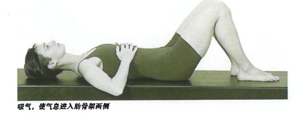
  - 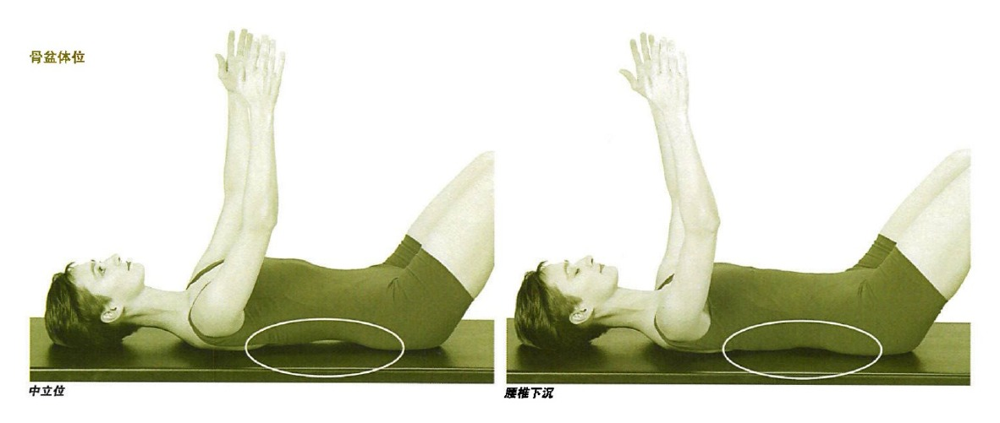
  - 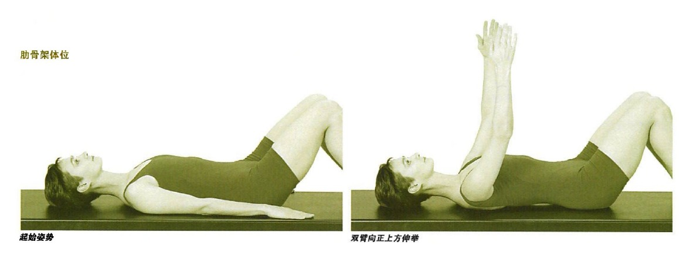
  - 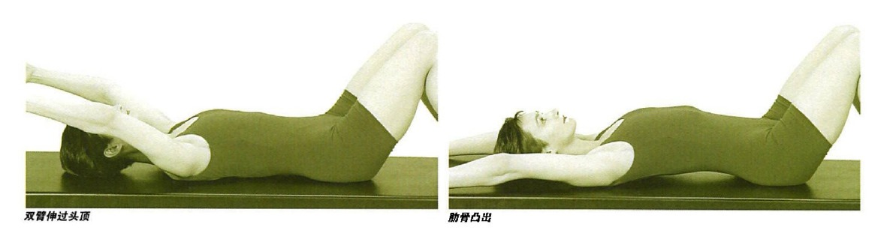
  - 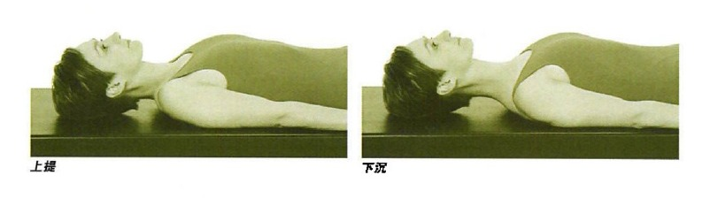
  - 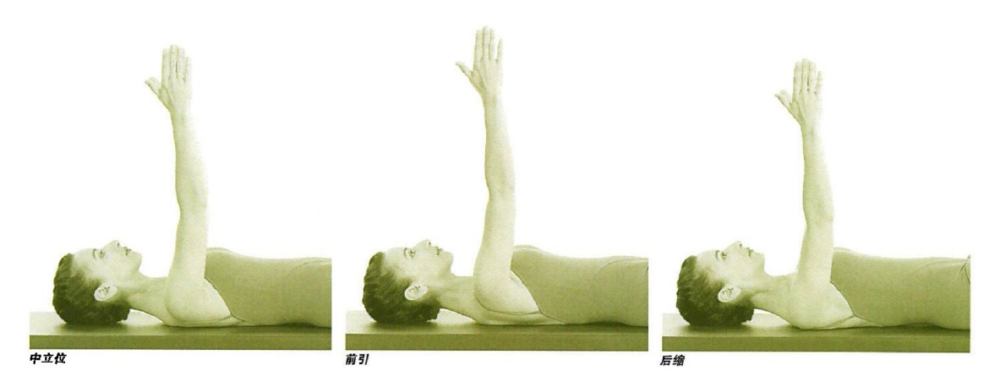
  - 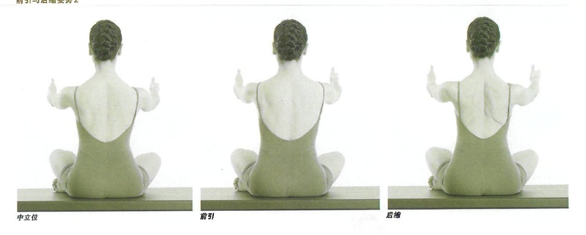
  - 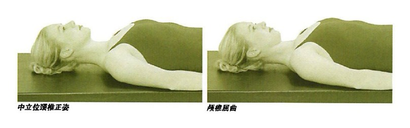
  - 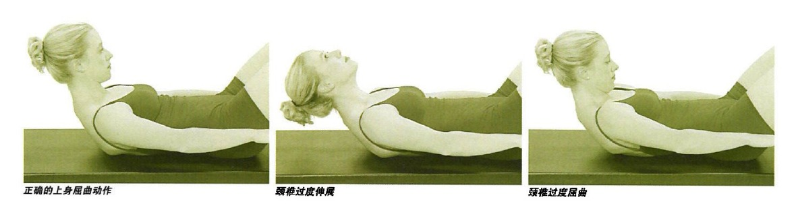
  - 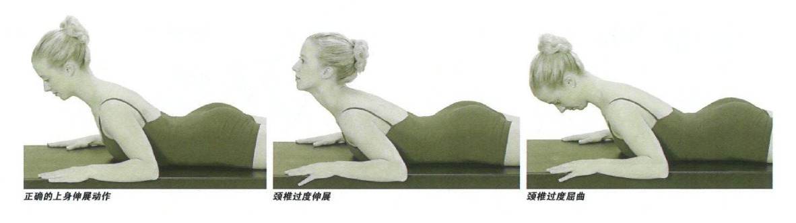

## 後卷 (Roll-Down)

- 頁碼：p.24-25
- 肌群分類：[[../muscles/core-and-lumbopelvic-stability.md|核心與腰骨盆穩定]], [[../muscles/spinal-articulation.md|脊椎屈曲、伸展與側屈]], [[../muscles/hips-and-legs.md|髖與腿：臀肌、膕繩肌、股四頭肌、內收/外展肌]], [[../muscles/scapular-stabilizers.md|肩胛穩定與斜方肌/前鋸肌]]
- 摘要：腹直肌/腹斜肌帶動脊柱屈曲，臀大肌和膕繩肌協助骨盆後部靠向股骨後部。
- OCR 原文摘錄：手臂朝前伸直，握住下卷木杆，與肩齊寬，掌心向下。肩胛骨保 目標肌肉：以腹橫肌擠壓腹部，穩定腰骨盆部位；以深層骨盆底 持穩定。 肌輔助腹模肌運動：腹直肌和腹斜肌向心收縮，實現脊柱屈曲， 練習 在完成向下捲動時離心收縮，在捲起時向心收縮：髖屈肌在向下 捲動時離心收縮：向心收縮臀大肌和膕繩肌，使骨盆後部向大腿 準備，吸氣⋯ 骨後部靠拔；肩朋骨穩定肌群 呼氣 保持肩胛骨穩定，開始時將前上棘卷離股骨前部，從而
- 動作圖：
  - 
  - 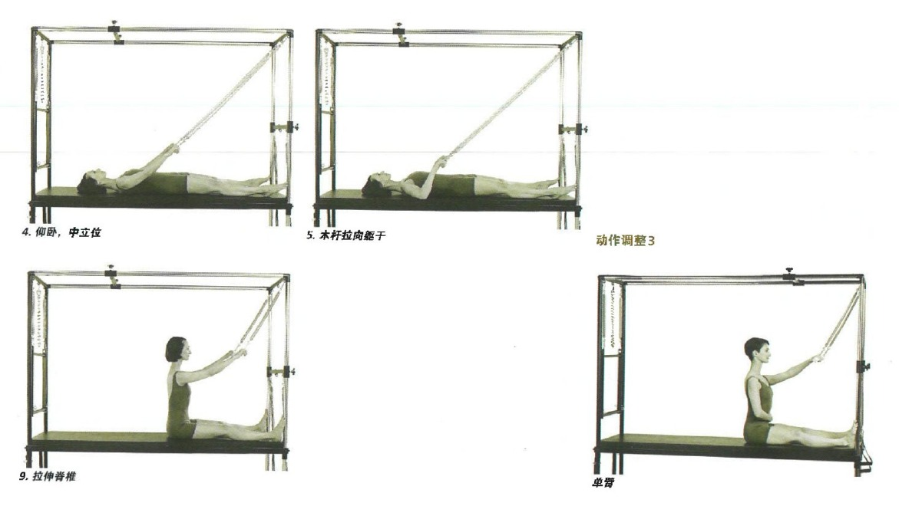

## 後卷加背部伸展準備動作 (Roll-Down with Back Extension Prep)

- 頁碼：p.26-27
- 肌群分類：[[../muscles/core-and-lumbopelvic-stability.md|核心與腰骨盆穩定]], [[../muscles/spinal-articulation.md|脊椎屈曲、伸展與側屈]], [[../muscles/scapular-stabilizers.md|肩胛穩定與斜方肌/前鋸肌]]
- 摘要：在後卷基礎上加入豎脊肌伸展與腹斜肌防止腰椎過伸。
- 器材設置：下卷木桿。
- 起始姿勢：
  呈坐姿，面向下卷木桿。骨盆和脊椎呈中立位。雙腿伸直、平行，踝背屈，雙足蹬住立柱。如果雙腿伸直時無法保持骨盆呈中立位，開始時可稍稍彎曲膝關節，隨著骨盆卷離股骨再伸展膝關節。手臂朝前伸直，握住下卷木桿，與肩齊寬，掌心向下。肩胛骨保持穩定。
- 動作流程：
  準備，吸氣。
  呼氣，保持肩胛骨固定，開始時將髂前上棘卷離股骨前部，通過屈曲將腰椎逐節下卷到墊上，直至呈平躺仰臥姿勢，骨盆和脊椎呈中立位。
  吸氣，彎曲肘關節以促進肩胛骨穩定，並且通過脊椎均勻伸展，從胸椎開始，使胸骨朝正上方伸展。
  呼氣，拉伸脊椎至中立位仰臥姿勢，同時拉伸雙臂。然後從頭開始，通過屈曲將脊椎卷離墊，通過腰椎下沉，卷動至骨盆呈豎直位，體重直接落在坐骨上。
  吸氣，拉伸脊椎，回到豎直的起始姿勢。
  重複練習 3-5 次。
- OCR 原文摘錄：準備，吸氣⋯ 目標肌肉：以腹橫肌擠壓腹部，穩定腰骨盆部位；以深層骨盆底 肌輔助腹橫肌運動：向心收縮腹直肌和腹斜肌，以使脊椎彎曲： 呼氣 保持肩胛骨固定，開始時將髂前上棘卷離股骨前部，從而 豎脊肌向心收縮以伸展脊椎；腹斜肌用以防止腰椎過度伸展：肩 通過屈曲將腰椎逐節下捲到墊上，直至呈平躺仰臥姿勢， 胛骨穩定肌群 盆骨和脊椎呈中立位。 吸氣
- 動作圖：
  - 
  - 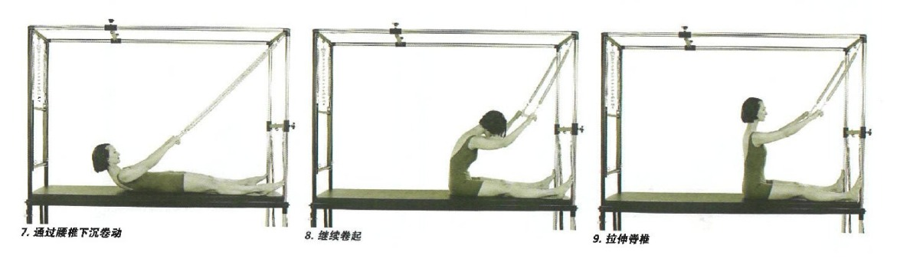

## 飛翔動作準備動作 (Airplane Prep)

- 頁碼：p.28-29
- 肌群分類：[[../muscles/core-and-lumbopelvic-stability.md|核心與腰骨盆穩定]], [[../muscles/spinal-articulation.md|脊椎屈曲、伸展與側屈]], [[../muscles/hips-and-legs.md|髖與腿：臀肌、膕繩肌、股四頭肌、內收/外展肌]]
- 摘要：強調逐節捲動、骨盆回落與腿部控制。
- OCR 原文摘錄：腿分開，與髖同寬，雙膝彎曲，勾住下卷木杆，下卷木杆夾於膽 窩間。雙踝蹠屈，腳尖輕輕繃直。 日標肌肉：以腹橫肌擠壓腹部，穩定腰骨盆部位：以深層骨盆底 肌輔助腹橫肌運動：將腳趾壓向墊時，向心收縮臀大肌和胭繩 練習 肌，並在復位時，離心收縮上述肌肉；腹直肌和腹斜肌向心收縮， 以將脊椎卷離墊，並在復位時，離心收縮上述肌肉；肩胛骨穩 準備，吸氣⋯ 定肌群 呼氣 保持骨盆呈中立位，伸展髖部，腳趾伸向墊上。
- 動作圖：
  - 
  - 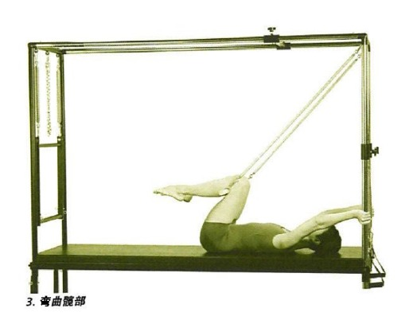
  - 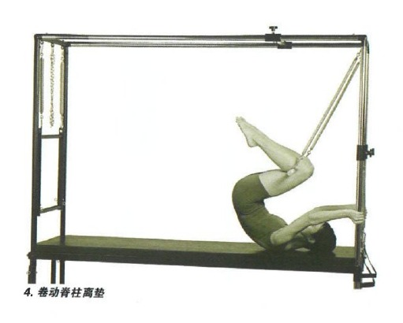
  - 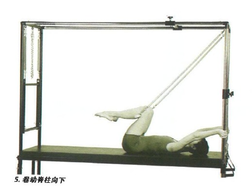

## 背闊肌下壓 (Lat Press)

- 頁碼：p.30-31
- 肌群分類：[[../muscles/lat-teres-shoulder-extension.md|背闊肌、大圓肌與肩伸展/內收]], [[../muscles/core-and-lumbopelvic-stability.md|核心與腰骨盆穩定]], [[../muscles/hips-and-legs.md|髖與腿：臀肌、膕繩肌、股四頭肌、內收/外展肌]], [[../muscles/scapular-stabilizers.md|肩胛穩定與斜方肌/前鋸肌]]
- 摘要：背闊肌和大圓肌伸展肩部；腹斜肌/豎脊肌穩定軀幹，臀大肌/膕繩肌穩定站姿骨盆。
- OCR 原文摘錄：下卷木杆掛到彈簧上。 目標肌肉：以腹橫肌擠壓腹部，穩定腰骨盆部位；以深層骨盆底 肌輔助腹橫肌運動；背闊肌和大圓肌向心收縮，以伸展肩部，復 位時離心收縮上述肌肉：豎脊肌和腹斜肌等長收縮，以穩定軀幹 起始姿勢 呈站姿，面向下卷木杆。骨盆和脊椎是中立位。以大腿骨支撐， 直立，腹斜肌特別用於在下壓下卷木杆時防止脊椎伸展；利用臀 大肌和潤繩肌使大腿骨穩定支撐骨盆；肩胛骨穩定肌群 骨盆是中立位，雙腿伸直，雙腳分開至與髖同寬。體重落在腳中 心位置。雙臂朝前伸直，達到可以維持肩胛骨穩定的高度。雙手
- 動作圖：
  - 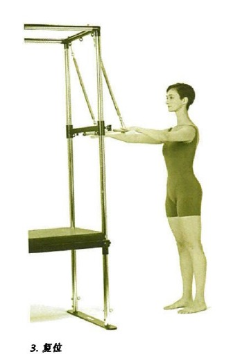
  - 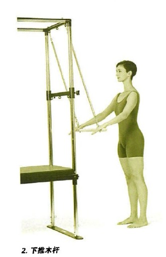
  - 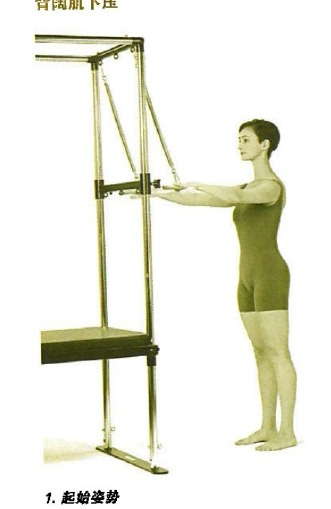
  - 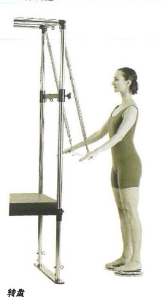
  - 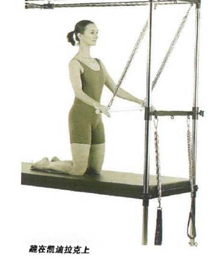

## 下壓練習 (Press Down)

- 頁碼：p.33
- 肌群分類：[[../muscles/core-and-lumbopelvic-stability.md|核心與腰骨盆穩定]], [[../muscles/scapular-stabilizers.md|肩胛穩定與斜方肌/前鋸肌]], [[../muscles/lat-teres-shoulder-extension.md|背闊肌、大圓肌與肩伸展/內收]]
- 摘要：站姿下壓，重點在肩胛與肋骨架穩定。
- OCR 原文摘錄：時鱉個腿部的穩定為重點。對於身材更高大的人士而言，增加肩 日標肌肉：以腹橫肌擠壓腹部，穩定腰骨盆部位；以深層骨盆底 部活動範圍。 肌輔助腹橫肌運動：胸大肌、背闊肌和肱三頭肌向心收縮，以將 杆下壓，復位時離心收縮上述肌肉：豎脊肌和腹斜肌等長收縮， 以穩定軀幹直立，腹斜肌特別用於在壓木杆時防止脊椎伸展；利 用臀大肌和潤絕肌使大腿骨穩定支撐骨盆；肩胛骨穩定肌群
- 動作圖：
  - 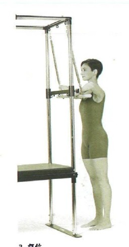
  - 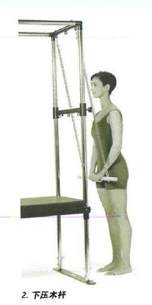
  - 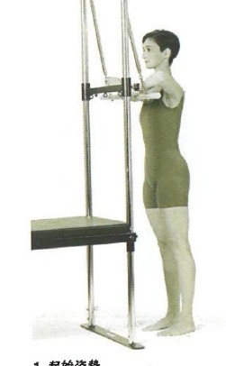

## 用肱三頭肌下壓 (Press Down with Triceps)

- 頁碼：p.34-35
- 肌群分類：[[../muscles/arms-delts-pecs.md|手臂：二頭肌、三頭肌、三角肌與胸大肌]], [[../muscles/core-and-lumbopelvic-stability.md|核心與腰骨盆穩定]], [[../muscles/hips-and-legs.md|髖與腿：臀肌、膕繩肌、股四頭肌、內收/外展肌]], [[../muscles/scapular-stabilizers.md|肩胛穩定與斜方肌/前鋸肌]]
- 摘要：肱三頭肌伸展肘關節；軀幹和站姿骨盆保持中立。
- OCR 原文摘錄：呈站姿，面朝和靠近下卷木杆。骨盆和脊椎呈中立位。以大腿骨 目標肌肉：以腹橫肌擠壓腹部，穩定腰骨盆部位；以深層骨盆底 支撐，骨盆呈中立位，雙腿伸直，雙腳分開至與髖同寬。休重落 肌輔助腹橫肌運動；肱三頭肌向心收縮，以伸展雙肘，復位時離 在腳中心位暨。雙臂朝前伸直，達到可以維持肩胛骨穩定的遠度。 心收縮上述肌肉；豎脊肌和腹斜肌等長收縮，以穩定軀幹直立， 雙手與肩齊寬，握住下卷木杆，掌心向下。肩胛骨保持穩定。 腹斜肌特別用於在壓桿時防止脊椎伸展；利用臀大肌和潤繩肌使 練習 大腿骨穩定支撐骨盆；肩胛骨穩定肌群 吸氣 保持軀幹
- 動作圖：
  - 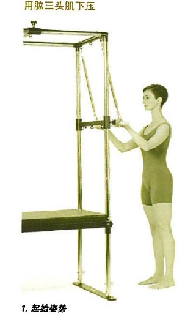
  - 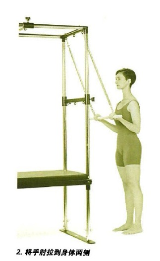
  - 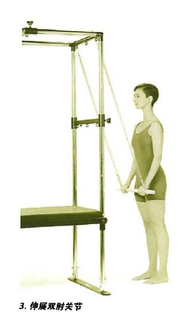
  - 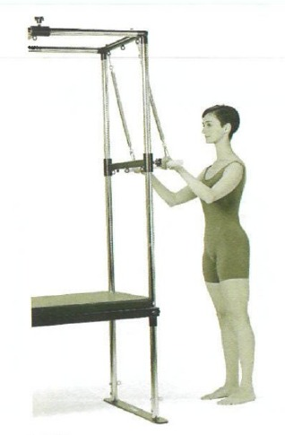
  - 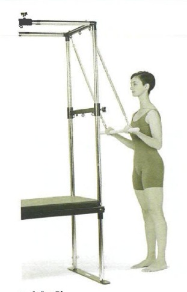
  - 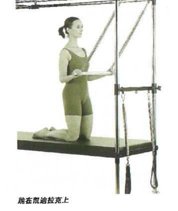

## 呼吸 (Breathing)

- 頁碼：p.36-37
- 肌群分類：[[../muscles/core-and-lumbopelvic-stability.md|核心與腰骨盆穩定]], [[../muscles/spinal-articulation.md|脊椎屈曲、伸展與側屈]], [[../muscles/hips-and-legs.md|髖與腿：臀肌、膕繩肌、股四頭肌、內收/外展肌]], [[../muscles/lat-teres-shoulder-extension.md|背闊肌、大圓肌與肩伸展/內收]]
- 摘要：捲起時腹肌和臀腿後側參與，杆下拉時背闊肌/大圓肌參與。
- 器材設置：將鞦韆彈簧連附到水平滑槓的眼鉤上，使鞦韆和鞦韆帶呈懸掛狀態。
- 起始姿勢：
  仰臥，頭部朝向下卷木桿。骨盆和脊椎呈中立位。雙腿伸直、略微外旋，雙腳牢固地勾住鞦韆帶。雙臂伸直，抓住下卷木桿，位置稍高於肩部。安置鞦韆，使雙腳置於鞦韆中時，鞦韆彈簧能夠徑直向下懸垂。肩胛骨保持穩定。
- 動作流程：
  準備，吸氣。
  呼氣，緩緩默數五個數，從尾椎骨開始，通過屈曲逐節活動脊椎離墊，直至以胸椎上部支撐身體，腰椎呈中立位，髖關節儘可能伸展。同時保持肩胛骨穩定，雙臂伸直，將桿朝髖部方向下拉。
  吸氣，緩緩默數五個數，從胸椎開始通過屈曲將脊椎逐節滾至墊上，直到呈中立位。同時控制桿返回起始位置。
  重複練習 5 次。
- 動作圖：
  - 
  - 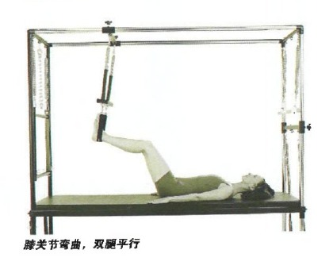

## 芭蕾伸展跪姿 (Ballet Stretches Kneeling)

- 頁碼：p.38-39
- 肌群分類：[[../muscles/mobility-and-stretching.md|柔韌與伸展：髂腰肌、膕繩肌、內收肌、腰方肌]], [[../muscles/hips-and-legs.md|髖與腿：臀肌、膕繩肌、股四頭肌、內收/外展肌]], [[../muscles/core-and-lumbopelvic-stability.md|核心與腰骨盆穩定]]
- 摘要：拉伸膕繩肌、髂腰肌和內收肌，同時用腹斜肌/豎脊肌穩定軀幹。
- OCR 原文摘錄：目標肌肉：以腹橫肌擠壓腹部，穩定腰骨盆部位；以深層骨盆底 肌輔助腹模肌運動：腹斜肌和豎脊肌等長收縮，以穩定軀幹；腿 向前方伸直時，可拉伸動作腿的膕繩肌和支撐腿的髂腰肌；向例 伸直時，可拉伸動作腿的腦繩肌和內收肌；以腹斜肌和多裂肌防 止骨盆過度轉動
- 動作圖：
  - 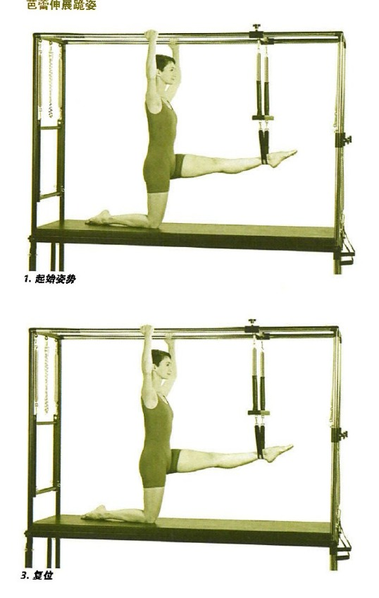
  - 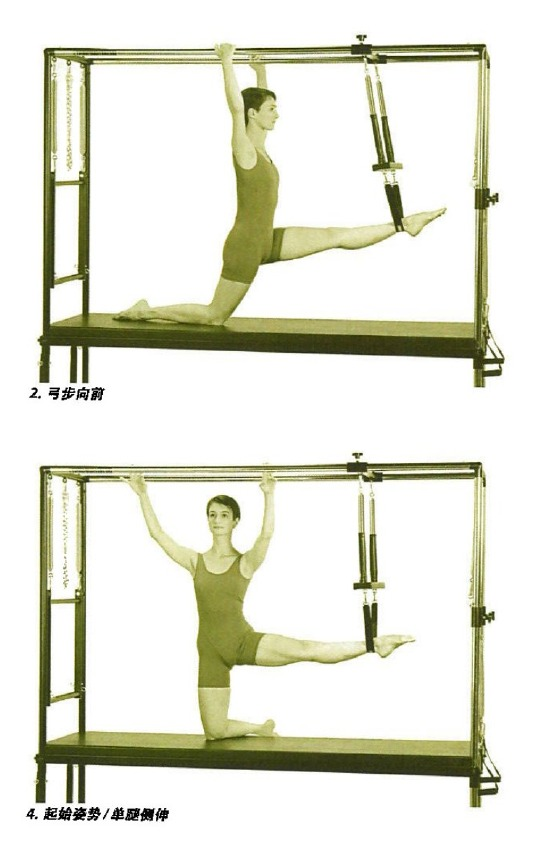
  - 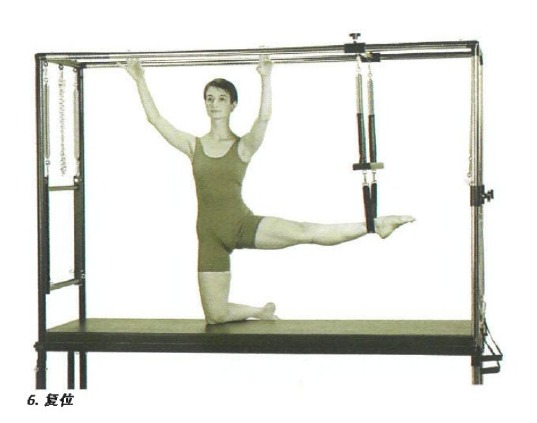
  - 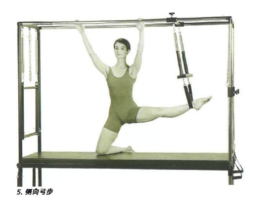

## 背闊肌下拉 (Lat Pull)

- 頁碼：p.40-41
- 肌群分類：[[../muscles/lat-teres-shoulder-extension.md|背闊肌、大圓肌與肩伸展/內收]], [[../muscles/core-and-lumbopelvic-stability.md|核心與腰骨盆穩定]], [[../muscles/scapular-stabilizers.md|肩胛穩定與斜方肌/前鋸肌]]
- 摘要：背闊肌和大圓肌下拉肱骨；肩胛穩定是主要限制條件。
- OCR 原文摘錄：下拉推拉枉。脊椎和骨盆保持中立位，雙腿交叉。雙手握住推拉框， 目標肌肉：以腹橫肌擠壓腹部，穩定腰骨盆部位：以深層骨盆底 與肩同寬，學心向軀幹，肘關節同地面保持傾斜。開始時儘量抬 肌輔助腹橫肌運動：背闊肌和大圓肌向心收縮，以下拉肱骨，復 高框體，但不抬高肩部，通常僅高過視平線即可。 位時離心收縮上述肌肉；等長收縮腹斜肌和豎脊肌，以穩定軀幹； 肩胛骨穩定肌群
- 動作圖：
  - 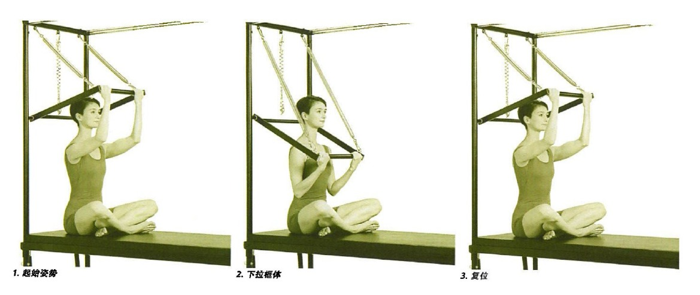
  - 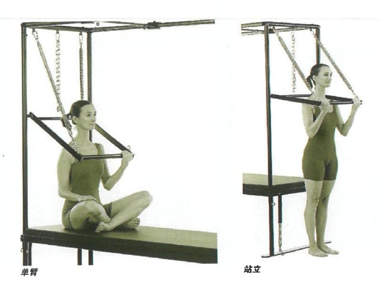

## 肩胛骨孤立練習 (Scapula Isolation)

- 頁碼：p.42-43
- 肌群分類：[[../muscles/scapular-stabilizers.md|肩胛穩定與斜方肌/前鋸肌]], [[../muscles/core-and-lumbopelvic-stability.md|核心與腰骨盆穩定]]
- 摘要：肩胛前引/後縮，強調肩胛貼肋骨架與頸椎穩定。
- 器材設置：推拉框上面彈簧動作。1 根或 2 根彈簧；練習期間需由受過訓練的專業人員監督並手扶推拉框。
- 起始姿勢：
  仰臥，頭部朝向推拉框。擺正位置，以便雙臂伸直時框體與肩齊高。骨盆和脊椎呈中立位。雙腿內收，膝關節彎曲；腿可伸直，但骨盆必須保持中立位。雙臂伸直，雙手握住推拉框，與肩同寬。掌心背對臉，肩胛骨保持穩定。
- 動作流程：
  吸氣，雙臂伸直，脊椎呈中立位，肩胛骨前引，使框隨之升起 1-2 英寸。
  呼氣，雙臂伸直，脊椎呈中立位，後縮肩胛骨至中立位，躺在墊上，將框下拉 1-2 英寸。
  重複練習 5-10 次。
  反向練習：吸氣，保持雙臂伸直，脊椎呈中立位，後縮肩胛骨，將框稍稍落下。呼氣，保持雙臂伸直，脊椎呈中立位，前引肩胛骨至中立位，將框稍稍抬起。重複練習 5-10 次。
- 動作圖：
  - 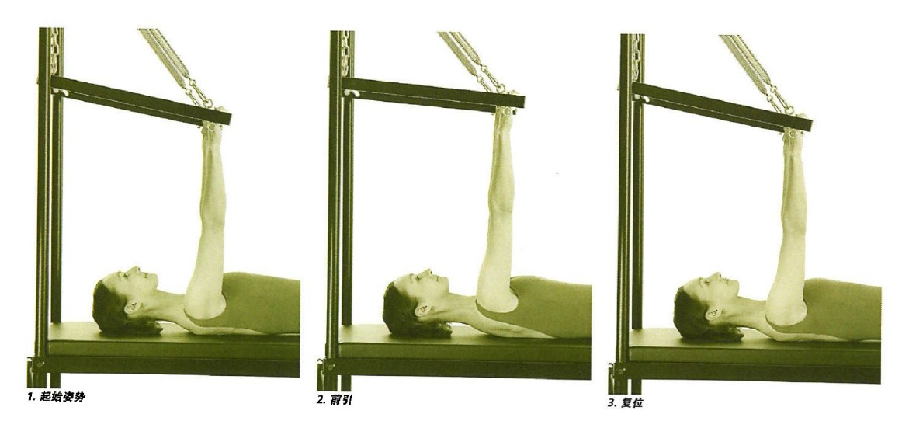
  - 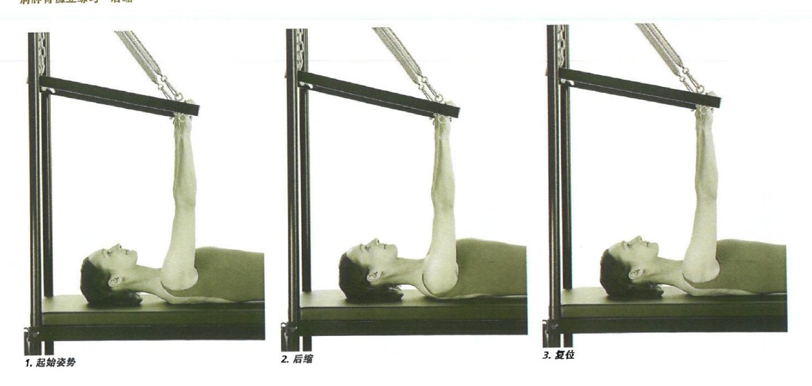

## 下拉 (Pull Down)

- 頁碼：p.44-45
- 肌群分類：[[../muscles/arms-delts-pecs.md|手臂：二頭肌、三頭肌、三角肌與胸大肌]], [[../muscles/scapular-stabilizers.md|肩胛穩定與斜方肌/前鋸肌]], [[../muscles/core-and-lumbopelvic-stability.md|核心與腰骨盆穩定]]
- 摘要：二頭肌和後三角肌拉框，肩胛骨需避免上提或外翻。
- OCR 原文摘錄：掌心背對臉，肩胛骨保持穩定。 目標肌肉：以腹橫肌擠壓腹部，穩定腰骨盆部位：以深層骨盆底 肌輔助腹橫肌運動；下拉框時，向心收縮二頭肌和後側三角肌， 復位時，離心收縮上述肌肉；肩胛骨穩定肌群
- 動作圖：
  - 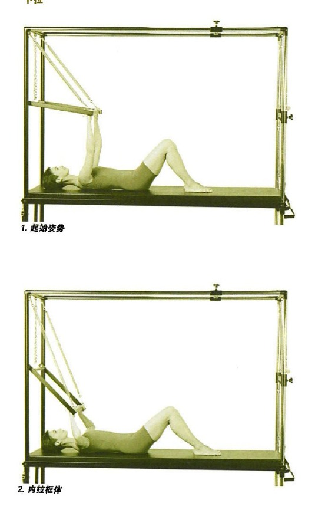
  - 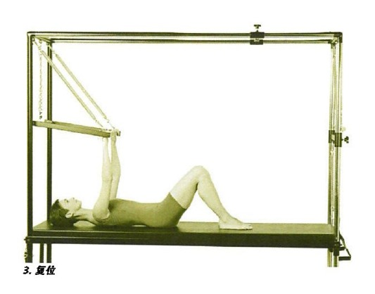
  - 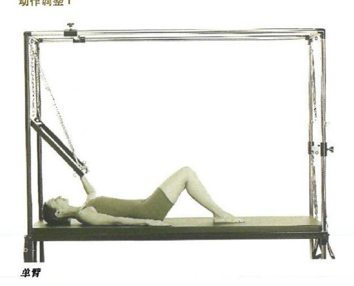
  - 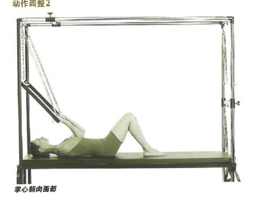

## 仰臥推拉練習 (Push-Thru on Back)

- 頁碼：p.46-47
- 肌群分類：[[../muscles/arms-delts-pecs.md|手臂：二頭肌、三頭肌、三角肌與胸大肌]], [[../muscles/scapular-stabilizers.md|肩胛穩定與斜方肌/前鋸肌]], [[../muscles/core-and-lumbopelvic-stability.md|核心與腰骨盆穩定]]
- 摘要：二頭肌/後三角肌下拉，三角肌/肱三頭肌推過頭。
- OCR 原文摘錄：目標肌肉：以腹橫肌擠壓腹部，穩定腰骨盆部位；以深層骨盆底 肌輔助腹橫肌運動；下拉框時，向心收縮二頭肌和後例三角肌： 上壓過頭時，向心收縮三角肌和肱三頭肌，將框復位到前額時， 離心收縮上述肌肉；肩胛骨穩定肌群
- 動作圖：
  - 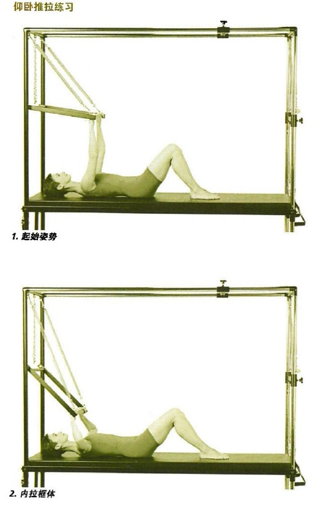
  - 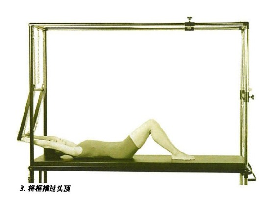
  - 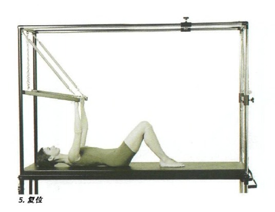
  - 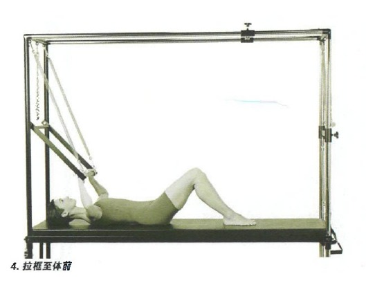

## 仰臥推拉加捲曲上提練習 (Push-Thru on Back with Roll Up)

- 頁碼：p.48-49
- 肌群分類：[[../muscles/core-and-lumbopelvic-stability.md|核心與腰骨盆穩定]], [[../muscles/spinal-articulation.md|脊椎屈曲、伸展與側屈]], [[../muscles/arms-delts-pecs.md|手臂：二頭肌、三頭肌、三角肌與胸大肌]], [[../muscles/scapular-stabilizers.md|肩胛穩定與斜方肌/前鋸肌]]
- 摘要：上肢推拉與腹直肌/腹斜肌捲起結合。
- 動作圖：
  - 
  - 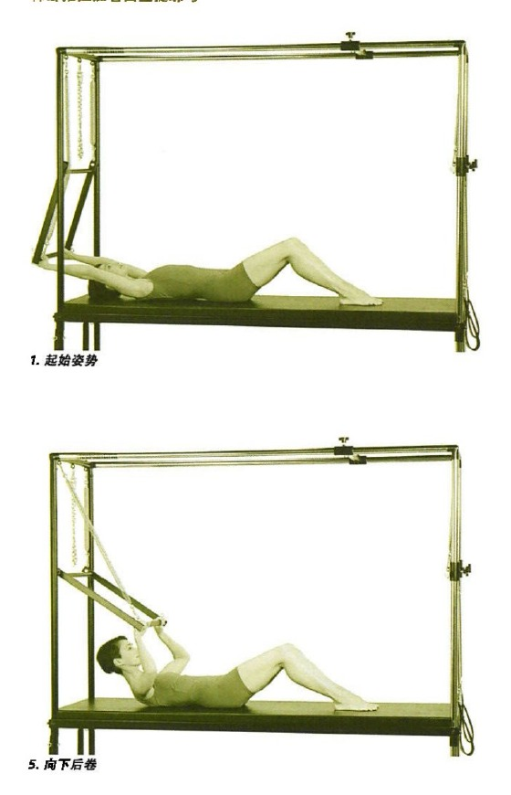
  - 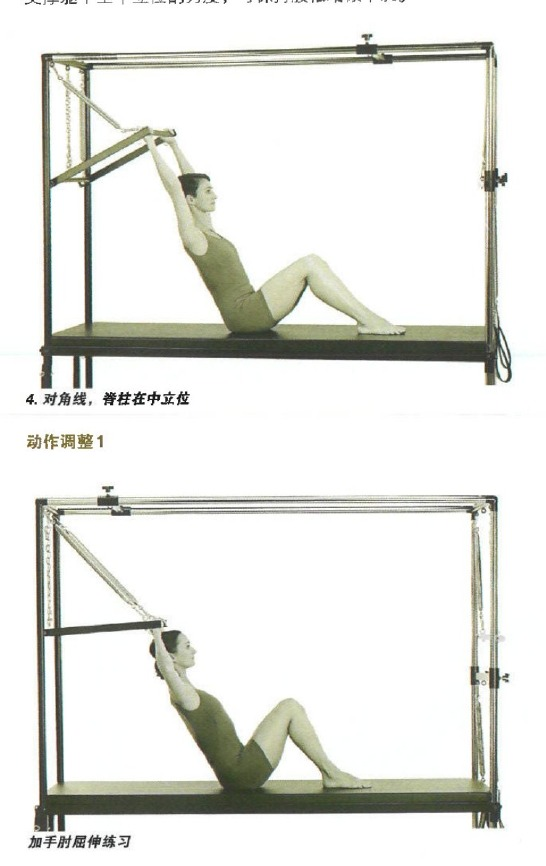
  - 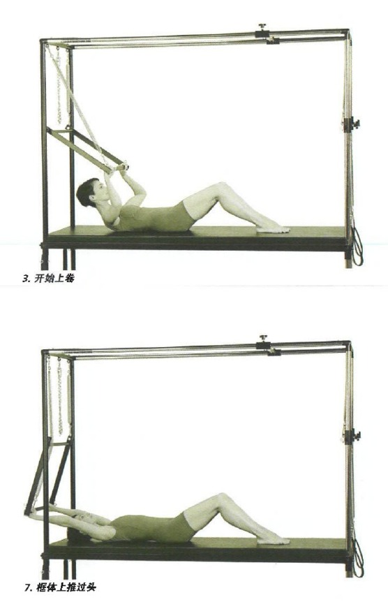

## 平行伸展準備動作 (Teaser Prep)

- 頁碼：p.50-51
- 肌群分類：[[../muscles/core-and-lumbopelvic-stability.md|核心與腰骨盆穩定]], [[../muscles/spinal-articulation.md|脊椎屈曲、伸展與側屈]], [[../muscles/arms-delts-pecs.md|手臂：二頭肌、三頭肌、三角肌與胸大肌]], [[../muscles/scapular-stabilizers.md|肩胛穩定與斜方肌/前鋸肌]]
- 摘要：以彈簧輔助脊椎屈曲，腹肌控制骨盆後傾和腿部抬放。
- OCR 原文摘錄：夢點 目標肌肉：以腹橫肌擠壓腹部，穩定腰骨盆部位；以深層骨盆底 ，在脊椎逐節活動全程和肘關節屈曲伸展時保持肩胛骨穩定，以 肌輔助腹橫肌運動：柱越過頭頂時，肱三頭肌和三角肌向心收縮， 便於使用彈簧協助脊椎屈曲 返回時離心收縮：將框拉向前額時，二頭肌向心收縮；腹直肌和 •通過骨盆後傾捲起及回落；僅在骨盆後傾後將腳趾抬離墊，且 腹斜肌向心收縮，引發彎曲，上身在墊上後卷時離心收縮；將腿 僅在腰椎下沉後將腳趾放回墊 拉向身體時，髖屈肌向心收縮，骨盆卷離股骨時離心收縮 ，保持V形姿勢平衡時，保持腰椎的略微屈曲，體重置於坐骨上
- 動作圖：
  - 
  - 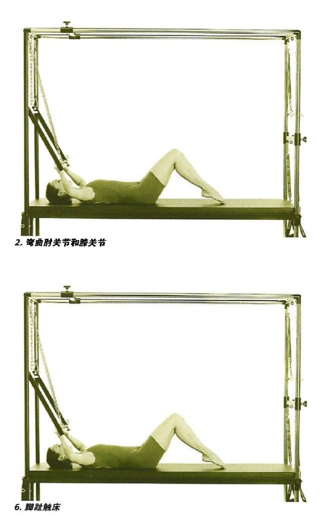
  - 
  - 

## 貓背準備動作 (Cat Prep)

- 頁碼：p.52-53
- 肌群分類：[[../muscles/core-and-lumbopelvic-stability.md|核心與腰骨盆穩定]], [[../muscles/spinal-articulation.md|脊椎屈曲、伸展與側屈]], [[../muscles/lat-teres-shoulder-extension.md|背闊肌、大圓肌與肩伸展/內收]], [[../muscles/hips-and-legs.md|髖與腿：臀肌、膕繩肌、股四頭肌、內收/外展肌]], [[../muscles/scapular-stabilizers.md|肩胛穩定與斜方肌/前鋸肌]]
- 摘要：脊椎屈曲/伸展、背闊肌維持框壓力，臀大肌/膕繩肌協助骨盆控制。
- OCR 原文摘錄：肩同寬。肩胛骨保持穩定。 目標肌肉：以腹橫肌擠壓腹部，穩定腰骨盆部位；以深層骨盆底 肌輔助腹橫肌運動；脊柱彎曲時腹直肌和腹斜肌向心收縮，在 練習 脊椎偉展時離心收縮；背闊肌用以維持雙臂對框的壓力；向心收 吸氣 穩定軀幹，將骨盆後傾至股骨，從頭部到尾椎骨保持呈一 縮臀大肌和腥繩肌，使骨盆後部向大腿骨後部靠攏；肩胛骨穩 條直線。同時，活動肩胛骨穩定肌群，將框輕輕下拉。 定肌群 呼氣 從頭部開始，將脊椎逐節屈曲，將框朝立柱下拉。
- 動作圖：
  - 
  - 

## 天鵝潛水 (Swan Dive)

- 頁碼：p.54-55
- 肌群分類：[[../muscles/spinal-articulation.md|脊椎屈曲、伸展與側屈]], [[../muscles/hips-and-legs.md|髖與腿：臀肌、膕繩肌、股四頭肌、內收/外展肌]], [[../muscles/scapular-stabilizers.md|肩胛穩定與斜方肌/前鋸肌]]
- 摘要：豎脊肌背伸展，腹斜肌限制腰椎過伸，臀大肌/膕繩肌維持骨盆。
- OCR 原文摘錄：幫動，且手扶推拉框。教練不能把身體靠向框體。 目標肌肉：以腹橫肌擠壓腹部，穩定腰骨盆部位；以深層骨盆底 1棍彈簧 肌輔助腹橫肌運動；脊椎伸展時，向心收縮豎脊肌，復位時離心
- 動作圖：
  - 
  - 
  - 

## 俯臥推拉加後背伸展 (Push-Thru on Stomach with Back Extension Prep)

- 頁碼：p.56-57
- 肌群分類：[[../muscles/spinal-articulation.md|脊椎屈曲、伸展與側屈]], [[../muscles/lat-teres-shoulder-extension.md|背闊肌、大圓肌與肩伸展/內收]], [[../muscles/arms-delts-pecs.md|手臂：二頭肌、三頭肌、三角肌與胸大肌]], [[../muscles/scapular-stabilizers.md|肩胛穩定與斜方肌/前鋸肌]]
- 摘要：中上部豎脊肌伸展，背闊肌/大圓肌/二頭肌帶框至腦後。
- 動作圖：
  - 
  - 
  - 

## 雙臂向後 (Arms Backward)

- 頁碼：p.58
- 肌群分類：[[../muscles/arms-delts-pecs.md|手臂：二頭肌、三頭肌、三角肌與胸大肌]], [[../muscles/core-and-lumbopelvic-stability.md|核心與腰骨盆穩定]], [[../muscles/scapular-stabilizers.md|肩胛穩定與斜方肌/前鋸肌]]
- 摘要：前三角肌、二頭肌、胸大肌在向後擺動時離心控制，腹肌維持 C 曲線。
- OCR 原文摘錄：幫助，且手扶推拉框。教練不能把身體靠向框體。 目標肌肉：以腹橫肌擠壓腹部，穩定腰骨盆部位；以深層骨盆底 1根彈簧 肌輔助腹橫肌運動：向後擺動時，前三角肌、二頭肌和胸大肌離
- 動作圖：
  - 

## 手臂側拉 (Side Arm Pull)

- 頁碼：p.59
- 肌群分類：[[../muscles/lat-teres-shoulder-extension.md|背闊肌、大圓肌與肩伸展/內收]], [[../muscles/core-and-lumbopelvic-stability.md|核心與腰骨盆穩定]], [[../muscles/scapular-stabilizers.md|肩胛穩定與斜方肌/前鋸肌]]
- 摘要：背闊肌和大圓肌下拉肱骨，腹斜肌/豎脊肌避免側屈。
- 動作圖：
  - 

## 美人魚姿 (Mermaid)

- 頁碼：p.60-61
- 肌群分類：[[../muscles/mobility-and-stretching.md|柔韌與伸展：髂腰肌、膕繩肌、內收肌、腰方肌]], [[../muscles/spinal-articulation.md|脊椎屈曲、伸展與側屈]], [[../muscles/core-and-lumbopelvic-stability.md|核心與腰骨盆穩定]], [[../muscles/lat-teres-shoulder-extension.md|背闊肌、大圓肌與肩伸展/內收]]
- 摘要：腹斜肌控制側屈，背闊肌/大圓肌控制手臂下拉，骨盆保持穩定。
- OCR 原文摘錄：框最近的手臂握住框體略比肩部靠前，掌心向下；另外一隻手臂 目標肌肉；以腹橫肌擠壓腹部，穩定腰骨盆部位；以深層骨盆底 側方放鬆，掌心向上。肩胛骨保持穩定。 肌輔助腹橫肌運動：以腹斜肌和豎脊肌避免脊椎伸展或向前屈曲； 以腹斜肌和多裂肌避免旋轉；距離推拉最近的體側腹斜肌向心 練習 收縮，以側向彎曲軀幹；另外一側的腹斜肌離心收縮，以控制末 保持肩胛骨穩定，向框彎曲臂的肘關節，以將框拉下。同時， 段範圍：返回時，向心收縮；手臂下拉時，背闊肌和大圓肌向心 將另一個手臂伸過頭頂。 收縮，手臂伸長時，離心收縮：肩胛骨穩定肌群 呼氣
- 動作圖：
  - 
  - 
  - 
  - 

## 推拉向前 (Forward Push-Thru)

- 頁碼：p.62-63
- 肌群分類：[[../muscles/core-and-lumbopelvic-stability.md|核心與腰骨盆穩定]], [[../muscles/spinal-articulation.md|脊椎屈曲、伸展與側屈]], [[../muscles/lat-teres-shoulder-extension.md|背闊肌、大圓肌與肩伸展/內收]], [[../muscles/scapular-stabilizers.md|肩胛穩定與斜方肌/前鋸肌]]
- 摘要：腹直肌/腹斜肌使脊椎彎曲，背闊肌/大圓肌下壓框並穩定肩。
- OCR 原文摘錄：目標肌肉：以腹橫肌擠壓腹部，穩定腰骨盆部位；以深層骨盆 練習 底肌輔助腹橫肌運動；向心收縮腹直肌和腹斜肌：以使脊椎彎 吸氣 開始時將髂前上棘卷離股骨前部，捲曲幅度至坐骨後側， 曲：背渴肌和大圓肌用以將框下壓以及幫助穩定雙肩：肩胛骨穩 保持雙臂伸直和肩胛骨穩定，從而將框下拉。 定肌群 呼氣 從頭部開始，朝前逐節彎曲脊椎，將框拉伸，以腹肌保持 腰椎支撐。 向上捲曲時，按照從尾椎骨到頭部的順序逐節活動脊椎 推拉向前 1.
- 動作圖：
  - 
  - 
  - 
  - 

## 肩胛骨孤立練習（下面彈簧） (Scapula Isolation)

- 頁碼：p.64-65
- 肌群分類：[[../muscles/scapular-stabilizers.md|肩胛穩定與斜方肌/前鋸肌]], [[../muscles/core-and-lumbopelvic-stability.md|核心與腰骨盆穩定]]
- 摘要：前鋸肌為重點的肩胛前引/後縮控制。
- 動作圖：
  - 
  - 

## 胸推動作 (Chest Press)

- 頁碼：p.66-67
- 肌群分類：[[../muscles/arms-delts-pecs.md|手臂：二頭肌、三頭肌、三角肌與胸大肌]], [[../muscles/scapular-stabilizers.md|肩胛穩定與斜方肌/前鋸肌]], [[../muscles/core-and-lumbopelvic-stability.md|核心與腰骨盆穩定]]
- 摘要：肱三頭肌和胸大肌上推框，肩胛骨保持貼合肋骨架。
- OCR 原文摘錄：幫助，且手扶推拉框。教練不能把身體靠向框體。 目標肌肉：以腹橫肌擠壓腹部，穩定腰骨盆部位；以深層骨盆底 2根彈簧 肌輔助腹橫肌運動；向心收縮肱三頭肌和胸大肌將框上推，復位 時，離心收縮上述肌肉；肩胛骨穩定肌群
- 動作圖：
  - 
  - 
  - 

## 腿部推拉 (Leg Presses)

- 頁碼：p.68-69
- 肌群分類：[[../muscles/hips-and-legs.md|髖與腿：臀肌、膕繩肌、股四頭肌、內收/外展肌]], [[../muscles/core-and-lumbopelvic-stability.md|核心與腰骨盆穩定]]
- 摘要：腓腸肌/比目魚肌蹠屈，股四頭肌伸膝，並維持髖膝踝足正位。
- OCR 原文摘錄：夠伸展膝關節，拉伸腦繩肌，但骶骨完全位於墊上。腳蹠球部牢 目標肌肉：以腹橫肌擠壓腹部，穩定腰骨盆部位；以深層骨盆底 固托住推拉框，踝背屈，膝關節彎曲，雙腿內收並保持平行。膝 肌輔助腹橫肌運動：腓腸肌和比目魚肌向心收縮，以帶動腳躁蹠 關節彎曲和腰椎駕曲時，骶骨部位可以卷離墊。雙臂置於身體兩 屈，背屈時離心收縮上述肌肉；膝關節伸展時，股四頭肌向心收縮， 側，掌心向下。 膝關節復位時，股四頭肌離心收縮
- 動作圖：
  - 
  - 
  - 

## 仰臥二頭肌捲曲 (Biceps Curls Supine)

- 頁碼：p.70-71
- 肌群分類：[[../muscles/arms-delts-pecs.md|手臂：二頭肌、三頭肌、三角肌與胸大肌]], [[../muscles/scapular-stabilizers.md|肩胛穩定與斜方肌/前鋸肌]], [[../muscles/core-and-lumbopelvic-stability.md|核心與腰骨盆穩定]]
- 摘要：二頭肌屈肘，肩胛穩定與軀幹穩定不可丟。
- OCR 原文摘錄：滑槓的眼鉤，並將泡沫拉環連線到彈簧上。 目標肌肉：以腹橫肌擠壓腹部，穩定腰骨盆部位；以深層骨盆底 肌輔助腹橫肌運動；向心收縮二頭肌以彎曲雙肘，復位時，離心
- 動作圖：
  - 
  - 
  - 
  - 

## 中背部系列動作 (Midback Series)

- 頁碼：p.72-77
- 肌群分類：[[../muscles/arms-delts-pecs.md|手臂：二頭肌、三頭肌、三角肌與胸大肌]], [[../muscles/scapular-stabilizers.md|肩胛穩定與斜方肌/前鋸肌]], [[../muscles/core-and-lumbopelvic-stability.md|核心與腰骨盆穩定]]
- 摘要：肱三頭肌下壓、雙臂伸直下壓、45 度、側面、畫弧；共同強調腹斜肌和肩胛穩定。
- 動作圖：
  - 
  - 
  - 
  - 
  - 
  - 
  - 
  - 
  - 
  - 
  - 
  - 

## 後劃準備動作 (Back Rowing Preps)

- 頁碼：p.78-87
- 肌群分類：[[../muscles/lat-teres-shoulder-extension.md|背闊肌、大圓肌與肩伸展/內收]], [[../muscles/arms-delts-pecs.md|手臂：二頭肌、三頭肌、三角肌與胸大肌]], [[../muscles/core-and-lumbopelvic-stability.md|核心與腰骨盆穩定]], [[../muscles/spinal-articulation.md|脊椎屈曲、伸展與側屈]], [[../muscles/scapular-stabilizers.md|肩胛穩定與斜方肌/前鋸肌]]
- 摘要：後劃、開肘、飛翔、二頭肌、三頭肌和後卷變化；同時訓練後側肩帶與軀幹控制。
- OCR 原文摘錄：［練習1-5］
- 動作圖：
  - 
  - 
  - 
  - 
  - 
  - 
  - 
  - 
  - 
  - 
  - 
  - 
  - 
  - 
  - 
  - 
  - 
  - 
  - 
  - 

## 前劃準備動作 (Front Rowing Preps)

- 頁碼：p.88-91
- 肌群分類：[[../muscles/arms-delts-pecs.md|手臂：二頭肌、三頭肌、三角肌與胸大肌]], [[../muscles/core-and-lumbopelvic-stability.md|核心與腰骨盆穩定]], [[../muscles/scapular-stabilizers.md|肩胛穩定與斜方肌/前鋸肌]], [[../muscles/spinal-articulation.md|脊椎屈曲、伸展與側屈]]
- 摘要：向前伸直、第二種姿勢、雙手上託；前方肩帶動作配合中立坐姿。
- OCR 原文摘錄：以腹橫肌擠壓腹部，穩定腰骨盆部位；以深層骨盆底 • 始終保持穩定 肌輔助腹橫肌運動；利用豎脊肌、腹直肌和腹斜肌等長收縮以穩 • 保持腹肌收緊，以保持中立位坐姿 定軀幹：後方阻力使腹肌得到鍛鍊；腹斜肌和多裂肌用以防止旋 轉；後方阻力也使肩胛骨穩定肌（特別是前鋸肌）得到鍛鍊 •豎脊肌保持收緊，以避免脊椎彎曲 ［1］向心收縮前三角肌和胸大肌，使雙肩彎曲；雙肩復位時，離心 • 避免肋骨架上提或前傾 收縮上述肌肉 •避免“卡緊”或過度伸展雙肘 ［2］向心收縮前三角肌、胸大肌和嚎肱肌，使雙臂水平內收，雙臂 • 手腕始終保持伸展
- 動作圖：
  - 
  - 
  - 
  - 
  - 
  - 
  - 
  - 

## 下、中、上斜方肌強化 (Lower, Middle, Upper Trap Strengthener)

- 頁碼：p.92-93
- 肌群分類：[[../muscles/scapular-stabilizers.md|肩胛穩定與斜方肌/前鋸肌]], [[../muscles/core-and-lumbopelvic-stability.md|核心與腰骨盆穩定]], [[../muscles/hips-and-legs.md|髖與腿：臀肌、膕繩肌、股四頭肌、內收/外展肌]]
- 摘要：以不同阻力方向強化斜方肌纖維，同時保持站姿骨盆和軀幹穩定。
- 器材設置：將臂用彈簧連附到眼鉤上，將泡沫拉環連線到彈簧上。上斜方肌使用立柱底部眼鉤；中斜方肌將垂直滑槓調至站立時與肩同高並使用槓上眼鉤；下斜方肌可拆下下卷木桿，將臂用彈簧連線到立柱頂部支桿眼鉤。
- 起始姿勢：
  呈站姿，面朝垂直滑槓，雙腳分開與髖同寬。骨盆和脊椎呈中立位。雙臂朝前伸直，掌心向下。肩部打開，肩胛骨保持穩定。
- 動作流程：
  上斜方肌：
  準備，吸氣。
  呼氣，保持肩胛骨穩定，肘關節向後上方彎曲。吸氣，伸展肘關節，向下和向前伸展雙臂，控制彈簧返回。
  中斜方肌：
  準備，吸氣。
  呼氣，保持肩胛骨穩定，彎曲肘關節，向外和向後。吸氣，伸展肘關節，雙臂前伸，控制彈簧返回。
  下斜方肌：
  準備，吸氣。
  呼氣，保持肩胛骨穩定，彎曲肘關節，向下和向後。吸氣，伸展肘關節，向上和向前伸展雙臂，控制彈簧返回。
  各組重複練習 10 次。
- OCR 原文摘錄：立位。雙臂朝前伸直，掌心向下。肩部開啟，保持肩胛骨穩定。 目標肌肉：以腹橫肌擠壓腹部，穩定腰骨盆部位；以深層骨盆底 肌輔助腹憤肌運動；利用臀大肌和膕繩肌使大腿骨穩定支撐骨盆； 練習 等長收縮腹斜肌和豎脊肌群穩定軀幹，而前方阻力則使豎脊肌群 上斜方肌 得到鍛鍊；腹斜肌和多裂肌用以防止旋轉 準備，吸氣⋯ ［斜方肌］阻力來自下方時，加強上斜方肌，以穩定肩胛骨；阻力 來自中間部位時，以中斜方肌穩定肩胛骨；阻力來自上方時，以 呼氣 保持肩胛骨穩定，肘關節向後上方分彎曲。 下斜方肌穩定肩胛骨；後拉時向心收縮，返回時離心收縮 吸
- 動作圖：
  - 

## 胸部擴張 (Chest Expansion / Pulses)

- 頁碼：p.95-97
- 肌群分類：[[../muscles/lat-teres-shoulder-extension.md|背闊肌、大圓肌與肩伸展/內收]], [[../muscles/scapular-stabilizers.md|肩胛穩定與斜方肌/前鋸肌]], [[../muscles/core-and-lumbopelvic-stability.md|核心與腰骨盆穩定]], [[../muscles/hips-and-legs.md|髖與腿：臀肌、膕繩肌、股四頭肌、內收/外展肌]]
- 摘要：背闊肌、大圓肌、後三角肌伸展肩部；臀大肌/膕繩肌穩定站姿骨盆。
- OCR 原文摘錄：以腹橫肌擠壓腹部，確定腰骨盆部位：以深層骨盆底 肌輔助腹橫肌運動；利用臀大肌和膕繩肌使大腿骨穩定支撐骨盆； 星站姿，面朝垂直滑槓，雙腳分開，與豌同寬。骨盆和脊椎呈中 立位。雙臂向下伸直，略置於體前，抓住拉環，學心向後。肩胛 等長收縮腹斜肌和豎脊肌群穩定軀幹，而前方阻力則使豎脊肌群 骨保持穩定。 得到鍛鍊；腹斜肌和多裂肌用以防止旋轉；向心收縮背闊肌、大 圓肌和後三角肌，以使肩部伸展，肩部復位時，離心收縮上述肌肉； 練習 前方阻力也使肩胛骨穩定肌群（尤其是斜方肌和萎形肌）得到鍛鍊 準備，吸氣⋯
- 動作圖：
  - 
  - 
  - 
  - 
  - 
  - 

## 雙臂側展 (Arms Sideways)

- 頁碼：p.98-99
- 肌群分類：[[../muscles/arms-delts-pecs.md|手臂：二頭肌、三頭肌、三角肌與胸大肌]], [[../muscles/scapular-stabilizers.md|肩胛穩定與斜方肌/前鋸肌]], [[../muscles/core-and-lumbopelvic-stability.md|核心與腰骨盆穩定]], [[../muscles/hips-and-legs.md|髖與腿：臀肌、膕繩肌、股四頭肌、內收/外展肌]]
- 摘要：肩部側向運動，重點在肩胛與站姿軀幹穩定。
- OCR 原文摘錄：4.跪在凱迪拉克床上或地板上。著重以髖關節保持穩定而非站立 ◎ 這標肌肉：以腹橫肌擠壓腹部，穩定腰骨盆部位；以深層骨盆底 時整個腿部的穩定為重點。 肌輔助腹橫肌運動；利用臀大肌和膕繩肌使大腿骨穩定支撐骨盆； 利用腹斜肌和豎脊肌群穩定軀幹，而前方阻力則使豎脊肌群得到 鍛鍊；腹斜肌和多裂肌用以防止旋轉；向心收縮後三角肌，以向 後壓，復位時，離心收縮上述肌肉；利用三角肌，將雙臂穩定在 持續高度位置：前方阻力也使肩胛骨穩定肌群（尤其是斜方肌和菱 形肌）得到鍛鍊
- 動作圖：
  - 
  - 
  - 
  - 

## 二頭肌捲曲（站姿） (Biceps Curls)

- 頁碼：p.100-101
- 肌群分類：[[../muscles/arms-delts-pecs.md|手臂：二頭肌、三頭肌、三角肌與胸大肌]], [[../muscles/scapular-stabilizers.md|肩胛穩定與斜方肌/前鋸肌]], [[../muscles/core-and-lumbopelvic-stability.md|核心與腰骨盆穩定]], [[../muscles/hips-and-legs.md|髖與腿：臀肌、膕繩肌、股四頭肌、內收/外展肌]]
- 摘要：二頭肌屈肘，腹斜肌/多裂肌防旋轉，下斜方肌/背闊肌防止肩上提。
- 器材設置：將臂用彈簧連線到立柱底部。將泡沫拉環連線到彈簧上。
- 起始姿勢：
  呈站姿，面朝垂直滑槓，雙腳分開與髖同寬。骨盆和脊椎呈中立位。雙臂伸直，置於體側，抓住拉環，掌心向前。肩胛骨保持穩定。
- 動作流程：
  準備，吸氣。
  呼氣，保持肩胛骨穩定，保持肱骨靜止不動，彎曲肘關節，將雙手拉向雙肩。
  吸氣，保持肩胛骨穩定，保持肱骨靜止不動，伸展肘關節，控制彈簧返回。
  重複練習 10 次。
- OCR 原文摘錄：簧上。 目標肌肉：以腹橫肌擠壓腹部，穩定腰骨盆部位：以深層骨盆底 肌輔助腹橫肌運動：以臀大肌和膕繩肌通過大腿骨支撐骨盆穩定
- 動作圖：
  - 
  - 
  - 

## 肱三頭肌下壓（站姿） (Triceps Press)

- 頁碼：p.102-103
- 肌群分類：[[../muscles/arms-delts-pecs.md|手臂：二頭肌、三頭肌、三角肌與胸大肌]], [[../muscles/scapular-stabilizers.md|肩胛穩定與斜方肌/前鋸肌]], [[../muscles/core-and-lumbopelvic-stability.md|核心與腰骨盆穩定]], [[../muscles/hips-and-legs.md|髖與腿：臀肌、膕繩肌、股四頭肌、內收/外展肌]]
- 摘要：肱三頭肌伸肘，站姿骨盆和肩胛穩定。
- OCR 原文摘錄：星站姿，面朝垂直滑槓，雙腳分開，與同寬。骨盆和脊椎呈中 目標肌肉：以腹橫肌擠壓腹部，穩定腰骨盆部位；以深層骨盆底 立位。軀幹兩側的肘關節彎曲，前臂直接面向前方，抓住拉環， 肌輔助腹橫肌運動；以臀大肌和膕繩肌通過大腿骨支撐骨盆穩定； 掌心向下。肩胛骨保持穩定。 腹斜肌和豎脊肌等長收縮，以穩定軀幹；以腹斜肌和多裂肌避免 旋轉；肱三頭肌向心收縮，以伸展肘關節：返回時離心收縮；以肩 練習 胛骨穩定肌群特別是下斜方肌和背闊肌避免肩部抬高 準備，吸氣⋯
- 動作圖：
  - 
  - 
  - 

## 側手臂練習 (Side Arm Work)

- 頁碼：p.104-107
- 肌群分類：[[../muscles/arms-delts-pecs.md|手臂：二頭肌、三頭肌、三角肌與胸大肌]], [[../muscles/scapular-stabilizers.md|肩胛穩定與斜方肌/前鋸肌]], [[../muscles/core-and-lumbopelvic-stability.md|核心與腰骨盆穩定]], [[../muscles/hips-and-legs.md|髖與腿：臀肌、膕繩肌、股四頭肌、內收/外展肌]]
- 摘要：內旋、外旋、內收、外展；肩袖/肩帶與髖腿穩定共同參與。
- OCR 原文摘錄：以腹橫肌擠壓腹部，穩定腰骨盆部位；以深層骨盆底 • 利用臀大肌、膕繩肌和腹肌保持骨盆呈中立位 肌輔助腹橫肌運動；利用臀大肌、胸繩肌、臟內收肌和外展肌使 大腿骨穩定支撐骨盆：等長收縮腹斜肌和豎脊肌群穩定軀幹直 •要通過收緊腹肌來穩定軀幹，避免肋骨架上提或前傾 立，並防止側屈；多裂肌和腹斜肌用以防止軀幹旋轉；肩胛骨穩 •肩胛骨始終保持穩定 定肌群 • 保持軀幹正對前方；不要旋轉（除非是在藉助轉動進行
- 動作圖：
  - 
  - 
  - 
  - 
  - 
  - 
  - 
  - 

## 雪地天使與站立下拉 (Snow Angels / Standing Pull Down)

- 頁碼：p.108-111
- 肌群分類：[[../muscles/lat-teres-shoulder-extension.md|背闊肌、大圓肌與肩伸展/內收]], [[../muscles/arms-delts-pecs.md|手臂：二頭肌、三頭肌、三角肌與胸大肌]], [[../muscles/scapular-stabilizers.md|肩胛穩定與斜方肌/前鋸肌]], [[../muscles/core-and-lumbopelvic-stability.md|核心與腰骨盆穩定]], [[../muscles/hips-and-legs.md|髖與腿：臀肌、膕繩肌、股四頭肌、內收/外展肌]]
- 摘要：背闊肌、胸大肌與肩胛穩定肌控制肩內收/下拉。
- OCR 原文摘錄：以腹橫肌擠壓腹部，穩定腰骨盆部位；以深層骨盆底 肌輔助腹橫肌運動：腹斜肌和豎脊肌等長收縮，以穩定軀幹；臀 大肌和膽繩肌用來穩定以大腿骨支撐骨盆；背闊肌和胸大肌向心 1. 雙臂練習 TWO ARMS 收縮，以內收肱骨，返回時離心收縮；肩胛骨穩定肌群（特別是下
- 動作圖：
  - 
  - 
  - 
  - 
  - 
  - 
  - 
  - 
  - 
  - 

## 腿用彈簧：屈伸練習 (Leg Springs Bend & Stretch)

- 頁碼：p.112-115
- 肌群分類：[[../muscles/hips-and-legs.md|髖與腿：臀肌、膕繩肌、股四頭肌、內收/外展肌]], [[../muscles/core-and-lumbopelvic-stability.md|核心與腰骨盆穩定]], [[../muscles/scapular-stabilizers.md|肩胛穩定與斜方肌/前鋸肌]]
- 摘要：髖伸展肌群、股四頭肌、髖旋轉控制，腹斜肌穩定骨盆。
- OCR 原文摘錄：以腹樸肌擠壓腹部，穩定腰骨盆部位：以深層骨盆底
- 動作圖：
  - 
  - 
  - 
  - 
  - 
  - 
  - 

## 腿用彈簧：畫弧 (Leg Springs Circles)

- 頁碼：p.116-119
- 肌群分類：[[../muscles/hips-and-legs.md|髖與腿：臀肌、膕繩肌、股四頭肌、內收/外展肌]], [[../muscles/core-and-lumbopelvic-stability.md|核心與腰骨盆穩定]], [[../muscles/scapular-stabilizers.md|肩胛穩定與斜方肌/前鋸肌]]
- 摘要：髖伸展、內收/外展、旋轉變化，重點是骨盆穩定和股骨轉動。
- OCR 原文摘錄：［練習1-3］ 位置略高於肩部，肩胛骨保持穩定。腰椎下沉姿勢。雙腳套入腳 目標肌肉：以腹橫肌擠壓腹部，穩定腰骨盆部位；以深層骨盆底 帶內，雙踝背屈，雙腿內旋並內收，沿對角線伸展，儘可能向下， 肌輔助腹橫肌運動；利用腹斜肌保持腰椎下沉和穩定骨盆：腹斜 動作幅度以腰椎下沉能保持穩定為限。 肌和多裂肌用以防止轉動：雙腿向軀幹方向擺動時，離心收縮髖 部伸展肌群，雙腿向遠離軀幹的方向擺動時，向心收縮臟部伸 練習 展肌群；向心收縮鏡外展肌群，以使雙腿分開，離心收縮腕內收 吸氣 雙腿保持伸直並內旋，然後向軀幹方向擺動，動作幅度以
- 動作圖：
  - 
  - 
  - 
  - 
  - 
  - 
  - 
  - 

## 腿用彈簧：走步 (Leg Springs Walks)

- 頁碼：p.120-121
- 肌群分類：[[../muscles/hips-and-legs.md|髖與腿：臀肌、膕繩肌、股四頭肌、內收/外展肌]], [[../muscles/core-and-lumbopelvic-stability.md|核心與腰骨盆穩定]], [[../muscles/scapular-stabilizers.md|肩胛穩定與斜方肌/前鋸肌]]
- 摘要：交替髖伸展，髖內收肌防止腿向側面張開。
- OCR 原文摘錄：仰臥，頭部朝向垂直滑槓。雙臂伸直，越過頭頂，雙手頂住立柱， 目標肌肉：以腹模肌擠壓腹部，穩定腰骨盆部位；以深層骨盆底 位置略高於肩部，肩胛骨保持穩定。腰椎下沉姿勢。雙腳套入腳 肌輔助腹橫肌運動；利用腹斜肌，使腰椎下沉並穩定骨盆：利用 帶內，雙腿平行並內收，沿對角線伸展，儘可能向下，動作幅度 腹斜肌和多裂肌防止旋轉；腿離開軀幹時，髖部伸展肌群向心收 以腰椎下沉能保持穩定為限。 縮，而在另一腿轉向軀幹時，離心收縮上述肌肉；髖內收肌用於 防止腿向側面張開；肩胛骨穩定肌群 練習
- 動作圖：
  - 
  - 
  - 
  - 

## 腿用彈簧側躺：屈伸練習 (Side-Lying Bend & Stretch)

- 頁碼：p.122-123
- 肌群分類：[[../muscles/hips-and-legs.md|髖與腿：臀肌、膕繩肌、股四頭肌、內收/外展肌]], [[../muscles/core-and-lumbopelvic-stability.md|核心與腰骨盆穩定]], [[../muscles/scapular-stabilizers.md|肩胛穩定與斜方肌/前鋸肌]]
- 摘要：動作腿髖伸展肌群和股四頭肌蹬出，下側腹斜肌防止髖頂上拉。
- OCR 原文摘錄：目標肌肉：以腹橫肌擠壓腹部，穩定腰骨盆部位：以深層骨盆底 肌輔助腹橫肌運動；動作腿的髖部伸展肌群和四頭肌向心收縮， 以蹬出，復位時離心收縮上述肌肉：髖內收肌用以防止腿外展； C 以腹斜肌和豎脊肌穩定軀幹：以腹斜肌和多裂肌避免轉動：以位 C 於下方的腹斜肌避免髖頂部拉起；肩胛骨穩定肌群
- 動作圖：
  - 
  - 
  - 
  - 

## 腿用彈簧側躺：抬腿與放腿 (Lift & Lower)

- 頁碼：p.124-125
- 肌群分類：[[../muscles/hips-and-legs.md|髖與腿：臀肌、膕繩肌、股四頭肌、內收/外展肌]], [[../muscles/core-and-lumbopelvic-stability.md|核心與腰骨盆穩定]], [[../muscles/scapular-stabilizers.md|肩胛穩定與斜方肌/前鋸肌]]
- 摘要：髖內收肌離心/向心控制，上下骨盆對齊。
- OCR 原文摘錄：連線到槓的中央眼鉤。腳帶連附到腿用彈簧上。 目標肌肉：以腹橫肌擠壓腹部，穩定腰骨盆部位；以深層骨盆底 肌輔助腹橫肌運動；腿部提升時，離心收縮髖內收肌，向心收
- 動作圖：
  - 
  - 
  - 
  - 

## 側伸展 (Side Stretch)

- 頁碼：p.126-127
- 肌群分類：[[../muscles/mobility-and-stretching.md|柔韌與伸展：髂腰肌、膕繩肌、內收肌、腰方肌]], [[../muscles/spinal-articulation.md|脊椎屈曲、伸展與側屈]], [[../muscles/core-and-lumbopelvic-stability.md|核心與腰骨盆穩定]], [[../muscles/lat-teres-shoulder-extension.md|背闊肌、大圓肌與肩伸展/內收]]
- 摘要：側屈中拉伸背闊肌、腹斜肌、腰方肌，並維持軀幹正位。
- OCR 原文摘錄：目標肌肉：以腹橫肌擠壓腹部，穩定腰骨盆部位；以深層骨盆底 肌輔助腹橫肌運動：腹斜肌和豎脊肌用以穩定脊椎；在側屈過程 中拉伸背闊肌、腹斜肌和腰方肌
- 動作圖：
  - 
  - 
  - 
  - 

## 推拉框站姿：二頭肌捲曲 (Biceps Curls)

- 頁碼：p.128
- 肌群分類：[[../muscles/arms-delts-pecs.md|手臂：二頭肌、三頭肌、三角肌與胸大肌]], [[../muscles/core-and-lumbopelvic-stability.md|核心與腰骨盆穩定]], [[../muscles/hips-and-legs.md|髖與腿：臀肌、膕繩肌、股四頭肌、內收/外展肌]], [[../muscles/scapular-stabilizers.md|肩胛穩定與斜方肌/前鋸肌]]
- 摘要：二頭肌屈肘，臀大肌/膕繩肌穩定站姿骨盆。
- OCR 原文摘錄：框擺離床體，並將推拉彈簧連線到推拉框上位置最低的眼鉤上。 目標肌肉：以腹橫肌擠壓腹部，穩定腰骨盆部位；以深層骨盆底 肌輔助腹橫肌運動；腹斜肌和豎脊肌等長收縮，以穩定軀幹直立； 臀大肌、膕繩肌用來穩定以大腿骨支撐骨盆；二頭肌向心收縮， 注意事項：經過訓練的專業人員必須在整個練習期間監督和提供 幫助，且手扶推拉框。教練不能把身體靠向框體（無論上下）。 以彎曲肘關節；返回時離心收縮：肩胛骨穩定肌群 1根或2根彈簧
- 動作圖：
  - 
  - 
  - 

## 推拉框站姿：肱三頭肌下壓 (Triceps Press)

- 頁碼：p.129
- 肌群分類：[[../muscles/arms-delts-pecs.md|手臂：二頭肌、三頭肌、三角肌與胸大肌]], [[../muscles/core-and-lumbopelvic-stability.md|核心與腰骨盆穩定]], [[../muscles/hips-and-legs.md|髖與腿：臀肌、膕繩肌、股四頭肌、內收/外展肌]], [[../muscles/scapular-stabilizers.md|肩胛穩定與斜方肌/前鋸肌]]
- 摘要：肱三頭肌與三角肌抬框，返回時離心控制。
- OCR 原文摘錄：目標肌肉：以腹橫肌擠壓腹部，穩定腰骨盆部位；以深層骨盆底 肌輔助腹橫肌運動：腹斜肌和豎脊肌等長收縮，以穩定軀幹直立： 臀大肌、膕繩肌用來穩定以大腿骨支撐骨盆：肱三頭肌和三角肌 向心收縮，將框抬起；返回時離心收縮：肩胛骨穩定肌群
- 動作圖：
  - 
  - 
  - 

## 推拉框站姿：站立推拉 (Standing Push-Thru)

- 頁碼：p.130-131
- 肌群分類：[[../muscles/core-and-lumbopelvic-stability.md|核心與腰骨盆穩定]], [[../muscles/spinal-articulation.md|脊椎屈曲、伸展與側屈]], [[../muscles/lat-teres-shoulder-extension.md|背闊肌、大圓肌與肩伸展/內收]], [[../muscles/hips-and-legs.md|髖與腿：臀肌、膕繩肌、股四頭肌、內收/外展肌]], [[../muscles/scapular-stabilizers.md|肩胛穩定與斜方肌/前鋸肌]]
- 摘要：腹直肌/腹斜肌捲起，臀大肌/膕繩肌控制骨盆，背闊肌/大圓肌下拉框。
- OCR 原文摘錄：目標肌肉：以腹橫肌擠壓腹部，穩定腰骨盆部位：以深層骨盆底 肌輔助腹橫肌運動；腹直肌和腹斜肌向心收縮，屈曲脊柱，離心 收縮排入中立位；臀大肌和膕繩肌向心收縮，以將骨盆的後部拉 向股骨的後部，並在脊椎平行於地板進行拉伸時離心收縮；背闊 肌和大圓肌向心收縮，以將框下拉，有隨著雙臂前伸離心收縮； 肩胛骨穩定肌群
- 動作圖：
  - 
  - 
  - 
  - 
  - 
  - 
