# 凱迪拉克中高階動作索引

來源：[[../sources/cadillac_intermediate_advanced_source|凱迪拉克中高階 source note]]。

範圍：PDF 第 6-175 頁；已按要求跳過首 5 頁和末 5 頁。

## 引頸前伸 (NECK PULL)

- 頁碼：p.26-27
- 難度：中級
- 器械/章節：下卷木杆
- 肌群分類：[[../muscles/cadillac-intermediate-advanced-core-and-lumbopelvic-stability.md|中高階：核心與腰骨盆穩定]]
- 摘要：引頸前伸：主要歸入核心與腰骨盆穩定；OCR 目標肌肉段落見下方摘錄。
- OCR 原文摘錄：目標肌肉：以腹橫肌擠壓腹部，穩定腰骨盆部位；以深層骨盆底
- 動作圖：
  - 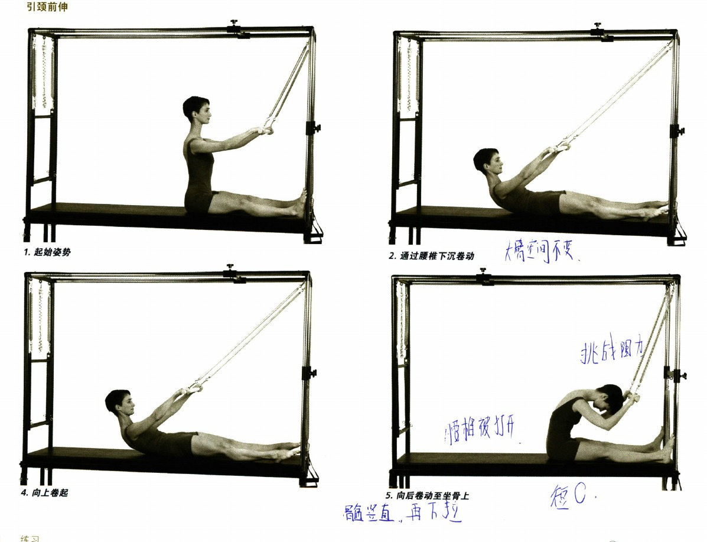
  - 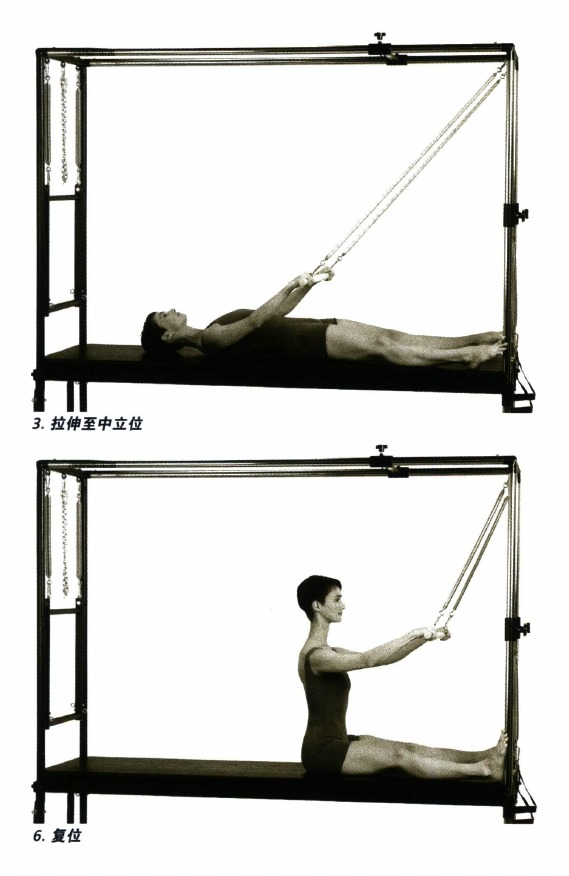

## 後卷加背部伸展 (ROLL DOWN WITH BACK EXTENSION)

- 頁碼：p.28-29
- 難度：中級
- 器械/章節：下卷木杆
- 肌群分類：[[../muscles/cadillac-intermediate-advanced-core-and-lumbopelvic-stability.md|中高階：核心與腰骨盆穩定]], [[../muscles/cadillac-intermediate-advanced-spinal-articulation.md|中高階：脊椎屈曲、伸展、旋轉與側屈]], [[../muscles/cadillac-intermediate-advanced-scapular-stabilizers.md|中高階：肩胛穩定與上背穩定肌]], [[../muscles/cadillac-intermediate-advanced-hips-and-legs.md|中高階：髖與腿部控制]]
- 摘要：後卷加背部伸展：主要歸入核心與腰骨盆穩定、脊椎屈曲、伸展、旋轉與側屈、肩胛穩定與上背穩定肌、髖與腿部控制；OCR 目標肌肉段落見下方摘錄。
- OCR 原文摘錄：目標肌肉：以腹橫肌擠壓腹部，穩定腰骨盆部位；以深層骨盆底 ，不要靠後仰，而要靠腹肌發力來向下捲動，使髂前上棘離開大 肌輔助腹橫肌運動；肩胛骨穩定肌群 腿骨前部，並加大腰椎彎曲幅度 正向：腹直肌和腹斜肌向心收縮，開始向下捲動，完成捲動時離 ，向下捲動時，使脊柱逐節著墊；捲曲上提時，逐節活動脊 心收縮；豎脊肌向心收縮，以伸展脊椎；腹斜肌避免腰曲過度伸展； 椎離墊 向下捲動時，髖屈肌離心收縮；臀大肌和膕繩肌向心收縮，將骨 盆後部帶至股骨後部 ，在整個運動過程中，通過穩定肩胛骨開始脊椎伸展，保持肩胛 骨穩定 反向：豎脊肌向心收縮，以伸展脊柱；以腹斜肌避免腰椎過度伸展； 向後傾時髖屈肌離心收縮：腹直肌和腹斜肌向心收縮，從而上卷 ，伸展時保持腹肌支撐，以避免腰椎過度伸展
- 動作圖：
  - 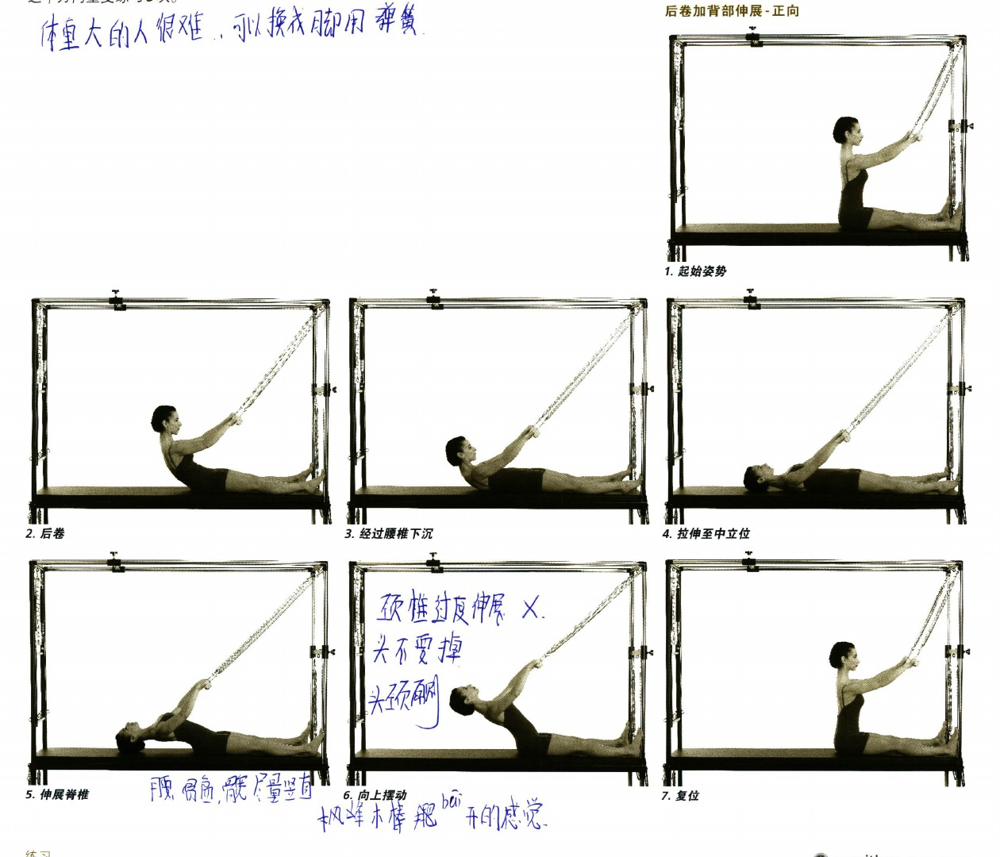
  - 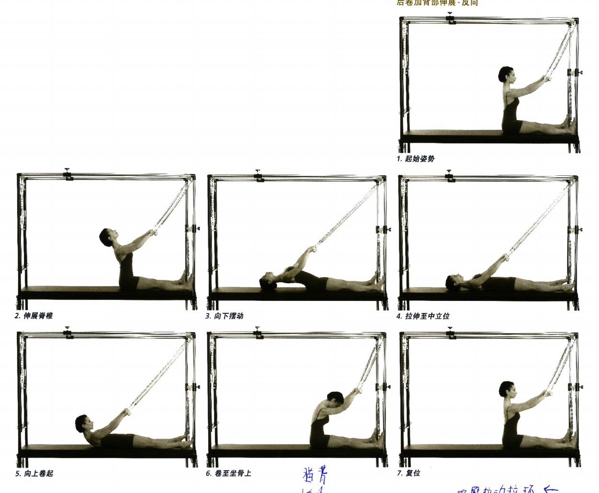

## 有節奏的扭轉 (TWIST WITH PULSES)

- 頁碼：p.30-31
- 難度：中級
- 器械/章節：下卷木杆
- 肌群分類：[[../muscles/cadillac-intermediate-advanced-core-and-lumbopelvic-stability.md|中高階：核心與腰骨盆穩定]], [[../muscles/cadillac-intermediate-advanced-spinal-articulation.md|中高階：脊椎屈曲、伸展、旋轉與側屈]], [[../muscles/cadillac-intermediate-advanced-scapular-stabilizers.md|中高階：肩胛穩定與上背穩定肌]], [[../muscles/cadillac-intermediate-advanced-lat-teres-pulling-chain.md|中高階：背闊肌、大圓肌與拉力鏈]], [[../muscles/cadillac-intermediate-advanced-hips-and-legs.md|中高階：髖與腿部控制]]
- 摘要：有節奏的扭轉：主要歸入核心與腰骨盆穩定、脊椎屈曲、伸展、旋轉與側屈、肩胛穩定與上背穩定肌、背闊肌、大圓肌與拉力鏈；OCR 目標肌肉段落見下方摘錄。
- 器材設置：下卷木桿。
- 起始姿勢：
  呈坐姿，面向下卷木桿。骨盆和脊椎呈中立位。雙腿伸直、平行，踝背屈，雙足蹬住立柱。如果雙腿伸直時無法保持骨盆呈中立位，開始時隨著骨盆卷離股骨，可稍稍彎曲和伸長膝關節。雙臂伸直，一隻手握住下卷木桿中央，另一隻手伸直至下卷木桿下方，掌心均朝下。
- 動作流程：
  吸氣，保持骨盆穩定，朝動作臂方向旋轉脊椎，讓手臂隨軀幹上部旋轉伸向側方。
  呼氣，默數三個數，將動作臂放落至墊，將其滑向立柱，同時骨盆傾斜離開雙腿，另一側髖部稍稍離開墊，從另一側足部到手形成一條對角線。讓頭部跟隨軀幹轉動，每次呼吸滑至更遠距離。
  吸氣，脊椎保持旋轉，軀幹兩側保持等長，起身恢復豎直位置，使重心均勻分配在兩坐骨上，兩側髖部均勻落在墊上。
  呼氣，上軀幹轉回中央位置，改變握住下卷木桿的手。每個方向重複練習 3 次，兩側交替進行。
- OCR 原文摘錄：目標肌肉：以腹橫肌擠壓腹部，穩定腰骨盆部位；以深層骨盆底 肌輔助腹橫肌運動；向心收縮一側腹外斜肌和另一側腹內斜肌， 以使脊椎旋轉；等長收縮腹斜肌、豎脊肌和背闊肌以在傾斜時保 持穩定；傾斜時，離心收縮髖屈肌群；臀大肌和膕繩肌向心收縮， 伸展上側髖部；肩胛骨穩定肌群
- 動作圖：
  - 
  - 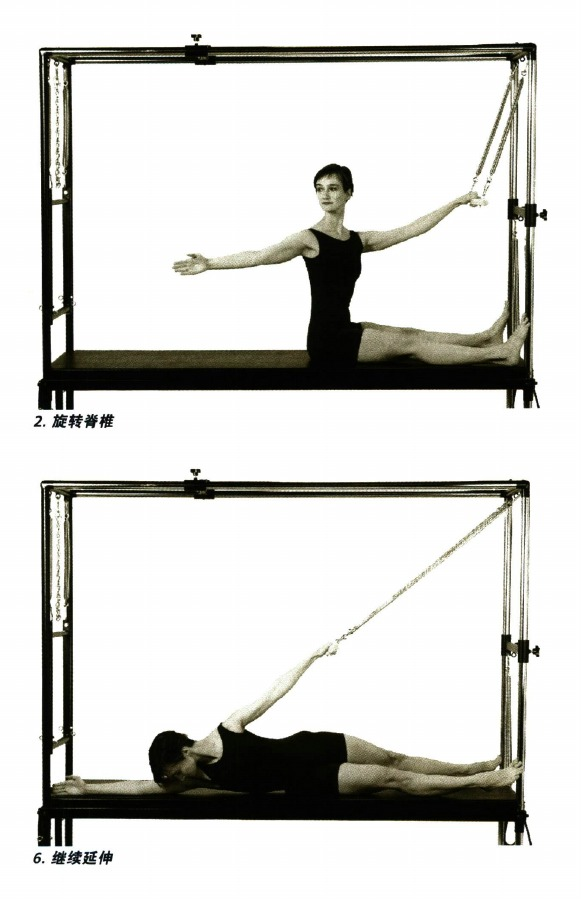
  - 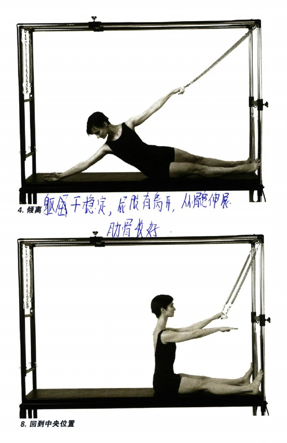
  - 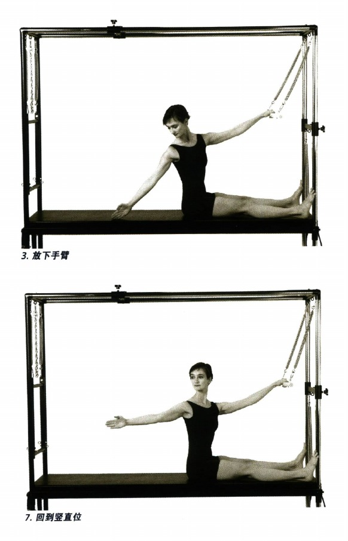

## 手臂動作 (PORT DE BRAS)

- 頁碼：p.32-33
- 難度：中級
- 器械/章節：下卷木杆
- 肌群分類：[[../muscles/cadillac-intermediate-advanced-core-and-lumbopelvic-stability.md|中高階：核心與腰骨盆穩定]], [[../muscles/cadillac-intermediate-advanced-spinal-articulation.md|中高階：脊椎屈曲、伸展、旋轉與側屈]], [[../muscles/cadillac-intermediate-advanced-scapular-stabilizers.md|中高階：肩胛穩定與上背穩定肌]], [[../muscles/cadillac-intermediate-advanced-hips-and-legs.md|中高階：髖與腿部控制]]
- 摘要：手臂動作：主要歸入核心與腰骨盆穩定、脊椎屈曲、伸展、旋轉與側屈、肩胛穩定與上背穩定肌、髖與腿部控制；OCR 目標肌肉段落見下方摘錄。
- OCR 原文摘錄：目標肌肉：以腹橫肌擠壓腹部，穩定腰骨盆部位；以深層骨盆底 踝背屈，雙足蹬住立柱（如果雙腿伸直時無法保持骨盆呈中立位， 肌輔助腹橫肌運動；腹直肌和腹斜肌向心收縮，以開始下卷，在 開始時可稍稍彎曲膝關節，隨著骨盆卷離股骨再伸展膝關節）。雙 完成向下捲動時離心收縮，在捲起時向心收縮：髖屈肌在向下卷 臂伸直，一隻手握住下卷木杆的中央，另一隻手伸直至下卷木杆 動時離心收縮；向心收縮一側腹外斜肌和另一側腹內斜肌，以使 的下方，掌心均朝下。 軀幹旋轉；肩胛骨穩定肌群
- 動作圖：
  - 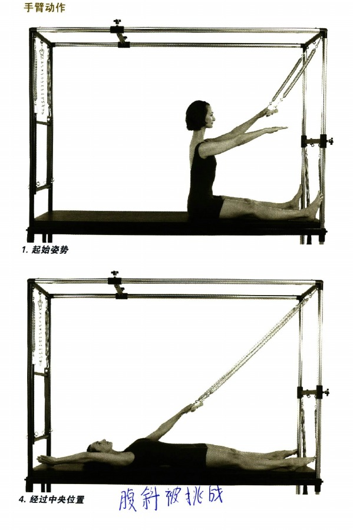
  - 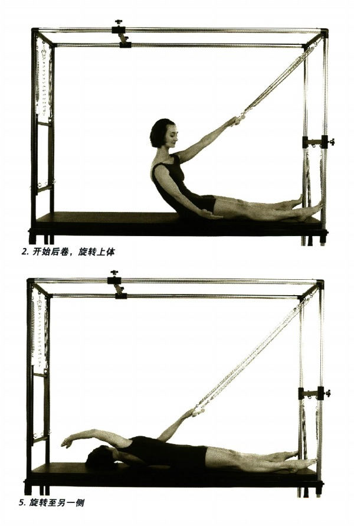
  - 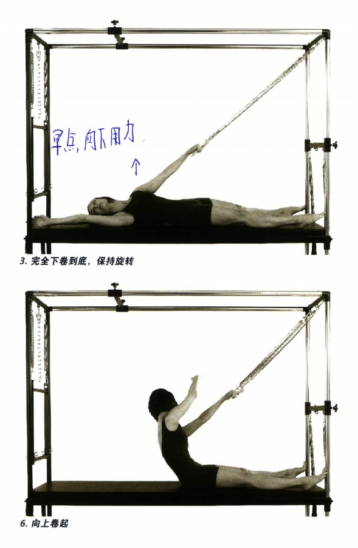
  - 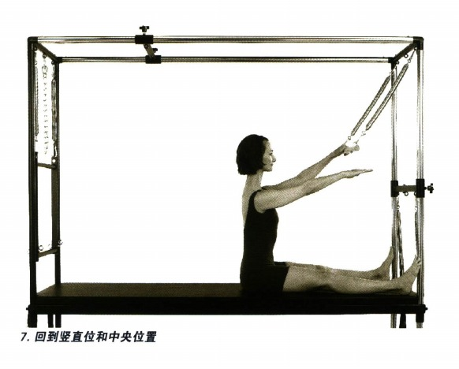

## 側彎 (SIDE BEND)

- 頁碼：p.34-35
- 難度：中級
- 器械/章節：下卷木杆
- 肌群分類：[[../muscles/cadillac-intermediate-advanced-core-and-lumbopelvic-stability.md|中高階：核心與腰骨盆穩定]], [[../muscles/cadillac-intermediate-advanced-spinal-articulation.md|中高階：脊椎屈曲、伸展、旋轉與側屈]], [[../muscles/cadillac-intermediate-advanced-scapular-stabilizers.md|中高階：肩胛穩定與上背穩定肌]], [[../muscles/cadillac-intermediate-advanced-hips-and-legs.md|中高階：髖與腿部控制]]
- 摘要：側彎：主要歸入核心與腰骨盆穩定、脊椎屈曲、伸展、旋轉與側屈、肩胛穩定與上背穩定肌、髖與腿部控制；OCR 目標肌肉段落見下方摘錄。
- OCR 原文摘錄：目標肌肉：以腹橫肌擠壓腹部，穩定腰骨盆部位；以深層骨盆底 支撐頭部，掌心向上。位於上方的手臂伸直，抓住下卷木杆的中央。 肌輔助腹橫肌運動；同側腹內斜肌、腹外斜肌向心收縮以側屈脊 雙腿伸直，位於上方的腿上提與髖同高，腳掌的腳蹠球部蹬在後 椎，復位時離心收縮上述肌肉；肩胛骨穩定肌群 面的立柱上，位於下方的腳掌的腳蹠球部蹬在前面的立柱上。
- 動作圖：
  - 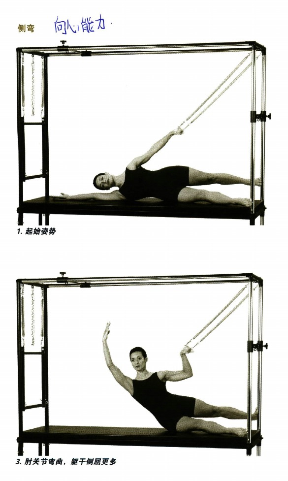
  - 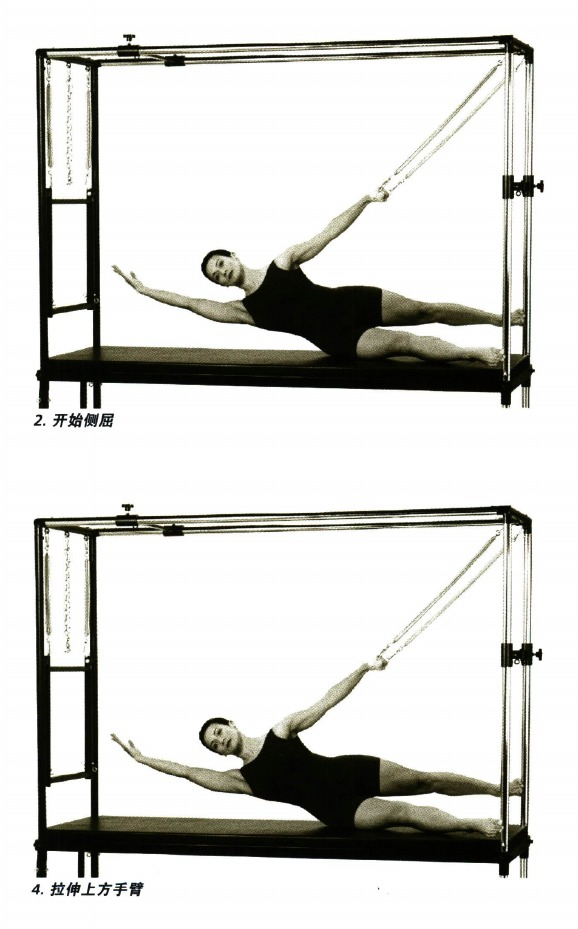
  - 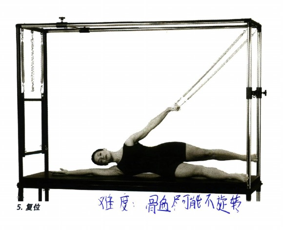
  - 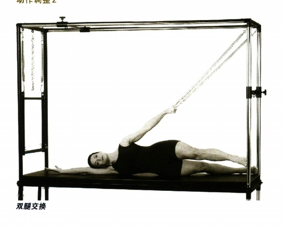

## 轉遍世界 (TWIST AROUND THE WORLD)

- 頁碼：p.36-37
- 難度：高階
- 器械/章節：下卷木杆
- 肌群分類：[[../muscles/cadillac-intermediate-advanced-core-and-lumbopelvic-stability.md|中高階：核心與腰骨盆穩定]], [[../muscles/cadillac-intermediate-advanced-spinal-articulation.md|中高階：脊椎屈曲、伸展、旋轉與側屈]], [[../muscles/cadillac-intermediate-advanced-scapular-stabilizers.md|中高階：肩胛穩定與上背穩定肌]], [[../muscles/cadillac-intermediate-advanced-lat-teres-pulling-chain.md|中高階：背闊肌、大圓肌與拉力鏈]], [[../muscles/cadillac-intermediate-advanced-hips-and-legs.md|中高階：髖與腿部控制]]
- 摘要：轉遍世界：主要歸入核心與腰骨盆穩定、脊椎屈曲、伸展、旋轉與側屈、肩胛穩定與上背穩定肌、背闊肌、大圓肌與拉力鏈；OCR 目標肌肉段落見下方摘錄。
- 器材設置：下卷木桿。
- 起始姿勢：
  呈坐姿，面向下卷木桿。骨盆和脊椎呈中立位。雙腿伸直、平行，踝背屈，雙足蹬住立柱。如果雙腿伸直時無法保持骨盆呈中立位，開始時隨著骨盆卷離股骨，可稍稍彎曲和伸長膝關節。手臂朝前伸直，握住下卷木桿，與肩齊寬，掌心向下。肩胛骨保持穩定。
- 動作流程：
  吸氣，保持肩胛骨穩定，雙臂和木桿與雙肩協調一致，骨盆正對前方，軀幹上部朝一側旋轉。
  呼氣，脊椎保持穩定，軀幹兩側保持均勻伸直，側轉姿勢保持不變，向側後方傾斜上身成對角線姿勢，另一側髖部可稍稍離床。同時保持雙臂和軀幹協調一致，令位於後方的肘關節向外和向回揮動成對角線。繼續呼氣並收縮腹肌，彎曲脊椎、轉動軀幹上部面向前方，使髖部返回墊。
  吸氣，將上部軀幹旋轉到另一側，等長拉伸軀幹兩側，側轉姿勢保持不變，向側後方傾斜上身成對角線姿勢。
  呼氣，保持脊椎轉動，軀幹兩側等長，軀幹返回豎直位，讓體重落在兩塊坐骨上，兩側髖部均勻位於墊上並正對前方，然後將軀幹上部旋轉至前方。每側重複練習 3 次。
- OCR 原文摘錄：目標肌肉：以腹橫肌擠壓腹部，穩定腰骨盆部位；以深層骨盆底 ，保持雙臂和軀幹協調一致，從而在彈簧阻力下直接鍛鍊軀幹 肌輔助腹橫肌運動；向心收縮一側腹外斜肌和另一側腹內斜肌， 旋轉肌 以使軀幹旋轉；等長收縮腹斜肌、豎脊肌和背闊肌以使軀幹在傾 斜時保持穩定：腹直肌和腹斜肌向心收縮，以彎曲脊椎：腹斜肌 ，保持骨盆正對前方；軀幹上部單獨旋轉，骨盆不隨之轉動 離心收縮，回到傾斜姿勢；臀大肌和膽繩肌向心收縮，將骨盆後 •避免從肋骨架開始或讓髖部位於後方和側屈脊椎 部帶到股骨後部；肩胛骨穩定肌群 ，保持腹肌收緊避免腰椎伸展
- 動作圖：
  - 
  - 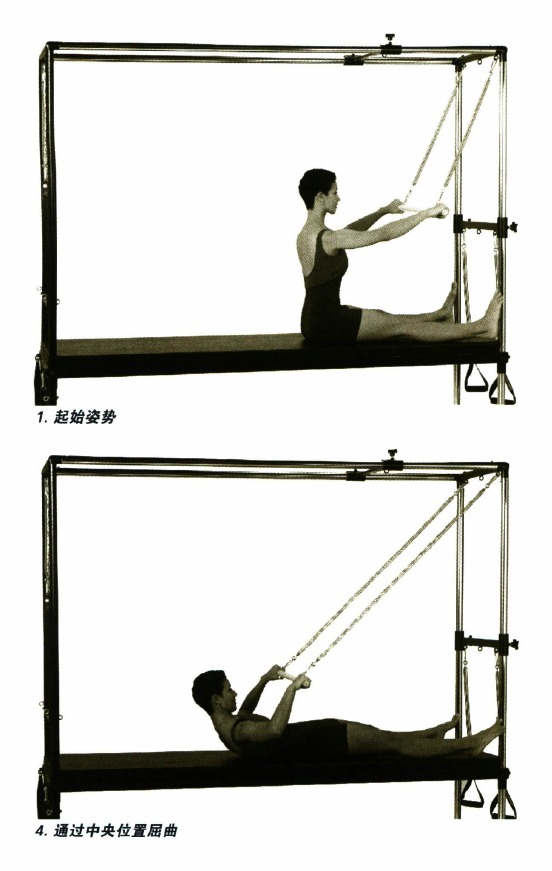
  - 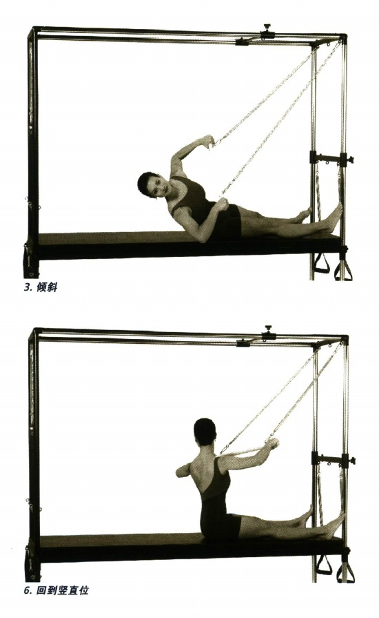
  - 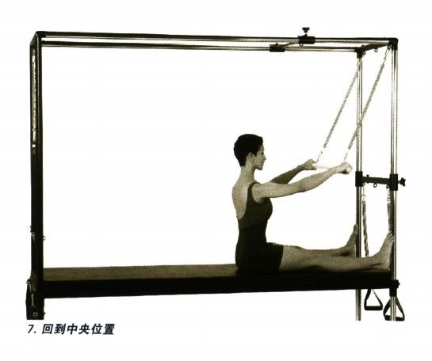

## 大腿伸展 (THIGH STRETCH)

- 頁碼：p.38-39
- 難度：高階
- 器械/章節：下卷木杆
- 肌群分類：[[../muscles/cadillac-intermediate-advanced-core-and-lumbopelvic-stability.md|中高階：核心與腰骨盆穩定]], [[../muscles/cadillac-intermediate-advanced-spinal-articulation.md|中高階：脊椎屈曲、伸展、旋轉與側屈]], [[../muscles/cadillac-intermediate-advanced-scapular-stabilizers.md|中高階：肩胛穩定與上背穩定肌]], [[../muscles/cadillac-intermediate-advanced-hips-and-legs.md|中高階：髖與腿部控制]], [[../muscles/cadillac-intermediate-advanced-mobility-and-stretching.md|中高階：柔韌、伸展與懸掛釋放]]
- 摘要：大腿伸展：主要歸入核心與腰骨盆穩定、脊椎屈曲、伸展、旋轉與側屈、肩胛穩定與上背穩定肌、髖與腿部控制；OCR 目標肌肉段落見下方摘錄。
- OCR 原文摘錄：目標肌肉：以腹橫肌濟壓腹部，穩定腰骨盆部位；以深層骨盆底 跪在墊上，面向下卷木杆。骨盆和脊椎呈中立位，股骨呈豎直位， 肌輔助腹橫肌運動；臀大肌、膕繩肌、腹直肌、腹斜肌和豎脊肌， 膝關節與髖同寬。手臂朝前伸直，握住下卷木杆，與肩齊寬，掌 用以穩定脊椎和保持骨盆中立位；腹斜肌用以防止腰椎過度伸展 心向下。 後傾過程中股四頭肌拉伸；肩胛骨穩定肌群 ［2］豎脊肌（特別是後背中部）向心收縮，以伸展脊椎；以腹斜肌避
- 動作圖：
  - 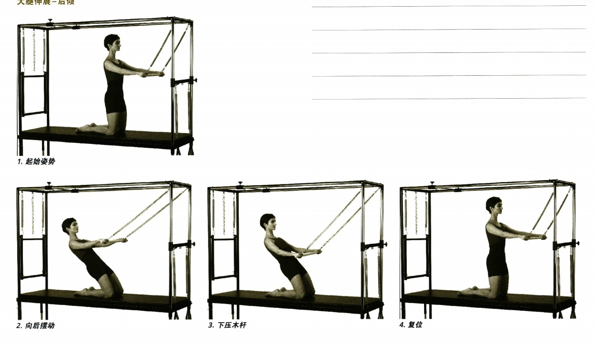
  - 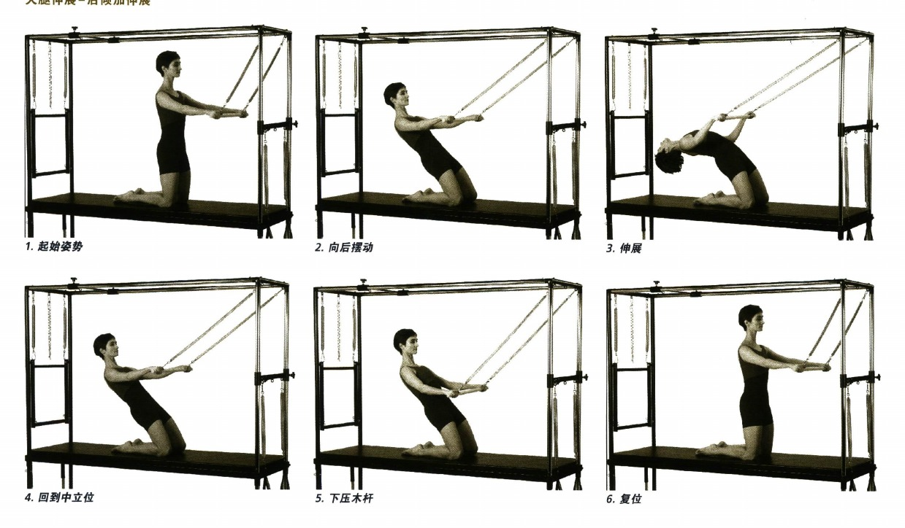

## 飛翔動作 (AIRPLANE)

- 頁碼：p.40-41
- 難度：高階
- 器械/章節：下卷木杆
- 肌群分類：[[../muscles/cadillac-intermediate-advanced-core-and-lumbopelvic-stability.md|中高階：核心與腰骨盆穩定]]
- 摘要：飛翔動作：主要歸入核心與腰骨盆穩定；OCR 目標肌肉段落見下方摘錄。
- OCR 原文摘錄：目標肌肉：以腹橫肌擠壓腹部，穩定腰骨盆部位；以深層骨盆底 1.呼吸四次。學習動作時應降低
- 動作圖：
  - 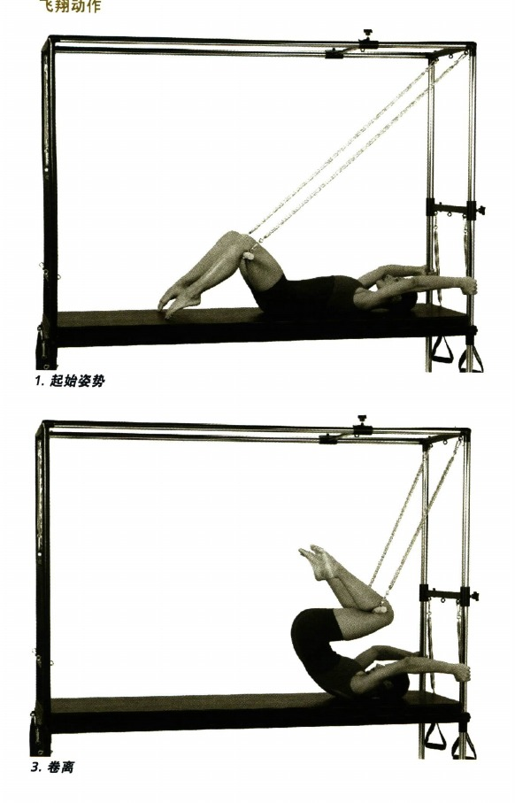
  - 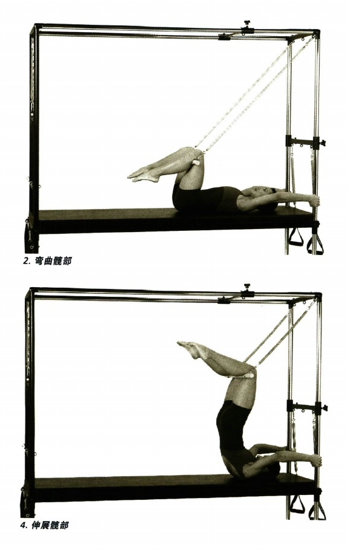
  - 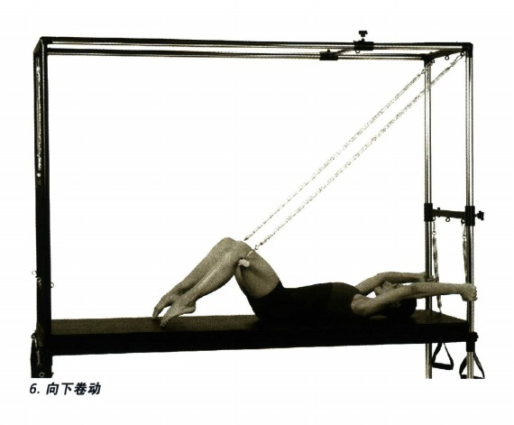
  - 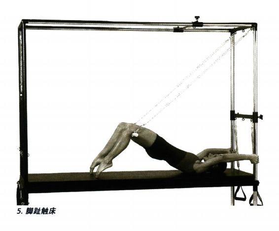

## 肱三頭肌弓步 (TRICEPS LUNGE)

- 頁碼：p.42-43
- 難度：中級
- 器械/章節：下卷木杆站姿
- 肌群分類：[[../muscles/cadillac-intermediate-advanced-core-and-lumbopelvic-stability.md|中高階：核心與腰骨盆穩定]], [[../muscles/cadillac-intermediate-advanced-arms-delts-pecs.md|中高階：手臂、三角肌、胸大肌與前臂]], [[../muscles/cadillac-intermediate-advanced-hips-and-legs.md|中高階：髖與腿部控制]]
- 摘要：肱三頭肌弓步：主要歸入核心與腰骨盆穩定、手臂、三角肌、胸大肌與前臂、髖與腿部控制；OCR 目標肌肉段落見下方摘錄。
- OCR 原文摘錄：目標肌肉：以腹橫肌擠壓腹部，穩定腰骨盆部位；以深層骨盆底 肌輔助腹橫肌運動；由於來自體後的阻力，腹直肌、腹斜肌和豎
- 動作圖：
  - 
  - 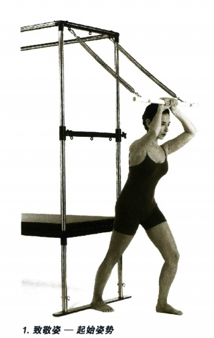
  - 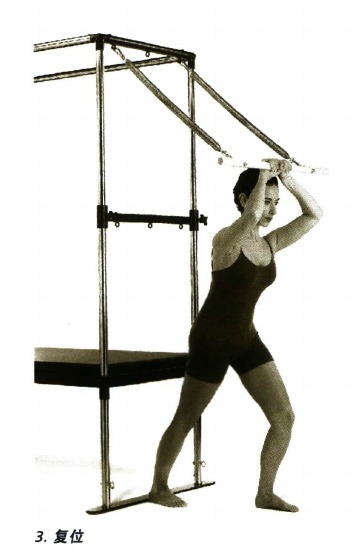
  - 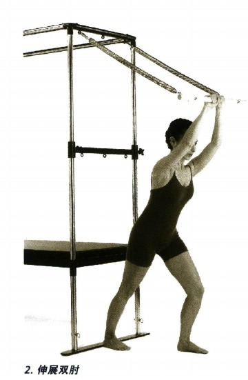

## 芭蕾伸展站姿 (BALLET STRETCHES STANDING)

- 頁碼：p.44-49
- 難度：中級
- 器械/章節：鞦韆
- 肌群分類：[[../muscles/cadillac-intermediate-advanced-core-and-lumbopelvic-stability.md|中高階：核心與腰骨盆穩定]], [[../muscles/cadillac-intermediate-advanced-spinal-articulation.md|中高階：脊椎屈曲、伸展、旋轉與側屈]], [[../muscles/cadillac-intermediate-advanced-scapular-stabilizers.md|中高階：肩胛穩定與上背穩定肌]], [[../muscles/cadillac-intermediate-advanced-hips-and-legs.md|中高階：髖與腿部控制]], [[../muscles/cadillac-intermediate-advanced-mobility-and-stretching.md|中高階：柔韌、伸展與懸掛釋放]]
- 摘要：芭蕾伸展站姿：主要歸入核心與腰骨盆穩定、脊椎屈曲、伸展、旋轉與側屈、肩胛穩定與上背穩定肌、髖與腿部控制；OCR 目標肌肉段落見下方摘錄。
- OCR 原文摘錄：目標肌肉：以腹橫肌擠壓腹部，穩定腰骨盆部位；以深層骨盆底 ，每個姿勢都儘可能保持骨盆正對前方 肌輔助腹橫肌運動；腹斜肌和豎脊肌用以使軀幹保持豎直穩定； 利用腹斜肌和多裂肌對抗身體旋轉；肩胛骨穩定肌群 ，骨盆儘量保持在支撐腿的正上方 ［正向1臀大肌和膕繩肌向心收縮，從而下壓鞦韆，而前移時，離 ，保持腹肌用力，以支援軀幹，特別是當脊椎伸展時腿部位 於後側 心收縮；腹直肌和腹斜肌向心收縮，以引發屈曲；豎脊肌向心收縮， 以伸展胸椎；以腹斜肌避免腰椎過度伸展 ，完成向前或向後的動作時，動作腿同髖部呈一條直線；完成側 ［朝側］髖內收肌群和伸展肌群向心收縮，以下壓鞦韆；而前移時， 向動作時，保持髖部朝前 離心收縮：同側腹內斜肌，腹外斜肌向心收縮，從而側彎軀幹朝
- 動作圖：
  - 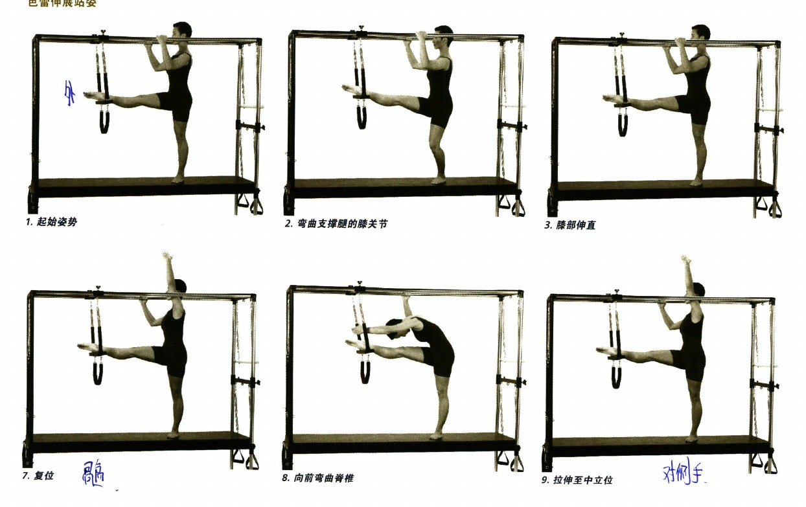
  - 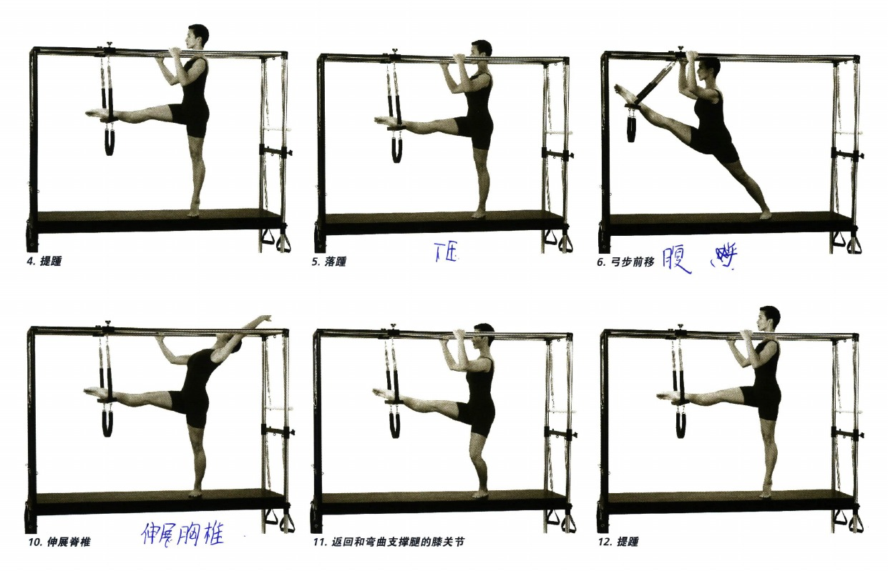
  - 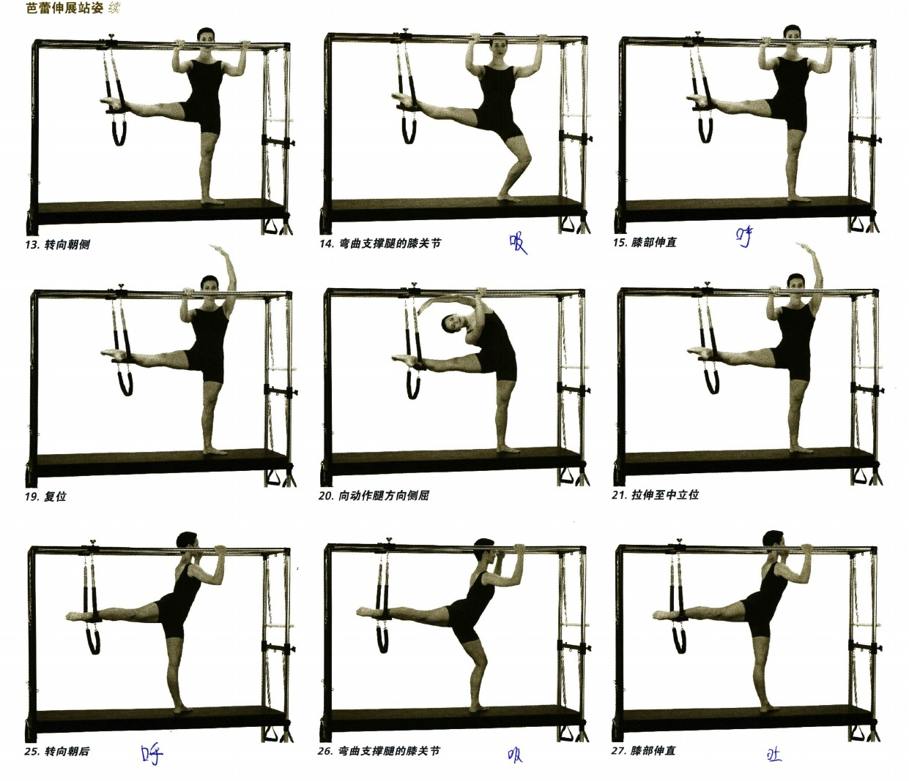
  - 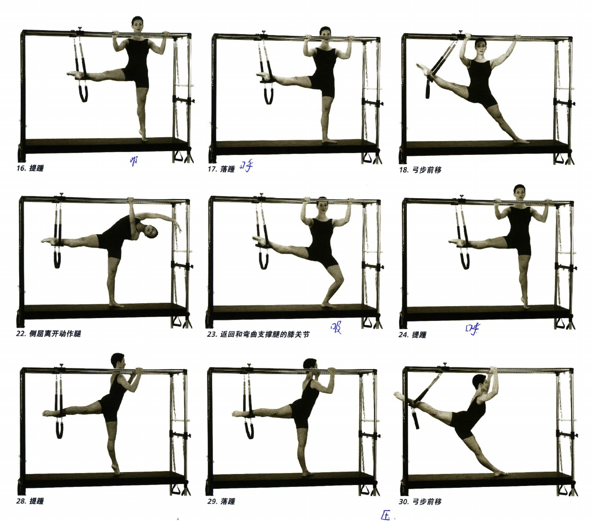
  - 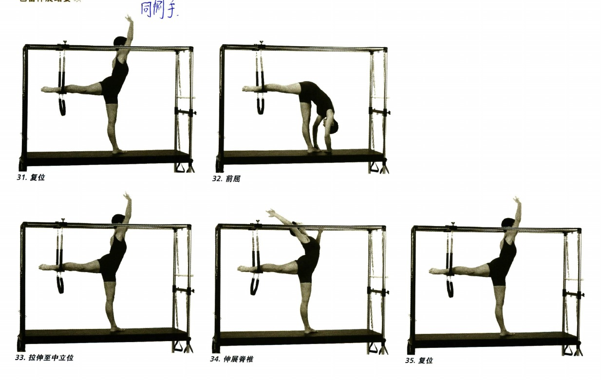
  - 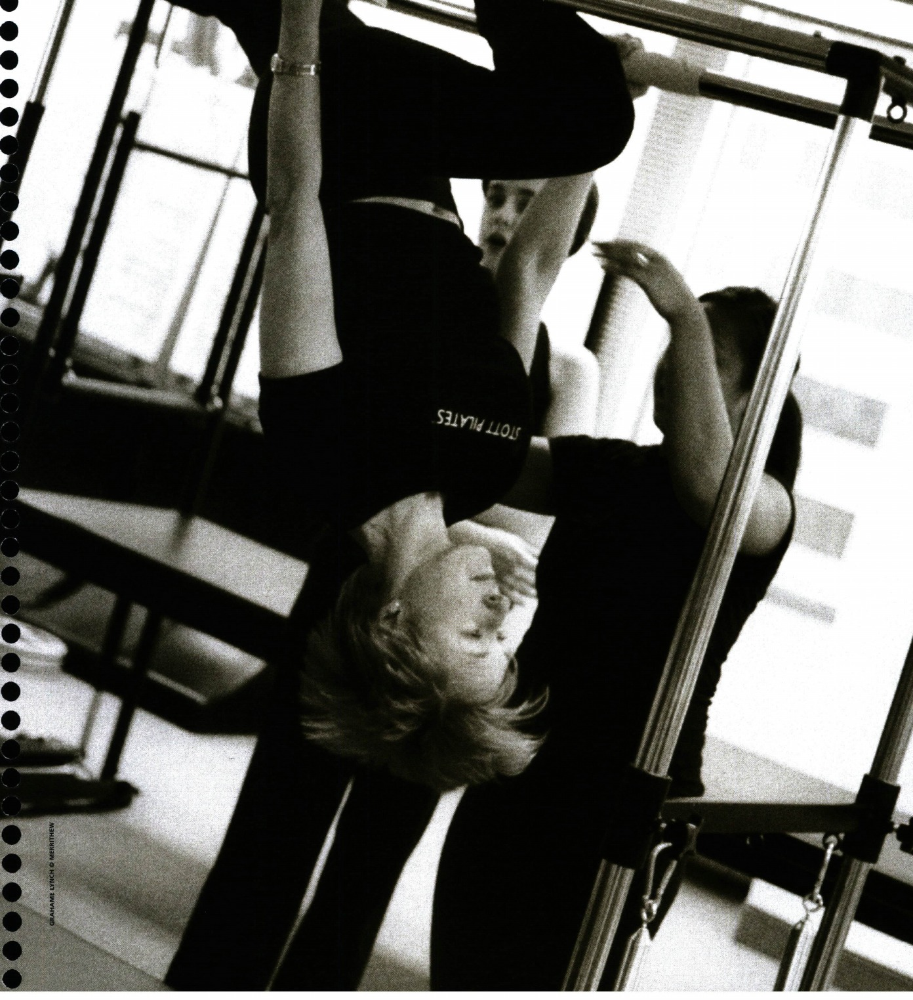

## 展翅雄鷹 (SPREAD EAGLE)

- 頁碼：p.50-51
- 難度：中級
- 器械/章節：鞦韆
- 肌群分類：[[../muscles/cadillac-intermediate-advanced-core-and-lumbopelvic-stability.md|中高階：核心與腰骨盆穩定]], [[../muscles/cadillac-intermediate-advanced-scapular-stabilizers.md|中高階：肩胛穩定與上背穩定肌]]
- 摘要：展翅雄鷹：主要歸入核心與腰骨盆穩定、肩胛穩定與上背穩定肌；OCR 目標肌肉段落見下方摘錄。
- OCR 原文摘錄：目標肌肉：以腹橫肌擠壓腹部，穩定腰骨盆部位；以深層骨盆底 ，調動肩胛骨穩定肌群，以避免身體落在雙肩之間（
- 動作圖：
  - 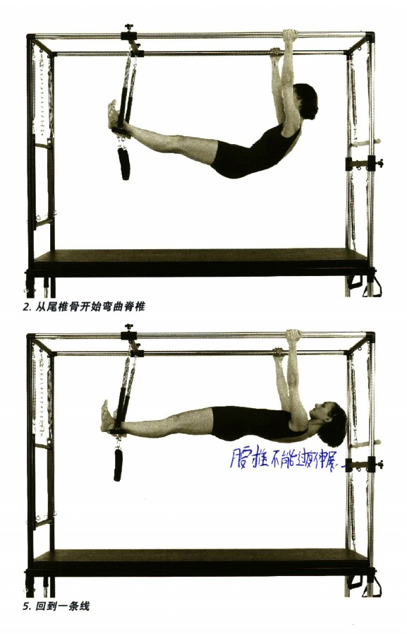
  - 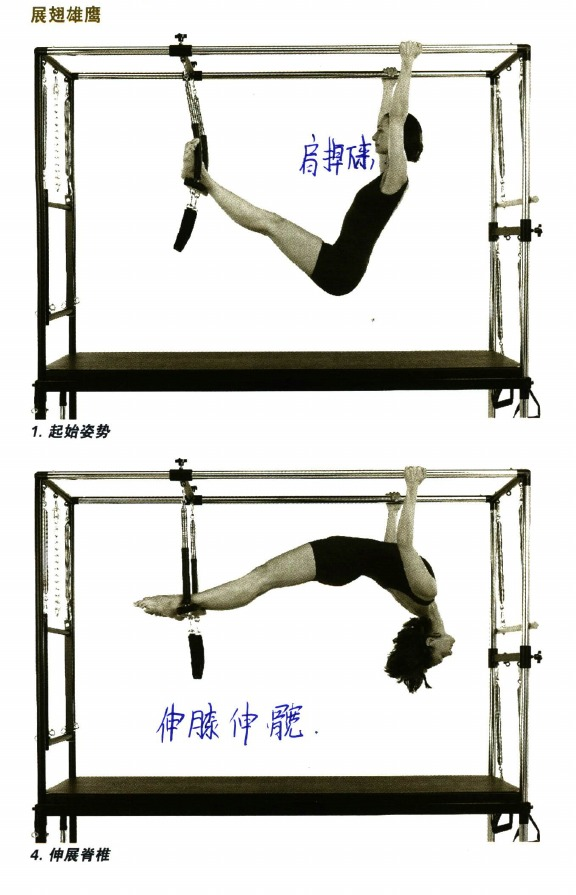
  - 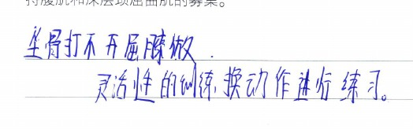
  - 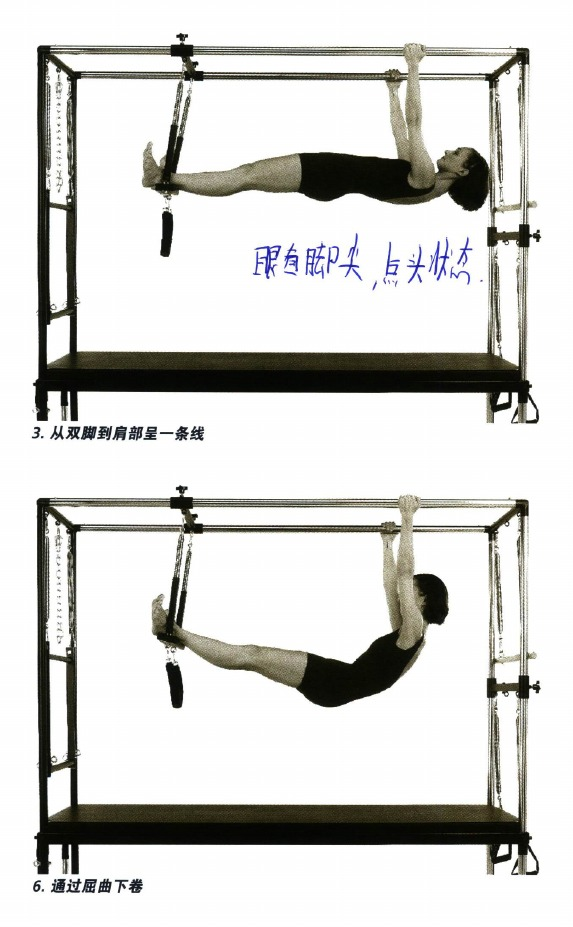
  - 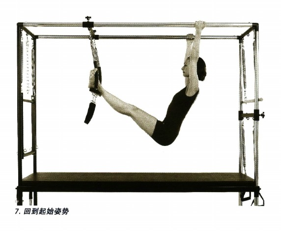

## 上拉 (PULL UP)

- 頁碼：p.52-54
- 難度：中級
- 器械/章節：鞦韆
- 肌群分類：[[../muscles/cadillac-intermediate-advanced-core-and-lumbopelvic-stability.md|中高階：核心與腰骨盆穩定]], [[../muscles/cadillac-intermediate-advanced-spinal-articulation.md|中高階：脊椎屈曲、伸展、旋轉與側屈]], [[../muscles/cadillac-intermediate-advanced-scapular-stabilizers.md|中高階：肩胛穩定與上背穩定肌]], [[../muscles/cadillac-intermediate-advanced-lat-teres-pulling-chain.md|中高階：背闊肌、大圓肌與拉力鏈]], [[../muscles/cadillac-intermediate-advanced-arms-delts-pecs.md|中高階：手臂、三角肌、胸大肌與前臂]], [[../muscles/cadillac-intermediate-advanced-hips-and-legs.md|中高階：髖與腿部控制]]
- 摘要：上拉：主要歸入核心與腰骨盆穩定、脊椎屈曲、伸展、旋轉與側屈、肩胛穩定與上背穩定肌、背闊肌、大圓肌與拉力鏈；OCR 目標肌肉段落見下方摘錄。
- OCR 原文摘錄：目標肌肉：以腹橫肌擠壓腹部，穩定腰骨盆部位；以深層骨盆底 •保持臀大肌、膕繩肌和脊柱伸展肌用力，以保持骨盆和脊椎呈 肌輔助腹橫肌運動；向心收縮腹直肌和腹斜肌，以使脊椎彎曲； 一條線 向心收縮臀大肌和膕繩肌以伸展髖部；上背部豎脊肌向心收縮以 伸展脊椎到中立位；腹斜肌和豎脊肌用以穩定軀幹成一長直線； ，上拉時，保持骨盆和脊椎穩定呈中立位；避免伸展脊椎以獲得 向上動力 肱二頭肌向心收縮以將軀幹拉起，軀幹降下時離心收縮：肩胛骨 穩定肌群；以前臂肌肉穩定腕關節和雙手 ，穩定肩胛骨，以避免身體重量落在雙肩之間（
- 動作圖：
  - 
  - 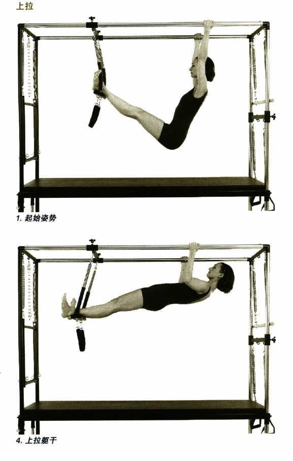
  - 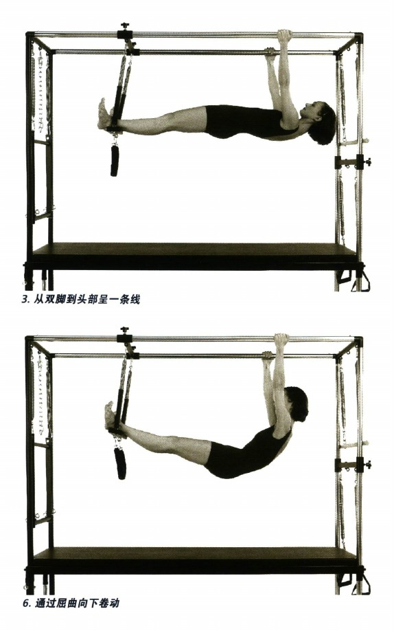
  - 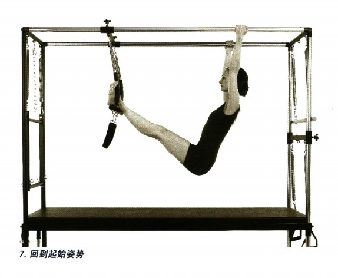
  - 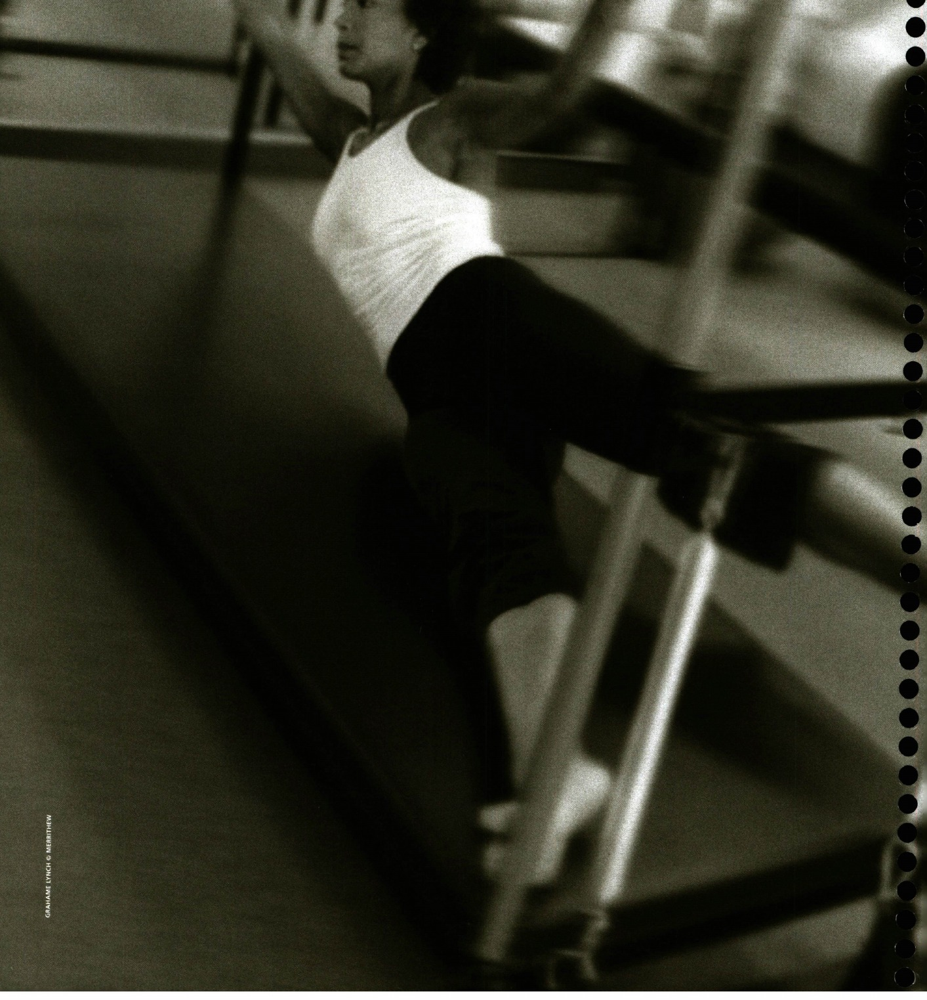

## 反向上拉 (REVERSE PULL UP)

- 頁碼：p.55
- 難度：高階
- 器械/章節：鞦韆
- 肌群分類：[[../muscles/cadillac-intermediate-advanced-core-and-lumbopelvic-stability.md|中高階：核心與腰骨盆穩定]], [[../muscles/cadillac-intermediate-advanced-lat-teres-pulling-chain.md|中高階：背闊肌、大圓肌與拉力鏈]]
- 摘要：反向上拉：主要歸入核心與腰骨盆穩定、背闊肌、大圓肌與拉力鏈；OCR 目標肌肉段落見下方摘錄。
- OCR 原文摘錄：目標肌肉：以腹橫肌擠壓腹部，穩定腰骨盆部位；以深層骨盆底
- 動作圖：
  - 
  - 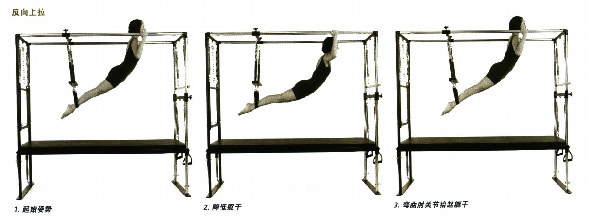

## 跨步 (WALKOVER)

- 頁碼：p.56-57
- 難度：高階
- 器械/章節：鞦韆
- 肌群分類：[[../muscles/cadillac-intermediate-advanced-core-and-lumbopelvic-stability.md|中高階：核心與腰骨盆穩定]]
- 摘要：跨步：主要歸入核心與腰骨盆穩定；OCR 目標肌肉段落見下方摘錄。
- OCR 原文摘錄：目標肌肉：以腹橫肌擠壓腹部，穩定腰骨盆部位；以深層骨盆底 ，如果肩部受過傷或無法保持穩定，請勿嘗試該
- 動作圖：
  - 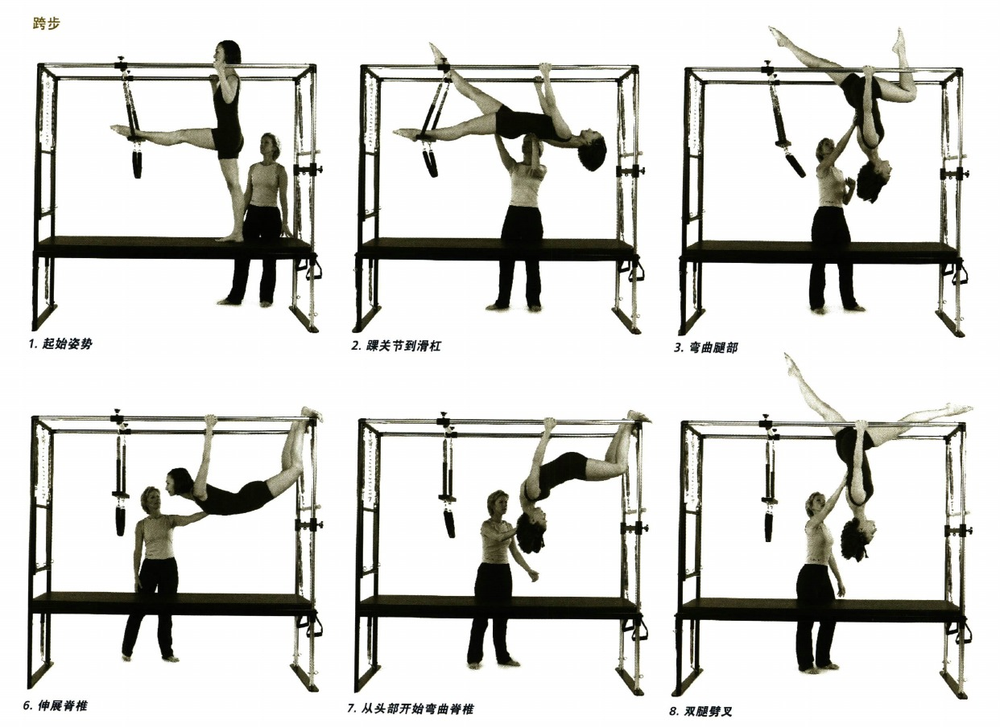
  - 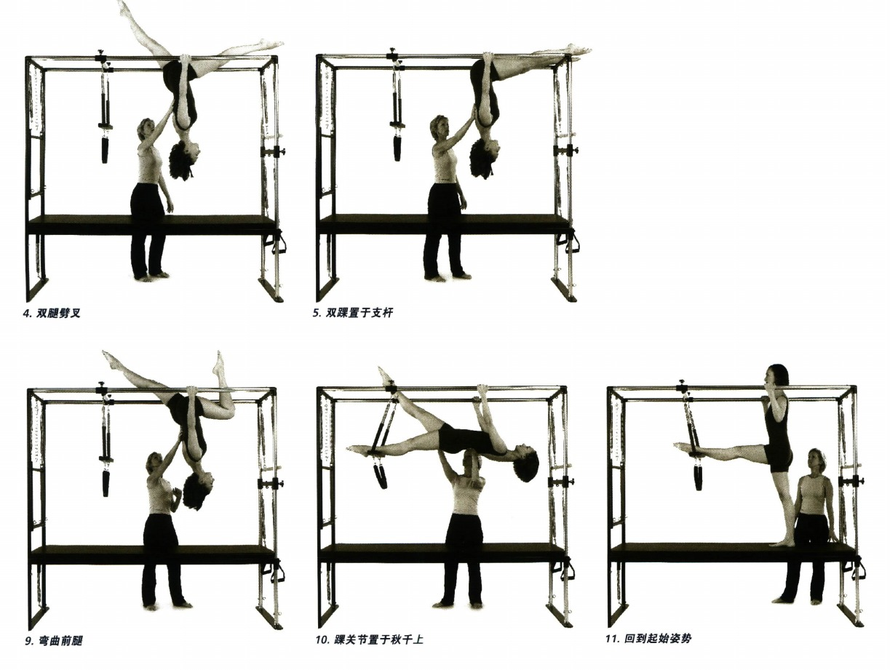

## 空中剪刀式 (SCISSORS IN AIR)

- 頁碼：p.58-59
- 難度：高階
- 器械/章節：鞦韆
- 肌群分類：[[../muscles/cadillac-intermediate-advanced-core-and-lumbopelvic-stability.md|中高階：核心與腰骨盆穩定]]
- 摘要：空中剪刀式：主要歸入核心與腰骨盆穩定；OCR 目標肌肉段落見下方摘錄。
- 器材設置：練習過程中必須有受過訓練的專業人員全程提供幫助，確保雙手抓牢、雙腳安全放置於槓上。嘗試練習時需抓緊水平槓，並使用防滑墊。
- 起始姿勢：
  站在凱迪拉克上，面向鞦韆。支撐腿伸直，動作腿伸直後，踝關節落在鞦韆上。雙腿外旋。骨盆和脊椎呈中立位，骨盆儘可能保持水平正對前方。雙手抓住水平槓，肩胛骨保持穩定。
- 動作流程：
  吸氣，下壓鞦韆，彎曲另外一條腿，將踝關節置於水平滑槓上。
  呼氣，雙腿叉開，位於前方的踝關節伸向水平滑槓，位於後方的踝關節伸向立柱頂部的支桿。
  吸氣，雙腿伸向正上方，軀幹倒立。
  接下來，呼氣，一腿從髖部開始伸展，另一腿從髖部開始彎曲，每次呼吸有節奏地進行兩次練習。吸氣，雙腿伸向正上方。換腿重複。
  結束動作時，呼氣，置於鞦韆上的腿彎曲，兩腿叉開，採用劈叉姿勢懸掛片刻，然後位於後方的踝關節伸向立柱頂部上方的支桿。吸氣，彎曲後腿，朝下方鞦韆伸展。呼氣，彎曲另外一條腿，朝下方墊伸展。重複練習 3-5 次。
- OCR 原文摘錄：目標肌肉：以腹橫肌擠壓腹部，穩定腰骨盆部位；以深層骨盆底 •如果肩部受過傷或無法保持穩定，請勿嘗試該
- 動作圖：
  - 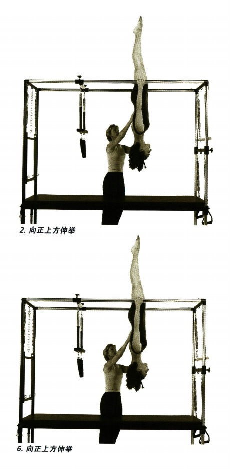
  - 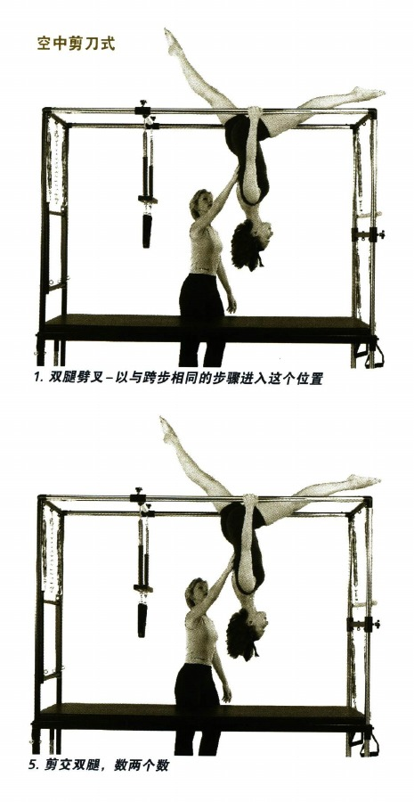
  - 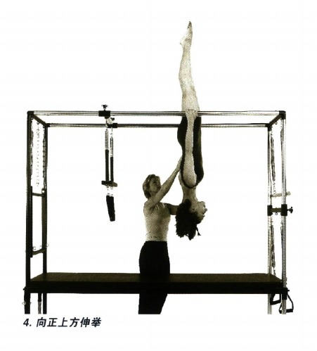
  - 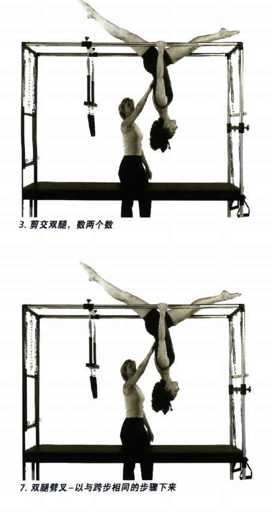

## 空中腳踏車式動作 (BICYCLE IN AIR)

- 頁碼：p.60-61
- 難度：高階
- 器械/章節：鞦韆
- 肌群分類：[[../muscles/cadillac-intermediate-advanced-core-and-lumbopelvic-stability.md|中高階：核心與腰骨盆穩定]]
- 摘要：空中腳踏車式動作：主要歸入核心與腰骨盆穩定；OCR 目標肌肉段落見下方摘錄。
- 器材設置：練習過程中必須有受過訓練的專業人員全程提供幫助，確保雙手抓牢、雙腳安全放置於槓上。嘗試練習時需抓緊水平槓，並使用防滑墊。
- 起始姿勢：
  站在凱迪拉克上，面向鞦韆。支撐腿伸直，動作腿伸直後，踝關節落在鞦韆上。雙腿外旋。骨盆和脊椎呈中立位，骨盆儘可能保持水平正對前方。雙手抓住水平槓，肩胛骨保持穩定。
- 動作流程：
  吸氣，下壓鞦韆，彎曲另外一條腿，將踝關節置於水平滑槓上。保持臀大肌和膕繩肌支撐，以保持骨盆提起。
  呼氣，置於鞦韆上的腿彎曲，兩腿叉開，採用劈叉姿勢懸掛片刻，然後位於後方的踝關節伸向立柱頂部上方的支桿。
  吸氣，雙腿向上伸向正上方，身體倒立。
  接下來，繼續吸氣，一腿從髖部開始伸展，另一腿從髖部開始彎曲。呼氣，彎曲後腿的膝關節，拉伸髖屈肌，腳趾伸向鞦韆。吸氣，位於後方的腿在髖部屈曲，伸展膝關節，同時另一條腿在髖部伸展，雙腿呈剪交姿勢。重複練習 3-5 次。
  結束動作時，呼氣，雙腿叉開，位於前方的踝關節伸向水平滑槓，位於後方的踝關節伸向立柱頂部的支桿。吸氣，彎曲前腿，朝下方鞦韆伸展。呼氣，彎曲另外一條腿，朝下方墊伸展。
- OCR 原文摘錄：目標肌肉：以腹橫肌擠壓腹部，穩定腰骨盆部位；以深層骨盆底 ，如果肩部受過傷或無法保持穩定，請勿嘗試該
- 動作圖：
  - 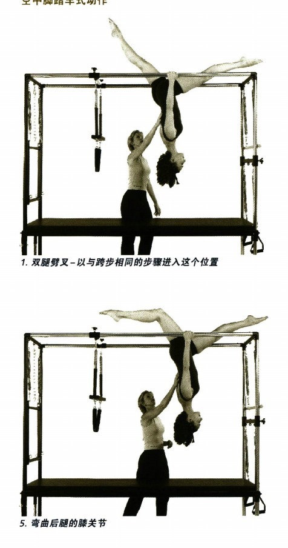
  - 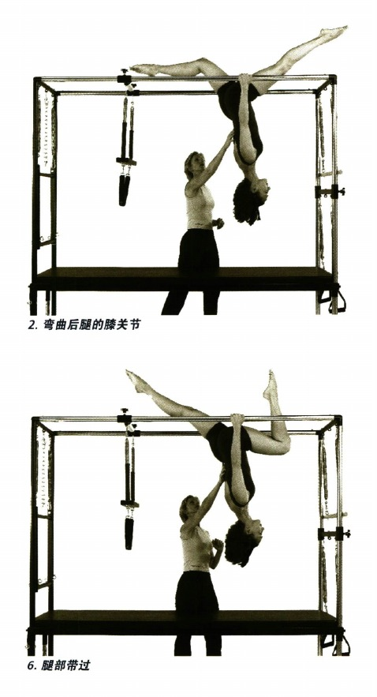
  - 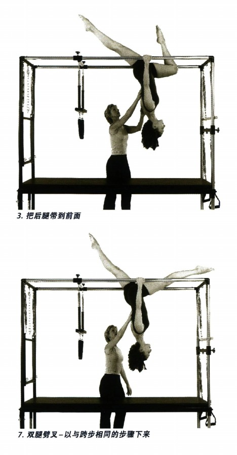
  - 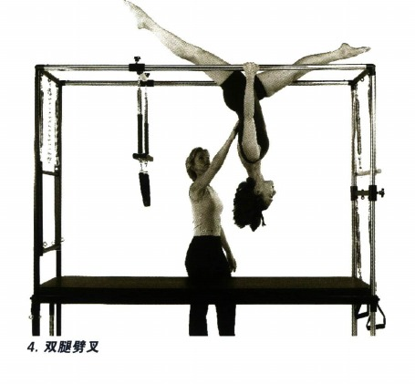

## 捲曲到彎曲和伸展 (TUCK INTO FLEXION & EXTENSION)

- 頁碼：p.62-63
- 難度：高階
- 器械/章節：鞦韆
- 肌群分類：[[../muscles/cadillac-intermediate-advanced-core-and-lumbopelvic-stability.md|中高階：核心與腰骨盆穩定]], [[../muscles/cadillac-intermediate-advanced-spinal-articulation.md|中高階：脊椎屈曲、伸展、旋轉與側屈]]
- 摘要：捲曲到彎曲和伸展：主要歸入核心與腰骨盆穩定、脊椎屈曲、伸展、旋轉與側屈；OCR 目標肌肉段落見下方摘錄。
- OCR 原文摘錄：目標肌肉：以腹橫肌擠壓腹部，穩定腰骨盆部位；以深層骨盆底 ，如果肩部受過傷或無法保持穩定，請勿嘗試該
- 動作圖：
  - 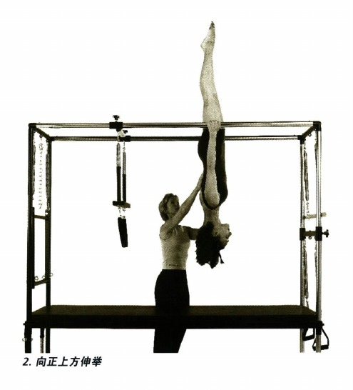
  - 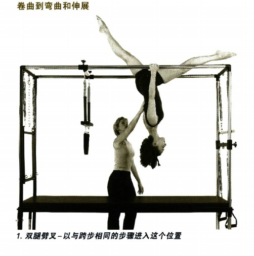
  - 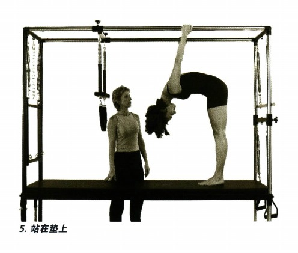
  - 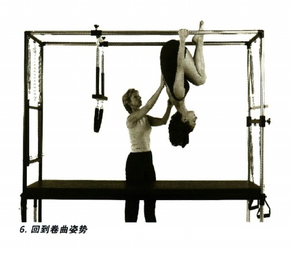
  - 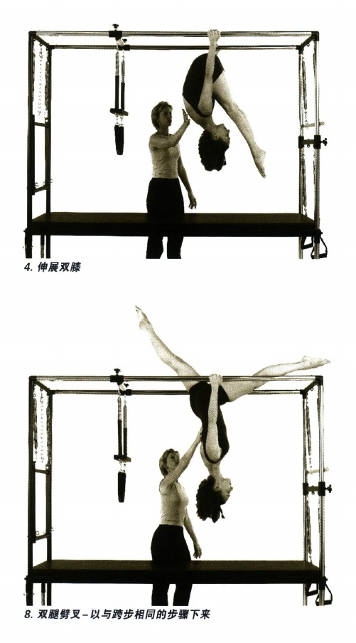
  - 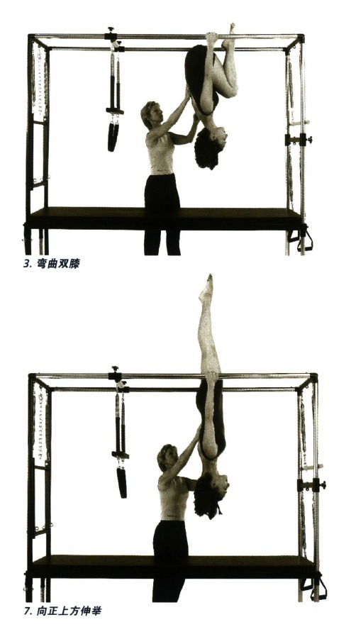

## 起坐複合練習 (SIT UP COMBO)

- 頁碼：p.64-65
- 難度：中級
- 器械/章節：推拉框上面彈簧動作
- 肌群分類：[[../muscles/cadillac-intermediate-advanced-core-and-lumbopelvic-stability.md|中高階：核心與腰骨盆穩定]], [[../muscles/cadillac-intermediate-advanced-spinal-articulation.md|中高階：脊椎屈曲、伸展、旋轉與側屈]], [[../muscles/cadillac-intermediate-advanced-scapular-stabilizers.md|中高階：肩胛穩定與上背穩定肌]], [[../muscles/cadillac-intermediate-advanced-arms-delts-pecs.md|中高階：手臂、三角肌、胸大肌與前臂]], [[../muscles/cadillac-intermediate-advanced-hips-and-legs.md|中高階：髖與腿部控制]]
- 摘要：起坐複合練習：主要歸入核心與腰骨盆穩定、脊椎屈曲、伸展、旋轉與側屈、肩胛穩定與上背穩定肌、手臂、三角肌、胸大肌與前臂；OCR 目標肌肉段落見下方摘錄。
- OCR 原文摘錄：目標肌肉：以腹橫肌擠壓腹部，穩定腰骨盆部位；以深層骨盆底 肌輔助腹橫肌運動；向心收縮腹直肌和腹斜肌，以使脊椎彎曲； 在骨盆從股骨前部滾離時，髖屈肌離心收縮：肱二頭肌和胸大肌 等長收縮，以穩定手臂姿勢；肩胛骨穩定肌群 •
- 動作圖：
  - 
  - 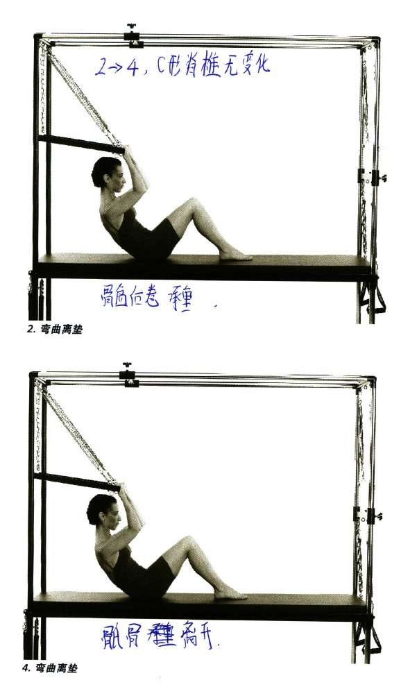
  - 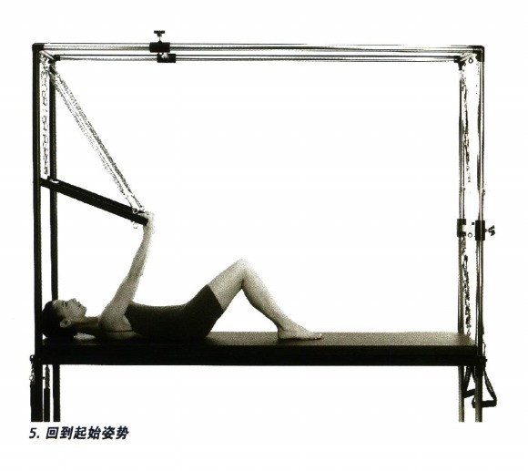

## 平行伸展系列練習 (TEASER SERIES)

- 頁碼：p.66-71
- 難度：中級
- 器械/章節：推拉框上面彈簧動作
- 肌群分類：[[../muscles/cadillac-intermediate-advanced-core-and-lumbopelvic-stability.md|中高階：核心與腰骨盆穩定]], [[../muscles/cadillac-intermediate-advanced-spinal-articulation.md|中高階：脊椎屈曲、伸展、旋轉與側屈]], [[../muscles/cadillac-intermediate-advanced-scapular-stabilizers.md|中高階：肩胛穩定與上背穩定肌]], [[../muscles/cadillac-intermediate-advanced-lat-teres-pulling-chain.md|中高階：背闊肌、大圓肌與拉力鏈]], [[../muscles/cadillac-intermediate-advanced-arms-delts-pecs.md|中高階：手臂、三角肌、胸大肌與前臂]], [[../muscles/cadillac-intermediate-advanced-hips-and-legs.md|中高階：髖與腿部控制]], [[../muscles/cadillac-intermediate-advanced-mobility-and-stretching.md|中高階：柔韌、伸展與懸掛釋放]]
- 摘要：平行伸展系列練習：主要歸入核心與腰骨盆穩定、脊椎屈曲、伸展、旋轉與側屈、肩胛穩定與上背穩定肌、背闊肌、大圓肌與拉力鏈；OCR 目標肌肉段落見下方摘錄。
- 器材設置：使用 1 根彈簧。練習期間須由受過訓練的專業人員在旁監督並提供幫助，且手扶推拉框；教練不可將身體靠向框體。
- 起始姿勢：仰臥，頭部朝向推拉框。骨盆和脊椎呈中立位。擺正位置，雙手上伸持框時略低於肩高。雙腿伸直且併攏。雙臂伸直，將推拉框推過頭頂，雙手與肩同寬，掌心向上。肩胛骨保持穩定。
- 動作流程：平行伸展：吸氣，穩定肩胛骨，彎曲肘關節，將框帶到額頭前方。呼氣，從頭部開始，通過腰椎下沉逐節活動脊椎離墊；同時彎曲髖部，雙腿伸離墊。繼續捲離墊，拉伸雙臂，僅以坐骨後部支撐身體平衡，腰椎微屈，拉伸胸椎。吸氣，從股骨前部捲離髂前上棘，通過腰椎下沉將脊椎逐節捲落回墊；同時伸長雙腿朝墊下落，彎曲肘關節，將框帶至前額。呼氣，繼續將雙腿落回墊上，並將軀幹上部和頭部捲落回墊，返回中立位；然後拉伸雙臂，將框推過頭頂。重複練習 5-10 次。手肘屈伸練習：完成上卷並保持 V 形姿勢後，吸氣，保持 V 形姿勢並彎曲雙肘；呼氣，伸展肘關節。重複練習 3 次，再依平行伸展的回程流程回到中立位。放腿和抬腿：完成上卷並保持 V 形姿勢後，吸氣，落下雙腿並保持骨盆穩定；呼氣，抬高腿部。重複練習 3 次，再依平行伸展的回程流程回到中立位。手臂和腿部交替動作：完成上卷並保持 V 形姿勢後，吸氣，彎曲雙肘；呼氣，伸展肘關節；吸氣，落下雙腿並保持骨盆穩定；呼氣，抬高腿部。重複練習 3 次，再依平行伸展的回程流程回到中立位。臂腿同時：完成上卷並保持 V 形姿勢後，吸氣，彎曲肘關節並降低雙腿；呼氣，伸展肘關節並抬高雙腿。重複練習 3 次，再依平行伸展的回程流程回到中立位。單腿調整：捲起時只抬高一條腿並保持其伸直，用於挑戰穩定性。
- OCR 原文摘錄：目標肌肉：以腹橫肌擠壓腹部，穩定腰骨盆部位；以深層骨盆底 仰臣，頭部朝向推拉框。骨盆和脊椎呈中立位。擺正位置，雙手 肌輔助腹橫肌運動；向心收縮腹直肌和腹斜肌，以使脊椎彎曲； 上伸持框時略低於肩高。雙腿伸直且併攏。雙臂伸直，推框過頭頂， 上背部豎脊肌向心收縮拉伸胸椎；肩胛骨穩定肌群 雙手與肩同寬，掌心向上。肩胛骨保持穩定。 ［2, 4,5］彎曲肘關節和向下拉框時，二頭肌和背闊肌向心收縮， 返回時離心收縮
- 動作圖：
  - 
  - 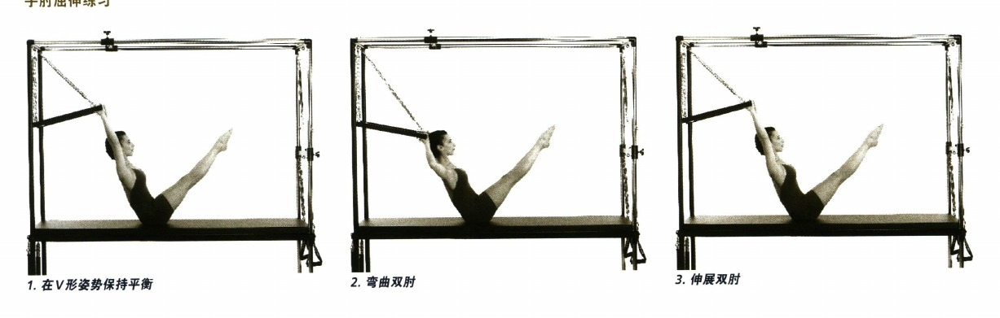
  - 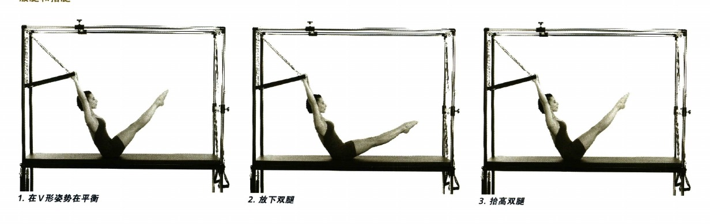
  - 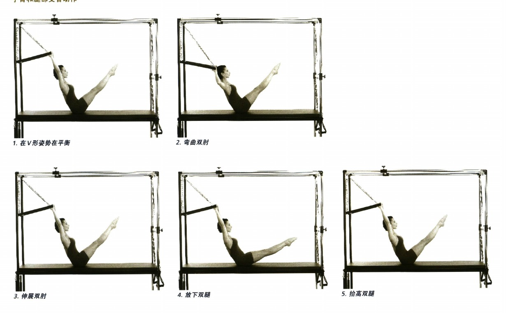
  - 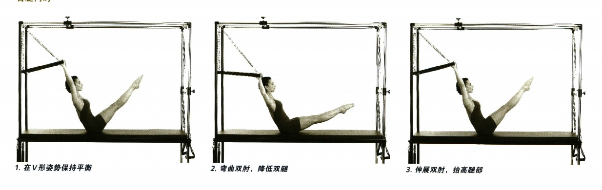

## 雙腳推拉 (PUSH THRU WITH FEET)

- 頁碼：p.72-75
- 難度：中級
- 器械/章節：推拉框上面彈簧動作
- 肌群分類：[[../muscles/cadillac-intermediate-advanced-core-and-lumbopelvic-stability.md|中高階：核心與腰骨盆穩定]], [[../muscles/cadillac-intermediate-advanced-spinal-articulation.md|中高階：脊椎屈曲、伸展、旋轉與側屈]], [[../muscles/cadillac-intermediate-advanced-scapular-stabilizers.md|中高階：肩胛穩定與上背穩定肌]], [[../muscles/cadillac-intermediate-advanced-hips-and-legs.md|中高階：髖與腿部控制]]
- 摘要：雙腳推拉：主要歸入核心與腰骨盆穩定、脊椎屈曲、伸展、旋轉與側屈、肩胛穩定與上背穩定肌、髖與腿部控制；OCR 目標肌肉段落見下方摘錄。
- OCR 原文摘錄：目標肌肉：以腹橫肌擠壓腹部，穩定腰骨盆部位；以深層骨盆底 上方 肌輔助腹橫肌運動：腹直肌和腹斜肌向心收縮，以開始上卷，在 ，捲曲上提時，脊椎循序逐節離床，向下捲動時，脊椎循序逐 頂部時離心收縮，向心收縮以開始下卷，在底部時離心收縮；向 節著墊 心收縮臀大肌和膕繩肌，使骨盆後部向大腿骨後部靠攏，在下卷 •上提時，脊椎捲曲至胸椎上部即可，不可捲曲至頸椎 底部離心收縮；等長收縮以將髖部維持在伸展姿勢；利用腹斜肌 和多裂肌防止身體旋轉：肩胛穩定肌群 ，保持腰椎和骨盆呈中立位，位於頂部姿勢時以大腿骨支撐骨盆 星中立位 ［1，31支撐側的臀大肌和膕繩肌等長收縮，另一條腿抬起；考驗腹 斜肌避免旋轉的能力 ，保持骨盆正對前方：一條腿抬離框時避免旋轉 ［2,3］膝關節彎曲時，膕繩肌向心收縮：膝關節伸展時，膕繩肌離 •一條腿抬起和/或膝關節彎曲時保持骨盆穩定 心收縮
- 動作圖：
  - 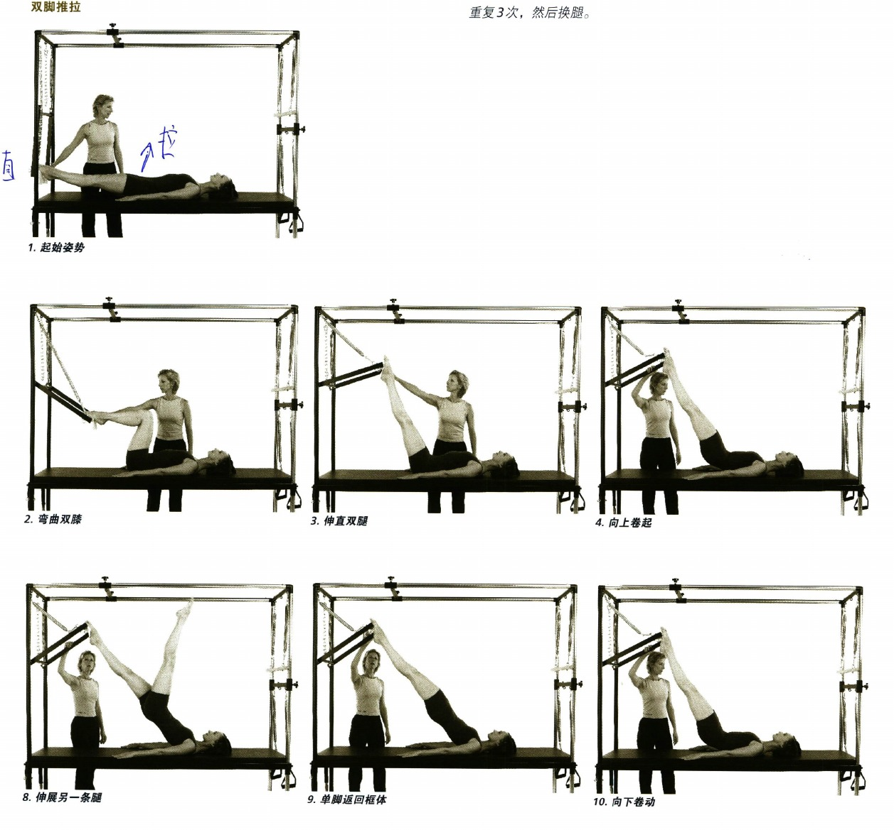
  - 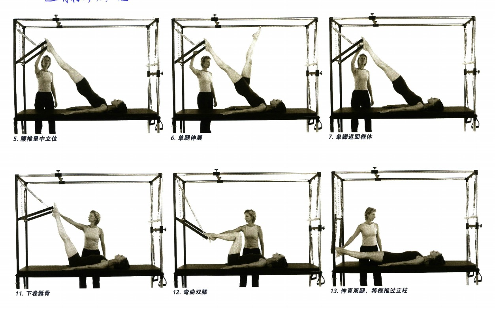
  - 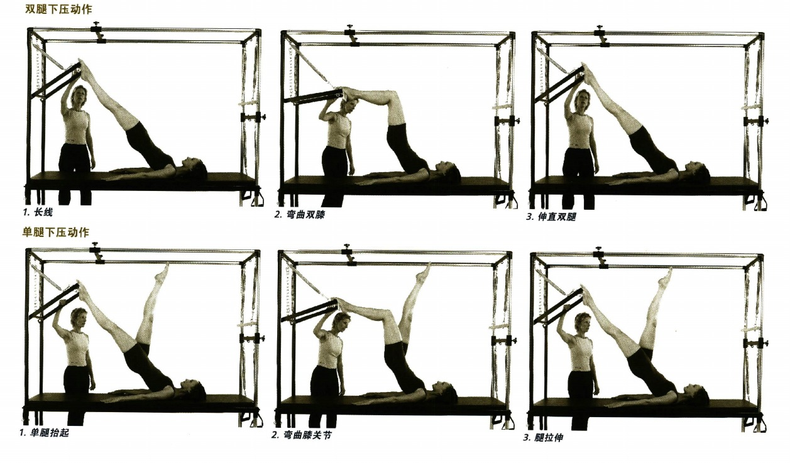
  - 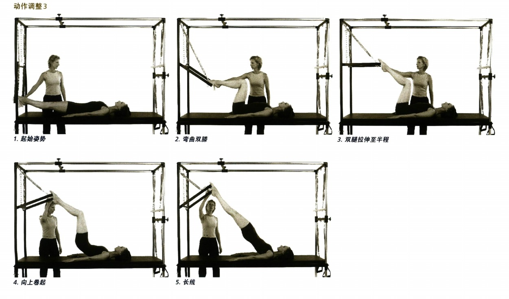

## 貓背 (CAT)

- 頁碼：p.76-77
- 難度：中級
- 器械/章節：推拉框上面彈簧動作
- 肌群分類：[[../muscles/cadillac-intermediate-advanced-core-and-lumbopelvic-stability.md|中高階：核心與腰骨盆穩定]], [[../muscles/cadillac-intermediate-advanced-spinal-articulation.md|中高階：脊椎屈曲、伸展、旋轉與側屈]], [[../muscles/cadillac-intermediate-advanced-scapular-stabilizers.md|中高階：肩胛穩定與上背穩定肌]], [[../muscles/cadillac-intermediate-advanced-hips-and-legs.md|中高階：髖與腿部控制]]
- 摘要：貓背：主要歸入核心與腰骨盆穩定、脊椎屈曲、伸展、旋轉與側屈、肩胛穩定與上背穩定肌、髖與腿部控制；OCR 目標肌肉段落見下方摘錄。
- OCR 原文摘錄：目標肌肉：以腹橫肌擠壓腹部，穩定腰骨盆部位；以深層骨盆底 上，與髖同寬。手臂朝前伸直，握住推拉框，與肩齊寬，掌心向下。 肌輔助腹橫肌運動；後仰時，腹斜肌、豎脊肌、臀大肌和膕繩肌 肩胛骨保持穩定。 等長收縮，以穩定軀幹和骨盆；腹直肌和腹斜肌向心收縮，以彎 曲脊椎，脊椎伸展時離心收縮；豎脊肌向心收縮，以伸展脊椎
- 動作圖：
  - 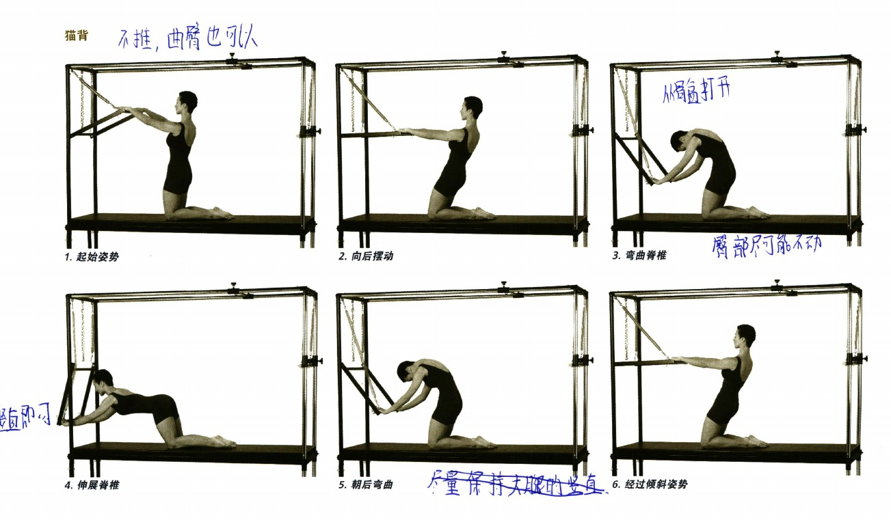
  - 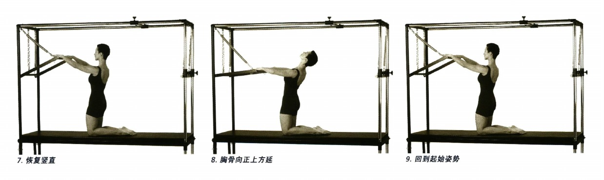

## 俯臥推拉加後背伸展 (PUSH THRU ON STOMACH BACK EXTENDED)

- 頁碼：p.78-79
- 難度：中級
- 器械/章節：推拉框上面彈簧動作
- 肌群分類：[[../muscles/cadillac-intermediate-advanced-core-and-lumbopelvic-stability.md|中高階：核心與腰骨盆穩定]], [[../muscles/cadillac-intermediate-advanced-spinal-articulation.md|中高階：脊椎屈曲、伸展、旋轉與側屈]]
- 摘要：俯臥推拉加後背伸展：主要歸入核心與腰骨盆穩定、脊椎屈曲、伸展、旋轉與側屈；OCR 目標肌肉段落見下方摘錄。
- OCR 原文摘錄：目標肌肉：以腹橫肌擠壓腹部，穩定腰骨盆部位；以深層骨盆底 1根彈簧 肌輔助腹橫肌運動；脊椎伸展時，向心收縮豎脊肌，復位時離心
- 動作圖：
  - 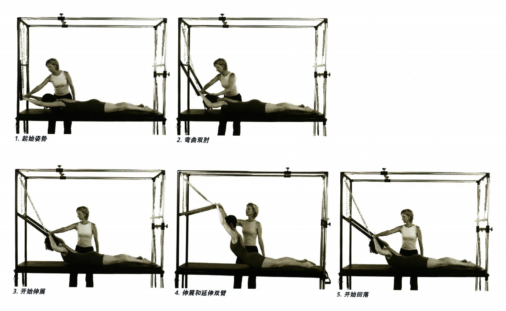
  - 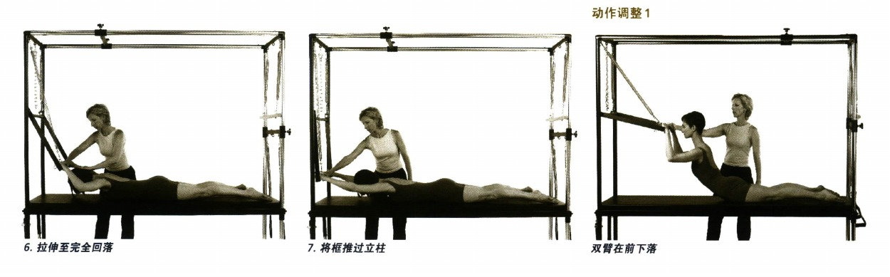

## 旋轉美人魚姿 (MERMAID WITH ROTATION)

- 頁碼：p.80-81
- 難度：中級
- 器械/章節：推拉框上面彈簧動作
- 肌群分類：[[../muscles/cadillac-intermediate-advanced-core-and-lumbopelvic-stability.md|中高階：核心與腰骨盆穩定]], [[../muscles/cadillac-intermediate-advanced-spinal-articulation.md|中高階：脊椎屈曲、伸展、旋轉與側屈]], [[../muscles/cadillac-intermediate-advanced-scapular-stabilizers.md|中高階：肩胛穩定與上背穩定肌]], [[../muscles/cadillac-intermediate-advanced-arms-delts-pecs.md|中高階：手臂、三角肌、胸大肌與前臂]], [[../muscles/cadillac-intermediate-advanced-mobility-and-stretching.md|中高階：柔韌、伸展與懸掛釋放]]
- 摘要：旋轉美人魚姿：主要歸入核心與腰骨盆穩定、脊椎屈曲、伸展、旋轉與側屈、肩胛穩定與上背穩定肌、手臂、三角肌、胸大肌與前臂；OCR 目標肌肉段落見下方摘錄。
- OCR 原文摘錄：目標肌肉：以腹橫肌擠壓腹部，穩定腰骨盆部位；以深層骨盆底 立柱。 肌輔助腹橫肌運動；距離推拉框最近的腹內外斜肌向心收縮，以 吸氣 軀幹重新旋轉至側屈狀態，同時將後臂前移，並將另一隻 側拉軀幹；一側的腹外斜肌和另一側的腹內斜肌向心收縮，將軀 手臂舉過頭頂。然後彎曲肘關節，將框帶向腰部，同時將 幹上部朝框旋轉；腹直肌和腹斜肌向心收縮，以彎曲脊椎；位於 脊椎從尾椎骨至頭部返回豎直位。動作臂保持伸過頭頂。 上方的腹內外斜肌向心收縮，回到豎直位；以腹斜肌避免傾斜時 腰椎過度伸展；肩胛骨穩定肌群 呼氣 保持肩胛骨穩定，拉伸手臂，同時控制框上移。同時，軀 幹向框傾斜，頭頂朝框伸展，動作臂落至墊。
- 動作圖：
  - 
  - 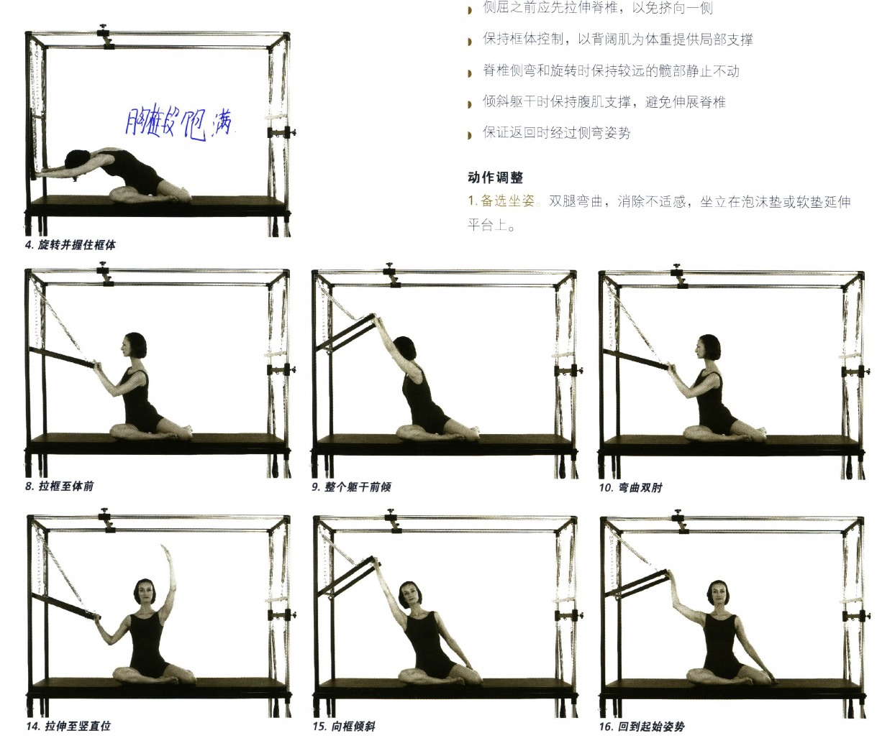

## 側體扭轉 (SIDE BODY TWIST)

- 頁碼：p.82-83
- 難度：高階
- 器械/章節：推拉框上面彈簧動作
- 肌群分類：[[../muscles/cadillac-intermediate-advanced-core-and-lumbopelvic-stability.md|中高階：核心與腰骨盆穩定]], [[../muscles/cadillac-intermediate-advanced-spinal-articulation.md|中高階：脊椎屈曲、伸展、旋轉與側屈]], [[../muscles/cadillac-intermediate-advanced-scapular-stabilizers.md|中高階：肩胛穩定與上背穩定肌]], [[../muscles/cadillac-intermediate-advanced-lat-teres-pulling-chain.md|中高階：背闊肌、大圓肌與拉力鏈]], [[../muscles/cadillac-intermediate-advanced-hips-and-legs.md|中高階：髖與腿部控制]]
- 摘要：側體扭轉：主要歸入核心與腰骨盆穩定、脊椎屈曲、伸展、旋轉與側屈、肩胛穩定與上背穩定肌、背闊肌、大圓肌與拉力鏈；OCR 目標肌肉段落見下方摘錄。
- OCR 原文摘錄：目標肌肉：以腹橫肌擠壓腹部，穩定腰骨盆部位；以深層骨盆底 掌心向下，放在大腿上。 肌輔助腹橫肌運動；同側腹內外斜肌向心收縮，以側彎身體面； 肩胛骨穩定肌群，特別是支撐面上的背闊肌；雙腿抬起時，髖屈
- 動作圖：
  - 
  - 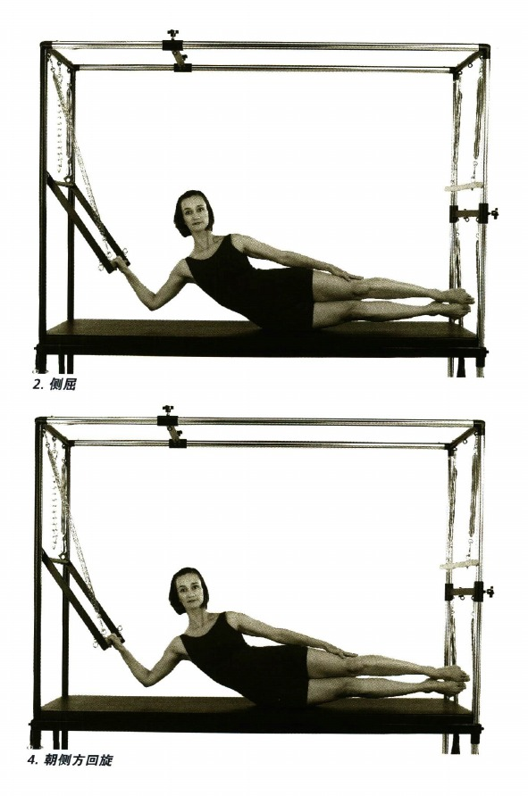
  - 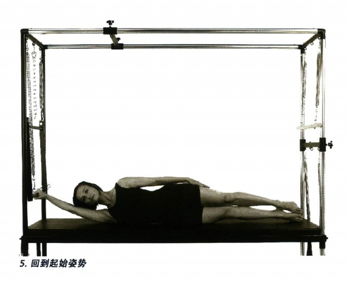

## 仰臥推拉加伸展 (PUSH THRU ON BACK WITH EXTENSION)

- 頁碼：p.84-87
- 難度：高階
- 器械/章節：推拉框上面彈簧動作
- 肌群分類：[[../muscles/cadillac-intermediate-advanced-core-and-lumbopelvic-stability.md|中高階：核心與腰骨盆穩定]], [[../muscles/cadillac-intermediate-advanced-spinal-articulation.md|中高階：脊椎屈曲、伸展、旋轉與側屈]], [[../muscles/cadillac-intermediate-advanced-scapular-stabilizers.md|中高階：肩胛穩定與上背穩定肌]], [[../muscles/cadillac-intermediate-advanced-arms-delts-pecs.md|中高階：手臂、三角肌、胸大肌與前臂]], [[../muscles/cadillac-intermediate-advanced-hips-and-legs.md|中高階：髖與腿部控制]]
- 摘要：仰臥推拉加伸展：主要歸入核心與腰骨盆穩定、脊椎屈曲、伸展、旋轉與側屈、肩胛穩定與上背穩定肌、手臂、三角肌、胸大肌與前臂；OCR 目標肌肉段落見下方摘錄。
- OCR 原文摘錄：目標肌肉：以腹橫肌擠壓腹部，穩定腰骨盆部位；以深層骨盆底 呼氣 保持肩胛骨穩定，彎曲肘關節，將框拉至額頭前。 肌輔助腹橫肌運動；向心收縮腹直肌和腹斜肌，以使脊椎彎曲； 豎脊肌向心收縮以形成脊柱伸展，同時等長收縮以維持脊柱伸展； 吸氣 保持肘關節彎曲，以促進肩胛骨穩定以及胸骨朝向框體（以 腹斜肌用以防止腰椎過度伸展；肌肩胛骨穩定肌群 便擴充套件脊椎）為宜。然後保持脊柱伸展，骨盆朝股骨前傾， 身體抬起，呈坐位。
- 動作圖：
  - 
  - 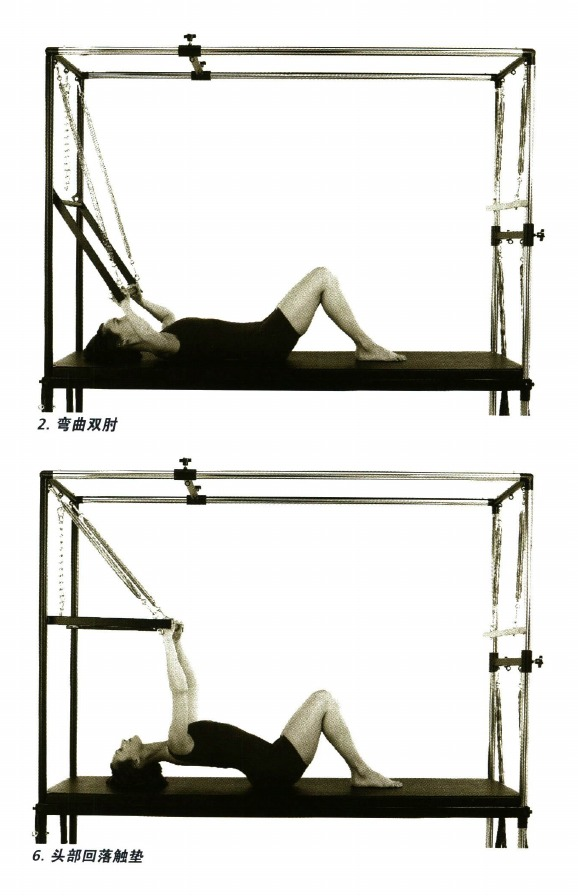
  - 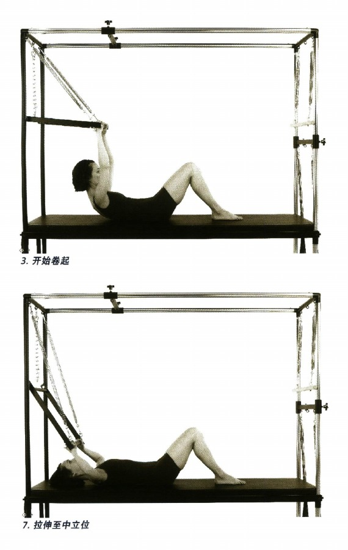
  - 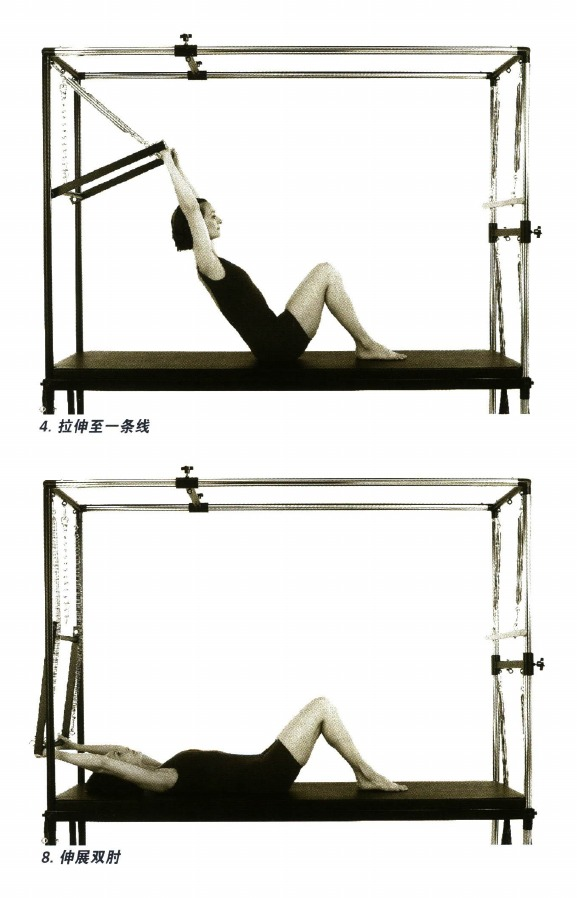
  - 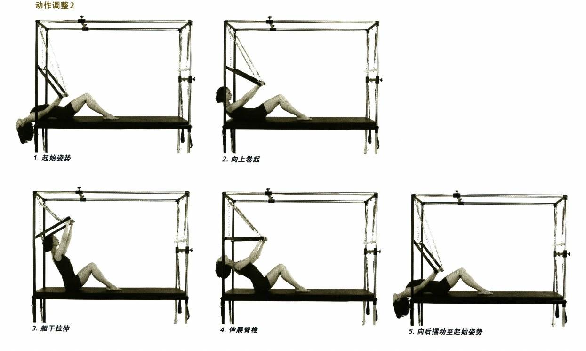
  - 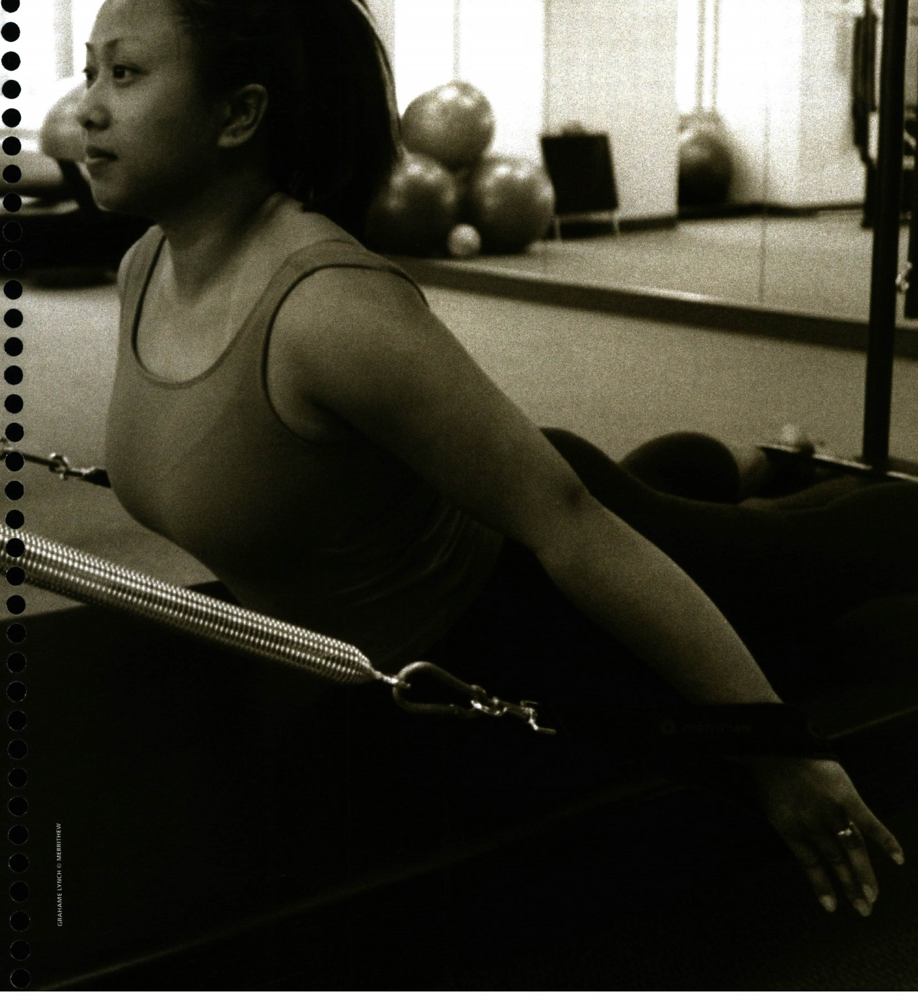

## 橋式 (BRIDGE)

- 頁碼：p.88-94
- 難度：高階
- 器械/章節：推拉框上面彈簧動作
- 肌群分類：[[../muscles/cadillac-intermediate-advanced-core-and-lumbopelvic-stability.md|中高階：核心與腰骨盆穩定]], [[../muscles/cadillac-intermediate-advanced-spinal-articulation.md|中高階：脊椎屈曲、伸展、旋轉與側屈]], [[../muscles/cadillac-intermediate-advanced-scapular-stabilizers.md|中高階：肩胛穩定與上背穩定肌]], [[../muscles/cadillac-intermediate-advanced-arms-delts-pecs.md|中高階：手臂、三角肌、胸大肌與前臂]], [[../muscles/cadillac-intermediate-advanced-hips-and-legs.md|中高階：髖與腿部控制]]
- 摘要：橋式：主要歸入核心與腰骨盆穩定、脊椎屈曲、伸展、旋轉與側屈、肩胛穩定與上背穩定肌、手臂、三角肌、胸大肌與前臂；OCR 目標肌肉段落見下方摘錄。
- OCR 原文摘錄：目標肌肉：以腹橫肌擠壓腹部，穩定腰骨盆部位；以深層骨盆底 ，臀大肌和膕繩肌用力，繼續向後傾斜骨盆，將骨盆屈離墊，然 肌輔助腹橫肌運動；向心收縮腹直肌和腹斜肌，以使脊椎彎曲； 後伸展髖部，並在伸展中穩定骨盆 臀大肌和膽繩肌向心收縮，從而在骨盆提離床面時，將骨盆回拉 ，軀幹朝上滑向立柱和朝下滑離立柱時，繼續彎曲脊椎 向股骨後方並伸展髖部；豎脊肌向心收縮以伸展脊椎；利用腹斜 肌防止腰椎過度伸展；腹斜肌和豎脊肌用以使將軀幹和骨盆穩定 ，保持肩胛骨穩定，稍微屈肘，以調動彈簧張力，協助將整個身 在伸展姿勢；股四頭肌向心收縮，以伸展雙膝和提起軀幹，軀幹 體抬離墊 回落墊上時離心收縮；肩胛骨穩定肌群 ，保持腹肌收緊，以避免腰椎過度伸展
- 動作圖：
  - 
  - 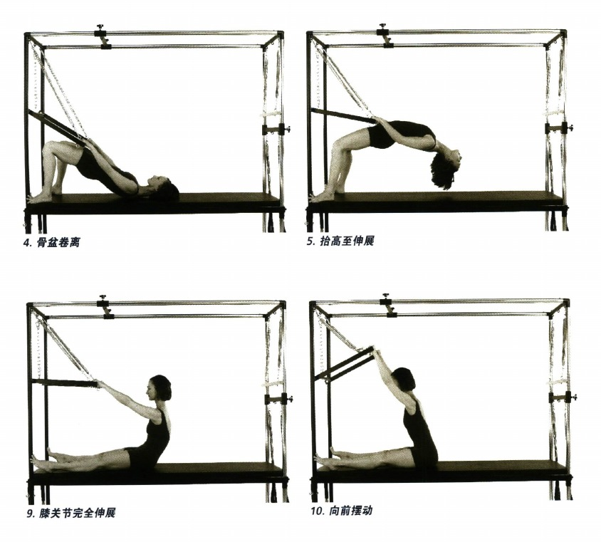
  - 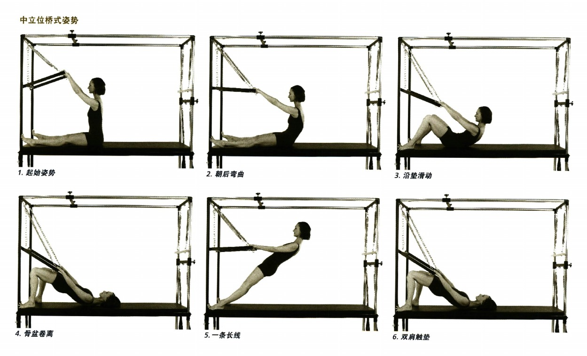
  - 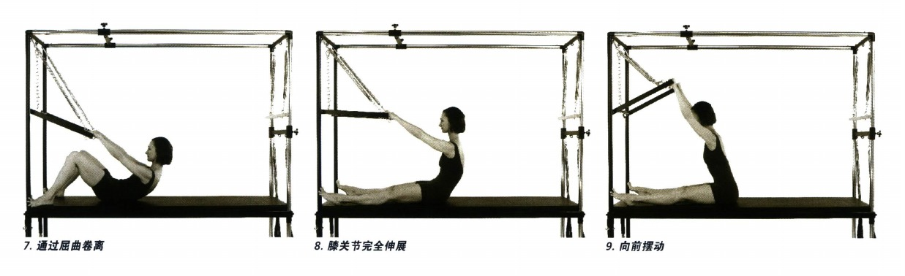
  - 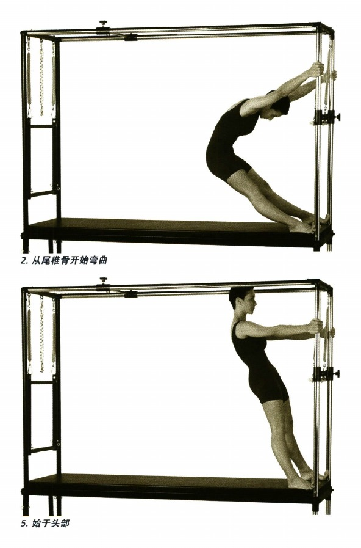
  - 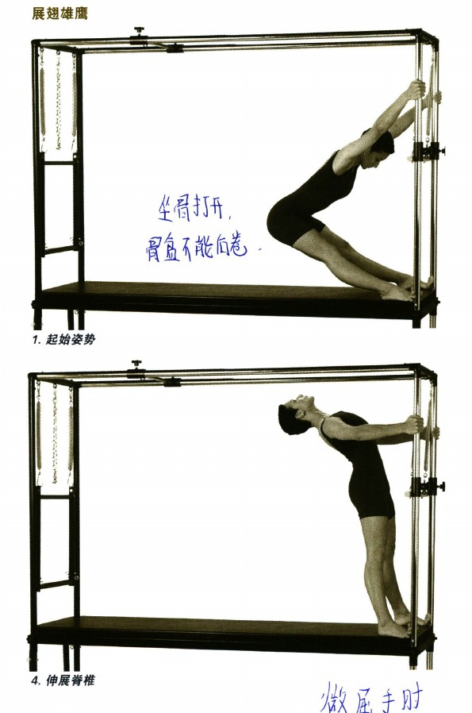
  - 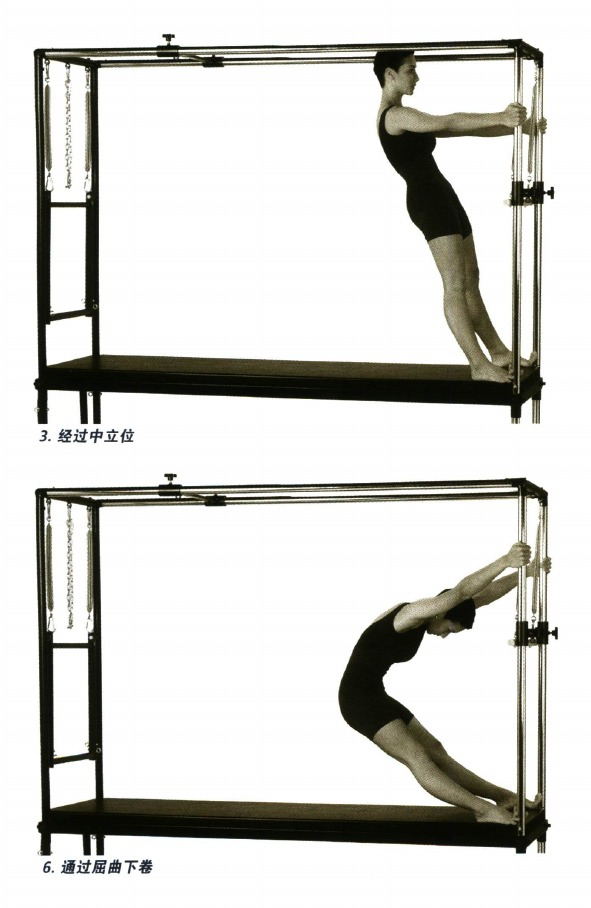
  - 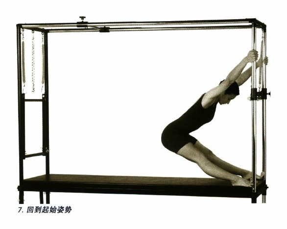
  - 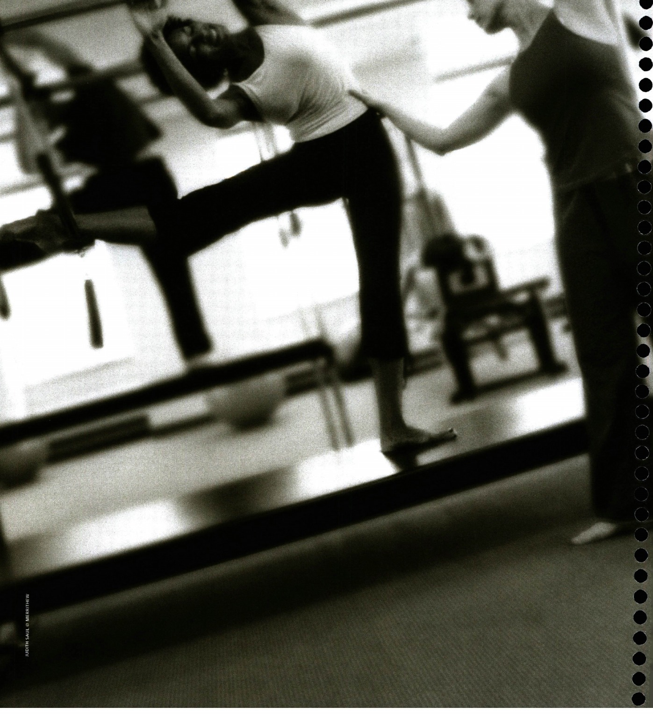

## 膝部上提 (KNEE RAISES)

- 頁碼：p.95
- 難度：高階
- 器械/章節：水平槓垂掛
- 肌群分類：[[../muscles/cadillac-intermediate-advanced-core-and-lumbopelvic-stability.md|中高階：核心與腰骨盆穩定]], [[../muscles/cadillac-intermediate-advanced-spinal-articulation.md|中高階：脊椎屈曲、伸展、旋轉與側屈]], [[../muscles/cadillac-intermediate-advanced-scapular-stabilizers.md|中高階：肩胛穩定與上背穩定肌]], [[../muscles/cadillac-intermediate-advanced-lat-teres-pulling-chain.md|中高階：背闊肌、大圓肌與拉力鏈]], [[../muscles/cadillac-intermediate-advanced-arms-delts-pecs.md|中高階：手臂、三角肌、胸大肌與前臂]], [[../muscles/cadillac-intermediate-advanced-hips-and-legs.md|中高階：髖與腿部控制]]
- 摘要：膝部上提：主要歸入核心與腰骨盆穩定、脊椎屈曲、伸展、旋轉與側屈、肩胛穩定與上背穩定肌、背闊肌、大圓肌與拉力鏈；OCR 目標肌肉段落見下方摘錄。
- OCR 原文摘錄：目標肌肉：以腹橫肌擠壓腹部，穩定腰骨盆部位；以深層骨盆底 肩同寬（使用防滑墊防滑）。脊椎上部呈中立位，腰椎下沉，骨盆 肌輔助腹橫肌運動；腹直肌和腹斜肌等長收縮，以穩定骨盆：膝 略微後傾。雙腿伸直併攏，朝向地面，踝關節蹠屈。雙臂伸長， 部抬起時，髖屈肌向心收縮，在膝部降低時離心收縮；肩胛骨穩 肩胛骨保持穩定。 定肌群，特別是背闊肌和下斜方肌；以前臂肌肉穩定抓握
- 動作圖：
  - 

## 膝部上提加側旋轉 (KNEE RAISES WITH OBLIQUES)

- 頁碼：p.96-97
- 難度：高階
- 器械/章節：水平槓垂掛
- 肌群分類：[[../muscles/cadillac-intermediate-advanced-core-and-lumbopelvic-stability.md|中高階：核心與腰骨盆穩定]], [[../muscles/cadillac-intermediate-advanced-spinal-articulation.md|中高階：脊椎屈曲、伸展、旋轉與側屈]], [[../muscles/cadillac-intermediate-advanced-scapular-stabilizers.md|中高階：肩胛穩定與上背穩定肌]], [[../muscles/cadillac-intermediate-advanced-lat-teres-pulling-chain.md|中高階：背闊肌、大圓肌與拉力鏈]], [[../muscles/cadillac-intermediate-advanced-arms-delts-pecs.md|中高階：手臂、三角肌、胸大肌與前臂]], [[../muscles/cadillac-intermediate-advanced-hips-and-legs.md|中高階：髖與腿部控制]]
- 摘要：膝部上提加側旋轉：主要歸入核心與腰骨盆穩定、脊椎屈曲、伸展、旋轉與側屈、肩胛穩定與上背穩定肌、背闊肌、大圓肌與拉力鏈；OCR 目標肌肉段落見下方摘錄。
- OCR 原文摘錄：目標肌肉：以腹橫肌擠壓腹部，穩定腰骨盆部位；以深層骨盆底 肩同寬（使用防滑墊防滑）。脊椎上部呈中立位，腰椎下沉，骨盆 肌輔助腹橫肌運動；腹直肌和腹斜肌等長收縮，以穩定骨盆：向 略微後傾。雙腿伸直併攏，朝向地面，踝關節蹠屈。雙臂伸長， 心收縮一側腹外斜肌和另一側腹內斜肌，以使骨盆旋轉；膝部抬 肩胛骨保持穩定。 起時，髖屈肌向心收縮，在膝部降低時離心收縮；肩胛骨穩定肌群， 特別是背闊肌和下斜方肌；以前臂肌肉穩定抓握
- 動作圖：
  - 
  - 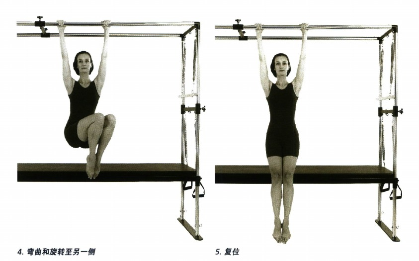

## 畫弧 (CIRCLES)

- 頁碼：p.98-99
- 難度：高階
- 器械/章節：水平槓垂掛
- 肌群分類：[[../muscles/cadillac-intermediate-advanced-core-and-lumbopelvic-stability.md|中高階：核心與腰骨盆穩定]], [[../muscles/cadillac-intermediate-advanced-spinal-articulation.md|中高階：脊椎屈曲、伸展、旋轉與側屈]], [[../muscles/cadillac-intermediate-advanced-scapular-stabilizers.md|中高階：肩胛穩定與上背穩定肌]], [[../muscles/cadillac-intermediate-advanced-hips-and-legs.md|中高階：髖與腿部控制]]
- 摘要：畫弧：主要歸入核心與腰骨盆穩定、脊椎屈曲、伸展、旋轉與側屈、肩胛穩定與上背穩定肌、髖與腿部控制；OCR 目標肌肉段落見下方摘錄。
- OCR 原文摘錄：目標肌肉：以腹橫肌擠壓腹部，穩定腰骨盆部位；以深層骨盆底 肩同寬（使用防滑墊防滑）。脊椎上部呈中立位，腰椎下沉，骨盆 肌輔助腹橫肌運動；腹直肌和腹斜肌等長收縮，穩定骨盆；雙腿 略微後傾。雙腿伸直併攏，朝向地面，踝關節蹠屈。雙臂伸長， 抬高時，髖屈肌向心收縮，在雙腿降低時離心收縮：由於力臂加 肩胛骨保持穩定。 長，與膝部抬起相比會接受更多考驗；髖外展肌向心收縮實現外 展；髖內收肌向心收縮實現內收；以肩胛骨穩定肌群特別是下斜
- 動作圖：
  - 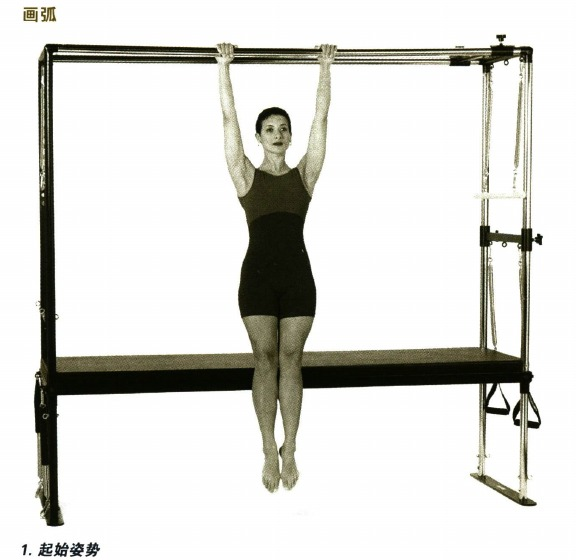
  - 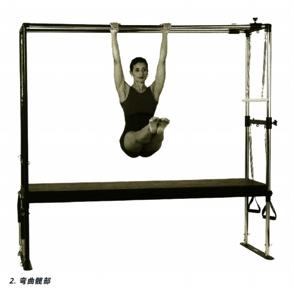
  - 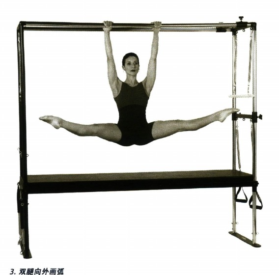
  - 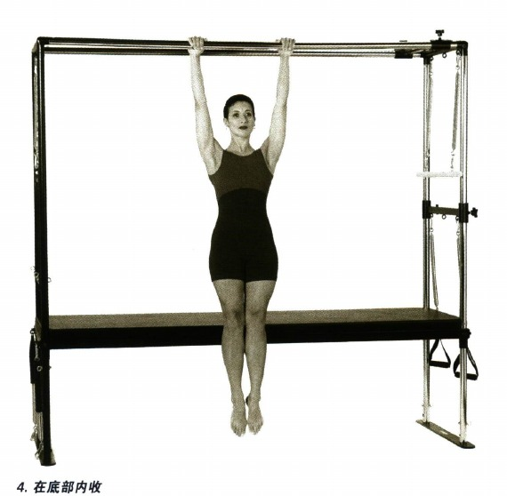

## 拍擊 (BEATS)

- 頁碼：p.100-101
- 難度：高階
- 器械/章節：水平槓垂掛
- 肌群分類：[[../muscles/cadillac-intermediate-advanced-core-and-lumbopelvic-stability.md|中高階：核心與腰骨盆穩定]], [[../muscles/cadillac-intermediate-advanced-spinal-articulation.md|中高階：脊椎屈曲、伸展、旋轉與側屈]], [[../muscles/cadillac-intermediate-advanced-scapular-stabilizers.md|中高階：肩胛穩定與上背穩定肌]], [[../muscles/cadillac-intermediate-advanced-lat-teres-pulling-chain.md|中高階：背闊肌、大圓肌與拉力鏈]], [[../muscles/cadillac-intermediate-advanced-arms-delts-pecs.md|中高階：手臂、三角肌、胸大肌與前臂]], [[../muscles/cadillac-intermediate-advanced-hips-and-legs.md|中高階：髖與腿部控制]]
- 摘要：拍擊：主要歸入核心與腰骨盆穩定、脊椎屈曲、伸展、旋轉與側屈、肩胛穩定與上背穩定肌、背闊肌、大圓肌與拉力鏈；OCR 目標肌肉段落見下方摘錄。
- 器材設置：水平槓垂掛。使用防滑墊防滑。
- 起始姿勢：
  懸垂於凱迪拉克上的水平槓上，身體前面面向凱迪拉克。雙手握住水平槓，與肩同寬。肩胛骨保持穩定。脊椎微微伸展，但保持良好穩定。雙腿伸直併攏，微微外旋，髖部伸展，使大腿不要靠在床沿上。
- 動作流程：
  吸氣，默數四個數，開合雙腿，踝關節蹠屈，強調內收。
  呼氣，默數四個數，開合雙腿，踝背屈，強調內收。
  整套動作練習 4 組。
- OCR 原文摘錄：目標肌肉：以腹橫肌擠壓腹部，穩定腰骨盆部位：以深層骨盆底 肌輔助腹橫肌運動；等長收縮豎脊肌，以使脊椎保持伸展：腹斜 肌用以防止腰椎過度伸展；等長收縮臀大肌和膕繩肌，以使髖部 保持伸展：髖外展肌向心收縮，以分開雙腿；髖內收肌向心收縮， 以併攏雙腿；肩胛骨穩定肌群，特別是背闊肌和下斜方肌；前臂 肌肉用於穩定抓握
- 動作圖：
  - 

## 猴姿 (MONKEY)

- 頁碼：p.102-103
- 難度：中級
- 器械/章節：推拉框下面彈簧動作
- 肌群分類：[[../muscles/cadillac-intermediate-advanced-core-and-lumbopelvic-stability.md|中高階：核心與腰骨盆穩定]], [[../muscles/cadillac-intermediate-advanced-spinal-articulation.md|中高階：脊椎屈曲、伸展、旋轉與側屈]], [[../muscles/cadillac-intermediate-advanced-scapular-stabilizers.md|中高階：肩胛穩定與上背穩定肌]], [[../muscles/cadillac-intermediate-advanced-hips-and-legs.md|中高階：髖與腿部控制]], [[../muscles/cadillac-intermediate-advanced-mobility-and-stretching.md|中高階：柔韌、伸展與懸掛釋放]]
- 摘要：猴姿：主要歸入核心與腰骨盆穩定、脊椎屈曲、伸展、旋轉與側屈、肩胛穩定與上背穩定肌、髖與腿部控制；OCR 目標肌肉段落見下方摘錄。
- OCR 原文摘錄：目標肌肉：以腹橫肌擠壓腹部，穩定腰骨盆部位；以深層骨盆底 正上方推框。雙腿拉伸，用框將軀幹拉至一個較為垂直的 肌輔助腹橫肌運動；腹斜肌等長收縮，以保持脊椎屈曲；膝關節 姿勢（請勿使用雙臂拉伸軀幹）；以坐骨後方支撐，整個脊 伸展時，四頭肌向心收縮，返回時離心收縮；腓腸肌和比目魚肌 椎略微彎曲。 向心收縮至踝關節蹠屈，背屈時離心收縮；肩胛骨穩定肌群 呼氣 保持雙腿伸直，背屈踝背屈，略微降低框體。
- 動作圖：
  - 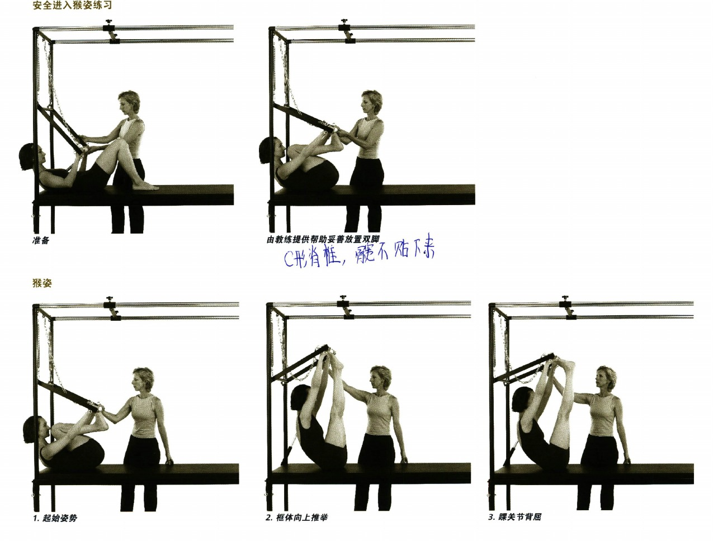
  - 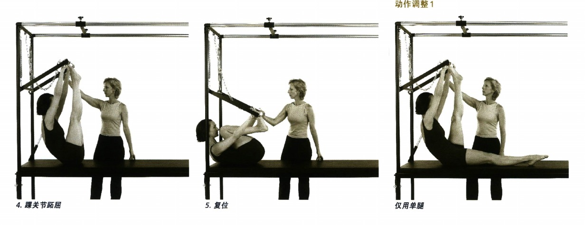

## 斷頭臺 (GUILLOTINE)

- 頁碼：p.104-105
- 難度：中級
- 器械/章節：推拉框下面彈簧動作
- 肌群分類：[[../muscles/cadillac-intermediate-advanced-core-and-lumbopelvic-stability.md|中高階：核心與腰骨盆穩定]], [[../muscles/cadillac-intermediate-advanced-spinal-articulation.md|中高階：脊椎屈曲、伸展、旋轉與側屈]], [[../muscles/cadillac-intermediate-advanced-scapular-stabilizers.md|中高階：肩胛穩定與上背穩定肌]], [[../muscles/cadillac-intermediate-advanced-hips-and-legs.md|中高階：髖與腿部控制]]
- 摘要：斷頭臺：主要歸入核心與腰骨盆穩定、脊椎屈曲、伸展、旋轉與側屈、肩胛穩定與上背穩定肌、髖與腿部控制；OCR 目標肌肉段落見下方摘錄。
- OCR 原文摘錄：目標肌肉：以腹橫肌擠壓腹部，穩定腰骨盆部位；以深層骨盆底 1.準備動作1 112347 4.7.有應的還聲磅 肌輔助腹橫肌運動；以腹直肌和腹斜肌向心收縮，將脊椎卷離墊， 吸氣 伸展膝關節，踝關節蹠屈，將骶骨降到墊。 返回時離心收縮；股四頭肌向心收縮，以伸展膝關節，返回時離 腿的份置不動力 心收縮；臀大肌和膕繩肌向心收縮，以將骨盆後部帶至股骨後部； 呼氣 從尾椎骨開始，逐節活動脊椎至離開墊，直到以胸椎上部 腓腸肌和比目魚肌向心收縮，踝關節蹠屈，踝背屈時離心收縮； 支撐。 肩胛骨穩定肌群 吸氣 維持軀幹的姿勢，彎曲膝關節，背屈踝關節，降低框體。
- 動作圖：
  - 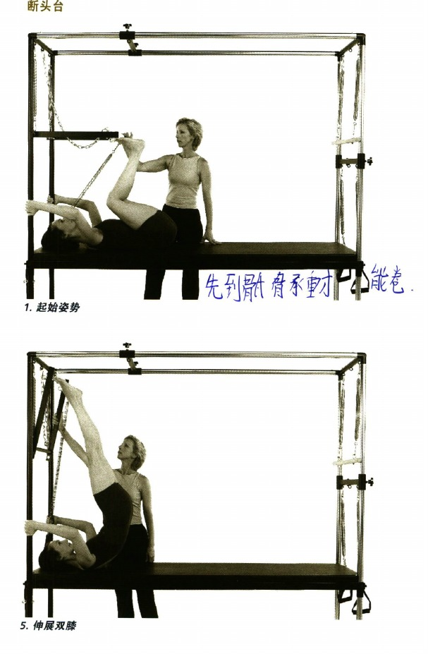
  - 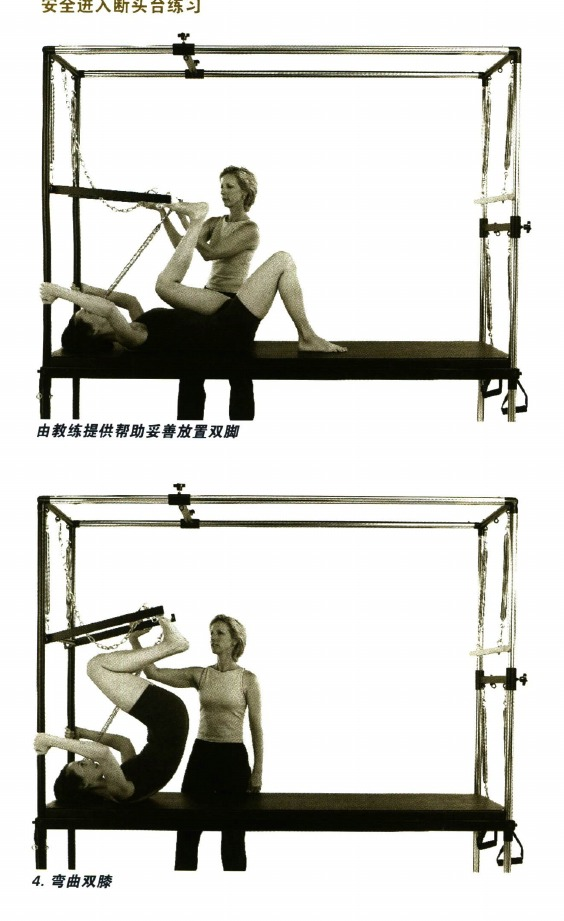
  - 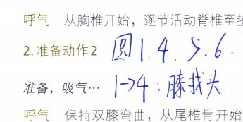
  - 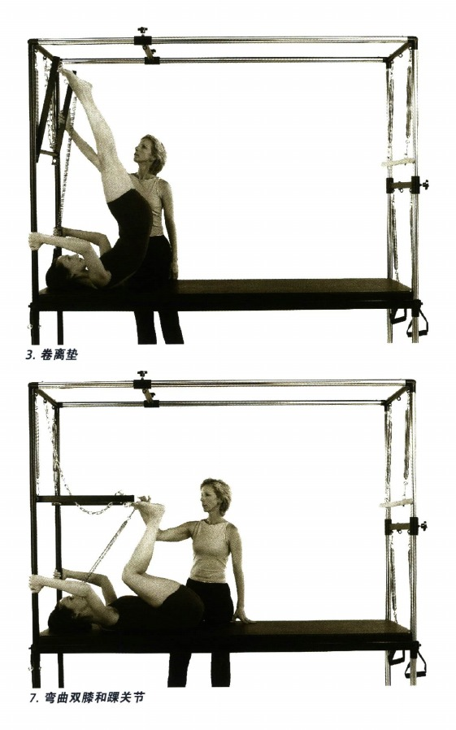
  - 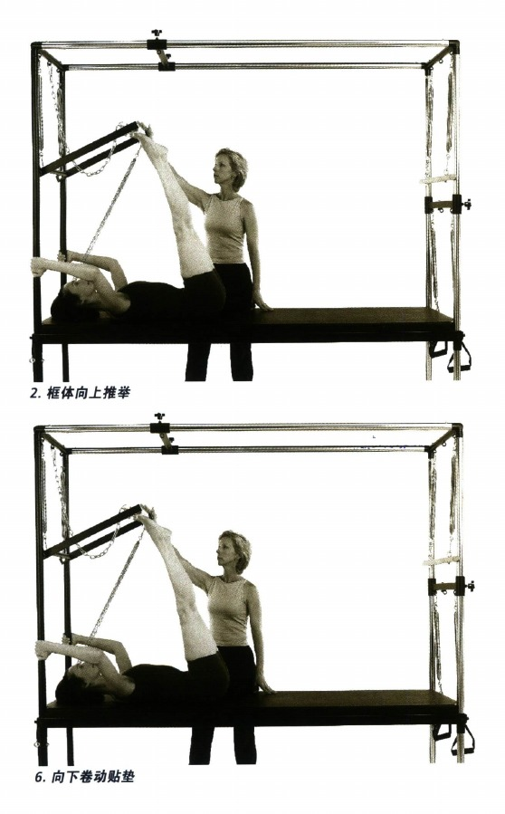

## HIP OPENER (HIP OPENER)

- 頁碼：p.106-107
- 難度：中級
- 器械/章節：推拉框下面彈簧動作
- 肌群分類：[[../muscles/cadillac-intermediate-advanced-core-and-lumbopelvic-stability.md|中高階：核心與腰骨盆穩定]], [[../muscles/cadillac-intermediate-advanced-spinal-articulation.md|中高階：脊椎屈曲、伸展、旋轉與側屈]], [[../muscles/cadillac-intermediate-advanced-scapular-stabilizers.md|中高階：肩胛穩定與上背穩定肌]], [[../muscles/cadillac-intermediate-advanced-hips-and-legs.md|中高階：髖與腿部控制]]
- 摘要：HIP OPENER：主要歸入核心與腰骨盆穩定、脊椎屈曲、伸展、旋轉與側屈、肩胛穩定與上背穩定肌、髖與腿部控制；OCR 目標肌肉段落見下方摘錄。
- OCR 原文摘錄：目標肌肉：以腹橫肌擠壓腹部，穩定腰骨盆部位；以深層骨盆底 肌輔助腹橫肌運動；以腹斜肌和豎脊肌穩定軀幹呈中立位；以腹 斜肌和多裂肌防止骨盆的旋轉；膝關節伸展時，股四頭肌向心收 縮，返回時離心收縮；踝關節蹠屈時，腓腸肌和比目魚肌向心收縮， 背屈時離心收縮：以外旋肌群保持髖關節內股骨的旋轉；肩胛骨 穩定肌群
- 動作圖：
  - 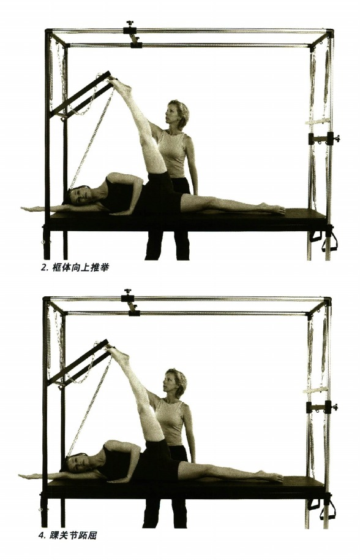
  - 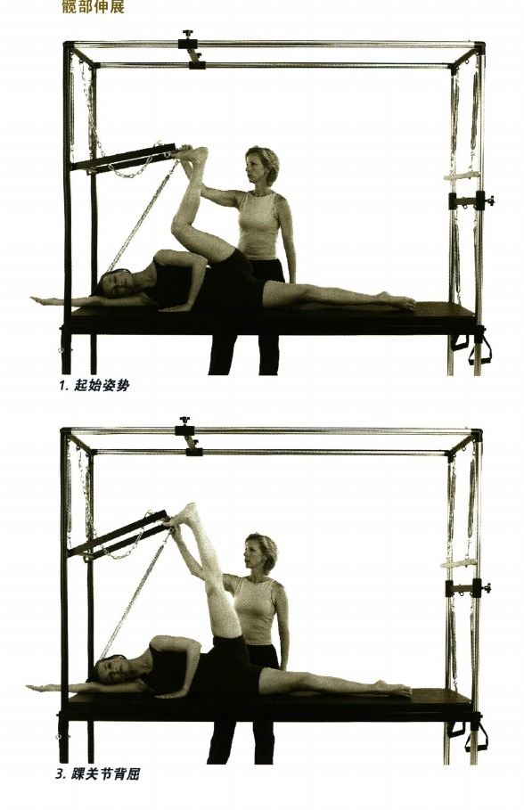
  - 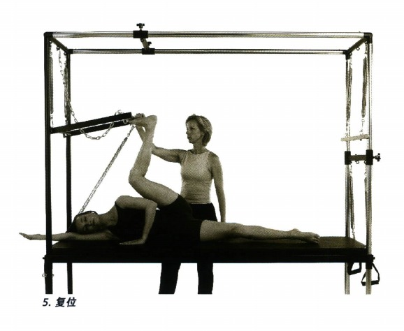

## 平行伸展系列練習 (TEASER SERIES)

- 頁碼：p.108-113
- 難度：高階
- 器械/章節：推拉框下面彈簧動作
- 肌群分類：[[../muscles/cadillac-intermediate-advanced-core-and-lumbopelvic-stability.md|中高階：核心與腰骨盆穩定]], [[../muscles/cadillac-intermediate-advanced-spinal-articulation.md|中高階：脊椎屈曲、伸展、旋轉與側屈]], [[../muscles/cadillac-intermediate-advanced-scapular-stabilizers.md|中高階：肩胛穩定與上背穩定肌]], [[../muscles/cadillac-intermediate-advanced-arms-delts-pecs.md|中高階：手臂、三角肌、胸大肌與前臂]], [[../muscles/cadillac-intermediate-advanced-hips-and-legs.md|中高階：髖與腿部控制]], [[../muscles/cadillac-intermediate-advanced-mobility-and-stretching.md|中高階：柔韌、伸展與懸掛釋放]]
- 摘要：平行伸展系列練習：主要歸入核心與腰骨盆穩定、脊椎屈曲、伸展、旋轉與側屈、肩胛穩定與上背穩定肌、手臂、三角肌、胸大肌與前臂；OCR 目標肌肉段落見下方摘錄。
- OCR 原文摘錄：目標肌肉：以腹橫肌擠壓腹部，穩定腰骨盆部位；以深層骨盆底 仰臥，骨盆和脊椎呈中立位，頭部朝向推拉框。擺正位置，雙手 肌輔助腹橫肌運動；向心收縮腹直肌和腹斜肌，以使脊椎彎曲； 持框時略低於肩高。雙臂彎曲，抓住框體，與肩同寬。雙腿伸展 上背部豎脊肌向心收縮拉伸胸椎；肩胛骨穩定肌群 並併攏。肩胛骨保持穩定。 ［2, 4， 5］肘關節彎曲時，肱三頭肌和三角肌離心收縮，肘關節伸 展和向上推框時，肱三頭肌和三角肌向心收縮
- 動作圖：
  - 
  - 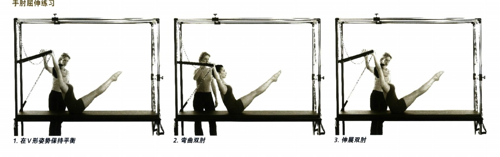
  - 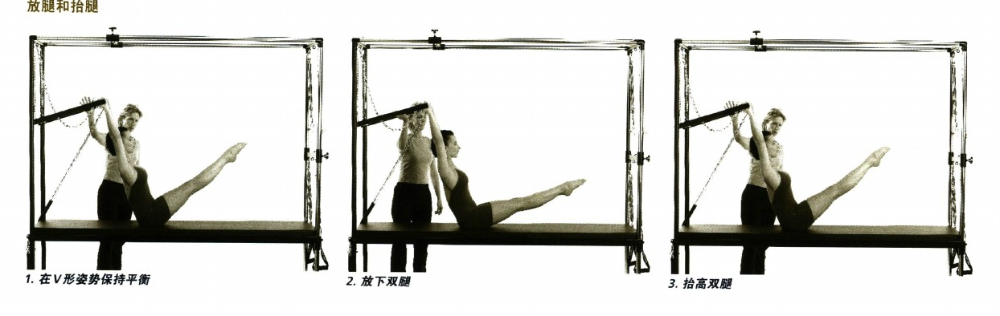
  - 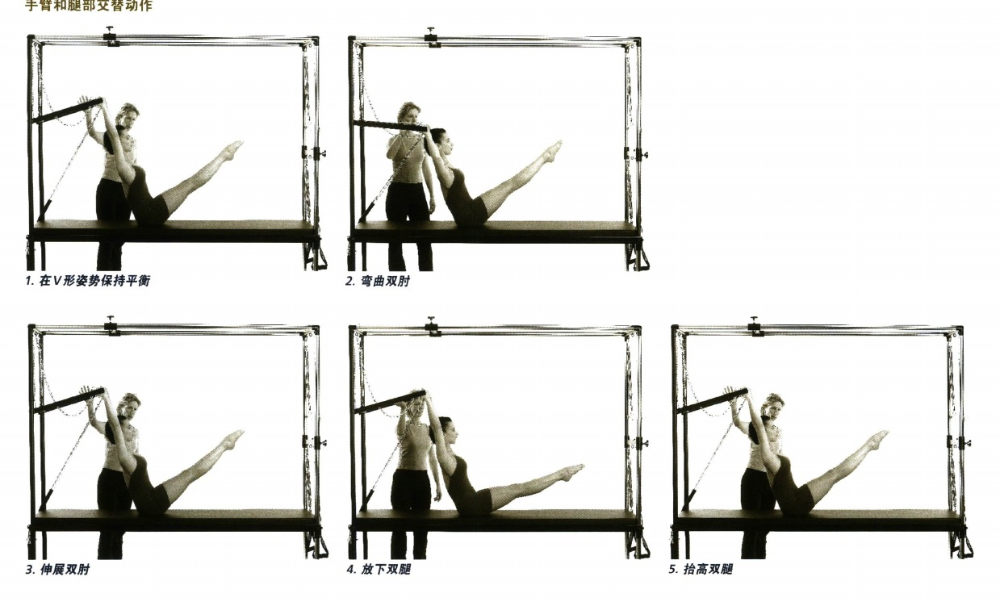
  - 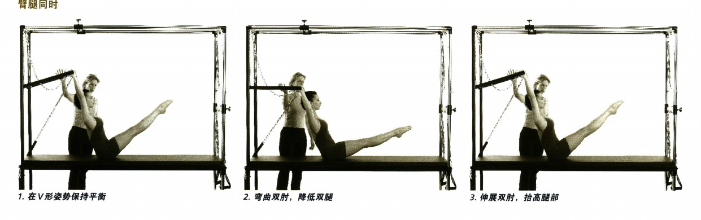
  - 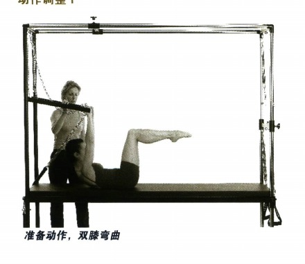

## 後劃 (BACK ROWING)

- 頁碼：p.114-117
- 難度：中級
- 器械/章節：臂用彈簧
- 肌群分類：[[../muscles/cadillac-intermediate-advanced-core-and-lumbopelvic-stability.md|中高階：核心與腰骨盆穩定]], [[../muscles/cadillac-intermediate-advanced-spinal-articulation.md|中高階：脊椎屈曲、伸展、旋轉與側屈]], [[../muscles/cadillac-intermediate-advanced-scapular-stabilizers.md|中高階：肩胛穩定與上背穩定肌]], [[../muscles/cadillac-intermediate-advanced-lat-teres-pulling-chain.md|中高階：背闊肌、大圓肌與拉力鏈]], [[../muscles/cadillac-intermediate-advanced-arms-delts-pecs.md|中高階：手臂、三角肌、胸大肌與前臂]], [[../muscles/cadillac-intermediate-advanced-hips-and-legs.md|中高階：髖與腿部控制]]
- 摘要：後劃：主要歸入核心與腰骨盆穩定、脊椎屈曲、伸展、旋轉與側屈、肩胛穩定與上背穩定肌、背闊肌、大圓肌與拉力鏈；OCR 目標肌肉段落見下方摘錄。
- OCR 原文摘錄：目標肌肉：以腹橫肌擠壓腹部，穩定腰骨盆部位；以深層骨盆底 ，每次運動手臂或軀幹時，肩胛骨應保持穩定 肌輔助腹橫肌運動；向心收縮腹直肌和腹斜肌使身體彎曲，並等 長收縮上述肌肉，以保持身體彎曲；向心收縮臀大肌和膕繩肌以 ，不要靠後仰，而要靠腹肌發力，使髂前上棘離開大腿骨前部， 並加大腰椎彎曲幅度 使骨盆後側靠向大腿骨後部；向後捲動時，離心收縮髖屈肌群， 前屈時，向心收縮髖屈肌群：向心收縮後三角肌以後壓雙臂；雙 ，避免過度彎曲頸椎使下頜抵胸 臂前伸畫弧時，離心收縮背闊肌和大圓肌；肩胛骨穩定肌群 •手腕始終保持伸展
- 動作圖：
  - 
  - 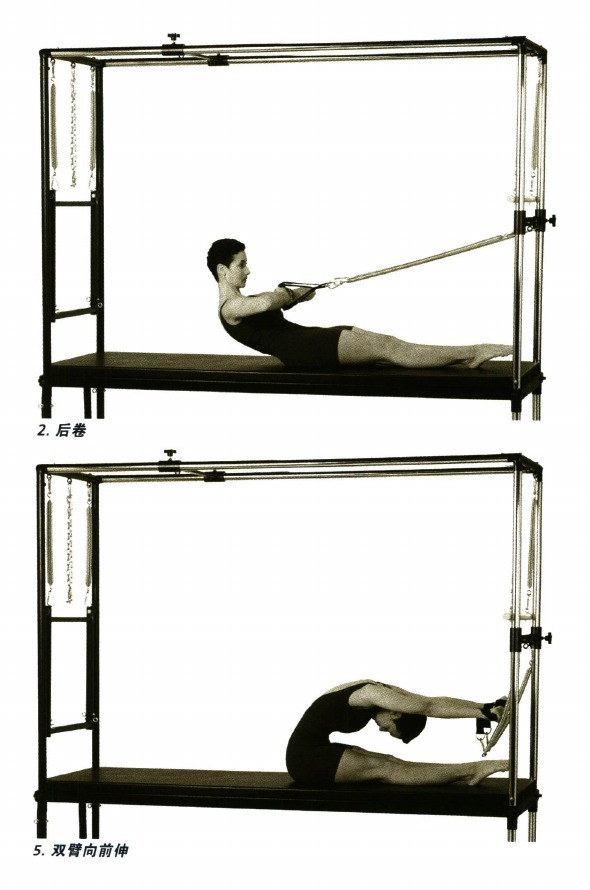
  - 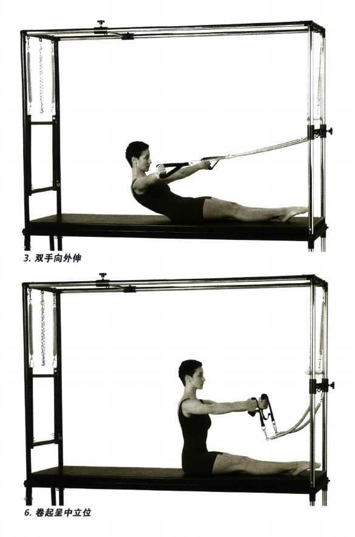
  - 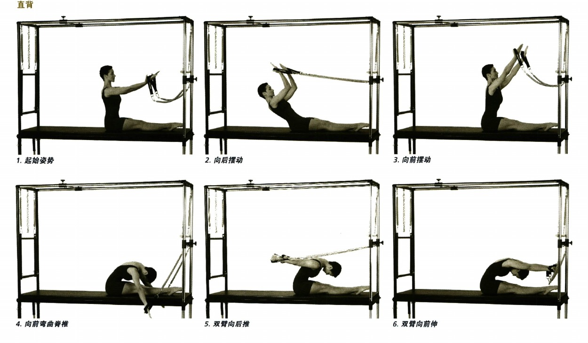
  - 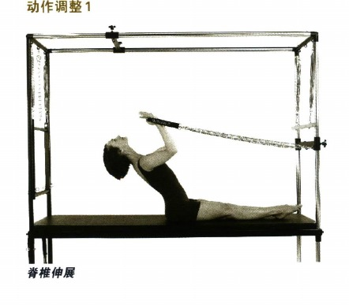
  - 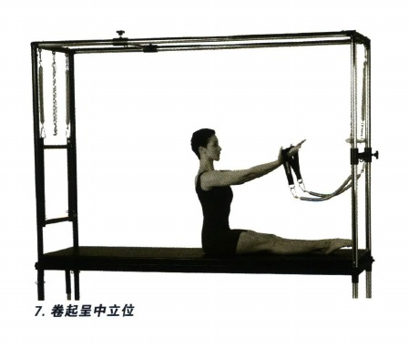

## 前劃 (FRONT ROWING)

- 頁碼：p.118-125
- 難度：中級
- 器械/章節：臂用彈簧
- 肌群分類：[[../muscles/cadillac-intermediate-advanced-core-and-lumbopelvic-stability.md|中高階：核心與腰骨盆穩定]], [[../muscles/cadillac-intermediate-advanced-spinal-articulation.md|中高階：脊椎屈曲、伸展、旋轉與側屈]], [[../muscles/cadillac-intermediate-advanced-scapular-stabilizers.md|中高階：肩胛穩定與上背穩定肌]], [[../muscles/cadillac-intermediate-advanced-arms-delts-pecs.md|中高階：手臂、三角肌、胸大肌與前臂]], [[../muscles/cadillac-intermediate-advanced-hips-and-legs.md|中高階：髖與腿部控制]]
- 摘要：前劃：主要歸入核心與腰骨盆穩定、脊椎屈曲、伸展、旋轉與側屈、肩胛穩定與上背穩定肌、手臂、三角肌、胸大肌與前臂；OCR 目標肌肉段落見下方摘錄。
- OCR 原文摘錄：目標肌肉：以腹橫肌擠壓腹部，穩定腰骨盆部位；以深層骨盆底 呈坐姿，背對垂直滑槓。骨盆和脊椎呈中立位。雙腿伸直併攏， 肌輔助腹橫肌運動；利用腹直肌、腹斜肌和豎脊肌穩定軀幹，後 雙踝蹠屈，腳趾輕輕繃直。雙肘彎曲，使其位置略比身體靠後（雙 方阻力使腹肌得到鍛鍊；向心收縮前三角肌和胸大肌以上抬雙臂， 肩不圓肩），前臂水平伸直，掌心向下。肩胛骨保持穩定。 並在雙臂下落時離心收縮上述肌肉；雙臂降低時利用胸大肌手臂 水平外展；肩胛骨穩定肌群
- 動作圖：
  - 
  - 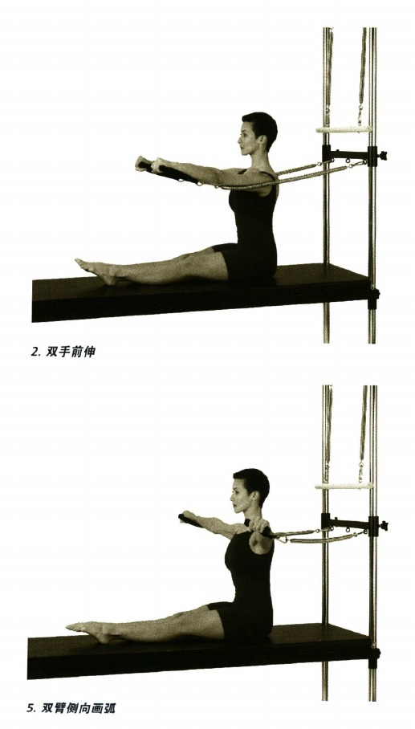
  - 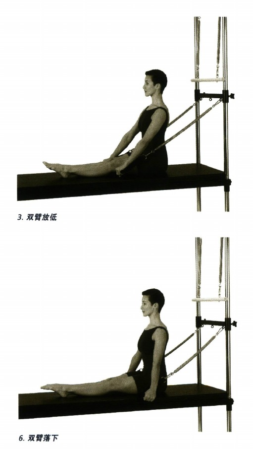
  - 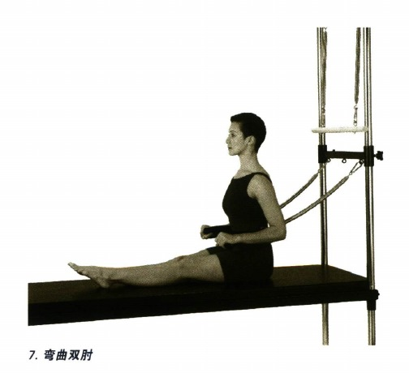
  - 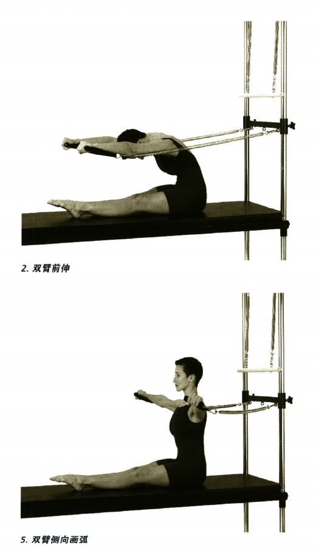
  - 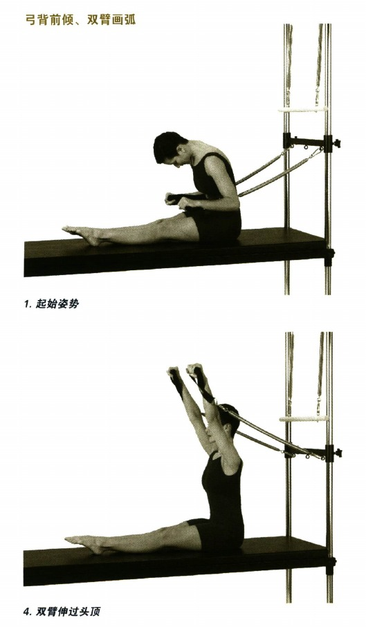
  - 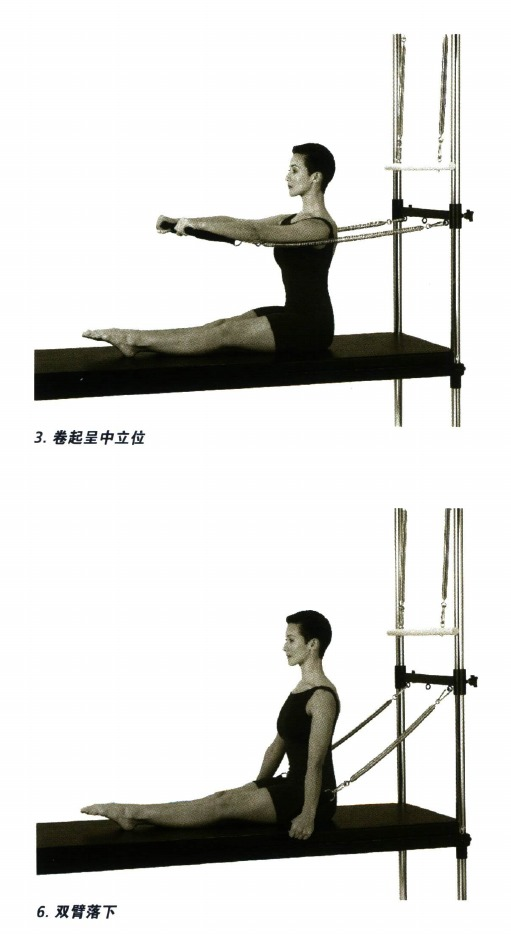
  - 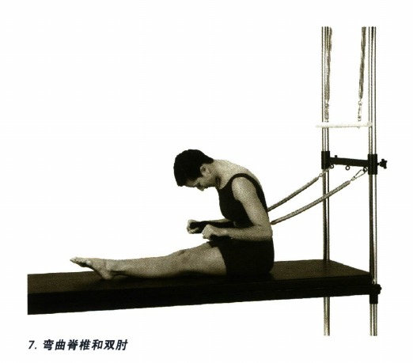
  - 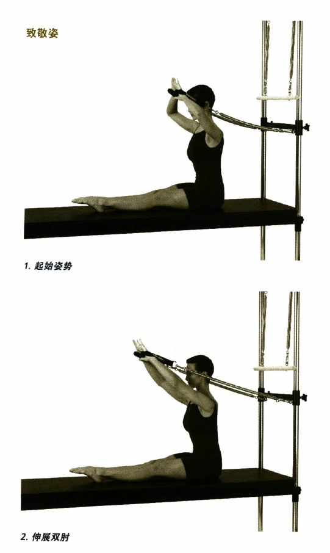
  - 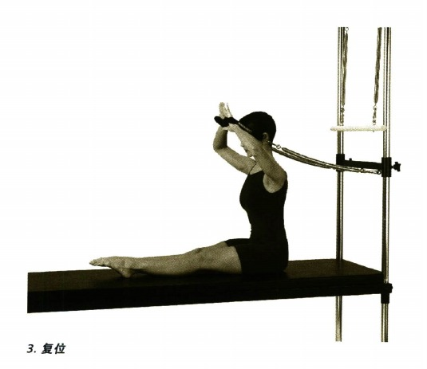
  - 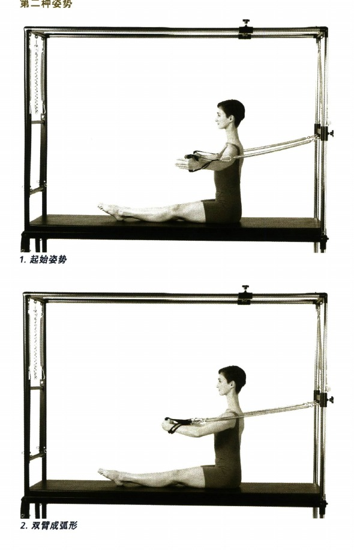
  - 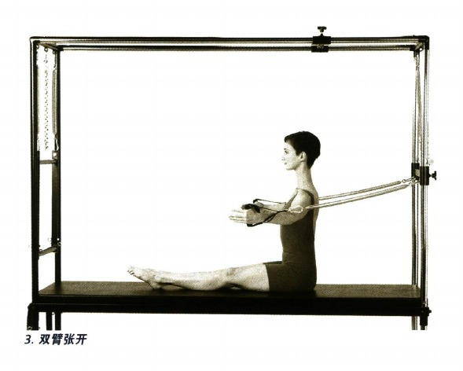
  - 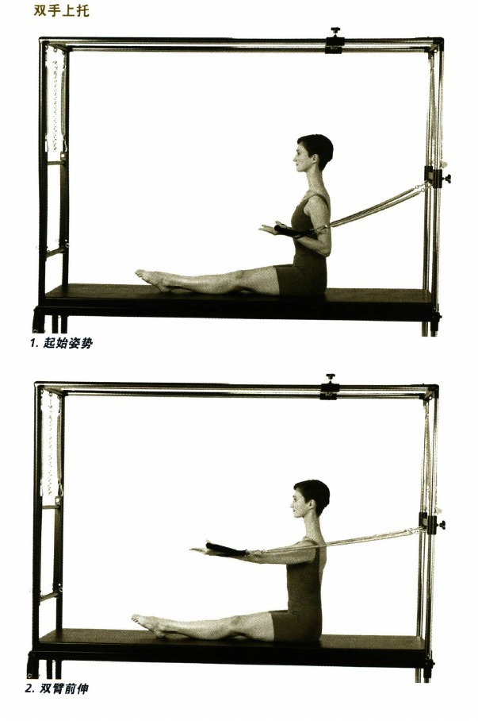
  - 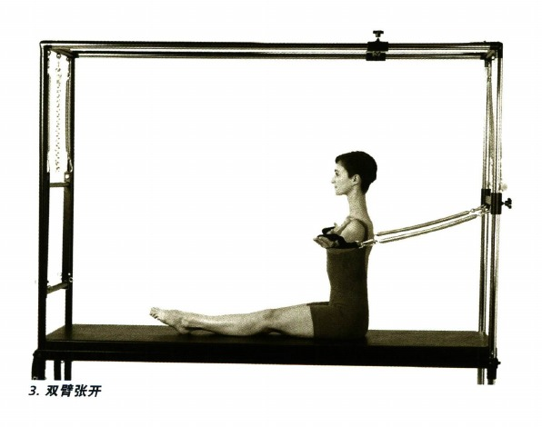
  - 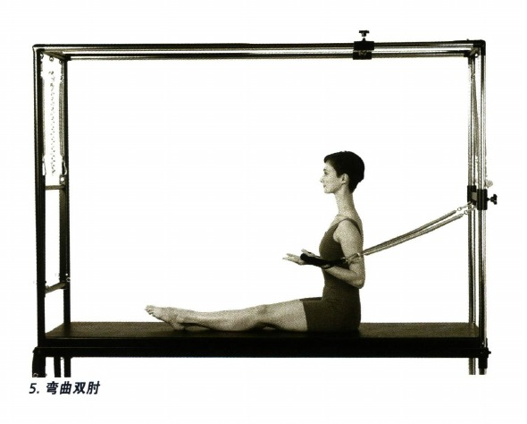
  - 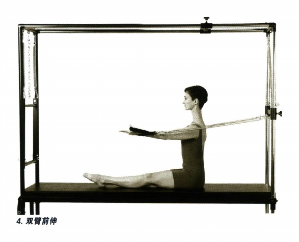

## 飛鷹姿（以腿用彈簧完成） (FLYING EAGLE WITH LEG SPRINGS)

- 頁碼：p.126-127
- 難度：高階
- 器械/章節：臂用彈簧
- 肌群分類：[[../muscles/cadillac-intermediate-advanced-core-and-lumbopelvic-stability.md|中高階：核心與腰骨盆穩定]], [[../muscles/cadillac-intermediate-advanced-spinal-articulation.md|中高階：脊椎屈曲、伸展、旋轉與側屈]], [[../muscles/cadillac-intermediate-advanced-scapular-stabilizers.md|中高階：肩胛穩定與上背穩定肌]], [[../muscles/cadillac-intermediate-advanced-lat-teres-pulling-chain.md|中高階：背闊肌、大圓肌與拉力鏈]], [[../muscles/cadillac-intermediate-advanced-arms-delts-pecs.md|中高階：手臂、三角肌、胸大肌與前臂]], [[../muscles/cadillac-intermediate-advanced-hips-and-legs.md|中高階：髖與腿部控制]], [[../muscles/cadillac-intermediate-advanced-mobility-and-stretching.md|中高階：柔韌、伸展與懸掛釋放]]
- 摘要：飛鷹姿（以腿用彈簧完成）：主要歸入核心與腰骨盆穩定、脊椎屈曲、伸展、旋轉與側屈、肩胛穩定與上背穩定肌、背闊肌、大圓肌與拉力鏈；OCR 目標肌肉段落見下方摘錄。
- OCR 原文摘錄：目標肌肉：以腹橫肌擠壓腹部，穩定腰骨盆部位；以深層骨盆底 肌輔助腹橫肌運動；背闊肌和大圓肌向心收縮，以將雙臂收回， 吸氣 保持肩胛骨穩定，雙臂向下和向後拉伸，雙手拉向髖部； 復位時離心收縮上述肌肉；抬臂以回拉或前拉時三角肌向心收縮； 同時伸展脊椎。伸展軀幹至腹肌能夠支撐的高度，保持恥 豎脊肌向心收縮以伸展脊椎；利用腹斜肌，防止腰椎過度伸展； 骨貼墊。 向心收縮臀大肌和膕繩肌，以使骨盆後部向大腿骨後部靠攏：肩 呼氣 拉伸軀於朝向墊上，雙臂向外朝兩側和朝前畫弧，不要失 胛骨穩定肌群 去肩胛骨的穩定。
- 動作圖：
  - 
  - 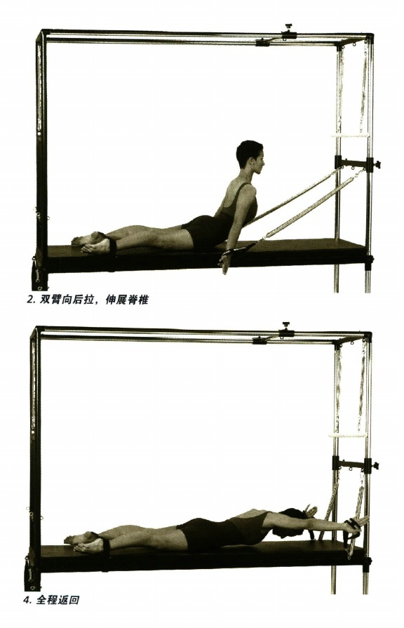
  - 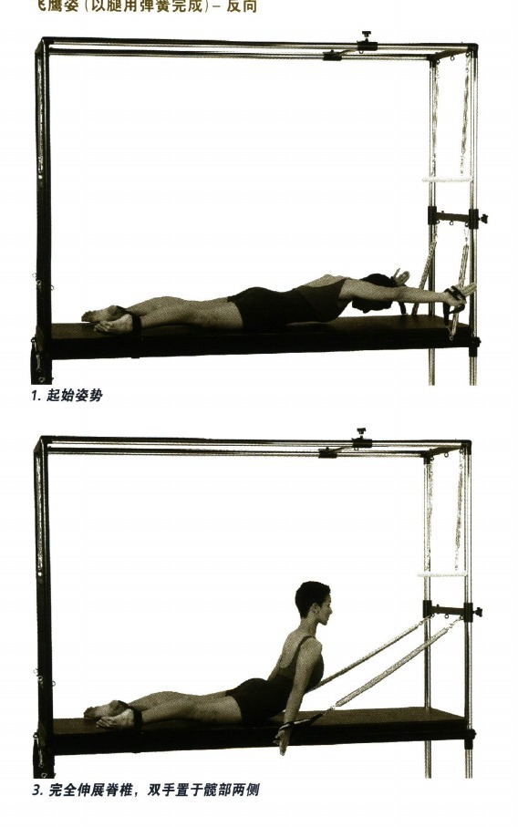
  - 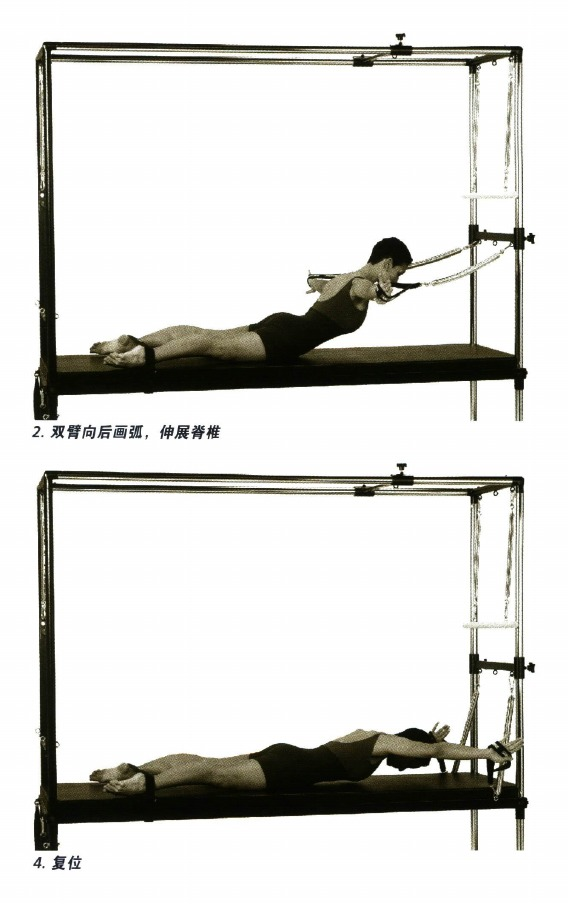

## 側轉站姿 (SIDE TWIST STANDING)

- 頁碼：p.128-129
- 難度：中級
- 器械/章節：臂用彈簧站姿動作
- 肌群分類：[[../muscles/cadillac-intermediate-advanced-core-and-lumbopelvic-stability.md|中高階：核心與腰骨盆穩定]], [[../muscles/cadillac-intermediate-advanced-spinal-articulation.md|中高階：脊椎屈曲、伸展、旋轉與側屈]]
- 摘要：側轉站姿：主要歸入核心與腰骨盆穩定、脊椎屈曲、伸展、旋轉與側屈；OCR 目標肌肉段落見下方摘錄。
- OCR 原文摘錄：目標肌肉：以腹橫肌擠壓腹部，穩定腰骨盆部位；以深層骨盆底 肌輔助腹橫肌運動；利用豎脊肌和腹斜肌保持軀幹豎直；向心收
- 動作圖：
  - 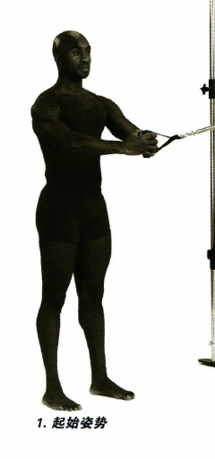
  - 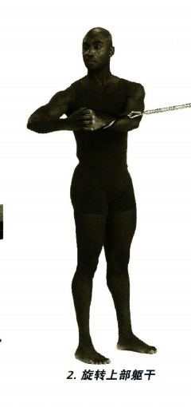
  - 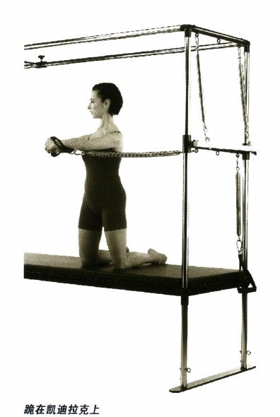
  - 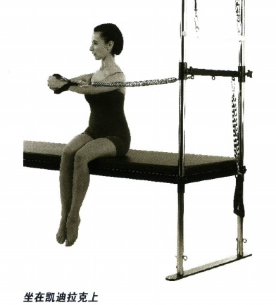

## 反向擴張 (REVERSE EXPANSION)

- 頁碼：p.130-135
- 難度：中級
- 器械/章節：臂用彈簧站姿動作
- 肌群分類：[[../muscles/cadillac-intermediate-advanced-core-and-lumbopelvic-stability.md|中高階：核心與腰骨盆穩定]], [[../muscles/cadillac-intermediate-advanced-spinal-articulation.md|中高階：脊椎屈曲、伸展、旋轉與側屈]], [[../muscles/cadillac-intermediate-advanced-scapular-stabilizers.md|中高階：肩胛穩定與上背穩定肌]], [[../muscles/cadillac-intermediate-advanced-lat-teres-pulling-chain.md|中高階：背闊肌、大圓肌與拉力鏈]], [[../muscles/cadillac-intermediate-advanced-arms-delts-pecs.md|中高階：手臂、三角肌、胸大肌與前臂]], [[../muscles/cadillac-intermediate-advanced-hips-and-legs.md|中高階：髖與腿部控制]]
- 摘要：反向擴張：主要歸入核心與腰骨盆穩定、脊椎屈曲、伸展、旋轉與側屈、肩胛穩定與上背穩定肌、背闊肌、大圓肌與拉力鏈；OCR 目標肌肉段落見下方摘錄。
- OCR 原文摘錄：目標肌肉：以腹橫肌擠壓腹部，穩定腰骨盆部位；以深層骨盆底 ，在傾斜中，軀幹和髖部保持正中 肌輔助腹橫肌運動；利用豎脊肌群、腹直肌和腹斜肌在傾斜時穩 定軀幹，後方阻力使腹肌得到鍛鍊；臀大肌、膕繩肌和腹肌用以 •踝背屈，軀幹前傾；避免彎曲髖部 穩定骨盆；後方阻力也使肩胛骨穩定肌群（尤其是前鋸肌）得到 • 肩胛骨保持穩定 鍛鍊 •避免肩胛骨過度內收和外翻 ［1. 2.3］向心收縮前三角肌和胸大肌，使雙肩屈曲，雙肩復位時， •用臀大肌、膕繩肌和腹肌將骨盆穩定在中立位 離心收縮上述肌肉 •手腕始終保持伸展 ［4］雙肘伸展時，向心收縮肱三頭肌，雙肘復位時，離心收縮肱三 頭肌；等長收縮三角肌以保持雙臂高度 ，通過雙臂的活動範圍應調整保持肩胛骨和肩關節穩定的能 力水平 ［5］雙肘彎曲時，向心收縮二頭肌，雙肘復位時，離心收縮二頭肌： 利用大圓肌和背闊肌保持肩部伸展
- 動作圖：
  - 
  - 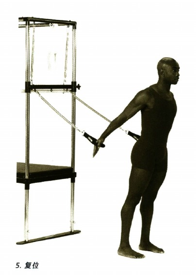
  - 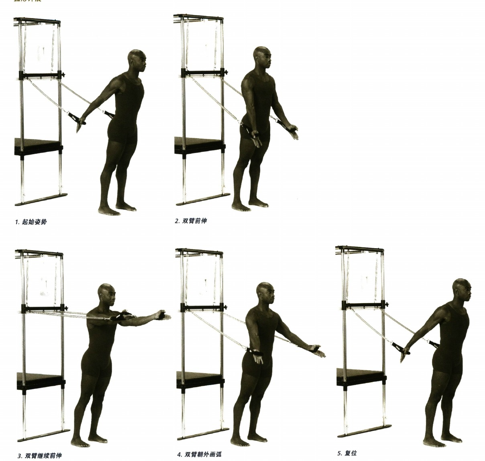
  - 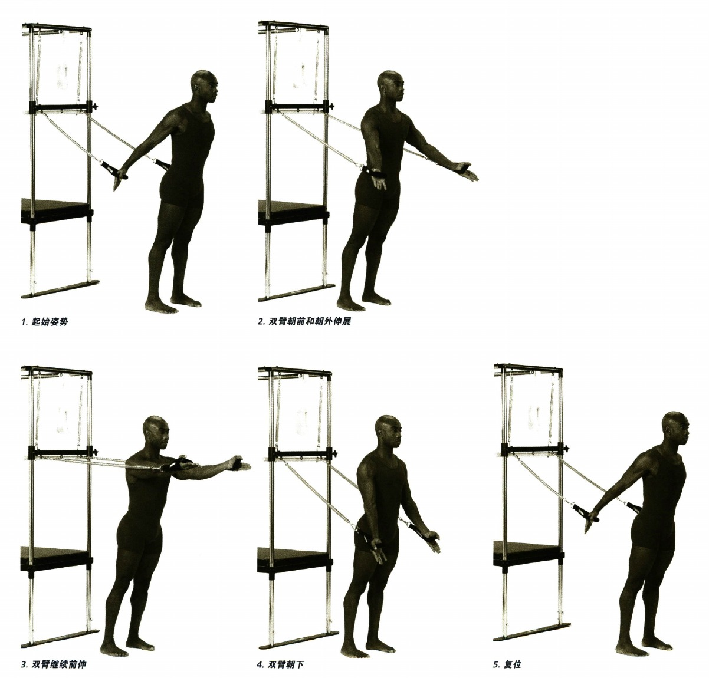
  - 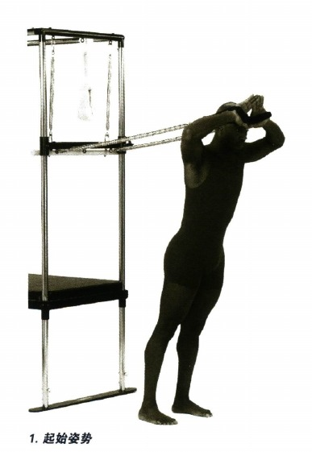
  - 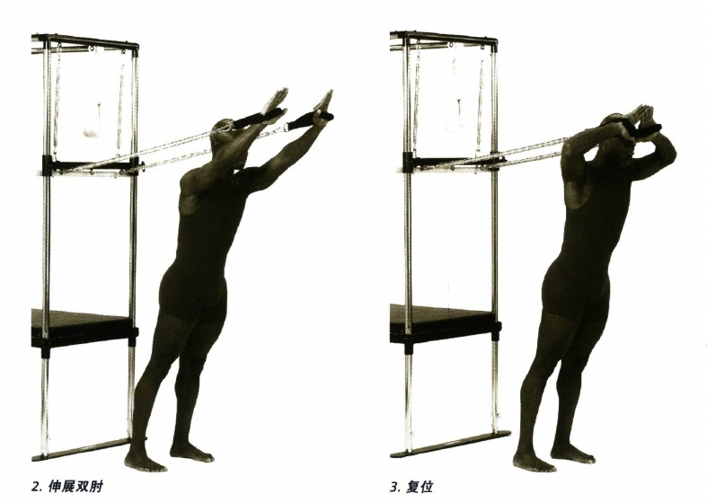
  - 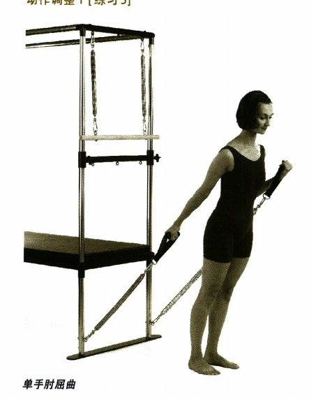
  - 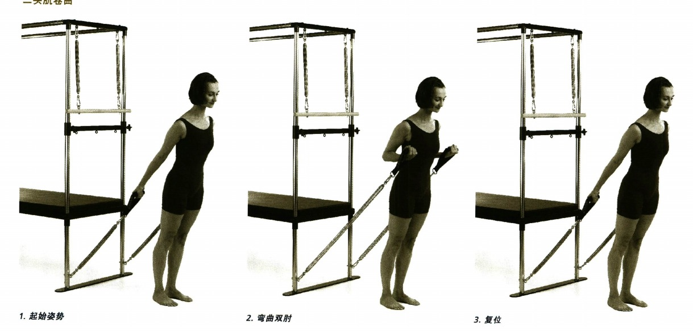
  - 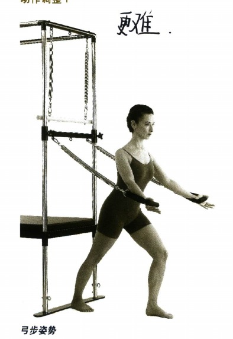
  - 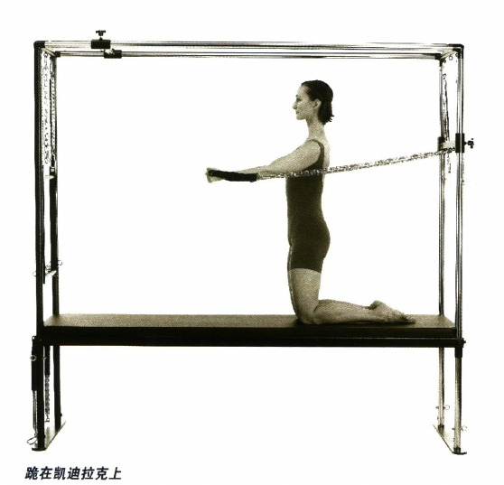

## 雙手上託 (OFFERING)

- 頁碼：p.136-137
- 難度：中級
- 器械/章節：臂用彈簧站姿動作
- 肌群分類：[[../muscles/cadillac-intermediate-advanced-core-and-lumbopelvic-stability.md|中高階：核心與腰骨盆穩定]], [[../muscles/cadillac-intermediate-advanced-spinal-articulation.md|中高階：脊椎屈曲、伸展、旋轉與側屈]], [[../muscles/cadillac-intermediate-advanced-scapular-stabilizers.md|中高階：肩胛穩定與上背穩定肌]], [[../muscles/cadillac-intermediate-advanced-arms-delts-pecs.md|中高階：手臂、三角肌、胸大肌與前臂]], [[../muscles/cadillac-intermediate-advanced-hips-and-legs.md|中高階：髖與腿部控制]]
- 摘要：雙手上託：主要歸入核心與腰骨盆穩定、脊椎屈曲、伸展、旋轉與側屈、肩胛穩定與上背穩定肌、手臂、三角肌、胸大肌與前臂；OCR 目標肌肉段落見下方摘錄。
- OCR 原文摘錄：目標肌肉：以腹橫肌擠壓腹部，穩定腰骨盆部位；以深層骨盆底 凱迪拉克的方向傾斜。雙腳與髖同寬，雙腿伸直。雙肘彎曲，位 肌輔助腹橫肌運動；利用豎脊肌群、腹直肌和腹斜肌在傾斜時穩 置比身體略靠後。雙手握住拉環，掌心向上，手腕和手指伸展。 定軀幹，後方阻力使腹肌得到鍛鍊：臀大肌、膕繩肌和腹肌用以 肩胛骨保持穩定。 穩定骨盆；肱三頭肌向心收縮，以伸展雙肘，復位時離心收縮上 述肌肉；水平外展時，離心收縮前三角肌和胸大肌，水平內收時
- 動作圖：
  - 
  - 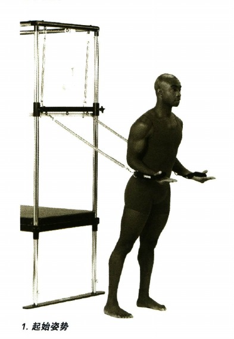
  - 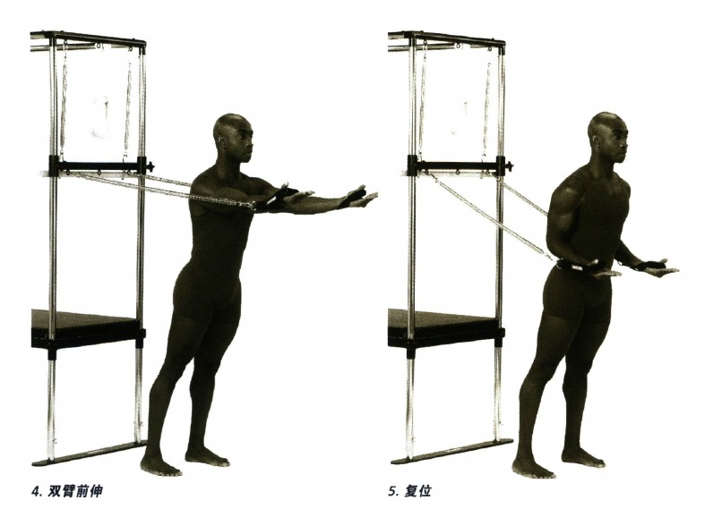

## 抱大樹 (HUG A TREE)

- 頁碼：p.138
- 難度：中級
- 器械/章節：臂用彈簧站姿動作
- 肌群分類：[[../muscles/cadillac-intermediate-advanced-core-and-lumbopelvic-stability.md|中高階：核心與腰骨盆穩定]], [[../muscles/cadillac-intermediate-advanced-spinal-articulation.md|中高階：脊椎屈曲、伸展、旋轉與側屈]], [[../muscles/cadillac-intermediate-advanced-arms-delts-pecs.md|中高階：手臂、三角肌、胸大肌與前臂]], [[../muscles/cadillac-intermediate-advanced-hips-and-legs.md|中高階：髖與腿部控制]]
- 摘要：抱大樹：主要歸入核心與腰骨盆穩定、脊椎屈曲、伸展、旋轉與側屈、手臂、三角肌、胸大肌與前臂、髖與腿部控制；OCR 目標肌肉段落見下方摘錄。
- OCR 原文摘錄：目標肌肉：以腹橫肌擠壓腹部，穩定腰骨盆部位；以深層骨盆底 2.跪在凱迪拉克床上。保持中立位和豎直位。著重以髖關節保持 肌輔助腹橫肌運動；利用腹直肌、腹斜肌和豎脊肌在傾斜時使脊 穩定而非站立時整個腿部的穩定為重點。 椎穩定在中立位；後方阻力使腹肌得到鍛鍊；臀大肌、膕繩肌和 腹肌用以穩定骨盆；水平內收時，向心收縮前三角肌和胸大肌， 復位時離心收縮上述肌肉；三角肌用於將雙臂保持在固定高度
- 動作圖：
  - 
  - 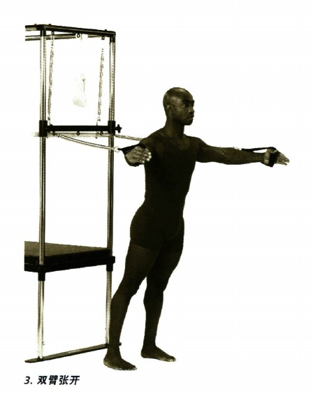

## 蝴蝶姿 (BUTTERFLY)

- 頁碼：p.139
- 難度：中級
- 器械/章節：臂用彈簧站姿動作
- 肌群分類：[[../muscles/cadillac-intermediate-advanced-core-and-lumbopelvic-stability.md|中高階：核心與腰骨盆穩定]], [[../muscles/cadillac-intermediate-advanced-spinal-articulation.md|中高階：脊椎屈曲、伸展、旋轉與側屈]]
- 摘要：蝴蝶姿：主要歸入核心與腰骨盆穩定、脊椎屈曲、伸展、旋轉與側屈；OCR 目標肌肉段落見下方摘錄。
- OCR 原文摘錄：目標肌肉：以腹橫肌擠壓腹部，穩定腰骨盆部位；以深層骨盆底 • 肌輔助腹橫肌運動；利用豎脊肌群、腹直肌和腹斜肌穩定軀幹
- 動作圖：
  - 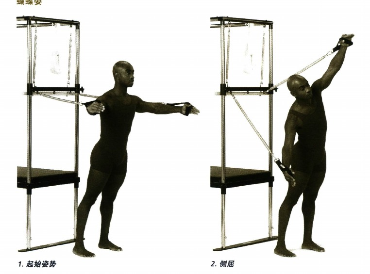
  - 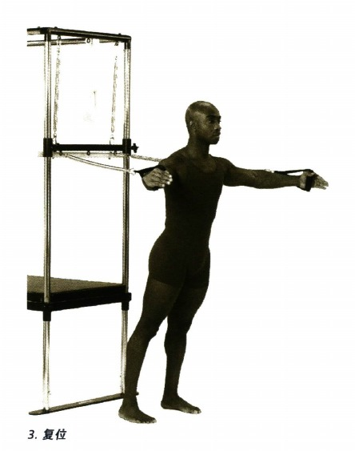

## 擊拳動作 (PUNCHES)

- 頁碼：p.140-141
- 難度：中級
- 器械/章節：臂用彈簧站姿動作
- 肌群分類：[[../muscles/cadillac-intermediate-advanced-core-and-lumbopelvic-stability.md|中高階：核心與腰骨盆穩定]], [[../muscles/cadillac-intermediate-advanced-spinal-articulation.md|中高階：脊椎屈曲、伸展、旋轉與側屈]], [[../muscles/cadillac-intermediate-advanced-scapular-stabilizers.md|中高階：肩胛穩定與上背穩定肌]], [[../muscles/cadillac-intermediate-advanced-arms-delts-pecs.md|中高階：手臂、三角肌、胸大肌與前臂]], [[../muscles/cadillac-intermediate-advanced-hips-and-legs.md|中高階：髖與腿部控制]]
- 摘要：擊拳動作：主要歸入核心與腰骨盆穩定、脊椎屈曲、伸展、旋轉與側屈、肩胛穩定與上背穩定肌、手臂、三角肌、胸大肌與前臂；OCR 目標肌肉段落見下方摘錄。
- OCR 原文摘錄：目標肌肉：以腹橫肌擠壓腹部，穩定腰骨盆部位；以深層骨盆底 拉克的方向傾斜。雙腳與髖同寬，雙腿伸直。雙手握緊拉環，掌 肌輔助腹橫肌運動；利用豎脊肌群、腹直肌和腹斜肌在傾斜時穩 心向下。雙手靠近肩部，位於肩部正前方，肘關節彎曲，抬高至 定軀幹，後方阻力使腹肌得到鍛鍊；臀大肌、膕繩肌和腹肌用以 兩側，略低於肩。肩胛骨保持穩定。 穩定骨盆；肱三頭肌向心收縮，以伸展肘部，復位時離心收縮上
- 動作圖：
  - 
  - 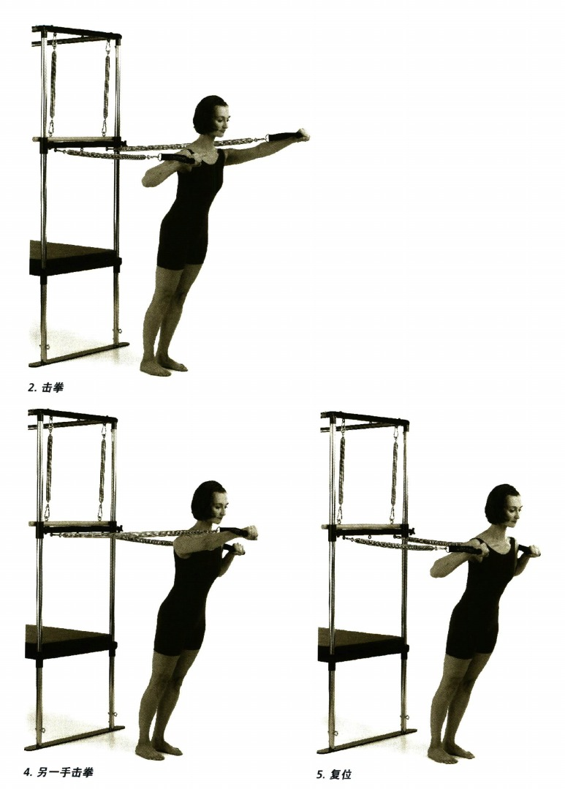
  - 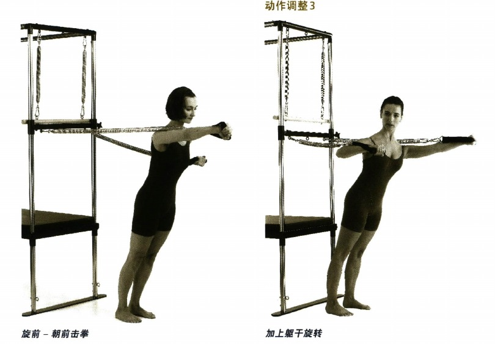
  - 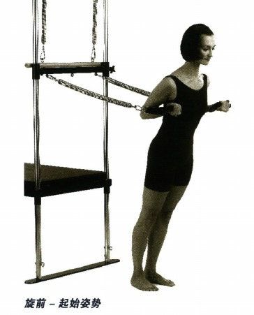

## 擊劍者弓步 (FENCER LUNGES)

- 頁碼：p.142-143
- 難度：中級
- 器械/章節：臂用彈簧站姿動作
- 肌群分類：[[../muscles/cadillac-intermediate-advanced-core-and-lumbopelvic-stability.md|中高階：核心與腰骨盆穩定]], [[../muscles/cadillac-intermediate-advanced-spinal-articulation.md|中高階：脊椎屈曲、伸展、旋轉與側屈]], [[../muscles/cadillac-intermediate-advanced-scapular-stabilizers.md|中高階：肩胛穩定與上背穩定肌]], [[../muscles/cadillac-intermediate-advanced-arms-delts-pecs.md|中高階：手臂、三角肌、胸大肌與前臂]], [[../muscles/cadillac-intermediate-advanced-hips-and-legs.md|中高階：髖與腿部控制]]
- 摘要：擊劍者弓步：主要歸入核心與腰骨盆穩定、脊椎屈曲、伸展、旋轉與側屈、肩胛穩定與上背穩定肌、手臂、三角肌、胸大肌與前臂；OCR 目標肌肉段落見下方摘錄。
- OCR 原文摘錄：目標肌肉：以腹橫肌擠壓腹部，穩定腰骨盆部位；以深層骨盆底 ，全程保持肩胛骨穩定 肌輔助腹橫肌運動；以腹直肌、腹斜肌和豎脊肌穩定軀幹；前腿 ，雙腳上的膝關節保持穩定，避免踝關節內翻或外翻 弓步時，股四頭肌離心收縮，膝關節伸展時，股四頭肌向心收縮； 保持弓步時，位置靠前的腿的髖內收肌和外展肌等長收縮，以穩 •手腕始終保持伸展 定腿部的正位；位置靠後的腿的髖外展肌向心收縮，協同開始跨
- 動作圖：
  - 
  - 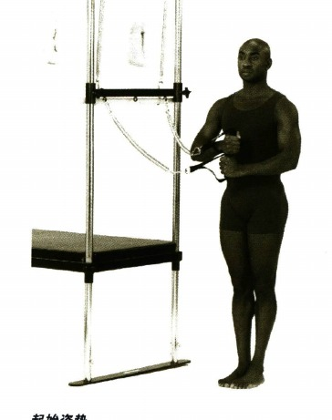
  - 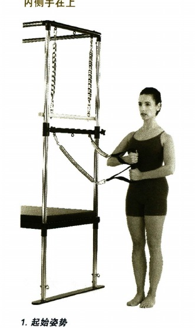
  - 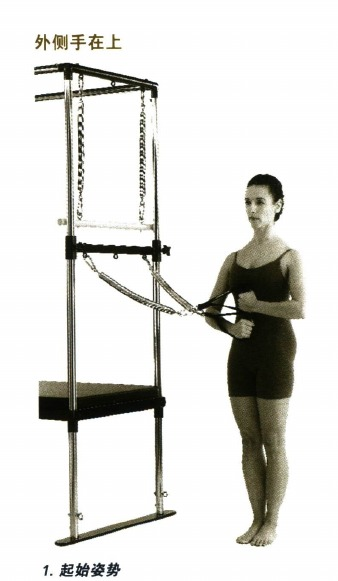
  - 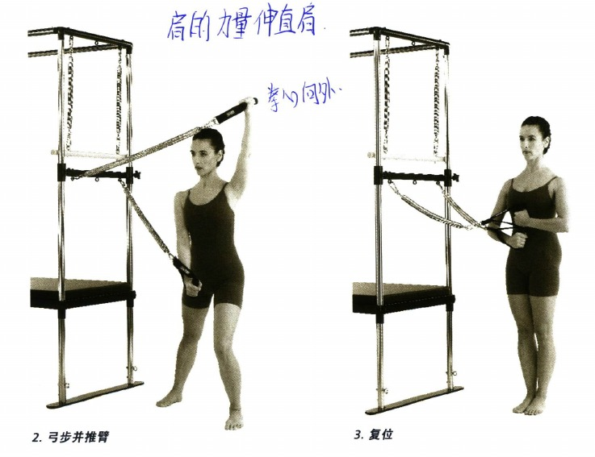

## 下蹲練習 (SQUATS)

- 頁碼：p.144-145
- 難度：中級
- 器械/章節：臂用彈簧站姿動作
- 肌群分類：[[../muscles/cadillac-intermediate-advanced-core-and-lumbopelvic-stability.md|中高階：核心與腰骨盆穩定]], [[../muscles/cadillac-intermediate-advanced-spinal-articulation.md|中高階：脊椎屈曲、伸展、旋轉與側屈]], [[../muscles/cadillac-intermediate-advanced-scapular-stabilizers.md|中高階：肩胛穩定與上背穩定肌]], [[../muscles/cadillac-intermediate-advanced-hips-and-legs.md|中高階：髖與腿部控制]]
- 摘要：下蹲練習：主要歸入核心與腰骨盆穩定、脊椎屈曲、伸展、旋轉與側屈、肩胛穩定與上背穩定肌、髖與腿部控制；OCR 目標肌肉段落見下方摘錄。
- OCR 原文摘錄：目標肌肉：以腹橫肌擠壓腹部，穩定腰骨盆部位；以深層骨盆底 雙腿伸直。雙臂朝前伸直，伸向肩部正前方略微靠下的位置， 肌輔助腹橫肌運動；脊椎彎曲時，腹直肌和腹斜肌向心收縮：膝 因此開始時無彈簧張力。雙手握緊拉環，掌心向上。肩胛骨保持 關節彎曲時，股四頭肌離心收縮，膝關節伸展時，股四頭肌向心 穩定。 收縮；下蹲時，臀大肌離心收縮，回到豎直位時，臀大肌向心收縮
- 動作圖：
  - 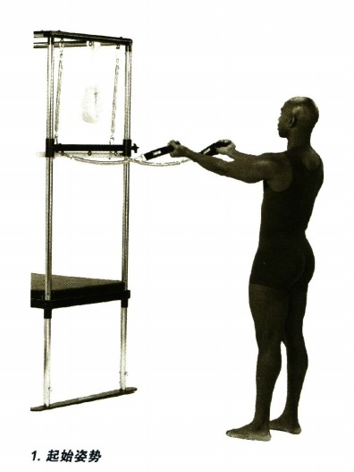
  - 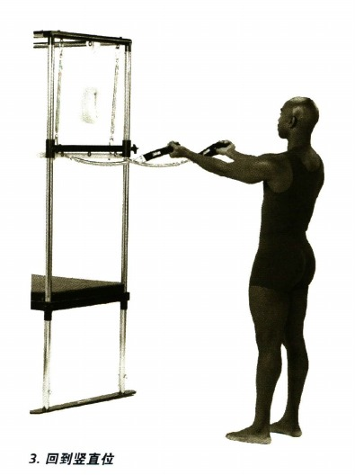
  - 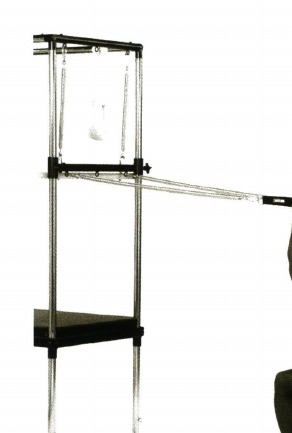
  - 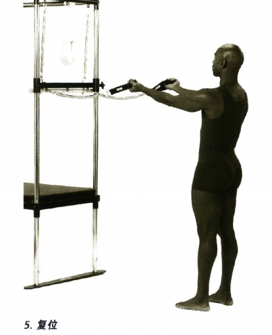

## 拍擊 (BEATS)

- 頁碼：p.146-147
- 難度：中級
- 器械/章節：腿用彈簧
- 肌群分類：[[../muscles/cadillac-intermediate-advanced-core-and-lumbopelvic-stability.md|中高階：核心與腰骨盆穩定]], [[../muscles/cadillac-intermediate-advanced-spinal-articulation.md|中高階：脊椎屈曲、伸展、旋轉與側屈]], [[../muscles/cadillac-intermediate-advanced-scapular-stabilizers.md|中高階：肩胛穩定與上背穩定肌]], [[../muscles/cadillac-intermediate-advanced-hips-and-legs.md|中高階：髖與腿部控制]]
- 摘要：拍擊：主要歸入核心與腰骨盆穩定、脊椎屈曲、伸展、旋轉與側屈、肩胛穩定與上背穩定肌、髖與腿部控制；OCR 目標肌肉段落見下方摘錄。
- OCR 原文摘錄：目標肌肉：以腹橫肌擠壓腹部，穩定腰骨盆部位；以深層骨盆底 仰臥，頭部朝向滑槓。雙臂伸直，越過頭頂，雙手頂住立柱，位 肌輔助腹橫肌運動；等長收縮豎脊肌，以使脊椎保持伸展；腹斜 置略高於肩部，肩胛骨保持穩定。骨盆和脊椎呈中立位。雙腳套 肌用以穩定骨盆和防止脊柱伸展；等長收縮臀大肌和膕繩肌，以 入腳帶內，雙腿內收並外旋，沿對角線伸展，儘可能向下，動作 使髖部保持伸展；髖外展肌向心收縮，以分開雙腿；髖內收肌向 幅度以骨盆能保持穩定為限。雙踝蹠屈，腳尖輕輕繃直。 心收縮，以對抗彈簧阻力，併攏雙腿；肩胛骨穩定肌群
- 動作圖：
  - 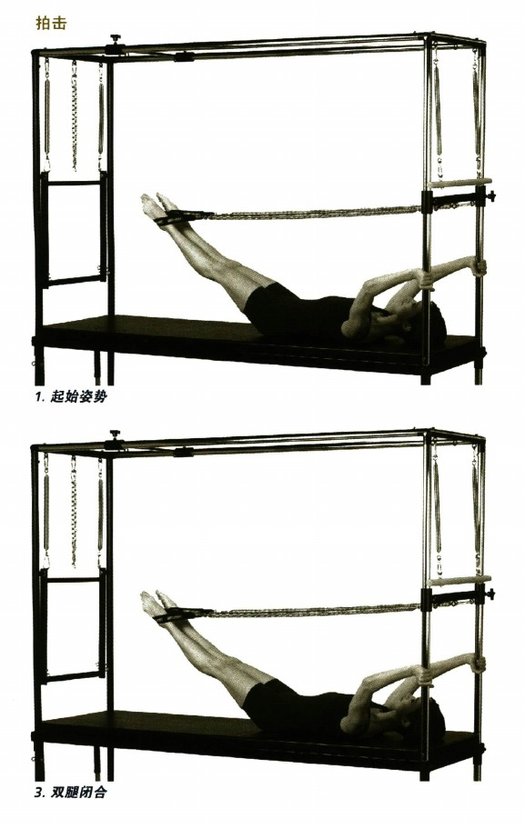
  - 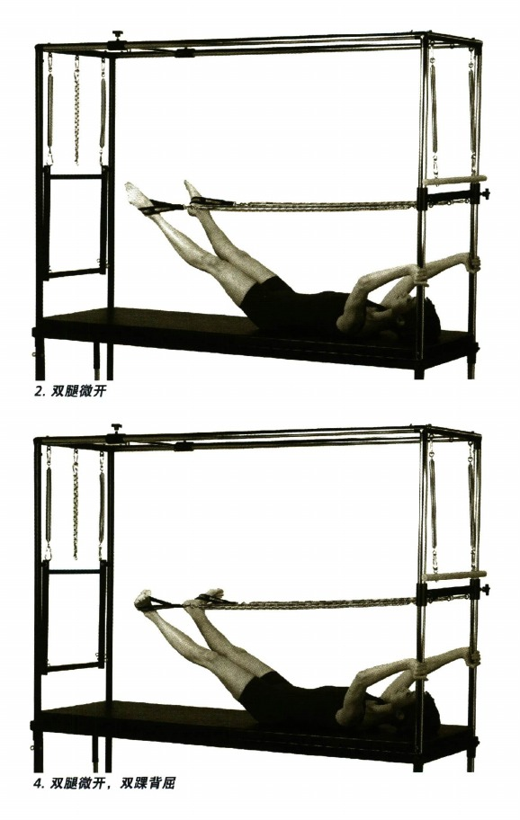
  - 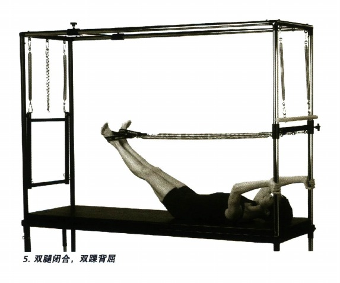

## 脊椎捲曲 (SHORT SPINE)

- 頁碼：p.148-149
- 難度：高階
- 器械/章節：腿用彈簧
- 肌群分類：[[../muscles/cadillac-intermediate-advanced-core-and-lumbopelvic-stability.md|中高階：核心與腰骨盆穩定]], [[../muscles/cadillac-intermediate-advanced-spinal-articulation.md|中高階：脊椎屈曲、伸展、旋轉與側屈]], [[../muscles/cadillac-intermediate-advanced-scapular-stabilizers.md|中高階：肩胛穩定與上背穩定肌]], [[../muscles/cadillac-intermediate-advanced-hips-and-legs.md|中高階：髖與腿部控制]]
- 摘要：脊椎捲曲：主要歸入核心與腰骨盆穩定、脊椎屈曲、伸展、旋轉與側屈、肩胛穩定與上背穩定肌、髖與腿部控制；OCR 目標肌肉段落見下方摘錄。
- OCR 原文摘錄：目標肌肉：以腹橫肌擠壓腹部，穩定腰骨盆部位；以深層骨盆底 肌輔助腹橫肌運動；以腹直肌和腹斜肌向心收縮，將脊椎卷離墊， 呼氣 保持雙踵與骨盆的相對位置，使脊椎逐節捲回墊上，直至 向下捲動時離心收縮；在上卷和下捲過程中，臀大肌、膕繩肌和 骶骨部位觸墊。然後將骨盆捲回至中立位，雙腳抵住腳帶 內收肌等長收縮，以保持髖部開啟，雙腿併攏伸直；肩胛骨穩 推出，伸展雙腿呈對角線。 定肌群 脊椎捲曲-正向
- 動作圖：
  - 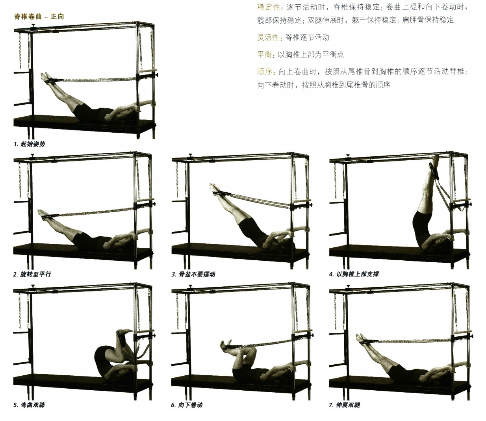
  - 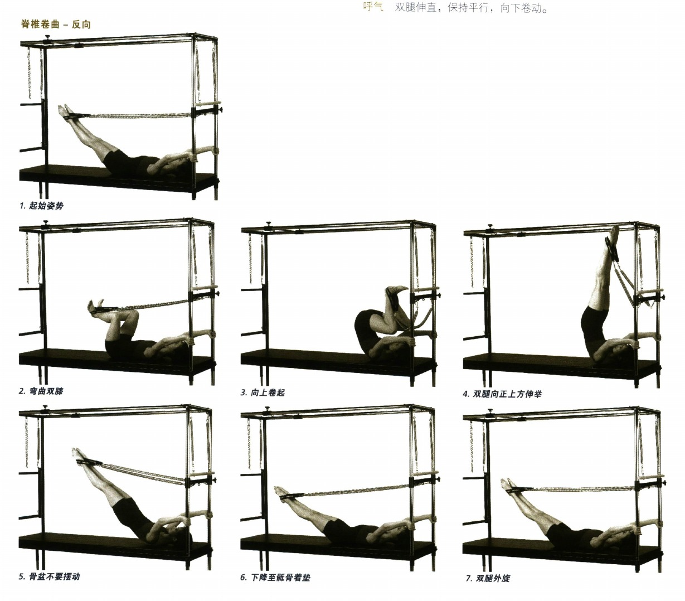

## 脊椎伸展 (LONG SPINE)

- 頁碼：p.150-151
- 難度：高階
- 器械/章節：腿用彈簧
- 肌群分類：[[../muscles/cadillac-intermediate-advanced-core-and-lumbopelvic-stability.md|中高階：核心與腰骨盆穩定]], [[../muscles/cadillac-intermediate-advanced-spinal-articulation.md|中高階：脊椎屈曲、伸展、旋轉與側屈]], [[../muscles/cadillac-intermediate-advanced-hips-and-legs.md|中高階：髖與腿部控制]]
- 摘要：脊椎伸展：主要歸入核心與腰骨盆穩定、脊椎屈曲、伸展、旋轉與側屈、髖與腿部控制；OCR 目標肌肉段落見下方摘錄。
- OCR 原文摘錄：目標肌肉：以腹橫肌擠壓腹部，穩定腰骨盆部位；以深層骨盆底 呼氣 肌輔助腹橫肌運動；以腹直肌和腹斜肌向心收縮，將脊椎卷離墊， 保持雙腿外旋外展，腰椎略微下沉，保持雙腳抵在吊帶上， 向下捲動時離心收縮；臀大肌和膕繩肌等長收縮，以保持髖部打 以保持髖部前方開啟，逐節活動脊椎至墊，直到骶骨部位 開；髖內收肌等長收縮，以保持雙腿併攏：髖外展肌和內收肌等 觸墊。一旦骶骨觸墊，雙腿伸直及內收。 長收縮，以穩定雙腿外展；外旋肌群向心收縮，以增加外旋；肩 胛骨穩定肌群 脊椎伸展 -正向
- 動作圖：
  - 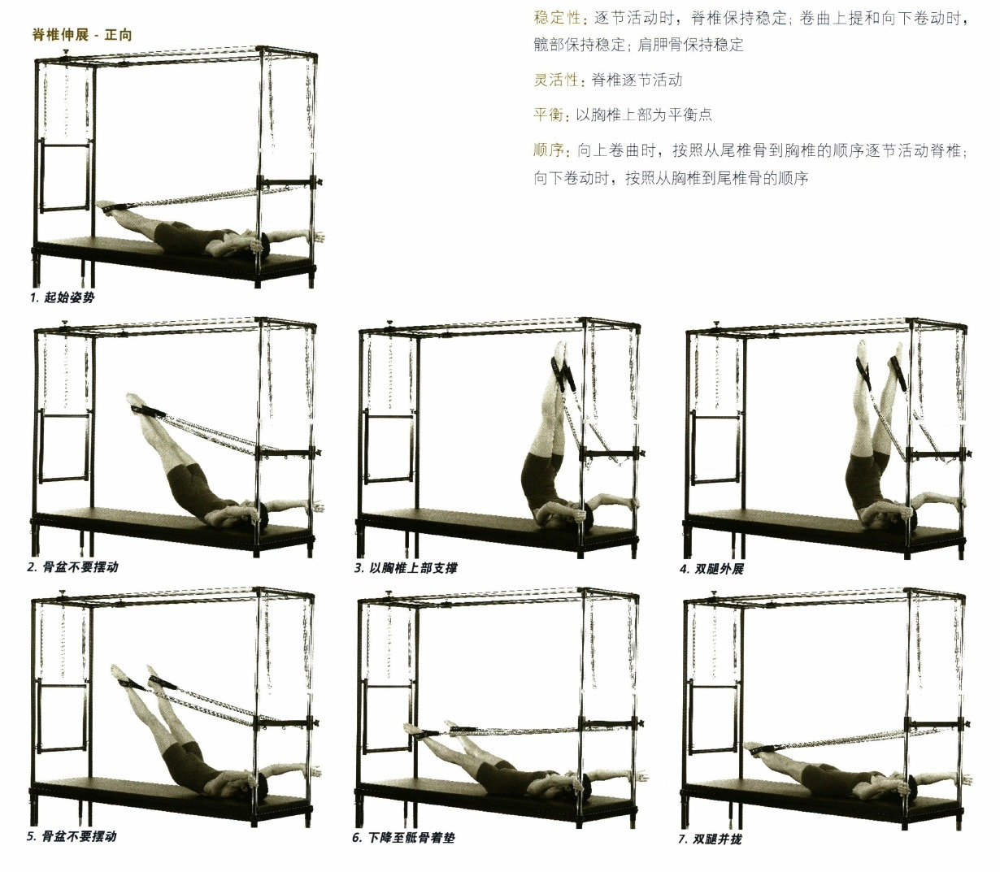
  - 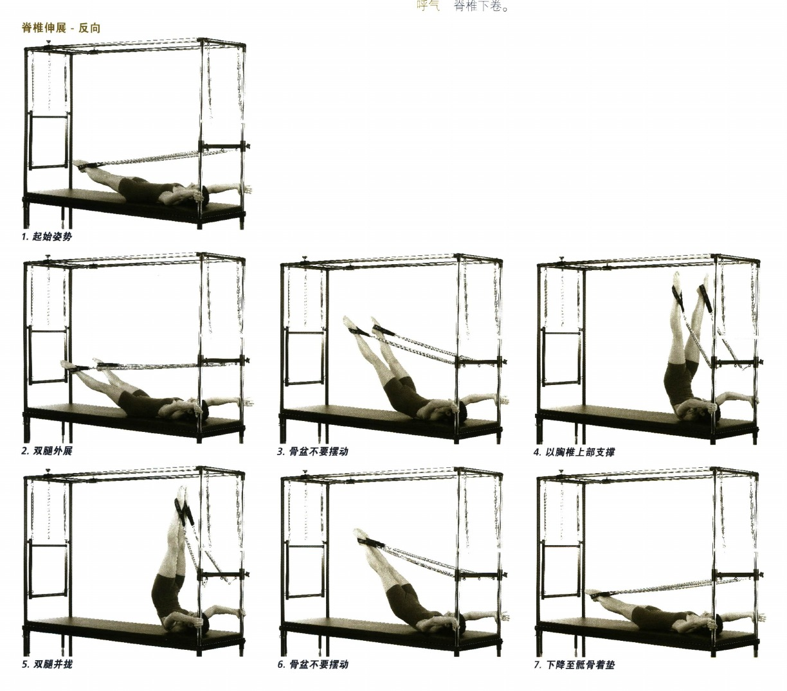

## 魔術師畫弧 (MAGICIAN CIRCLES)

- 頁碼：p.152-153
- 難度：高階
- 器械/章節：腿用彈簧
- 肌群分類：[[../muscles/cadillac-intermediate-advanced-core-and-lumbopelvic-stability.md|中高階：核心與腰骨盆穩定]], [[../muscles/cadillac-intermediate-advanced-spinal-articulation.md|中高階：脊椎屈曲、伸展、旋轉與側屈]], [[../muscles/cadillac-intermediate-advanced-hips-and-legs.md|中高階：髖與腿部控制]]
- 摘要：魔術師畫弧：主要歸入核心與腰骨盆穩定、脊椎屈曲、伸展、旋轉與側屈、髖與腿部控制；OCR 目標肌肉段落見下方摘錄。
- OCR 原文摘錄：目標肌肉：以腹橫肌擠壓腹部，穩定腰骨盆部位；以深層骨盆底 ，骨盆保持穩定，髖關節的孤立動作 肌輔助腹橫肌運動；腹直肌和腹斜肌等長收縮，以保持脊椎中立 ，保持股骨在髖關節旋轉 位；在雙腿擺向軀幹時，臀大肌和膕繩肌離心收縮，在雙腿擺開 時向心收縮，同時有助於保持抬高姿勢；髖外展肌向心收縮，以 ，擺動雙腿的幅度以保持骨盆穩定為限 開始開啟雙腿，髖內收肌群離心收縮，以控制雙腿分開；向心收 • 上提時，脊椎捲曲至胸椎上部即可，不可捲曲至頸椎 縮，以使雙腿併攏，雙腿靠向或遠離軀幹時，等長收縮髖內收肌群， ，避免“卡緊”或過度伸展雙膝 以使雙腿保持併攏
- 動作圖：
  - 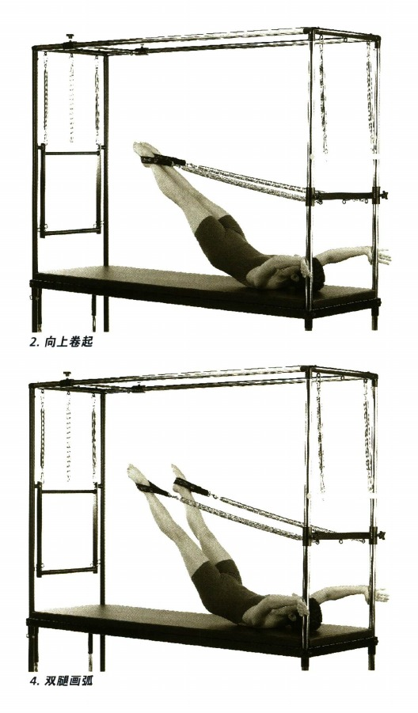
  - 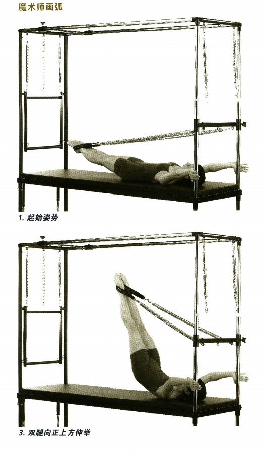
  - 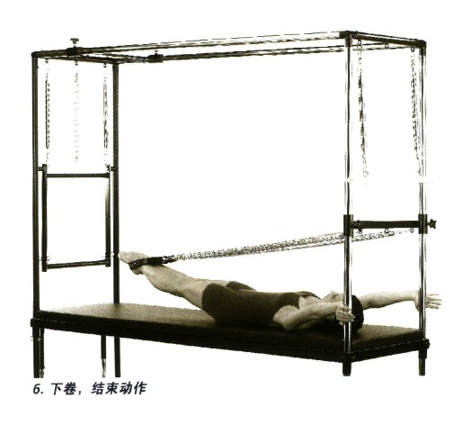
  - 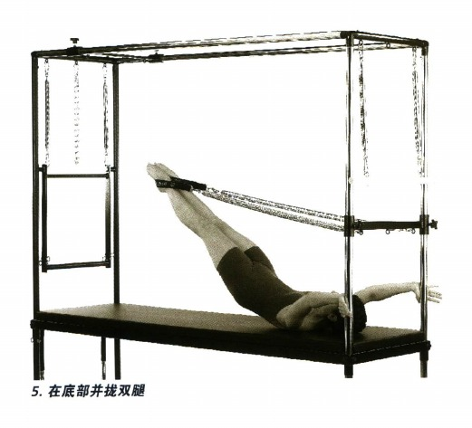

## 魔術師拍擊 (MAGICIAN BEATS)

- 頁碼：p.154-155
- 難度：高階
- 器械/章節：腿用彈簧
- 肌群分類：[[../muscles/cadillac-intermediate-advanced-core-and-lumbopelvic-stability.md|中高階：核心與腰骨盆穩定]], [[../muscles/cadillac-intermediate-advanced-spinal-articulation.md|中高階：脊椎屈曲、伸展、旋轉與側屈]], [[../muscles/cadillac-intermediate-advanced-scapular-stabilizers.md|中高階：肩胛穩定與上背穩定肌]], [[../muscles/cadillac-intermediate-advanced-hips-and-legs.md|中高階：髖與腿部控制]]
- 摘要：魔術師拍擊：主要歸入核心與腰骨盆穩定、脊椎屈曲、伸展、旋轉與側屈、肩胛穩定與上背穩定肌、髖與腿部控制；OCR 目標肌肉段落見下方摘錄。
- OCR 原文摘錄：目標肌肉：以腹橫肌擠壓腹部，穩定腰骨盆部位；以深層骨盆底 肌輔助腹橫肌運動：腹直肌、腹斜肌等長收縮，以保持抬高姿勢； 呼氣 保持雙腿相對穩定，從尾椎骨開始逐節活動脊椎離墊，直 臀大肌和膕繩肌等長收縮，以保持抬高姿勢和髖部開啟；髖外展 到落在胸椎上部，身體從雙肩至雙腳呈一條線：腰椎呈中 肌向心收縮，以分開雙腿；髖內收肌向心收縮，以對抗彈簧阻力， 立位。 併攏雙腿；肩胛骨穩定肌群 接下來⋯
- 動作圖：
  - 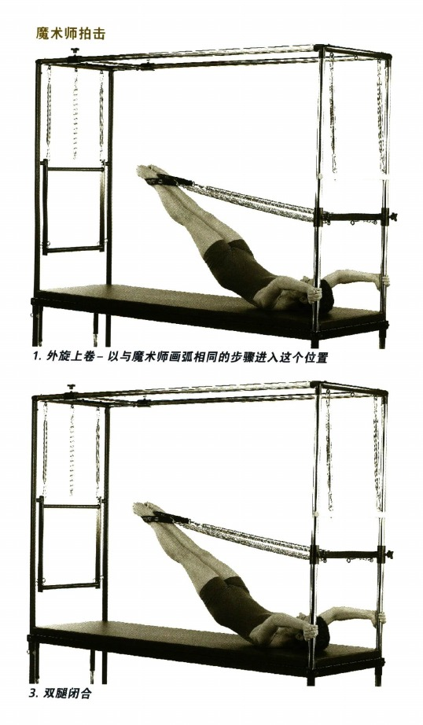
  - 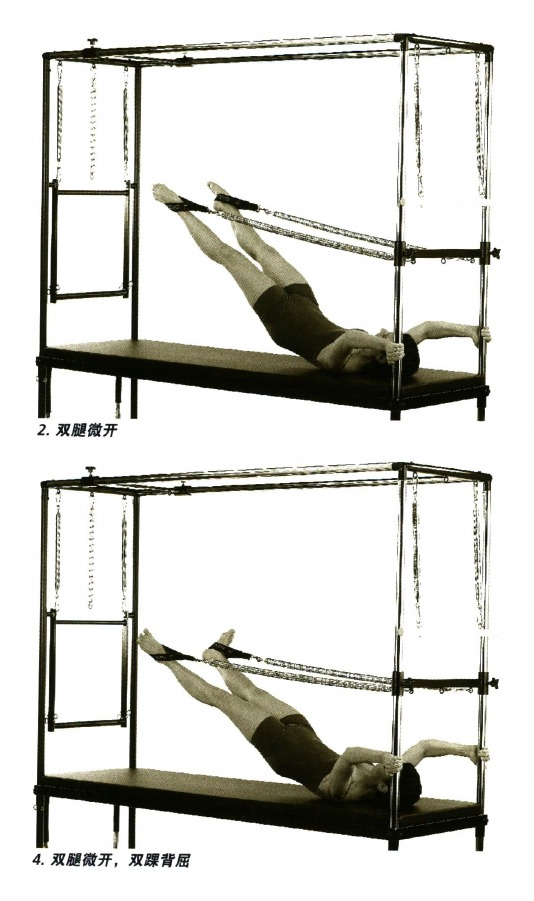
  - 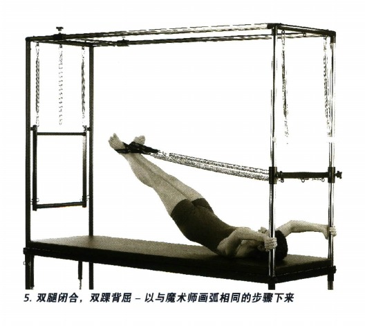

## 魔術師踏步 (MAGICIAN WALKS)

- 頁碼：p.156-157
- 難度：高階
- 器械/章節：腿用彈簧
- 肌群分類：[[../muscles/cadillac-intermediate-advanced-core-and-lumbopelvic-stability.md|中高階：核心與腰骨盆穩定]], [[../muscles/cadillac-intermediate-advanced-spinal-articulation.md|中高階：脊椎屈曲、伸展、旋轉與側屈]], [[../muscles/cadillac-intermediate-advanced-scapular-stabilizers.md|中高階：肩胛穩定與上背穩定肌]], [[../muscles/cadillac-intermediate-advanced-hips-and-legs.md|中高階：髖與腿部控制]]
- 摘要：魔術師踏步：主要歸入核心與腰骨盆穩定、脊椎屈曲、伸展、旋轉與側屈、肩胛穩定與上背穩定肌、髖與腿部控制；OCR 目標肌肉段落見下方摘錄。
- OCR 原文摘錄：目標肌肉：以腹橫肌擠壓腹部，穩定腰骨盆部位；以深層骨盆底 準備，吸氣⋯ 肌輔助腹橫肌運動；腹直肌、腹斜肌等長收縮，以保持抬高姿勢； 呼氣 保持雙腿相對穩定，從尾椎骨開始逐節活動脊椎離墊，直 在雙腿擺向軀幹時，臀大肌和膕繩肌離心收縮，在雙腿擺開時向 到落在胸椎上部，身體從雙肩至雙腳呈一條線；腰椎呈中 心收縮：髖外展肌防止雙腿向兩側分開；利用腹斜肌和多裂肌阻 立位。 止身體旋轉；肩胛骨穩定肌群 接下來⋯
- 動作圖：
  - 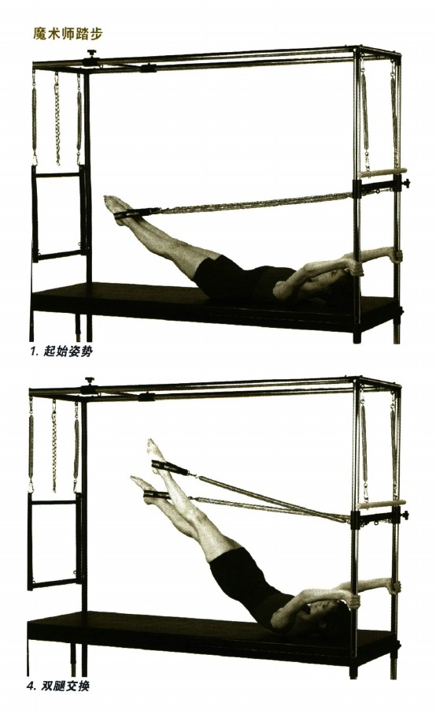
  - 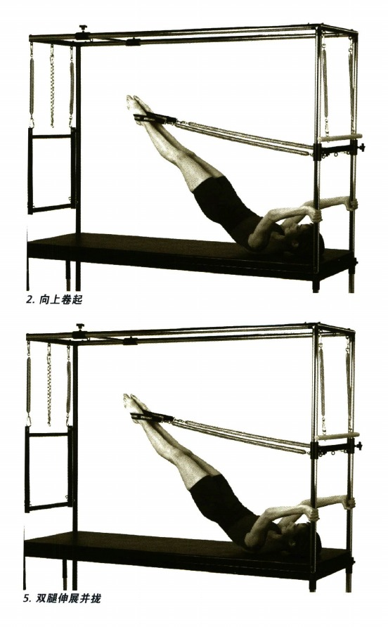
  - 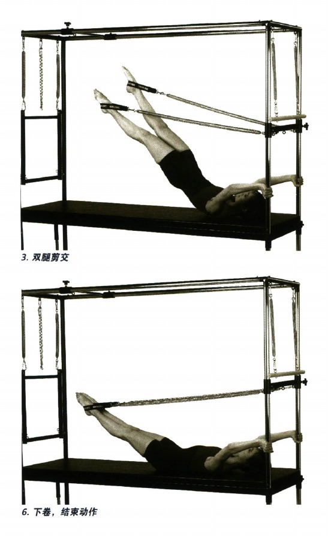

## 剪刀式 (SCISSORS)

- 頁碼：p.158-159
- 難度：中級
- 器械/章節：腿用彈簧側躺練習
- 肌群分類：[[../muscles/cadillac-intermediate-advanced-core-and-lumbopelvic-stability.md|中高階：核心與腰骨盆穩定]], [[../muscles/cadillac-intermediate-advanced-spinal-articulation.md|中高階：脊椎屈曲、伸展、旋轉與側屈]]
- 摘要：剪刀式：主要歸入核心與腰骨盆穩定、脊椎屈曲、伸展、旋轉與側屈；OCR 目標肌肉段落見下方摘錄。
- OCR 原文摘錄：目標肌肉：以腹橫肌擠壓腹部，穩定腰骨盆部位；以深層骨盆底 肌輔助腹橫肌運動；以腹斜肌和豎脊肌穩定軀幹；以腹斜肌和多
- 動作圖：
  - 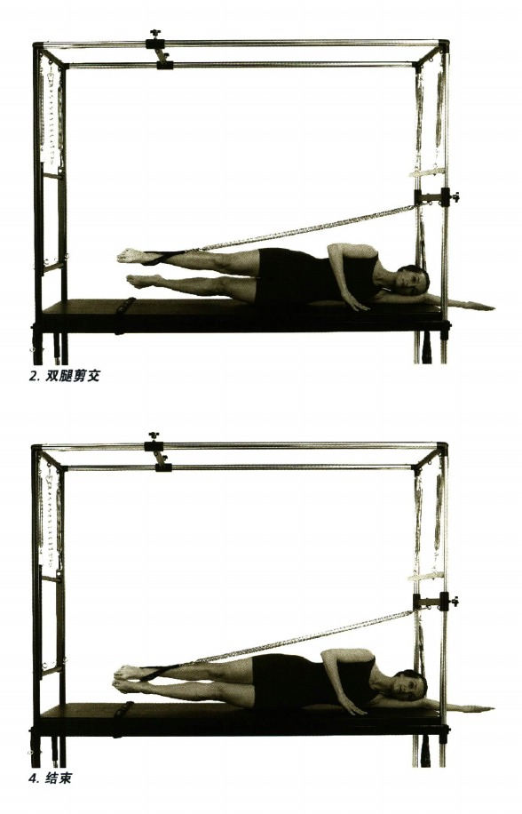
  - 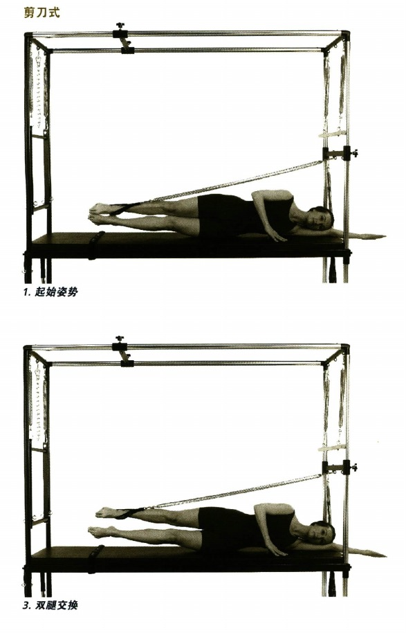
  - 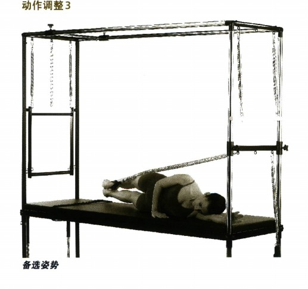

## 橢圓 (OVALS)

- 頁碼：p.160-161
- 難度：中級
- 器械/章節：腿用彈簧側躺練習
- 肌群分類：[[../muscles/cadillac-intermediate-advanced-core-and-lumbopelvic-stability.md|中高階：核心與腰骨盆穩定]], [[../muscles/cadillac-intermediate-advanced-spinal-articulation.md|中高階：脊椎屈曲、伸展、旋轉與側屈]], [[../muscles/cadillac-intermediate-advanced-scapular-stabilizers.md|中高階：肩胛穩定與上背穩定肌]], [[../muscles/cadillac-intermediate-advanced-hips-and-legs.md|中高階：髖與腿部控制]]
- 摘要：橢圓：主要歸入核心與腰骨盆穩定、脊椎屈曲、伸展、旋轉與側屈、肩胛穩定與上背穩定肌、髖與腿部控制；OCR 目標肌肉段落見下方摘錄。
- OCR 原文摘錄：目標肌肉：以腹橫肌擠壓腹部，穩定腰骨盆部位；以深層骨盆底 呼氣 單腿稍微朝後畫弧，然後內收。 肌輔助腹橫肌運動；以腹斜肌和豎脊肌穩定軀幹；以腹斜肌和多 裂肌避免旋轉；以位於下方的腹斜肌避免髖頂部提起；腿前伸時 髖部伸展肌群離心收縮，腿後伸時向心收縮：腿部下壓時，向心 收縮髖內收肌，離心收縮帶動腿部提起；肩胛骨穩定肌群
- 動作圖：
  - 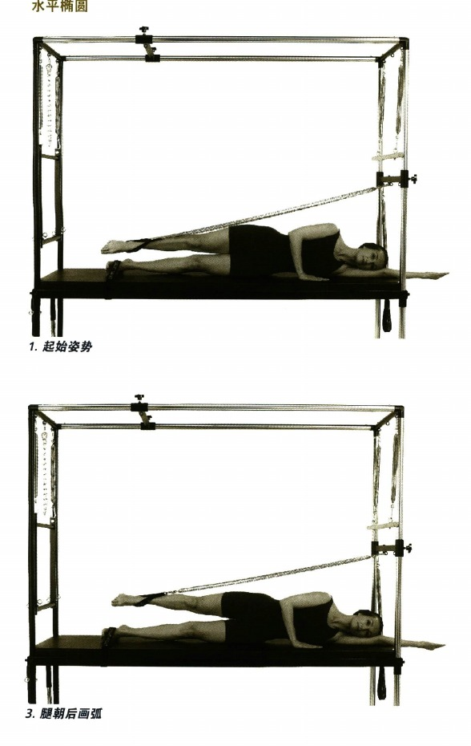
  - 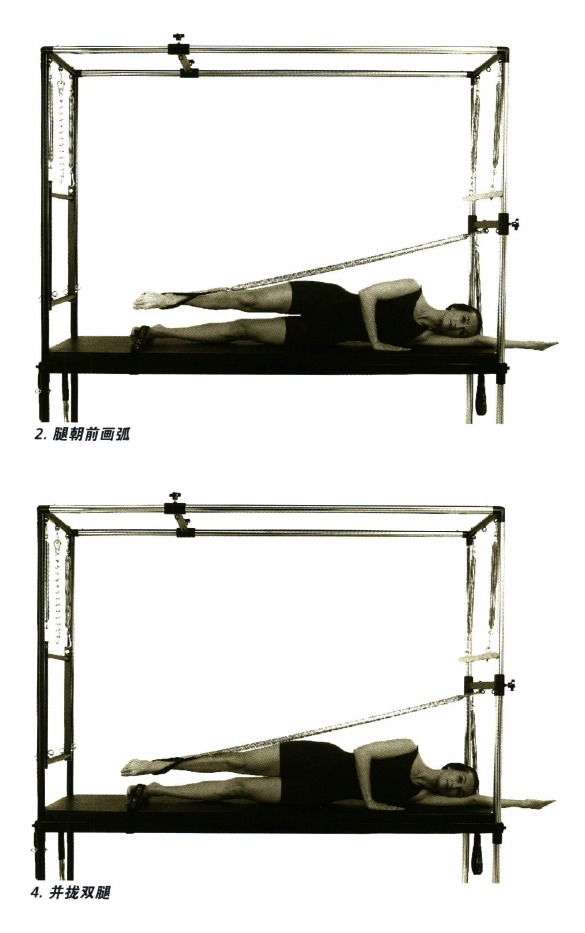
  - 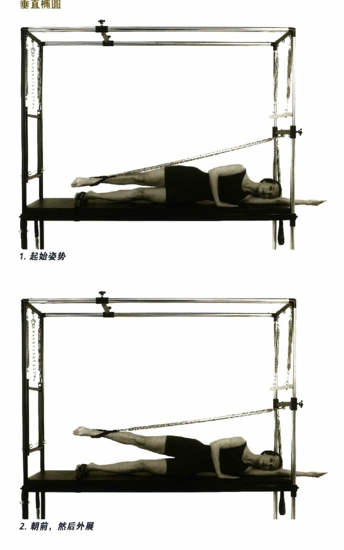
  - 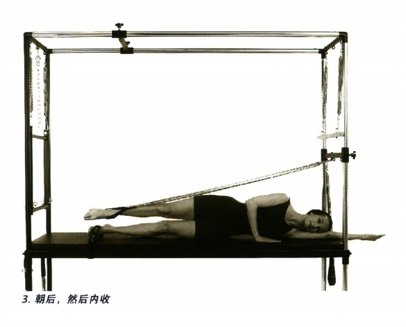

## 側踢伸展 (SIDE KICK STRETCH)

- 頁碼：p.162-163
- 難度：中級
- 器械/章節：腿用彈簧側躺練習
- 肌群分類：[[../muscles/cadillac-intermediate-advanced-core-and-lumbopelvic-stability.md|中高階：核心與腰骨盆穩定]], [[../muscles/cadillac-intermediate-advanced-spinal-articulation.md|中高階：脊椎屈曲、伸展、旋轉與側屈]], [[../muscles/cadillac-intermediate-advanced-scapular-stabilizers.md|中高階：肩胛穩定與上背穩定肌]], [[../muscles/cadillac-intermediate-advanced-hips-and-legs.md|中高階：髖與腿部控制]], [[../muscles/cadillac-intermediate-advanced-mobility-and-stretching.md|中高階：柔韌、伸展與懸掛釋放]]
- 摘要：側踢伸展：主要歸入核心與腰骨盆穩定、脊椎屈曲、伸展、旋轉與側屈、肩胛穩定與上背穩定肌、髖與腿部控制；OCR 目標肌肉段落見下方摘錄。
- OCR 原文摘錄：目標肌肉：以腹橫肌擠壓腹部，穩定腰骨盆部位；以深層骨盆底 •保持骨盆穩定，避免骨盆前傾或後傾以及脊椎彎曲或伸展 肌輔助腹橫肌運動；等長收縮腹斜肌和豎脊肌，以使軀幹保持穩 的傾向 定：利用腹斜肌和多裂肌用於防止旋轉；以位於下方的腹斜肌避 免髖頂部提起；等長收縮髖內收肌保持腿位於穩定高度；肩胛骨 ，全程運動範圍保持單腿與髖同高，避免上髖外展 穩定肌群 ，保持骨盆一側位於另一側的正上方；避免側斜或旋轉 ［正向］腿朝前伸時，臀大肌和膕繩肌離心收縮：髖部伸展肌群向 ，在位於上方的腿活動時控制彈簧 心收縮，以伸展髖部；以股四頭肌伸展膝關節；以外旋肌群旋轉 ，全程保持骨盆穩定，單獨完成髖關節活動 股骨；髖部伸展肌群向心收縮，以提高髖部伸展幅度 ，避免“卡緊”或過度伸展雙膝 【反向］膝關節彎曲時，股四頭肌離心收縮；腿部前伸時，髖部伸 展肌群離心收縮加以控制，腿部朝後伸展時髖部伸展肌群向心收
- 動作圖：
  - 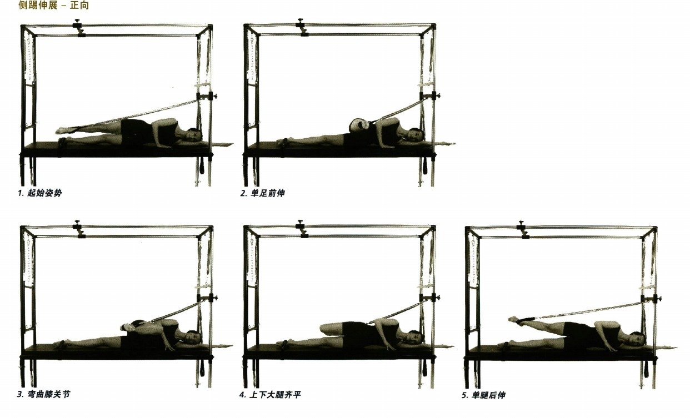
  - 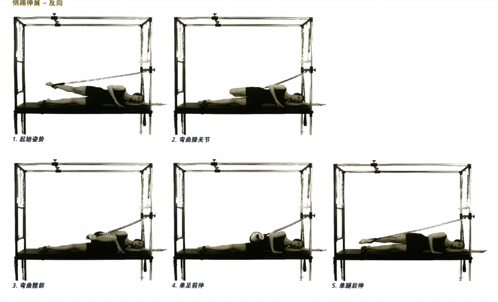

## 繃緊伸展 (DEVELOPE)

- 頁碼：p.164-165
- 難度：中級
- 器械/章節：腿用彈簧側躺練習
- 肌群分類：[[../muscles/cadillac-intermediate-advanced-core-and-lumbopelvic-stability.md|中高階：核心與腰骨盆穩定]], [[../muscles/cadillac-intermediate-advanced-spinal-articulation.md|中高階：脊椎屈曲、伸展、旋轉與側屈]], [[../muscles/cadillac-intermediate-advanced-scapular-stabilizers.md|中高階：肩胛穩定與上背穩定肌]], [[../muscles/cadillac-intermediate-advanced-hips-and-legs.md|中高階：髖與腿部控制]], [[../muscles/cadillac-intermediate-advanced-mobility-and-stretching.md|中高階：柔韌、伸展與懸掛釋放]]
- 摘要：繃緊伸展：主要歸入核心與腰骨盆穩定、脊椎屈曲、伸展、旋轉與側屈、肩胛穩定與上背穩定肌、髖與腿部控制；OCR 目標肌肉段落見下方摘錄。
- 器材設置：腿用彈簧側躺練習。
- 起始姿勢：
  呈側躺姿勢，頭部朝向垂直滑槓。骨盆和脊椎呈中立位。下臂伸直支撐頭部，上側手放在胸前墊上以保持穩定，肩胛骨保持穩定。位於下方的腿伸直，平行伸展，與軀幹呈一條線；可用支撐帶固定。位於上方的腿外旋，與上方髖部呈一條線，踝關節蹠屈，腳帶套在足弓上。
- 動作流程：
  正向：吸氣，保持軀幹和骨盆穩定，腿部外旋，背屈踝關節，彎曲位於上方的膝關節，使上腳沿著下腿內側移動並控制彈簧。繼續外展股骨，膝部朝肩部移動。保持股骨靜止不動，伸展膝關節，踝關節蹠屈，腳趾伸向水平槓。呼氣，保持雙腿伸長，踝關節蹠屈，內收髖部，將位於上方的腿拉向位於下方的腿。
  反向：吸氣，保持腿部伸直外旋，踝關節蹠屈，外展腿部，腳趾伸向水平槓，高度以能夠保持骨盆穩定為宜。呼氣，背屈踝關節，朝肩部方向屈曲膝關節，然後伸展膝關節，踵部朝下方腿內側滑移。每個方向重複練習 3-5 次。
- OCR 原文摘錄：目標肌肉：以腹橫肌擠壓腹部，穩定腰骨盆部位；以深層骨盆底 ，保持骨盆穩定，避免骨盆前傾或後傾以及脊椎彎曲或伸展 肌輔助腹橫肌運動；等長收縮腹斜肌和豎脊肌，以使軀幹保持 的傾向 穩定；利用腹斜肌和多裂肌用於防止旋轉；以位於下方的腹斜肌 避免髖項部提起；等長收縮外旋肌群保持髖部旋轉；肩胛骨穩定 ，保持骨盆一側位於另一側的正上方；避免側斜或旋轉 肌群 ，在位於上方的腿活動時控制彈簧 ［正向］膝關節上提時，髖內收肌離心收縮；膝關節彎曲時，股四 ，保持位於上方的髖臼內股骨外旋，腿部向上伸展時，要加大旋 頭肌離心收縮，膝關節伸展時，股四頭肌向心收縮；腿部落下時， 轉幅度 髖內收肌和膕繩肌向心收縮 ，在整個
- 動作圖：
  - 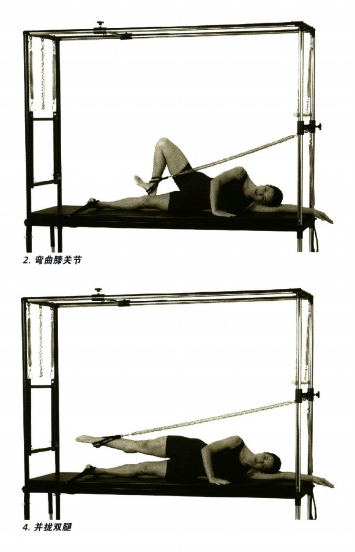
  - 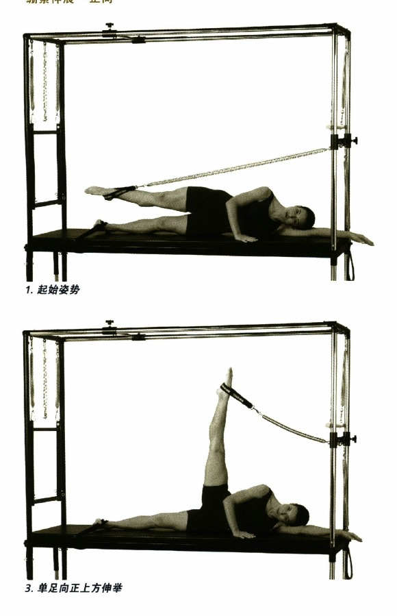
  - 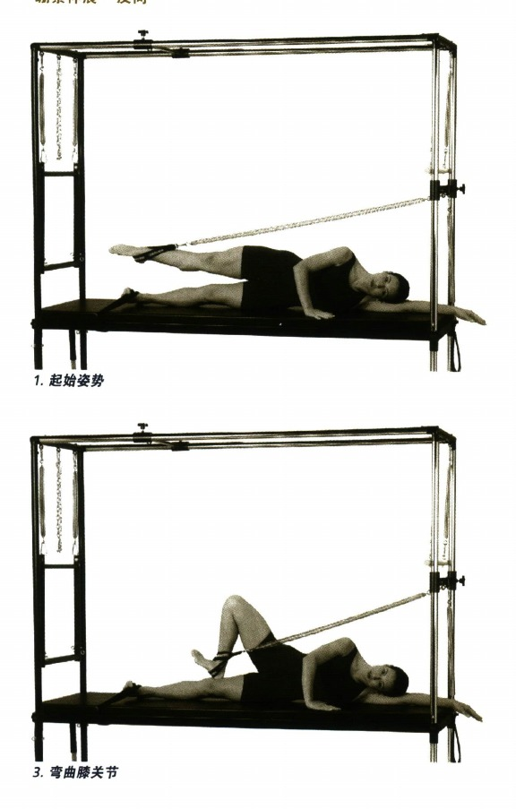
  - 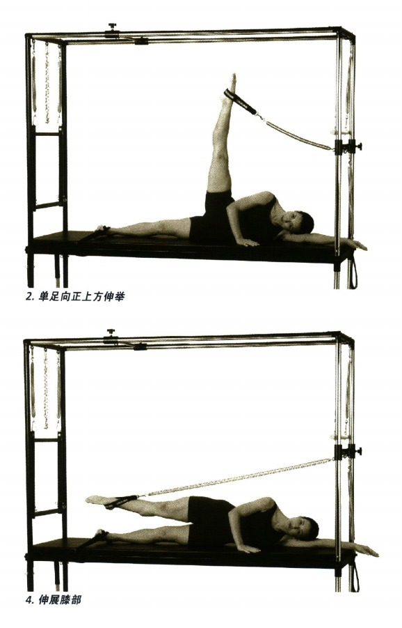

## 腿轉圈 (ROND DE JAMBE)

- 頁碼：p.166-167
- 難度：中級
- 器械/章節：腿用彈簧側躺練習
- 肌群分類：[[../muscles/cadillac-intermediate-advanced-core-and-lumbopelvic-stability.md|中高階：核心與腰骨盆穩定]], [[../muscles/cadillac-intermediate-advanced-spinal-articulation.md|中高階：脊椎屈曲、伸展、旋轉與側屈]], [[../muscles/cadillac-intermediate-advanced-scapular-stabilizers.md|中高階：肩胛穩定與上背穩定肌]], [[../muscles/cadillac-intermediate-advanced-hips-and-legs.md|中高階：髖與腿部控制]]
- 摘要：腿轉圈：主要歸入核心與腰骨盆穩定、脊椎屈曲、伸展、旋轉與側屈、肩胛穩定與上背穩定肌、髖與腿部控制；OCR 目標肌肉段落見下方摘錄。
- OCR 原文摘錄：目標肌肉：以腹橫肌擠壓腹部，穩定腰骨盆部位；以深層骨盆底 支撐頭部。上側手放在胸前墊上，以保持穩定，肩胛骨保持穩定。 肌輔助腹橫肌運動；等長收縮腹斜肌和豎脊肌，以使軀幹保持 位於下方的腿伸直，平行伸展，同軀幹呈一條線（可以用支撐帶 穩定；利用腹斜肌和多裂肌用於防止旋轉；以位於下方的腹斜肌 固定）。位於上方的腿外旋，同位於上方的髖部呈一條線，踝關節 避免髖頂部提起；等長收縮外旋肌群保持髖部旋轉；肩胛骨穩定 蹠屈，腳帶套在足弓上。 肌群 〔正向］腿部前伸時，髖部伸展肌群離心收縮：腿部側伸時，髖外
- 動作圖：
  - 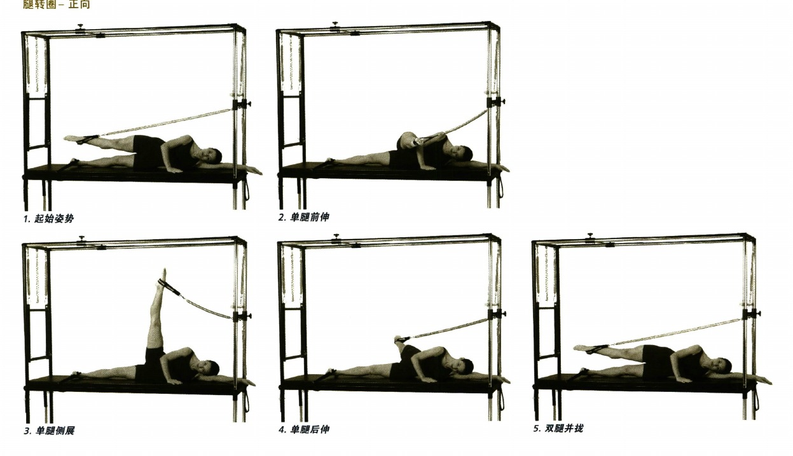
  - 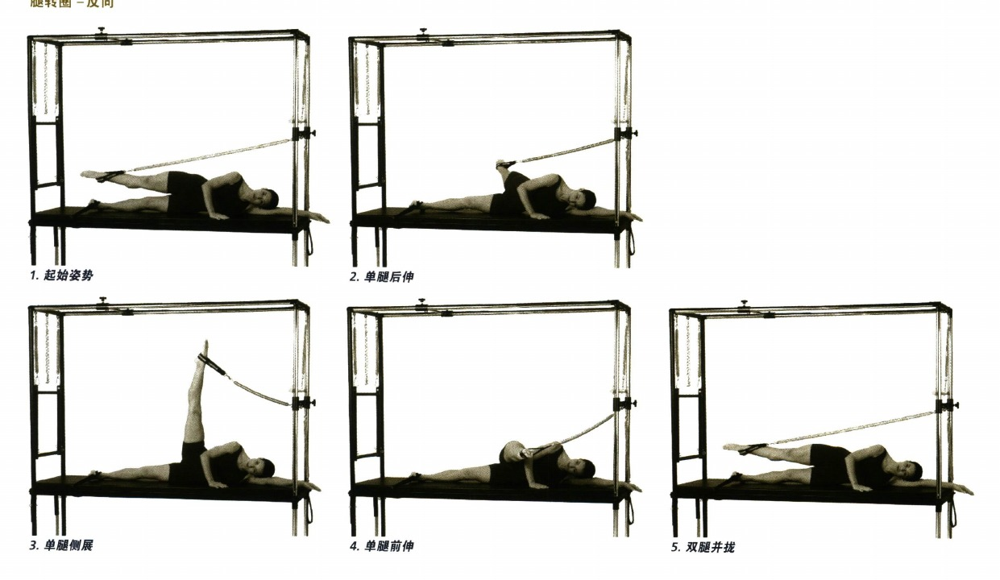

## 芭蕾伸展 (BALLET STRETCHES)

- 頁碼：p.168-169
- 難度：中級
- 器械/章節：毛絨掛帶動作
- 肌群分類：[[../muscles/cadillac-intermediate-advanced-core-and-lumbopelvic-stability.md|中高階：核心與腰骨盆穩定]], [[../muscles/cadillac-intermediate-advanced-spinal-articulation.md|中高階：脊椎屈曲、伸展、旋轉與側屈]], [[../muscles/cadillac-intermediate-advanced-scapular-stabilizers.md|中高階：肩胛穩定與上背穩定肌]], [[../muscles/cadillac-intermediate-advanced-hips-and-legs.md|中高階：髖與腿部控制]], [[../muscles/cadillac-intermediate-advanced-mobility-and-stretching.md|中高階：柔韌、伸展與懸掛釋放]]
- 摘要：芭蕾伸展：主要歸入核心與腰骨盆穩定、脊椎屈曲、伸展、旋轉與側屈、肩胛穩定與上背穩定肌、髖與腿部控制；OCR 目標肌肉段落見下方摘錄。
- OCR 原文摘錄：目標肌肉：以腹橫肌擠壓腹部，穩定腰骨盆部位；以深層骨盆底 肌輔助腹橫肌運動；腹斜肌和豎脊肌用以使軀幹保持豎直穩定； 過渡⋯• 利用腹斜肌和多裂肌對抗身體旋轉；肩胛骨穩定肌群 繼續吸氣，彎曲支撐腿的膝關節。 ［正向］弓步前移時，臀大肌和膕繩肌離心收縮；腹直肌和腹斜肌 呼氣 支撐腿的腳蹠球部著地，旋轉軀幹離開拉環，然後落踵。 向心收縮，形成屈曲；豎脊肌向心收縮，以伸展胸椎；以腹斜肌 儘可能保持骨盆水平正對前方，雙腿外旋。骨盆可以略微 避免腰椎過度伸展 旋轉，腰椎略微伸展。動作腿直接位於髖部正後方。 ［朝側］弓步前移時，髖內收肌群和伸展肌群離心收縮；向心收縮 屈伸
- 動作圖：
  - 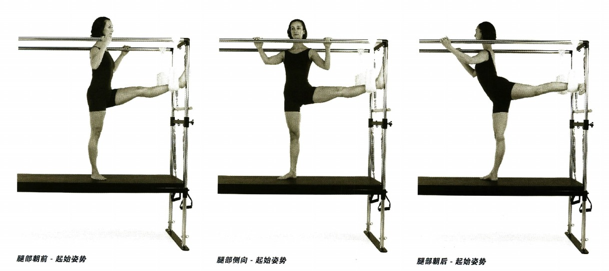

## 展翅雄鷹 (SPREAD EAGLE)

- 頁碼：p.170-171
- 難度：中級
- 器械/章節：毛絨掛帶動作
- 肌群分類：[[../muscles/cadillac-intermediate-advanced-core-and-lumbopelvic-stability.md|中高階：核心與腰骨盆穩定]], [[../muscles/cadillac-intermediate-advanced-spinal-articulation.md|中高階：脊椎屈曲、伸展、旋轉與側屈]], [[../muscles/cadillac-intermediate-advanced-scapular-stabilizers.md|中高階：肩胛穩定與上背穩定肌]], [[../muscles/cadillac-intermediate-advanced-arms-delts-pecs.md|中高階：手臂、三角肌、胸大肌與前臂]], [[../muscles/cadillac-intermediate-advanced-hips-and-legs.md|中高階：髖與腿部控制]]
- 摘要：展翅雄鷹：主要歸入核心與腰骨盆穩定、脊椎屈曲、伸展、旋轉與側屈、肩胛穩定與上背穩定肌、手臂、三角肌、胸大肌與前臂；OCR 目標肌肉段落見下方摘錄。
- OCR 原文摘錄：目標肌肉：以腹橫肌擠壓腹部，穩定腰骨盆部位；以深層骨盆底 肌輔助腹橫肌運動；向心收縮腹直肌和腹斜肌，以使脊椎彎曲； 豎脊肌向心收縮以伸展脊椎；腹斜肌用以防止腰椎過度伸展；向 心收縮臀大肌和膕繩肌以伸展髖部並上抬骨盆；在骨盆降下時離 心收縮；膝關節彎曲時，膕繩肌向心收縮，膝關節伸展時離心收縮： 肩胛骨穩定肌群；以前臂肌肉穩定腕關節和雙手
- 動作圖：
  - 
  - 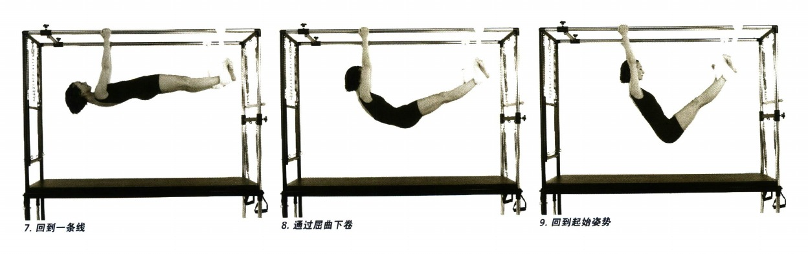

## 腹肌捲曲 (ABDOMINAL CURLS)

- 頁碼：p.172
- 難度：中級
- 器械/章節：毛絨掛帶動作
- 肌群分類：[[../muscles/cadillac-intermediate-advanced-core-and-lumbopelvic-stability.md|中高階：核心與腰骨盆穩定]], [[../muscles/cadillac-intermediate-advanced-spinal-articulation.md|中高階：脊椎屈曲、伸展、旋轉與側屈]]
- 摘要：腹肌捲曲：主要歸入核心與腰骨盆穩定、脊椎屈曲、伸展、旋轉與側屈；OCR 目標肌肉段落見下方摘錄。
- OCR 原文摘錄：目標肌肉：以腹橫肌擠壓腹部，穩定腰骨盆部位；以深層骨盆底 注意事項：必須由經過訓練的專業人員在整個
- 動作圖：
  - 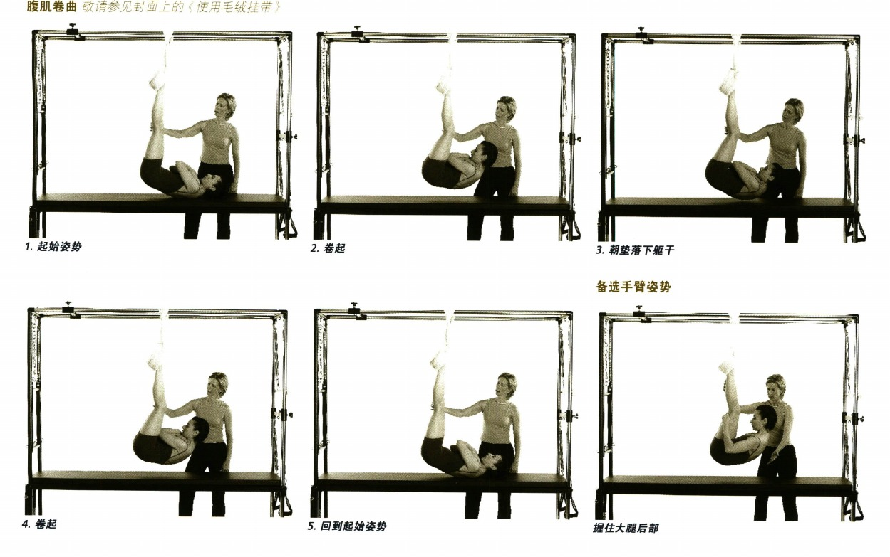

## 半懸掛 (HALF HANG)

- 頁碼：p.173
- 難度：中級
- 器械/章節：毛絨掛帶動作
- 肌群分類：[[../muscles/cadillac-intermediate-advanced-core-and-lumbopelvic-stability.md|中高階：核心與腰骨盆穩定]], [[../muscles/cadillac-intermediate-advanced-spinal-articulation.md|中高階：脊椎屈曲、伸展、旋轉與側屈]], [[../muscles/cadillac-intermediate-advanced-lat-teres-pulling-chain.md|中高階：背闊肌、大圓肌與拉力鏈]], [[../muscles/cadillac-intermediate-advanced-hips-and-legs.md|中高階：髖與腿部控制]], [[../muscles/cadillac-intermediate-advanced-mobility-and-stretching.md|中高階：柔韌、伸展與懸掛釋放]]
- 摘要：半懸掛：主要歸入核心與腰骨盆穩定、脊椎屈曲、伸展、旋轉與側屈、背闊肌、大圓肌與拉力鏈、髖與腿部控制；OCR 目標肌肉段落見下方摘錄。
- 器材設置：絨毛掛帶滑至水平槓中間位置。必須由受過訓練的專業人員在整個練習過程中提供幫助，確保起始姿勢安全舒適，吊帶固定妥善牢固。保持踝背屈，避免雙足滑出吊帶。
- 起始姿勢：
  呈半懸掛姿勢，雙腳牢固置於絨毛掛帶上。以胸椎上部貼墊。
- 動作流程：
  正常呼吸。雙足自由懸於吊帶中，以胸椎上部貼墊。懸掛數秒鐘，以不超過 1 分鐘為宜。重複練習 1 次。
- OCR 原文摘錄：目標肌肉：放鬆肌肉，特別是脊椎和髖部的肌肉 注意事項：必須由經過訓練的專業人員在整個
- 動作圖：
  - 

## 完全懸掛姿勢 (FULL HANG)

- 頁碼：p.174-175
- 難度：中級
- 器械/章節：毛絨掛帶動作
- 肌群分類：[[../muscles/cadillac-intermediate-advanced-core-and-lumbopelvic-stability.md|中高階：核心與腰骨盆穩定]], [[../muscles/cadillac-intermediate-advanced-spinal-articulation.md|中高階：脊椎屈曲、伸展、旋轉與側屈]], [[../muscles/cadillac-intermediate-advanced-lat-teres-pulling-chain.md|中高階：背闊肌、大圓肌與拉力鏈]], [[../muscles/cadillac-intermediate-advanced-hips-and-legs.md|中高階：髖與腿部控制]], [[../muscles/cadillac-intermediate-advanced-mobility-and-stretching.md|中高階：柔韌、伸展與懸掛釋放]]
- 摘要：完全懸掛姿勢：主要歸入核心與腰骨盆穩定、脊椎屈曲、伸展、旋轉與側屈、背闊肌、大圓肌與拉力鏈、髖與腿部控制；OCR 目標肌肉段落見下方摘錄。
- OCR 原文摘錄：目標肌肉：放鬆體態肌肉，特別是脊椎和髖部周圍的肌肉
- 動作圖：
  - 
  - 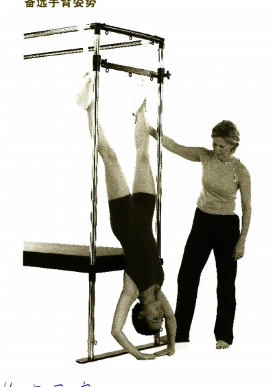
  - 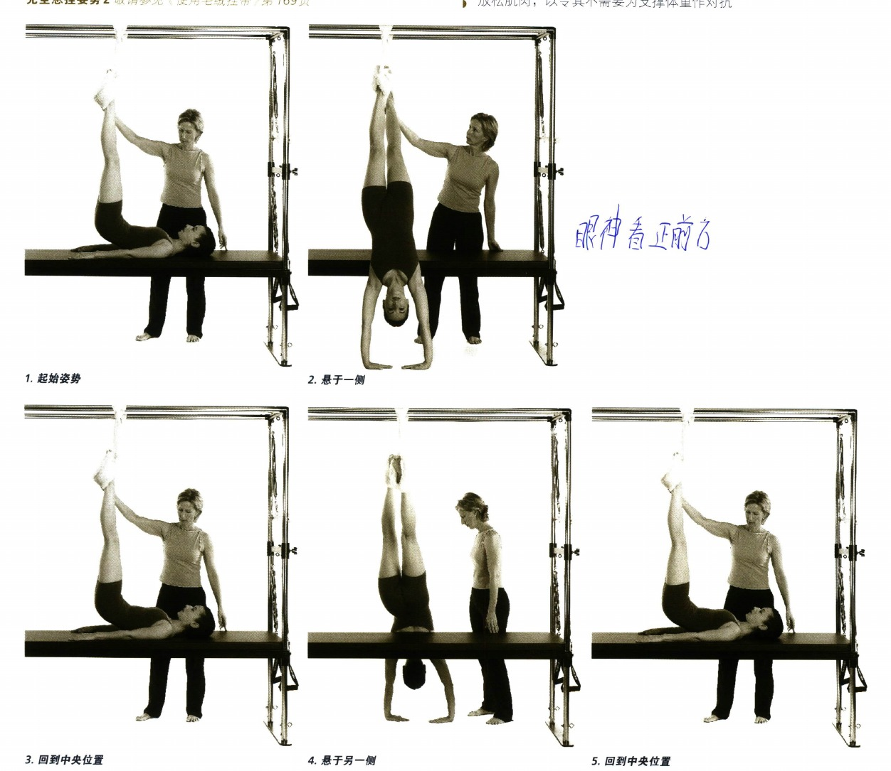
