# 全套平衡椅動作索引

來源：[[../sources/chair_source|全套平衡椅 source note]]。

範圍：PDF 第 6-173 頁；已按要求跳過首 5 頁和末 5 頁。

## 腳部練習 (FOOTWORK)

- 頁碼：p.24-29
- 難度：平衡椅
- 器械/章節：平衡椅
- 肌群分類：[[../muscles/chair-spinal-articulation|脊椎活動]], [[../muscles/chair-scapular-stabilizers|肩胛與上背穩定]], [[../muscles/chair-arms-delts-pecs|手臂與胸肩]], [[../muscles/chair-hips-and-legs|髖與腿]], [[../muscles/chair-mobility-and-stretching|柔韌與伸展]]
- 摘要：腳部練習：主要歸入脊椎活動、肩胛與上背穩定、手臂與胸肩、髖與腿。
- 動作圖：
  - 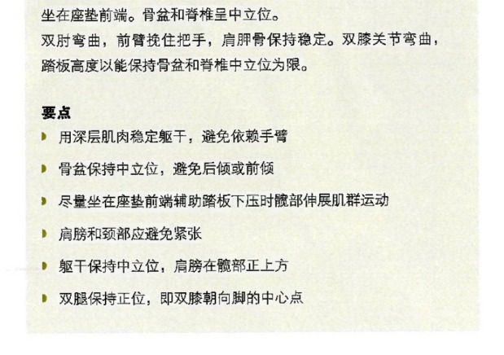
  - 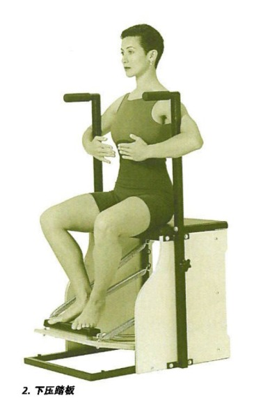
  - 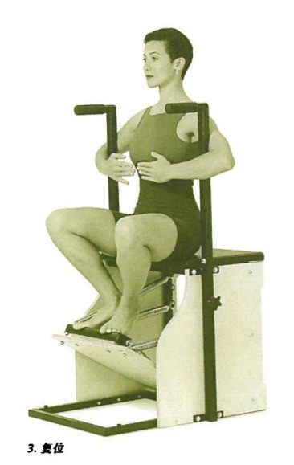
  - 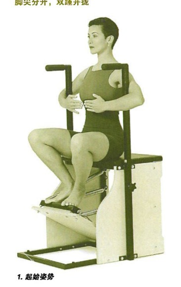
  - 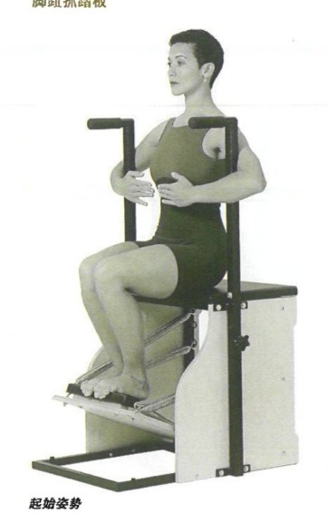
  - 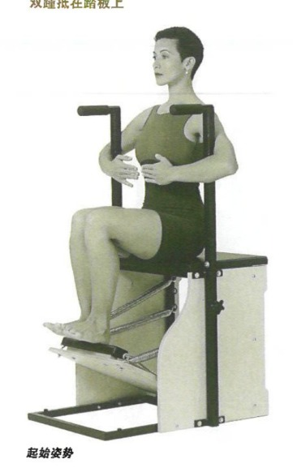
  - 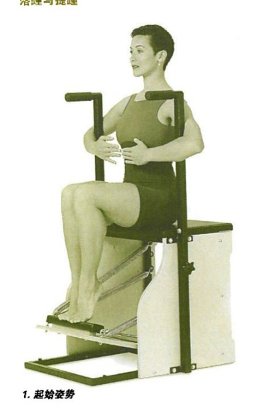
  - 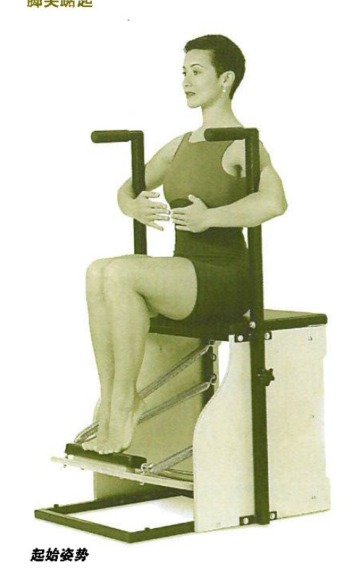
  - 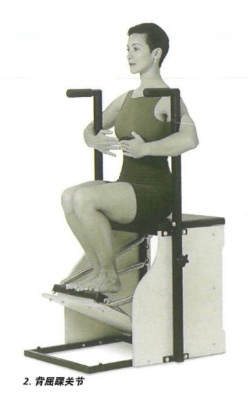
  - 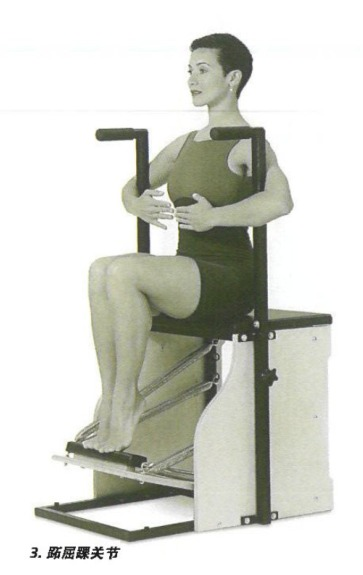
  - 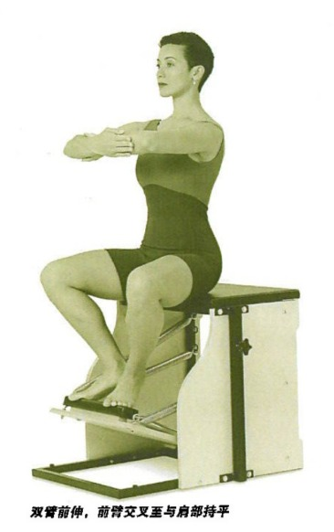
  - 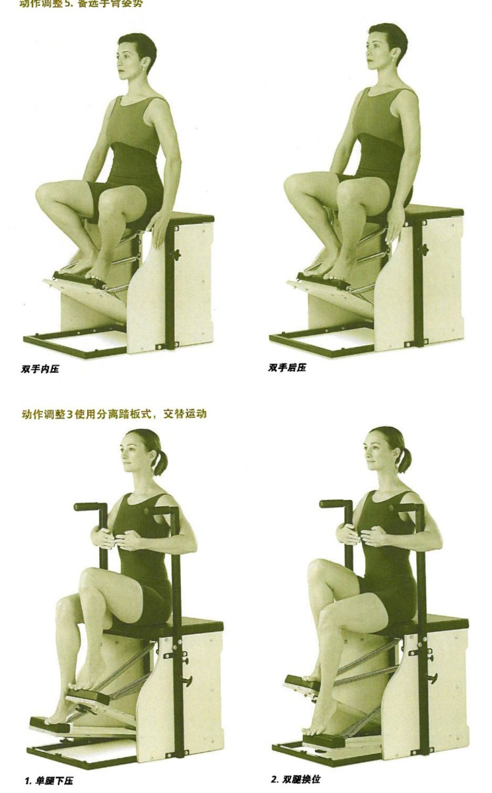
  - 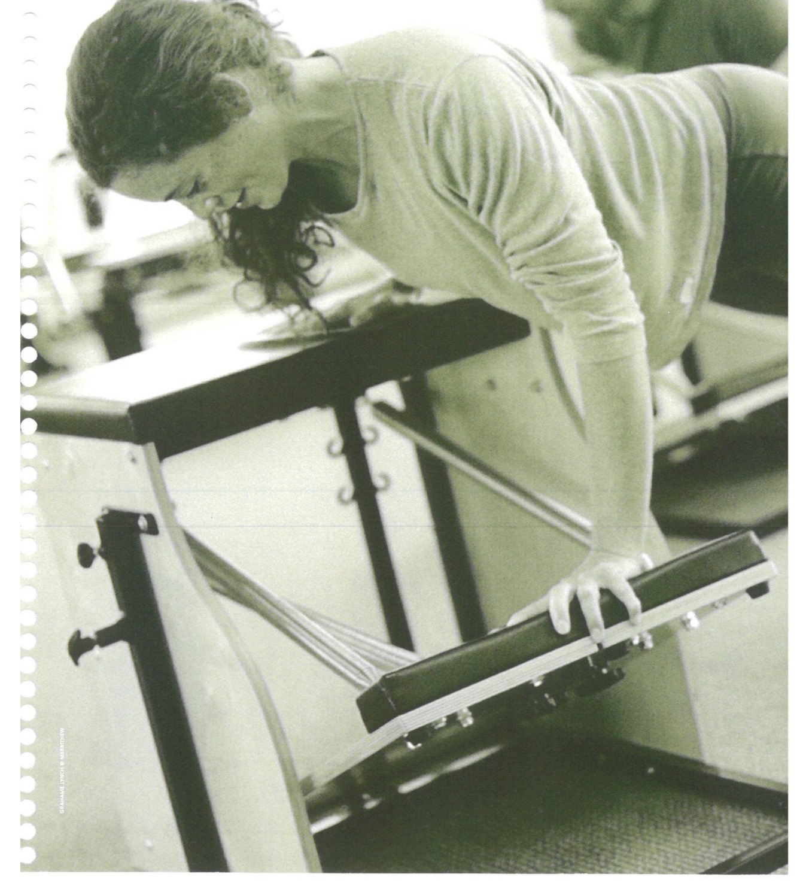

## 單腿練習 (SINGLE LEG)

- 頁碼：p.30-32
- 難度：平衡椅
- 器械/章節：平衡椅
- 肌群分類：[[../muscles/chair-core-and-lumbopelvic-stability|核心與腰骨盆穩定]], [[../muscles/chair-spinal-articulation|脊椎活動]], [[../muscles/chair-scapular-stabilizers|肩胛與上背穩定]], [[../muscles/chair-arms-delts-pecs|手臂與胸肩]], [[../muscles/chair-hips-and-legs|髖與腿]], [[../muscles/chair-mobility-and-stretching|柔韌與伸展]]
- 摘要：單腿練習：主要歸入核心與腰骨盆穩定、脊椎活動、肩胛與上背穩定、手臂與胸肩。
- 動作圖：
  - 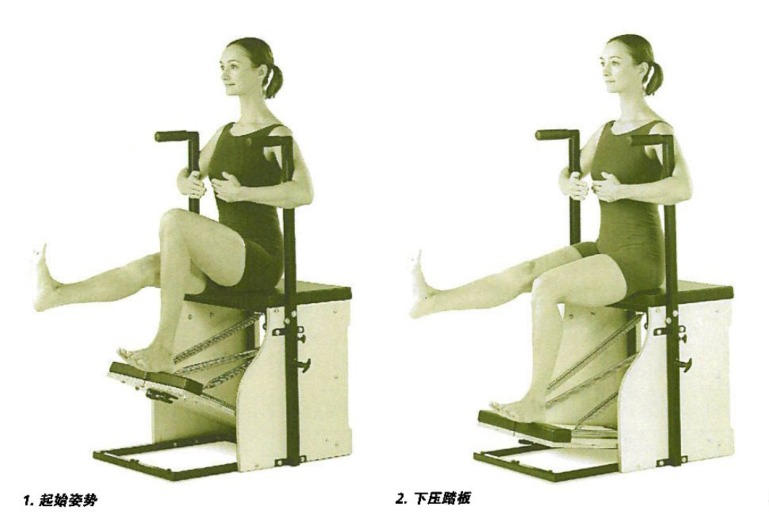
  - 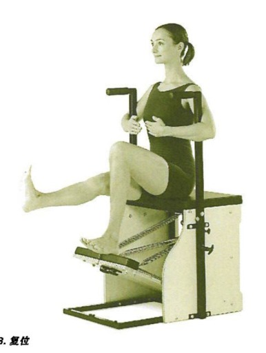
  - 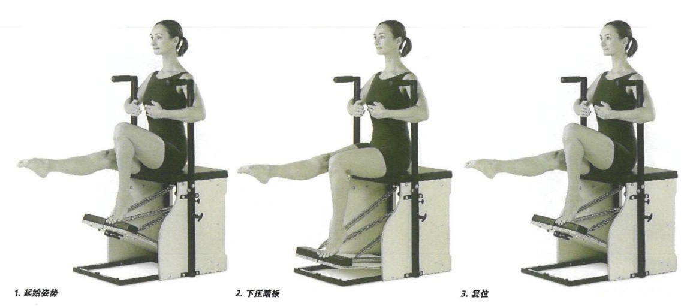
  - 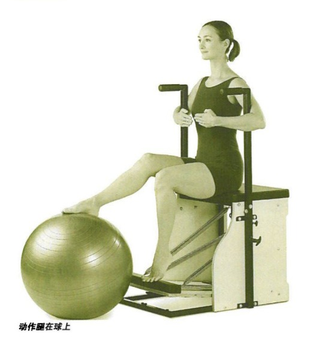
  - 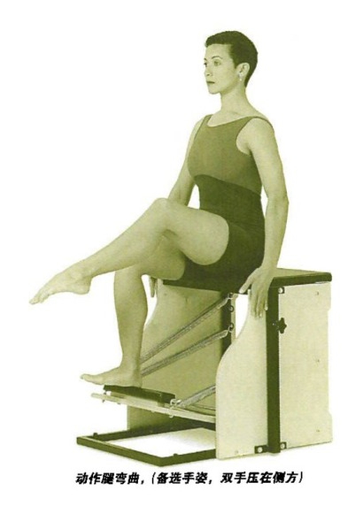

## 胭繩肌下壓練習-平躺 (HAMSTRING PRESS HIPS DOWN)

- 頁碼：p.33-35
- 難度：平衡椅
- 器械/章節：平衡椅
- 肌群分類：[[../muscles/chair-core-and-lumbopelvic-stability|核心與腰骨盆穩定]], [[../muscles/chair-spinal-articulation|脊椎活動]], [[../muscles/chair-scapular-stabilizers|肩胛與上背穩定]], [[../muscles/chair-hips-and-legs|髖與腿]], [[../muscles/chair-mobility-and-stretching|柔韌與伸展]]
- 摘要：胭繩肌下壓練習-平躺：主要歸入核心與腰骨盆穩定、脊椎活動、肩胛與上背穩定、髖與腿。
- OCR 原文摘錄：注意事項：將墊子豎放在椅子前面，一端頂住金屬底座，使起始 目標肌肉：以腹橫肌擠壓腹部，穩定腰骨盆部位；以深層骨盆底 姿勢更舒適。 肌輔助腹橫肌運動；下壓踏板時，向心收縮臀大肌和胭繩肌，並 在路板復位時，離心收縮上述肌肉：肩胛骨穩定肌群
- 動作圖：
  - 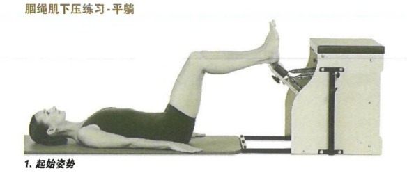
  - 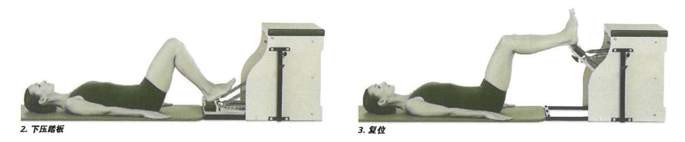
  - 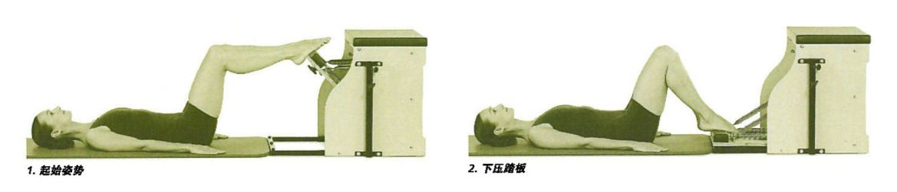
  - 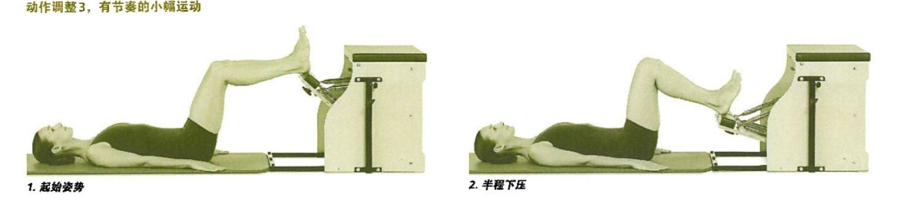
  - 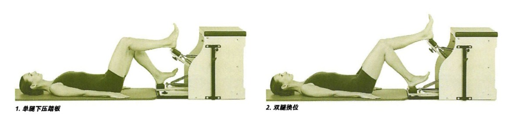
  - 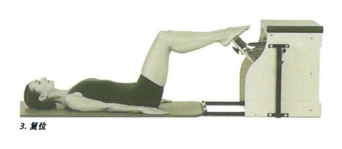
  - 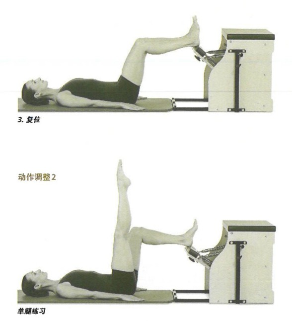

## 內收肌下壓 (ADDUCTOR PRESS)

- 頁碼：p.36
- 難度：平衡椅
- 器械/章節：平衡椅
- 肌群分類：[[../muscles/chair-core-and-lumbopelvic-stability|核心與腰骨盆穩定]], [[../muscles/chair-spinal-articulation|脊椎活動]], [[../muscles/chair-scapular-stabilizers|肩胛與上背穩定]], [[../muscles/chair-arms-delts-pecs|手臂與胸肩]], [[../muscles/chair-hips-and-legs|髖與腿]], [[../muscles/chair-mobility-and-stretching|柔韌與伸展]]
- 摘要：內收肌下壓：主要歸入核心與腰骨盆穩定、脊椎活動、肩胛與上背穩定、手臂與胸肩。
- OCR 原文摘錄：注意事項：將墊子豎放在椅子前面，一端頂住金屬底座，使起始 日標肌肉：以腹橫肌擠壓腹部，穩定腰骨盆部位；以深層骨盆底 姿勢更舒適。 肌輔助腹橫肌運動；下壓踏板時，向心收縮上面的腿的內收肌群， 並在踏板復位時，離心收縮上述肌肉；利用腹斜肌和多裂肌阻止
- 動作圖：
  - 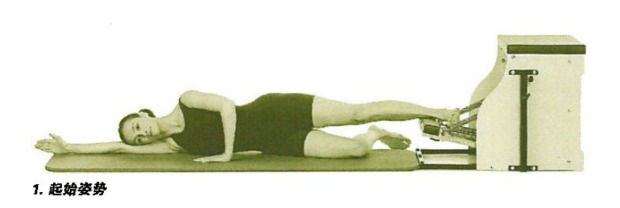
  - 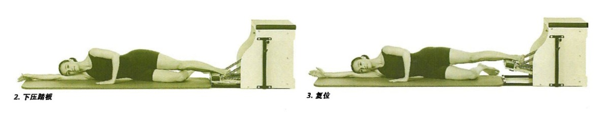

## 腳踝練習 (ANKLE EXERCISE)

- 頁碼：p.37
- 難度：平衡椅
- 器械/章節：平衡椅
- 肌群分類：[[../muscles/chair-core-and-lumbopelvic-stability|核心與腰骨盆穩定]], [[../muscles/chair-spinal-articulation|脊椎活動]], [[../muscles/chair-scapular-stabilizers|肩胛與上背穩定]], [[../muscles/chair-hips-and-legs|髖與腿]]
- 摘要：腳踝練習：主要歸入核心與腰骨盆穩定、脊椎活動、肩胛與上背穩定、髖與腿。
- 動作圖：
  - 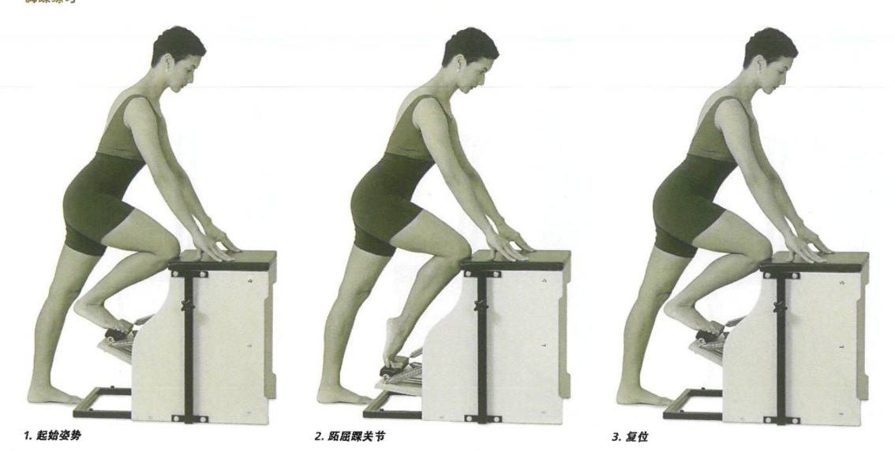

## 站立落踵與提踵 (LOWER & LIFT STANDING)

- 頁碼：p.38-39
- 難度：平衡椅
- 器械/章節：平衡椅
- 肌群分類：[[../muscles/chair-core-and-lumbopelvic-stability|核心與腰骨盆穩定]], [[../muscles/chair-spinal-articulation|脊椎活動]], [[../muscles/chair-scapular-stabilizers|肩胛與上背穩定]], [[../muscles/chair-arms-delts-pecs|手臂與胸肩]], [[../muscles/chair-hips-and-legs|髖與腿]], [[../muscles/chair-mobility-and-stretching|柔韌與伸展]]
- 摘要：站立落踵與提踵：主要歸入核心與腰骨盆穩定、脊椎活動、肩胛與上背穩定、手臂與胸肩。
- 動作圖：
  - 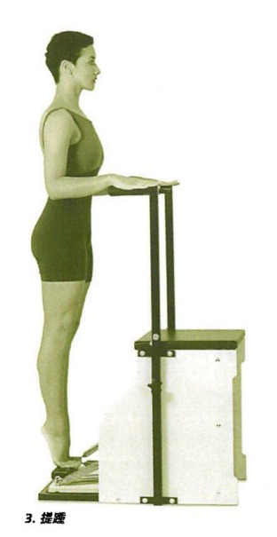
  - 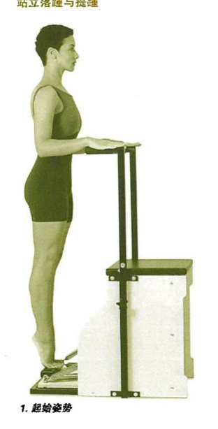
  - 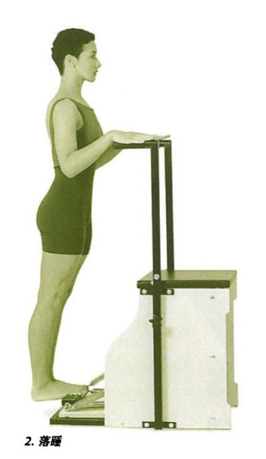
  - 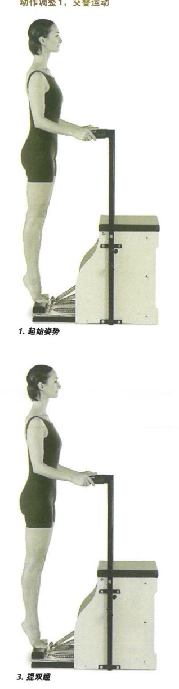
  - 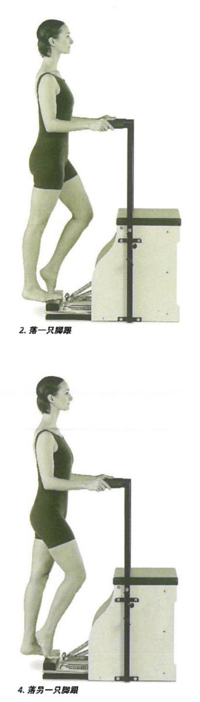
  - 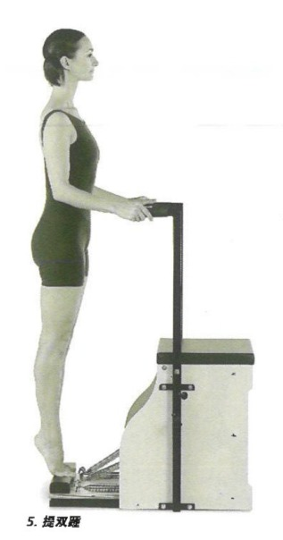

## 長盒腳下壓 (FOOT PRESS ON LONG BOX)

- 頁碼：p.40-41
- 難度：平衡椅
- 器械/章節：平衡椅
- 肌群分類：[[../muscles/chair-core-and-lumbopelvic-stability|核心與腰骨盆穩定]], [[../muscles/chair-spinal-articulation|脊椎活動]], [[../muscles/chair-scapular-stabilizers|肩胛與上背穩定]], [[../muscles/chair-arms-delts-pecs|手臂與胸肩]], [[../muscles/chair-hips-and-legs|髖與腿]], [[../muscles/chair-mobility-and-stretching|柔韌與伸展]]
- 摘要：長盒腳下壓：主要歸入核心與腰骨盆穩定、脊椎活動、肩胛與上背穩定、手臂與胸肩。
- 動作圖：
  - 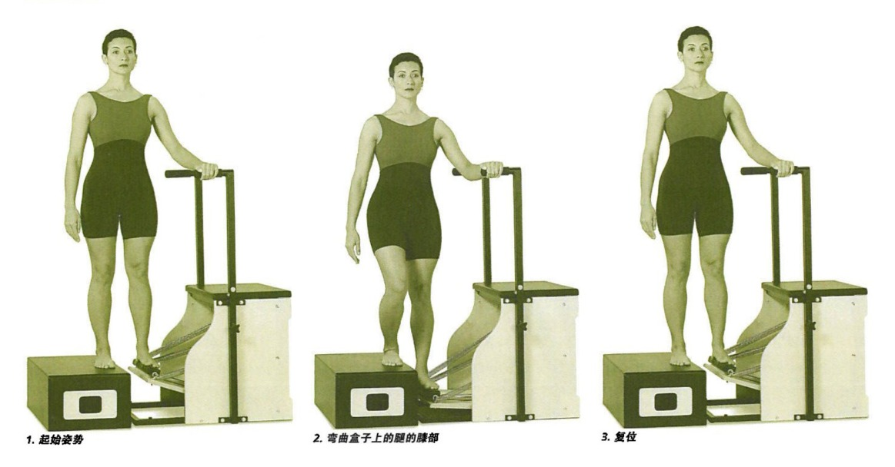
  - 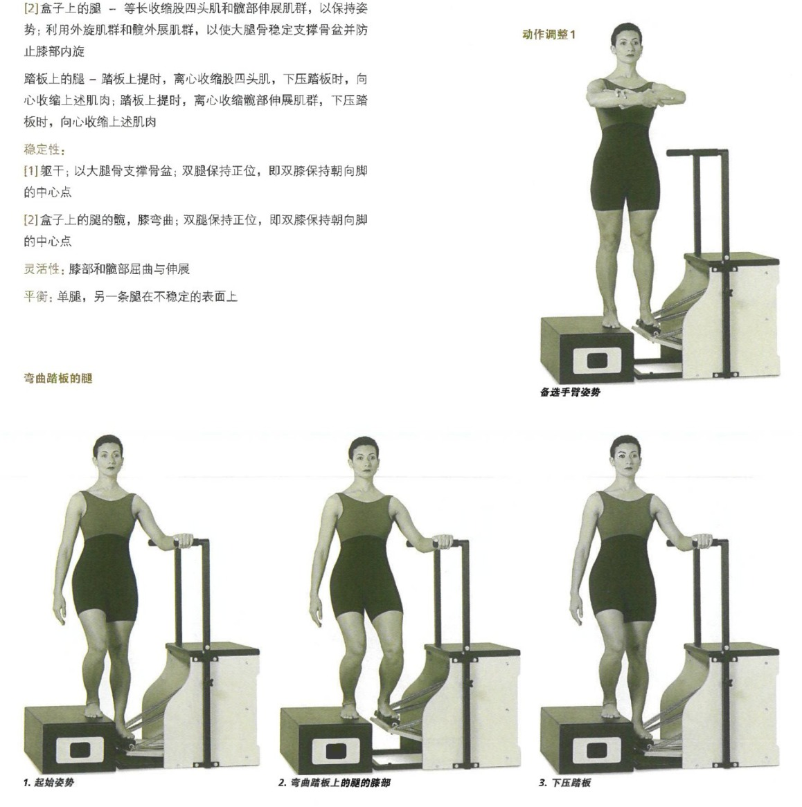

## 交叉腿下壓練習 (CROSSOVER PRESS)

- 頁碼：p.42-43
- 難度：平衡椅
- 器械/章節：平衡椅
- 肌群分類：[[../muscles/chair-core-and-lumbopelvic-stability|核心與腰骨盆穩定]], [[../muscles/chair-spinal-articulation|脊椎活動]], [[../muscles/chair-scapular-stabilizers|肩胛與上背穩定]], [[../muscles/chair-arms-delts-pecs|手臂與胸肩]], [[../muscles/chair-hips-and-legs|髖與腿]], [[../muscles/chair-mobility-and-stretching|柔韌與伸展]]
- 摘要：交叉腿下壓練習：主要歸入核心與腰骨盆穩定、脊椎活動、肩胛與上背穩定、手臂與胸肩。
- OCR 原文摘錄：目標肌肉：以腹橫肌擠壓腹部，穩定腰骨盆部位；以深層骨盆底 肌輔助腹橫肌運動；等長收縮腹斜肌和豎脊肌，以使軀幹保持中 立位；利用腹斜肌和多裂肌阻止身體旋轉；等長收縮站立腿的鏡 內收肌群和外展肌群，以使大腿骨穩定支撐骨盆：向心收縮踏板 上腿的髖部伸展肌群和股四頭肌，以使踏板下壓，並在踏板復位 時，離心收縮上述肌肉；肩胛骨穩定肌群
- 動作圖：
  - 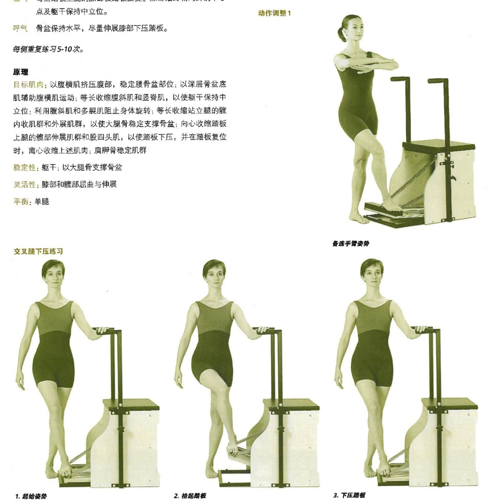
  - 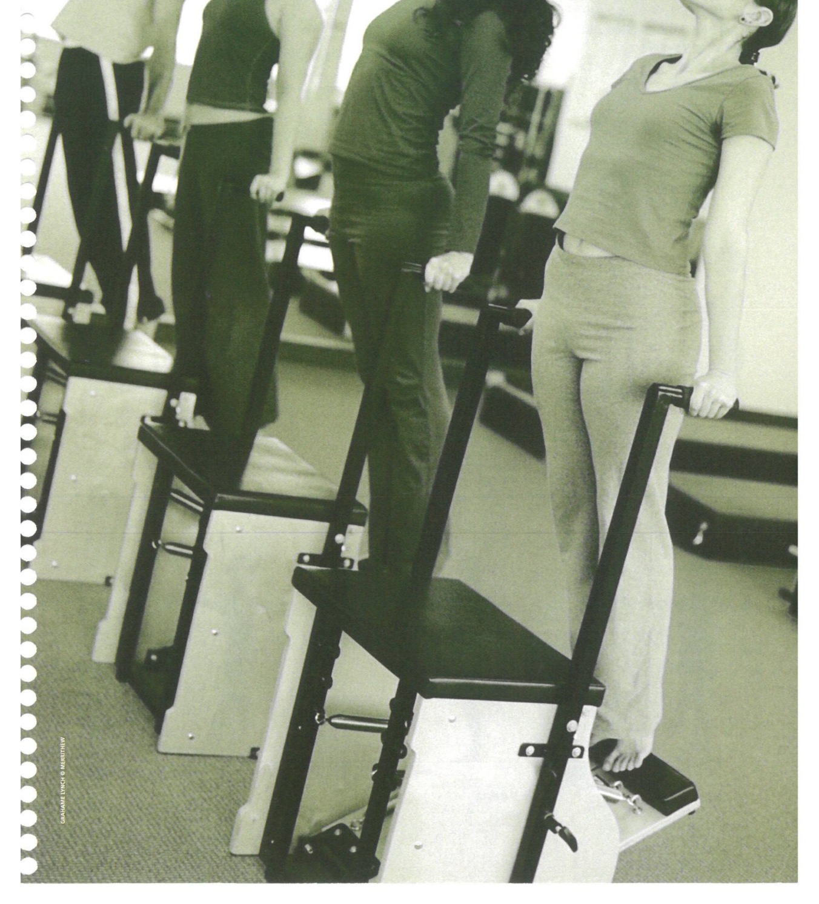

## 站立腿下壓練習 (STANDING LEG PRESS)

- 頁碼：p.44-45
- 難度：平衡椅
- 器械/章節：平衡椅
- 肌群分類：[[../muscles/chair-core-and-lumbopelvic-stability|核心與腰骨盆穩定]], [[../muscles/chair-spinal-articulation|脊椎活動]], [[../muscles/chair-scapular-stabilizers|肩胛與上背穩定]], [[../muscles/chair-arms-delts-pecs|手臂與胸肩]], [[../muscles/chair-hips-and-legs|髖與腿]], [[../muscles/chair-mobility-and-stretching|柔韌與伸展]]
- 摘要：站立腿下壓練習：主要歸入核心與腰骨盆穩定、脊椎活動、肩胛與上背穩定、手臂與胸肩。
- OCR 原文摘錄：目標肌肉：以腹橫肌擠壓腹部，穩定腰骨盆部位；以深層骨盆底 肌輔助腹橫肌運動；等長收縮腹斜肌和豎脊肌，以使軀幹保持中 立位；利用腹斜肌和多裂肌阻止身體旋轉；踏板上提時，離心收 縮股四頭肌和髖部伸展肌群，下壓踏板時，向心收縮上述肌肉； 肩胛骨穩定肌群 ［1］等長收縮臀大肌和胭繩肌，髖外展肌群和內收肌群，以使支撐 腿穩定支擰骨盆 ［2］等長收縮臀大肌，胭繩肌和髖外旋肌群，以使支撐腿穩定支 撐骨盆
- 動作圖：
  - 
  - 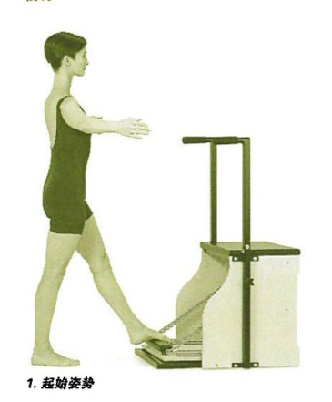
  - 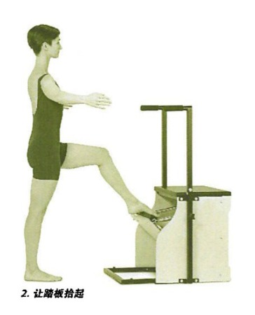
  - 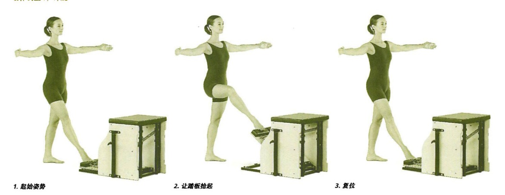
  - 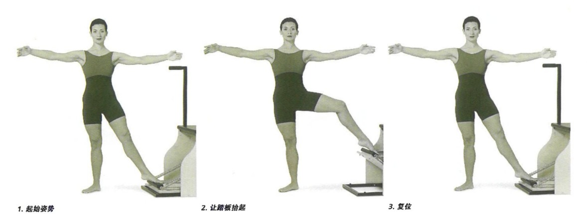

## 仰臥蛙跳姿 (FROG LYING FLAT)

- 頁碼：p.46-47
- 難度：平衡椅
- 器械/章節：平衡椅
- 肌群分類：[[../muscles/chair-core-and-lumbopelvic-stability|核心與腰骨盆穩定]], [[../muscles/chair-spinal-articulation|脊椎活動]], [[../muscles/chair-scapular-stabilizers|肩胛與上背穩定]], [[../muscles/chair-arms-delts-pecs|手臂與胸肩]], [[../muscles/chair-hips-and-legs|髖與腿]], [[../muscles/chair-mobility-and-stretching|柔韌與伸展]]
- 摘要：仰臥蛙跳姿：主要歸入核心與腰骨盆穩定、脊椎活動、肩胛與上背穩定、手臂與胸肩。
- OCR 原文摘錄：注意事項：將墊子豎放在椅子前面，一端頂住金屬底座，使起始 目標肌肉：以腹橫肌擠壓腹部，穩定腰骨盆部位；以深層骨盆底 姿勢更舒適。 肌輔助腹橫肌運動；下壓蹈板時，向心收縮髖外旋肌群，踏板復 位時，離心收縮上述肌肉；肩胛骨穩定肌群
- 動作圖：
  - 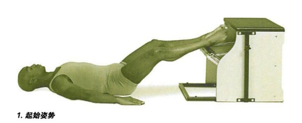
  - 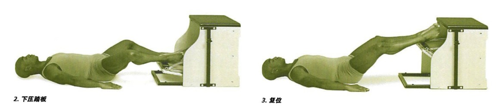
  - 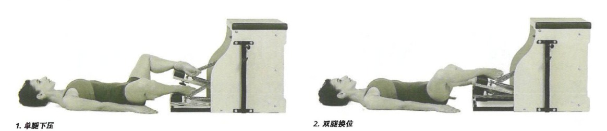

## 胭繩肌練習-髖部上提 (HAMSTRING PRESS HIPS UP)

- 頁碼：p.48-51
- 難度：平衡椅
- 器械/章節：平衡椅
- 肌群分類：[[../muscles/chair-core-and-lumbopelvic-stability|核心與腰骨盆穩定]], [[../muscles/chair-spinal-articulation|脊椎活動]], [[../muscles/chair-scapular-stabilizers|肩胛與上背穩定]], [[../muscles/chair-hips-and-legs|髖與腿]], [[../muscles/chair-mobility-and-stretching|柔韌與伸展]]
- 摘要：胭繩肌練習-髖部上提：主要歸入核心與腰骨盆穩定、脊椎活動、肩胛與上背穩定、髖與腿。
- OCR 原文摘錄：目標肌肉：以腹橫肌擠壓腹部，穩定腰骨盆部位；以深層骨盆底 肌輔助腹橫肌運動；向心收縮腹直肌和腹斜肌，以使脊椎彎曲， 並在脊椎回到中立位時，離心收縮上述肌肉；向心收縮臀大肌和 胭繩肌，以使骨盆上提，並保持上提著；下壓踏板時，向心收縮 胭繩肌，並在踏板復位時，離心收縮上述肌肉；肩胛骨穩定肌群
- 動作圖：
  - 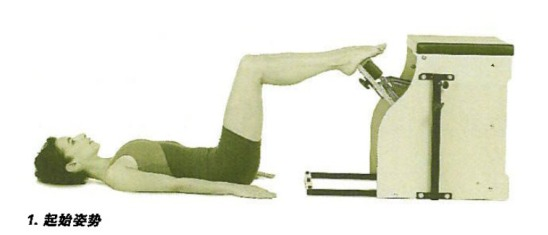
  - 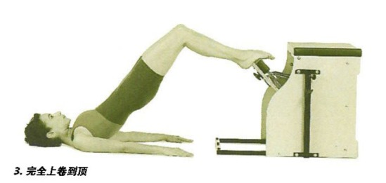
  - 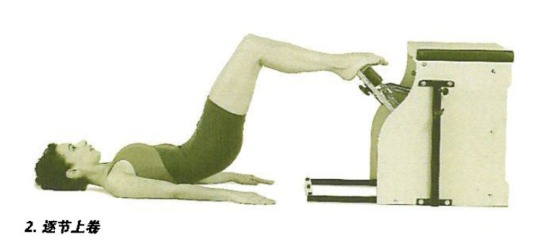
  - 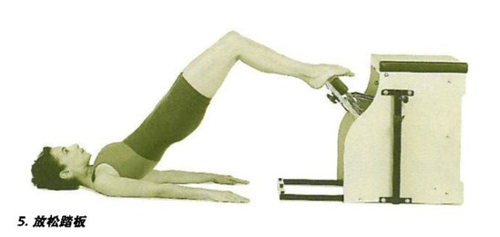
  - 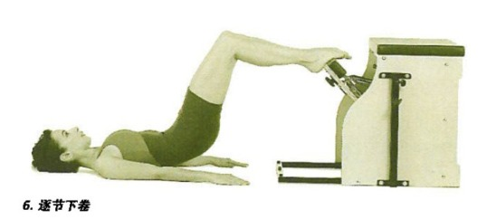
  - 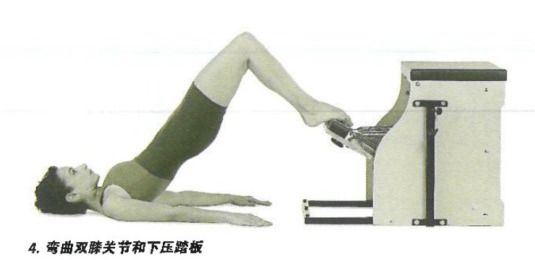
  - 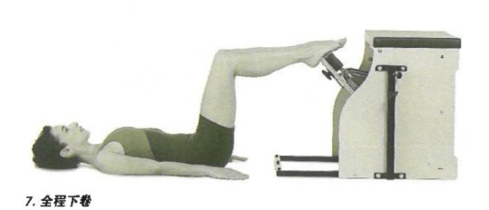
  - 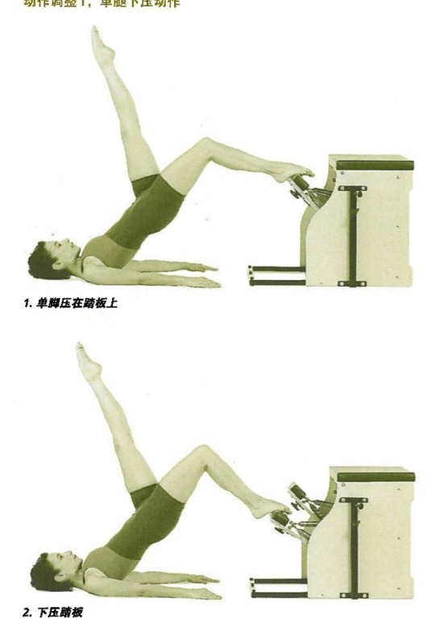
  - 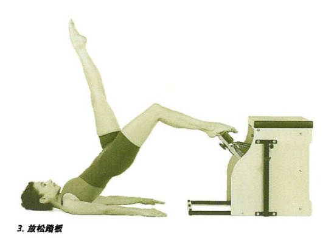
  - 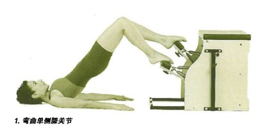
  - 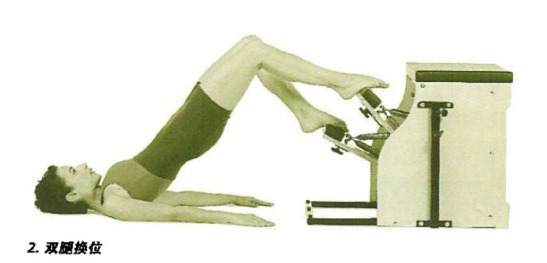
  - 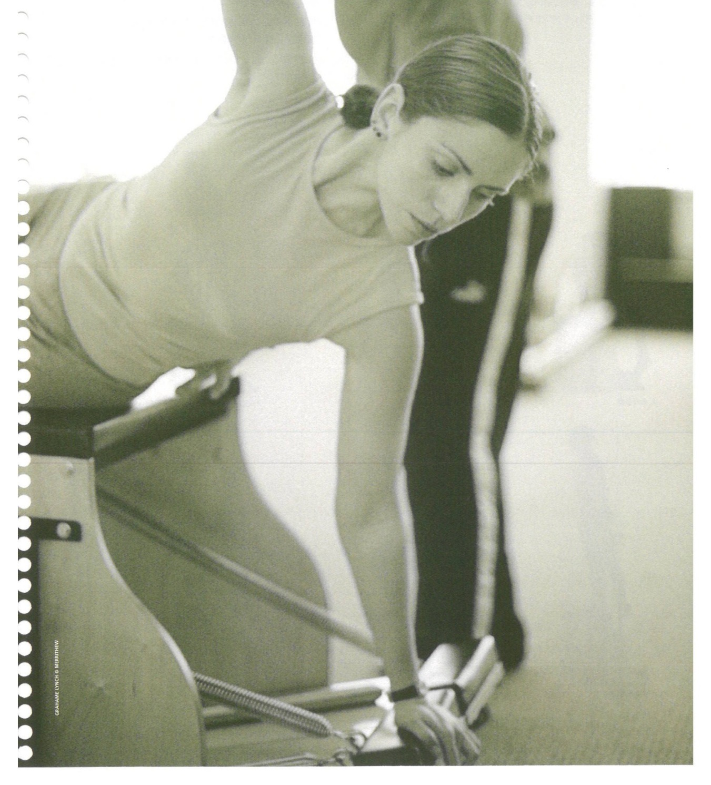

## 前向上階 (FORWARD STEP UP)

- 頁碼：p.52-53
- 難度：平衡椅
- 器械/章節：平衡椅
- 肌群分類：[[../muscles/chair-core-and-lumbopelvic-stability|核心與腰骨盆穩定]], [[../muscles/chair-spinal-articulation|脊椎活動]], [[../muscles/chair-scapular-stabilizers|肩胛與上背穩定]], [[../muscles/chair-arms-delts-pecs|手臂與胸肩]], [[../muscles/chair-hips-and-legs|髖與腿]], [[../muscles/chair-mobility-and-stretching|柔韌與伸展]]
- 摘要：前向上階：主要歸入核心與腰骨盆穩定、脊椎活動、肩胛與上背穩定、手臂與胸肩。
- 動作圖：
  - 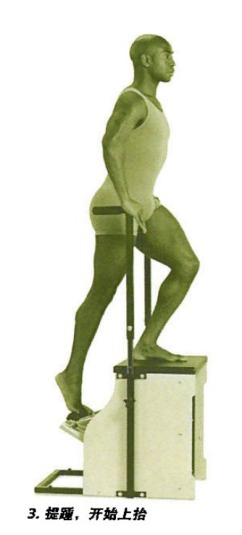
  - 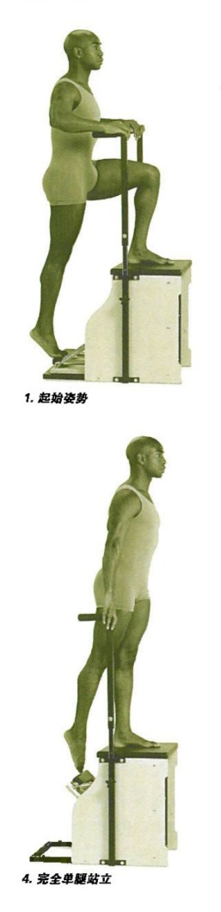
  - 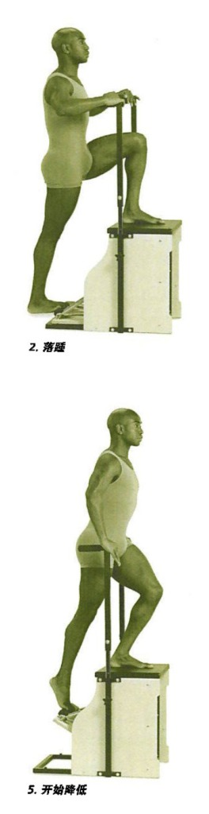
  - 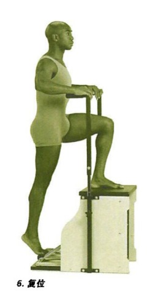
  - 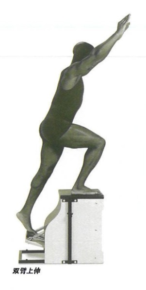

## 前向下階 (FORWARD STEP DOWN)

- 頁碼：p.54-55
- 難度：平衡椅
- 器械/章節：平衡椅
- 肌群分類：[[../muscles/chair-core-and-lumbopelvic-stability|核心與腰骨盆穩定]], [[../muscles/chair-spinal-articulation|脊椎活動]], [[../muscles/chair-scapular-stabilizers|肩胛與上背穩定]], [[../muscles/chair-arms-delts-pecs|手臂與胸肩]], [[../muscles/chair-hips-and-legs|髖與腿]], [[../muscles/chair-mobility-and-stretching|柔韌與伸展]]
- 摘要：前向下階：主要歸入核心與腰骨盆穩定、脊椎活動、肩胛與上背穩定、手臂與胸肩。
- 動作圖：
  - 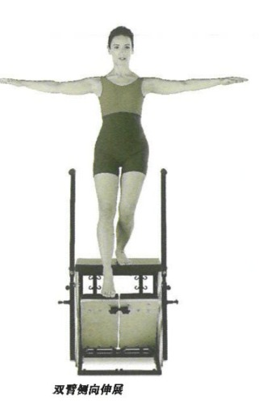

## 側向下階 (SIDE STEP DOWN)

- 頁碼：p.56-57
- 難度：平衡椅
- 器械/章節：平衡椅
- 肌群分類：[[../muscles/chair-core-and-lumbopelvic-stability|核心與腰骨盆穩定]], [[../muscles/chair-spinal-articulation|脊椎活動]], [[../muscles/chair-scapular-stabilizers|肩胛與上背穩定]], [[../muscles/chair-arms-delts-pecs|手臂與胸肩]], [[../muscles/chair-hips-and-legs|髖與腿]], [[../muscles/chair-mobility-and-stretching|柔韌與伸展]]
- 摘要：側向下階：主要歸入核心與腰骨盆穩定、脊椎活動、肩胛與上背穩定、手臂與胸肩。
- OCR 原文摘錄：目標肌肉：以腹橫肌擠壓腹部，穩定腰骨盆部位；以深層骨盆底 肌輔助腹橫肌運動；等長收縮腹斜肌和豎脊肌，以使軀幹保持中 立位；利用腹斜肌和多裂肌阻止身體旋轉；等長收縮支撐腿的股 四頭肌，以使穩定姿勢；離心收縮動作腿的股四頭肌，以使膝部 彎曲，並在膝部伸展時，向心收縮上述肌肉；利用外旋肌群，以 保持兩側髖部外旋；肩胛骨穩定肌群

## 後向下階 (BACKWARD STEP DOWN)

- 頁碼：p.58-59
- 難度：平衡椅
- 器械/章節：平衡椅
- 肌群分類：[[../muscles/chair-core-and-lumbopelvic-stability|核心與腰骨盆穩定]], [[../muscles/chair-spinal-articulation|脊椎活動]], [[../muscles/chair-scapular-stabilizers|肩胛與上背穩定]], [[../muscles/chair-arms-delts-pecs|手臂與胸肩]], [[../muscles/chair-hips-and-legs|髖與腿]], [[../muscles/chair-mobility-and-stretching|柔韌與伸展]]
- 摘要：後向下階：主要歸入核心與腰骨盆穩定、脊椎活動、肩胛與上背穩定、手臂與胸肩。
- OCR 原文摘錄：目標肌肉：以腹橫肌擠壓腹部，穩定腰骨盆部位；以深層骨盆底 肌輔助腹橫肌運動；等長收縮腹斜肌和豎脊肌，以使軀幹保持中 立位：利用腹斜肌和多裂肌阻止身體旋轉；利用外旋肌群和髖外 展肌群，防止平衡椅的腿的髖部下沉，或膝部內旋；等長收縮支 撐腿的股四頭肌，以使穩定姿勢；離心收縮動作腿的股四頭肌， 以使膝部彎曲，並在膝部伸展時，向心收縮上述肌肉；肩胛骨穩 定肌群
- 動作圖：
  - 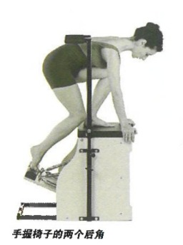

## 側向上階 (SIDE STEP UP)

- 頁碼：p.60-62
- 難度：平衡椅
- 器械/章節：平衡椅
- 肌群分類：[[../muscles/chair-core-and-lumbopelvic-stability|核心與腰骨盆穩定]], [[../muscles/chair-spinal-articulation|脊椎活動]], [[../muscles/chair-scapular-stabilizers|肩胛與上背穩定]], [[../muscles/chair-arms-delts-pecs|手臂與胸肩]], [[../muscles/chair-hips-and-legs|髖與腿]], [[../muscles/chair-mobility-and-stretching|柔韌與伸展]]
- 摘要：側向上階：主要歸入核心與腰骨盆穩定、脊椎活動、肩胛與上背穩定、手臂與胸肩。
- 動作圖：
  - 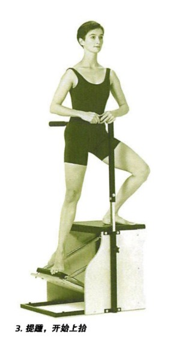
  - 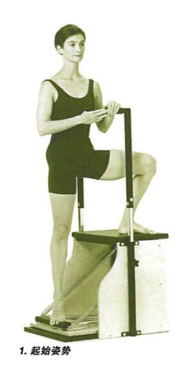
  - 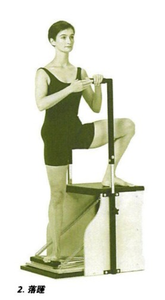
  - 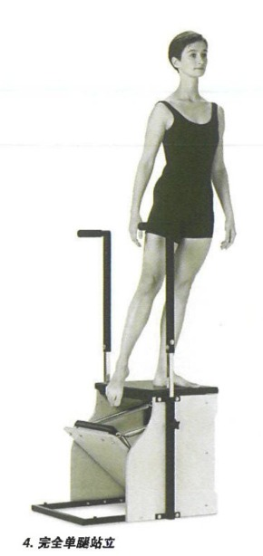
  - 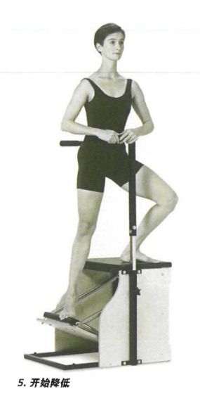
  - 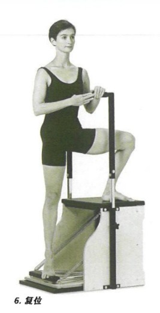
  - 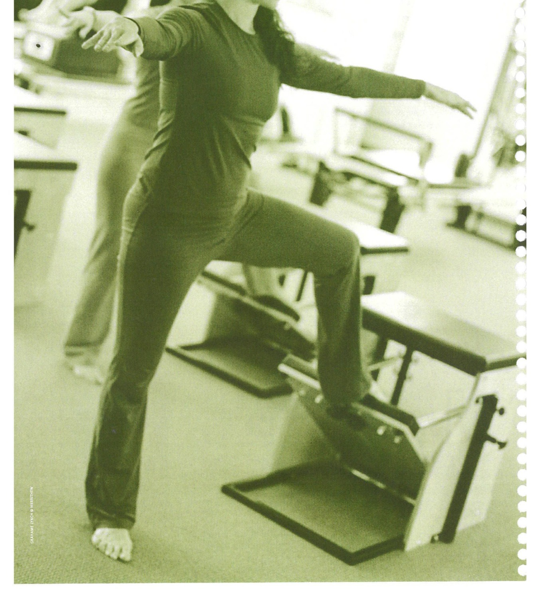

## 膝部上提 (KNEE RAISES)

- 頁碼：p.63-65
- 難度：平衡椅
- 器械/章節：平衡椅
- 肌群分類：[[../muscles/chair-core-and-lumbopelvic-stability|核心與腰骨盆穩定]], [[../muscles/chair-spinal-articulation|脊椎活動]], [[../muscles/chair-scapular-stabilizers|肩胛與上背穩定]], [[../muscles/chair-lat-teres-pulling-chain|背闊肌與拉力鏈]], [[../muscles/chair-arms-delts-pecs|手臂與胸肩]], [[../muscles/chair-hips-and-legs|髖與腿]], [[../muscles/chair-mobility-and-stretching|柔韌與伸展]]
- 摘要：膝部上提：主要歸入核心與腰骨盆穩定、脊椎活動、肩胛與上背穩定、背闊肌與拉力鏈。
- 動作圖：
  - 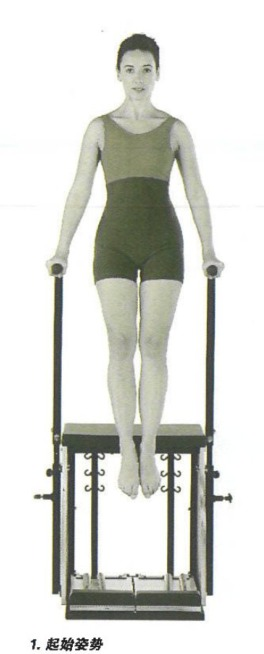
  - 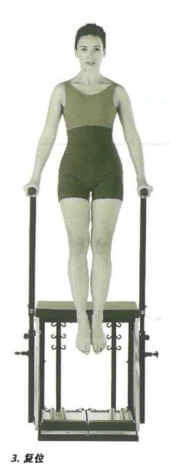
  - 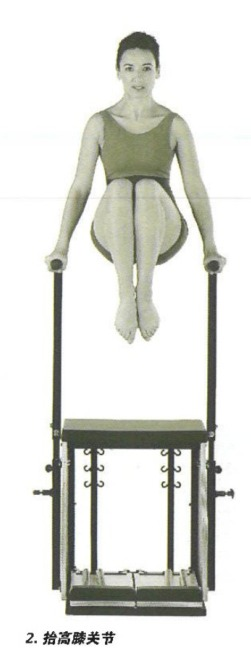
  - 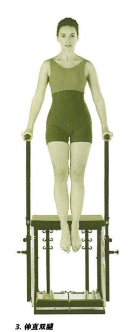
  - 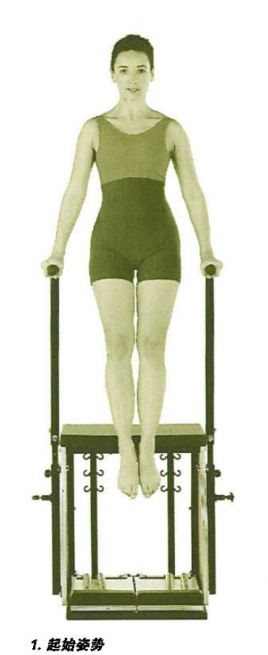
  - 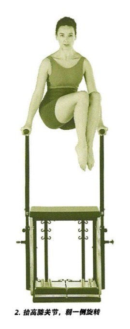
  - 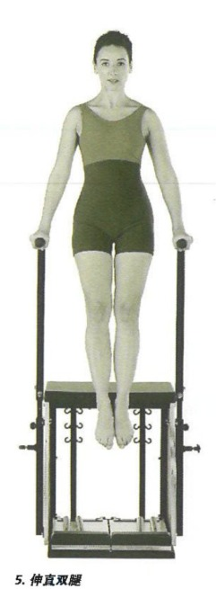
  - 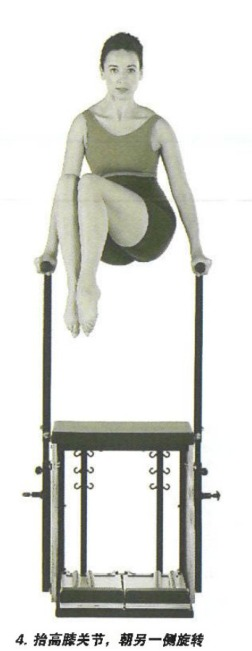

## 雙腿畫弧 (LEG CIRCLES)

- 頁碼：p.66-67
- 難度：平衡椅
- 器械/章節：平衡椅
- 肌群分類：[[../muscles/chair-core-and-lumbopelvic-stability|核心與腰骨盆穩定]], [[../muscles/chair-spinal-articulation|脊椎活動]], [[../muscles/chair-scapular-stabilizers|肩胛與上背穩定]], [[../muscles/chair-lat-teres-pulling-chain|背闊肌與拉力鏈]], [[../muscles/chair-arms-delts-pecs|手臂與胸肩]], [[../muscles/chair-hips-and-legs|髖與腿]], [[../muscles/chair-mobility-and-stretching|柔韌與伸展]]
- 摘要：雙腿畫弧：主要歸入核心與腰骨盆穩定、脊椎活動、肩胛與上背穩定、背闊肌與拉力鏈。
- 動作圖：
  - 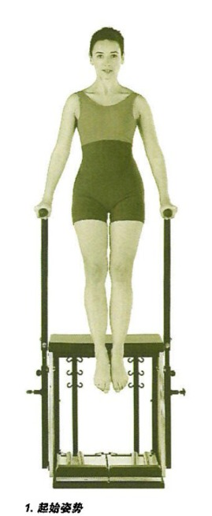
  - 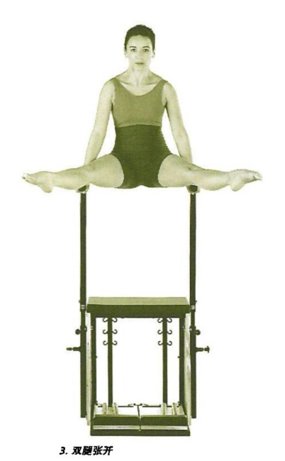
  - 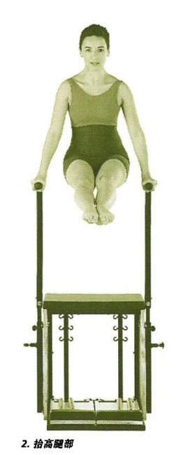
  - 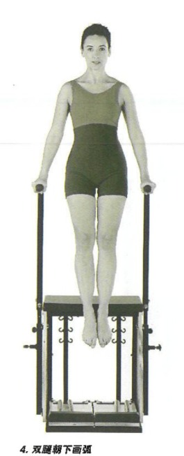

## 拍擊 (BEATS)

- 頁碼：p.68-69
- 難度：平衡椅
- 器械/章節：平衡椅
- 肌群分類：[[../muscles/chair-core-and-lumbopelvic-stability|核心與腰骨盆穩定]], [[../muscles/chair-spinal-articulation|脊椎活動]], [[../muscles/chair-scapular-stabilizers|肩胛與上背穩定]], [[../muscles/chair-lat-teres-pulling-chain|背闊肌與拉力鏈]], [[../muscles/chair-arms-delts-pecs|手臂與胸肩]], [[../muscles/chair-hips-and-legs|髖與腿]], [[../muscles/chair-mobility-and-stretching|柔韌與伸展]]
- 摘要：拍擊：主要歸入核心與腰骨盆穩定、脊椎活動、肩胛與上背穩定、背闊肌與拉力鏈。
- 動作圖：
  - 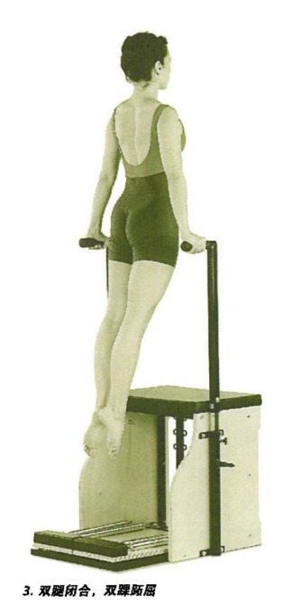
  - 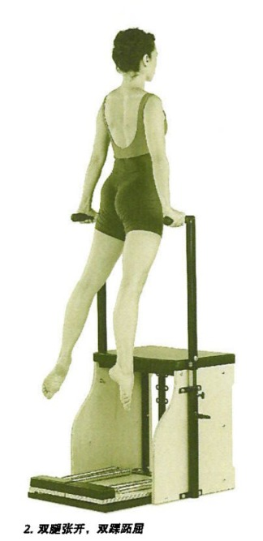
  - 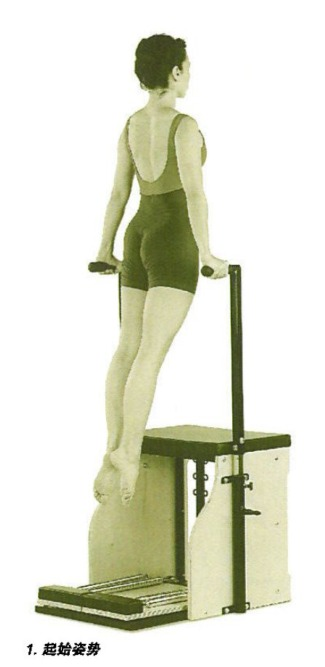
  - 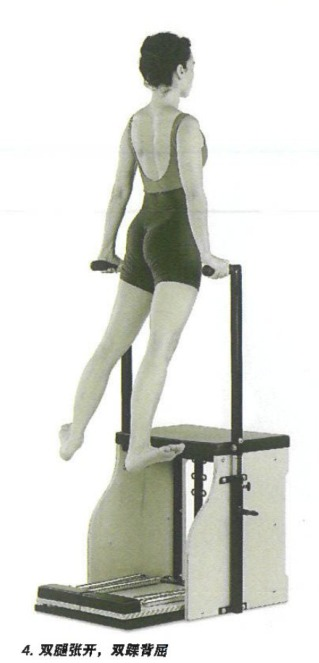
  - 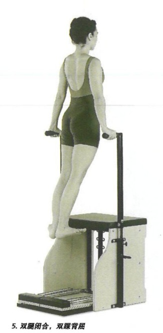
  - 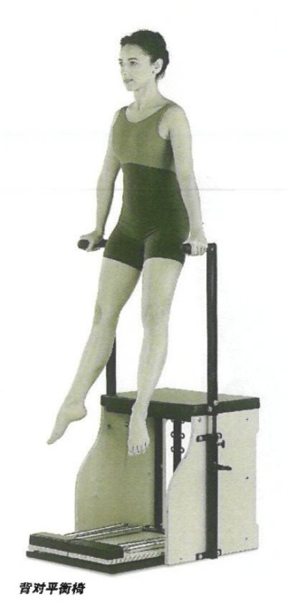

## 蛙跳姿- 前向 (FROG FRONT)

- 頁碼：p.70-71
- 難度：平衡椅
- 器械/章節：平衡椅
- 肌群分類：[[../muscles/chair-core-and-lumbopelvic-stability|核心與腰骨盆穩定]], [[../muscles/chair-spinal-articulation|脊椎活動]], [[../muscles/chair-scapular-stabilizers|肩胛與上背穩定]], [[../muscles/chair-arms-delts-pecs|手臂與胸肩]], [[../muscles/chair-hips-and-legs|髖與腿]], [[../muscles/chair-mobility-and-stretching|柔韌與伸展]]
- 摘要：蛙跳姿- 前向：主要歸入核心與腰骨盆穩定、脊椎活動、肩胛與上背穩定、手臂與胸肩。
- OCR 原文摘錄：日標肌肉：以腹橫肌擠壓腹部，穩定腰骨盆部位；以深層骨盆底 肌輔助腹橫肌運動；等長收縮腹斜肌和豎脊肌，以使軀幹保持中 立位：利用外旋肌群保持髖部外旋：下壓踏板時，向心收縮髖部 伸展肌群，髖內收肌群和股四頭肌，踏板上提時，離心收縮上述 肌肉；向心收縮髖屈肌群和胭繩肌，以使髖和膝部彎曲；肩胛骨 穩定肌群，尤其是前鋸肌
- 動作圖：
  - 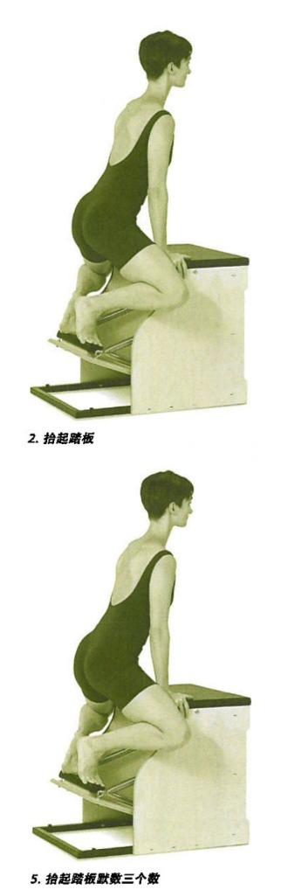
  - 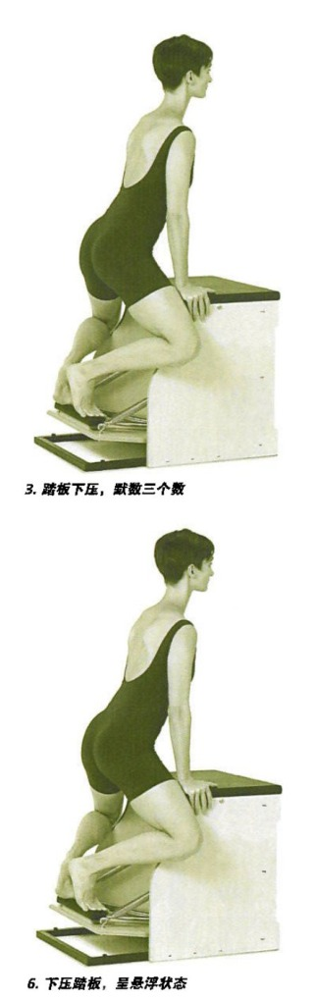
  - 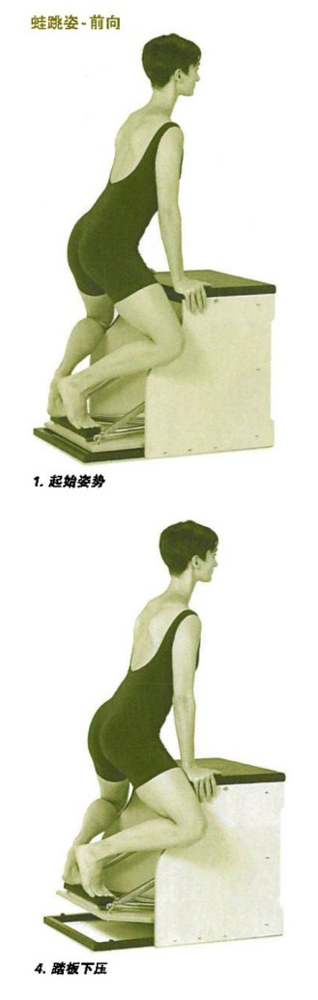
  - 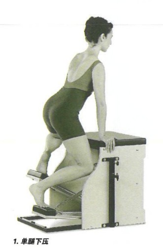
  - 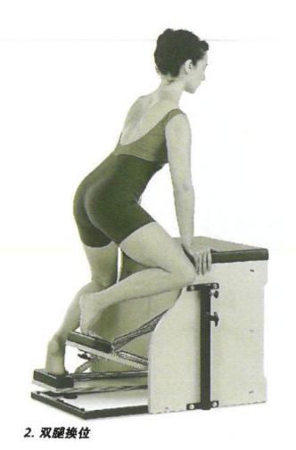

## 蛙跳姿-後向 (FROG BACK)

- 頁碼：p.72-76
- 難度：平衡椅
- 器械/章節：平衡椅
- 肌群分類：[[../muscles/chair-core-and-lumbopelvic-stability|核心與腰骨盆穩定]], [[../muscles/chair-spinal-articulation|脊椎活動]], [[../muscles/chair-scapular-stabilizers|肩胛與上背穩定]], [[../muscles/chair-lat-teres-pulling-chain|背闊肌與拉力鏈]], [[../muscles/chair-arms-delts-pecs|手臂與胸肩]], [[../muscles/chair-hips-and-legs|髖與腿]], [[../muscles/chair-mobility-and-stretching|柔韌與伸展]]
- 摘要：蛙跳姿-後向：主要歸入核心與腰骨盆穩定、脊椎活動、肩胛與上背穩定、背闊肌與拉力鏈。
- OCR 原文摘錄：目標肌肉：以腹橫肌擠壓腹部，穩定腰骨盆部位；以深層骨盆底 肌輔助腹橫肌運動；等長收縮腹斜肌和豎脊肌，以使軀幹保持穩 定；利用外旋肌群保持髖部外旋；下壓踏板時，向心收縮髖部伸 展肌群，髖內收肌群和股四頭肌，踏板上提時，離心收縮上述肌肉； 向心收縮腕屈肌群和胭繩肌，以使髖和膝部彎曲：肩胛骨穩定肌 群，尤其是下斜方肌
- 動作圖：
  - 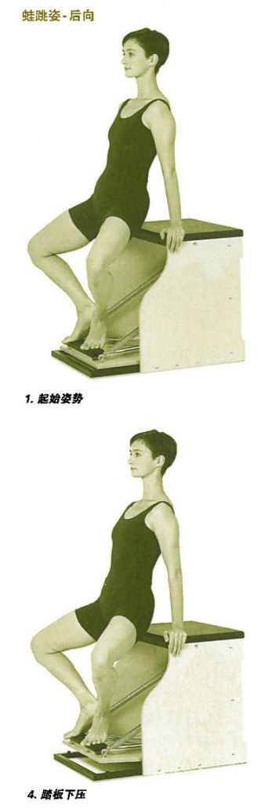
  - 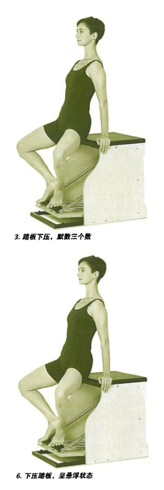
  - 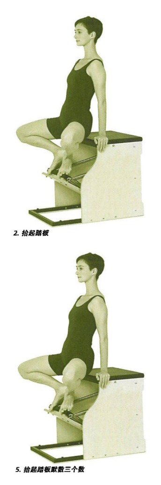
  - 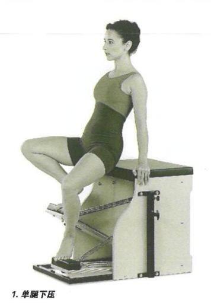
  - 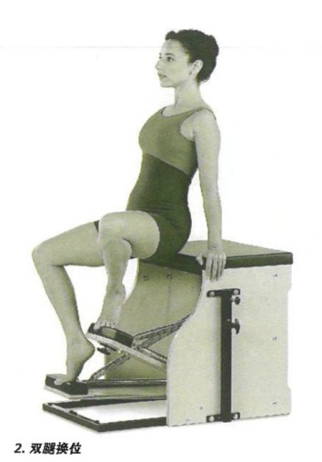
  - 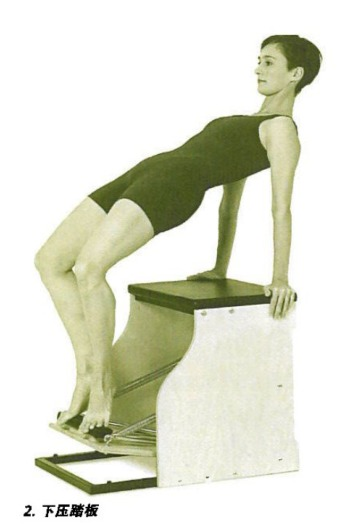
  - 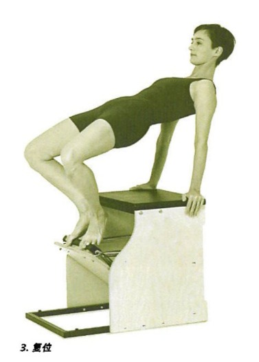
  - 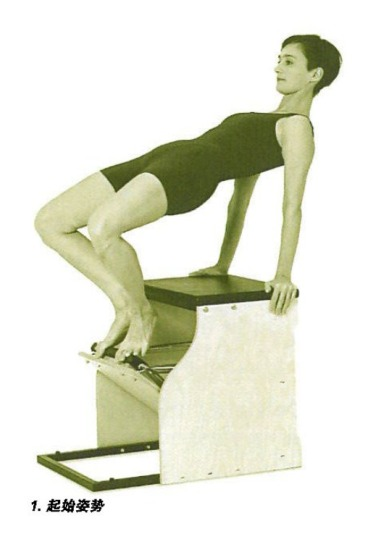
  - 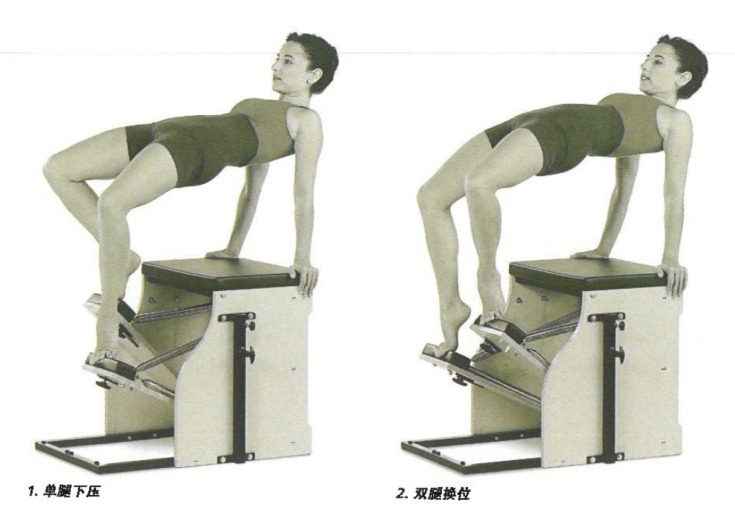
  - 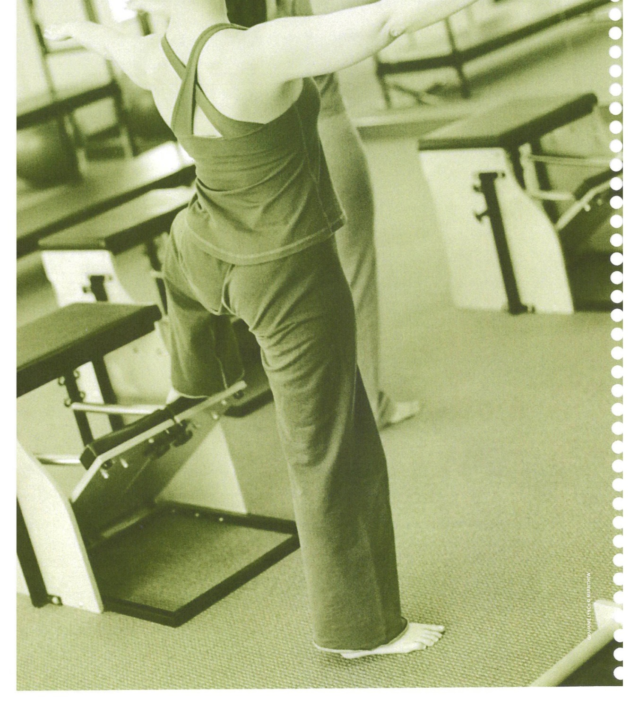

## 側腿上抬 (SIDE LEG EXTENSION)

- 頁碼：p.77-79
- 難度：平衡椅
- 器械/章節：平衡椅
- 肌群分類：[[../muscles/chair-core-and-lumbopelvic-stability|核心與腰骨盆穩定]], [[../muscles/chair-spinal-articulation|脊椎活動]], [[../muscles/chair-scapular-stabilizers|肩胛與上背穩定]], [[../muscles/chair-arms-delts-pecs|手臂與胸肩]], [[../muscles/chair-hips-and-legs|髖與腿]], [[../muscles/chair-mobility-and-stretching|柔韌與伸展]]
- 摘要：側腿上抬：主要歸入核心與腰骨盆穩定、脊椎活動、肩胛與上背穩定、手臂與胸肩。
- 動作圖：
  - 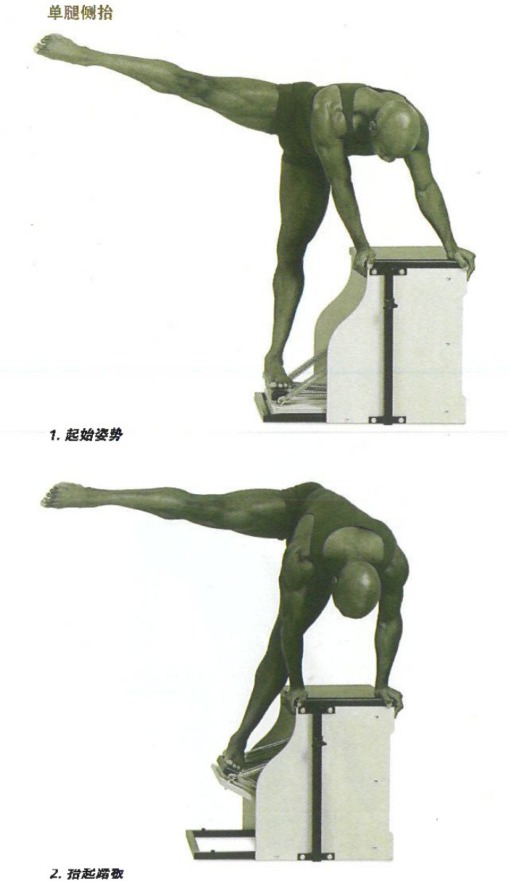
  - 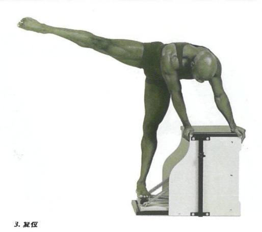
  - 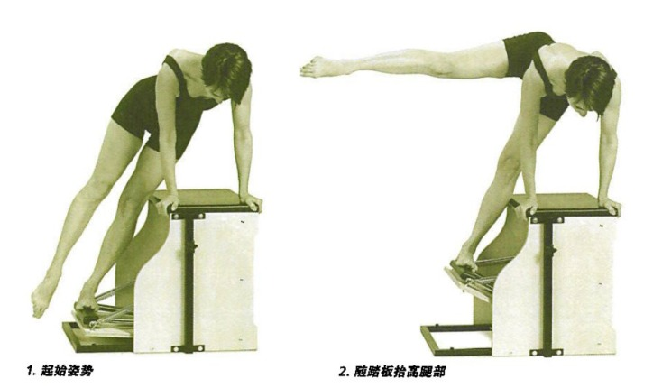
  - 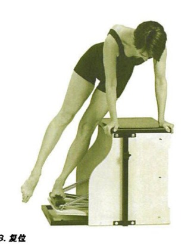
  - 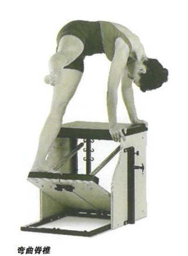
  - 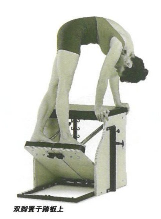

## 俯臥肩胛骨孤立練習 (SCAPULA ISOLATION PRONE)

- 頁碼：p.80-81
- 難度：平衡椅
- 器械/章節：平衡椅
- 肌群分類：[[../muscles/chair-core-and-lumbopelvic-stability|核心與腰骨盆穩定]], [[../muscles/chair-spinal-articulation|脊椎活動]], [[../muscles/chair-scapular-stabilizers|肩胛與上背穩定]], [[../muscles/chair-arms-delts-pecs|手臂與胸肩]], [[../muscles/chair-hips-and-legs|髖與腿]], [[../muscles/chair-mobility-and-stretching|柔韌與伸展]]
- 摘要：俯臥肩胛骨孤立練習：主要歸入核心與腰骨盆穩定、脊椎活動、肩胛與上背穩定、手臂與胸肩。
- 動作圖：
  - 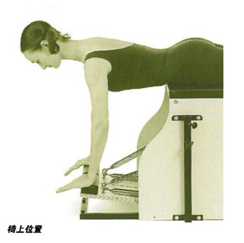
  - 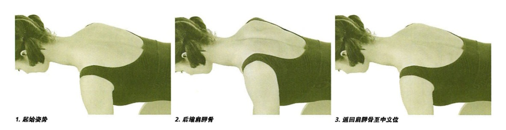
  - 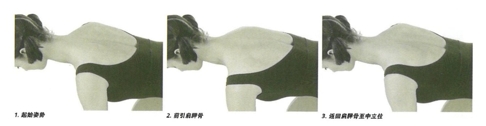

## 俯臥單臂下壓練習 (ONE ARM PUSH PRONE)

- 頁碼：p.82-83
- 難度：平衡椅
- 器械/章節：平衡椅
- 肌群分類：[[../muscles/chair-core-and-lumbopelvic-stability|核心與腰骨盆穩定]], [[../muscles/chair-spinal-articulation|脊椎活動]], [[../muscles/chair-scapular-stabilizers|肩胛與上背穩定]], [[../muscles/chair-arms-delts-pecs|手臂與胸肩]], [[../muscles/chair-hips-and-legs|髖與腿]], [[../muscles/chair-mobility-and-stretching|柔韌與伸展]]
- 摘要：俯臥單臂下壓練習：主要歸入核心與腰骨盆穩定、脊椎活動、肩胛與上背穩定、手臂與胸肩。
- 動作圖：
  - 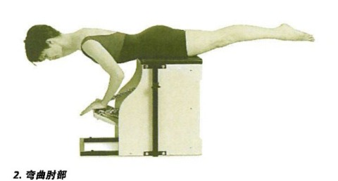
  - 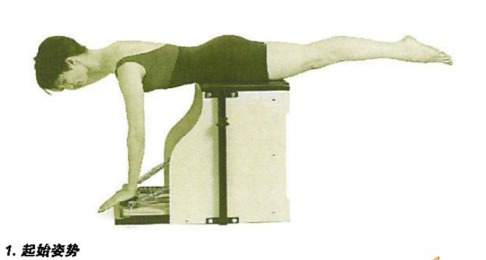
  - 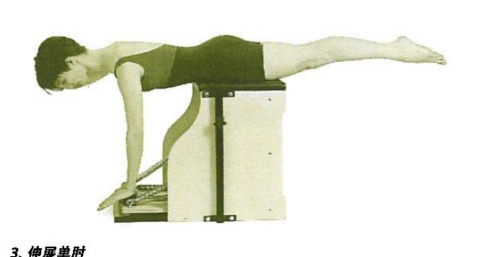
  - 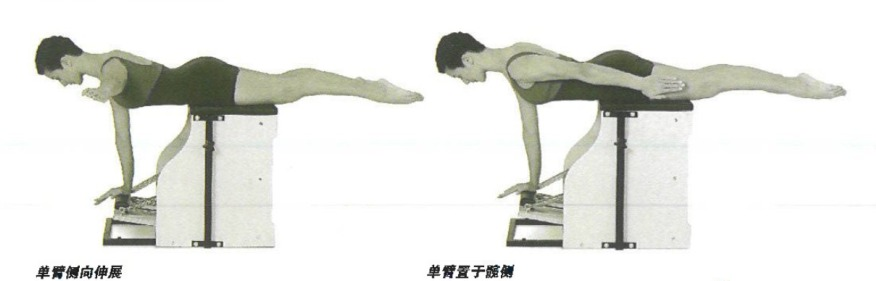
  - 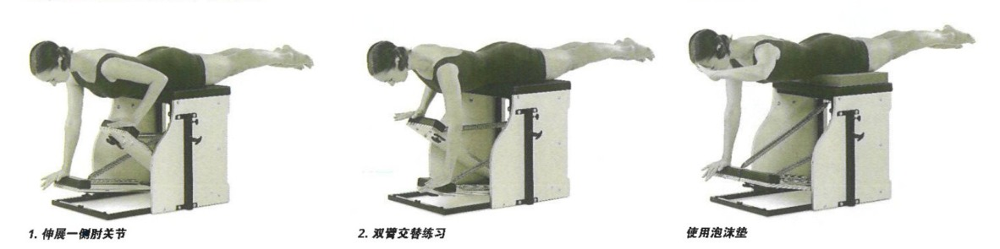

## 肱三頭肌下壓坐姿練習 (TRICEPS PRESS SITTING)

- 頁碼：p.84-85
- 難度：平衡椅
- 器械/章節：平衡椅
- 肌群分類：[[../muscles/chair-core-and-lumbopelvic-stability|核心與腰骨盆穩定]], [[../muscles/chair-spinal-articulation|脊椎活動]], [[../muscles/chair-scapular-stabilizers|肩胛與上背穩定]], [[../muscles/chair-arms-delts-pecs|手臂與胸肩]], [[../muscles/chair-hips-and-legs|髖與腿]], [[../muscles/chair-mobility-and-stretching|柔韌與伸展]]
- 摘要：肱三頭肌下壓坐姿練習：主要歸入核心與腰骨盆穩定、脊椎活動、肩胛與上背穩定、手臂與胸肩。
- OCR 原文摘錄：注意喜項：將墊子豎放在椅子前面，一端項住金屬底座，使起始 目標肌肉：以腹橫肌擠壓腹部，穩定腰骨盆部位；以深層骨盆底 姿勢更舒適。 肌輔助腹橫肌運動；等長收縮腹斜肌和豎脊肌，以使軀幹保持中 立位：踏板上提時，離心收縮肱三頭肌，下壓踏板時，向心收縮
- 動作圖：
  - 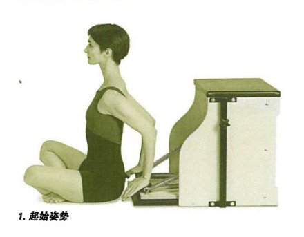
  - 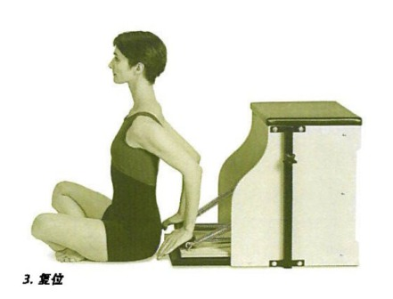
  - 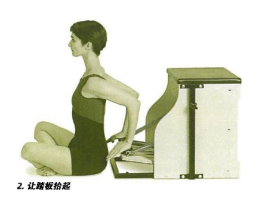
  - 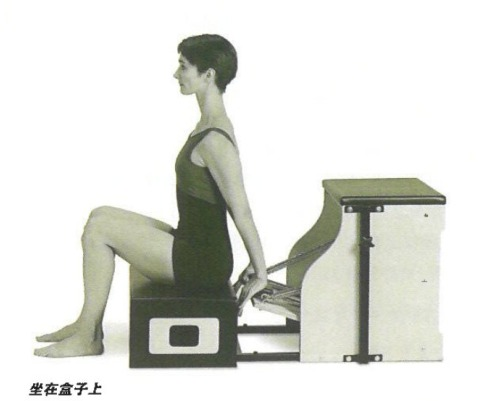
  - 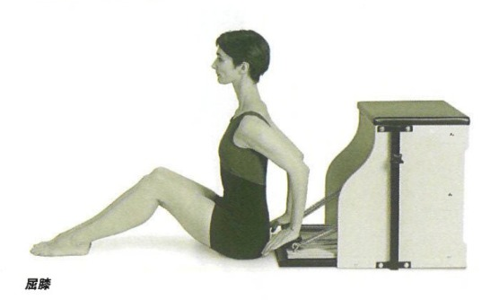
  - 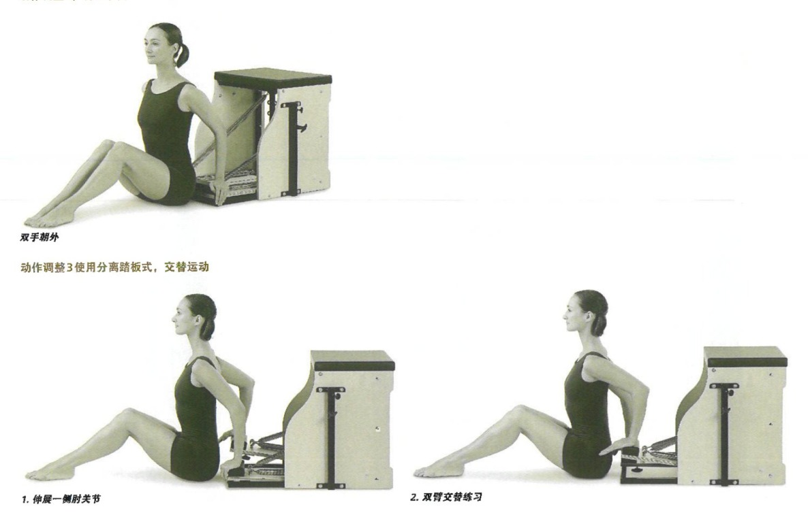

## 站立肩胛骨孤立練習 (SCAPULA ISOLATION STANDING)

- 頁碼：p.86-87
- 難度：平衡椅
- 器械/章節：平衡椅
- 肌群分類：[[../muscles/chair-core-and-lumbopelvic-stability|核心與腰骨盆穩定]], [[../muscles/chair-spinal-articulation|脊椎活動]], [[../muscles/chair-scapular-stabilizers|肩胛與上背穩定]], [[../muscles/chair-lat-teres-pulling-chain|背闊肌與拉力鏈]], [[../muscles/chair-arms-delts-pecs|手臂與胸肩]], [[../muscles/chair-hips-and-legs|髖與腿]], [[../muscles/chair-mobility-and-stretching|柔韌與伸展]]
- 摘要：站立肩胛骨孤立練習：主要歸入核心與腰骨盆穩定、脊椎活動、肩胛與上背穩定、背闊肌與拉力鏈。
- OCR 原文摘錄：目標肌肉：以腹橫肌擠壓腹部，穩定腰骨盆部位；以深層骨盆底 肌輔助腹橫肌運動；等長收縮臀大肌，胭繩肌和髖內收肌群，以 使大腿骨穩定支撐骨盆：等長收縮腹斜肌和豎脊肌，以使軀幹保 持中立位；離心收縮背闊肌，以使肩胛帶上提，並在肩胛帶下沉時， 向心收縮上述肌肉；肩胛骨穩定肌群，尤其下斜方肌
- 動作圖：
  - 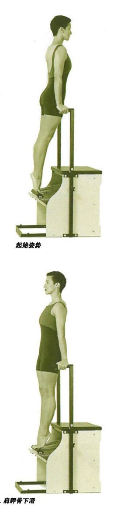
  - 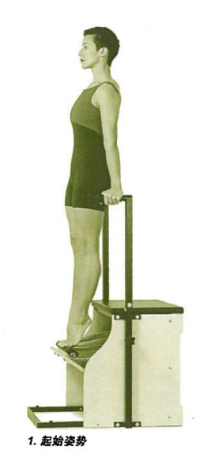
  - 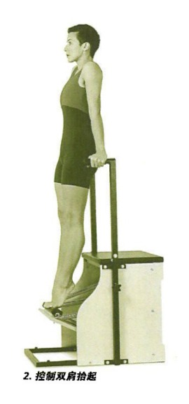
  - 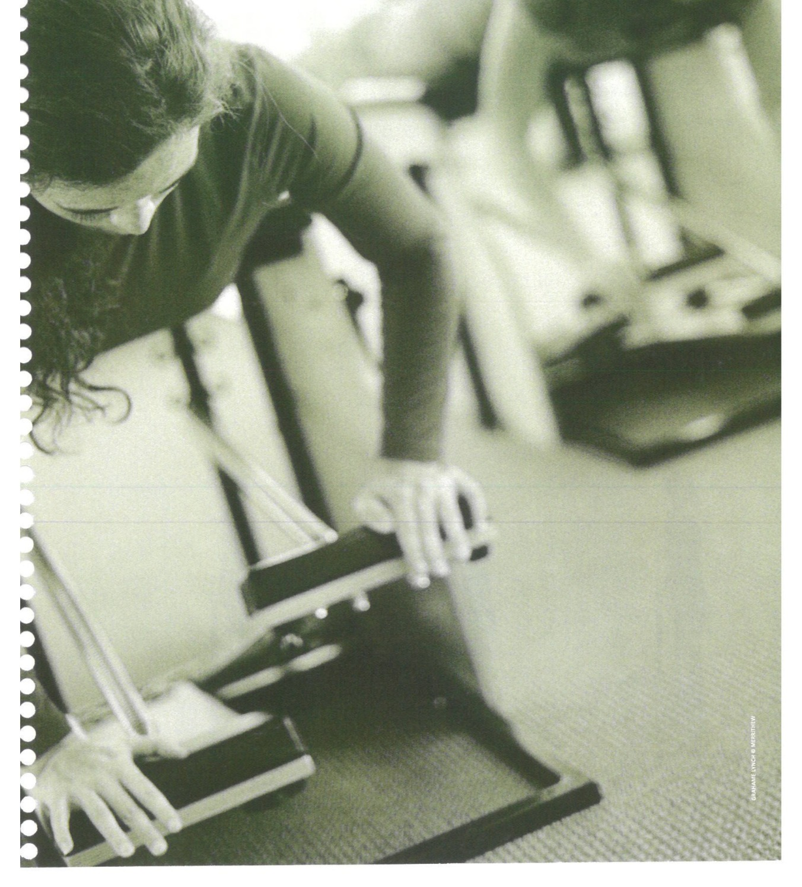

## 肱三頭肌下壓站姿練習 (TRICEPS PRESS STANDING)

- 頁碼：p.88-89
- 難度：平衡椅
- 器械/章節：平衡椅
- 肌群分類：[[../muscles/chair-core-and-lumbopelvic-stability|核心與腰骨盆穩定]], [[../muscles/chair-spinal-articulation|脊椎活動]], [[../muscles/chair-scapular-stabilizers|肩胛與上背穩定]], [[../muscles/chair-lat-teres-pulling-chain|背闊肌與拉力鏈]], [[../muscles/chair-arms-delts-pecs|手臂與胸肩]], [[../muscles/chair-hips-and-legs|髖與腿]], [[../muscles/chair-mobility-and-stretching|柔韌與伸展]]
- 摘要：肱三頭肌下壓站姿練習：主要歸入核心與腰骨盆穩定、脊椎活動、肩胛與上背穩定、背闊肌與拉力鏈。
- 動作圖：
  - 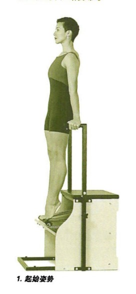
  - 
  - 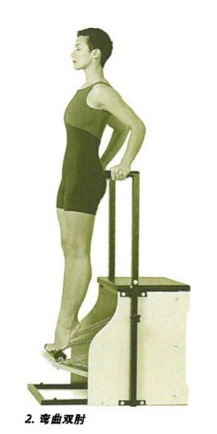
  - 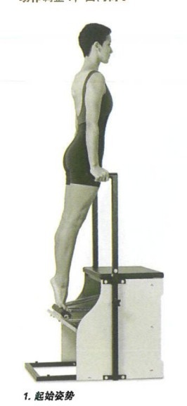
  - 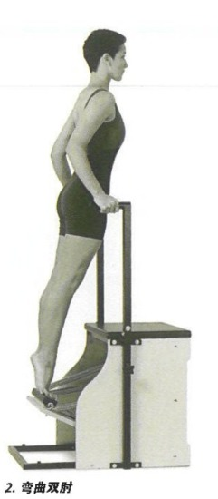

## 跪姿單臂練習 (ONE ARM PREP HAND ON FLOOR)

- 頁碼：p.90-91
- 難度：平衡椅
- 器械/章節：平衡椅
- 肌群分類：[[../muscles/chair-core-and-lumbopelvic-stability|核心與腰骨盆穩定]], [[../muscles/chair-spinal-articulation|脊椎活動]], [[../muscles/chair-scapular-stabilizers|肩胛與上背穩定]], [[../muscles/chair-arms-delts-pecs|手臂與胸肩]], [[../muscles/chair-hips-and-legs|髖與腿]], [[../muscles/chair-mobility-and-stretching|柔韌與伸展]]
- 摘要：跪姿單臂練習：主要歸入核心與腰骨盆穩定、脊椎活動、肩胛與上背穩定、手臂與胸肩。
- 動作圖：
  - 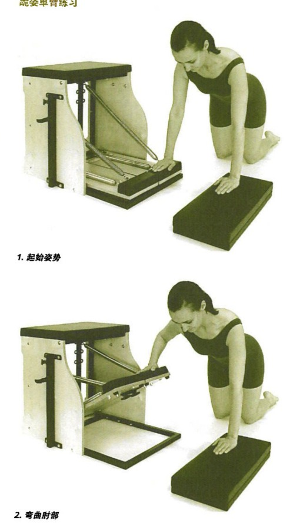
  - 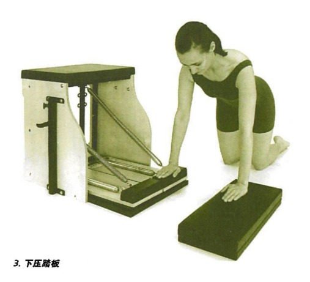
  - 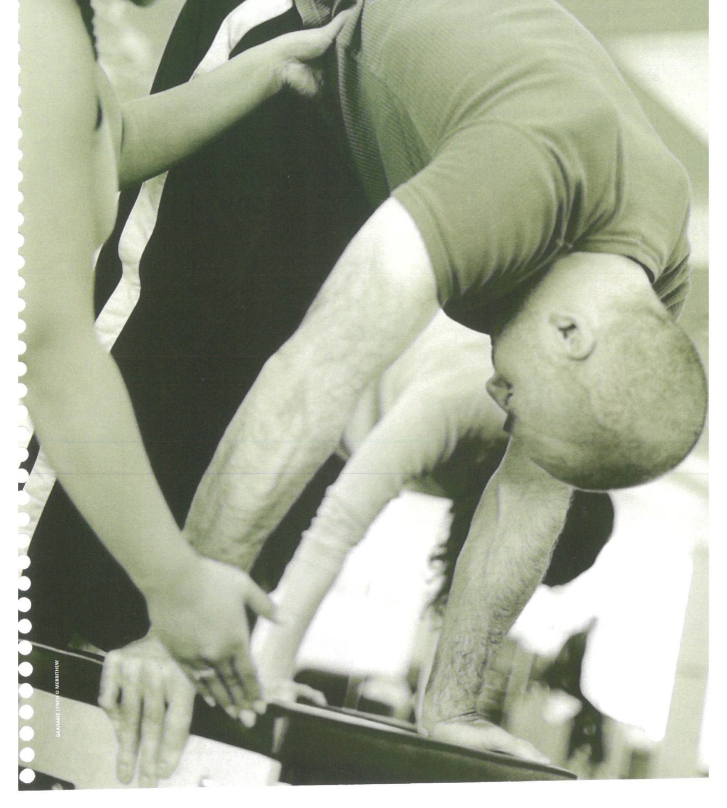

## 地面俯臥撐單臂練習 (ONE ARM PUSH HAND ON FLOOR)

- 頁碼：p.92-93
- 難度：平衡椅
- 器械/章節：平衡椅
- 肌群分類：[[../muscles/chair-core-and-lumbopelvic-stability|核心與腰骨盆穩定]], [[../muscles/chair-spinal-articulation|脊椎活動]], [[../muscles/chair-scapular-stabilizers|肩胛與上背穩定]], [[../muscles/chair-arms-delts-pecs|手臂與胸肩]], [[../muscles/chair-hips-and-legs|髖與腿]], [[../muscles/chair-mobility-and-stretching|柔韌與伸展]]
- 摘要：地面俯臥撐單臂練習：主要歸入核心與腰骨盆穩定、脊椎活動、肩胛與上背穩定、手臂與胸肩。
- 動作圖：
  - 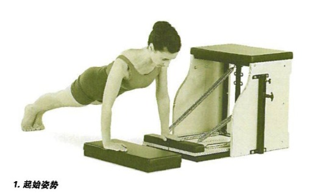
  - 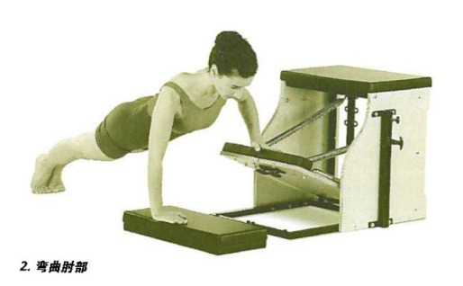
  - 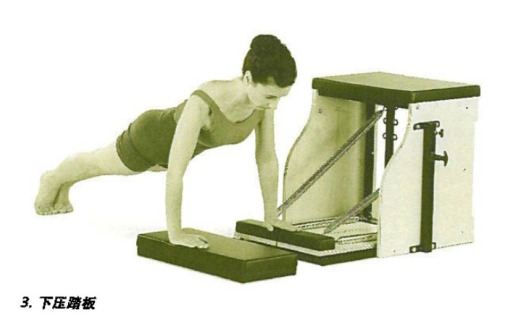
  - 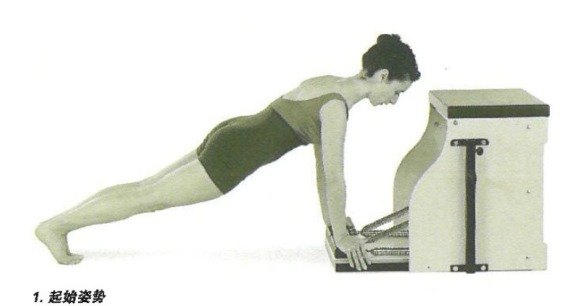
  - 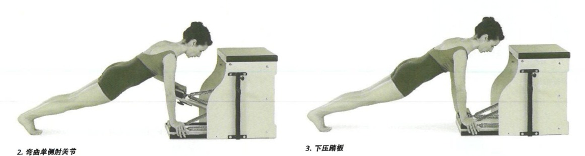
  - 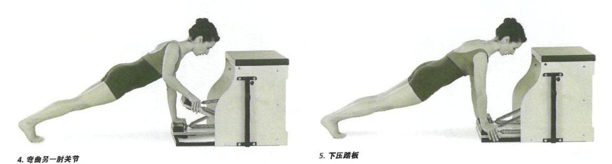

## 椅上俯臥撐單臂練習 (ONE ARM PUSH HAND ON CHAIR)

- 頁碼：p.94-95
- 難度：平衡椅
- 器械/章節：平衡椅
- 肌群分類：[[../muscles/chair-core-and-lumbopelvic-stability|核心與腰骨盆穩定]], [[../muscles/chair-spinal-articulation|脊椎活動]], [[../muscles/chair-scapular-stabilizers|肩胛與上背穩定]], [[../muscles/chair-arms-delts-pecs|手臂與胸肩]], [[../muscles/chair-hips-and-legs|髖與腿]], [[../muscles/chair-mobility-and-stretching|柔韌與伸展]]
- 摘要：椅上俯臥撐單臂練習：主要歸入核心與腰骨盆穩定、脊椎活動、肩胛與上背穩定、手臂與胸肩。
- 動作圖：
  - 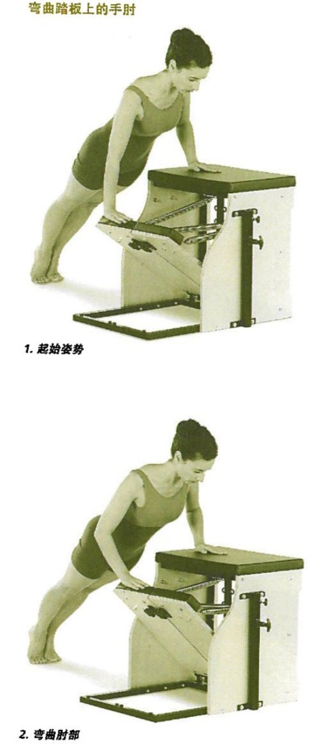
  - 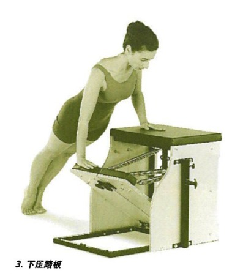
  - 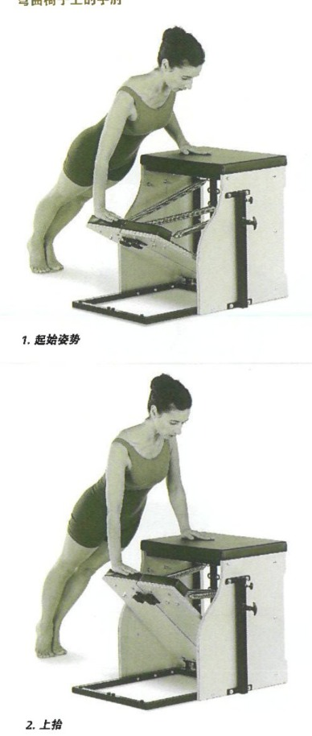
  - 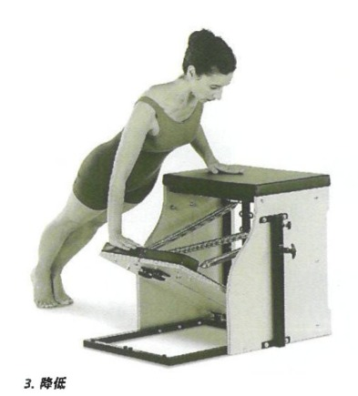

## 坐姿腹肌練習 (AB PRESS SITTING)

- 頁碼：p.96-97
- 難度：平衡椅
- 器械/章節：平衡椅
- 肌群分類：[[../muscles/chair-core-and-lumbopelvic-stability|核心與腰骨盆穩定]], [[../muscles/chair-spinal-articulation|脊椎活動]], [[../muscles/chair-scapular-stabilizers|肩胛與上背穩定]], [[../muscles/chair-lat-teres-pulling-chain|背闊肌與拉力鏈]], [[../muscles/chair-arms-delts-pecs|手臂與胸肩]], [[../muscles/chair-hips-and-legs|髖與腿]]
- 摘要：坐姿腹肌練習：主要歸入核心與腰骨盆穩定、脊椎活動、肩胛與上背穩定、背闊肌與拉力鏈。
- OCR 原文摘錄：注意事項：將墊子豎放在椅子前面，一端頂住金屬底座，使起始 目標肌肉：以腹橫肌擠壓腹部，穩定腰骨盆部位；以深層骨盆底 姿勢更舒適。 肌輔助腹模肌運動；向心收縮腹直肌和腹斜肌，以使脊椎彎曲， 並在脊椎復位時，離心收縮上述肌肉；利用背闊肌，大圓肌和肱
- 動作圖：
  - 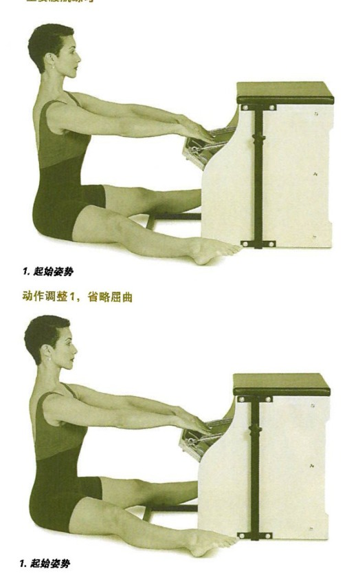
  - 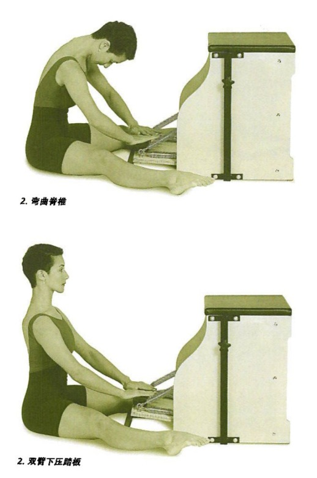
  - 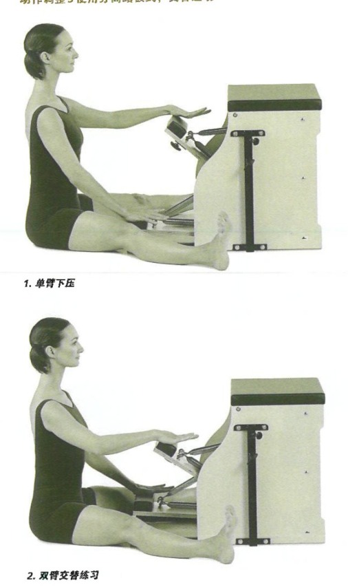
  - 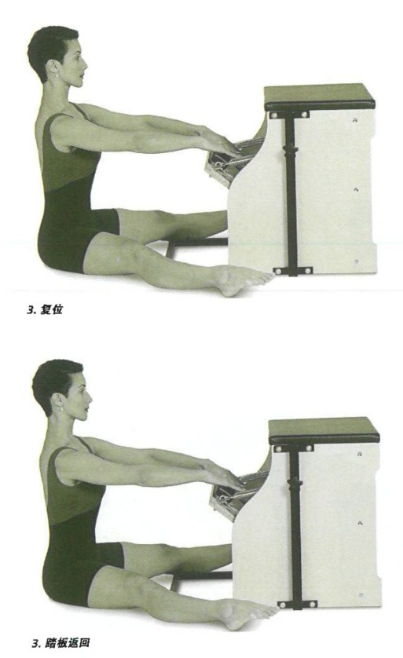

## 貓背前站姿 (CAT STANDING FRONT)

- 頁碼：p.98-105
- 難度：平衡椅
- 器械/章節：平衡椅
- 肌群分類：[[../muscles/chair-core-and-lumbopelvic-stability|核心與腰骨盆穩定]], [[../muscles/chair-spinal-articulation|脊椎活動]], [[../muscles/chair-scapular-stabilizers|肩胛與上背穩定]], [[../muscles/chair-arms-delts-pecs|手臂與胸肩]], [[../muscles/chair-hips-and-legs|髖與腿]], [[../muscles/chair-mobility-and-stretching|柔韌與伸展]]
- 摘要：貓背前站姿：主要歸入核心與腰骨盆穩定、脊椎活動、肩胛與上背穩定、手臂與胸肩。
- OCR 原文摘錄：以腹橫肌擠壓腹部，穩定腰骨盆部位：以深層骨盆底 ，手臂保持在肩部正下方，髖部保持在雙腳正上方 肌輔助腹模肌運動；向心收縮腹直肌和腹斜肌，以使脊椎向下卷 動，並在踏板上提時，等長收縮上述肌肉；向心收縮髖部伸展肌群， 以使骨盆後部向大腿骨後部靠攏；肩胛骨穩定肌群 ［1］開始拉伸脊椎，使其到達中立位時，離心收縮腹直肌，腹斜肌 和胭繩肌 13］雙肘彎曲時，離心收縮肱三頭肌和胸大肌，肘部伸展時，向心 收縮上述肌肉
- 動作圖：
  - 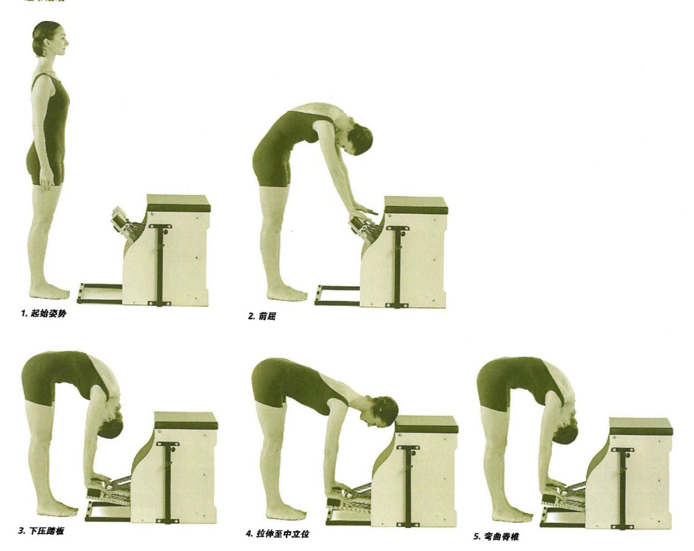
  - 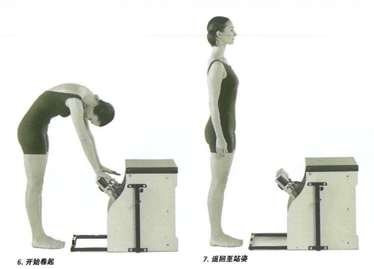
  - 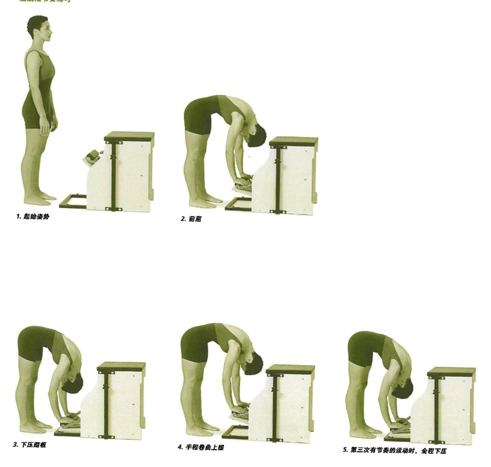
  - 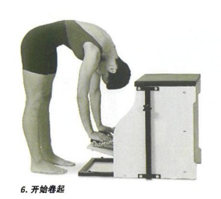
  - 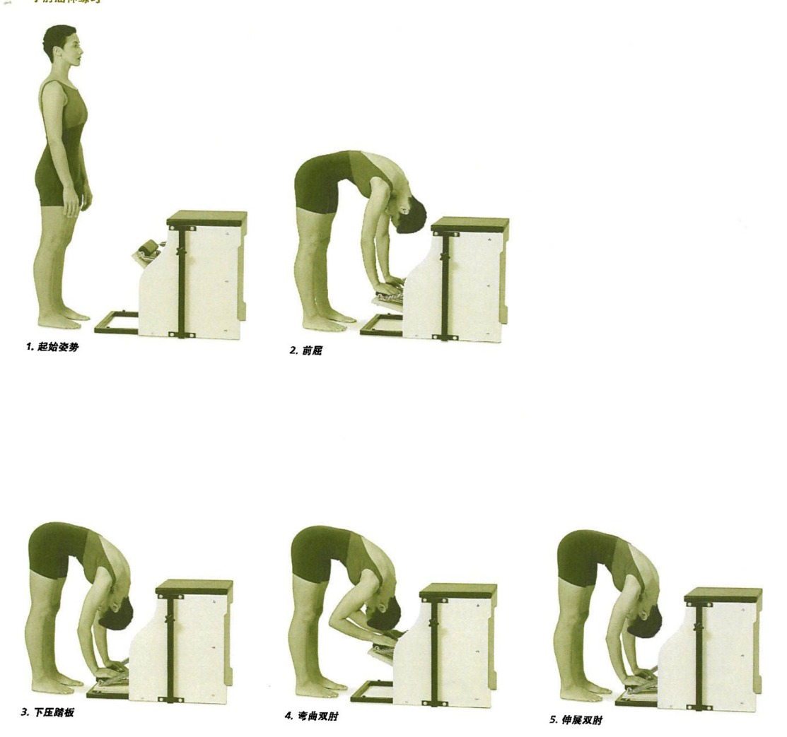
  - 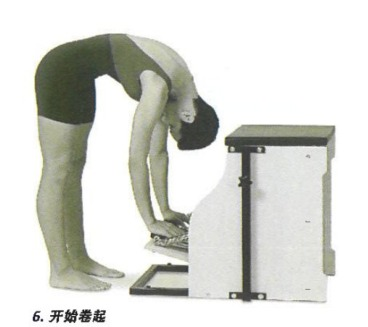
  - 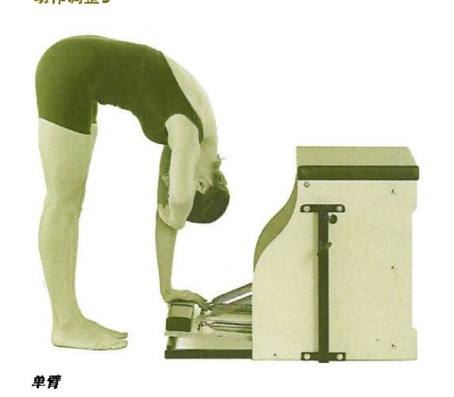
  - 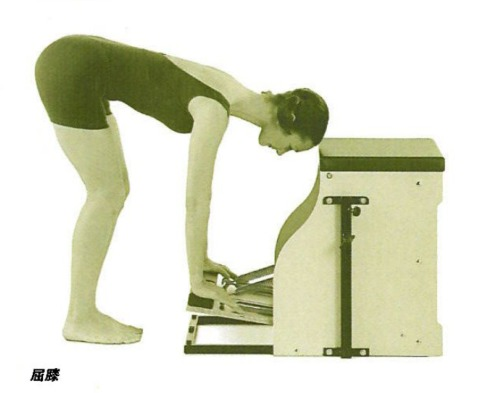
  - 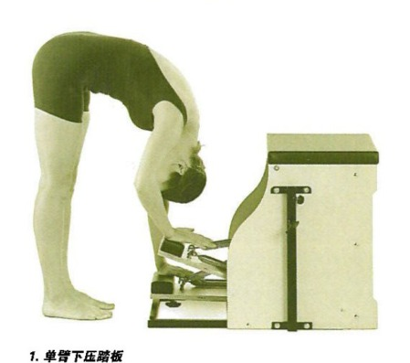
  - 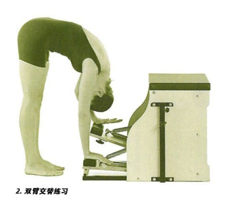
  - 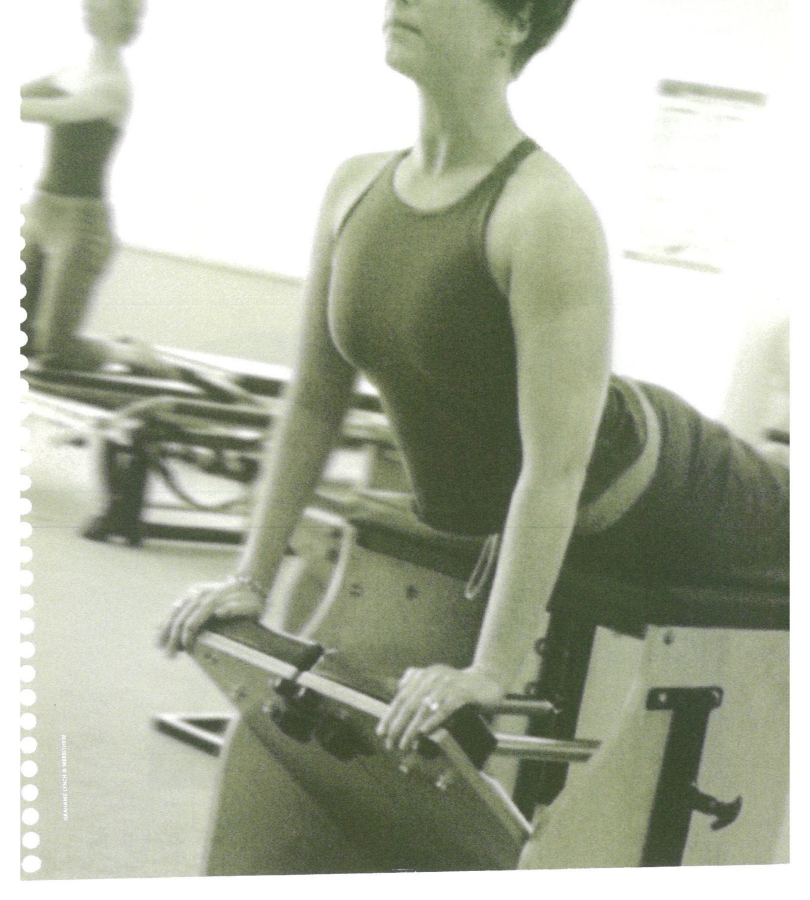

## 軀幹下壓坐姿準備動作 (TORSO PRESS SITTING PREP)

- 頁碼：p.106-107
- 難度：平衡椅
- 器械/章節：平衡椅
- 肌群分類：[[../muscles/chair-core-and-lumbopelvic-stability|核心與腰骨盆穩定]], [[../muscles/chair-spinal-articulation|脊椎活動]], [[../muscles/chair-scapular-stabilizers|肩胛與上背穩定]], [[../muscles/chair-arms-delts-pecs|手臂與胸肩]], [[../muscles/chair-hips-and-legs|髖與腿]], [[../muscles/chair-mobility-and-stretching|柔韌與伸展]]
- 摘要：軀幹下壓坐姿準備動作：主要歸入核心與腰骨盆穩定、脊椎活動、肩胛與上背穩定、手臂與胸肩。
- OCR 原文摘錄：呼氣 儘量加大脊椎彎曲，向後捲動下壓踏板。 目標肌肉：以腹橫肌擠壓腹部，穩定腰骨盆部位；以深層骨盆底 吸氣 向前屈，使肋骨架靠向骨盆，前屈幅度以能使踏板上提 肌輔助腹橫肌運動；向心收縮腹直肌和腹斜肌，以使脊椎彎曲； 為限。 肩胛骨穩定肌群 重複練習5-10次
- 動作圖：
  - 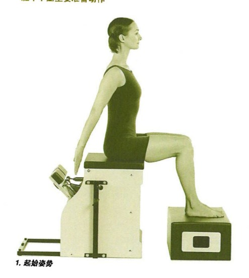
  - 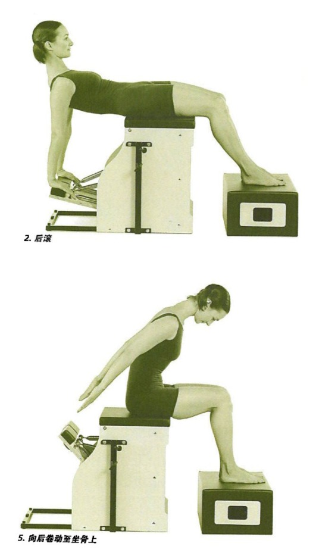
  - 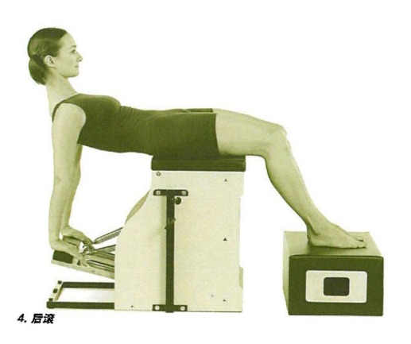
  - 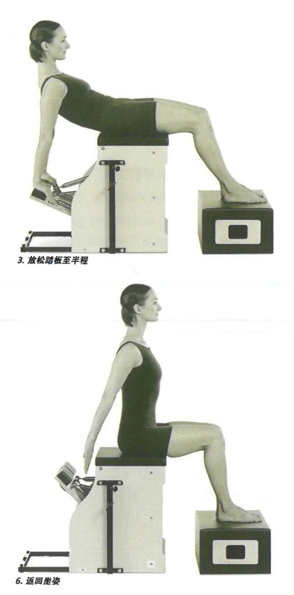

## 長矛式坐姿 (PIKE ON FLOOR)

- 頁碼：p.108-109
- 難度：平衡椅
- 器械/章節：平衡椅
- 肌群分類：[[../muscles/chair-core-and-lumbopelvic-stability|核心與腰骨盆穩定]], [[../muscles/chair-spinal-articulation|脊椎活動]], [[../muscles/chair-scapular-stabilizers|肩胛與上背穩定]], [[../muscles/chair-lat-teres-pulling-chain|背闊肌與拉力鏈]], [[../muscles/chair-arms-delts-pecs|手臂與胸肩]], [[../muscles/chair-hips-and-legs|髖與腿]], [[../muscles/chair-mobility-and-stretching|柔韌與伸展]]
- 摘要：長矛式坐姿：主要歸入核心與腰骨盆穩定、脊椎活動、肩胛與上背穩定、背闊肌與拉力鏈。
- OCR 原文摘錄：重複練習3-5次。 目標肌肉：以腹橫肌擠壓腹部，穩定腰骨盆部位；以深層骨盆底 肌輔助腹橫肌運動；利用背闊肌，大圓機和肱三頭肌，使雙臂姿 勢保持穩定；肩胛骨穩定肌群 ［1］脊椎彎曲時，向心收縮腹直肌和腹斜肌，復位時離心收縮上述 前屈 肌肉，向心收縮中豎脊肌 （2）向後捲動時，向心收縮腹直肌和腹斜肌；復位時向心收縮中 豎脊肌
- 動作圖：
  - 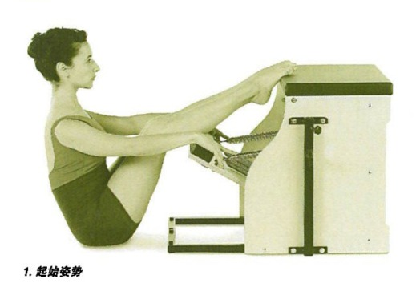
  - 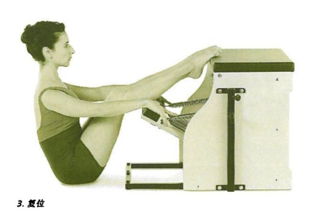
  - 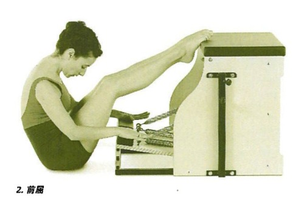
  - 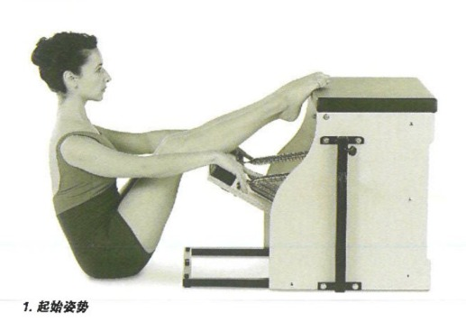
  - 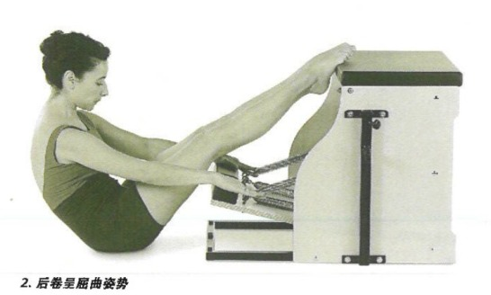
  - 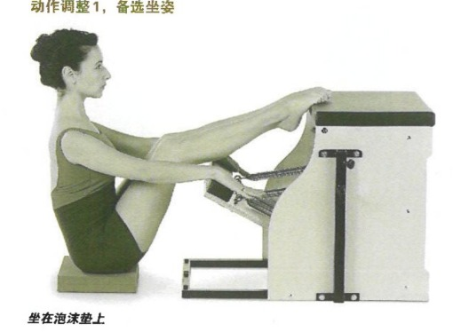
  - 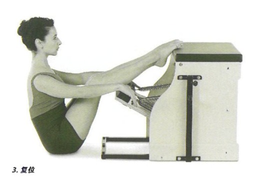

## 貓背跪姿 (CAT KNEELING)

- 頁碼：p.110-117
- 難度：平衡椅
- 器械/章節：平衡椅
- 肌群分類：[[../muscles/chair-core-and-lumbopelvic-stability|核心與腰骨盆穩定]], [[../muscles/chair-spinal-articulation|脊椎活動]], [[../muscles/chair-scapular-stabilizers|肩胛與上背穩定]], [[../muscles/chair-arms-delts-pecs|手臂與胸肩]], [[../muscles/chair-hips-and-legs|髖與腿]], [[../muscles/chair-mobility-and-stretching|柔韌與伸展]]
- 摘要：貓背跪姿：主要歸入核心與腰骨盆穩定、脊椎活動、肩胛與上背穩定、手臂與胸肩。
- OCR 原文摘錄：以腹橫肌擠壓腹部，穩定腰骨盆部位；以深層骨盆底 •重量均勻落在雙膝 肌輔助腹橫肌運動；向心收縮腹直肌和腹斜肌，以使脊椎向下卷 動，並在路板上提時，等長收縮上述肌肉；向心收縮脆部伸展肌群， ’脊椎保持彎曲，以對抗踏板 以使骨盆後部向大腿骨後部靠攏：肩胛骨穩定肌群 •脊椎上卷和下卷時，都要逐節活動 ［1］開始拉伸脊椎，使其到達中立位時，離心收縮腹直肌，腹斜肌 ’脊椎下卷時，避免骨盆向前旋轉，脊椎上卷時，注意使骨盆向 和膕繩肌 後旋轉 收縮上述肌肉 3］雙肘彎曲時，離心收縮肱三頭肌和胸大肌，肘部伸展時，向心 •脊椎上卷和下卷時，骨盆避免向後移動 ’脊椎上卷時，要先讓骨盆豎直，再讓脊椎由屈曲逐節回到 的雙臂
- 動作圖：
  - 
  - 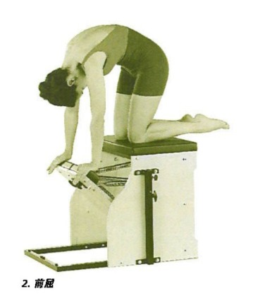
  - 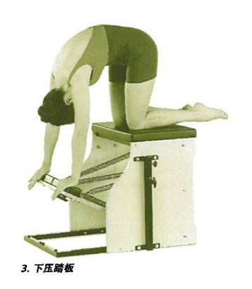
  - 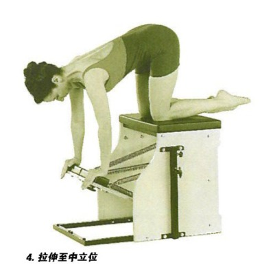
  - 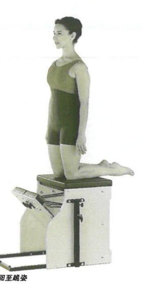
  - 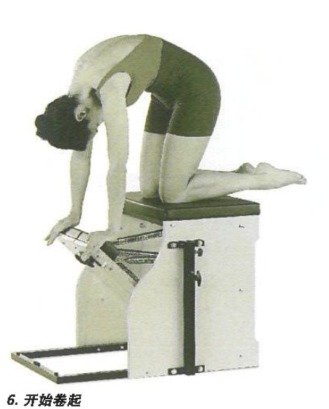
  - 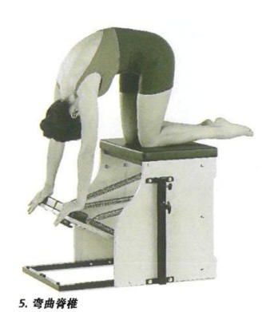
  - 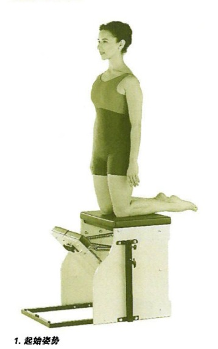
  - 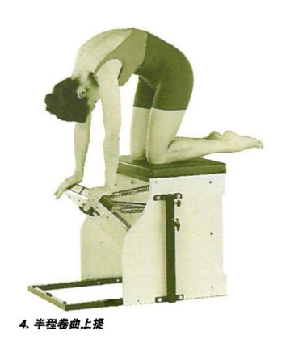
  - 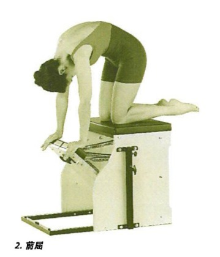
  - 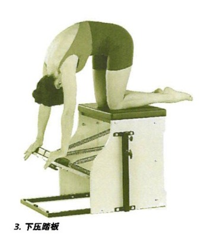
  - 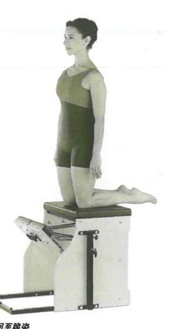
  - 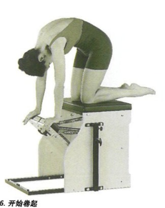
  - 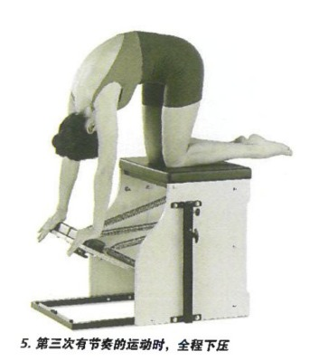
  - 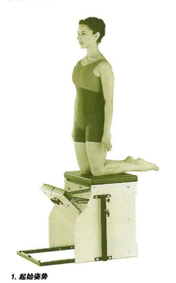
  - 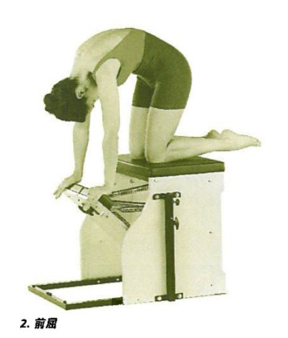
  - 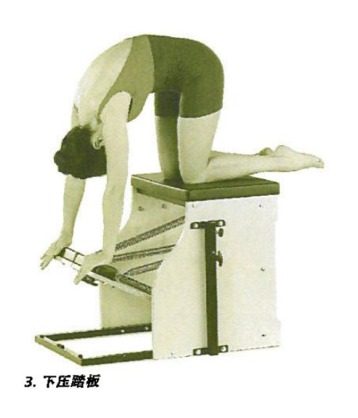
  - 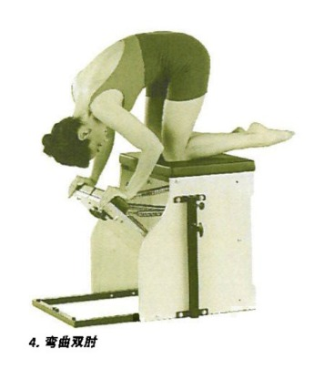
  - 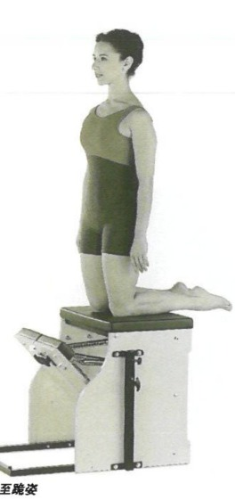
  - 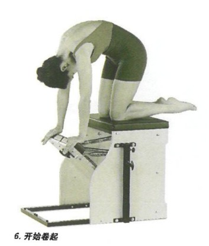
  - 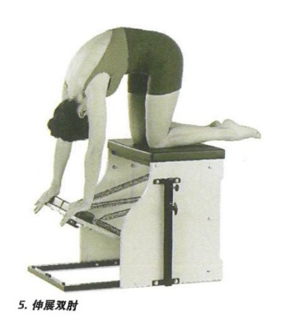
  - 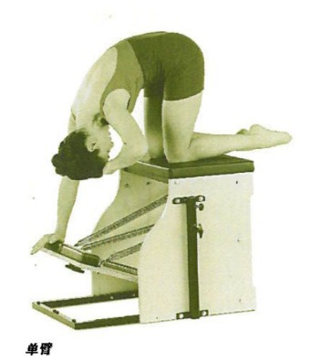
  - 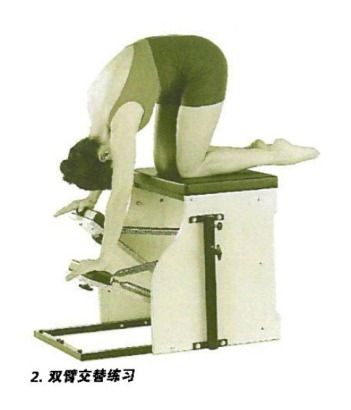
  - 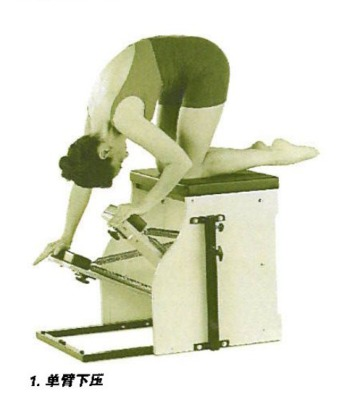
  - 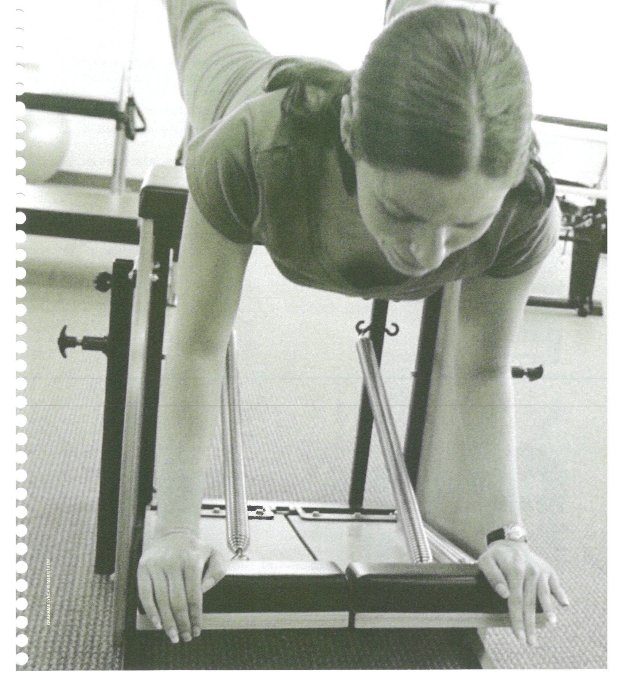

## 貓背側站姿 (CAT STANDING SIDE)

- 頁碼：p.118-123
- 難度：平衡椅
- 器械/章節：平衡椅
- 肌群分類：[[../muscles/chair-core-and-lumbopelvic-stability|核心與腰骨盆穩定]], [[../muscles/chair-spinal-articulation|脊椎活動]], [[../muscles/chair-scapular-stabilizers|肩胛與上背穩定]], [[../muscles/chair-arms-delts-pecs|手臂與胸肩]], [[../muscles/chair-hips-and-legs|髖與腿]], [[../muscles/chair-mobility-and-stretching|柔韌與伸展]]
- 摘要：貓背側站姿：主要歸入核心與腰骨盆穩定、脊椎活動、肩胛與上背穩定、手臂與胸肩。
- OCR 原文摘錄：以腹橫肌擠壓腹部，穩定腰骨盆部位；以深層骨盆底 •踏板下壓時，脊椎保持彎曲；下壓踏板時避免拉伸脊椎或讓身 肌輔助腹橫肌運動；向心收縮腹直肌和腹斜肌，以使脊椎向下卷 體重心移動 動，並在踏板上提時，等長收縮上述肌肉；向心收縮髖部伸展肌群， •脊椎上卷時，要先讓骨盆豎直，再讓脊椎由屈曲逐節回到 以使骨盆後部向大腿骨後部靠攏；利用腹斜肌和多裂肌阻止身體 中立位 旋轉；肩胛骨穩定肌群 •髖部和肩部保持水平正對前方；脊椎上下捲動時，避免旋轉 ［1］開始拉伸脊椎，使其到達中立位時，離心收縮腹直肌，腹斜肌 和胭繩肌
- 動作圖：
  - 
  - 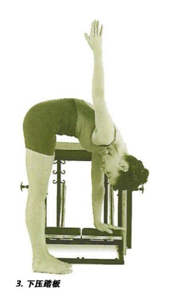
  - 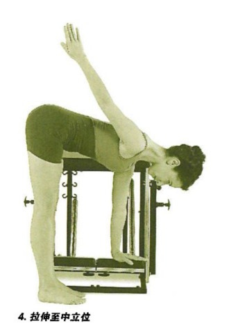
  - 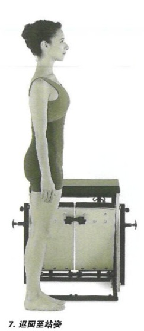
  - 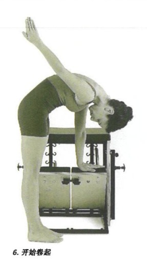
  - 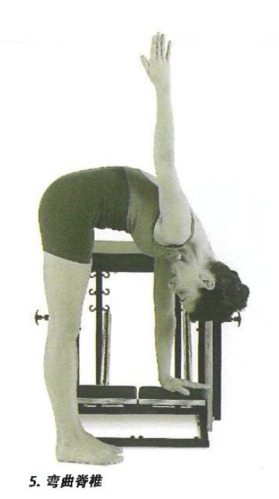
  - 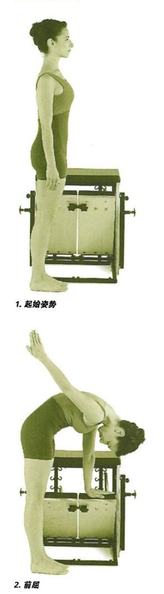
  - 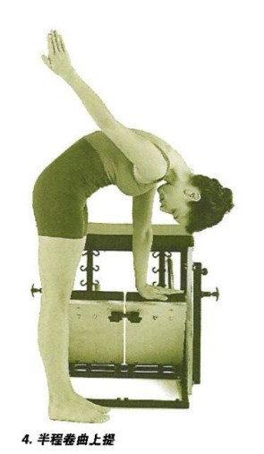
  - 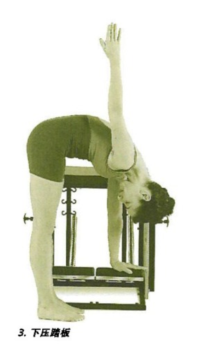
  - 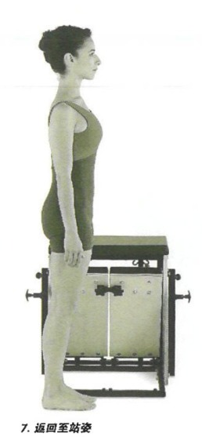
  - 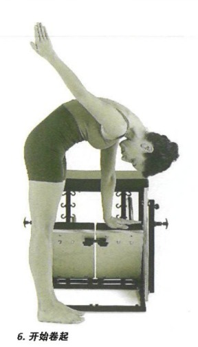
  - 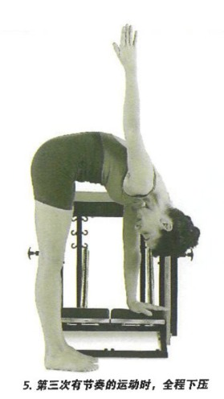
  - 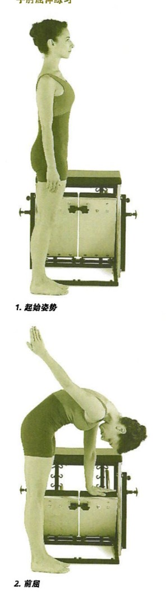
  - 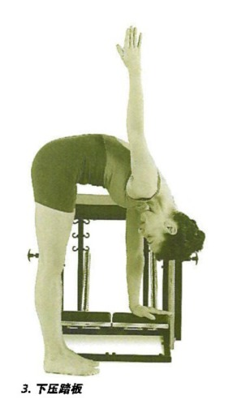
  - 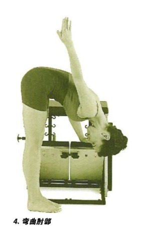
  - 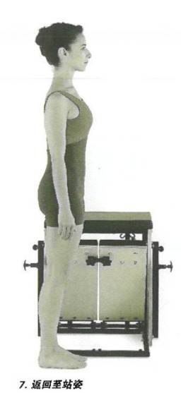
  - 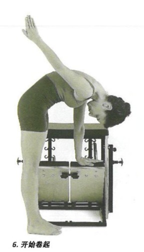
  - 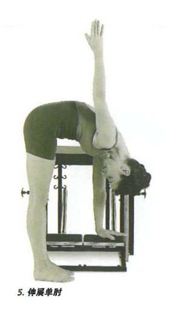

## 貓背後站姿 (CAT STANDING BACK)

- 頁碼：p.124-127
- 難度：平衡椅
- 器械/章節：平衡椅
- 肌群分類：[[../muscles/chair-core-and-lumbopelvic-stability|核心與腰骨盆穩定]], [[../muscles/chair-spinal-articulation|脊椎活動]], [[../muscles/chair-scapular-stabilizers|肩胛與上背穩定]], [[../muscles/chair-hips-and-legs|髖與腿]], [[../muscles/chair-mobility-and-stretching|柔韌與伸展]]
- 摘要：貓背後站姿：主要歸入核心與腰骨盆穩定、脊椎活動、肩胛與上背穩定、髖與腿。
- OCR 原文摘錄：以腹橫肌擠壓腹部，穩定腰骨盆部位；以深層骨盆底 前旋轉，脊椎上卷時，注意使骨盆向後旋轉 肌輔助腹橫肌運動；向心收縮腹直肌和腹斜肌，以使脊椎向下卷 ，踏板下壓時，脊椎保持彎曲；下壓踏板時避免拉伸脊椎或讓身 動，並在踏板上提時，等長收縮上述肌肉；向心收縮髖部伸展肌群， 體重心移動 以使骨盆後部向大腿骨後部靠攏：肩胛骨穩定肌群 ，脊椎上卷時，要先讓骨盆豎直，再讓脊椎由屈曲逐節回到 ［1J開始拉伸脊椎，使其到達中立位時，離心收縮腹直肌，腹斜肌 中立位 和胭繩肌 •避免身體重心前傾或後傾
- 動作圖：
  - 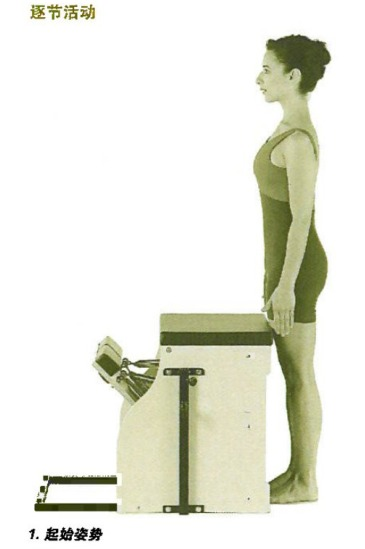
  - 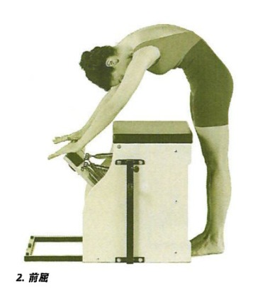
  - 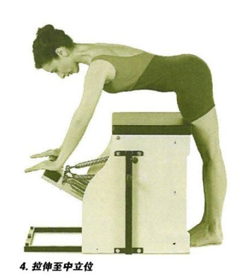
  - 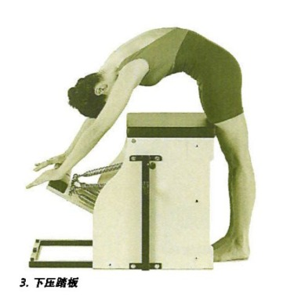
  - 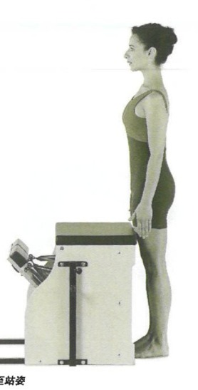
  - 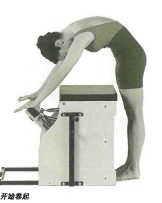
  - 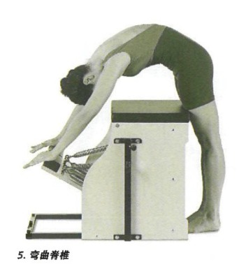
  - 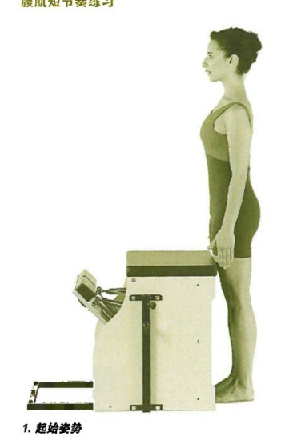
  - 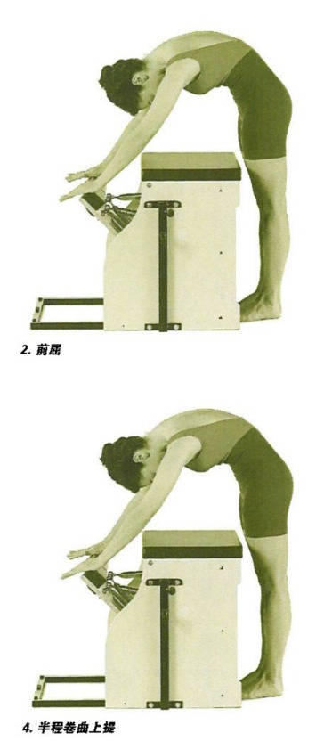
  - 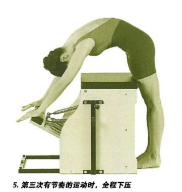
  - 
  - 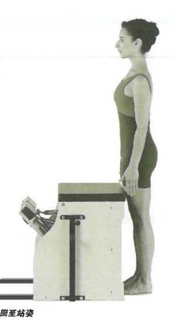
  - 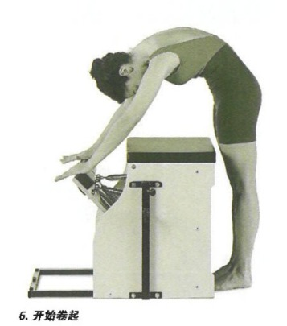
  - 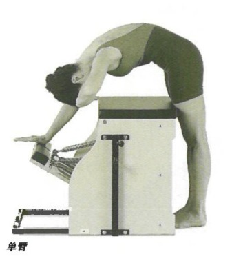

## 反向卷腹 (ROLL OVER)

- 頁碼：p.128-129
- 難度：平衡椅
- 器械/章節：平衡椅
- 肌群分類：[[../muscles/chair-core-and-lumbopelvic-stability|核心與腰骨盆穩定]], [[../muscles/chair-spinal-articulation|脊椎活動]], [[../muscles/chair-scapular-stabilizers|肩胛與上背穩定]], [[../muscles/chair-hips-and-legs|髖與腿]], [[../muscles/chair-mobility-and-stretching|柔韌與伸展]]
- 摘要：反向卷腹：主要歸入核心與腰骨盆穩定、脊椎活動、肩胛與上背穩定、髖與腿。
- 動作圖：
  - 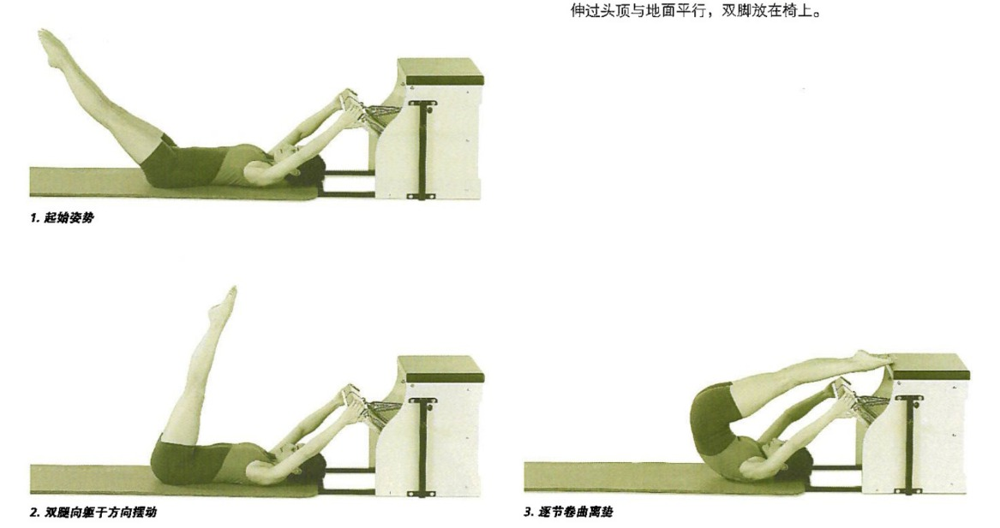
  - 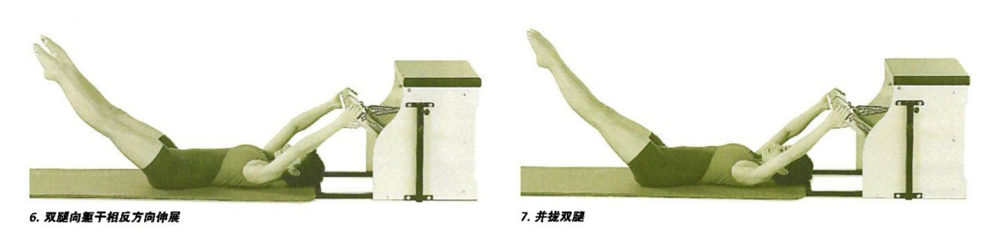
  - 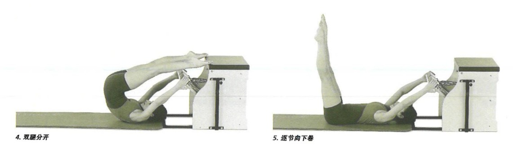
  - 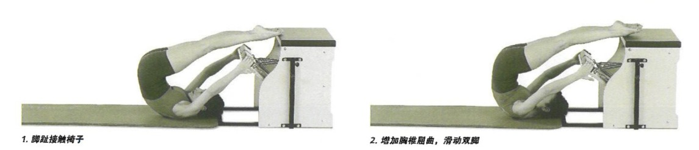

## 一柱擎天 (JACK KNIFE)

- 頁碼：p.130-131
- 難度：平衡椅
- 器械/章節：平衡椅
- 肌群分類：[[../muscles/chair-core-and-lumbopelvic-stability|核心與腰骨盆穩定]], [[../muscles/chair-spinal-articulation|脊椎活動]], [[../muscles/chair-scapular-stabilizers|肩胛與上背穩定]], [[../muscles/chair-hips-and-legs|髖與腿]], [[../muscles/chair-mobility-and-stretching|柔韌與伸展]]
- 摘要：一柱擎天：主要歸入核心與腰骨盆穩定、脊椎活動、肩胛與上背穩定、髖與腿。
- 動作圖：
  - 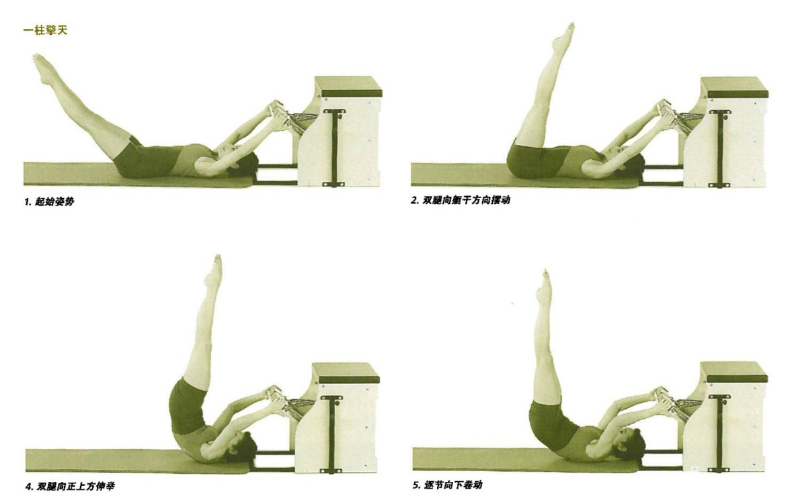
  - 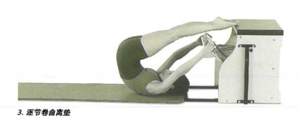
  - 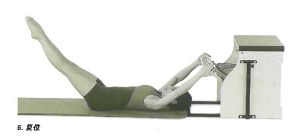

## 軀幹下壓坐姿動作 (TORSO PRESS SITTING)

- 頁碼：p.132-133
- 難度：平衡椅
- 器械/章節：平衡椅
- 肌群分類：[[../muscles/chair-core-and-lumbopelvic-stability|核心與腰骨盆穩定]], [[../muscles/chair-spinal-articulation|脊椎活動]], [[../muscles/chair-scapular-stabilizers|肩胛與上背穩定]], [[../muscles/chair-arms-delts-pecs|手臂與胸肩]], [[../muscles/chair-hips-and-legs|髖與腿]], [[../muscles/chair-mobility-and-stretching|柔韌與伸展]]
- 摘要：軀幹下壓坐姿動作：主要歸入核心與腰骨盆穩定、脊椎活動、肩胛與上背穩定、手臂與胸肩。
- OCR 原文摘錄：日標肌肉：以腹橫肌擠壓腹部，穩定腰骨盆部位；以深層骨盆底 肌輔助腹橫肌運動；向心收縮腹直肌和腹斜肌，以使脊椎彎曲， 並等長收縮上述肌肉，使脊椎保持彎曲；利用股四頭肌和髖內收 肌保持雙腿姿態：向後捲動時，離心收縮髖屈肌群，並在復位時， 向心收縮上述肌肉；肩胛骨穩定肌群
- 動作圖：
  - 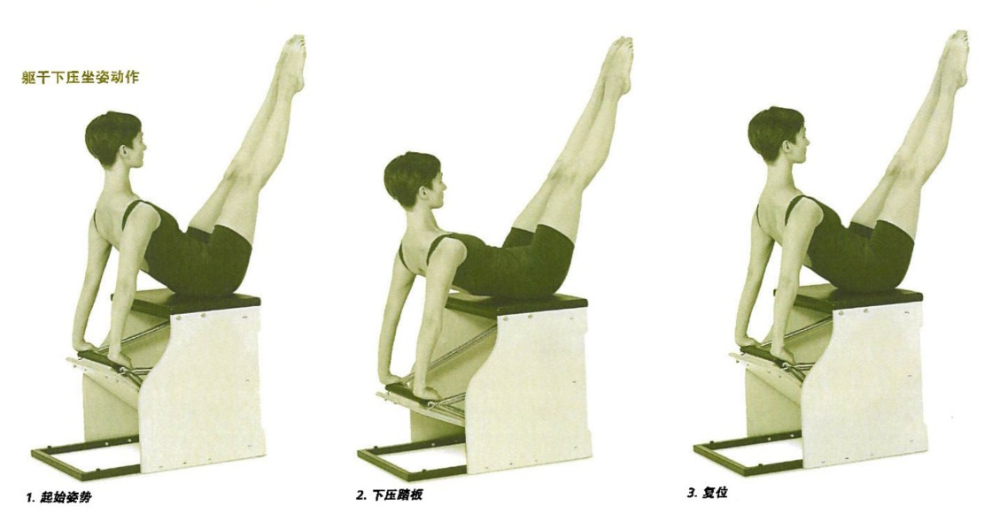
  - 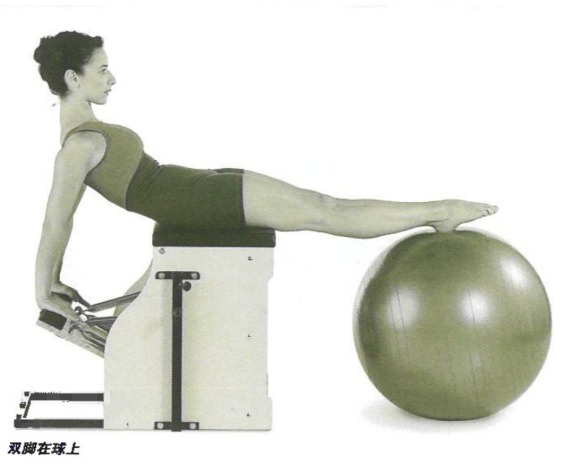
  - 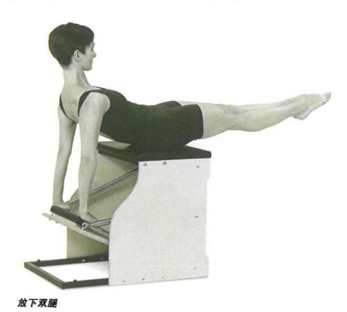

## 騎馬姿 (HORSEBACK)

- 頁碼：p.134-137
- 難度：平衡椅
- 器械/章節：平衡椅
- 肌群分類：[[../muscles/chair-core-and-lumbopelvic-stability|核心與腰骨盆穩定]], [[../muscles/chair-spinal-articulation|脊椎活動]], [[../muscles/chair-scapular-stabilizers|肩胛與上背穩定]], [[../muscles/chair-arms-delts-pecs|手臂與胸肩]], [[../muscles/chair-hips-and-legs|髖與腿]], [[../muscles/chair-mobility-and-stretching|柔韌與伸展]]
- 摘要：騎馬姿：主要歸入核心與腰骨盆穩定、脊椎活動、肩胛與上背穩定、手臂與胸肩。
- OCR 原文摘錄：目標肌肉：以腹橫肌擠壓腹部，穩定腰骨盆部位；以深層骨盆底 肌輔助腹橫肌運動；腰椎彎曲時，向心收縮腹直肌和腹斜肌：胸 椎拉伸時，向心收縮中豎脊肌；等長收縮腕內收肌群，以壓向椅子， 保持骨盆拾起；利用臀大肌和匯繩肌，使骨盆後部向大腿骨後部 靠攏；利用腹直肌和腹斜肌，使脊椎完全彎曲並在下壓踏板時保 持脊椎屈曲；肩胛骨穩定肌群
- 動作圖：
  - 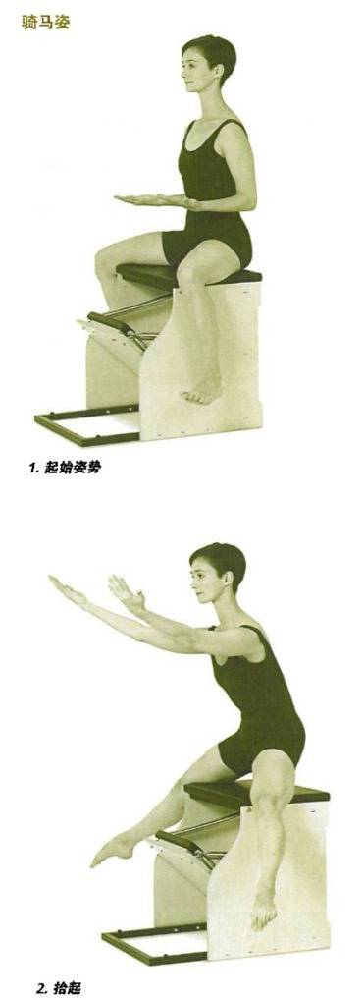
  - 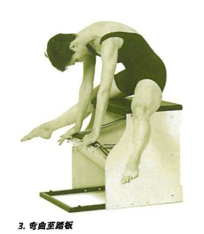
  - 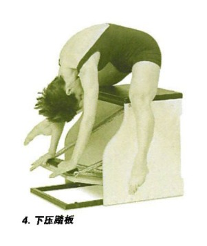
  - 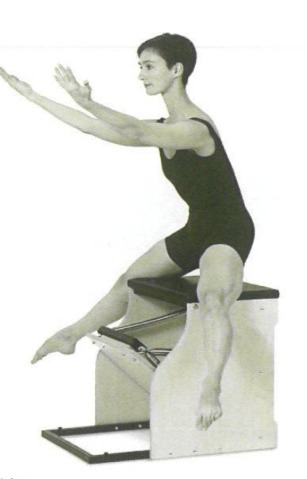
  - 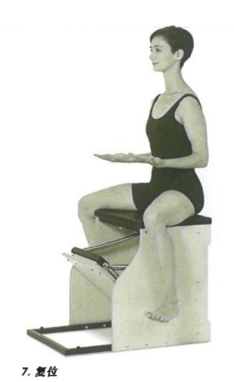
  - 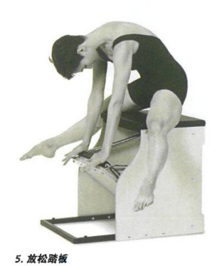
  - 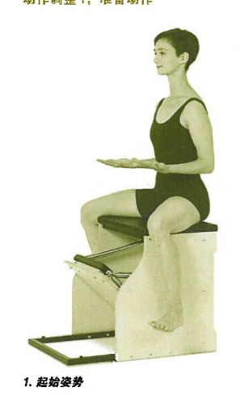
  - 
  - 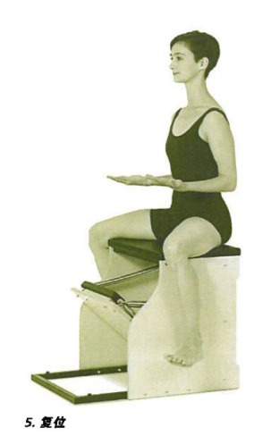
  - 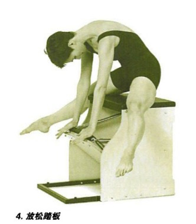
  - 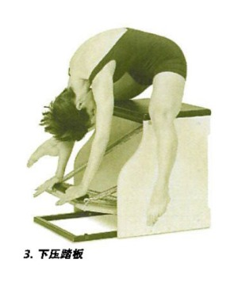
  - 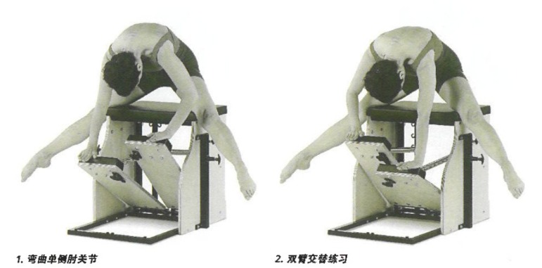

## 肌腱伸展 (TENDON STRETCH)

- 頁碼：p.138-139
- 難度：平衡椅
- 器械/章節：平衡椅
- 肌群分類：[[../muscles/chair-core-and-lumbopelvic-stability|核心與腰骨盆穩定]], [[../muscles/chair-spinal-articulation|脊椎活動]], [[../muscles/chair-scapular-stabilizers|肩胛與上背穩定]], [[../muscles/chair-arms-delts-pecs|手臂與胸肩]], [[../muscles/chair-hips-and-legs|髖與腿]], [[../muscles/chair-mobility-and-stretching|柔韌與伸展]]
- 摘要：肌腱伸展：主要歸入核心與腰骨盆穩定、脊椎活動、肩胛與上背穩定、手臂與胸肩。
- OCR 原文摘錄：骨盆旋轉（骨盆可略微旋轉）。 目標肌肉：以腹橫肌擠壓腹部，穩定腰骨盆部位；以深層骨盆底 肌輔助腹橫肌運動；隨著身體拾起，等長收縮腹直肌和腹斜肌， 5.動作腿後伸。一條腿朝後伸展，保持穩定。挑戰動作腿髖部伸 以使脊椎保持彎曲；利用髖部伸展肌群以保持骨盆後部向股骨後 展肌群等長收縮以保持腿部拾起。挑戰腹斜肌和多裂肌防止脊椎 部靠攏；隨著踏板抬起，向心收縮髖屈肌群；隨著踏板抬起，向 和骨盆旋轉。 心收縮三角肌；肩胛骨穩定肌群
- 動作圖：
  - 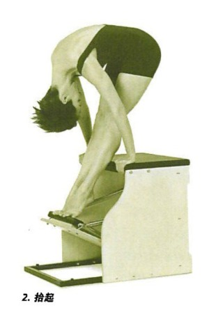
  - 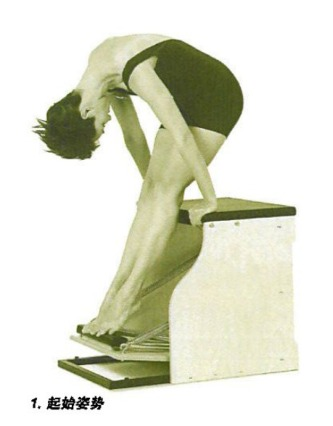
  - 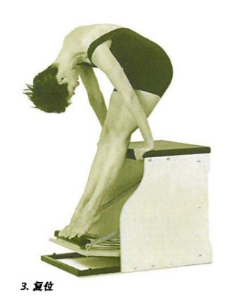
  - 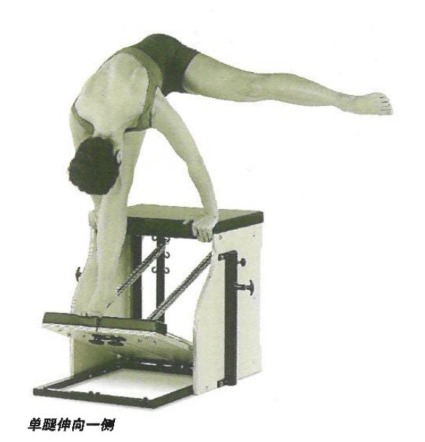
  - 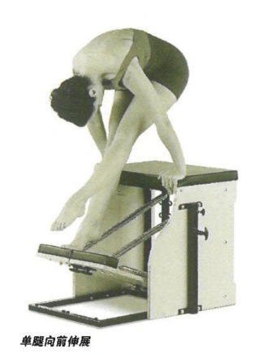
  - 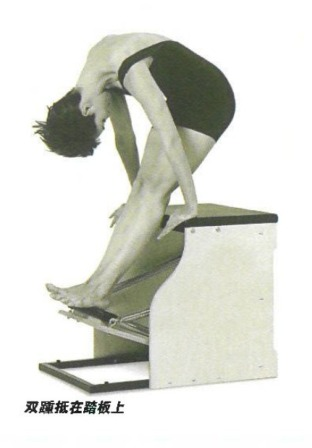
  - 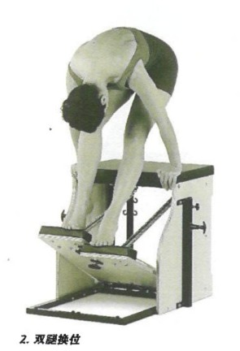
  - 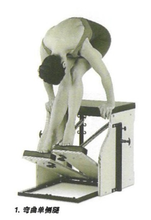
  - 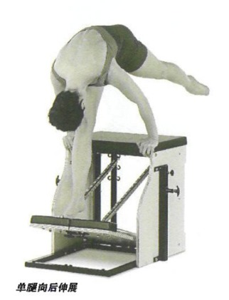

## 大象姿 (ELEPHANT)

- 頁碼：p.140-141
- 難度：平衡椅
- 器械/章節：平衡椅
- 肌群分類：[[../muscles/chair-core-and-lumbopelvic-stability|核心與腰骨盆穩定]], [[../muscles/chair-spinal-articulation|脊椎活動]], [[../muscles/chair-scapular-stabilizers|肩胛與上背穩定]], [[../muscles/chair-arms-delts-pecs|手臂與胸肩]], [[../muscles/chair-hips-and-legs|髖與腿]], [[../muscles/chair-mobility-and-stretching|柔韌與伸展]]
- 摘要：大象姿：主要歸入核心與腰骨盆穩定、脊椎活動、肩胛與上背穩定、手臂與胸肩。
- OCR 原文摘錄：注意事項：整套練習必須在受過訓練的專業人員的監督和指導下 目標肌肉：以腹橫肌擠壓腹部，穩定腰骨盆部位；以深層骨盆底 進行，確保練習者全程控制踏板並避免踏板突然鬆開，以防練習 肌輔助腹橫肌運動；等長收縮腹直肌和腹斜肌，以使脊椎保持彎 者身體失衡。教練不能把身體靠向踏板。 曲；隨著踏板上提，向心收縮髖屈肌群；隨著踏板抬起，向心收 縮三角肌；利用髖部伸展肌群，使骨盆後部保持向大腿骨後部靠
- 動作圖：
  - 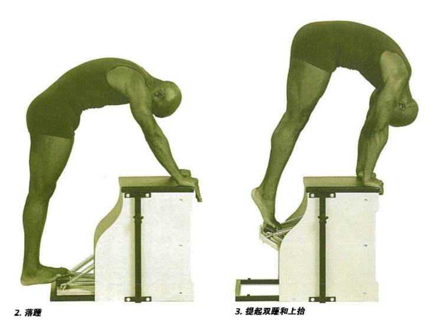
  - 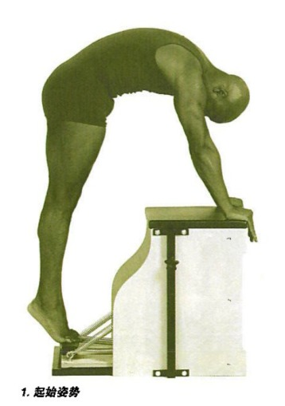
  - 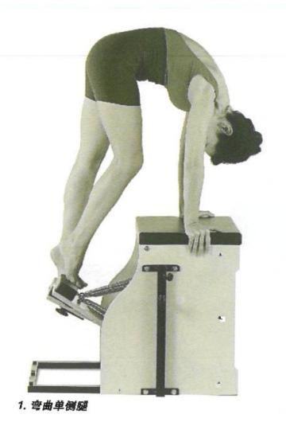
  - 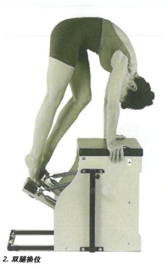
  - 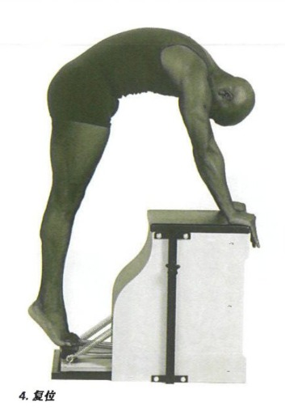

## 手倒立 (HANDSTAND)

- 頁碼：p.142-145
- 難度：平衡椅
- 器械/章節：平衡椅
- 肌群分類：[[../muscles/chair-core-and-lumbopelvic-stability|核心與腰骨盆穩定]], [[../muscles/chair-spinal-articulation|脊椎活動]], [[../muscles/chair-scapular-stabilizers|肩胛與上背穩定]], [[../muscles/chair-arms-delts-pecs|手臂與胸肩]], [[../muscles/chair-hips-and-legs|髖與腿]], [[../muscles/chair-mobility-and-stretching|柔韌與伸展]]
- 摘要：手倒立：主要歸入核心與腰骨盆穩定、脊椎活動、肩胛與上背穩定、手臂與胸肩。
- OCR 原文摘錄：目標肌肉：以腹橫肌擠壓腹部，穩定腰骨盆部位；以深層骨盆底 肌輔助腹橫肌運動：向心收縮腹直肌和腹斜肌，以使腰椎彎曲， 離心收縮上述肌肉，帶動脊椎伸展至中立位；向心收縮髖部伸展 肌群，以使骨盆後部向大腿骨後部靠攏；利用三角肌、肱二頭肌 和肱三頭肌穩定肩部和雙臂；肩胛骨穩定肌群
- 動作圖：
  - 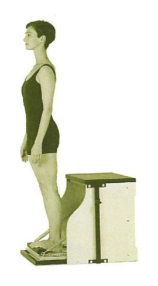
  - 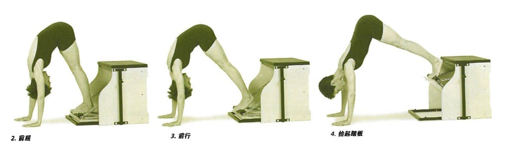
  - 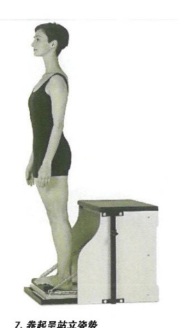
  - 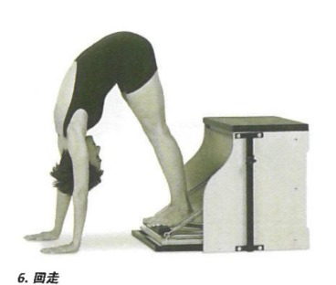
  - 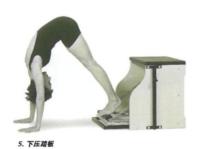
  - 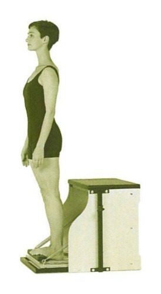
  - 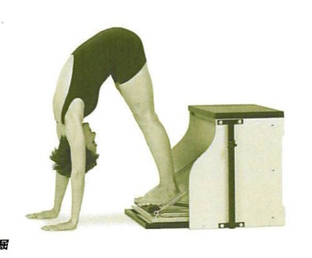
  - 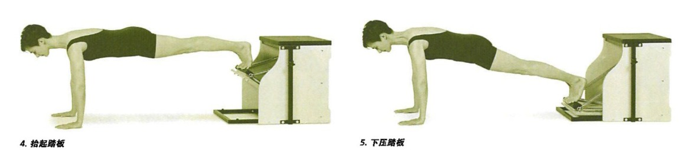
  - 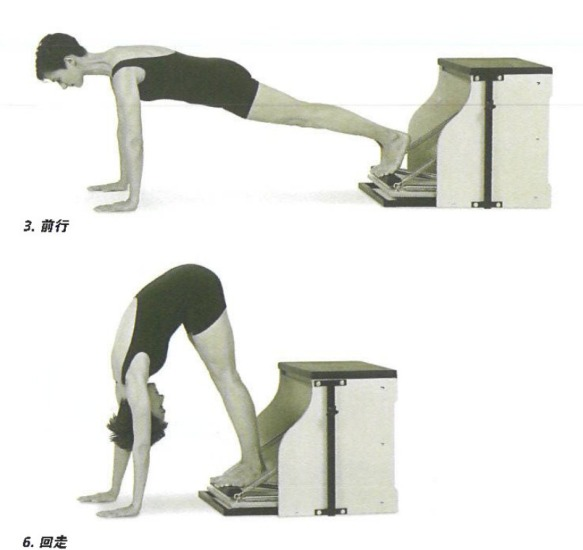
  - 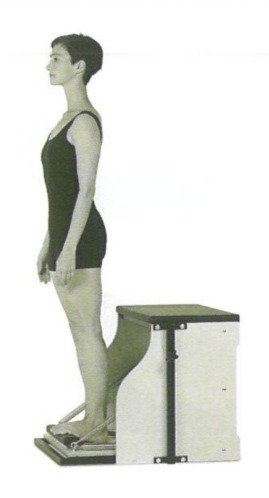

## 天鵝潛水-地面 (SWAN DIVE FROM FLOOR)

- 頁碼：p.146
- 難度：平衡椅
- 器械/章節：平衡椅
- 肌群分類：[[../muscles/chair-core-and-lumbopelvic-stability|核心與腰骨盆穩定]], [[../muscles/chair-spinal-articulation|脊椎活動]], [[../muscles/chair-scapular-stabilizers|肩胛與上背穩定]], [[../muscles/chair-lat-teres-pulling-chain|背闊肌與拉力鏈]], [[../muscles/chair-arms-delts-pecs|手臂與胸肩]], [[../muscles/chair-hips-and-legs|髖與腿]], [[../muscles/chair-mobility-and-stretching|柔韌與伸展]]
- 摘要：天鵝潛水-地面：主要歸入核心與腰骨盆穩定、脊椎活動、肩胛與上背穩定、背闊肌與拉力鏈。
- OCR 原文摘錄：注意事項：將墊子豎放在椅子前面，一端頂住金屬底座，使脊椎 目標肌肉：以腹橫肌擠壓腹部，穩定腰骨盆部位；以深層骨盆底 逐節活動更舒適。 肌輔助腹模肌運動；脊椎伸展時，向心收縮豎脊肌，復位時離心 收縮上述肌肉：利用腹斜肌，防止腰椎過度伸展：向心收縮臀大
- 動作圖：
  - 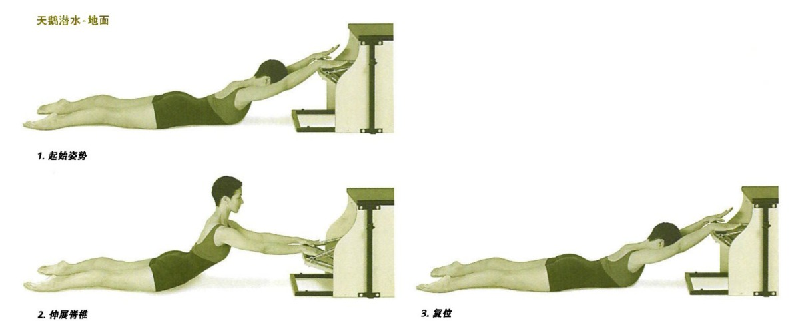

## 天鵝潛水準備動作 (SWAN DIVE PREP)

- 頁碼：p.147-149
- 難度：平衡椅
- 器械/章節：平衡椅
- 肌群分類：[[../muscles/chair-core-and-lumbopelvic-stability|核心與腰骨盆穩定]], [[../muscles/chair-spinal-articulation|脊椎活動]], [[../muscles/chair-scapular-stabilizers|肩胛與上背穩定]], [[../muscles/chair-lat-teres-pulling-chain|背闊肌與拉力鏈]], [[../muscles/chair-arms-delts-pecs|手臂與胸肩]], [[../muscles/chair-hips-and-legs|髖與腿]], [[../muscles/chair-mobility-and-stretching|柔韌與伸展]]
- 摘要：天鵝潛水準備動作：主要歸入核心與腰骨盆穩定、脊椎活動、肩胛與上背穩定、背闊肌與拉力鏈。
- OCR 原文摘錄：注意事項：整套練習必須在受過訓練的專業人員的監督和指導下 目標肌肉：以腹橫肌擠壓腹部，穩定腰骨盆部位；以深層骨盆底 進行，確保練習者全程控制踏板並避免踏板突然鬆開。教練不能 肌輔助腹橫肌運動；脊椎伸展時，向心收縮豎脊肌，復位時離心 把身體靠向踏板。 收縮上述肌肉；利用腹斜肌，防止腰椎過度伸展；向心收縮臀大 肌和胭繩肌，以使骨盆後部向大腿骨後部靠攏；向上時，向心收
- 動作圖：
  - 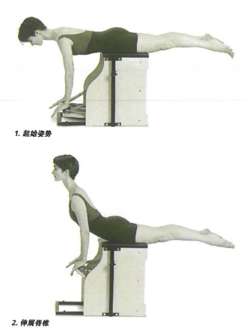
  - 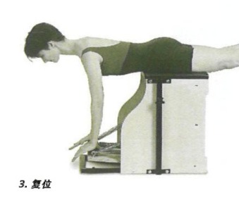
  - 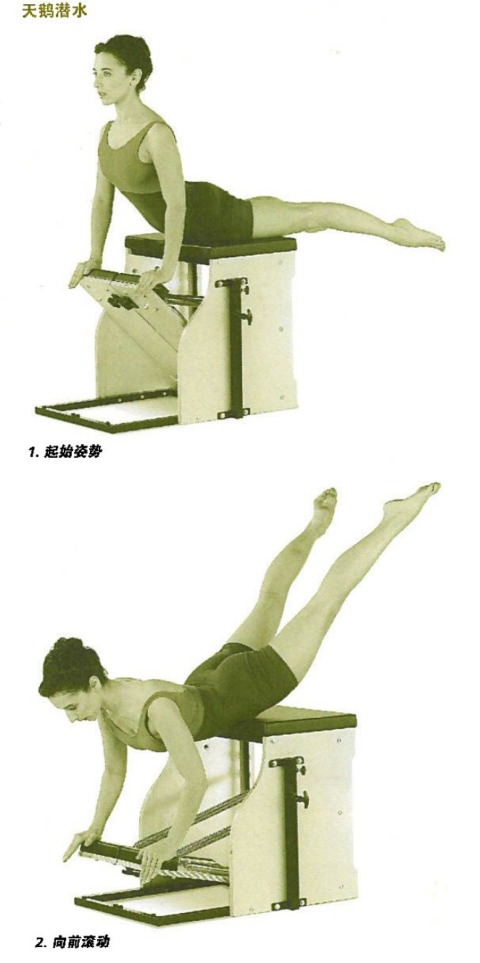
  - 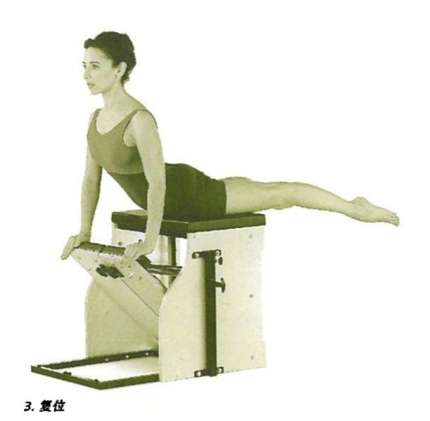
  - 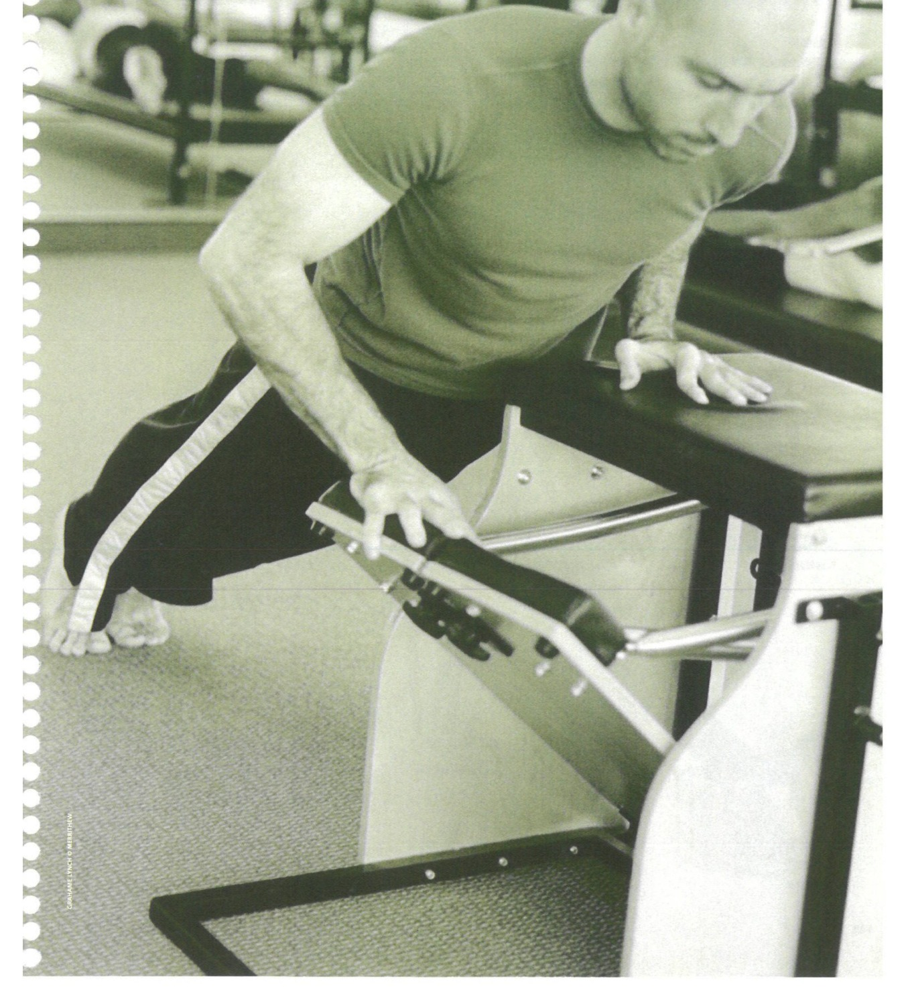

## 蚱蜢姿 (GRASSHOPPER)

- 頁碼：p.150-151
- 難度：平衡椅
- 器械/章節：平衡椅
- 肌群分類：[[../muscles/chair-core-and-lumbopelvic-stability|核心與腰骨盆穩定]], [[../muscles/chair-spinal-articulation|脊椎活動]], [[../muscles/chair-scapular-stabilizers|肩胛與上背穩定]], [[../muscles/chair-arms-delts-pecs|手臂與胸肩]], [[../muscles/chair-hips-and-legs|髖與腿]], [[../muscles/chair-mobility-and-stretching|柔韌與伸展]]
- 摘要：蚱蜢姿：主要歸入核心與腰骨盆穩定、脊椎活動、肩胛與上背穩定、手臂與胸肩。
- OCR 原文摘錄：目標肌肉：以腹橫肌擠壓腹部，穩定腰骨盆部位；以深層骨盆底 肌輔助腹橫肌運動；等長收縮豎脊肌，以使脊椎保持伸展：等長 收縮臀大肌和胸繩肌，以使髖部保持伸展；利用腹斜肌，防止腰 椎過度伸展；雙膝彎曲時，向心收縮膽繩肌：雙膝伸展時，向心 收縮股四頭肌：肩胛骨穩定肌群
- 動作圖：
  - 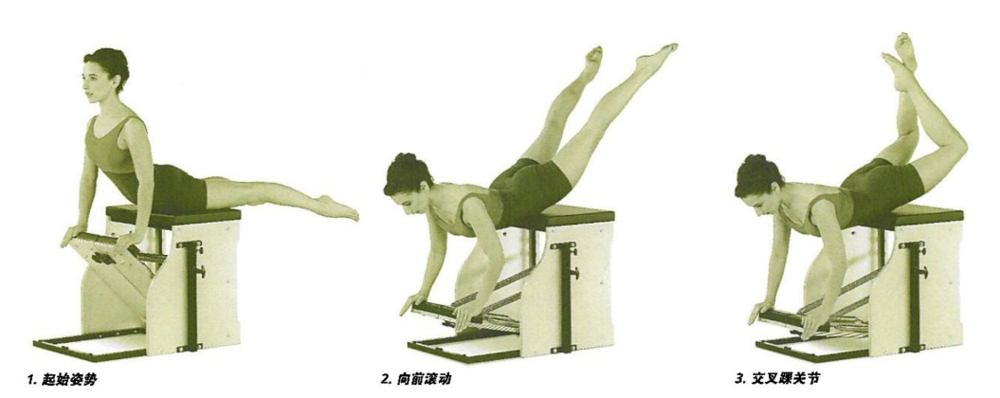
  - 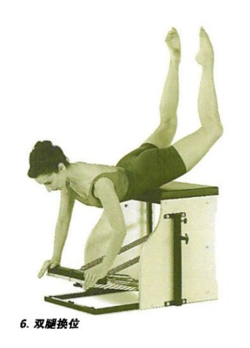
  - 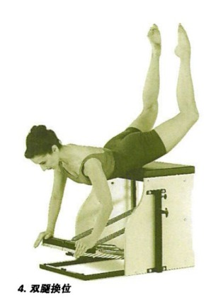
  - 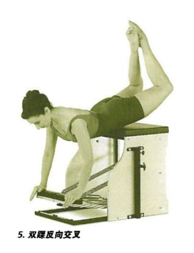
  - 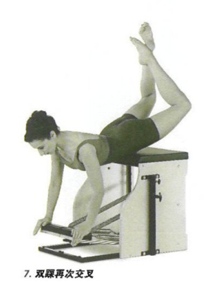
  - 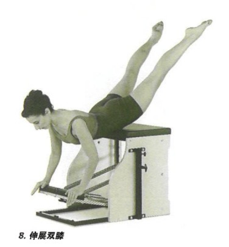
  - 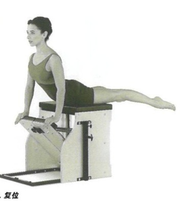

## 展翅雄鷹 (SPREAD EAGLE)

- 頁碼：p.152-155
- 難度：平衡椅
- 器械/章節：平衡椅
- 肌群分類：[[../muscles/chair-core-and-lumbopelvic-stability|核心與腰骨盆穩定]], [[../muscles/chair-spinal-articulation|脊椎活動]], [[../muscles/chair-scapular-stabilizers|肩胛與上背穩定]], [[../muscles/chair-lat-teres-pulling-chain|背闊肌與拉力鏈]], [[../muscles/chair-arms-delts-pecs|手臂與胸肩]], [[../muscles/chair-hips-and-legs|髖與腿]], [[../muscles/chair-mobility-and-stretching|柔韌與伸展]]
- 摘要：展翅雄鷹：主要歸入核心與腰骨盆穩定、脊椎活動、肩胛與上背穩定、背闊肌與拉力鏈。
- OCR 原文摘錄：目標肌肉：以腹橫肌擠壓腹部，穩定腰骨盆部位；以深層骨盆底 肌輔助腹橫肌運動；向心收縮臀大肌和胭繩肌，以使骨盆後部向 大腿骨後部靠攏，等長收縮上述肌肉，以使大腿骨穩定支撐骨盆； 向心收縮腹直肌和腹斜肌，以使脊椎捲曲；向心收縮豎脊肌，使 脊椎開始伸展，然後繼續伸展上脊椎，讓身體上提；利用腹斜肌， 防止腰椎過度伸展；向心收縮肱三頭肌，以使雙肘伸展和軀幹上 提，並在雙肘彎曲和軀幹下落時，離心收縮上述肌肉；利用背闊肌， 防止肩部上提；肩胛骨穩定肌群
- 動作圖：
  - 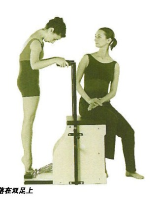
  - 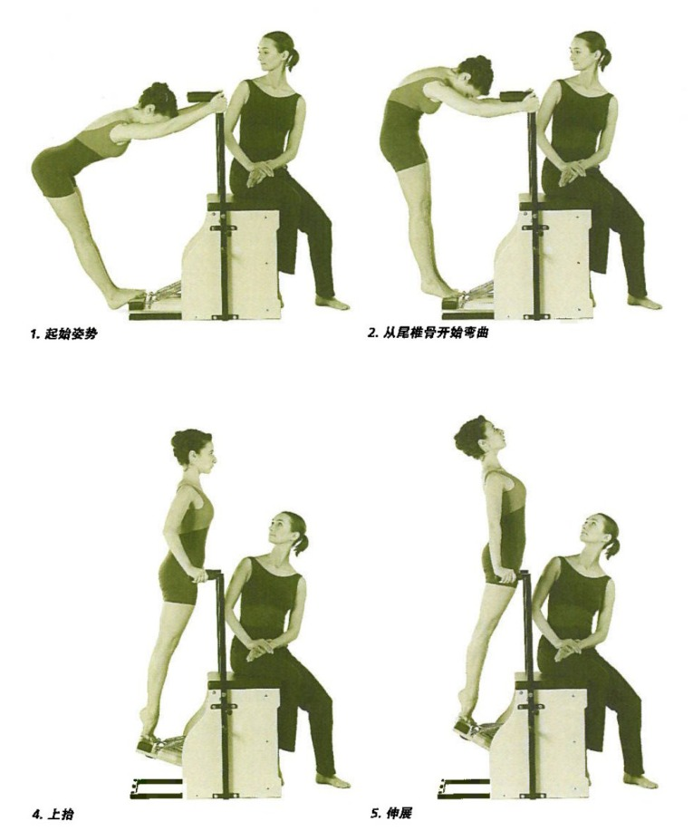
  - 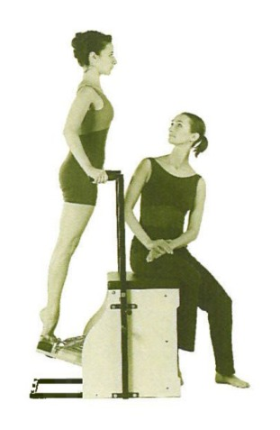
  - 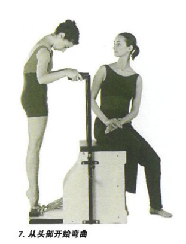
  - 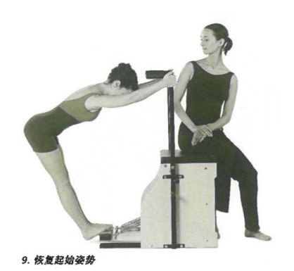
  - 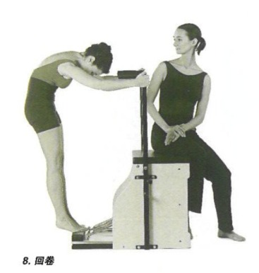
  - 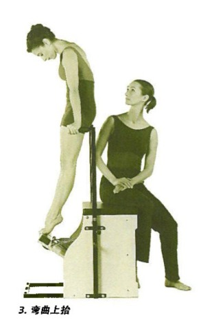
  - 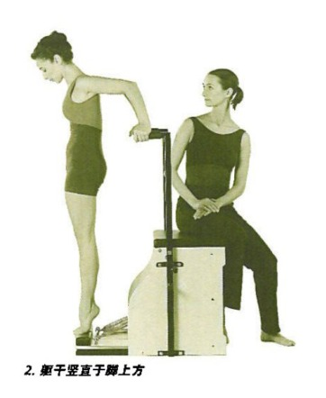
  - 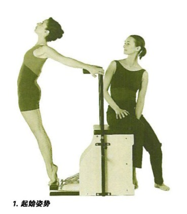
  - 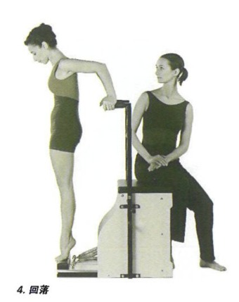
  - 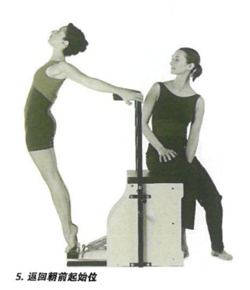

## 美人魚姿 (MERMAID)

- 頁碼：p.156-157
- 難度：平衡椅
- 器械/章節：平衡椅
- 肌群分類：[[../muscles/chair-core-and-lumbopelvic-stability|核心與腰骨盆穩定]], [[../muscles/chair-spinal-articulation|脊椎活動]], [[../muscles/chair-scapular-stabilizers|肩胛與上背穩定]], [[../muscles/chair-arms-delts-pecs|手臂與胸肩]], [[../muscles/chair-hips-and-legs|髖與腿]], [[../muscles/chair-mobility-and-stretching|柔韌與伸展]]
- 摘要：美人魚姿：主要歸入核心與腰骨盆穩定、脊椎活動、肩胛與上背穩定、手臂與胸肩。
- 動作圖：
  - 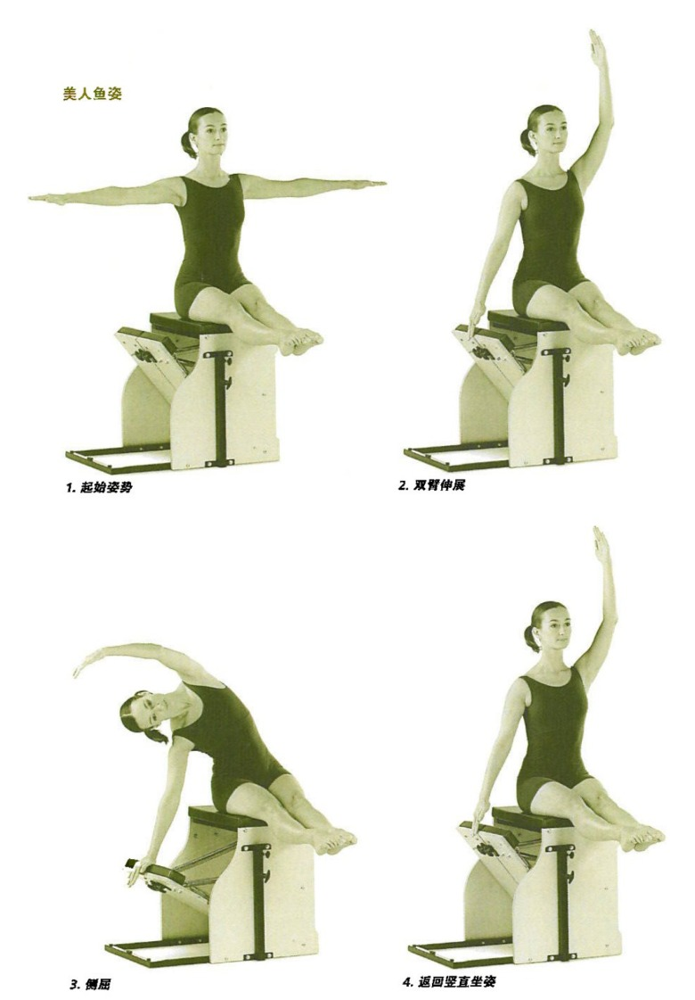
  - 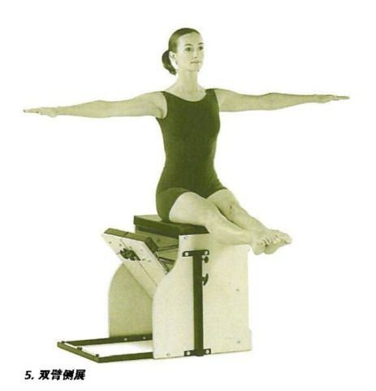
  - 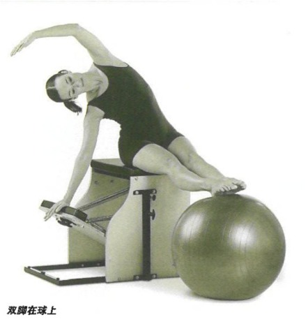
  - 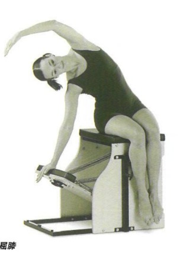

## 美人魚跪姿 (MERMAID KNEELING)

- 頁碼：p.158-159
- 難度：平衡椅
- 器械/章節：平衡椅
- 肌群分類：[[../muscles/chair-core-and-lumbopelvic-stability|核心與腰骨盆穩定]], [[../muscles/chair-spinal-articulation|脊椎活動]], [[../muscles/chair-scapular-stabilizers|肩胛與上背穩定]], [[../muscles/chair-lat-teres-pulling-chain|背闊肌與拉力鏈]], [[../muscles/chair-arms-delts-pecs|手臂與胸肩]], [[../muscles/chair-hips-and-legs|髖與腿]], [[../muscles/chair-mobility-and-stretching|柔韌與伸展]]
- 摘要：美人魚跪姿：主要歸入核心與腰骨盆穩定、脊椎活動、肩胛與上背穩定、背闊肌與拉力鏈。
- OCR 原文摘錄：目標肌肉：以腹橫肌擠壓腹部，穩定腰骨盆部位；以深層骨盆底 肌輔助腹橫肌運動；脊椎側屈時，向心收縮靠近踏板的腹內外斜 肌，並在復位時離心收縮上述肌肉；利用腹斜肌和豎脊肌防止脊 椎伸展或前屈；利用腹斜肌和多裂肌防止身體旋轉；利用靠近踏 板的背闊肌防止肩胛帶上提；利用臀大肌和膕繩肌，以使大腿骨 穩定支撐骨盆；利用外側的髖外展肌群和內側的膨內收肌群防止 骨盆側移；肩胛骨穩定肌群
- 動作圖：
  - 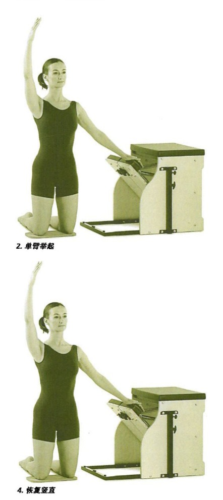
  - 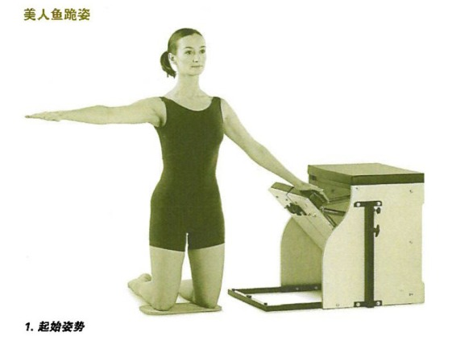
  - 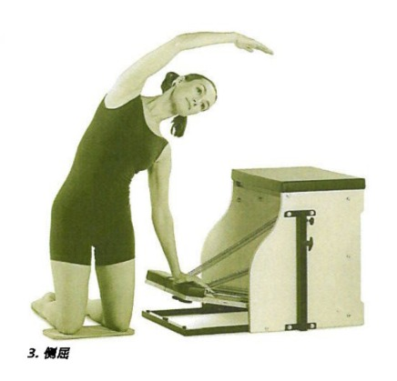
  - 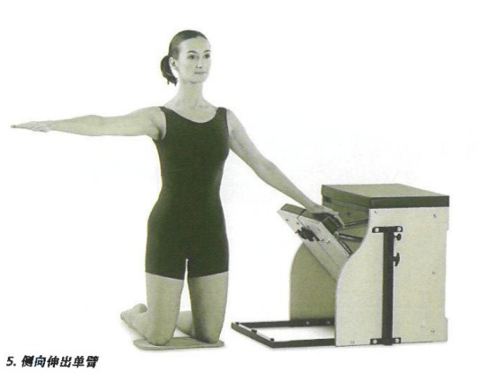

## 側彎 (SIDE BEND)

- 頁碼：p.160
- 難度：平衡椅
- 器械/章節：平衡椅
- 肌群分類：[[../muscles/chair-core-and-lumbopelvic-stability|核心與腰骨盆穩定]], [[../muscles/chair-spinal-articulation|脊椎活動]], [[../muscles/chair-scapular-stabilizers|肩胛與上背穩定]], [[../muscles/chair-arms-delts-pecs|手臂與胸肩]], [[../muscles/chair-hips-and-legs|髖與腿]], [[../muscles/chair-mobility-and-stretching|柔韌與伸展]]
- 摘要：側彎：主要歸入核心與腰骨盆穩定、脊椎活動、肩胛與上背穩定、手臂與胸肩。
- 動作圖：
  - 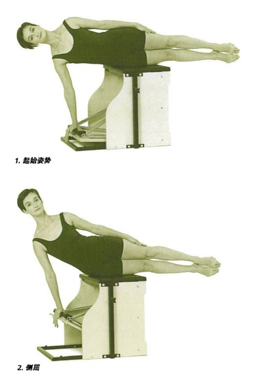
  - 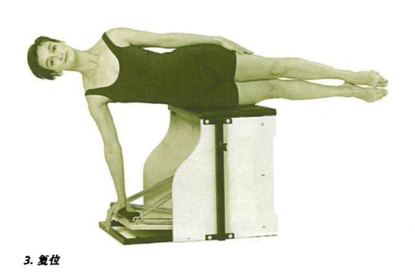

## 俯臥旋轉 (ROTATION PRONE)

- 頁碼：p.161-165
- 難度：平衡椅
- 器械/章節：平衡椅
- 肌群分類：[[../muscles/chair-core-and-lumbopelvic-stability|核心與腰骨盆穩定]], [[../muscles/chair-spinal-articulation|脊椎活動]], [[../muscles/chair-scapular-stabilizers|肩胛與上背穩定]], [[../muscles/chair-arms-delts-pecs|手臂與胸肩]], [[../muscles/chair-hips-and-legs|髖與腿]], [[../muscles/chair-mobility-and-stretching|柔韌與伸展]]
- 摘要：俯臥旋轉：主要歸入核心與腰骨盆穩定、脊椎活動、肩胛與上背穩定、手臂與胸肩。
- 動作圖：
  - 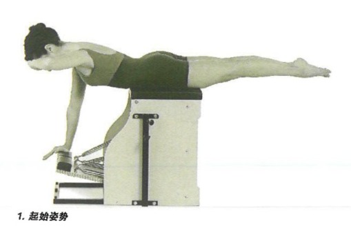
  - 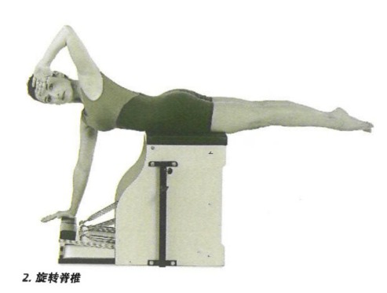
  - 
  - 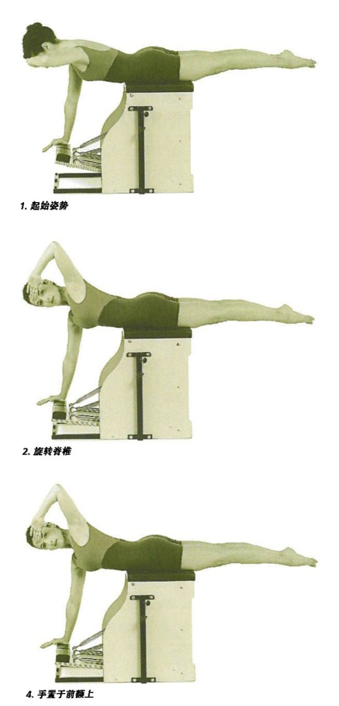
  - 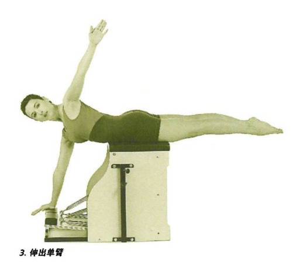
  - 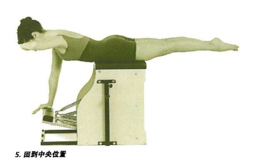
  - 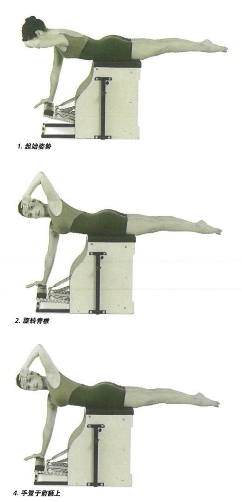
  - 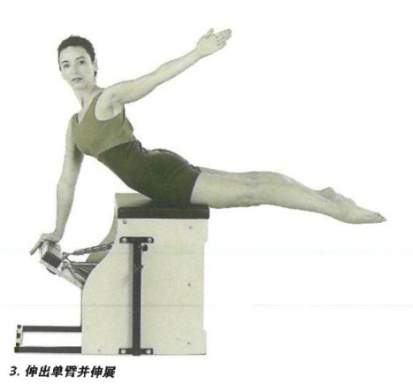
  - 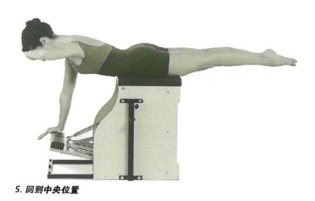
  - 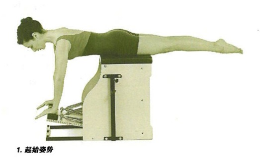
  - 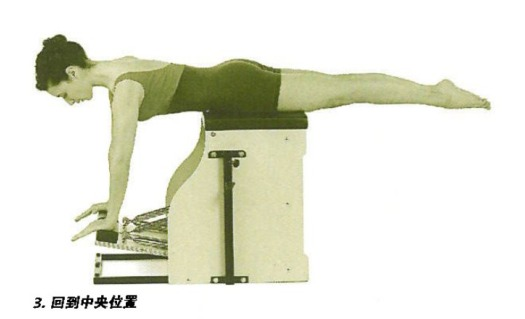
  - 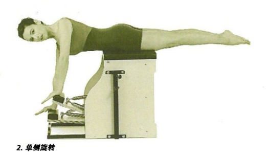
  - 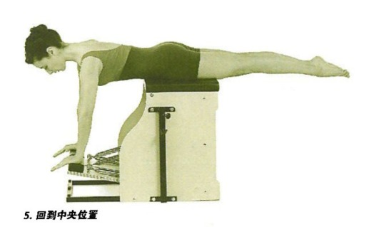
  - 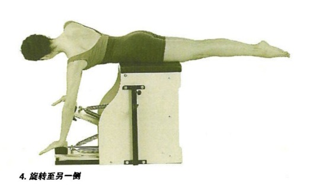
  - 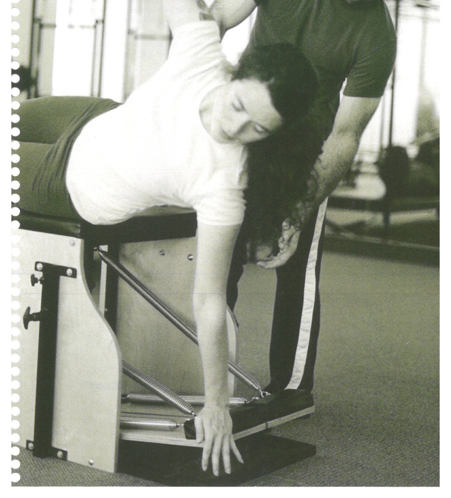

## 傾斜 (LEAN)

- 頁碼：p.166-167
- 難度：平衡椅
- 器械/章節：平衡椅
- 肌群分類：[[../muscles/chair-core-and-lumbopelvic-stability|核心與腰骨盆穩定]], [[../muscles/chair-spinal-articulation|脊椎活動]], [[../muscles/chair-scapular-stabilizers|肩胛與上背穩定]], [[../muscles/chair-arms-delts-pecs|手臂與胸肩]], [[../muscles/chair-hips-and-legs|髖與腿]], [[../muscles/chair-mobility-and-stretching|柔韌與伸展]]
- 摘要：傾斜：主要歸入核心與腰骨盆穩定、脊椎活動、肩胛與上背穩定、手臂與胸肩。
- 動作圖：
  - 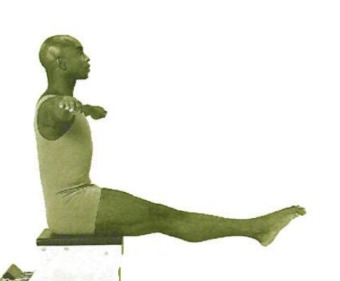
  - 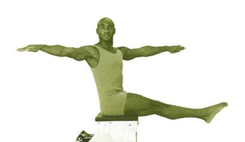
  - 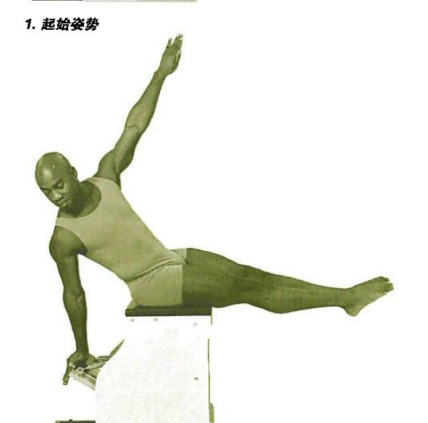
  - 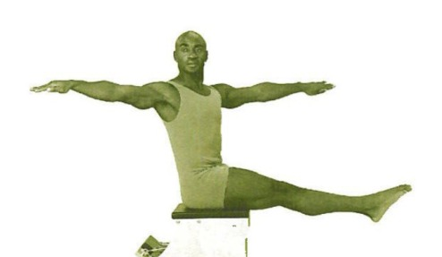
  - 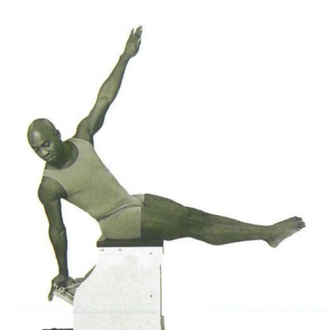
  - 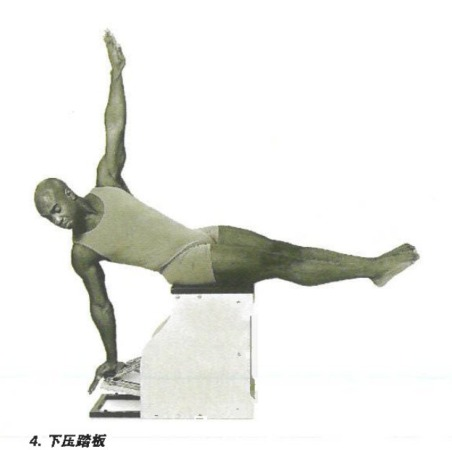
  - 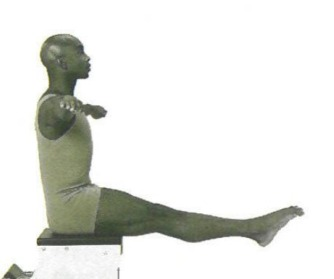
  - 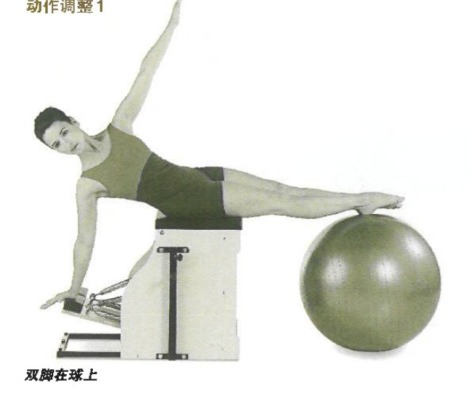

## 側體扭轉 (SIDE BODY TWST)

- 頁碼：p.168-171
- 難度：平衡椅
- 器械/章節：平衡椅
- 肌群分類：[[../muscles/chair-core-and-lumbopelvic-stability|核心與腰骨盆穩定]], [[../muscles/chair-spinal-articulation|脊椎活動]], [[../muscles/chair-scapular-stabilizers|肩胛與上背穩定]], [[../muscles/chair-arms-delts-pecs|手臂與胸肩]], [[../muscles/chair-hips-and-legs|髖與腿]], [[../muscles/chair-mobility-and-stretching|柔韌與伸展]]
- 摘要：側體扭轉：主要歸入核心與腰骨盆穩定、脊椎活動、肩胛與上背穩定、手臂與胸肩。
- OCR 原文摘錄：目標肌肉：以腹橫肌擠壓腹部，穩定腰骨盆部位；以深層骨盆底 肌輔助腹橫肌運動；向心收縮對側腹內斜肌和腹外斜肌，以旋轉 軀幹上部，面向踏板：向心收縮腹直肌和腹斜肌，以彎曲脊椎； 腿部抬高時，向心收縮髖屈肌群，並在腿部降低時離心收縮上述 肌肉；利用髖內收肌群保持雙腿全程併攏；利用豎脊肌中部拉伸 胸椎在V型姿勢；肩胛骨穩定肌群，尤其是支撐的一側
- 動作圖：
  - 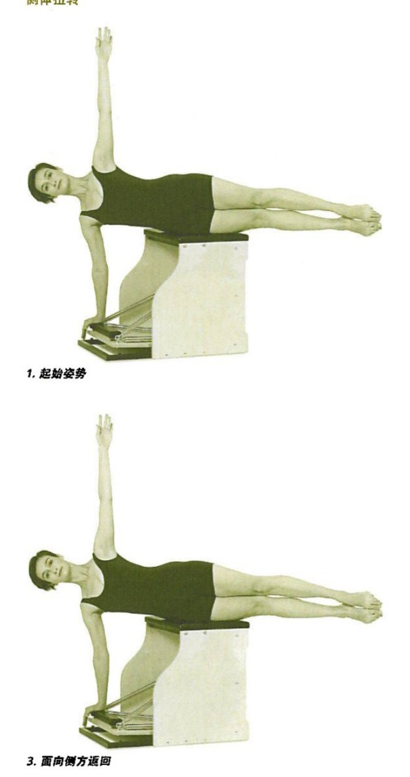
  - 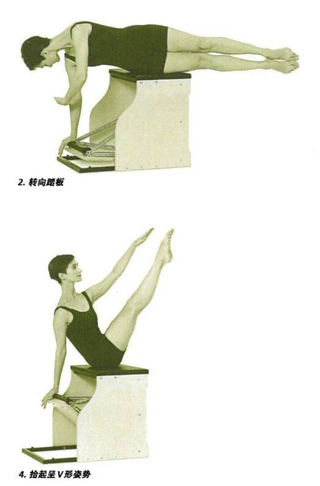
  - 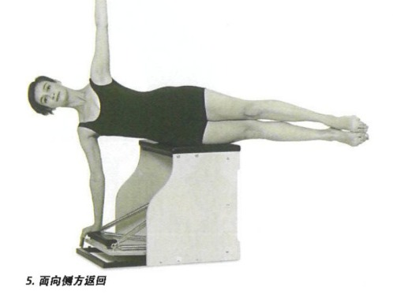
  - 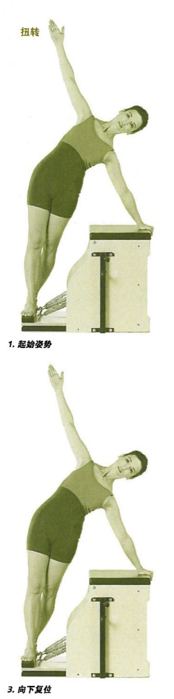
  - 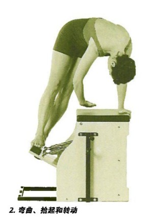
  - 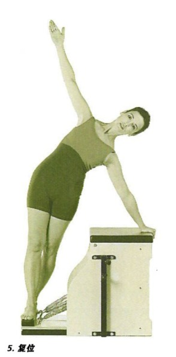
  - 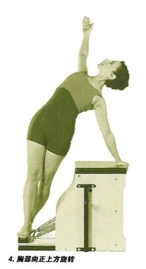
