# 普拉提塑身機初級動作索引

來源：[[../sources/reformer_beginner_source|普拉提塑身機初級 source note]]。

範圍：PDF 第 6-111 頁；已按要求跳過首 5 頁和末 5 頁。

## 腳部練習 (FOOTWORK)

- 頁碼：p.28-33
- 難度：塑身機初級
- 器械/章節：腳踏桿、彈簧、頭墊
- 肌群分類：[[../muscles/reformer-beginner-core-and-lumbopelvic-stability|核心與腰骨盆穩定]], [[../muscles/reformer-beginner-spinal-articulation|脊椎活動]], [[../muscles/reformer-beginner-scapular-stabilizers|肩胛與上背穩定]], [[../muscles/reformer-beginner-arms-delts-pecs|手臂與胸肩]], [[../muscles/reformer-beginner-hips-and-legs|髖與腿]], [[../muscles/reformer-beginner-mobility-and-stretching|柔韌與伸展]]
- 摘要：腳部練習：主要歸入核心與腰骨盆穩定、脊椎活動、肩胛與上背穩定、手臂與胸肩；依 OCR 原理/目標肌肉段落整理。
- OCR 原文摘錄：以腹橫肌擠壓腹部，穩定腰骨盆部位；以深層盆底 1.交替式呼吸［練習1-4］。吸氣，推開滑墊：呼氣，復位。吸氣 肌輔助腹橫肌運動；利用腹斜肌防止脊椎伸展；利用腹斜肌 時調動腹模肌，同時保持腰骨盆部位穩定，以增加練習難度。 和多裂肌阻止身體旋轉；利用股內側肌和股外側肌適度牽拉 髕骨 2. 有節奏的小幅運動［練習1-4］。半程推動滑墊，全程復位，著 重練習復位時配合呼氣。鍛鍊骨盆保持中立位正姿的能力，著重 ［11 伸展時向心收縮髖伸肌群、股四頭肌和內收肌群，復位時離 從髖伸肌群發力，以推開滑墊，並在滑墊復位時起到“制動”作用。 心收縮上述肌肉；利用外旋肌群保持髖部旋轉 適合運動範圍有限的練習者。 ［2］ 等長收縮內收肌群，以保持雙腿併攏：伸展時向心收縮髖伸肌 3. 關節活動末段的有節奏運動［練習1-4］。將滑墊完全推
- 動作圖：
  - 
  - 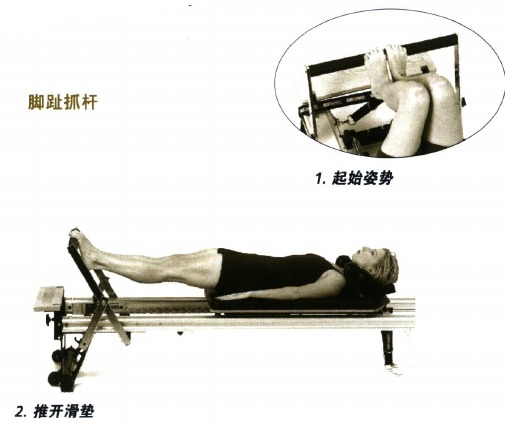
  - 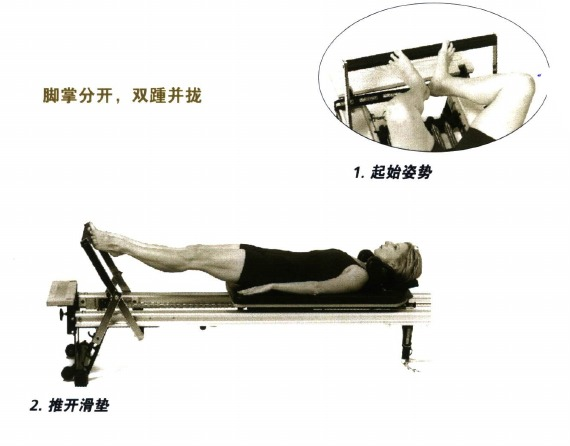
  - 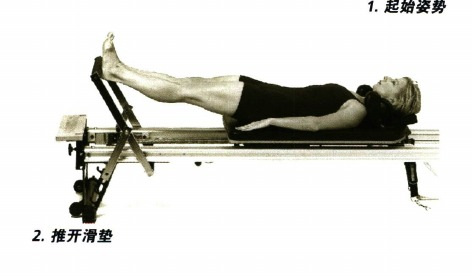
  - 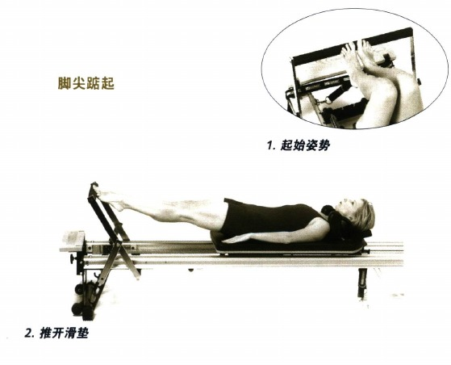
  - 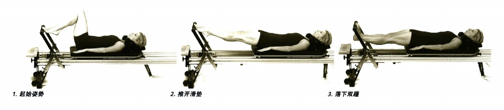
  - 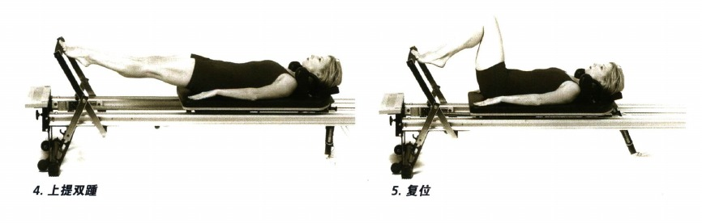

## 第二種姿勢 (SECOND POSITION)

- 頁碼：p.34-35
- 難度：塑身機初級
- 器械/章節：腳踏桿、彈簧、頭墊
- 肌群分類：[[../muscles/reformer-beginner-core-and-lumbopelvic-stability|核心與腰骨盆穩定]], [[../muscles/reformer-beginner-spinal-articulation|脊椎活動]], [[../muscles/reformer-beginner-arms-delts-pecs|手臂與胸肩]], [[../muscles/reformer-beginner-hips-and-legs|髖與腿]], [[../muscles/reformer-beginner-mobility-and-stretching|柔韌與伸展]]
- 摘要：第二種姿勢：主要歸入核心與腰骨盆穩定、脊椎活動、手臂與胸肩、髖與腿；依 OCR 原理/目標肌肉段落整理。
- OCR 原文摘錄：以腹橫肌擠壓腹部，穩定腰骨盆部位；以深層盆底 作用。適合運動範圍有限的練習者。 肌輔助腹橫肌運動；利用腹斜肌阻止脊椎伸展；利用腹斜肌和 多裂肌阻止身體旋轉；雙腿伸展時，向心收縮髖伸肌群和股四 3. 關節活動末段的有節奏運動［練習1-3］。將滑墊完全推開，然 頭肌，雙腿復位時，離心收縮髖伸肌群和股四頭肌；利用雙踝 後略微復位，推開滑墊時注意配合呼氣。著重利用股骨肌群向上 背屈肌保持雙腳姿勢；利用股內側肌群和股外側肌適當鍛鍊 拉動髕骨，並以膝窩部位提供支撐。適合運動範圍有限的練習者， 髕骨 且有助於改善膝部不穩的情況。 ［2］ 利用外旋肌群進行髖部旋轉 4.靈活膠帶 訓練器［練習1與練習3］。將靈活膠帶訓練器繞於大 腿，位置略高於膝部，使髖外展肌群始終參與運動。 ［3］ 利用內旋肌群進行髖部旋轉
- 動作圖：
  - 
  - 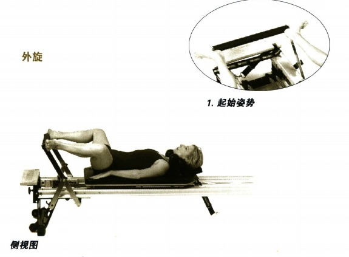
  - 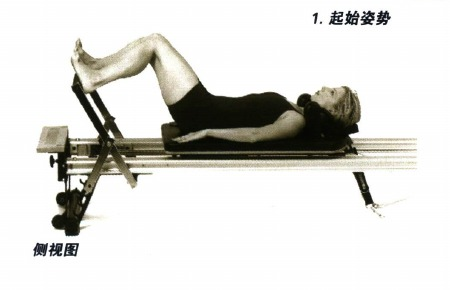

## 單腿練習 (SINGLE LEG)

- 頁碼：p.36-39
- 難度：塑身機初級
- 器械/章節：腳踏桿、彈簧、頭墊
- 肌群分類：[[../muscles/reformer-beginner-core-and-lumbopelvic-stability|核心與腰骨盆穩定]], [[../muscles/reformer-beginner-spinal-articulation|脊椎活動]], [[../muscles/reformer-beginner-arms-delts-pecs|手臂與胸肩]], [[../muscles/reformer-beginner-hips-and-legs|髖與腿]], [[../muscles/reformer-beginner-mobility-and-stretching|柔韌與伸展]]
- 摘要：單腿練習：主要歸入核心與腰骨盆穩定、脊椎活動、手臂與胸肩、髖與腿；依 OCR 原理/目標肌肉段落整理。
- OCR 原文摘錄：目標肌肉：以腹橫肌擠壓腹部，穩定腰骨盆部位；以深層盆底肌 輔助腹橫肌運動；利用腹斜肌阻止脊椎伸展；利用腹斜肌和多裂 肌阻止身體旋轉；支撐腿伸展時，向心收縮髖伸肌群和股四頭肌， 支撐腿復位時，離心收縮髖伸肌群和股四頭肌；利用股內側肌和 股外側肌適當鍛鍊髕骨
- 動作圖：
  - 
  - 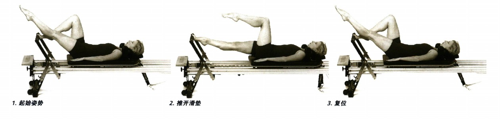
  - 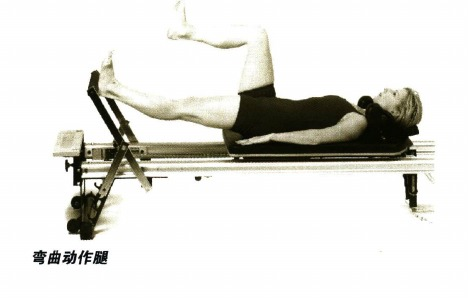
  - 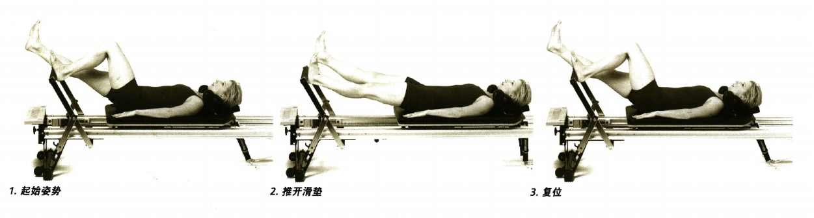
  - 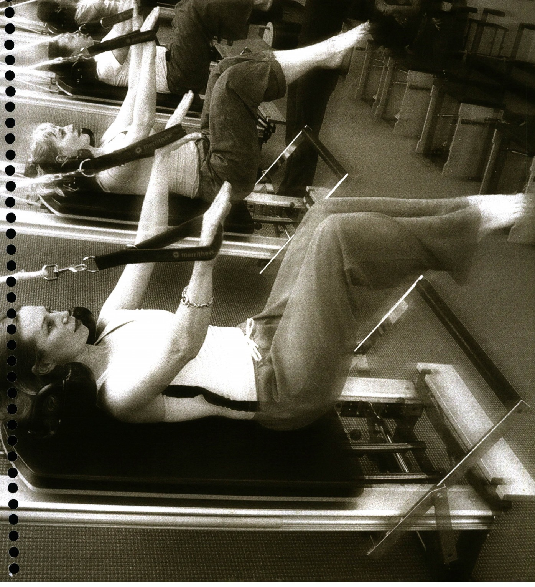

## 百次拍擊 (HUNDRED)

- 頁碼：p.40-41
- 難度：塑身機初級
- 器械/章節：腳踏桿、彈簧、頭墊、拉環與繩索
- 肌群分類：[[../muscles/reformer-beginner-core-and-lumbopelvic-stability|核心與腰骨盆穩定]], [[../muscles/reformer-beginner-spinal-articulation|脊椎活動]], [[../muscles/reformer-beginner-scapular-stabilizers|肩胛與上背穩定]], [[../muscles/reformer-beginner-lat-teres-pulling-chain|背闊肌與拉力鏈]], [[../muscles/reformer-beginner-arms-delts-pecs|手臂與胸肩]], [[../muscles/reformer-beginner-hips-and-legs|髖與腿]], [[../muscles/reformer-beginner-mobility-and-stretching|柔韌與伸展]]
- 摘要：百次拍擊：主要歸入核心與腰骨盆穩定、脊椎活動、肩胛與上背穩定、背闊肌與拉力鏈；依 OCR 原理/目標肌肉段落整理。
- OCR 原文摘錄：目標肌肉：以腹橫肌擠壓腹部，穩定腰骨盆部位；以深層盆底肌 輔助腹橫肌運動：向心收縮腹直肌和腹斜肌，讓胸椎彎曲，並等 長收縮腹直肌和腹斜肌，保持胸椎彎曲和骨盆穩定；利用背闊肌 接下來⋯ 和胸大肌對抗後部阻力，穩定雙臂；等長收縮髖屈肌群、內收肌 吸氣 群和股四頭肌，保持雙腿姿勢；肩胛骨穩定肌群 默數五個數，保持上身彎曲，肩胛骨和骨盆保持穩定，雙 臂小幅上下有節奏的地運動
- 動作圖：
  - 
  - 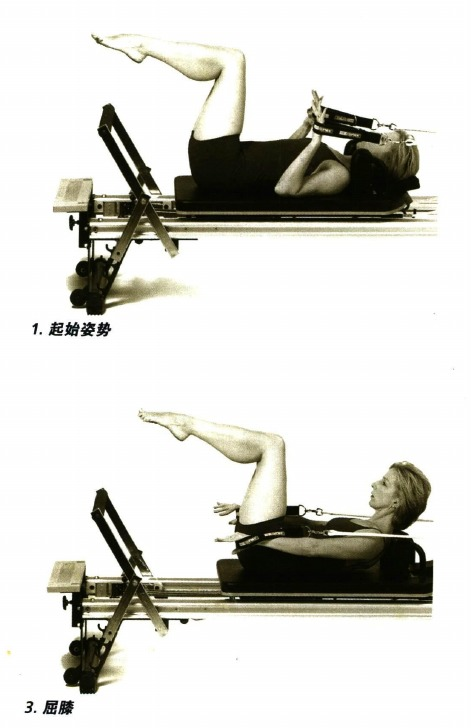
  - 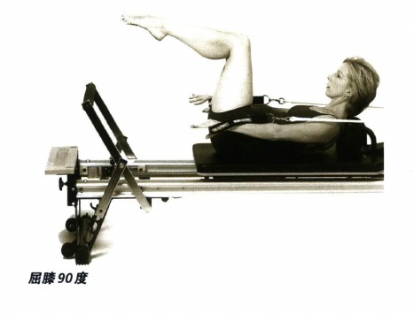

## 屈伸練習 (BEND & STRETCH)

- 頁碼：p.42-43
- 難度：塑身機初級
- 器械/章節：腳踏桿、彈簧、頭墊、拉環與繩索
- 肌群分類：[[../muscles/reformer-beginner-core-and-lumbopelvic-stability|核心與腰骨盆穩定]], [[../muscles/reformer-beginner-spinal-articulation|脊椎活動]], [[../muscles/reformer-beginner-arms-delts-pecs|手臂與胸肩]], [[../muscles/reformer-beginner-hips-and-legs|髖與腿]], [[../muscles/reformer-beginner-mobility-and-stretching|柔韌與伸展]]
- 摘要：屈伸練習：主要歸入核心與腰骨盆穩定、脊椎活動、手臂與胸肩、髖與腿；依 OCR 原理/目標肌肉段落整理。
- OCR 原文摘錄：以腹橫肌擠壓腹部，穩定腰骨盆部位；以深層盆底肌 輔助腹橫肌運動；向心收縮腹斜肌，使腰椎下沉並穩定骨盆；利
- 動作圖：
  - 
  - 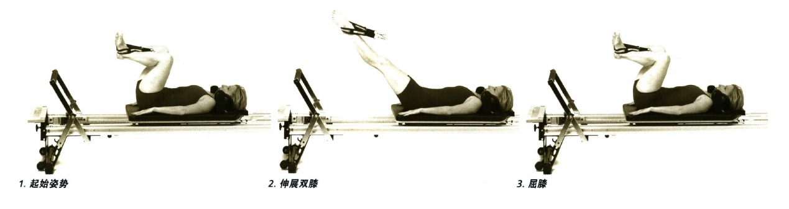
  - 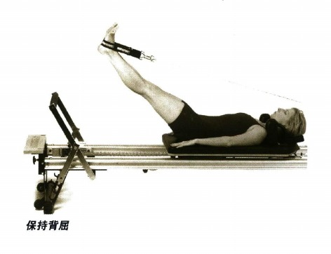
  - 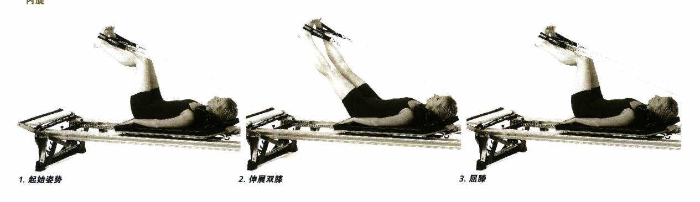

## 抬腿與放腿 (LFT & LOWER)

- 頁碼：p.44-45
- 難度：塑身機初級
- 器械/章節：腳踏桿、彈簧、頭墊、拉環與繩索
- 肌群分類：[[../muscles/reformer-beginner-core-and-lumbopelvic-stability|核心與腰骨盆穩定]], [[../muscles/reformer-beginner-spinal-articulation|脊椎活動]], [[../muscles/reformer-beginner-arms-delts-pecs|手臂與胸肩]], [[../muscles/reformer-beginner-hips-and-legs|髖與腿]], [[../muscles/reformer-beginner-mobility-and-stretching|柔韌與伸展]]
- 摘要：抬腿與放腿：主要歸入核心與腰骨盆穩定、脊椎活動、手臂與胸肩、髖與腿；依 OCR 原理/目標肌肉段落整理。
- OCR 原文摘錄：以腹橫肌擠壓腹部，穩定腰骨盆部位；以深層盆底肌 輔助腹橫肌運動；向心收縮腹斜肌，使腰椎下沉並穩定骨盆；利 用腹斜肌和多裂肌防止骨盆旋轉；抬腿時，離心收縮髖伸肌群， 放腿時，向心收縮髖伸肌群；等長收縮內收肌群以保持雙腿併攏 ［2］ 利用外旋肌群進行髖部旋轉
- 動作圖：
  - 
  - 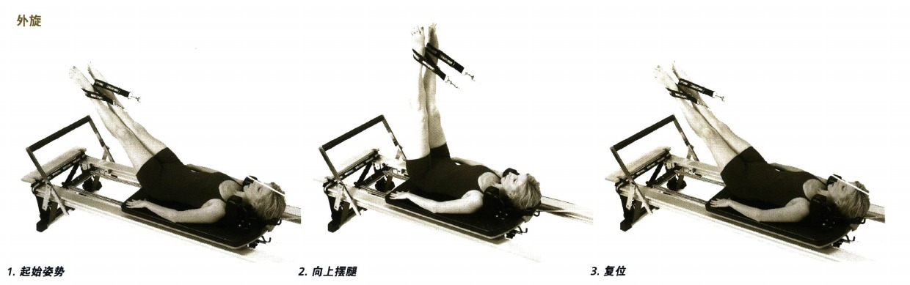

## 伸展內收肌 (ADDUCTOR STRETCH)

- 頁碼：p.46
- 難度：塑身機初級
- 器械/章節：腳踏桿、彈簧、頭墊、拉環與繩索
- 肌群分類：[[../muscles/reformer-beginner-core-and-lumbopelvic-stability|核心與腰骨盆穩定]], [[../muscles/reformer-beginner-spinal-articulation|脊椎活動]], [[../muscles/reformer-beginner-arms-delts-pecs|手臂與胸肩]], [[../muscles/reformer-beginner-hips-and-legs|髖與腿]], [[../muscles/reformer-beginner-mobility-and-stretching|柔韌與伸展]]
- 摘要：伸展內收肌：主要歸入核心與腰骨盆穩定、脊椎活動、手臂與胸肩、髖與腿；依 OCR 原理/目標肌肉段落整理。
- OCR 原文摘錄：以腹橫肌擠壓腹部，穩定腰骨盆部位；以深層盆底肌 輔助腹橫肌運動；雙腿分開時，離心收縮內收肌群，併攏時向心 練習 收縮；雙腿分開和併攏時等長運動髖伸肌群 開始
- 動作圖：
  - 

## 脊椎捲曲準備動作 (SHORT SPINE PREP)

- 頁碼：p.47-49
- 難度：塑身機初級
- 器械/章節：腳踏桿、彈簧、頭墊、拉環與繩索
- 肌群分類：[[../muscles/reformer-beginner-core-and-lumbopelvic-stability|核心與腰骨盆穩定]], [[../muscles/reformer-beginner-spinal-articulation|脊椎活動]], [[../muscles/reformer-beginner-arms-delts-pecs|手臂與胸肩]], [[../muscles/reformer-beginner-hips-and-legs|髖與腿]], [[../muscles/reformer-beginner-mobility-and-stretching|柔韌與伸展]]
- 摘要：脊椎捲曲準備動作：主要歸入核心與腰骨盆穩定、脊椎活動、手臂與胸肩、髖與腿；依頁面標題、動作說明與動作圖整理。
- 動作圖：
  - 
  - 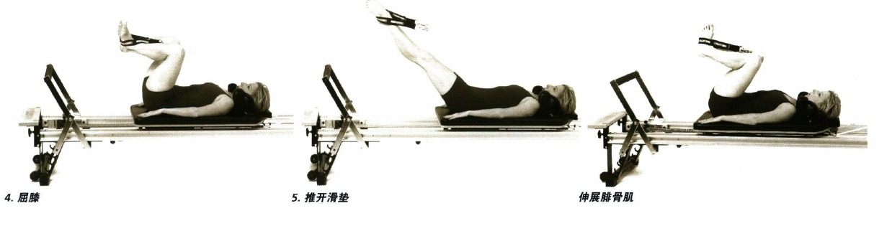
  - 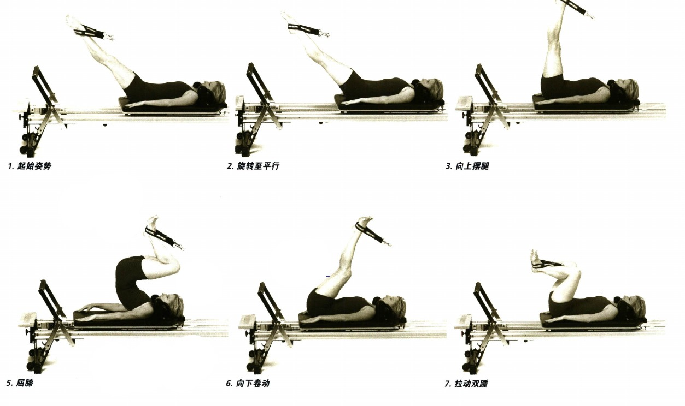
  - 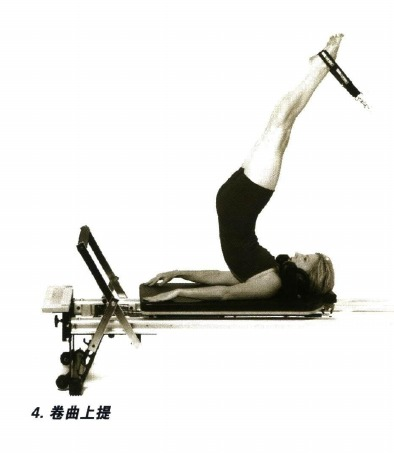
  - 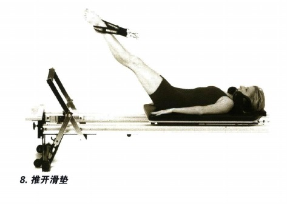
  - 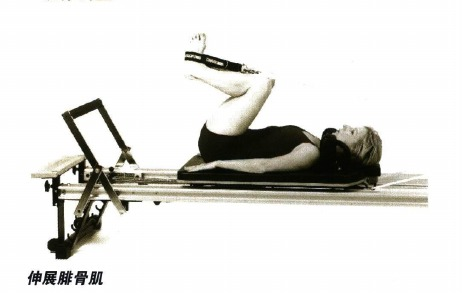

## 中背部系列動作 (MIDBACK SERIES)

- 頁碼：p.50-54
- 難度：塑身機初級
- 器械/章節：腳踏桿、彈簧、頭墊、拉環與繩索
- 肌群分類：[[../muscles/reformer-beginner-core-and-lumbopelvic-stability|核心與腰骨盆穩定]], [[../muscles/reformer-beginner-spinal-articulation|脊椎活動]], [[../muscles/reformer-beginner-scapular-stabilizers|肩胛與上背穩定]], [[../muscles/reformer-beginner-arms-delts-pecs|手臂與胸肩]], [[../muscles/reformer-beginner-hips-and-legs|髖與腿]], [[../muscles/reformer-beginner-mobility-and-stretching|柔韌與伸展]]
- 摘要：中背部系列動作：主要歸入核心與腰骨盆穩定、脊椎活動、肩胛與上背穩定、手臂與胸肩；依 OCR 原理/目標肌肉段落整理。
- OCR 原文摘錄：以腹橫肌擠壓腹部，穩定腰骨盆部位；以深層盆底肌 輔助腹橫肌運動；等長收縮腹斜肌，以保持腰椎下沉；肩胛骨
- 動作圖：
  - 
  - 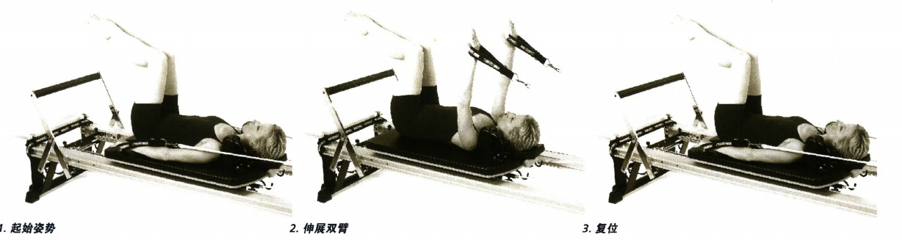
  - 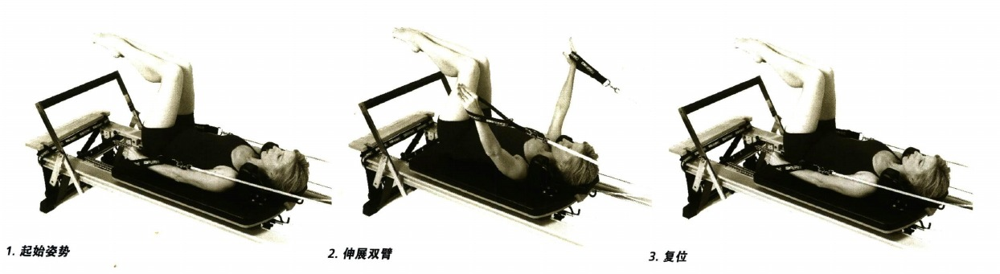
  - 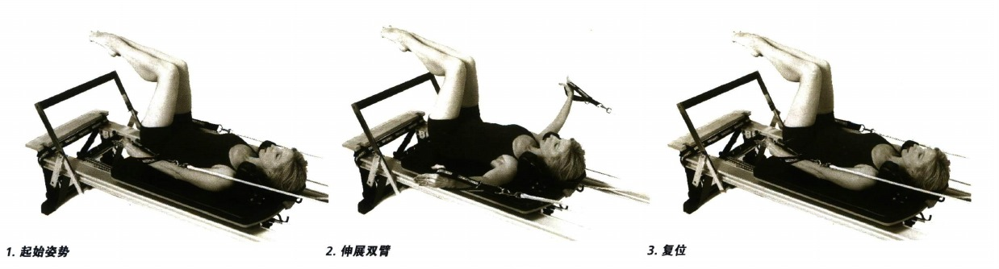
  - 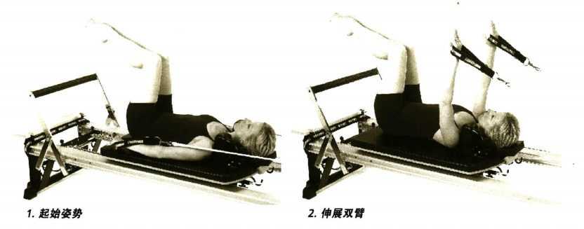
  - 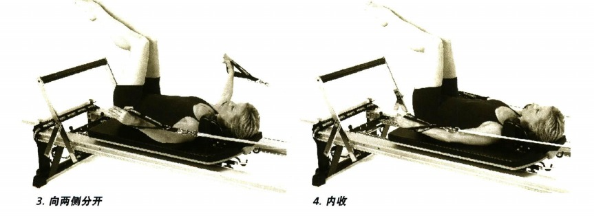

## 後劃準備動作 (BACK ROWING PREPS)

- 頁碼：p.55-63
- 難度：塑身機初級
- 器械/章節：腳踏桿、彈簧、頭墊、拉環與繩索
- 肌群分類：[[../muscles/reformer-beginner-core-and-lumbopelvic-stability|核心與腰骨盆穩定]], [[../muscles/reformer-beginner-spinal-articulation|脊椎活動]], [[../muscles/reformer-beginner-scapular-stabilizers|肩胛與上背穩定]], [[../muscles/reformer-beginner-lat-teres-pulling-chain|背闊肌與拉力鏈]], [[../muscles/reformer-beginner-arms-delts-pecs|手臂與胸肩]], [[../muscles/reformer-beginner-hips-and-legs|髖與腿]], [[../muscles/reformer-beginner-mobility-and-stretching|柔韌與伸展]]
- 摘要：後劃準備動作：主要歸入核心與腰骨盆穩定、脊椎活動、肩胛與上背穩定、背闊肌與拉力鏈；依 OCR 原理/目標肌肉段落整理。
- OCR 原文摘錄：以腹橫肌擠壓腹部，穩定腰骨盆部位；以深層盆底肌 輔助腹橫肌運動；利用腹斜肌和豎脊肌將脊椎穩定在中立位，前
- 動作圖：
  - 
  - 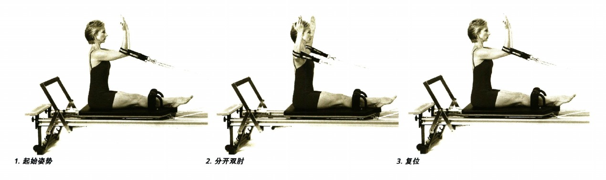
  - 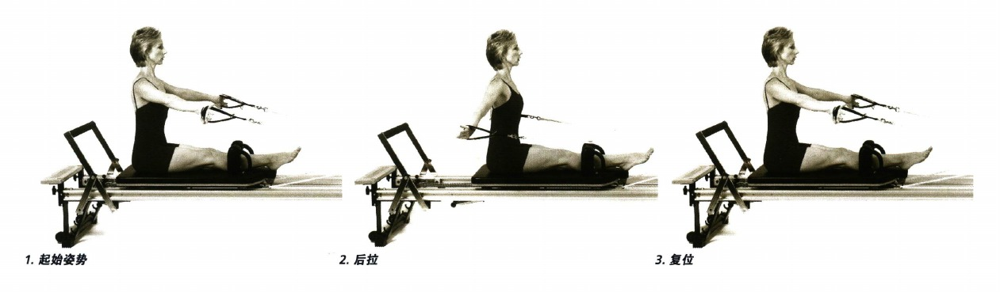
  - 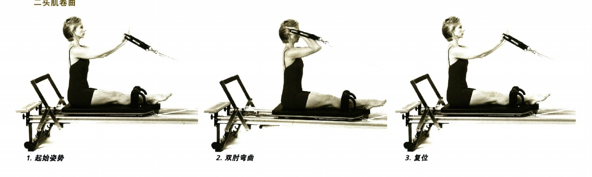
  - 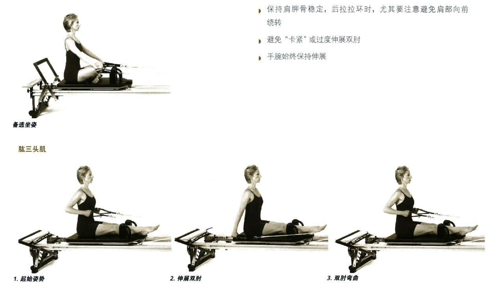
  - 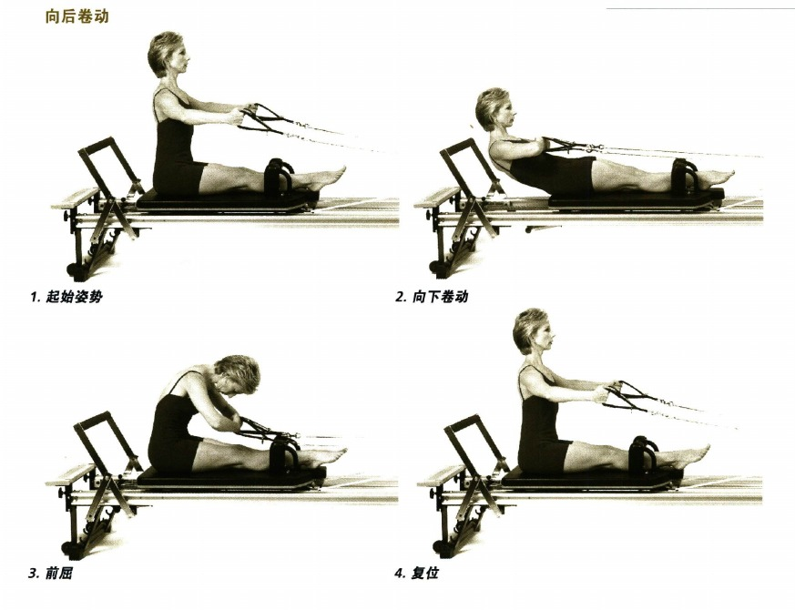
  - 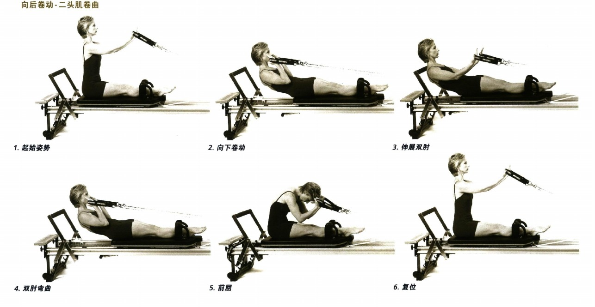
  - 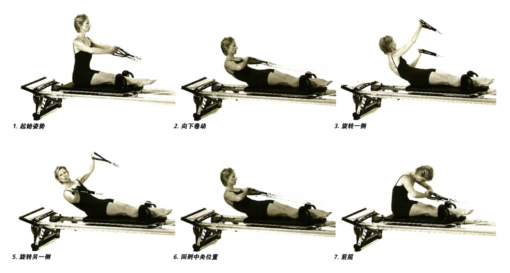
  - 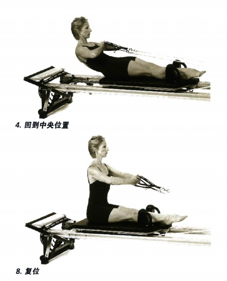

## 側坐手臂準備動作 (SIDE ARM PREPS SITTING)

- 頁碼：p.64-67
- 難度：塑身機初級
- 器械/章節：腳踏桿、彈簧、拉環與繩索
- 肌群分類：[[../muscles/reformer-beginner-core-and-lumbopelvic-stability|核心與腰骨盆穩定]], [[../muscles/reformer-beginner-spinal-articulation|脊椎活動]], [[../muscles/reformer-beginner-scapular-stabilizers|肩胛與上背穩定]], [[../muscles/reformer-beginner-arms-delts-pecs|手臂與胸肩]], [[../muscles/reformer-beginner-hips-and-legs|髖與腿]]
- 摘要：側坐手臂準備動作：主要歸入核心與腰骨盆穩定、脊椎活動、肩胛與上背穩定、手臂與胸肩；依 OCR 原理/目標肌肉段落整理。
- OCR 原文摘錄：以腹橫肌擠壓腹部，穩定腰骨盆部位；以深層盆底肌 1.備選坐姿。為緩解盤腿帶來的不適，可坐在泡沫墊、軟墊延 輔助腹橫肌運動；利用腹斜肌和豎脊肌將脊椎穩定在中立位；利 伸平臺或塑身機盒子上，雙腳放在滑墊上，或者仍然坐在滑墊 用多裂肌和腹斜肌防止軀幹旋轉；利用腹斜肌和豎脊肌防止軀幹 上，雙腳伸出滑墊，雙腿併攏。使用康復型塑身機練習此動作時， 旋轉；肩胛骨穩定肌群 雙腳不會拖到地上，因此練習效果最佳。 ［1］ 向心收縮肩胛下肌，以使肱部內旋，肱部復位時，離心收縮 肩胛下肌 • ［2］ 向心收縮肩胛棘下肌和小圓肌，以使肱部外旋，肱部復位時， 離心收縮上述肌肉 ［3］ 向心收縮背闊肌、大圓肌和胸大肌，以帶動肱部內收，肱部 復位時，離心收縮上述肌肉 • ［4］ 向心收縮三角肌和棘上肌，以使肱部外展，肱部復位時， 離心收縮上述
- 動作圖：
  - 
  - 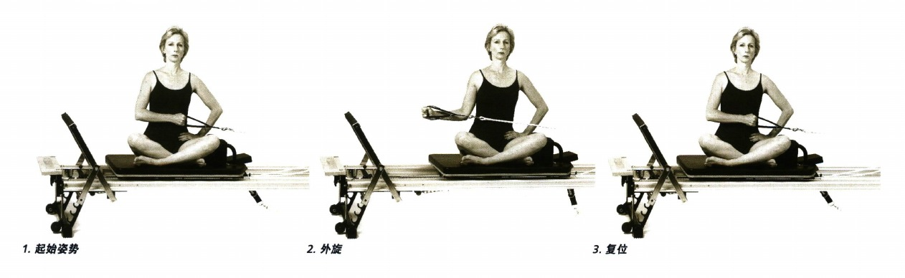
  - 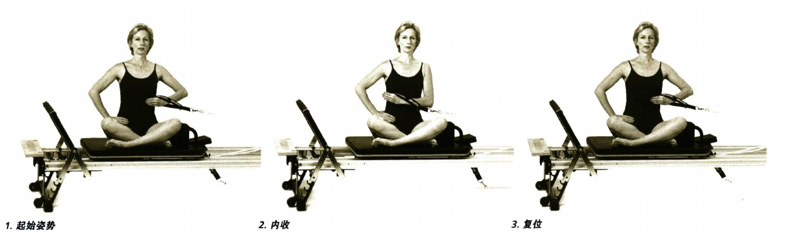
  - 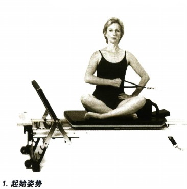
  - 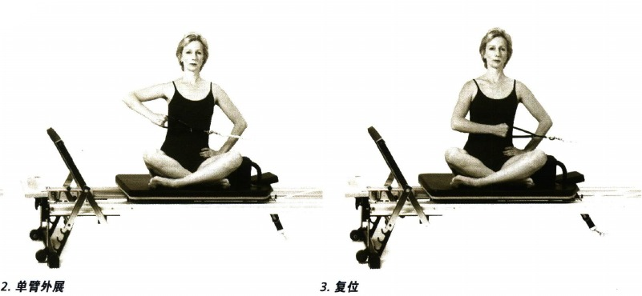

## 側轉坐姿 (SIDE TWIST SITTING)

- 頁碼：p.68-69
- 難度：塑身機初級
- 器械/章節：腳踏桿、彈簧、拉環與繩索、塑身機盒子
- 肌群分類：[[../muscles/reformer-beginner-core-and-lumbopelvic-stability|核心與腰骨盆穩定]], [[../muscles/reformer-beginner-spinal-articulation|脊椎活動]], [[../muscles/reformer-beginner-scapular-stabilizers|肩胛與上背穩定]], [[../muscles/reformer-beginner-hips-and-legs|髖與腿]], [[../muscles/reformer-beginner-mobility-and-stretching|柔韌與伸展]]
- 摘要：側轉坐姿：主要歸入核心與腰骨盆穩定、脊椎活動、肩胛與上背穩定、髖與腿；依頁面標題、動作說明與動作圖整理。
- 動作圖：
  - 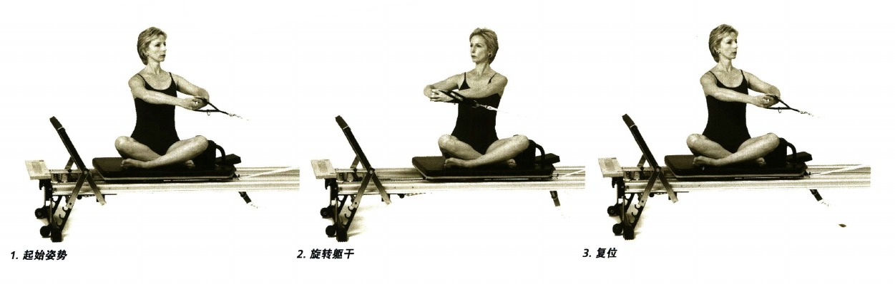
  - 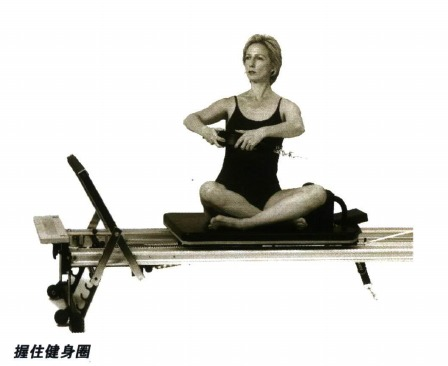

## 前劃準備動作 (FRONT ROWING PREPS)

- 頁碼：p.70-73
- 難度：塑身機初級
- 器械/章節：腳踏桿、彈簧、拉環與繩索
- 肌群分類：[[../muscles/reformer-beginner-core-and-lumbopelvic-stability|核心與腰骨盆穩定]], [[../muscles/reformer-beginner-spinal-articulation|脊椎活動]], [[../muscles/reformer-beginner-scapular-stabilizers|肩胛與上背穩定]], [[../muscles/reformer-beginner-lat-teres-pulling-chain|背闊肌與拉力鏈]], [[../muscles/reformer-beginner-arms-delts-pecs|手臂與胸肩]], [[../muscles/reformer-beginner-hips-and-legs|髖與腿]], [[../muscles/reformer-beginner-mobility-and-stretching|柔韌與伸展]]
- 摘要：前劃準備動作：主要歸入核心與腰骨盆穩定、脊椎活動、肩胛與上背穩定、背闊肌與拉力鏈；依 OCR 原理/目標肌肉段落整理。
- OCR 原文摘錄：以腹模肌擠壓腹部，穩定腰骨盆部位；以深層盆底肌 輔助腹橫肌運動；利用豎脊肌、腹直肌和腹斜肌使脊椎穩定在中 立位；後方阻力使腹肌得到鍛鍊：後方阻力也使肩胛骨穩定肌和 前鋸肌得到鍛鍊 ［1］ 向心收縮前三角肌和胸大肌，使雙肩屈曲；雙肩復位時， 離心收縮上述肌肉 ［21 向心收縮前三角肌和胸大肌，使雙臂水平內收，雙臂復位時， 離心收縮上述肌肉；利用三角肌使雙臂保持在固定高度 ［3］ 向心收縮肱三頭肌，使雙肘伸展，雙肘復位時，離心收縮肱 三頭肌：雙臂水平外展時，離心收縮前三角肌和胸大肌，雙臂水 平內收時，向心收縮上述肌肉
- 動作圖：
  - 
  - 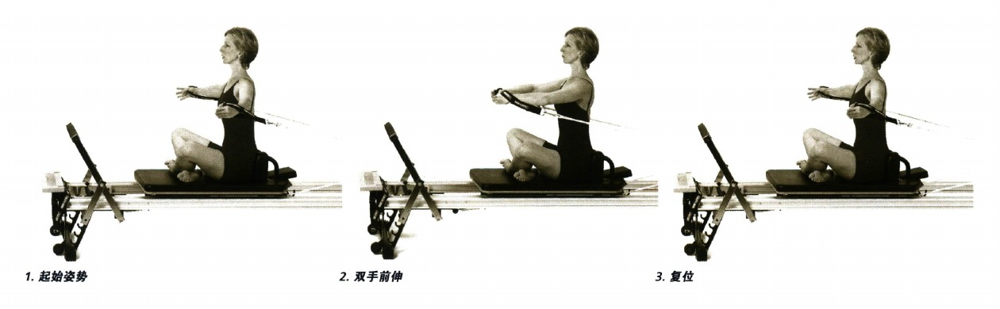
  - 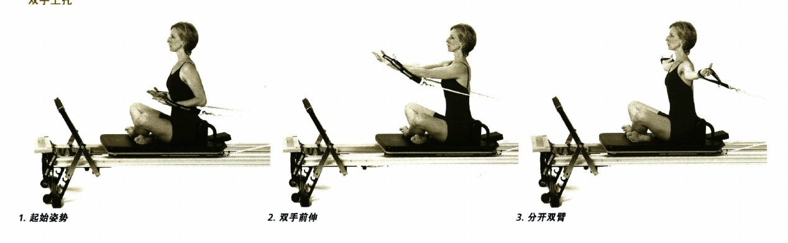
  - 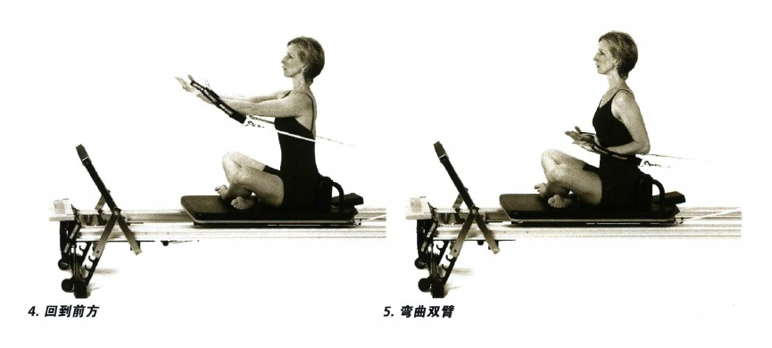

## 腹部按摩 (STOMACH MASSAGE)

- 頁碼：p.74-77
- 難度：塑身機初級
- 器械/章節：腳踏桿、彈簧
- 肌群分類：[[../muscles/reformer-beginner-core-and-lumbopelvic-stability|核心與腰骨盆穩定]], [[../muscles/reformer-beginner-spinal-articulation|脊椎活動]], [[../muscles/reformer-beginner-scapular-stabilizers|肩胛與上背穩定]], [[../muscles/reformer-beginner-arms-delts-pecs|手臂與胸肩]], [[../muscles/reformer-beginner-hips-and-legs|髖與腿]], [[../muscles/reformer-beginner-mobility-and-stretching|柔韌與伸展]]
- 摘要：腹部按摩：主要歸入核心與腰骨盆穩定、脊椎活動、肩胛與上背穩定、手臂與胸肩；依 OCR 原理/目標肌肉段落整理。
- OCR 原文摘錄：目標肌肉：以腹橫肌擠壓腹部，穩定腰骨盆部位；以深層盆底肌 輔助腹橫肌運動；利用腹直肌和腹斜肌，稍稍加大脊椎彎曲幅度； 脊伸肌群拉長
- 動作圖：
  - 
  - 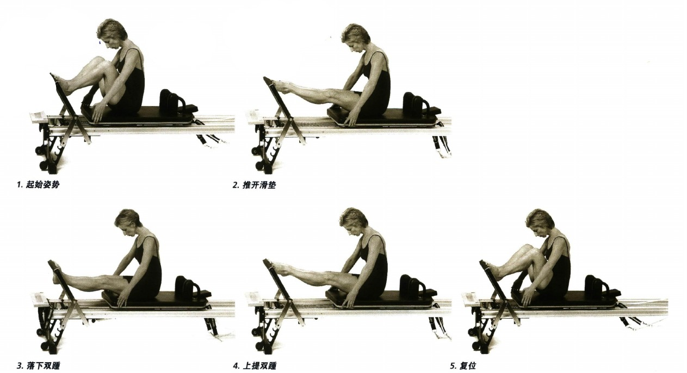
  - 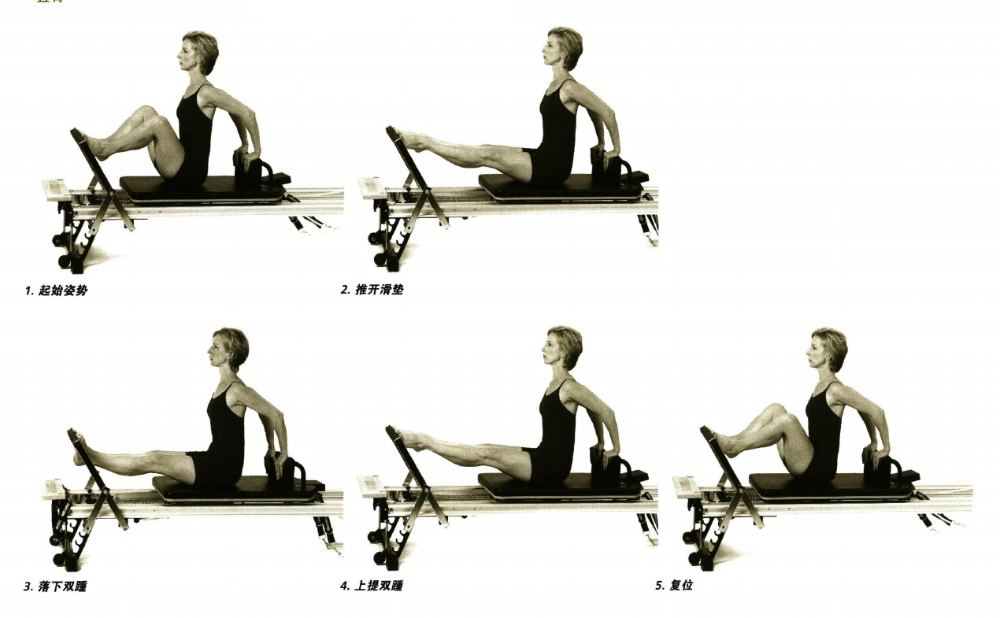
  - 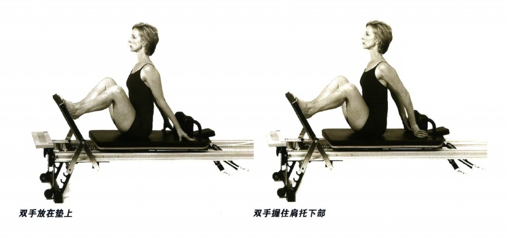

## 雙臂拉動拉環 盒子豎放 (ARMS PULLING STRAPS, LONG BOX)

- 頁碼：p.78-81
- 難度：塑身機初級
- 器械/章節：腳踏桿、彈簧、頭墊、拉環與繩索、塑身機盒子
- 肌群分類：[[../muscles/reformer-beginner-core-and-lumbopelvic-stability|核心與腰骨盆穩定]], [[../muscles/reformer-beginner-spinal-articulation|脊椎活動]], [[../muscles/reformer-beginner-scapular-stabilizers|肩胛與上背穩定]], [[../muscles/reformer-beginner-lat-teres-pulling-chain|背闊肌與拉力鏈]], [[../muscles/reformer-beginner-arms-delts-pecs|手臂與胸肩]], [[../muscles/reformer-beginner-hips-and-legs|髖與腿]], [[../muscles/reformer-beginner-mobility-and-stretching|柔韌與伸展]]
- 摘要：雙臂拉動拉環 盒子豎放：主要歸入核心與腰骨盆穩定、脊椎活動、肩胛與上背穩定、背闊肌與拉力鏈；依 OCR 原理/目標肌肉段落整理。
- OCR 原文摘錄：以腹橫肌擠壓腹部，穩定腰骨盆部位：以深層盆底肌 輔助腹橫肌運動；利用腹斜肌穩定腰骨盆部位；利用臀大肌和股 注意事項：將塑身機盒子豎放在滑墊上，一端頂住肩託。 後肌群使大腿骨穩定支撐骨盆；利用肩胛骨穩定肌群、下斜方肌 和背闊肌防止肩胛骨上提
- 動作圖：
  - 
  - 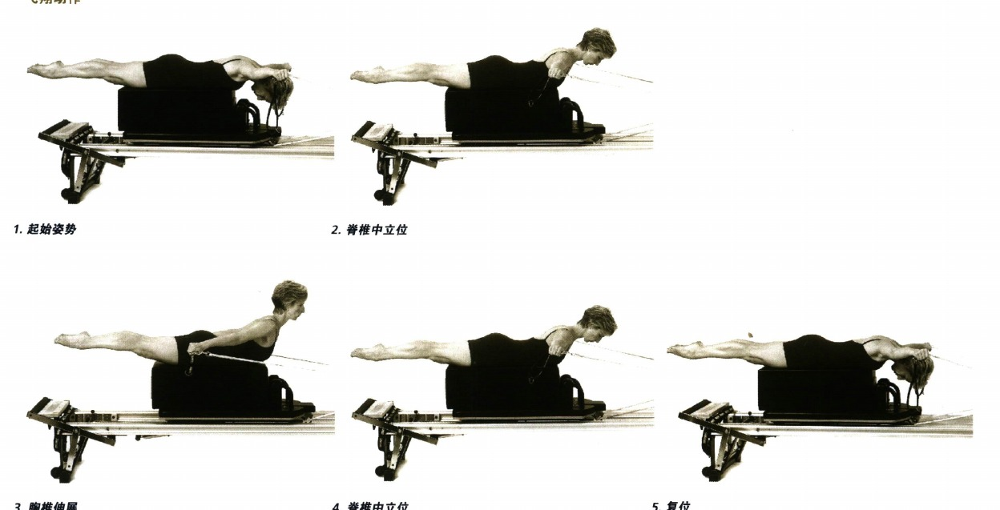
  - 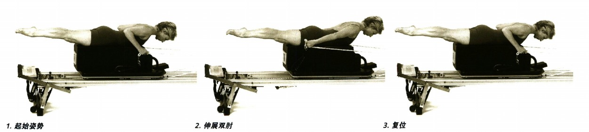
  - 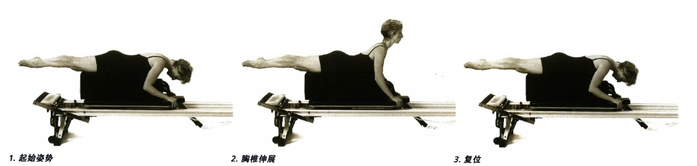

## 弓背 盒子橫放 (ROUND BACK, SHORT BOX)

- 頁碼：p.82
- 難度：塑身機初級
- 器械/章節：腳踏桿、彈簧、頭墊、塑身機盒子、腳帶
- 肌群分類：[[../muscles/reformer-beginner-core-and-lumbopelvic-stability|核心與腰骨盆穩定]], [[../muscles/reformer-beginner-spinal-articulation|脊椎活動]], [[../muscles/reformer-beginner-scapular-stabilizers|肩胛與上背穩定]], [[../muscles/reformer-beginner-hips-and-legs|髖與腿]], [[../muscles/reformer-beginner-mobility-and-stretching|柔韌與伸展]]
- 摘要：弓背 盒子橫放：主要歸入核心與腰骨盆穩定、脊椎活動、肩胛與上背穩定、髖與腿；依頁面標題、動作說明與動作圖整理。
- 動作圖：
  - 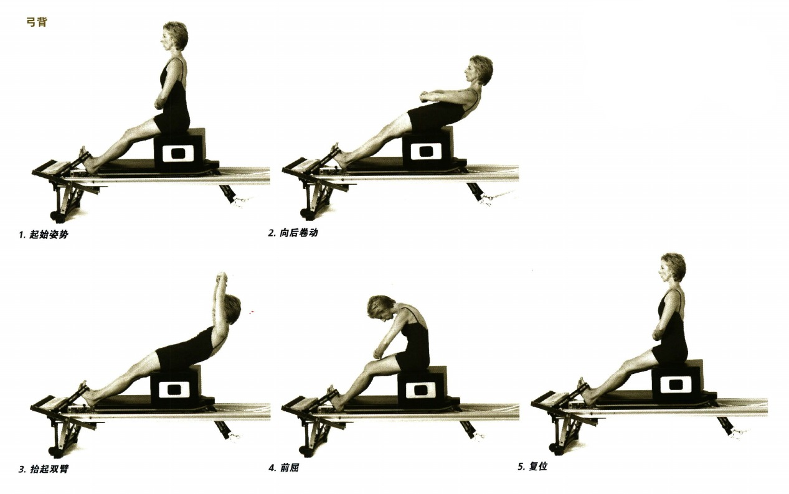

## 直背 盒子橫放 (STRAIGHT BACK, SHORT BOX)

- 頁碼：p.83-84
- 難度：塑身機初級
- 器械/章節：腳踏桿、彈簧、頭墊、塑身機盒子、腳帶
- 肌群分類：[[../muscles/reformer-beginner-core-and-lumbopelvic-stability|核心與腰骨盆穩定]], [[../muscles/reformer-beginner-spinal-articulation|脊椎活動]], [[../muscles/reformer-beginner-scapular-stabilizers|肩胛與上背穩定]], [[../muscles/reformer-beginner-hips-and-legs|髖與腿]], [[../muscles/reformer-beginner-mobility-and-stretching|柔韌與伸展]]
- 摘要：直背 盒子橫放：主要歸入核心與腰骨盆穩定、脊椎活動、肩胛與上背穩定、髖與腿；依 OCR 原理/目標肌肉段落整理。
- OCR 原文摘錄：日標肌肉：以腹橫肌擠壓腹部，穩定腰骨盆部位；以深層盆底肌 • 輔助腹橫肌運動；利用豎脊肌、腹直肌和腹斜肌穩定脊椎，尤其 要利用腹肌防止脊椎伸展：肩胛骨穩定肌群
- 動作圖：
  - 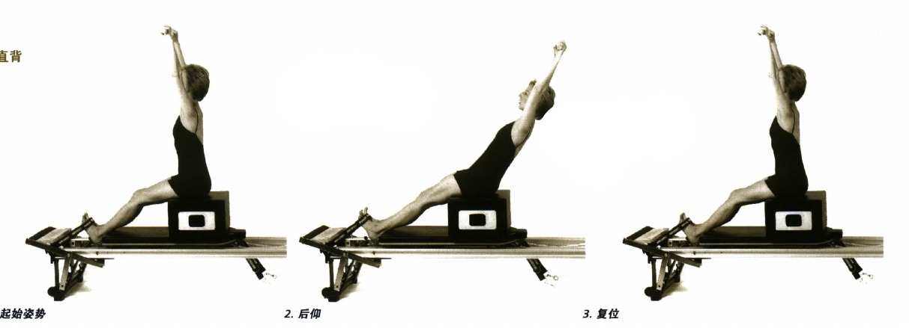
  - 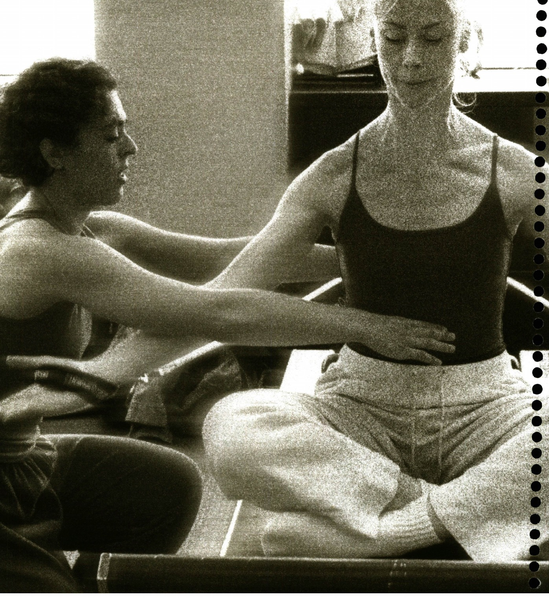

## 扭轉 盒子橫放 (TWIST, SHORT BOX)

- 頁碼：p.85
- 難度：塑身機初級
- 器械/章節：腳踏桿、彈簧、頭墊、塑身機盒子、腳帶
- 肌群分類：[[../muscles/reformer-beginner-core-and-lumbopelvic-stability|核心與腰骨盆穩定]], [[../muscles/reformer-beginner-spinal-articulation|脊椎活動]], [[../muscles/reformer-beginner-scapular-stabilizers|肩胛與上背穩定]], [[../muscles/reformer-beginner-arms-delts-pecs|手臂與胸肩]], [[../muscles/reformer-beginner-hips-and-legs|髖與腿]], [[../muscles/reformer-beginner-mobility-and-stretching|柔韌與伸展]]
- 摘要：扭轉 盒子橫放：主要歸入核心與腰骨盆穩定、脊椎活動、肩胛與上背穩定、手臂與胸肩；依 OCR 原理/目標肌肉段落整理。
- OCR 原文摘錄：並輔助脊椎的單獨旋轉。 目標肌肉：以腹橫肌擠壓腹部，穩定腰骨盆部位；以深層盆底肌 輔助腹橫肌運動；利用豎脊肌和腹斜肌使軀幹保持豎直；向心 收縮一側腹外斜肌和另一側腹內斜肌，以使脊椎轉動；肩胛骨 穩定肌群
- 動作圖：
  - 

## 樹姿 盒子橫放 (TREE, SHORT BOX)

- 頁碼：p.86-87
- 難度：塑身機初級
- 器械/章節：腳踏桿、彈簧、頭墊、塑身機盒子、腳帶
- 肌群分類：[[../muscles/reformer-beginner-core-and-lumbopelvic-stability|核心與腰骨盆穩定]], [[../muscles/reformer-beginner-spinal-articulation|脊椎活動]], [[../muscles/reformer-beginner-scapular-stabilizers|肩胛與上背穩定]], [[../muscles/reformer-beginner-hips-and-legs|髖與腿]], [[../muscles/reformer-beginner-mobility-and-stretching|柔韌與伸展]]
- 摘要：樹姿 盒子橫放：主要歸入核心與腰骨盆穩定、脊椎活動、肩胛與上背穩定、髖與腿；依頁面標題、動作說明與動作圖整理。
- 動作圖：
  - 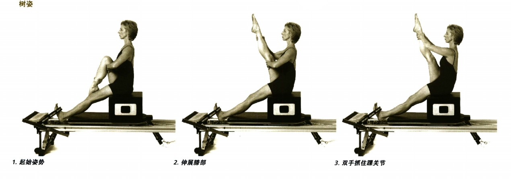
  - 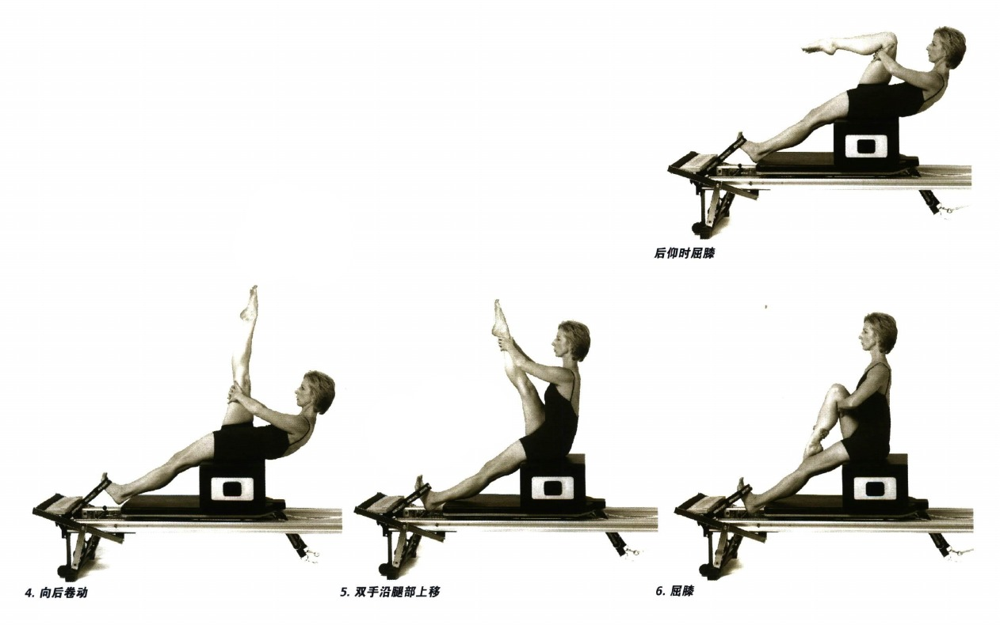

## 大象姿 (ELEPHANT)

- 頁碼：p.88-89
- 難度：塑身機初級
- 器械/章節：腳踏桿、彈簧
- 肌群分類：[[../muscles/reformer-beginner-core-and-lumbopelvic-stability|核心與腰骨盆穩定]], [[../muscles/reformer-beginner-spinal-articulation|脊椎活動]], [[../muscles/reformer-beginner-scapular-stabilizers|肩胛與上背穩定]], [[../muscles/reformer-beginner-arms-delts-pecs|手臂與胸肩]], [[../muscles/reformer-beginner-hips-and-legs|髖與腿]], [[../muscles/reformer-beginner-mobility-and-stretching|柔韌與伸展]]
- 摘要：大象姿：主要歸入核心與腰骨盆穩定、脊椎活動、肩胛與上背穩定、手臂與胸肩；依 OCR 原理/目標肌肉段落整理。
- OCR 原文摘錄：重複練習10次。 目標肌肉：以腹橫肌擠壓腹部，穩定腰骨盆部位；以深層盆底肌 輔助腹橫肌運動；等長收縮腹直肌和腹斜肌，以使軀幹彎曲並 保持穩定；向心收縮髖伸肌群，以推開滑墊，滑墊復位時，離 心收縮髖伸肌群；向心收縮髖屈肌群，以使滑墊復位；肩胛骨穩 定肌群
- 動作圖：
  - 
  - 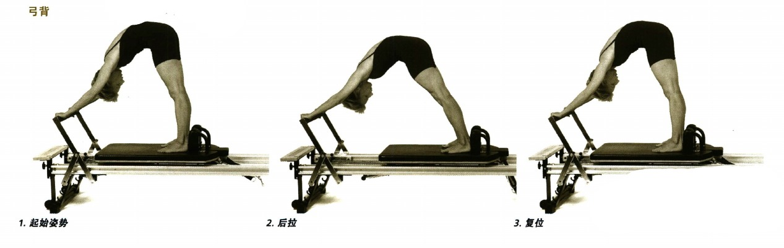
  - 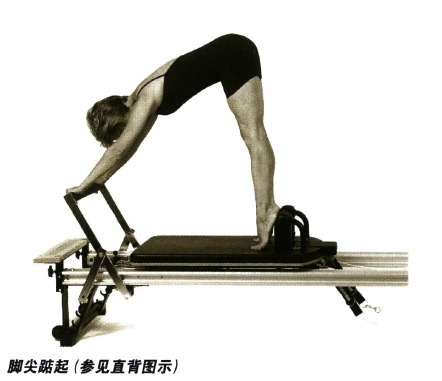
  - 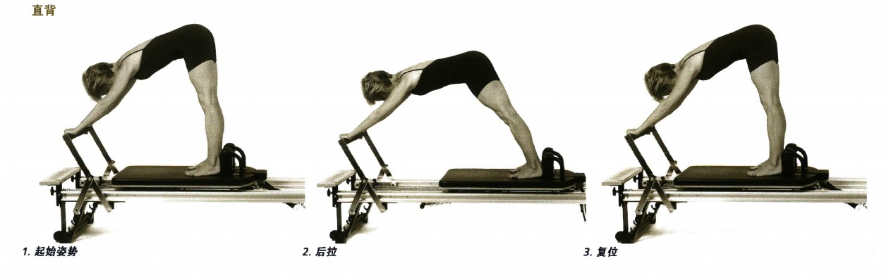

## 美人魚姿 (MERMAID)

- 頁碼：p.90-91
- 難度：塑身機初級
- 器械/章節：腳踏桿、彈簧
- 肌群分類：[[../muscles/reformer-beginner-core-and-lumbopelvic-stability|核心與腰骨盆穩定]], [[../muscles/reformer-beginner-spinal-articulation|脊椎活動]], [[../muscles/reformer-beginner-scapular-stabilizers|肩胛與上背穩定]], [[../muscles/reformer-beginner-arms-delts-pecs|手臂與胸肩]], [[../muscles/reformer-beginner-hips-and-legs|髖與腿]], [[../muscles/reformer-beginner-mobility-and-stretching|柔韌與伸展]]
- 摘要：美人魚姿：主要歸入核心與腰骨盆穩定、脊椎活動、肩胛與上背穩定、手臂與胸肩；依 OCR 原理/目標肌肉段落整理。
- OCR 原文摘錄：練習 目標肌肉：以腹橫肌擠壓腹部，穩定腰骨盆部位；以深層盆底肌 吸氣 肩胛骨保持穩定，將搭在肩託上的手舉過頭頂。 輔助腹橫肌運動；利用豎脊肌和腹斜肌防止脊椎前屈或伸展；利 呼氣 脊椎向腳踏杆方向側屈。同時，肩胛骨保持穩定，外展扶 用腹斜肌和多裂肌阻止身體旋轉；脊椎側屈時，向心收縮同側的 著腳踏杆的手臂，推開滑墊。動作臂保持伸過頭頂。 腹內外斜肌，離心收縮另一側的腹內外斜肌：推開滑墊時，向心 收縮支撐側的三角肌；肩胛骨穩定肌群 吸氣 收回扶著腳踏杆的手臂，帶動滑墊復位，同時脊椎恢復豎 直。動作臂保持伸過頭頂
- 動作圖：
  - 
  - 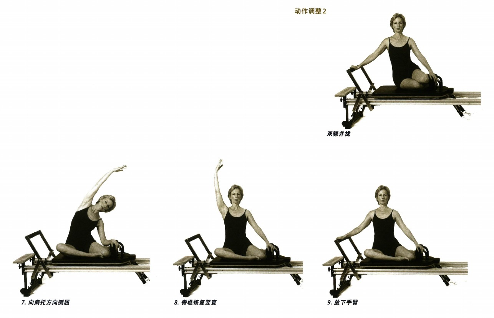

## 雙腿畫弧 (LEG CIRCLES)

- 頁碼：p.92-94
- 難度：塑身機初級
- 器械/章節：腳踏桿、彈簧、頭墊、拉環與繩索
- 肌群分類：[[../muscles/reformer-beginner-core-and-lumbopelvic-stability|核心與腰骨盆穩定]], [[../muscles/reformer-beginner-spinal-articulation|脊椎活動]], [[../muscles/reformer-beginner-arms-delts-pecs|手臂與胸肩]], [[../muscles/reformer-beginner-hips-and-legs|髖與腿]], [[../muscles/reformer-beginner-mobility-and-stretching|柔韌與伸展]]
- 摘要：雙腿畫弧：主要歸入核心與腰骨盆穩定、脊椎活動、手臂與胸肩、髖與腿；依 OCR 原理/目標肌肉段落整理。
- OCR 原文摘錄：以腹橫肌擠壓腹部，穩定腰骨盆部位；以深層盆底肌 輔助腹橫肌運動；利用腹斜肌保持腰椎下沉和穩定骨盆；雙腿向
- 動作圖：
  - 
  - 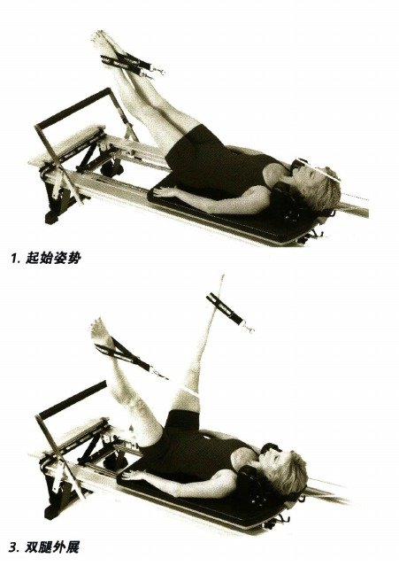
  - 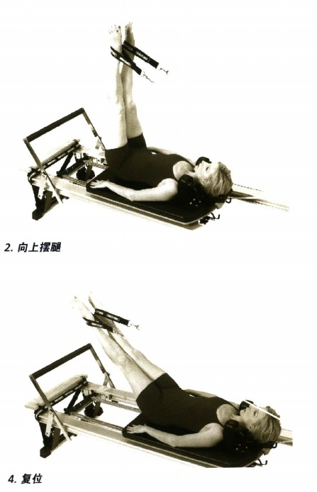
  - 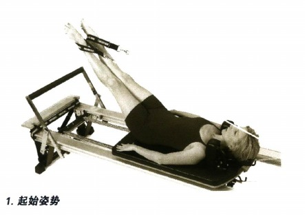
  - 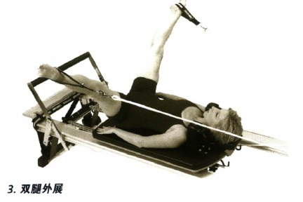
  - 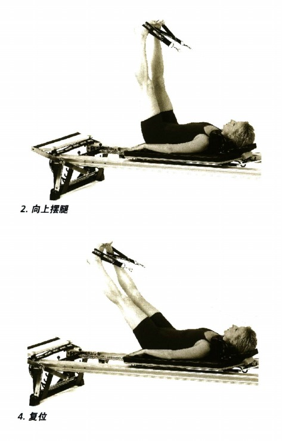
  - 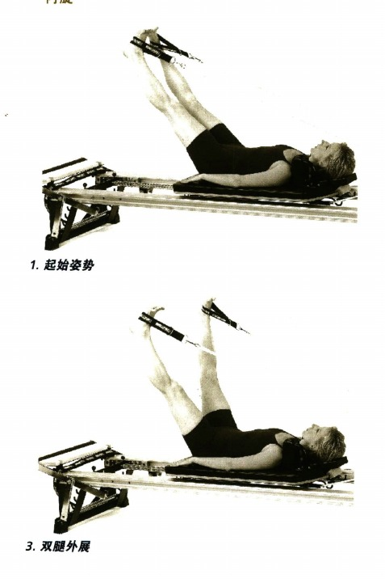

## 膝部伸展 (KNEE STRETCHES)

- 頁碼：p.95-97
- 難度：塑身機初級
- 器械/章節：腳踏桿、彈簧
- 肌群分類：[[../muscles/reformer-beginner-core-and-lumbopelvic-stability|核心與腰骨盆穩定]], [[../muscles/reformer-beginner-spinal-articulation|脊椎活動]], [[../muscles/reformer-beginner-scapular-stabilizers|肩胛與上背穩定]], [[../muscles/reformer-beginner-arms-delts-pecs|手臂與胸肩]], [[../muscles/reformer-beginner-hips-and-legs|髖與腿]], [[../muscles/reformer-beginner-mobility-and-stretching|柔韌與伸展]]
- 摘要：膝部伸展：主要歸入核心與腰骨盆穩定、脊椎活動、肩胛與上背穩定、手臂與胸肩；依 OCR 原理/目標肌肉段落整理。
- OCR 原文摘錄：目標肌肉：以腹橫肌擠壓腹部，穩定腰骨盆部位；以深層盆底肌 輔助腹橫肌運動；向心收縮腹直肌和腹斜肌，以使脊椎彎曲，離 心伸展上述肌肉，帶動脊椎恢復中立位；向心收縮臀大肌和股後 肌群，使骨盆後部向大腿骨後部靠攏；向心收縮豎脊肌群，以拉 伸脊椎至中立位；肩胛骨穩定肌群
- 動作圖：
  - 
  - 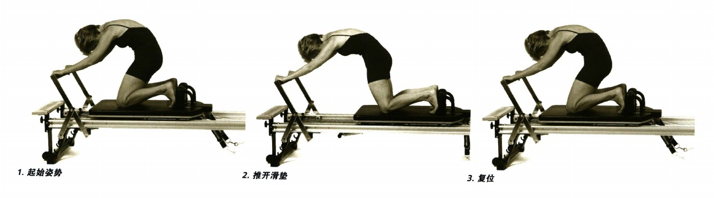
  - 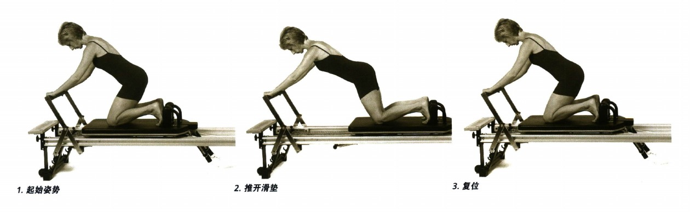

## 跑步運動 (RUNNING)

- 頁碼：p.98-100
- 難度：塑身機初級
- 器械/章節：腳踏桿、彈簧、頭墊
- 肌群分類：[[../muscles/reformer-beginner-core-and-lumbopelvic-stability|核心與腰骨盆穩定]], [[../muscles/reformer-beginner-spinal-articulation|脊椎活動]], [[../muscles/reformer-beginner-arms-delts-pecs|手臂與胸肩]], [[../muscles/reformer-beginner-hips-and-legs|髖與腿]], [[../muscles/reformer-beginner-mobility-and-stretching|柔韌與伸展]]
- 摘要：跑步運動：主要歸入核心與腰骨盆穩定、脊椎活動、手臂與胸肩、髖與腿；依頁面標題、動作說明與動作圖整理。
- 動作圖：
  - 
  - 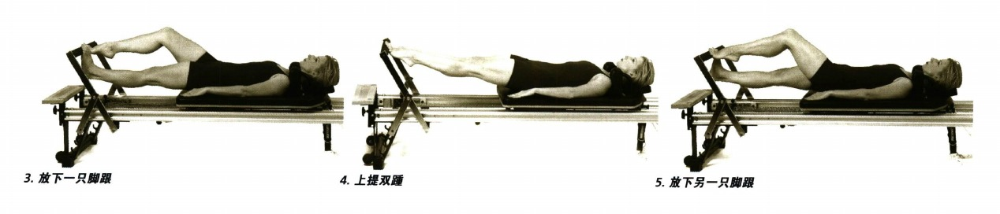
  - 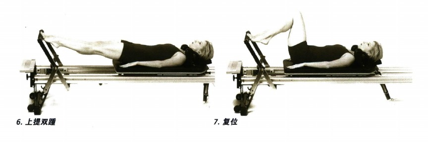
  - 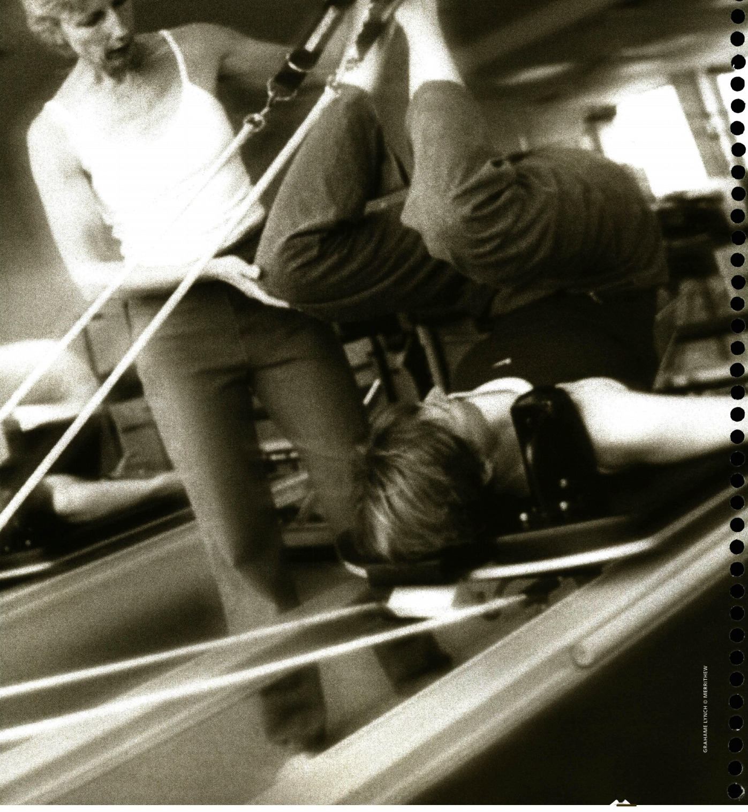

## 髖部上抬 (HIP LIFT)

- 頁碼：p.101
- 難度：塑身機初級
- 器械/章節：腳踏桿、彈簧、頭墊
- 肌群分類：[[../muscles/reformer-beginner-core-and-lumbopelvic-stability|核心與腰骨盆穩定]], [[../muscles/reformer-beginner-spinal-articulation|脊椎活動]], [[../muscles/reformer-beginner-scapular-stabilizers|肩胛與上背穩定]], [[../muscles/reformer-beginner-hips-and-legs|髖與腿]], [[../muscles/reformer-beginner-mobility-and-stretching|柔韌與伸展]]
- 摘要：髖部上抬：主要歸入核心與腰骨盆穩定、脊椎活動、肩胛與上背穩定、髖與腿；依頁面標題、動作說明與動作圖整理。
- 動作圖：
  - 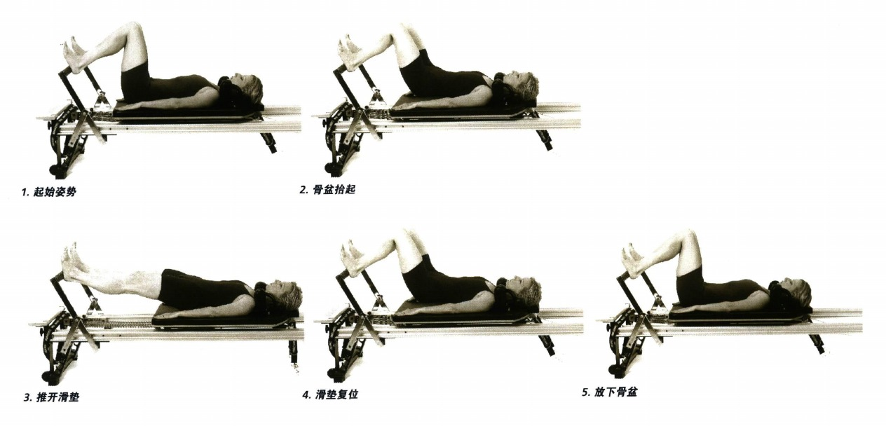

## 髖部起伏 (HIP ROLLS)

- 頁碼：p.102-103
- 難度：塑身機初級
- 器械/章節：腳踏桿、彈簧、頭墊
- 肌群分類：[[../muscles/reformer-beginner-core-and-lumbopelvic-stability|核心與腰骨盆穩定]], [[../muscles/reformer-beginner-spinal-articulation|脊椎活動]], [[../muscles/reformer-beginner-scapular-stabilizers|肩胛與上背穩定]], [[../muscles/reformer-beginner-hips-and-legs|髖與腿]], [[../muscles/reformer-beginner-mobility-and-stretching|柔韌與伸展]]
- 摘要：髖部起伏：主要歸入核心與腰骨盆穩定、脊椎活動、肩胛與上背穩定、髖與腿；依頁面標題、動作說明與動作圖整理。
- 動作圖：
  - 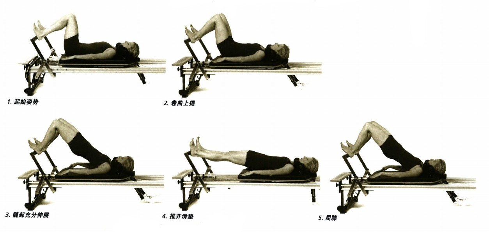
  - 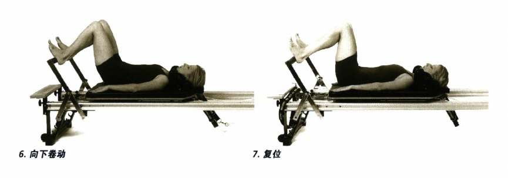

## 單側大腿伸展 (SINGLE THIGH STRETCH)

- 頁碼：p.104-105
- 難度：塑身機初級
- 器械/章節：腳踏桿、彈簧
- 肌群分類：[[../muscles/reformer-beginner-core-and-lumbopelvic-stability|核心與腰骨盆穩定]], [[../muscles/reformer-beginner-spinal-articulation|脊椎活動]], [[../muscles/reformer-beginner-arms-delts-pecs|手臂與胸肩]], [[../muscles/reformer-beginner-hips-and-legs|髖與腿]], [[../muscles/reformer-beginner-mobility-and-stretching|柔韌與伸展]]
- 摘要：單側大腿伸展：主要歸入核心與腰骨盆穩定、脊椎活動、手臂與胸肩、髖與腿；依 OCR 原理/目標肌肉段落整理。
- OCR 原文摘錄：以緩解不適感），在一側掛2根彈簧 目標肌肉：以腹橫肌擠壓腹部，穩定腰骨盆部位；以深層盆底肌
- 動作圖：
  - 
  - 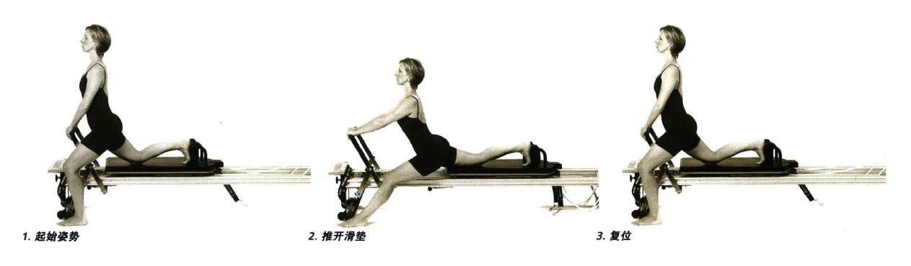

## 側劈叉 (SIDE SPLITS)

- 頁碼：p.106-108
- 難度：塑身機初級
- 器械/章節：腳踏桿、彈簧
- 肌群分類：[[../muscles/reformer-beginner-core-and-lumbopelvic-stability|核心與腰骨盆穩定]], [[../muscles/reformer-beginner-spinal-articulation|脊椎活動]], [[../muscles/reformer-beginner-scapular-stabilizers|肩胛與上背穩定]], [[../muscles/reformer-beginner-arms-delts-pecs|手臂與胸肩]], [[../muscles/reformer-beginner-hips-and-legs|髖與腿]], [[../muscles/reformer-beginner-mobility-and-stretching|柔韌與伸展]]
- 摘要：側劈叉：主要歸入核心與腰骨盆穩定、脊椎活動、肩胛與上背穩定、手臂與胸肩；依 OCR 原理/目標肌肉段落整理。
- OCR 原文摘錄：目標肌肉：以腹橫肌擠壓腹部，穩定腰骨盆部位；以深層盆底肌 輔助腹橫肌運動；用腹斜肌和豎脊肌穩定軀幹；用腹肌和髖伸肌 群穩定骨盆；向心收縮髖外展肌群，以推開滑墊，離心收縮髖外 展肌群，以控制滑墊復位
- 動作圖：
  - 
  - 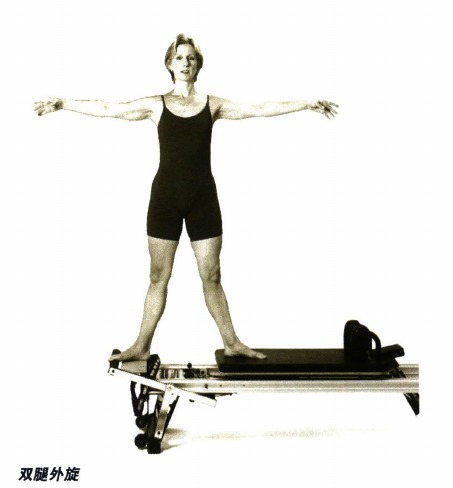
  - 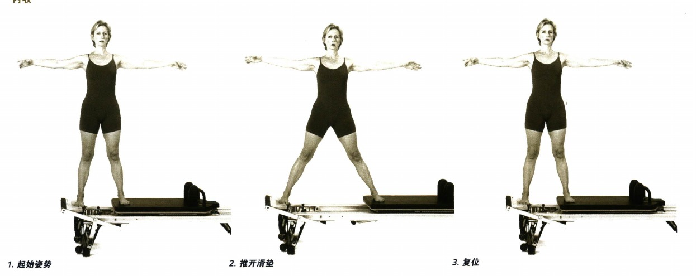
  - 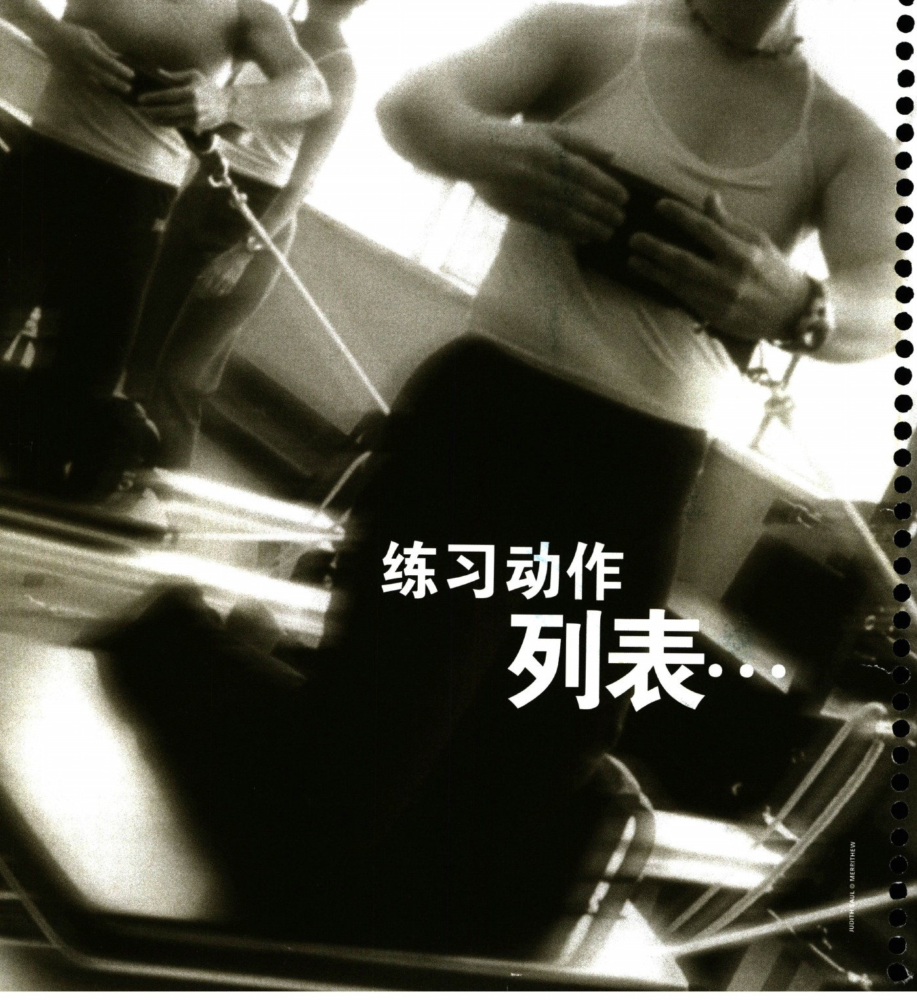
