# 普拉提塑身機中級動作索引

來源：[[../sources/reformer_intermediate_source|普拉提塑身機中級 source note]]。

範圍：PDF 第 6-163 頁；已按要求跳過首 5 頁和末 5 頁。

## 腳部練習 (FOOTWORK)

- 頁碼：p.28-33
- 難度：塑身機中級
- 器械/章節：腳踏桿、彈簧、頭墊
- 肌群分類：[[../muscles/reformer-intermediate-core-and-lumbopelvic-stability|核心與腰骨盆穩定]], [[../muscles/reformer-intermediate-spinal-articulation|脊椎活動]], [[../muscles/reformer-intermediate-scapular-stabilizers|肩胛與上背穩定]], [[../muscles/reformer-intermediate-arms-delts-pecs|手臂與胸肩]], [[../muscles/reformer-intermediate-hips-and-legs|髖與腿]], [[../muscles/reformer-intermediate-mobility-and-stretching|柔韌與伸展]]
- 摘要：腳部練習：主要歸入核心與腰骨盆穩定、脊椎活動、肩胛與上背穩定、手臂與胸肩；依 OCR 原理/目標肌肉段落整理。
- OCR 原文摘錄：以腹橫肌擠壓腹部，穩定腰骨盆部位；以深層骨盆底 1. 有節奏的小幅運動［練習1-4］。半程推動滑墊，全程復位， 肌輔助腹橫肌運動；利用腹斜肌防止脊椎伸展；利用腹斜肌和多 著重練習復位時配合呼氣。鍛鍊骨盆保持中立位正姿的能力， 裂肌阻止身體旋轉；利用股內側肌群和股外側肌群適度牽拉髕骨 著重從髖伸肌群發力，以推開滑墊，並在滑墊復位時起到“制動” ［1］伸展時向心收縮髖伸肌群、股四頭肌和內收肌群，復位時離 作用。適合運動範圍有限的練習者。 心收縮上述肌肉；利用外旋肌群保持髖部旋轉 2. 關節活動末段的有節奏運動［練習1-4］。將滑墊完全推開， ［2］ 等長收縮內收肌群，以保持雙腿併攏；伸展時向心收縮髖伸肌 然後略微復位，推開滑墊時注意配合呼氣。著重利用股骨肌群向 群和股四頭肌，復位時離心收縮上述肌肉；利用足部內附肌群
- 動作圖：
  - 
  - 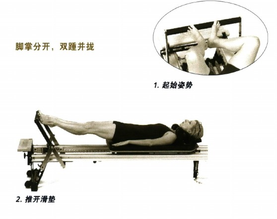
  - 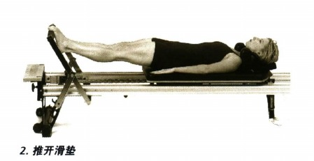
  - 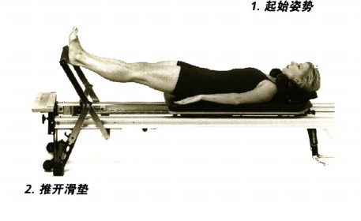
  - 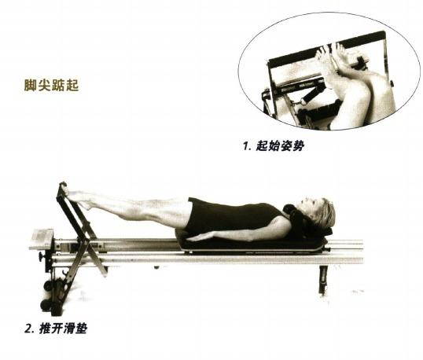
  - 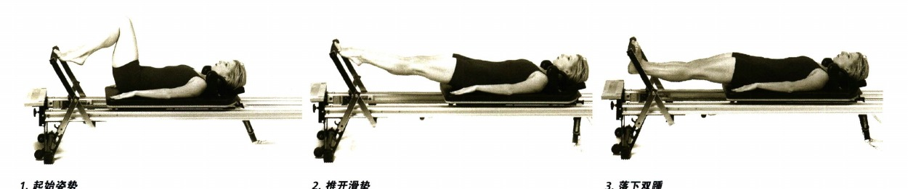
  - 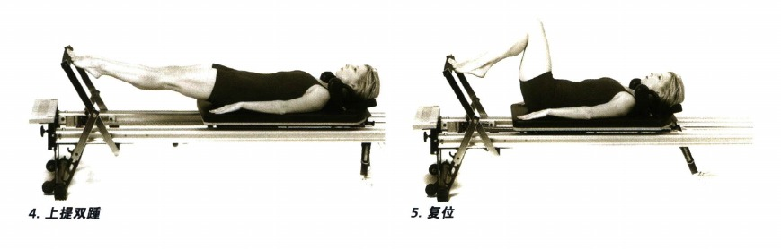

## 第二種姿勢 (SECOND POSITION)

- 頁碼：p.34-35
- 難度：塑身機中級
- 器械/章節：腳踏桿、彈簧、頭墊
- 肌群分類：[[../muscles/reformer-intermediate-core-and-lumbopelvic-stability|核心與腰骨盆穩定]], [[../muscles/reformer-intermediate-spinal-articulation|脊椎活動]], [[../muscles/reformer-intermediate-arms-delts-pecs|手臂與胸肩]], [[../muscles/reformer-intermediate-hips-and-legs|髖與腿]], [[../muscles/reformer-intermediate-mobility-and-stretching|柔韌與伸展]]
- 摘要：第二種姿勢：主要歸入核心與腰骨盆穩定、脊椎活動、手臂與胸肩、髖與腿；依 OCR 原理/目標肌肉段落整理。
- OCR 原文摘錄：以腹橫肌擠壓腹部，穩定腰骨盆部位；以深層骨盆底 2． 關節活動末段的有節奏運動［練習1-3］。將滑墊完全推開， 肌輔助腹橫肌運動；利用腹斜肌阻止脊椎伸展；利用腹斜肌和多 然後略微復位，推開滑墊時注意配合呼氣。著重利用股骨肌群向 裂肌阻止身體旋轉；雙腿伸展時，向心收縮髖伸肌群和股四頭肌， 上拉動髕骨，並以膝窩部位提供支撐。適合運動範圍有限的練習 雙腿復位時，離心收縮髖伸肌群和股四頭肌；利用雙踝背屈肌保 者，且有助於改善膝部不穩的情況。 持雙腳姿勢；利用股內側肌群和股外側肌群適當鍛鍊髕骨 3.靈活膠帶 訓練器［練習1與練習3］。將靈活膠帶訓練器繞於大 ［2］ 利用外旋肌群進行髖部旋轉 腿，位置略高於膝部，使髖外展肌群始終參與運動。 ［3］ 利用內旋肌群進行髖部旋轉
- 動作圖：
  - 
  - 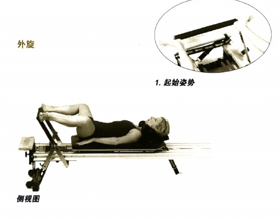
  - 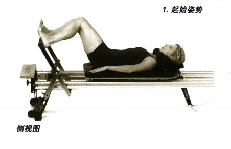

## 單腿練習 (SINGLE LEG)

- 頁碼：p.36-41
- 難度：塑身機中級
- 器械/章節：腳踏桿、彈簧、頭墊
- 肌群分類：[[../muscles/reformer-intermediate-core-and-lumbopelvic-stability|核心與腰骨盆穩定]], [[../muscles/reformer-intermediate-spinal-articulation|脊椎活動]], [[../muscles/reformer-intermediate-arms-delts-pecs|手臂與胸肩]], [[../muscles/reformer-intermediate-hips-and-legs|髖與腿]], [[../muscles/reformer-intermediate-mobility-and-stretching|柔韌與伸展]]
- 摘要：單腿練習：主要歸入核心與腰骨盆穩定、脊椎活動、手臂與胸肩、髖與腿；依 OCR 原理/目標肌肉段落整理。
- OCR 原文摘錄：目標肌肉：以腹橫肌擠壓腹部，穩定腰骨盆部位；以深層骨盆底 肌輔助腹橫肌運動；利用腹斜肌阻止脊椎伸展；利用腹斜肌和多 裂肌阻止身體旋轉：支撐腿伸展時，向心收縮髖伸肌群和股四頭 肌，支撐腿復位時，離心收縮髖伸肌群和股四頭肌；利用股內側 肌群和股外側肌群適當鍛鍊髕骨
- 動作圖：
  - 
  - 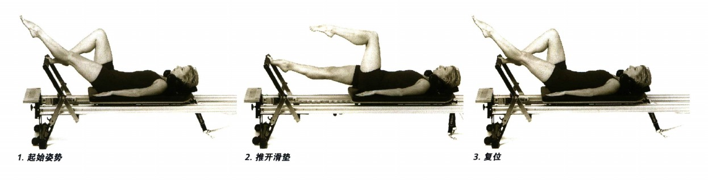
  - 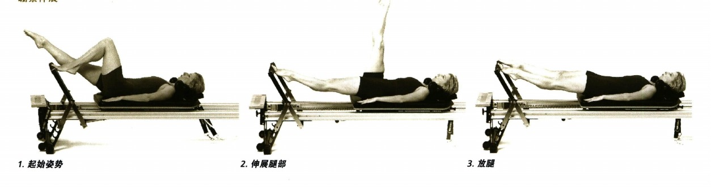
  - 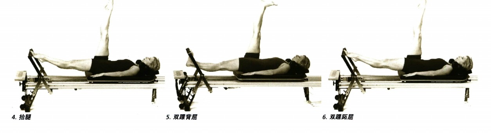
  - 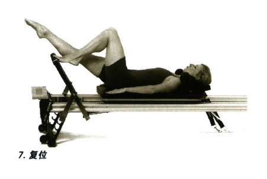
  - 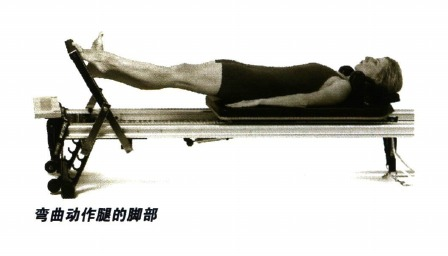
  - 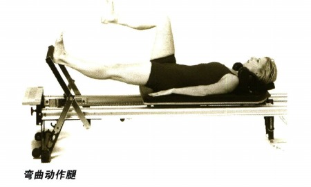
  - 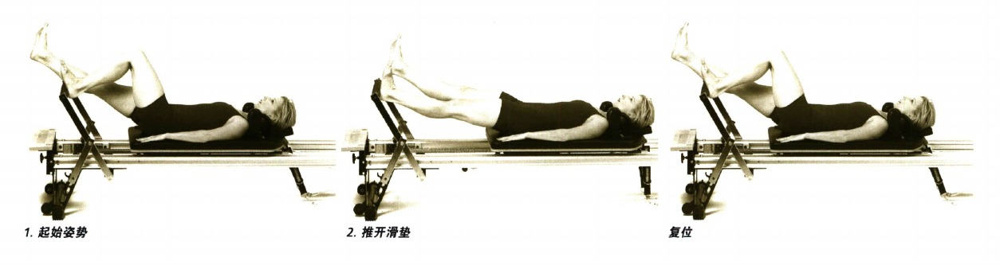
  - 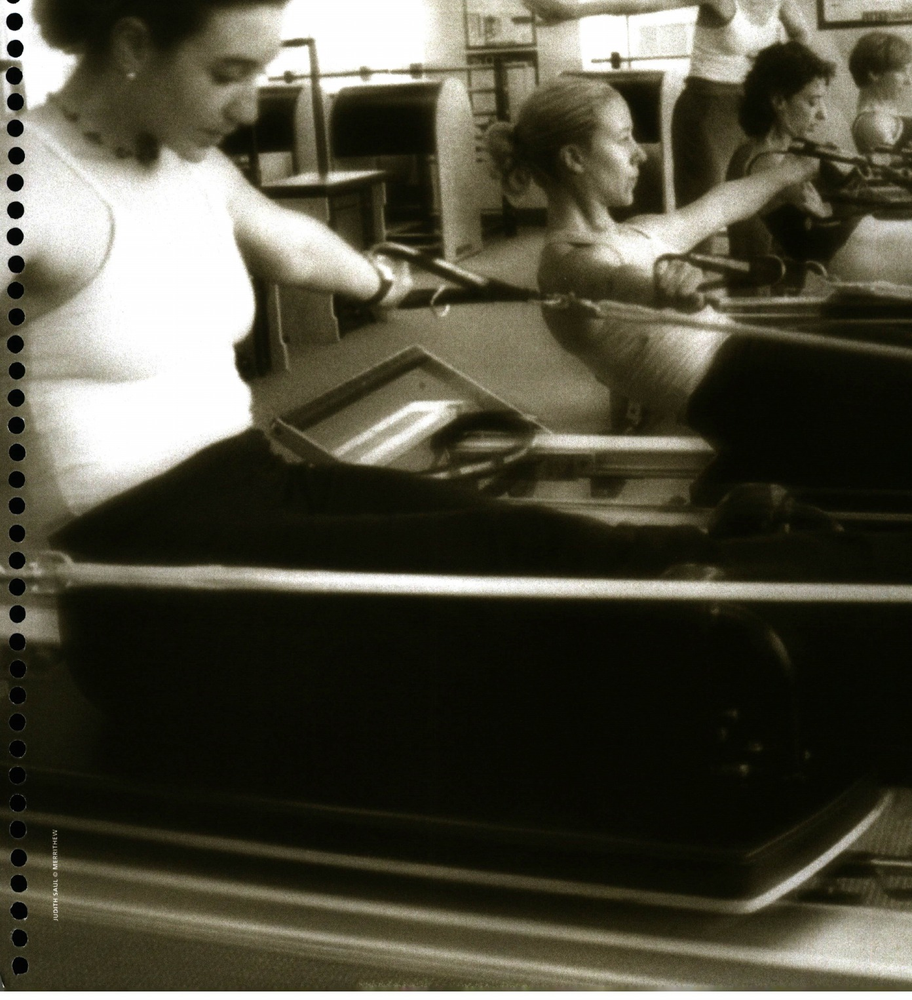

## 百次拍擊 (HUNDRED)

- 頁碼：p.42-43
- 難度：塑身機中級
- 器械/章節：腳踏桿、彈簧、頭墊、拉環與繩索
- 肌群分類：[[../muscles/reformer-intermediate-core-and-lumbopelvic-stability|核心與腰骨盆穩定]], [[../muscles/reformer-intermediate-spinal-articulation|脊椎活動]], [[../muscles/reformer-intermediate-scapular-stabilizers|肩胛與上背穩定]], [[../muscles/reformer-intermediate-lat-teres-pulling-chain|背闊肌與拉力鏈]], [[../muscles/reformer-intermediate-arms-delts-pecs|手臂與胸肩]], [[../muscles/reformer-intermediate-hips-and-legs|髖與腿]], [[../muscles/reformer-intermediate-mobility-and-stretching|柔韌與伸展]]
- 摘要：百次拍擊：主要歸入核心與腰骨盆穩定、脊椎活動、肩胛與上背穩定、背闊肌與拉力鏈；依 OCR 原理/目標肌肉段落整理。
- OCR 原文摘錄：呼氣 伸長後頸部，肩胛骨保持穩定，收縮腹肌彎曲胸椎。同時， 目標肌肉：以腹橫肌擠壓腹部，穩定腰骨盆部位；以深層骨盆底 伸展雙肘，直至雙臂與雙肩保持同一高度，雙腿向斜上方 肌輔助腹橫肌運動；向心收縮腹直肌和腹斜肌，讓胸椎彎曲，並 伸展並儘量放低，動作幅度以能保持腰椎下沉為限。 等長收縮腹直肌和腹斜肌，保持胸椎彎曲和骨盆穩定；利用背闊 接下來⋯ 肌和胸大肌對抗後部阻力，穩定雙臂；等長收縮髖屈肌群、內收 吸氣 肌群和股四頭肌，保持雙腿姿勢；肩胛骨穩定肌群 默數五個數，保持上身彎曲，肩胛骨和骨盆保持穩定，雙 臂小幅上下有節奏的地運動
- 動作圖：
  - 
  - 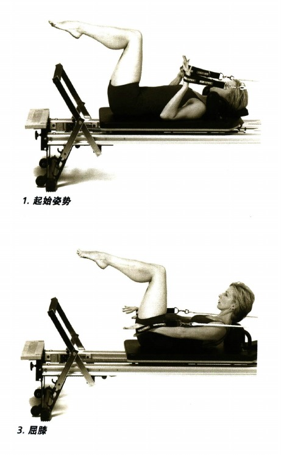
  - 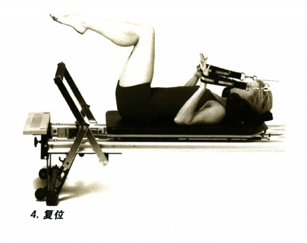
  - 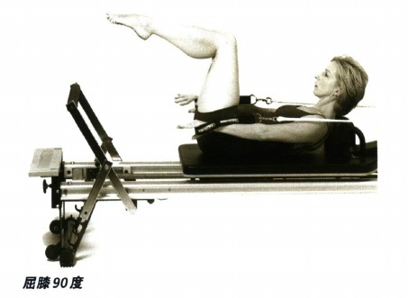

## 屈伸練習 (BEND & STRETCH)

- 頁碼：p.44-45
- 難度：塑身機中級
- 器械/章節：腳踏桿、彈簧、頭墊、拉環與繩索
- 肌群分類：[[../muscles/reformer-intermediate-core-and-lumbopelvic-stability|核心與腰骨盆穩定]], [[../muscles/reformer-intermediate-spinal-articulation|脊椎活動]], [[../muscles/reformer-intermediate-arms-delts-pecs|手臂與胸肩]], [[../muscles/reformer-intermediate-hips-and-legs|髖與腿]], [[../muscles/reformer-intermediate-mobility-and-stretching|柔韌與伸展]]
- 摘要：屈伸練習：主要歸入核心與腰骨盆穩定、脊椎活動、手臂與胸肩、髖與腿；依 OCR 原理/目標肌肉段落整理。
- OCR 原文摘錄：以腹橫肌擠壓腹部，穩定腰骨盆部位；以深層骨盆底
- 動作圖：
  - 
  - 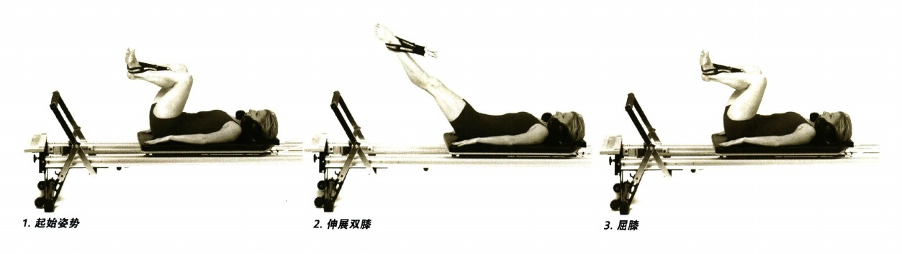
  - 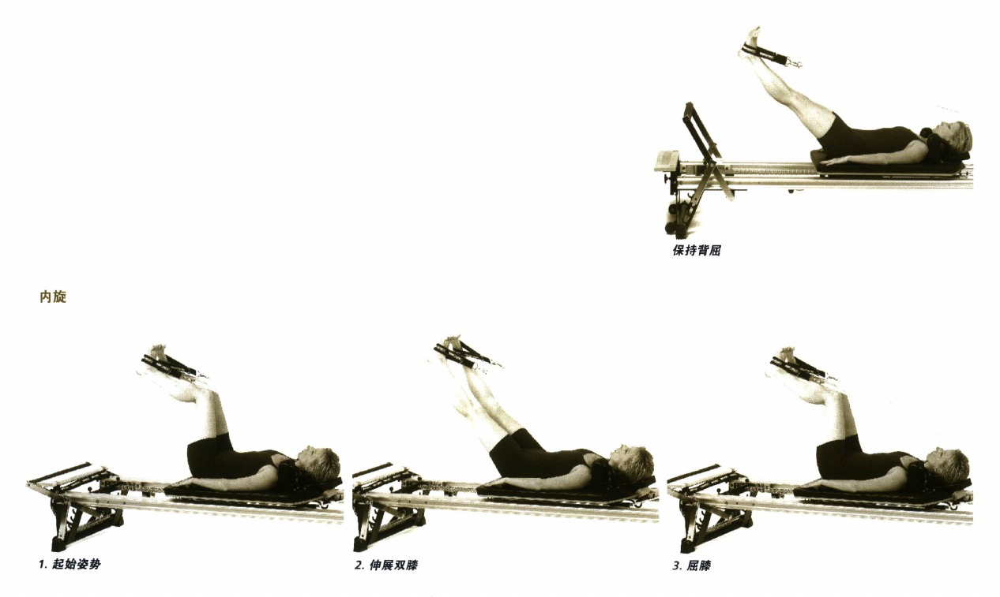

## 脊椎捲曲 (SHORT SPINE)

- 頁碼：p.46-48
- 難度：塑身機中級
- 器械/章節：腳踏桿、彈簧、頭墊、拉環與繩索
- 肌群分類：[[../muscles/reformer-intermediate-core-and-lumbopelvic-stability|核心與腰骨盆穩定]], [[../muscles/reformer-intermediate-spinal-articulation|脊椎活動]], [[../muscles/reformer-intermediate-scapular-stabilizers|肩胛與上背穩定]], [[../muscles/reformer-intermediate-arms-delts-pecs|手臂與胸肩]], [[../muscles/reformer-intermediate-hips-and-legs|髖與腿]], [[../muscles/reformer-intermediate-mobility-and-stretching|柔韌與伸展]]
- 摘要：脊椎捲曲：主要歸入核心與腰骨盆穩定、脊椎活動、肩胛與上背穩定、手臂與胸肩；依 OCR 原理/目標肌肉段落整理。
- OCR 原文摘錄：腳尖輕輕繃直。雙臂沿體側伸展，掌心向下。 目標肌肉：以腹橫肌擠壓腹部，穩定腰骨盆部位；以深層骨盆底 練習 肌輔助腹橫肌運動；擺腿時，離心收縮臀大肌和股後肌群，向心 收縮上述肌肉，使骨盆後部向大腿骨後部靠攏；向心收縮腹直肌 吸氣 雙腿旋轉至平行，然後伸直並向軀幹方向擺動，動作幅度 以股後肌群拉伸至敏大限度為限。 和腹斜肌，帶動脊椎離墊，向下捲動時，離心收縮上述肌肉；推 開滑墊時，向心收縮髖伸肌群、股四頭肌和外展肌群；肩胛骨穩 呼氣 按照從尾椎骨至上胸椎的順序，使脊椎逐節離墊，雙腿向 定肌群 正上方伸展。使滑墊完全復位，同時保持繩索緊繃
- 動作圖：
  - 
  - 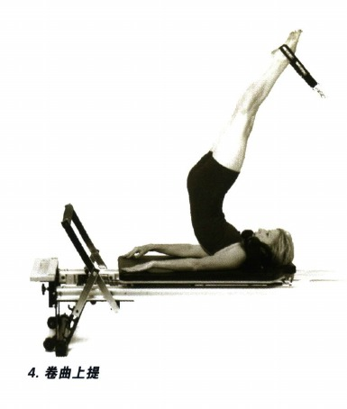
  - 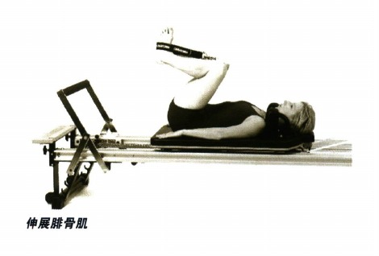
  - 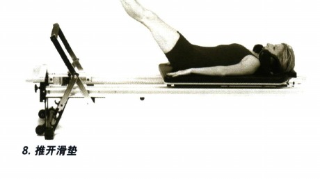
  - 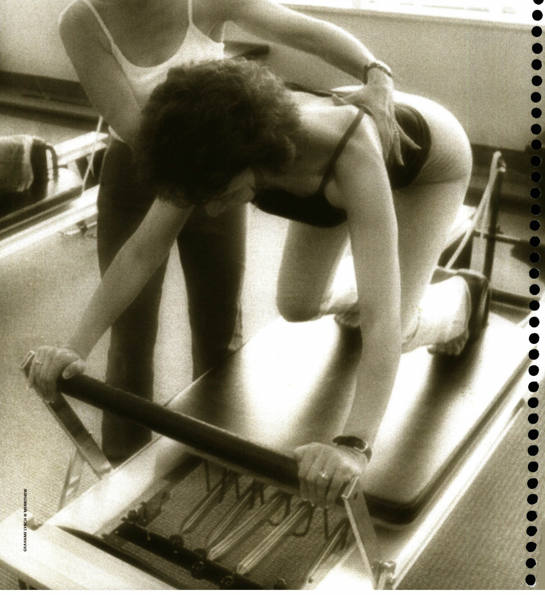

## 拍擊 (BEATS)

- 頁碼：p.49
- 難度：塑身機中級
- 器械/章節：腳踏桿、彈簧、頭墊、拉環與繩索
- 肌群分類：[[../muscles/reformer-intermediate-core-and-lumbopelvic-stability|核心與腰骨盆穩定]], [[../muscles/reformer-intermediate-spinal-articulation|脊椎活動]], [[../muscles/reformer-intermediate-arms-delts-pecs|手臂與胸肩]], [[../muscles/reformer-intermediate-hips-and-legs|髖與腿]], [[../muscles/reformer-intermediate-mobility-and-stretching|柔韌與伸展]]
- 摘要：拍擊：主要歸入核心與腰骨盆穩定、脊椎活動、手臂與胸肩、髖與腿；依頁面標題、動作說明與動作圖整理。
- 動作圖：
  - 

## 蛙跳姿 (FROG)

- 頁碼：p.50-52
- 難度：塑身機中級
- 器械/章節：腳踏桿、彈簧、頭墊、拉環與繩索
- 肌群分類：[[../muscles/reformer-intermediate-core-and-lumbopelvic-stability|核心與腰骨盆穩定]], [[../muscles/reformer-intermediate-spinal-articulation|脊椎活動]], [[../muscles/reformer-intermediate-scapular-stabilizers|肩胛與上背穩定]], [[../muscles/reformer-intermediate-arms-delts-pecs|手臂與胸肩]], [[../muscles/reformer-intermediate-hips-and-legs|髖與腿]], [[../muscles/reformer-intermediate-mobility-and-stretching|柔韌與伸展]]
- 摘要：蛙跳姿：主要歸入核心與腰骨盆穩定、脊椎活動、肩胛與上背穩定、手臂與胸肩；依 OCR 原理/目標肌肉段落整理。
- OCR 原文摘錄：目標肌肉：以腹橫肌擠壓腹部，穩定腰骨盆部位；以深層骨盆底 肌輔助腹橫肌運動；利用腹斜肌防止脊椎伸展；利用腹斜肌和多 裂肌防止骨盆旋轉；調動髖外旋肌群來保持髖部旋轉 ［前伸時！雙腿向軀幹方向擺動時，離心收縮髖伸肌；雙腿成菱形 姿勢時，離心收縮髖內收肌同時穩定髖伸肌群；在保持髖內收肌 群穩定的狀態下，向心收縮股四頭肌，以使雙腳向身體兩側伸 展；在雙腿向遠離軀幹的方向擺動直至到達對角線姿勢的過程中， 向心收縮髖伸肌群和髖內收肌群 ［逆向練習時〕雙腿開啟時，離心收縮髖伸肌群和髖內收肌群； 彎曲雙膝使雙腳併攏時，向心收縮股後肌群；在保持髖伸肌群穩 定的狀態下，向心收縮髖內收肌群和股四頭肌，以使雙腳向上伸 展；向心收縮髖伸肌群，以使雙腿下落至對角線姿勢
- 動作圖：
  - 
  - 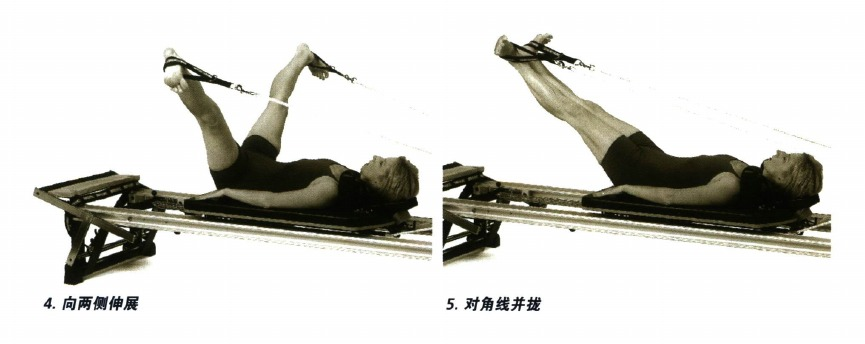
  - 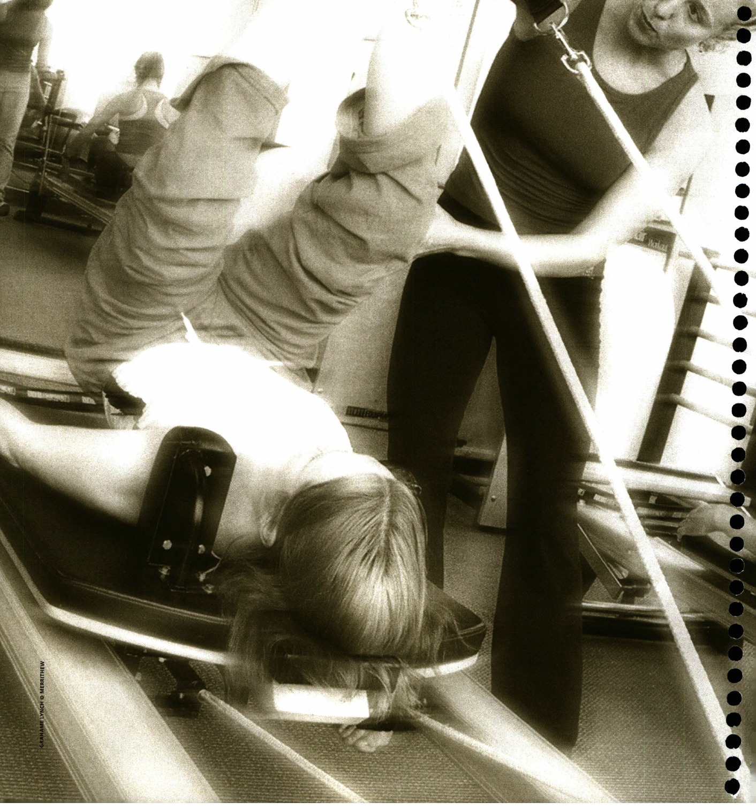

## 鹿跳姿 (STAG)

- 頁碼：p.53
- 難度：塑身機中級
- 器械/章節：腳踏桿、彈簧、頭墊、拉環與繩索
- 肌群分類：[[../muscles/reformer-intermediate-core-and-lumbopelvic-stability|核心與腰骨盆穩定]], [[../muscles/reformer-intermediate-spinal-articulation|脊椎活動]], [[../muscles/reformer-intermediate-arms-delts-pecs|手臂與胸肩]], [[../muscles/reformer-intermediate-hips-and-legs|髖與腿]], [[../muscles/reformer-intermediate-mobility-and-stretching|柔韌與伸展]]
- 摘要：鹿跳姿：主要歸入核心與腰骨盆穩定、脊椎活動、手臂與胸肩、髖與腿；依 OCR 原理/目標肌肉段落整理。
- OCR 原文摘錄：腳踏杆調到4號位，掛2根彈簧，根據個人需要調節頭墊 目標肌肉：以腹橫肌擠壓腹部，穩定腰骨盆部位；以深層骨盆底 肌輔助腹橫肌運動；利用腹斜肌防止脊椎伸展；利用腹斜肌和多
- 動作圖：
  - 

## 協調性 (COORDINATION)

- 頁碼：p.54-55
- 難度：塑身機中級
- 器械/章節：腳踏桿、彈簧、拉環與繩索
- 肌群分類：[[../muscles/reformer-intermediate-core-and-lumbopelvic-stability|核心與腰骨盆穩定]], [[../muscles/reformer-intermediate-spinal-articulation|脊椎活動]], [[../muscles/reformer-intermediate-scapular-stabilizers|肩胛與上背穩定]], [[../muscles/reformer-intermediate-lat-teres-pulling-chain|背闊肌與拉力鏈]], [[../muscles/reformer-intermediate-arms-delts-pecs|手臂與胸肩]], [[../muscles/reformer-intermediate-hips-and-legs|髖與腿]], [[../muscles/reformer-intermediate-mobility-and-stretching|柔韌與伸展]]
- 摘要：協調性：主要歸入核心與腰骨盆穩定、脊椎活動、肩胛與上背穩定、背闊肌與拉力鏈；依頁面標題、動作說明與動作圖整理。
- 動作圖：
  - 

## 後劃 (BACK ROWING)

- 頁碼：p.56-60
- 難度：塑身機中級
- 器械/章節：腳踏桿、彈簧、頭墊、拉環與繩索
- 肌群分類：[[../muscles/reformer-intermediate-core-and-lumbopelvic-stability|核心與腰骨盆穩定]], [[../muscles/reformer-intermediate-spinal-articulation|脊椎活動]], [[../muscles/reformer-intermediate-scapular-stabilizers|肩胛與上背穩定]], [[../muscles/reformer-intermediate-lat-teres-pulling-chain|背闊肌與拉力鏈]], [[../muscles/reformer-intermediate-arms-delts-pecs|手臂與胸肩]], [[../muscles/reformer-intermediate-hips-and-legs|髖與腿]], [[../muscles/reformer-intermediate-mobility-and-stretching|柔韌與伸展]]
- 摘要：後劃：主要歸入核心與腰骨盆穩定、脊椎活動、肩胛與上背穩定、背闊肌與拉力鏈；依 OCR 原理/目標肌肉段落整理。
- OCR 原文摘錄：目標肌肉：以腹橫肌擠壓腹部，穩定腰骨盆部位；以深層骨盆底 肌輔助腹橫肌運動；向心收縮腹直肌和腹斜肌使身體彎曲，並等 長收縮上述肌肉，以保持身體彎曲；向心收縮臀大肌和股後肌群 以使骨盆後側靠向大腿骨後部；向後捲動時，離心收縮髖屈肌群， 前屈時，向心收縮髖屈肌群；向心收縮後三角肌以後壓雙臂；雙 臂前伸時，離心收縮背闊肌和大圓肌；肩胛骨穩定肌群
- 動作圖：
  - 
  - 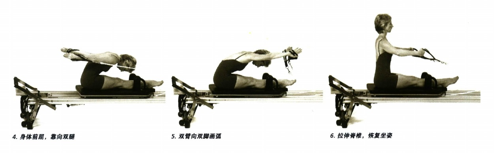
  - 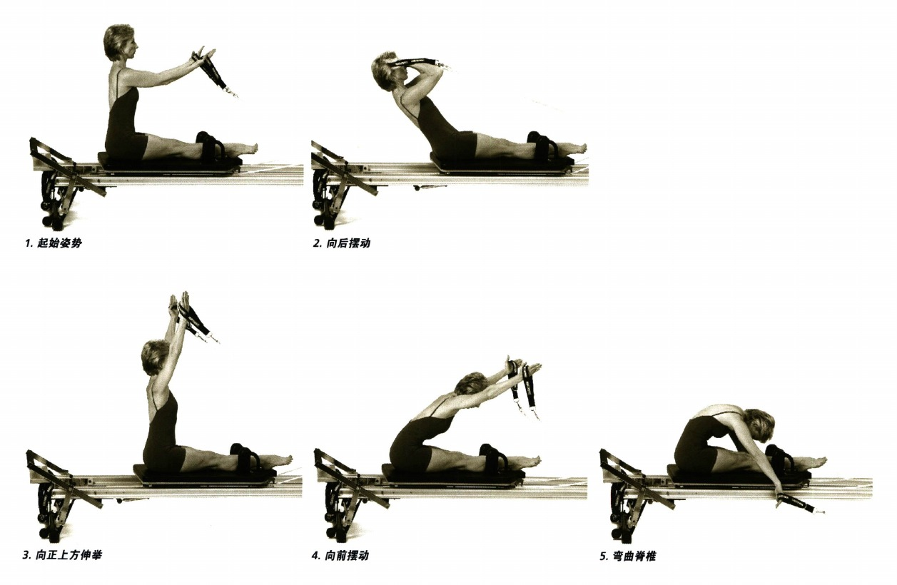
  - 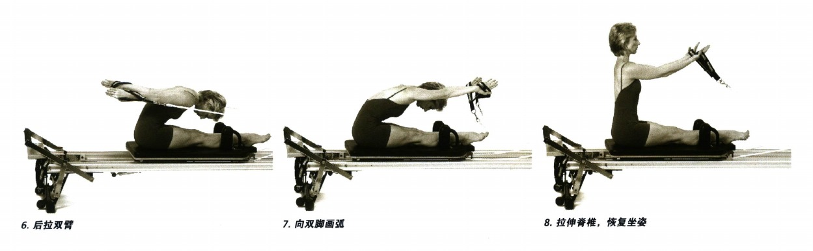
  - 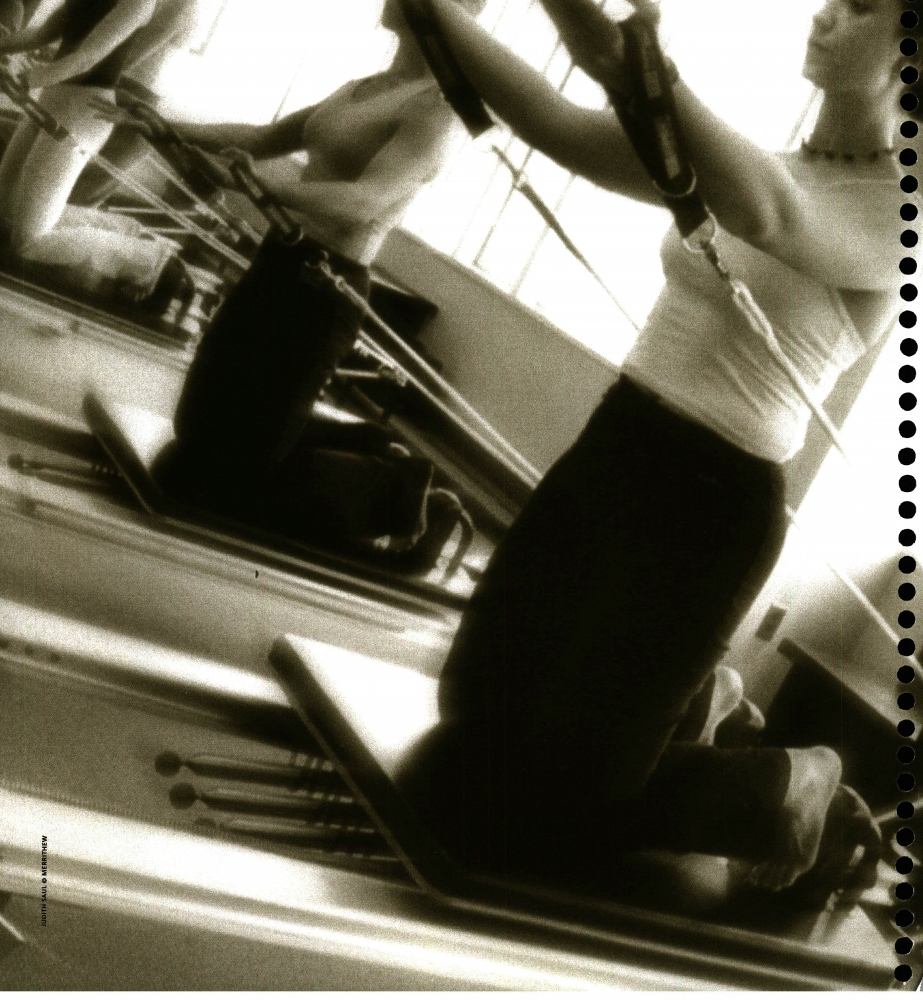

## 前劃 (FRONT ROWING)

- 頁碼：p.61-68
- 難度：塑身機中級
- 器械/章節：腳踏桿、彈簧、拉環與繩索
- 肌群分類：[[../muscles/reformer-intermediate-core-and-lumbopelvic-stability|核心與腰骨盆穩定]], [[../muscles/reformer-intermediate-spinal-articulation|脊椎活動]], [[../muscles/reformer-intermediate-scapular-stabilizers|肩胛與上背穩定]], [[../muscles/reformer-intermediate-lat-teres-pulling-chain|背闊肌與拉力鏈]], [[../muscles/reformer-intermediate-arms-delts-pecs|手臂與胸肩]], [[../muscles/reformer-intermediate-hips-and-legs|髖與腿]], [[../muscles/reformer-intermediate-mobility-and-stretching|柔韌與伸展]]
- 摘要：前劃：主要歸入核心與腰骨盆穩定、脊椎活動、肩胛與上背穩定、背闊肌與拉力鏈；依 OCR 原理/目標肌肉段落整理。
- OCR 原文摘錄：腳踏杆調到 1號位或4號位，掛1根或2根彈簧 目標肌肉：以腹橫肌擠壓腹部，穩定腰骨盆部位；以深層骨盆底
- 動作圖：
  - 
  - 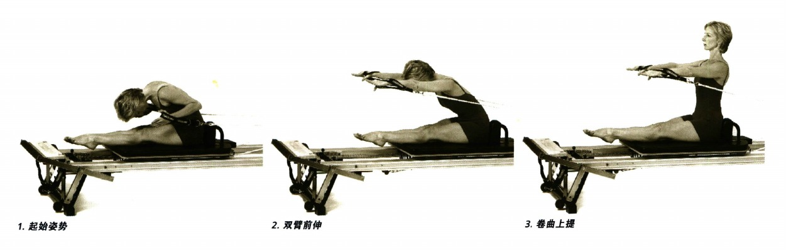
  - 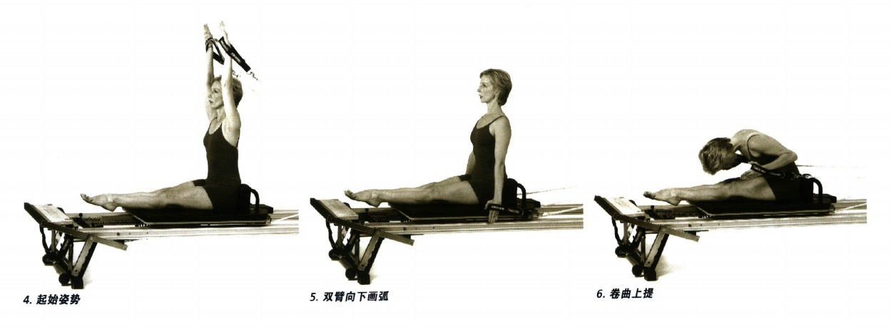
  - 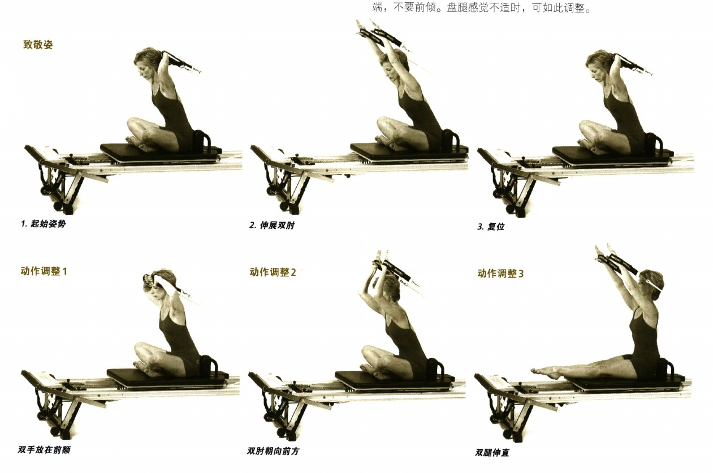
  - 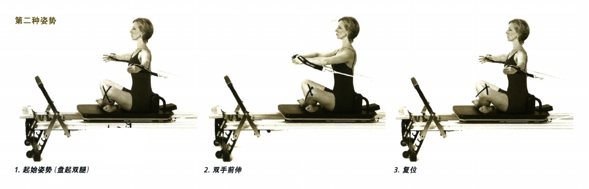
  - 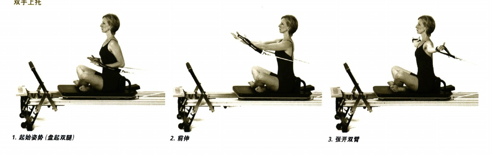
  - 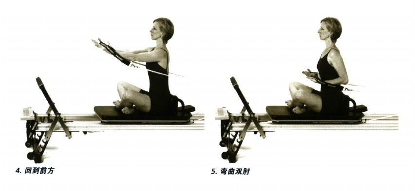
  - 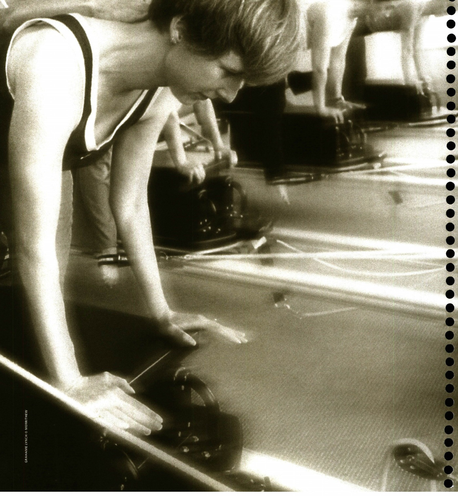

## 腹部按摩 (STOMACH MASSAGE)

- 頁碼：p.69-73
- 難度：塑身機中級
- 器械/章節：腳踏桿、彈簧
- 肌群分類：[[../muscles/reformer-intermediate-core-and-lumbopelvic-stability|核心與腰骨盆穩定]], [[../muscles/reformer-intermediate-spinal-articulation|脊椎活動]], [[../muscles/reformer-intermediate-scapular-stabilizers|肩胛與上背穩定]], [[../muscles/reformer-intermediate-arms-delts-pecs|手臂與胸肩]], [[../muscles/reformer-intermediate-hips-and-legs|髖與腿]], [[../muscles/reformer-intermediate-mobility-and-stretching|柔韌與伸展]]
- 摘要：腹部按摩：主要歸入核心與腰骨盆穩定、脊椎活動、肩胛與上背穩定、手臂與胸肩；依 OCR 原理/目標肌肉段落整理。
- OCR 原文摘錄：腳踏杆調到1號位（如果髖部周圍的肌肉緊張，可將腳踏杆調低至2號位，以緩解不 目標肌肉：以腹橫肌擠壓腹部，穩定腰骨盆部位；以深層骨盆底 適感），掛2根或3根彈簧 肌輔助腹橫肌運動：利用腹斜肌使軀幹保持彎曲；雙膝伸展時
- 動作圖：
  - 
  - 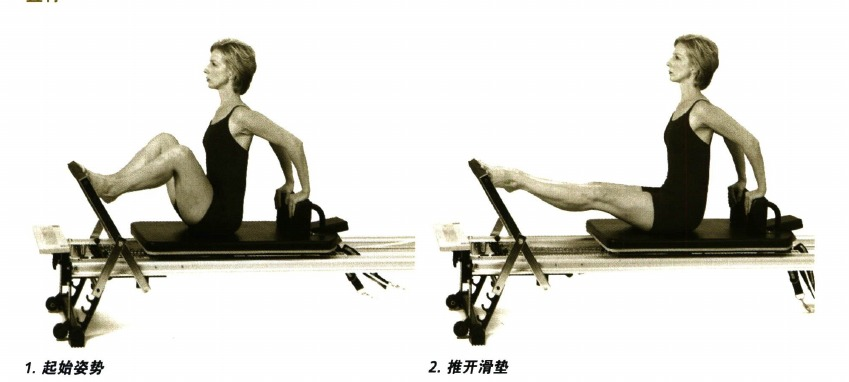
  - 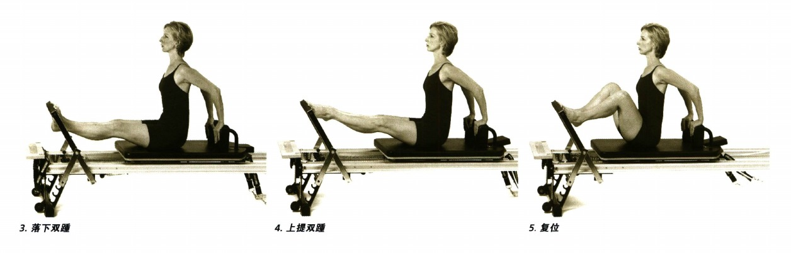
  - 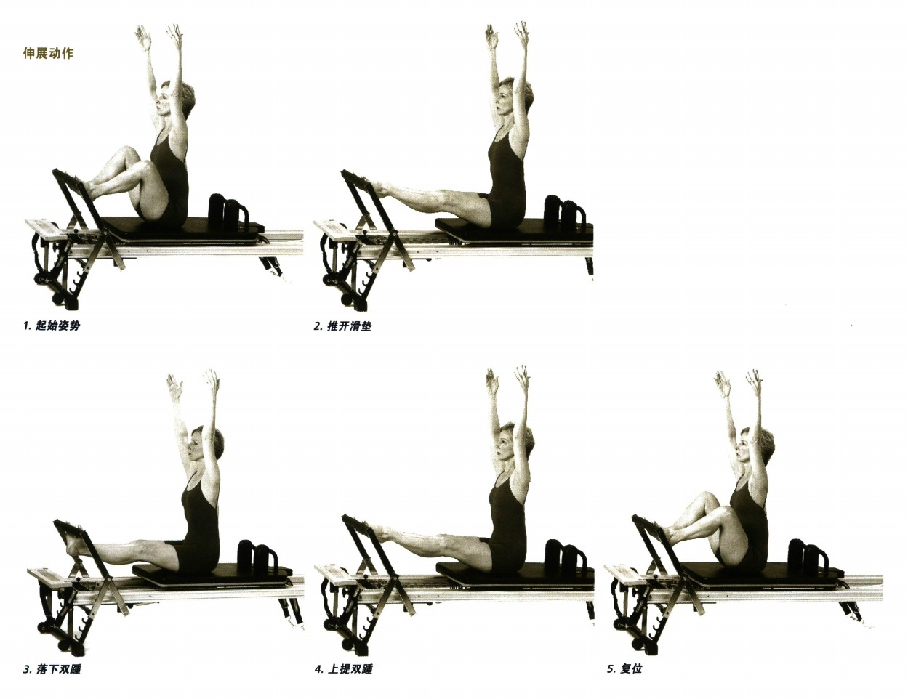
  - 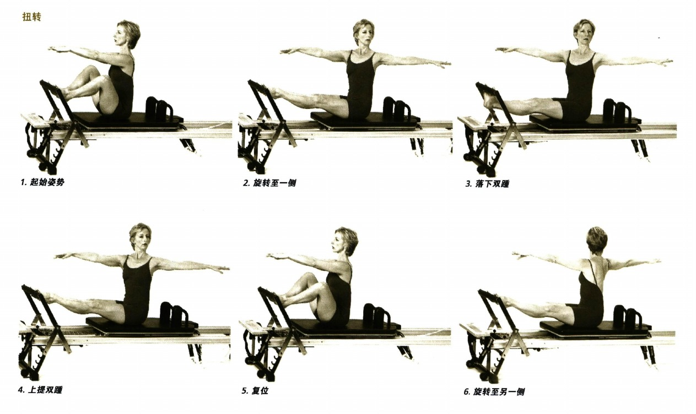
  - 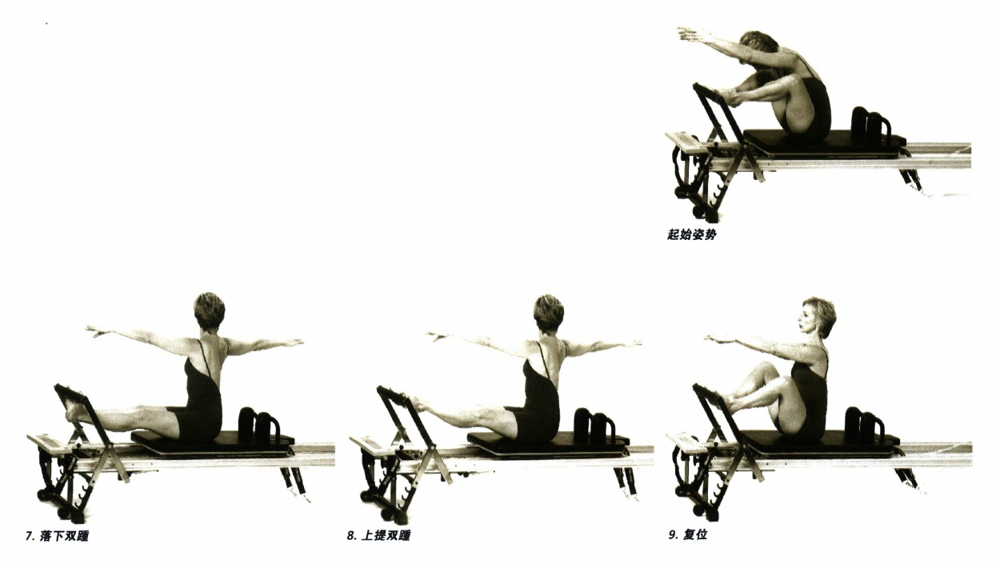

## 雙臂拉動拉環 盒子豎放 (ARMS PULLING STRAPS, LONG BOX)

- 頁碼：p.74-76
- 難度：塑身機中級
- 器械/章節：腳踏桿、彈簧、頭墊、拉環與繩索、塑身機盒子
- 肌群分類：[[../muscles/reformer-intermediate-core-and-lumbopelvic-stability|核心與腰骨盆穩定]], [[../muscles/reformer-intermediate-spinal-articulation|脊椎活動]], [[../muscles/reformer-intermediate-scapular-stabilizers|肩胛與上背穩定]], [[../muscles/reformer-intermediate-lat-teres-pulling-chain|背闊肌與拉力鏈]], [[../muscles/reformer-intermediate-arms-delts-pecs|手臂與胸肩]], [[../muscles/reformer-intermediate-hips-and-legs|髖與腿]], [[../muscles/reformer-intermediate-mobility-and-stretching|柔韌與伸展]]
- 摘要：雙臂拉動拉環 盒子豎放：主要歸入核心與腰骨盆穩定、脊椎活動、肩胛與上背穩定、背闊肌與拉力鏈；依 OCR 原理/目標肌肉段落整理。
- OCR 原文摘錄：［練習1-3］ 腳踏杆調到4號位，掛1根彈簧 目標肌肉：以腹橫肌擠壓腹部，穩定腰骨盆部位；以深層骨盆底 肌輔助腹橫肌運動；利用腹斜肌穩定腰骨盆部位；利用臀大肌和 注意事項：將塑身機盒子豎放在滑墊上，一端頂住肩託。 股後肌群使大腿骨穩定支撐骨盆：利用肩胛骨穩定肌群、下斜方
- 動作圖：
  - 
  - 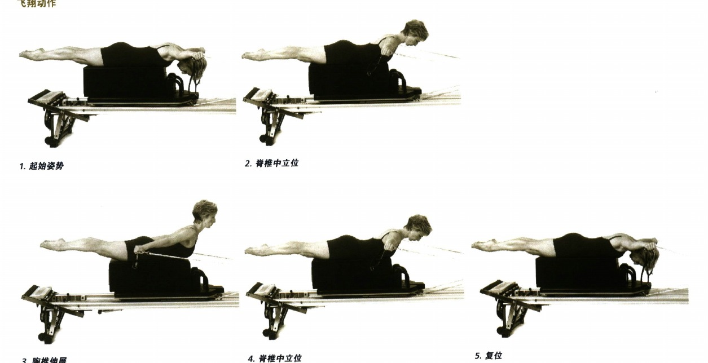
  - 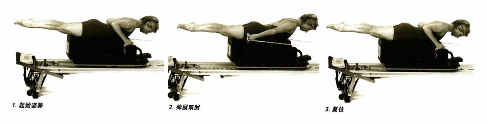

## 仰泳練習準備動作 盒子豎放 (BACKSTROKE PREP LONG BOX)

- 頁碼：p.77
- 難度：塑身機中級
- 器械/章節：腳踏桿、彈簧、拉環與繩索、塑身機盒子
- 肌群分類：[[../muscles/reformer-intermediate-core-and-lumbopelvic-stability|核心與腰骨盆穩定]], [[../muscles/reformer-intermediate-spinal-articulation|脊椎活動]], [[../muscles/reformer-intermediate-scapular-stabilizers|肩胛與上背穩定]], [[../muscles/reformer-intermediate-lat-teres-pulling-chain|背闊肌與拉力鏈]], [[../muscles/reformer-intermediate-arms-delts-pecs|手臂與胸肩]], [[../muscles/reformer-intermediate-hips-and-legs|髖與腿]], [[../muscles/reformer-intermediate-mobility-and-stretching|柔韌與伸展]]
- 摘要：仰泳練習準備動作 盒子豎放：主要歸入核心與腰骨盆穩定、脊椎活動、肩胛與上背穩定、背闊肌與拉力鏈；依 OCR 原理/目標肌肉段落整理。
- OCR 原文摘錄：目標肌肉：以腹橫肌擠壓腹部，穩定腰骨盆部位；以深層骨盆底 肌輔助腹橫肌運動；等長收縮腹直肌和腹斜肌以保持胸椎彎曲和 骨盆穩定；向心收縮背闊肌、大圓肌和胸大肌以內收雙臂，並在 雙臂復位時，離心收縮上述肌肉；肩胛骨穩定肌群 •
- 動作圖：
  - 

## 腳拉動拉環 盒子 (FEET PULLING STRAPS, BOX)

- 頁碼：p.78-83
- 難度：塑身機中級
- 器械/章節：腳踏桿、彈簧、拉環與繩索、塑身機盒子
- 肌群分類：[[../muscles/reformer-intermediate-core-and-lumbopelvic-stability|核心與腰骨盆穩定]], [[../muscles/reformer-intermediate-spinal-articulation|脊椎活動]], [[../muscles/reformer-intermediate-scapular-stabilizers|肩胛與上背穩定]], [[../muscles/reformer-intermediate-lat-teres-pulling-chain|背闊肌與拉力鏈]], [[../muscles/reformer-intermediate-arms-delts-pecs|手臂與胸肩]], [[../muscles/reformer-intermediate-hips-and-legs|髖與腿]], [[../muscles/reformer-intermediate-mobility-and-stretching|柔韌與伸展]]
- 摘要：腳拉動拉環 盒子：主要歸入核心與腰骨盆穩定、脊椎活動、肩胛與上背穩定、背闊肌與拉力鏈；依 OCR 原理/目標肌肉段落整理。
- OCR 原文摘錄：又稱腳拉動拉環 FEET PULLING STRAPS 目標肌肉：以腹橫肌擠壓腹部，穩定腰骨盆部位；以深層骨盆底 肌輔助腹橫肌運動；利用腹斜肌和髖伸肌群將骨盆穩定在中立位； 腳踏杆調到4號位，掛1根彈簧 利用豎脊肌群使上脊椎保持中立位；向心收縮股後肌群以彎曲雙 注意事項：將塑身機盒子豎放在滑墊上。為達到充分練習的目的， 膝，並在雙膝復位時離心收縮股後肌群，旋轉時著重鍛鍊外側股 可縮短拉環長度、將繩索打結，並將滑墊固定栓移至2號位。 後肌群
- 動作圖：
  - 
  - 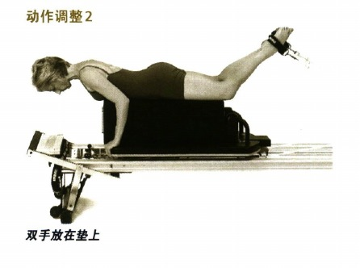
  - 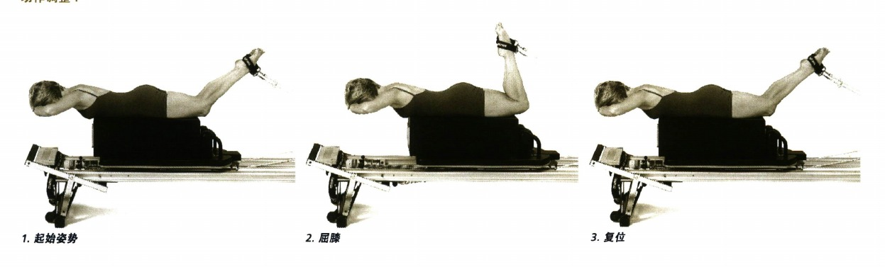
  - 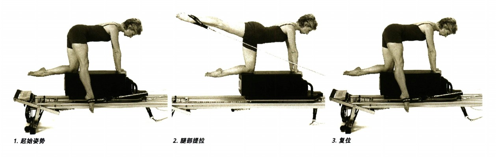
  - 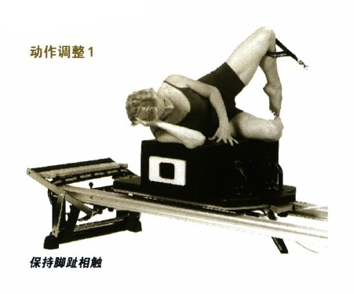
  - 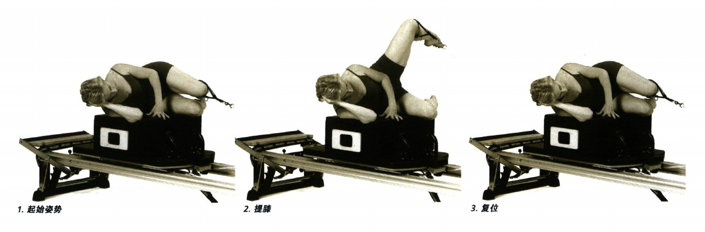
  - 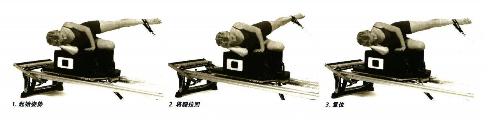
  - 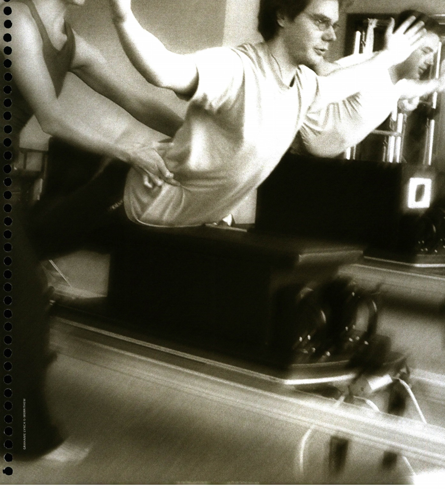

## 弓背

- 頁碼：p.84
- 難度：塑身機中級
- 器械/章節：腳踏桿、彈簧、頭墊、塑身機盒子、腳帶
- 肌群分類：[[../muscles/reformer-intermediate-core-and-lumbopelvic-stability|核心與腰骨盆穩定]], [[../muscles/reformer-intermediate-spinal-articulation|脊椎活動]], [[../muscles/reformer-intermediate-scapular-stabilizers|肩胛與上背穩定]], [[../muscles/reformer-intermediate-hips-and-legs|髖與腿]], [[../muscles/reformer-intermediate-mobility-and-stretching|柔韌與伸展]]
- 摘要：弓背：主要歸入核心與腰骨盆穩定、脊椎活動、肩胛與上背穩定、髖與腿；依頁面標題、動作說明與動作圖整理。
- 動作圖：
  - 

## 直背 盒子橫放 (STRAIGHT BACK, SHORT BOX)

- 頁碼：p.85
- 難度：塑身機中級
- 器械/章節：腳踏桿、彈簧、頭墊、塑身機盒子、腳帶
- 肌群分類：[[../muscles/reformer-intermediate-core-and-lumbopelvic-stability|核心與腰骨盆穩定]], [[../muscles/reformer-intermediate-spinal-articulation|脊椎活動]], [[../muscles/reformer-intermediate-scapular-stabilizers|肩胛與上背穩定]], [[../muscles/reformer-intermediate-hips-and-legs|髖與腿]], [[../muscles/reformer-intermediate-mobility-and-stretching|柔韌與伸展]]
- 摘要：直背 盒子橫放：主要歸入核心與腰骨盆穩定、脊椎活動、肩胛與上背穩定、髖與腿；依 OCR 原理/目標肌肉段落整理。
- OCR 原文摘錄：目標肌肉：以腹橫肌擠壓腹部，穩定腰骨盆部位；以深層骨盆底 肌輔助腹橫肌運動；利用豎脊肌、腹直肌和腹斜肌穩定脊椎，特 • 別要用腹肌在向後擺動時穩定脊椎；肩胛骨穩定肌 •
- 動作圖：
  - 

## 弓背扭轉 盒子橫放 (1 TWIST WITH ROUND BACK, SHORT BOX)

- 頁碼：p.86-87
- 難度：塑身機中級
- 器械/章節：腳踏桿、彈簧、塑身機盒子、腳帶
- 肌群分類：[[../muscles/reformer-intermediate-core-and-lumbopelvic-stability|核心與腰骨盆穩定]], [[../muscles/reformer-intermediate-spinal-articulation|脊椎活動]], [[../muscles/reformer-intermediate-scapular-stabilizers|肩胛與上背穩定]], [[../muscles/reformer-intermediate-hips-and-legs|髖與腿]], [[../muscles/reformer-intermediate-mobility-and-stretching|柔韌與伸展]]
- 摘要：弓背扭轉 盒子橫放：主要歸入核心與腰骨盆穩定、脊椎活動、肩胛與上背穩定、髖與腿；依頁面標題、動作說明與動作圖整理。
- 動作圖：
  - 
  - 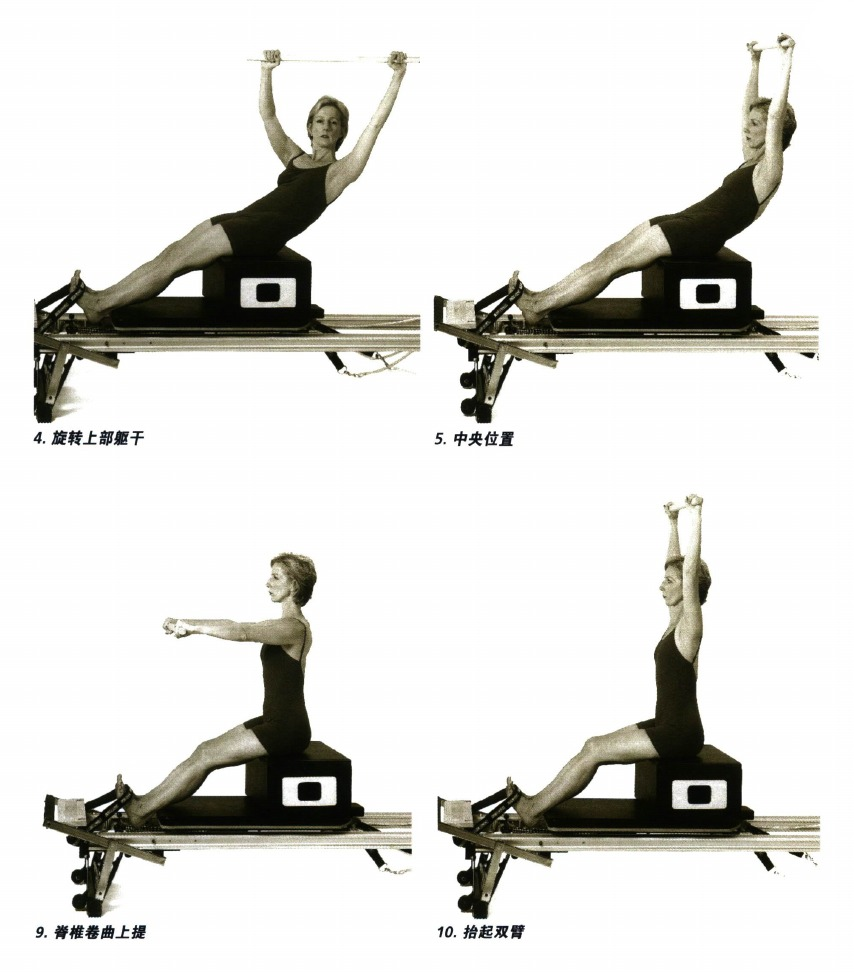

## 傾斜 盒子橫放 (LEAN, SHORT BOX)

- 頁碼：p.88-89
- 難度：塑身機中級
- 器械/章節：腳踏桿、彈簧、頭墊、塑身機盒子、腳帶
- 肌群分類：[[../muscles/reformer-intermediate-core-and-lumbopelvic-stability|核心與腰骨盆穩定]], [[../muscles/reformer-intermediate-spinal-articulation|脊椎活動]], [[../muscles/reformer-intermediate-scapular-stabilizers|肩胛與上背穩定]], [[../muscles/reformer-intermediate-lat-teres-pulling-chain|背闊肌與拉力鏈]], [[../muscles/reformer-intermediate-hips-and-legs|髖與腿]], [[../muscles/reformer-intermediate-mobility-and-stretching|柔韌與伸展]]
- 摘要：傾斜 盒子橫放：主要歸入核心與腰骨盆穩定、脊椎活動、肩胛與上背穩定、背闊肌與拉力鏈；依 OCR 原理/目標肌肉段落整理。
- OCR 原文摘錄：勾住腳帶。雙臂伸直，分開至與肩同寬，握住卷身棒，舉過頭頂。 肩胛骨保持穩定。 目標肌肉：以腹橫肌擠壓腹部，穩定腰骨盆部位；以深層骨盆底 肌輔助腹橫肌運動；向心收縮一側腹外斜肌和另一側腹內斜肌， 練習 以使脊椎旋轉；等長收縮腹斜肌、豎脊肌和背闊肌以使軀幹在傾 吸氣 脊椎保持中立位，骨盆正對前方，雙臂舉過頭頂，旋轉上 斜時保持穩定；肩胛骨穩定肌群 身至滑墊一側
- 動作圖：
  - 
  - 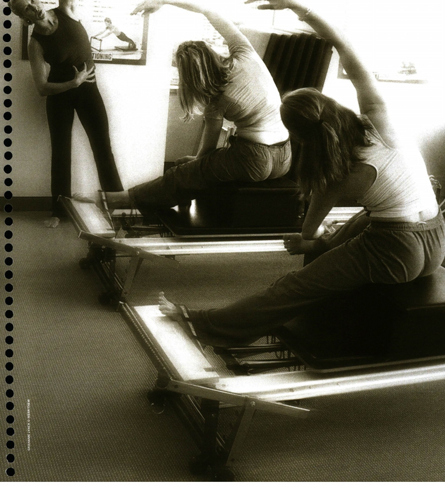

## 樹姿 盒子橫放 (TREE, SHORT BOX)

- 頁碼：p.90-91
- 難度：塑身機中級
- 器械/章節：腳踏桿、彈簧、頭墊、塑身機盒子、腳帶
- 肌群分類：[[../muscles/reformer-intermediate-core-and-lumbopelvic-stability|核心與腰骨盆穩定]], [[../muscles/reformer-intermediate-spinal-articulation|脊椎活動]], [[../muscles/reformer-intermediate-scapular-stabilizers|肩胛與上背穩定]], [[../muscles/reformer-intermediate-hips-and-legs|髖與腿]], [[../muscles/reformer-intermediate-mobility-and-stretching|柔韌與伸展]]
- 摘要：樹姿 盒子橫放：主要歸入核心與腰骨盆穩定、脊椎活動、肩胛與上背穩定、髖與腿；依頁面標題、動作說明與動作圖整理。
- 動作圖：
  - 
  - 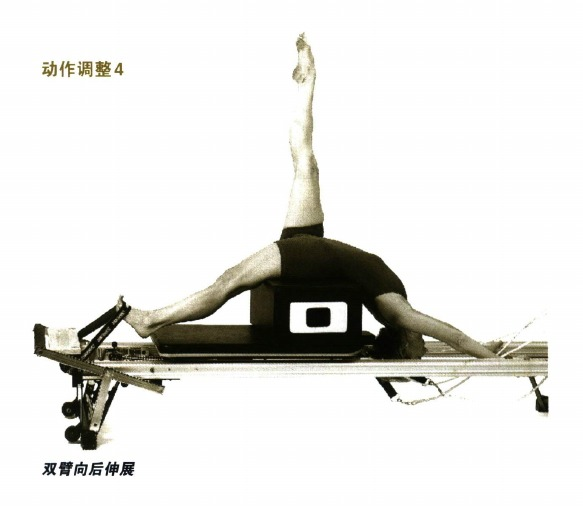
  - 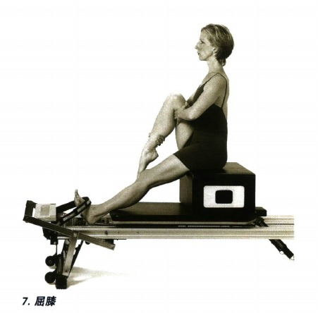

## 美人魚姿 盒子橫放 (MERMAID, SHORT BOX)

- 頁碼：p.92-97
- 難度：塑身機中級
- 器械/章節：腳踏桿、彈簧、頭墊、塑身機盒子、腳帶
- 肌群分類：[[../muscles/reformer-intermediate-core-and-lumbopelvic-stability|核心與腰骨盆穩定]], [[../muscles/reformer-intermediate-spinal-articulation|脊椎活動]], [[../muscles/reformer-intermediate-scapular-stabilizers|肩胛與上背穩定]], [[../muscles/reformer-intermediate-arms-delts-pecs|手臂與胸肩]], [[../muscles/reformer-intermediate-hips-and-legs|髖與腿]], [[../muscles/reformer-intermediate-mobility-and-stretching|柔韌與伸展]]
- 摘要：美人魚姿 盒子橫放：主要歸入核心與腰骨盆穩定、脊椎活動、肩胛與上背穩定、手臂與胸肩；依 OCR 原理/目標肌肉段落整理。
- OCR 原文摘錄：目標肌肉：腹橫肌擠壓腹部，穩定腰骨盆部位；以深層骨盆底肌 輔助腹橫肌運動；軀幹向地面方向側屈時，離心收縮靠近腳踏杆 一側的內外斜肌，然後向心收縮上述肌肉以使軀幹復位，再向腳 踏杆方向側屈；利用腹斜肌和多裂肌防止旋轉；利用豎脊肌和腹 斜肌防止前屈或伸展
- 動作圖：
  - 
  - 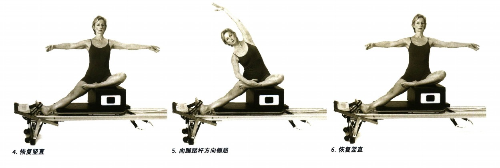
  - 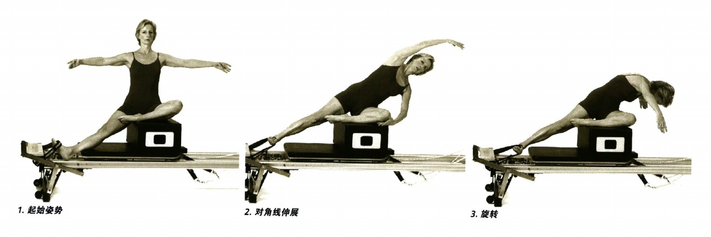
  - 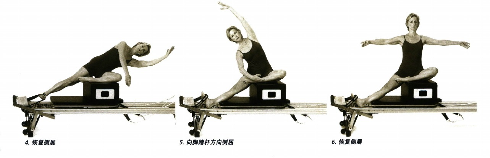
  - 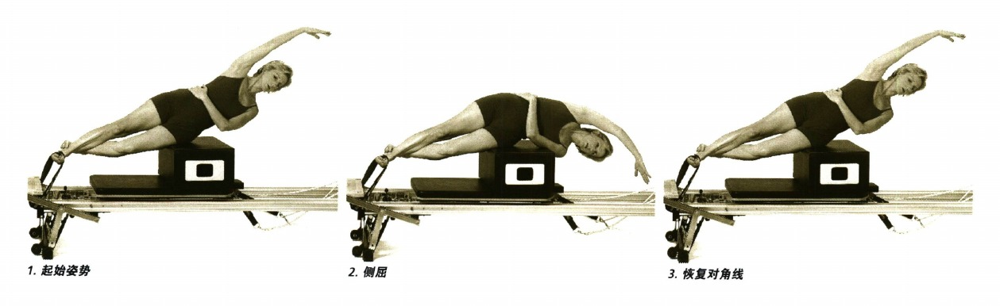
  - 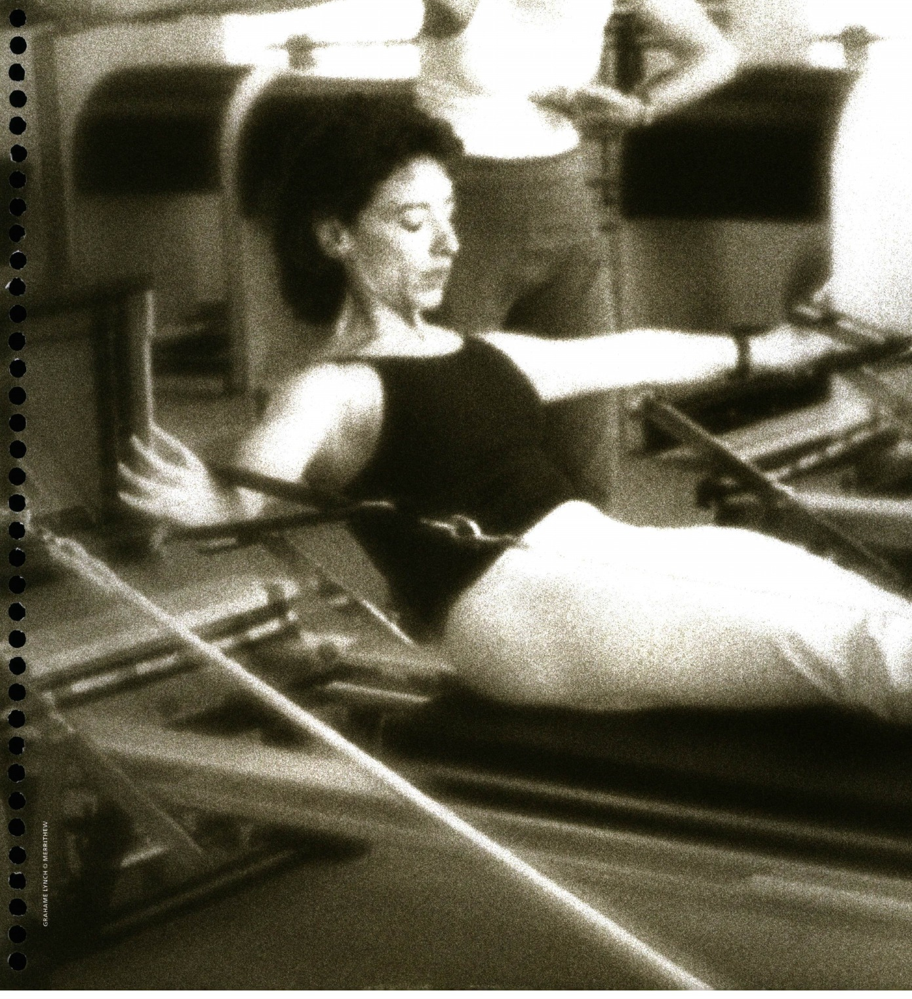

## 直線伸展 (LONG STRETCH)

- 頁碼：p.98-99
- 難度：塑身機中級
- 器械/章節：腳踏桿、彈簧、頭墊
- 肌群分類：[[../muscles/reformer-intermediate-core-and-lumbopelvic-stability|核心與腰骨盆穩定]], [[../muscles/reformer-intermediate-spinal-articulation|脊椎活動]], [[../muscles/reformer-intermediate-scapular-stabilizers|肩胛與上背穩定]], [[../muscles/reformer-intermediate-lat-teres-pulling-chain|背闊肌與拉力鏈]], [[../muscles/reformer-intermediate-arms-delts-pecs|手臂與胸肩]], [[../muscles/reformer-intermediate-hips-and-legs|髖與腿]], [[../muscles/reformer-intermediate-mobility-and-stretching|柔韌與伸展]]
- 摘要：直線伸展：主要歸入核心與腰骨盆穩定、脊椎活動、肩胛與上背穩定、背闊肌與拉力鏈；依頁面標題、動作說明與動作圖整理。
- 動作圖：
  - 
  - 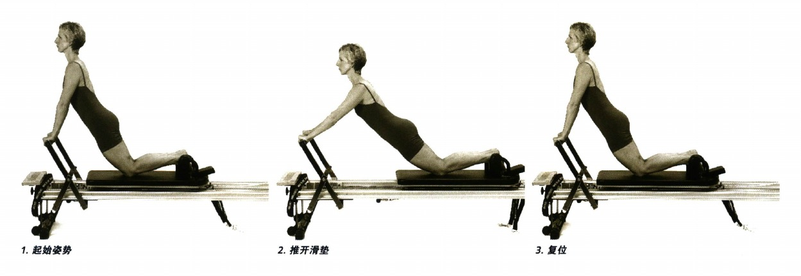

## 向下伸展 (DOWN STRETCH)

- 頁碼：p.100-101
- 難度：塑身機中級
- 器械/章節：腳踏桿、彈簧
- 肌群分類：[[../muscles/reformer-intermediate-core-and-lumbopelvic-stability|核心與腰骨盆穩定]], [[../muscles/reformer-intermediate-spinal-articulation|脊椎活動]], [[../muscles/reformer-intermediate-scapular-stabilizers|肩胛與上背穩定]], [[../muscles/reformer-intermediate-lat-teres-pulling-chain|背闊肌與拉力鏈]], [[../muscles/reformer-intermediate-arms-delts-pecs|手臂與胸肩]], [[../muscles/reformer-intermediate-hips-and-legs|髖與腿]], [[../muscles/reformer-intermediate-mobility-and-stretching|柔韌與伸展]]
- 摘要：向下伸展：主要歸入核心與腰骨盆穩定、脊椎活動、肩胛與上背穩定、背闊肌與拉力鏈；依頁面標題、動作說明與動作圖整理。
- 動作圖：
  - 
  - 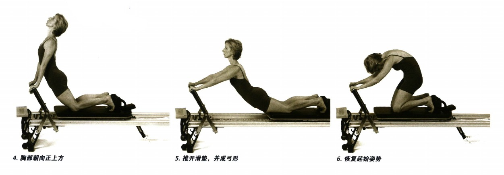

## 向上伸展 (UP STRETCH)

- 頁碼：p.102-103
- 難度：塑身機中級
- 器械/章節：腳踏桿、彈簧
- 肌群分類：[[../muscles/reformer-intermediate-core-and-lumbopelvic-stability|核心與腰骨盆穩定]], [[../muscles/reformer-intermediate-spinal-articulation|脊椎活動]], [[../muscles/reformer-intermediate-scapular-stabilizers|肩胛與上背穩定]], [[../muscles/reformer-intermediate-lat-teres-pulling-chain|背闊肌與拉力鏈]], [[../muscles/reformer-intermediate-arms-delts-pecs|手臂與胸肩]], [[../muscles/reformer-intermediate-hips-and-legs|髖與腿]], [[../muscles/reformer-intermediate-mobility-and-stretching|柔韌與伸展]]
- 摘要：向上伸展：主要歸入核心與腰骨盆穩定、脊椎活動、肩胛與上背穩定、背闊肌與拉力鏈；依 OCR 原理/目標肌肉段落整理。
- OCR 原文摘錄：腳踏杆調到1號位，掛1根或2根彈簧 目標肌肉：以腹橫肌擠壓腹部，穩定腰骨盆部位；以深層骨盆底 肌輔助腹橫肌運動；向心收縮髖伸肌群，以推開滑墊；向心收縮
- 動作圖：
  - 
  - 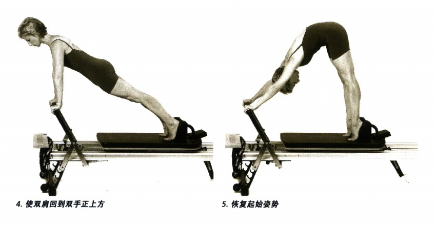

## 大象姿 (ELEPHANT)

- 頁碼：p.104-105
- 難度：塑身機中級
- 器械/章節：腳踏桿、彈簧
- 肌群分類：[[../muscles/reformer-intermediate-core-and-lumbopelvic-stability|核心與腰骨盆穩定]], [[../muscles/reformer-intermediate-spinal-articulation|脊椎活動]], [[../muscles/reformer-intermediate-scapular-stabilizers|肩胛與上背穩定]], [[../muscles/reformer-intermediate-arms-delts-pecs|手臂與胸肩]], [[../muscles/reformer-intermediate-hips-and-legs|髖與腿]], [[../muscles/reformer-intermediate-mobility-and-stretching|柔韌與伸展]]
- 摘要：大象姿：主要歸入核心與腰骨盆穩定、脊椎活動、肩胛與上背穩定、手臂與胸肩；依 OCR 原理/目標肌肉段落整理。
- OCR 原文摘錄：腳踏杆調到1號位，掛1根或2根彈簧 目標肌肉：以腹橫肌擠壓腹部，穩定腰骨盆部位；以深層骨盆 底肌輔助腹橫肌運動；等長收縮腹直肌和腹斜肌，以使軀幹彎
- 動作圖：
  - 
  - 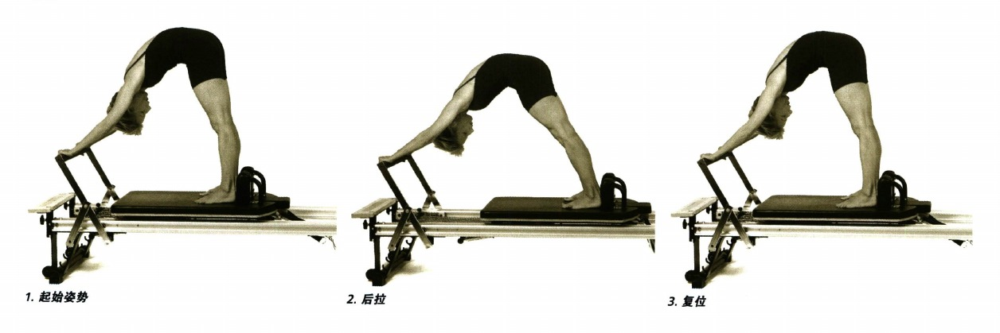
  - 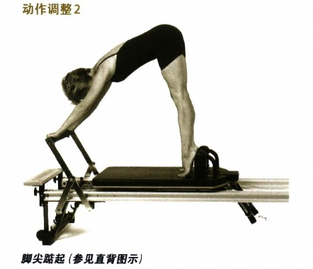
  - 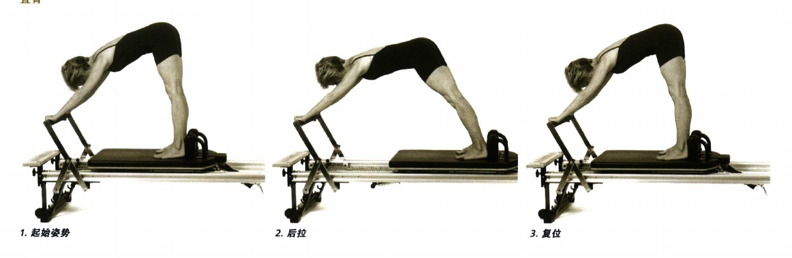

## 半弧 (SEMICIRCLE)

- 頁碼：p.106-108
- 難度：塑身機中級
- 器械/章節：腳踏桿、彈簧
- 肌群分類：[[../muscles/reformer-intermediate-core-and-lumbopelvic-stability|核心與腰骨盆穩定]], [[../muscles/reformer-intermediate-spinal-articulation|脊椎活動]], [[../muscles/reformer-intermediate-scapular-stabilizers|肩胛與上背穩定]], [[../muscles/reformer-intermediate-arms-delts-pecs|手臂與胸肩]], [[../muscles/reformer-intermediate-hips-and-legs|髖與腿]], [[../muscles/reformer-intermediate-mobility-and-stretching|柔韌與伸展]]
- 摘要：半弧：主要歸入核心與腰骨盆穩定、脊椎活動、肩胛與上背穩定、手臂與胸肩；依 OCR 原理/目標肌肉段落整理。
- OCR 原文摘錄：順序使脊椎逐節彎曲再伸展，並帶動骨盆下落，使其位於 目標肌肉：以腹橫肌擠壓腹部，穩定腰骨盆部位；以深層骨盆 2根彈簧之間。 底肌輔助腹橫肌運動；脊椎彎曲時，向心收縮腹直肌和腹斜 呼氣 骨盆保持低位且脊椎保持穩定伸展，彎曲雙膝，使滑墊復 肌，脊椎伸展時，離心收縮上述肌肉；向心收縮臀大肌和股後 位。然後，按照從尾椎骨到胸椎的順序，使脊椎逐節彎曲， 肌群以伸展髖部並上抬骨盆；在骨盆保持上抬的狀態下，推開 再伸展髖部使骨盆上拾至雙腳上方，同時使滑墊完全復位， 滑墊時，離心收縮股後肌群；反向運動中，向心收縮股後肌 身體恢復
- 動作圖：
  - 
  - 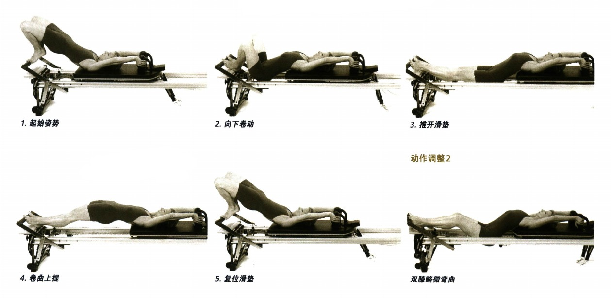
  - 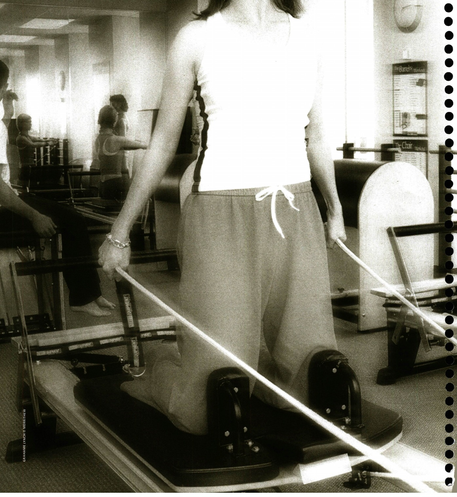

## 胸部擴張 (CHEST EXPANSION)

- 頁碼：p.109-111
- 難度：塑身機中級
- 器械/章節：腳踏桿、彈簧、拉環與繩索
- 肌群分類：[[../muscles/reformer-intermediate-core-and-lumbopelvic-stability|核心與腰骨盆穩定]], [[../muscles/reformer-intermediate-spinal-articulation|脊椎活動]], [[../muscles/reformer-intermediate-scapular-stabilizers|肩胛與上背穩定]], [[../muscles/reformer-intermediate-lat-teres-pulling-chain|背闊肌與拉力鏈]], [[../muscles/reformer-intermediate-arms-delts-pecs|手臂與胸肩]], [[../muscles/reformer-intermediate-hips-and-legs|髖與腿]], [[../muscles/reformer-intermediate-mobility-and-stretching|柔韌與伸展]]
- 摘要：胸部擴張：主要歸入核心與腰骨盆穩定、脊椎活動、肩胛與上背穩定、背闊肌與拉力鏈；依 OCR 原理/目標肌肉段落整理。
- OCR 原文摘錄：以腹橫肌擠壓腹部，穩定腰骨盆部位；以深層骨盆底 肌輔助腹橫肌運動；利用臀大肌和股後肌群使大腿骨穩定支撐骨
- 動作圖：
  - 
  - 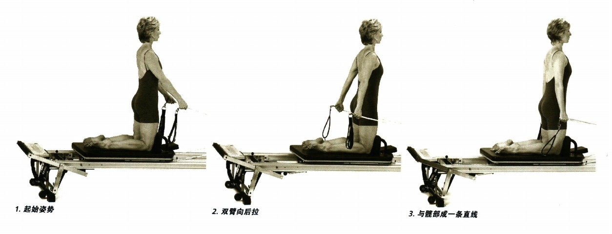
  - 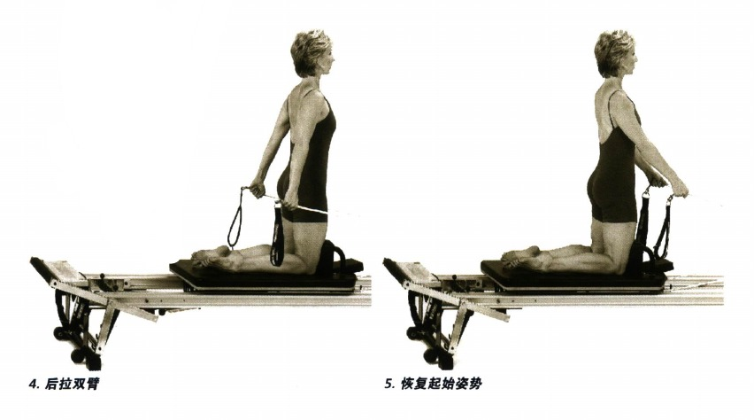

## 側跪手臂準備動作 (SIDE ARM PREPS KNEELING)

- 頁碼：p.112-119
- 難度：塑身機中級
- 器械/章節：腳踏桿、彈簧、拉環與繩索
- 肌群分類：[[../muscles/reformer-intermediate-core-and-lumbopelvic-stability|核心與腰骨盆穩定]], [[../muscles/reformer-intermediate-spinal-articulation|脊椎活動]], [[../muscles/reformer-intermediate-scapular-stabilizers|肩胛與上背穩定]], [[../muscles/reformer-intermediate-arms-delts-pecs|手臂與胸肩]], [[../muscles/reformer-intermediate-hips-and-legs|髖與腿]], [[../muscles/reformer-intermediate-mobility-and-stretching|柔韌與伸展]]
- 摘要：側跪手臂準備動作：主要歸入核心與腰骨盆穩定、脊椎活動、肩胛與上背穩定、手臂與胸肩；依 OCR 原理/目標肌肉段落整理。
- OCR 原文摘錄：以腹橫肌擠壓腹部，穩定腰骨盆部位；以深層骨盆底 ，要用大腿骨支撐骨盆，並利用腹肌、股後肌群和臀大肌將骨盆 肌輔助腹橫肌運動；利用豎脊肌和腹斜肌使軀幹保持豎直；利用 穩定在中立位 髖伸肌群、髖內收肌群、髖外展肌群和腹肌來穩定骨盆；利用腹 斜肌和豎脊肌群防止軀幹屈曲；利用多裂肌和腹斜肌防止軀幹旋 • 利用髖內收肌群和髖外展肌群防止骨盆側傾或側移 轉（除練習7以外）；肩胛骨穩定肌群 ，要通過收緊腹肌來穩定軀幹，避免肋骨架上提 ［11向心收縮肩胛下肌，以使肱部內旋，肱部復位時，離心收縮肩 ，避免軀幹歪向一側 胛下肌 ，避免肋骨架上提、前傾或側移 ［2］向心收縮肩胛棘下肌和小圓肌，以使肱部外旋，肱部復位時， • 雙臂開始運動時，肩胛骨要保持穩定，並全程保持該狀態 離心收縮上述肌肉 ，手腕始終保持伸展 ［3］ 向心收縮背闊
- 動作圖：
  - 
  - 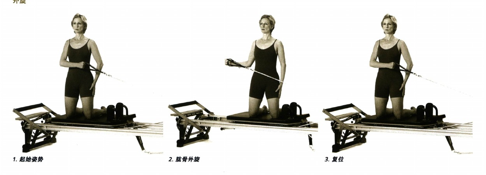
  - 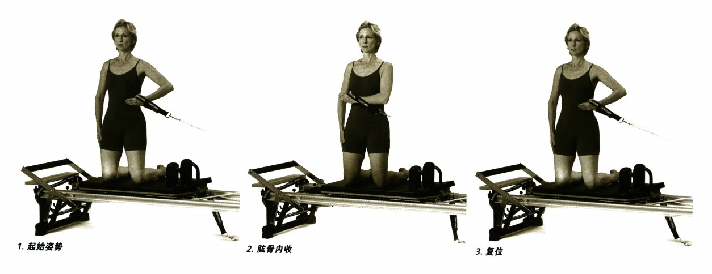
  - 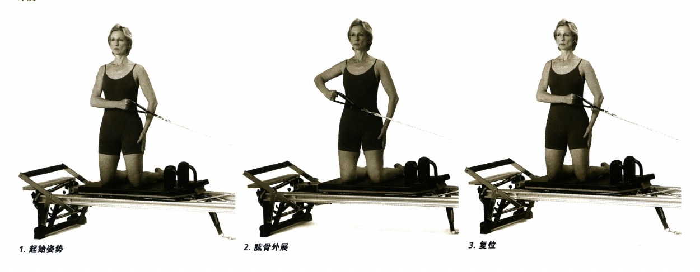
  - 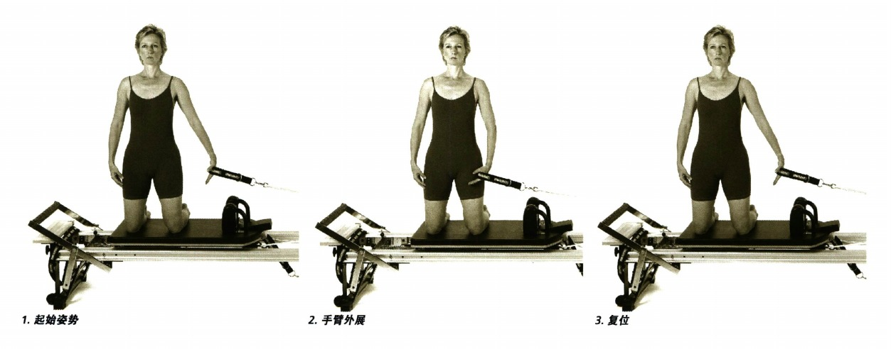
  - 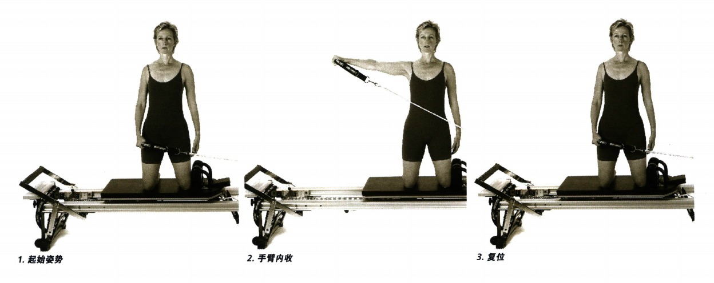
  - 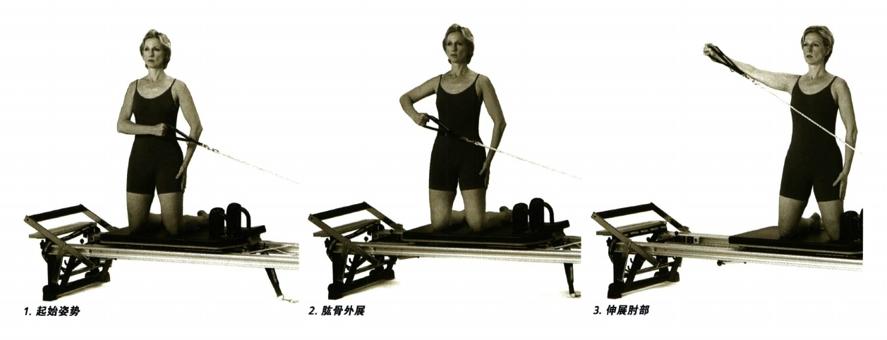
  - 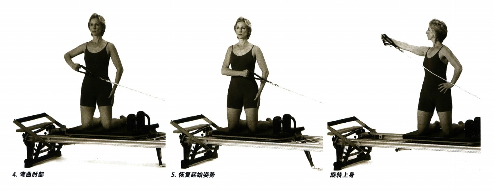

## 側跪扭轉

- 頁碼：p.120
- 難度：塑身機中級
- 器械/章節：腳踏桿、彈簧、拉環與繩索
- 肌群分類：[[../muscles/reformer-intermediate-core-and-lumbopelvic-stability|核心與腰骨盆穩定]], [[../muscles/reformer-intermediate-spinal-articulation|脊椎活動]], [[../muscles/reformer-intermediate-scapular-stabilizers|肩胛與上背穩定]], [[../muscles/reformer-intermediate-arms-delts-pecs|手臂與胸肩]], [[../muscles/reformer-intermediate-hips-and-legs|髖與腿]], [[../muscles/reformer-intermediate-mobility-and-stretching|柔韌與伸展]]
- 摘要：側跪扭轉：主要歸入核心與腰骨盆穩定、脊椎活動、肩胛與上背穩定、手臂與胸肩；依 OCR 原理/目標肌肉段落整理。
- OCR 原文摘錄：1.雙手進一步伸展。畫一個更大的弧。這一做法會使阻力增大， 目標肌肉：以腹橫肌擠壓腹部，穩定腰骨盆部位；以深層骨盆底 從而加大鍛鍊強度。 肌輔助腹橫肌運動；利用豎脊肌和腹斜肌保持軀幹豎直；向心收 2.握住健身圈阻力圈。握住健身圈阻力圈的一個手柄，使其抵在 縮髖伸肌群、髖外展肌群、髖內收肌群和腹肌以穩定骨盆：向心 肋骨架部位，另一個手柄套入拉環。對健身圈施力，以幫助肩胛 收縮靠近滑輪方向的腹外斜肌和另一側的腹內斜肌，以使脊椎旋 骨保持穩定，並輔助脊椎的單獨旋轉。 轉，並在脊椎復位時，離心收縮上述肌肉；肩胛骨穩定肌群
- 動作圖：
  - 

## 反向擴張 (REVERSE EXPANSION)

- 頁碼：p.121-125
- 難度：塑身機中級
- 器械/章節：腳踏桿、彈簧、拉環與繩索
- 肌群分類：[[../muscles/reformer-intermediate-core-and-lumbopelvic-stability|核心與腰骨盆穩定]], [[../muscles/reformer-intermediate-spinal-articulation|脊椎活動]], [[../muscles/reformer-intermediate-scapular-stabilizers|肩胛與上背穩定]], [[../muscles/reformer-intermediate-arms-delts-pecs|手臂與胸肩]], [[../muscles/reformer-intermediate-hips-and-legs|髖與腿]], [[../muscles/reformer-intermediate-mobility-and-stretching|柔韌與伸展]]
- 摘要：反向擴張：主要歸入核心與腰骨盆穩定、脊椎活動、肩胛與上背穩定、手臂與胸肩；依 OCR 原理/目標肌肉段落整理。
- OCR 原文摘錄：以腹橫肌擠壓腹部，穩定腰骨盆部位；以深層骨盆底 肌輔助腹橫肌運動；利用豎脊肌群、腹直肌和腹斜肌穩定軀幹， 後方阻力使腹肌得到鍛鍊；用腹肌和髖伸肌群穩定骨盆；後方阻 力也使肩胛骨穩定肌群，尤其是前鋸肌得到鍛鍊 ［1, 2, 31向心收縮前三角肌和胸大肌，使雙肩屈曲，雙肩復位時， 離心收縮上述肌肉 • ［4］雙肘伸展時，向心收縮肱三頭肌，雙肘復位時，離心收縮肱三 頭肌；等長收縮三角肌以保持雙臂高度 ［5］雙肘彎曲時，向心收縮二頭肌，雙肘復位時，離心收縮二頭肌： 利用大圓肌和背闊肌保持肩部伸展
- 動作圖：
  - 
  - 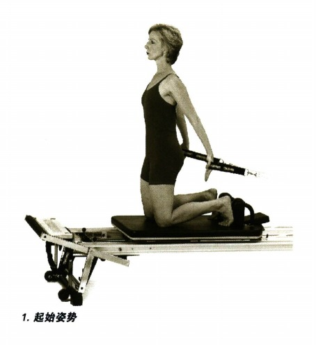
  - 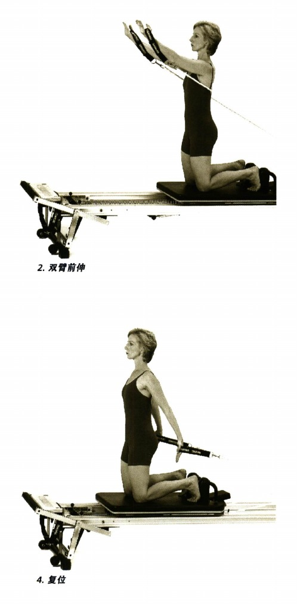
  - 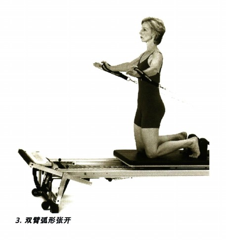
  - 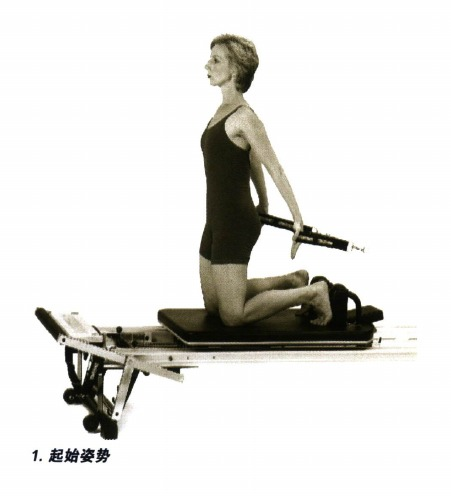
  - 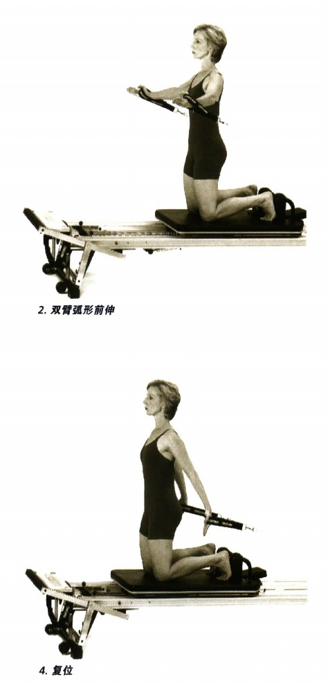
  - 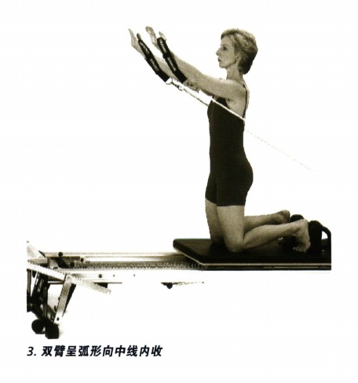
  - 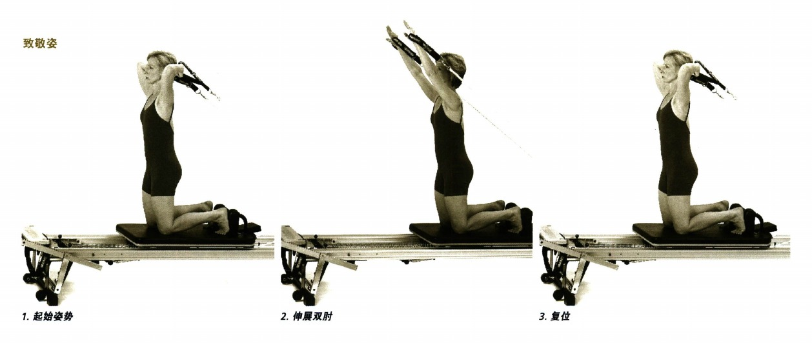
  - 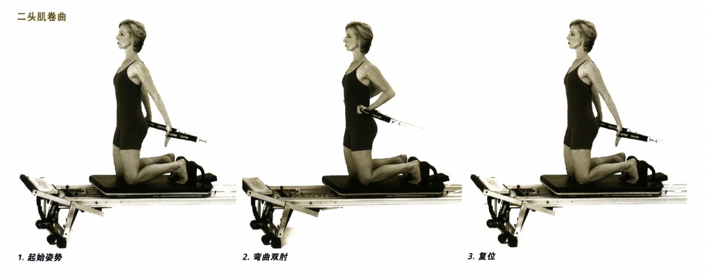

## 美人魚姿 (MERMAID)

- 頁碼：p.126-129
- 難度：塑身機中級
- 器械/章節：腳踏桿、彈簧
- 肌群分類：[[../muscles/reformer-intermediate-core-and-lumbopelvic-stability|核心與腰骨盆穩定]], [[../muscles/reformer-intermediate-spinal-articulation|脊椎活動]], [[../muscles/reformer-intermediate-scapular-stabilizers|肩胛與上背穩定]], [[../muscles/reformer-intermediate-arms-delts-pecs|手臂與胸肩]], [[../muscles/reformer-intermediate-hips-and-legs|髖與腿]], [[../muscles/reformer-intermediate-mobility-and-stretching|柔韌與伸展]]
- 摘要：美人魚姿：主要歸入核心與腰骨盆穩定、脊椎活動、肩胛與上背穩定、手臂與胸肩；依 OCR 原理/目標肌肉段落整理。
- OCR 原文摘錄：目標肌肉：以腹橫肌擠壓腹部，穩定腰骨盆部位；以深層骨盆底 肌輔助腹橫肌運動；利用豎脊肌和腹斜肌防止脊椎前屈或伸展； 脊椎側屈時，向心收縮同側的腹內外斜肌，離心收縮另一側的腹 內外斜肌；利用腹斜肌和多裂肌的力量防止身體旋轉：肩胛骨穩 定肌群
- 動作圖：
  - 
  - 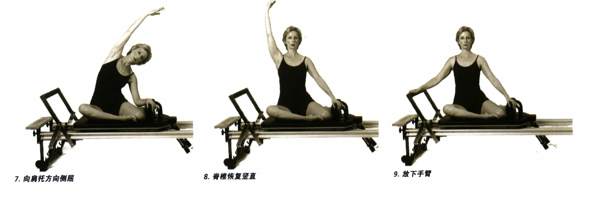
  - 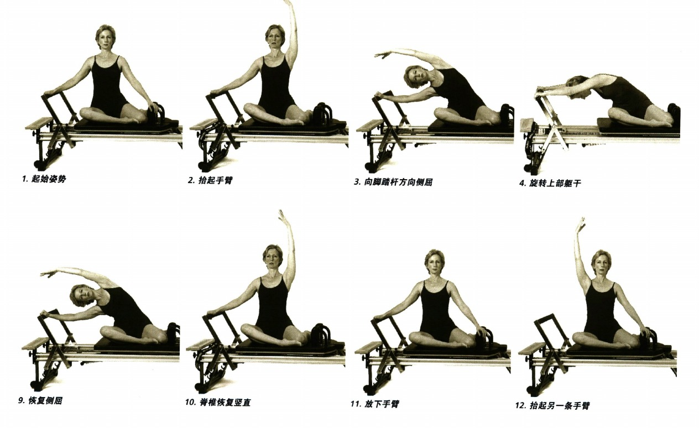
  - 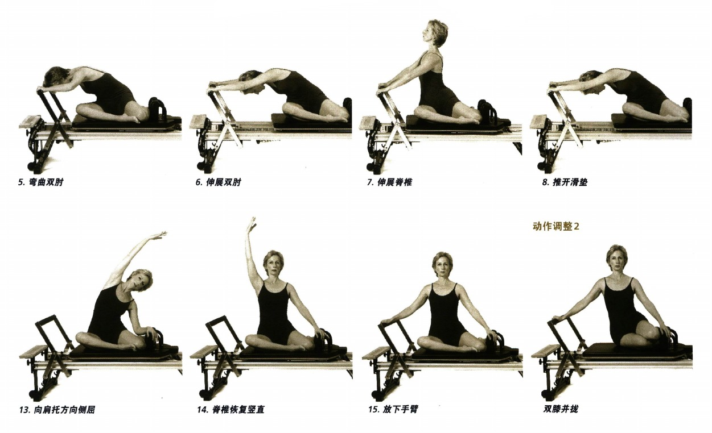

## 雙腿畫弧 (LEG CIRCLES)

- 頁碼：p.130-133
- 難度：塑身機中級
- 器械/章節：腳踏桿、彈簧、頭墊、拉環與繩索
- 肌群分類：[[../muscles/reformer-intermediate-core-and-lumbopelvic-stability|核心與腰骨盆穩定]], [[../muscles/reformer-intermediate-spinal-articulation|脊椎活動]], [[../muscles/reformer-intermediate-arms-delts-pecs|手臂與胸肩]], [[../muscles/reformer-intermediate-hips-and-legs|髖與腿]], [[../muscles/reformer-intermediate-mobility-and-stretching|柔韌與伸展]]
- 摘要：雙腿畫弧：主要歸入核心與腰骨盆穩定、脊椎活動、手臂與胸肩、髖與腿；依 OCR 原理/目標肌肉段落整理。
- OCR 原文摘錄：以腹橫肌擠壓腹部，穩定腰骨盆部位；以深層骨盆底 肌輔助腹橫肌運動；利用腹斜肌防止脊椎伸展；雙腿向軀幹方向
- 動作圖：
  - 
  - 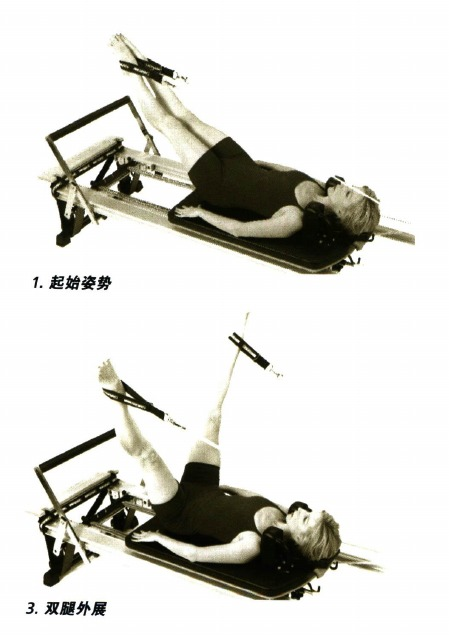
  - 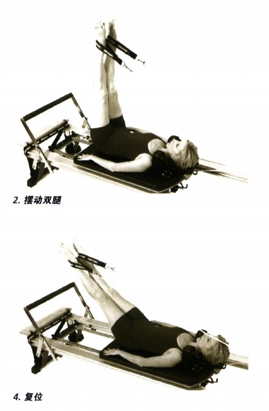
  - 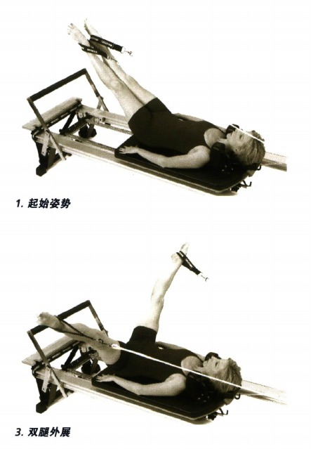
  - 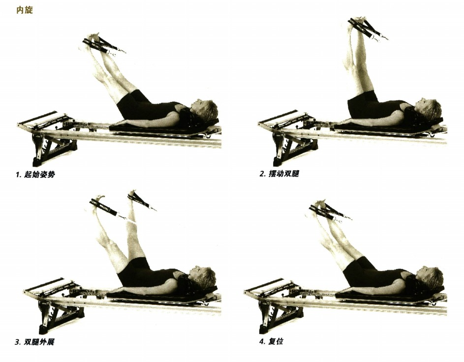
  - 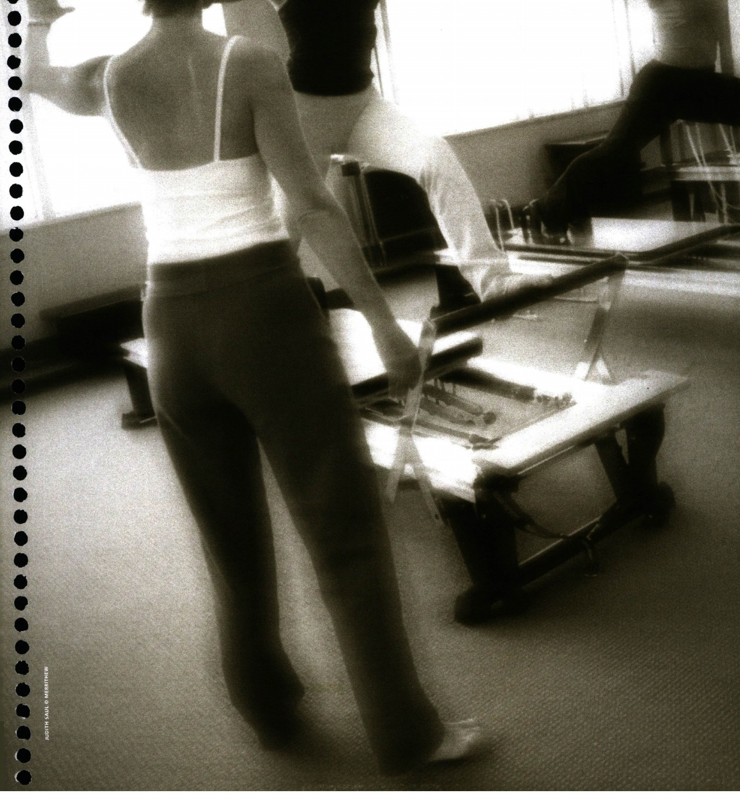

## 脊椎伸展 (LONG SPINE)

- 頁碼：p.134-135
- 難度：塑身機中級
- 器械/章節：腳踏桿、彈簧、拉環與繩索
- 肌群分類：[[../muscles/reformer-intermediate-core-and-lumbopelvic-stability|核心與腰骨盆穩定]], [[../muscles/reformer-intermediate-spinal-articulation|脊椎活動]], [[../muscles/reformer-intermediate-scapular-stabilizers|肩胛與上背穩定]], [[../muscles/reformer-intermediate-arms-delts-pecs|手臂與胸肩]], [[../muscles/reformer-intermediate-hips-and-legs|髖與腿]], [[../muscles/reformer-intermediate-mobility-and-stretching|柔韌與伸展]]
- 摘要：脊椎伸展：主要歸入核心與腰骨盆穩定、脊椎活動、肩胛與上背穩定、手臂與胸肩；依頁面標題、動作說明與動作圖整理。
- 動作圖：
  - 
  - 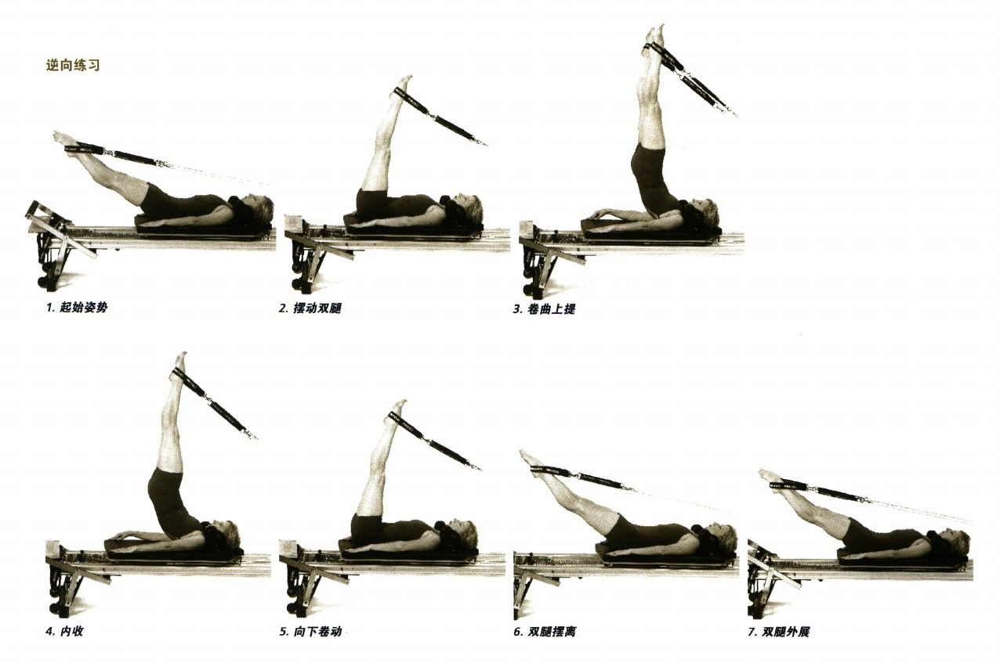

## 膝部伸展 (KNEE STRETCHES)

- 頁碼：p.136-139
- 難度：塑身機中級
- 器械/章節：腳踏桿、彈簧
- 肌群分類：[[../muscles/reformer-intermediate-core-and-lumbopelvic-stability|核心與腰骨盆穩定]], [[../muscles/reformer-intermediate-spinal-articulation|脊椎活動]], [[../muscles/reformer-intermediate-scapular-stabilizers|肩胛與上背穩定]], [[../muscles/reformer-intermediate-arms-delts-pecs|手臂與胸肩]], [[../muscles/reformer-intermediate-hips-and-legs|髖與腿]], [[../muscles/reformer-intermediate-mobility-and-stretching|柔韌與伸展]]
- 摘要：膝部伸展：主要歸入核心與腰骨盆穩定、脊椎活動、肩胛與上背穩定、手臂與胸肩；依 OCR 原理/目標肌肉段落整理。
- OCR 原文摘錄：目標肌肉：以腹橫肌擠壓腹部，穩定腰骨盆部位；以深層骨盆 底肌輔助腹橫肌運動；等長收縮腹直肌和腹斜肌，以使軀幹 彎曲並保持穩定；向心收縮髖伸肌群和四頭肌，以推開滑墊； 滑墊復位時，向心收縮髖屈肌群，並離心收縮四頭肌：肩胛骨 穩定肌
- 動作圖：
  - 
  - 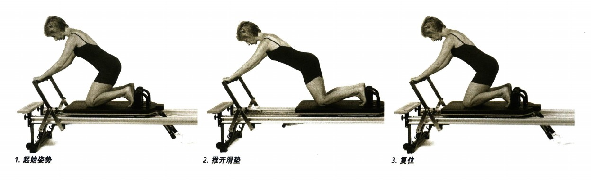
  - 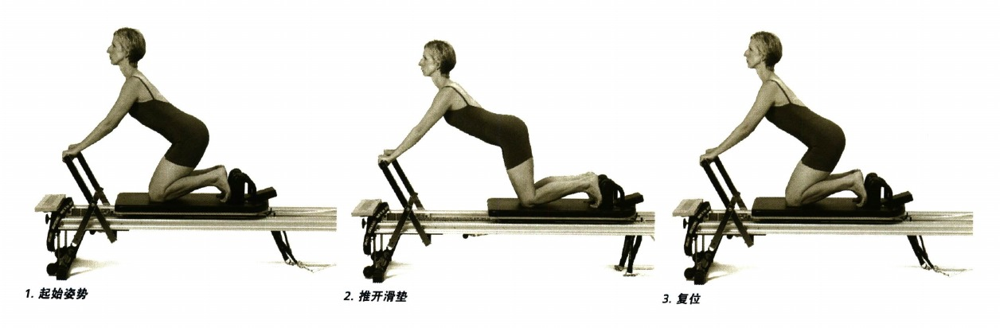
  - 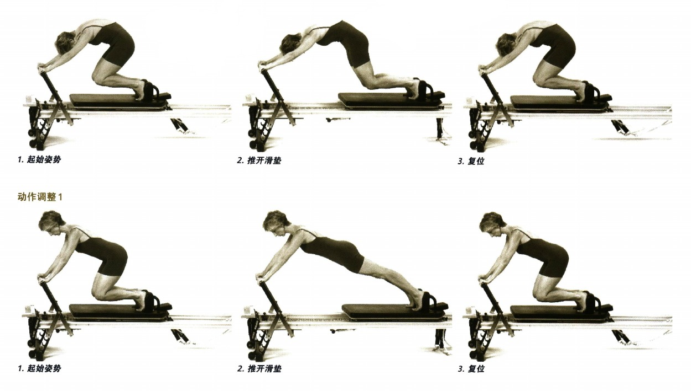

## 跑步運動 (RUNNING)

- 頁碼：p.140-142
- 難度：塑身機中級
- 器械/章節：腳踏桿、彈簧、頭墊
- 肌群分類：[[../muscles/reformer-intermediate-core-and-lumbopelvic-stability|核心與腰骨盆穩定]], [[../muscles/reformer-intermediate-spinal-articulation|脊椎活動]], [[../muscles/reformer-intermediate-arms-delts-pecs|手臂與胸肩]], [[../muscles/reformer-intermediate-hips-and-legs|髖與腿]], [[../muscles/reformer-intermediate-mobility-and-stretching|柔韌與伸展]]
- 摘要：跑步運動：主要歸入核心與腰骨盆穩定、脊椎活動、手臂與胸肩、髖與腿；依頁面標題、動作說明與動作圖整理。
- 動作圖：
  - 
  - 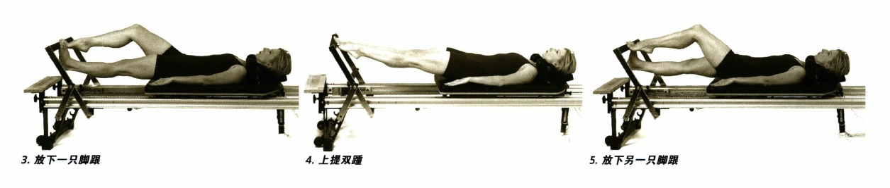
  - 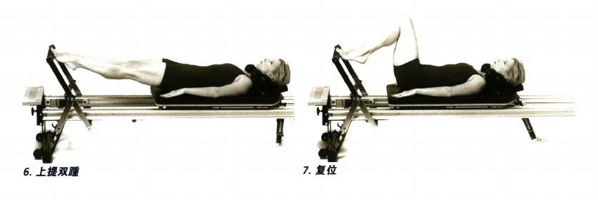
  - 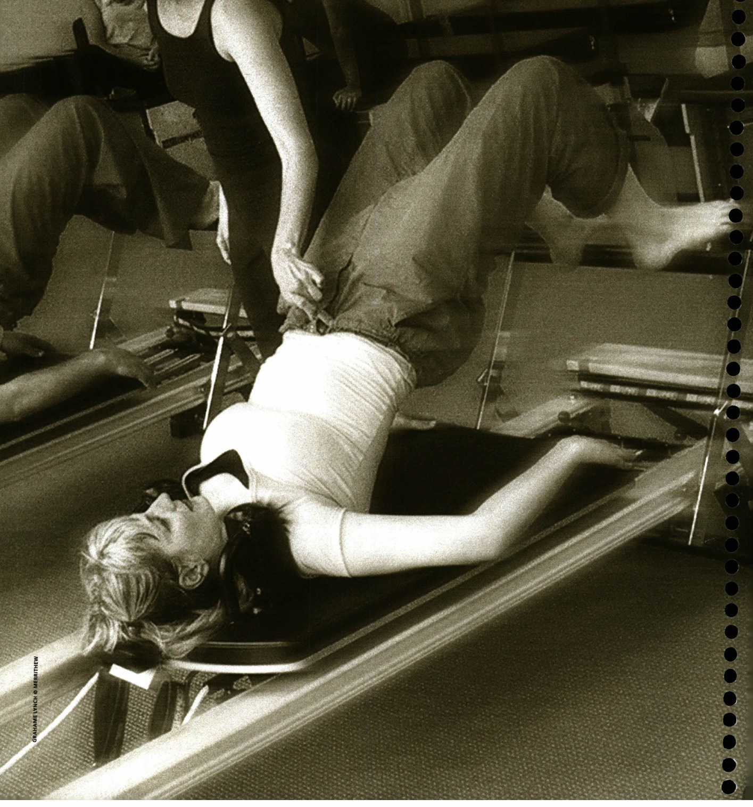

## 髖部上抬 (HIP LIFT)

- 頁碼：p.143
- 難度：塑身機中級
- 器械/章節：腳踏桿、彈簧、頭墊
- 肌群分類：[[../muscles/reformer-intermediate-core-and-lumbopelvic-stability|核心與腰骨盆穩定]], [[../muscles/reformer-intermediate-spinal-articulation|脊椎活動]], [[../muscles/reformer-intermediate-scapular-stabilizers|肩胛與上背穩定]], [[../muscles/reformer-intermediate-hips-and-legs|髖與腿]], [[../muscles/reformer-intermediate-mobility-and-stretching|柔韌與伸展]]
- 摘要：髖部上抬：主要歸入核心與腰骨盆穩定、脊椎活動、肩胛與上背穩定、髖與腿；依頁面標題、動作說明與動作圖整理。
- 動作圖：
  - 

## 髖部起伏 (HIP ROLLS)

- 頁碼：p.144-145
- 難度：塑身機中級
- 器械/章節：腳踏桿、彈簧、頭墊
- 肌群分類：[[../muscles/reformer-intermediate-core-and-lumbopelvic-stability|核心與腰骨盆穩定]], [[../muscles/reformer-intermediate-spinal-articulation|脊椎活動]], [[../muscles/reformer-intermediate-scapular-stabilizers|肩胛與上背穩定]], [[../muscles/reformer-intermediate-hips-and-legs|髖與腿]], [[../muscles/reformer-intermediate-mobility-and-stretching|柔韌與伸展]]
- 摘要：髖部起伏：主要歸入核心與腰骨盆穩定、脊椎活動、肩胛與上背穩定、髖與腿；依頁面標題、動作說明與動作圖整理。
- 動作圖：
  - 
  - 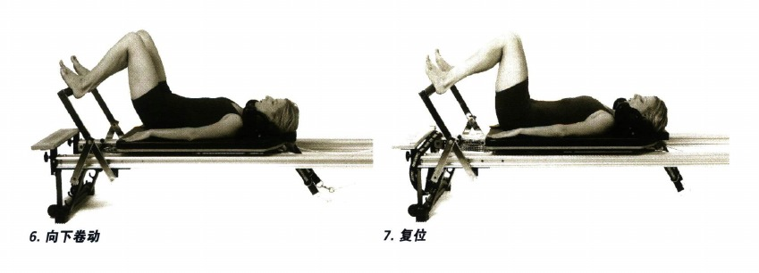

## 單側大腿伸展 (SINGLE THIGH STRETCH)

- 頁碼：p.146-147
- 難度：塑身機中級
- 器械/章節：腳踏桿、彈簧
- 肌群分類：[[../muscles/reformer-intermediate-core-and-lumbopelvic-stability|核心與腰骨盆穩定]], [[../muscles/reformer-intermediate-spinal-articulation|脊椎活動]], [[../muscles/reformer-intermediate-scapular-stabilizers|肩胛與上背穩定]], [[../muscles/reformer-intermediate-arms-delts-pecs|手臂與胸肩]], [[../muscles/reformer-intermediate-hips-and-legs|髖與腿]], [[../muscles/reformer-intermediate-mobility-and-stretching|柔韌與伸展]]
- 摘要：單側大腿伸展：主要歸入核心與腰骨盆穩定、脊椎活動、肩胛與上背穩定、手臂與胸肩；依 OCR 原理/目標肌肉段落整理。
- OCR 原文摘錄：在一側掛2根彈簧 目標肌肉：以腹橫肌擠壓腹部，穩定腰骨盆部位；以深層骨盆底
- 動作圖：
  - 
  - 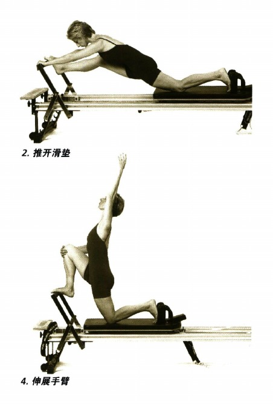
  - 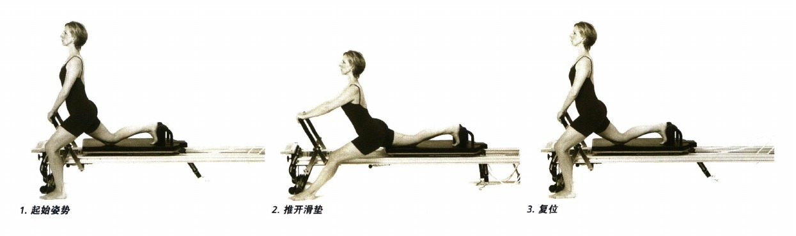

## 前劈叉 (FRONT SPLITS)

- 頁碼：p.148-149
- 難度：塑身機中級
- 器械/章節：腳踏桿、彈簧
- 肌群分類：[[../muscles/reformer-intermediate-core-and-lumbopelvic-stability|核心與腰骨盆穩定]], [[../muscles/reformer-intermediate-spinal-articulation|脊椎活動]], [[../muscles/reformer-intermediate-scapular-stabilizers|肩胛與上背穩定]], [[../muscles/reformer-intermediate-hips-and-legs|髖與腿]], [[../muscles/reformer-intermediate-mobility-and-stretching|柔韌與伸展]]
- 摘要：前劈叉：主要歸入核心與腰骨盆穩定、脊椎活動、肩胛與上背穩定、髖與腿；依 OCR 原理/目標肌肉段落整理。
- OCR 原文摘錄：注意事項：整套練習必須在受過訓練的專業人士的監督和指導下 日標肌肉：以腹橫肌擠壓腹部，穩定腰骨盆部位；以深層骨盆底 進行，以防練習者身體失衡。 肌輔助腹橫肌運動；利用豎脊肌使脊椎在小幅伸展的狀態下保持
- 動作圖：
  - 
  - 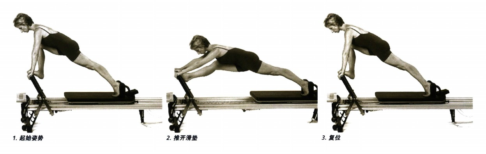

## 後劈叉 (BACK SPLITS)

- 頁碼：p.150-151
- 難度：塑身機中級
- 器械/章節：腳踏桿、彈簧、頭墊
- 肌群分類：[[../muscles/reformer-intermediate-core-and-lumbopelvic-stability|核心與腰骨盆穩定]], [[../muscles/reformer-intermediate-spinal-articulation|脊椎活動]], [[../muscles/reformer-intermediate-scapular-stabilizers|肩胛與上背穩定]], [[../muscles/reformer-intermediate-arms-delts-pecs|手臂與胸肩]], [[../muscles/reformer-intermediate-hips-and-legs|髖與腿]], [[../muscles/reformer-intermediate-mobility-and-stretching|柔韌與伸展]]
- 摘要：後劈叉：主要歸入核心與腰骨盆穩定、脊椎活動、肩胛與上背穩定、手臂與胸肩；依 OCR 原理/目標肌肉段落整理。
- OCR 原文摘錄：目標肌肉：以腹橫肌擠壓腹部，穩定腰骨盆部位；以深層骨盆底 注意事項：整套練習必須在受過訓練的專業人士的監督和指導下 進行，以防練習者身體失衡。 肌輔助腹橫肌運動；利用豎脊肌使脊椎在小幅伸展的狀態下保持 穩定：利用腹斜肌防止腰椎過度伸展；利用腹斜肌和多裂肌防止
- 動作圖：
  - 
  - 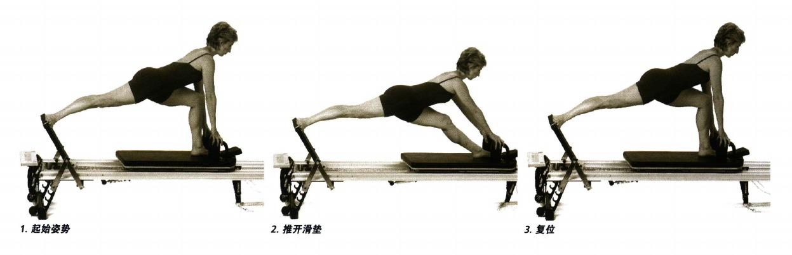

## 側劈叉 (SIDE SPLITS)

- 頁碼：p.152-160
- 難度：塑身機中級
- 器械/章節：腳踏桿、彈簧
- 肌群分類：[[../muscles/reformer-intermediate-core-and-lumbopelvic-stability|核心與腰骨盆穩定]], [[../muscles/reformer-intermediate-spinal-articulation|脊椎活動]], [[../muscles/reformer-intermediate-scapular-stabilizers|肩胛與上背穩定]], [[../muscles/reformer-intermediate-arms-delts-pecs|手臂與胸肩]], [[../muscles/reformer-intermediate-hips-and-legs|髖與腿]], [[../muscles/reformer-intermediate-mobility-and-stretching|柔韌與伸展]]
- 摘要：側劈叉：主要歸入核心與腰骨盆穩定、脊椎活動、肩胛與上背穩定、手臂與胸肩；依 OCR 原理/目標肌肉段落整理。
- OCR 原文摘錄：目標肌肉：以腹橫肌擠壓腹部，穩定腰骨盆部位；以深層骨盆 底肌輔助腹橫肌運動；等長收縮腹斜肌和豎脊肌以穩定軀幹； 等長收縮腹肌和髖伸肌群以使大腿骨穩定支撐骨盆；向心收縮 髖外展肌群，以推開滑墊，並在滑墊復位時，離心收縮髖外展 肌群
- 動作圖：
  - 
  - 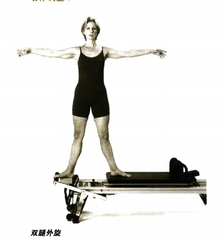
  - 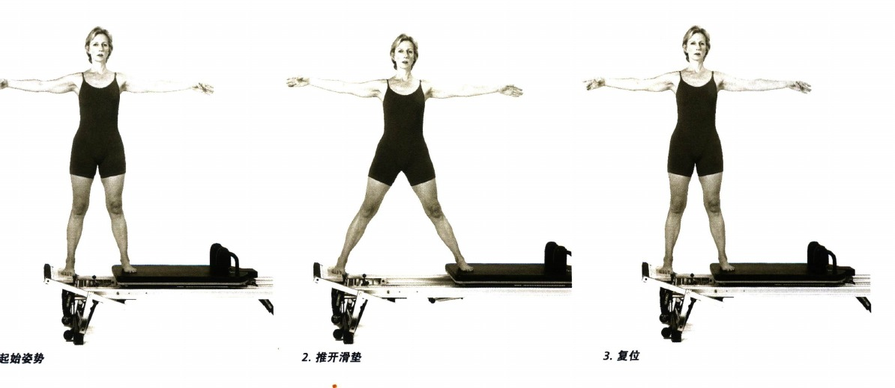
  - 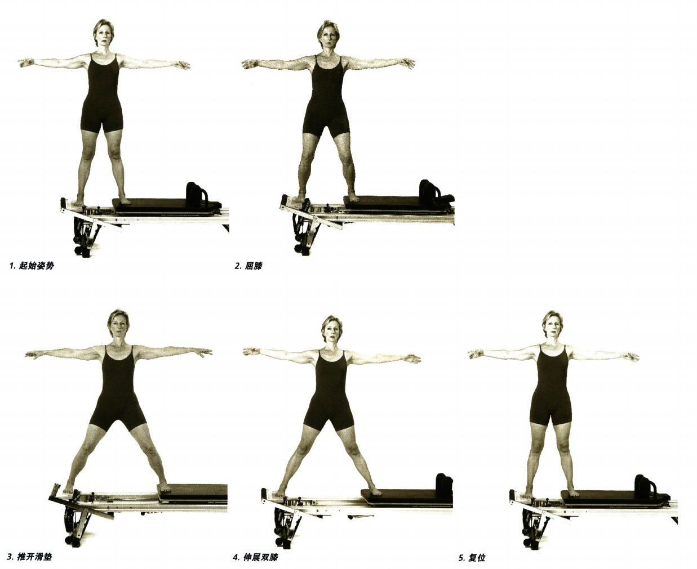
  - 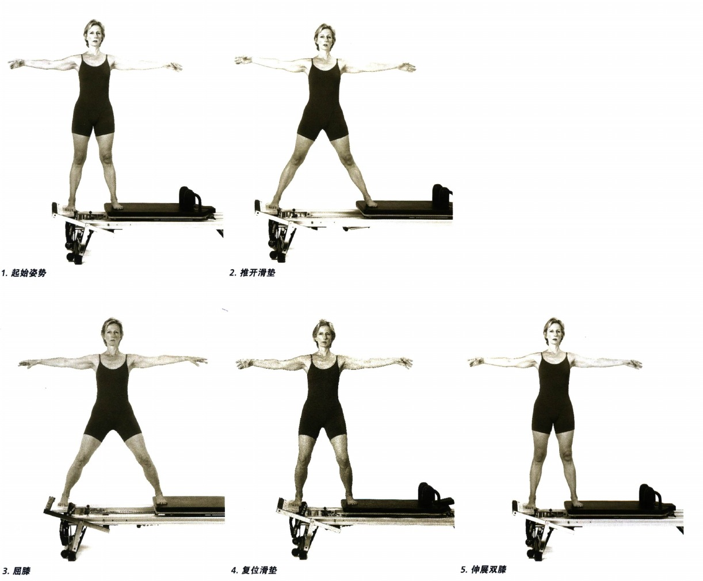
  - 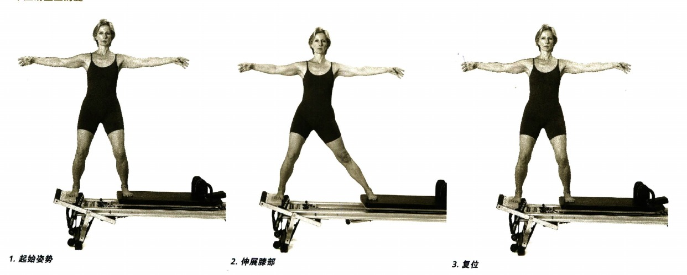
  - 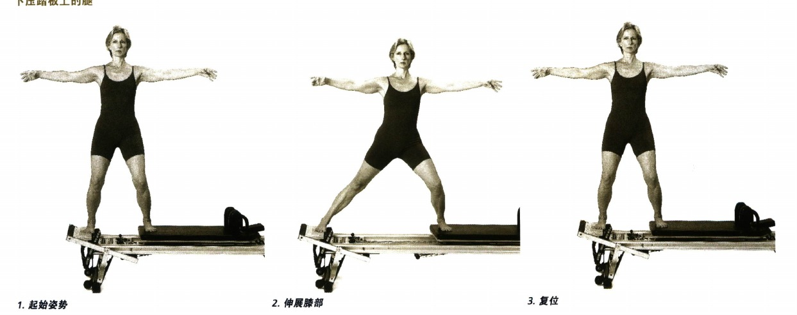
  - 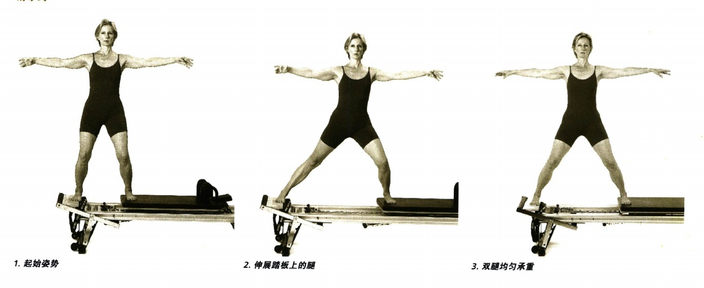
  - 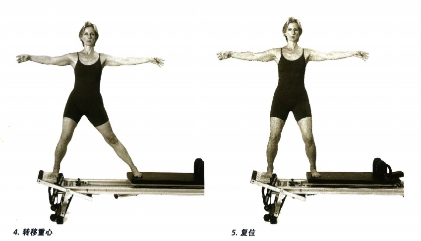
  - 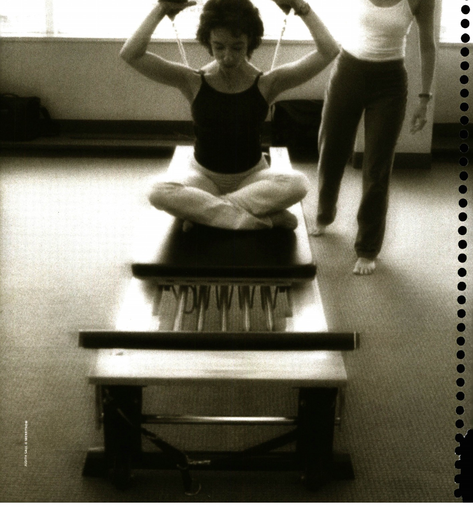

## 星形姿準備動作 (STAR PREP)

- 頁碼：p.161
- 難度：塑身機中級
- 器械/章節：腳踏桿、彈簧
- 肌群分類：[[../muscles/reformer-intermediate-core-and-lumbopelvic-stability|核心與腰骨盆穩定]], [[../muscles/reformer-intermediate-spinal-articulation|脊椎活動]], [[../muscles/reformer-intermediate-scapular-stabilizers|肩胛與上背穩定]], [[../muscles/reformer-intermediate-lat-teres-pulling-chain|背闊肌與拉力鏈]], [[../muscles/reformer-intermediate-arms-delts-pecs|手臂與胸肩]], [[../muscles/reformer-intermediate-hips-and-legs|髖與腿]], [[../muscles/reformer-intermediate-mobility-and-stretching|柔韌與伸展]]
- 摘要：星形姿準備動作：主要歸入核心與腰骨盆穩定、脊椎活動、肩胛與上背穩定、背闊肌與拉力鏈；依 OCR 原理/目標肌肉段落整理。
- OCR 原文摘錄：注意事項：整套練習必須在受過訓練的專業人士的監督和指導下 目標肌肉：以腹橫肌擠壓腹部，穩定腰骨盆部位；以深層骨盆底 進行，以防練習者身體失衡。 肌輔助腹橫肌運動：利用腹斜肌和豎脊肌將脊椎穩定在中立位； 利用下部的腹斜肌和髖外展肌群防止骨盆向地面方向下沉；利用
- 動作圖：
  - 
