# 中高階：手臂、三角肌、胸大肌與前臂

二頭肌、肱三頭肌、三角肌、胸大肌、腕/前臂穩定與推拉動作。

## 主要線索

- 二頭肌/肱三頭肌負責肘屈伸，胸大肌/三角肌負責推、抱、擊拳、致敬等前方阻力動作。
- 中高階動作常把手臂阻力變成對軀幹穩定和站姿骨盆的測試。

## 相關動作

### 肱三頭肌弓步 (TRICEPS LUNGE)

- 頁碼：p.42-43
- 難度：中級
- 摘要：肱三頭肌弓步：主要歸入核心與腰骨盆穩定、手臂、三角肌、胸大肌與前臂、髖與腿部控制；OCR 目標肌肉段落見下方摘錄。
- 動作索引：[[../exercises/cadillac-intermediate-advanced-exercises#肱三頭肌弓步|檢視完整條目]]
- 代表截圖：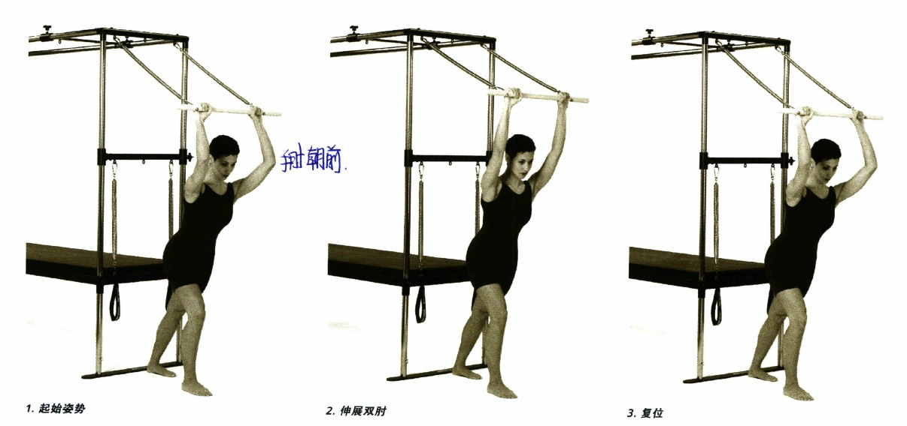

### 上拉 (PULL UP)

- 頁碼：p.52-54
- 難度：中級
- 摘要：上拉：主要歸入核心與腰骨盆穩定、脊椎屈曲、伸展、旋轉與側屈、肩胛穩定與上背穩定肌、背闊肌、大圓肌與拉力鏈；OCR 目標肌肉段落見下方摘錄。
- 動作索引：[[../exercises/cadillac-intermediate-advanced-exercises#上拉|檢視完整條目]]
- 代表截圖：

### 起坐複合練習 (SIT UP COMBO)

- 頁碼：p.64-65
- 難度：中級
- 摘要：起坐複合練習：主要歸入核心與腰骨盆穩定、脊椎屈曲、伸展、旋轉與側屈、肩胛穩定與上背穩定肌、手臂、三角肌、胸大肌與前臂；OCR 目標肌肉段落見下方摘錄。
- 動作索引：[[../exercises/cadillac-intermediate-advanced-exercises#起坐複合練習|檢視完整條目]]
- 代表截圖：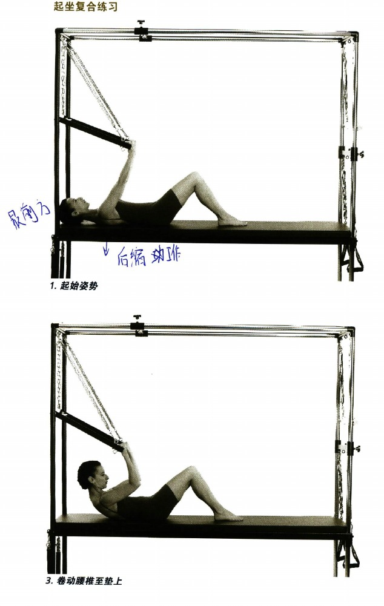

### 平行伸展系列練習 (TEASER SERIES)

- 頁碼：p.66-71
- 難度：中級
- 摘要：平行伸展系列練習：主要歸入核心與腰骨盆穩定、脊椎屈曲、伸展、旋轉與側屈、肩胛穩定與上背穩定肌、背闊肌、大圓肌與拉力鏈；OCR 目標肌肉段落見下方摘錄。
- 動作索引：[[../exercises/cadillac-intermediate-advanced-exercises#平行伸展系列練習|檢視完整條目]]
- 代表截圖：

### 旋轉美人魚姿 (MERMAID WITH ROTATION)

- 頁碼：p.80-81
- 難度：中級
- 摘要：旋轉美人魚姿：主要歸入核心與腰骨盆穩定、脊椎屈曲、伸展、旋轉與側屈、肩胛穩定與上背穩定肌、手臂、三角肌、胸大肌與前臂；OCR 目標肌肉段落見下方摘錄。
- 動作索引：[[../exercises/cadillac-intermediate-advanced-exercises#旋轉美人魚姿|檢視完整條目]]
- 代表截圖：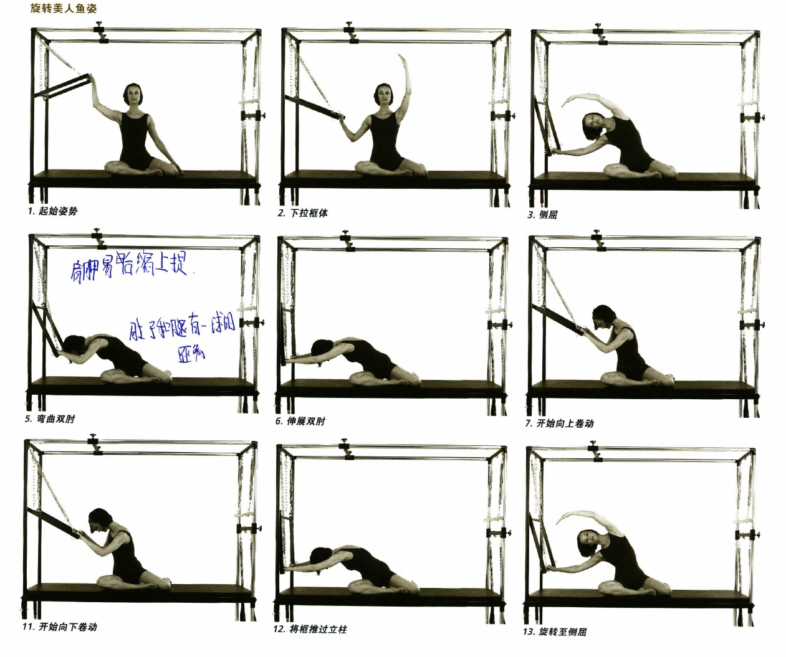

### 仰臥推拉加伸展 (PUSH THRU ON BACK WITH EXTENSION)

- 頁碼：p.84-87
- 難度：高階
- 摘要：仰臥推拉加伸展：主要歸入核心與腰骨盆穩定、脊椎屈曲、伸展、旋轉與側屈、肩胛穩定與上背穩定肌、手臂、三角肌、胸大肌與前臂；OCR 目標肌肉段落見下方摘錄。
- 動作索引：[[../exercises/cadillac-intermediate-advanced-exercises#仰臥推拉加伸展|檢視完整條目]]
- 代表截圖：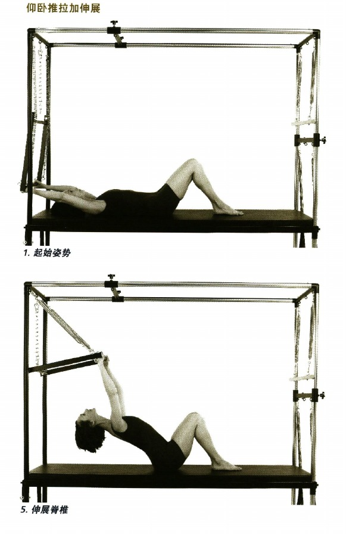

### 橋式 (BRIDGE)

- 頁碼：p.88-94
- 難度：高階
- 摘要：橋式：主要歸入核心與腰骨盆穩定、脊椎屈曲、伸展、旋轉與側屈、肩胛穩定與上背穩定肌、手臂、三角肌、胸大肌與前臂；OCR 目標肌肉段落見下方摘錄。
- 動作索引：[[../exercises/cadillac-intermediate-advanced-exercises#橋式|檢視完整條目]]
- 代表截圖：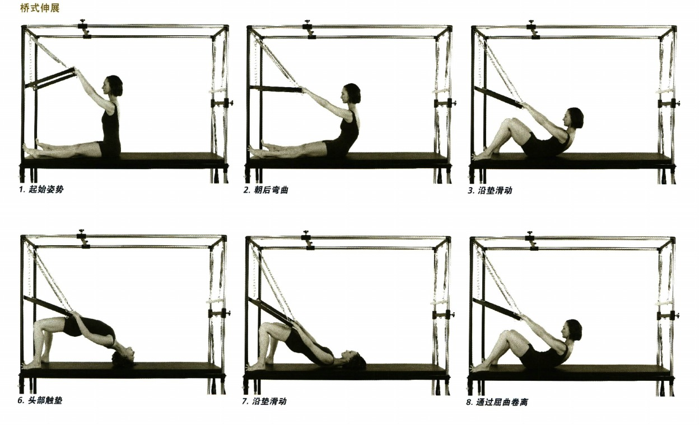

### 膝部上提 (KNEE RAISES)

- 頁碼：p.95
- 難度：高階
- 摘要：膝部上提：主要歸入核心與腰骨盆穩定、脊椎屈曲、伸展、旋轉與側屈、肩胛穩定與上背穩定肌、背闊肌、大圓肌與拉力鏈；OCR 目標肌肉段落見下方摘錄。
- 動作索引：[[../exercises/cadillac-intermediate-advanced-exercises#膝部上提|檢視完整條目]]
- 代表截圖：

### 膝部上提加側旋轉 (KNEE RAISES WITH OBLIQUES)

- 頁碼：p.96-97
- 難度：高階
- 摘要：膝部上提加側旋轉：主要歸入核心與腰骨盆穩定、脊椎屈曲、伸展、旋轉與側屈、肩胛穩定與上背穩定肌、背闊肌、大圓肌與拉力鏈；OCR 目標肌肉段落見下方摘錄。
- 動作索引：[[../exercises/cadillac-intermediate-advanced-exercises#膝部上提加側旋轉|檢視完整條目]]
- 代表截圖：

### 拍擊 (BEATS)

- 頁碼：p.100-101
- 難度：高階
- 摘要：拍擊：主要歸入核心與腰骨盆穩定、脊椎屈曲、伸展、旋轉與側屈、肩胛穩定與上背穩定肌、背闊肌、大圓肌與拉力鏈；OCR 目標肌肉段落見下方摘錄。
- 動作索引：[[../exercises/cadillac-intermediate-advanced-exercises#拍擊|檢視完整條目]]
- 代表截圖：

### 平行伸展系列練習 (TEASER SERIES)

- 頁碼：p.108-113
- 難度：高階
- 摘要：平行伸展系列練習：主要歸入核心與腰骨盆穩定、脊椎屈曲、伸展、旋轉與側屈、肩胛穩定與上背穩定肌、手臂、三角肌、胸大肌與前臂；OCR 目標肌肉段落見下方摘錄。
- 動作索引：[[../exercises/cadillac-intermediate-advanced-exercises#平行伸展系列練習|檢視完整條目]]
- 代表截圖：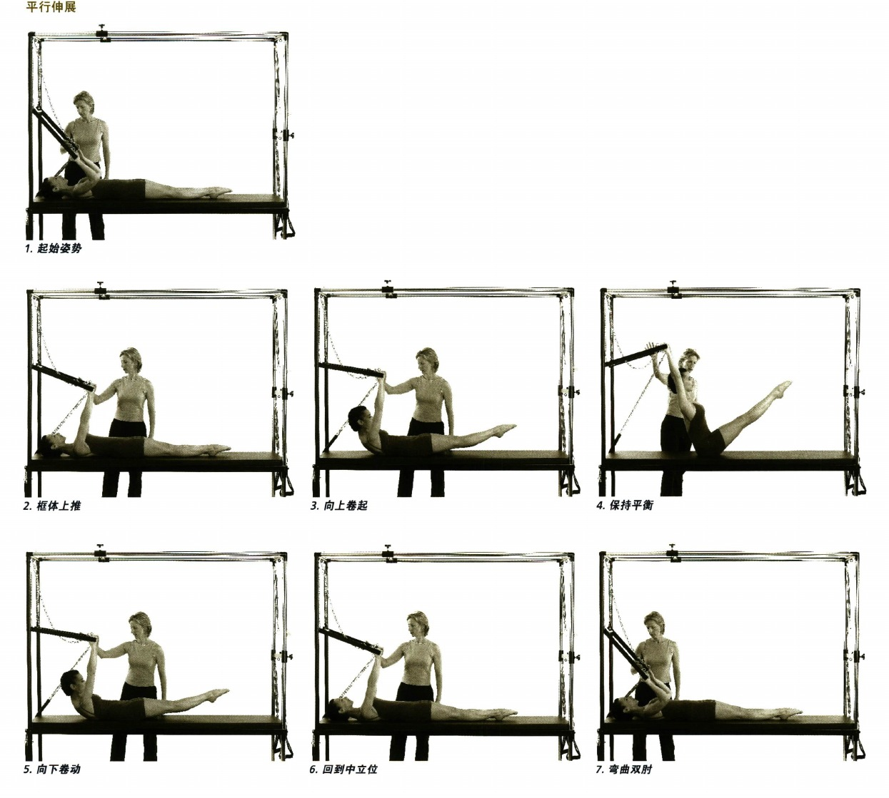

### 後劃 (BACK ROWING)

- 頁碼：p.114-117
- 難度：中級
- 摘要：後劃：主要歸入核心與腰骨盆穩定、脊椎屈曲、伸展、旋轉與側屈、肩胛穩定與上背穩定肌、背闊肌、大圓肌與拉力鏈；OCR 目標肌肉段落見下方摘錄。
- 動作索引：[[../exercises/cadillac-intermediate-advanced-exercises#後劃|檢視完整條目]]
- 代表截圖：

### 前劃 (FRONT ROWING)

- 頁碼：p.118-125
- 難度：中級
- 摘要：前劃：主要歸入核心與腰骨盆穩定、脊椎屈曲、伸展、旋轉與側屈、肩胛穩定與上背穩定肌、手臂、三角肌、胸大肌與前臂；OCR 目標肌肉段落見下方摘錄。
- 動作索引：[[../exercises/cadillac-intermediate-advanced-exercises#前劃|檢視完整條目]]
- 代表截圖：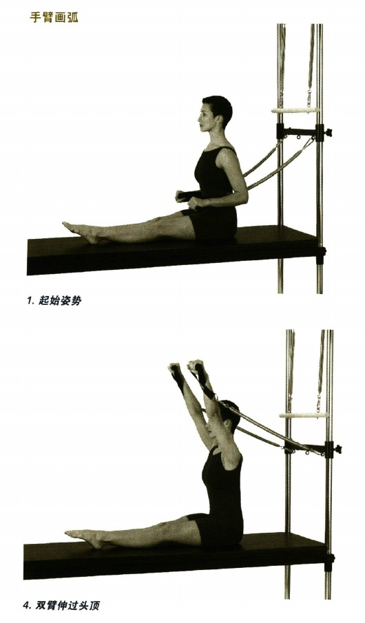

### 飛鷹姿（以腿用彈簧完成） (FLYING EAGLE WITH LEG SPRINGS)

- 頁碼：p.126-127
- 難度：高階
- 摘要：飛鷹姿（以腿用彈簧完成）：主要歸入核心與腰骨盆穩定、脊椎屈曲、伸展、旋轉與側屈、肩胛穩定與上背穩定肌、背闊肌、大圓肌與拉力鏈；OCR 目標肌肉段落見下方摘錄。
- 動作索引：[[../exercises/cadillac-intermediate-advanced-exercises#飛鷹姿（以腿用彈簧完成）|檢視完整條目]]
- 代表截圖：

### 反向擴張 (REVERSE EXPANSION)

- 頁碼：p.130-135
- 難度：中級
- 摘要：反向擴張：主要歸入核心與腰骨盆穩定、脊椎屈曲、伸展、旋轉與側屈、肩胛穩定與上背穩定肌、背闊肌、大圓肌與拉力鏈；OCR 目標肌肉段落見下方摘錄。
- 動作索引：[[../exercises/cadillac-intermediate-advanced-exercises#反向擴張|檢視完整條目]]
- 代表截圖：

### 雙手上託 (OFFERING)

- 頁碼：p.136-137
- 難度：中級
- 摘要：雙手上託：主要歸入核心與腰骨盆穩定、脊椎屈曲、伸展、旋轉與側屈、肩胛穩定與上背穩定肌、手臂、三角肌、胸大肌與前臂；OCR 目標肌肉段落見下方摘錄。
- 動作索引：[[../exercises/cadillac-intermediate-advanced-exercises#雙手上託|檢視完整條目]]
- 代表截圖：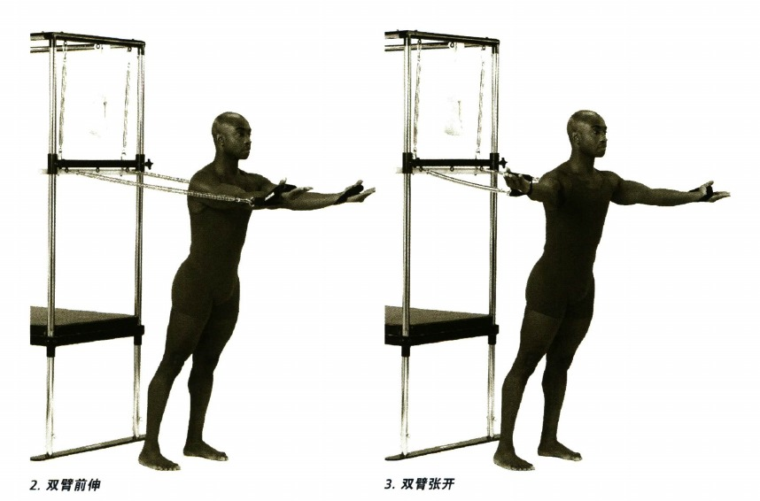

### 抱大樹 (HUG A TREE)

- 頁碼：p.138
- 難度：中級
- 摘要：抱大樹：主要歸入核心與腰骨盆穩定、脊椎屈曲、伸展、旋轉與側屈、手臂、三角肌、胸大肌與前臂、髖與腿部控制；OCR 目標肌肉段落見下方摘錄。
- 動作索引：[[../exercises/cadillac-intermediate-advanced-exercises#抱大樹|檢視完整條目]]
- 代表截圖：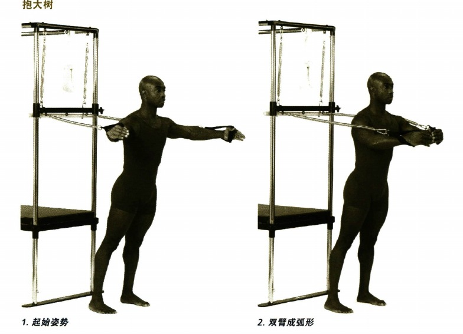

### 擊拳動作 (PUNCHES)

- 頁碼：p.140-141
- 難度：中級
- 摘要：擊拳動作：主要歸入核心與腰骨盆穩定、脊椎屈曲、伸展、旋轉與側屈、肩胛穩定與上背穩定肌、手臂、三角肌、胸大肌與前臂；OCR 目標肌肉段落見下方摘錄。
- 動作索引：[[../exercises/cadillac-intermediate-advanced-exercises#擊拳動作|檢視完整條目]]
- 代表截圖：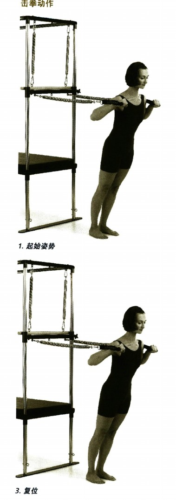

### 擊劍者弓步 (FENCER LUNGES)

- 頁碼：p.142-143
- 難度：中級
- 摘要：擊劍者弓步：主要歸入核心與腰骨盆穩定、脊椎屈曲、伸展、旋轉與側屈、肩胛穩定與上背穩定肌、手臂、三角肌、胸大肌與前臂；OCR 目標肌肉段落見下方摘錄。
- 動作索引：[[../exercises/cadillac-intermediate-advanced-exercises#擊劍者弓步|檢視完整條目]]
- 代表截圖：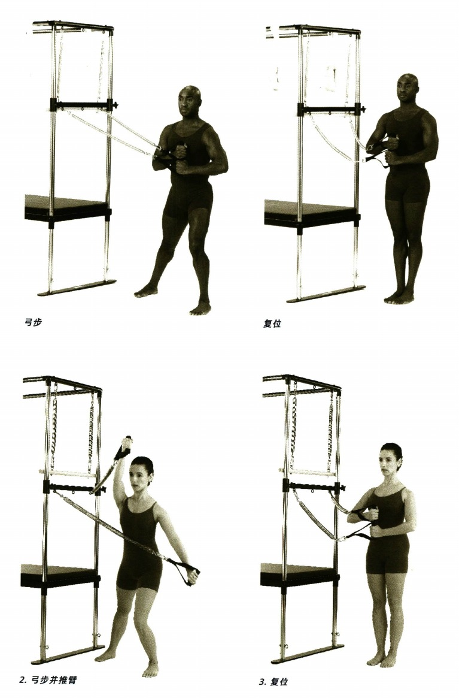

### 展翅雄鷹 (SPREAD EAGLE)

- 頁碼：p.170-171
- 難度：中級
- 摘要：展翅雄鷹：主要歸入核心與腰骨盆穩定、脊椎屈曲、伸展、旋轉與側屈、肩胛穩定與上背穩定肌、手臂、三角肌、胸大肌與前臂；OCR 目標肌肉段落見下方摘錄。
- 動作索引：[[../exercises/cadillac-intermediate-advanced-exercises#展翅雄鷹|檢視完整條目]]
- 代表截圖：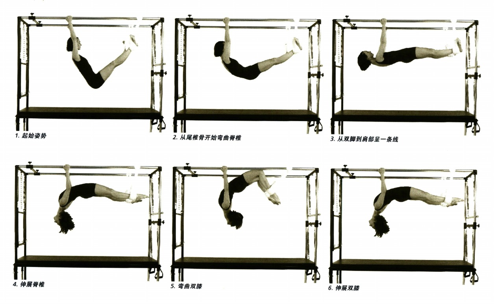