# 中高階：背闊肌、大圓肌與拉力鏈

背闊肌、大圓肌、下拉、上拉、懸掛和肩伸展/內收動作。

## 主要線索

- 背闊肌和大圓肌在下拉、上拉、懸掛、肩伸展和髖橋鏈條中反覆出現。
- 多數拉力動作同時要求肩胛穩定，不能只靠手臂拉。

## 相關動作

### 有節奏的扭轉 (TWIST WITH PULSES)

- 頁碼：p.30-31
- 難度：中級
- 摘要：有節奏的扭轉：主要歸入核心與腰骨盆穩定、脊椎屈曲、伸展、旋轉與側屈、肩胛穩定與上背穩定肌、背闊肌、大圓肌與拉力鏈；OCR 目標肌肉段落見下方摘錄。
- 動作索引：[[../exercises/cadillac-intermediate-advanced-exercises#有節奏的扭轉|檢視完整條目]]
- 代表截圖：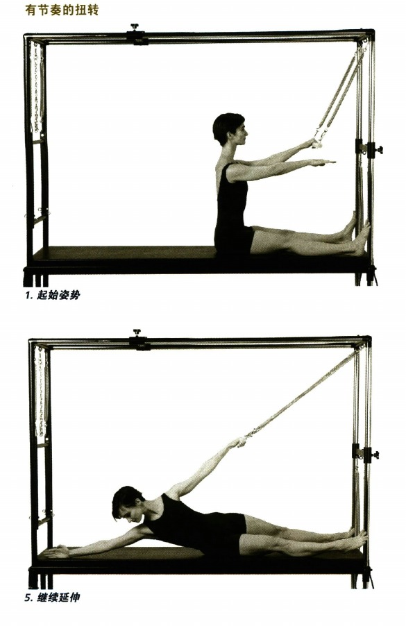

### 轉遍世界 (TWIST AROUND THE WORLD)

- 頁碼：p.36-37
- 難度：高階
- 摘要：轉遍世界：主要歸入核心與腰骨盆穩定、脊椎屈曲、伸展、旋轉與側屈、肩胛穩定與上背穩定肌、背闊肌、大圓肌與拉力鏈；OCR 目標肌肉段落見下方摘錄。
- 動作索引：[[../exercises/cadillac-intermediate-advanced-exercises#轉遍世界|檢視完整條目]]
- 代表截圖：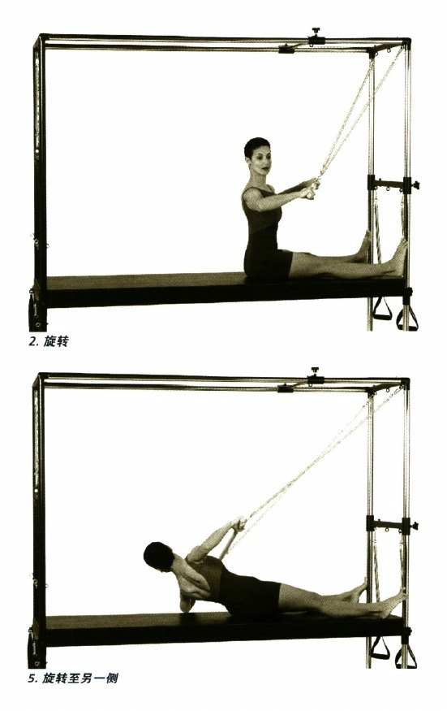

### 上拉 (PULL UP)

- 頁碼：p.52-54
- 難度：中級
- 摘要：上拉：主要歸入核心與腰骨盆穩定、脊椎屈曲、伸展、旋轉與側屈、肩胛穩定與上背穩定肌、背闊肌、大圓肌與拉力鏈；OCR 目標肌肉段落見下方摘錄。
- 動作索引：[[../exercises/cadillac-intermediate-advanced-exercises#上拉|檢視完整條目]]
- 代表截圖：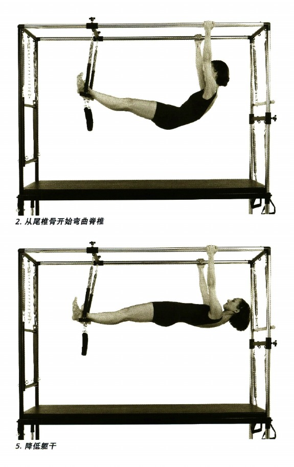

### 反向上拉 (REVERSE PULL UP)

- 頁碼：p.55
- 難度：高階
- 摘要：反向上拉：主要歸入核心與腰骨盆穩定、背闊肌、大圓肌與拉力鏈；OCR 目標肌肉段落見下方摘錄。
- 動作索引：[[../exercises/cadillac-intermediate-advanced-exercises#反向上拉|檢視完整條目]]
- 代表截圖：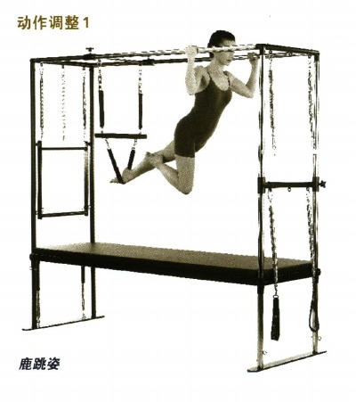

### 平行伸展系列練習 (TEASER SERIES)

- 頁碼：p.66-71
- 難度：中級
- 摘要：平行伸展系列練習：主要歸入核心與腰骨盆穩定、脊椎屈曲、伸展、旋轉與側屈、肩胛穩定與上背穩定肌、背闊肌、大圓肌與拉力鏈；OCR 目標肌肉段落見下方摘錄。
- 動作索引：[[../exercises/cadillac-intermediate-advanced-exercises#平行伸展系列練習|檢視完整條目]]
- 代表截圖：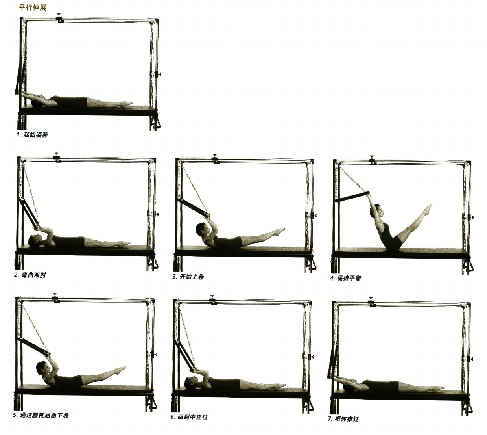

### 側體扭轉 (SIDE BODY TWIST)

- 頁碼：p.82-83
- 難度：高階
- 摘要：側體扭轉：主要歸入核心與腰骨盆穩定、脊椎屈曲、伸展、旋轉與側屈、肩胛穩定與上背穩定肌、背闊肌、大圓肌與拉力鏈；OCR 目標肌肉段落見下方摘錄。
- 動作索引：[[../exercises/cadillac-intermediate-advanced-exercises#側體扭轉|檢視完整條目]]
- 代表截圖：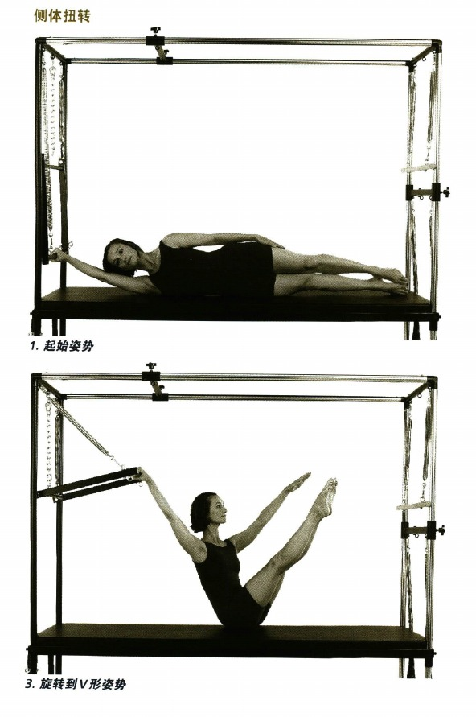

### 膝部上提 (KNEE RAISES)

- 頁碼：p.95
- 難度：高階
- 摘要：膝部上提：主要歸入核心與腰骨盆穩定、脊椎屈曲、伸展、旋轉與側屈、肩胛穩定與上背穩定肌、背闊肌、大圓肌與拉力鏈；OCR 目標肌肉段落見下方摘錄。
- 動作索引：[[../exercises/cadillac-intermediate-advanced-exercises#膝部上提|檢視完整條目]]
- 代表截圖：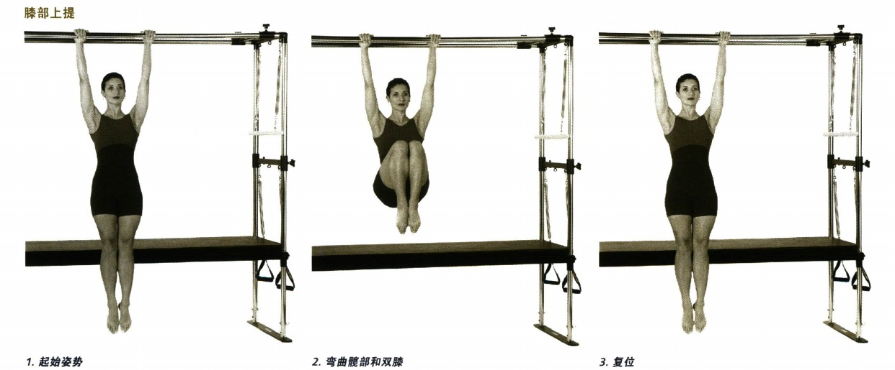

### 膝部上提加側旋轉 (KNEE RAISES WITH OBLIQUES)

- 頁碼：p.96-97
- 難度：高階
- 摘要：膝部上提加側旋轉：主要歸入核心與腰骨盆穩定、脊椎屈曲、伸展、旋轉與側屈、肩胛穩定與上背穩定肌、背闊肌、大圓肌與拉力鏈；OCR 目標肌肉段落見下方摘錄。
- 動作索引：[[../exercises/cadillac-intermediate-advanced-exercises#膝部上提加側旋轉|檢視完整條目]]
- 代表截圖：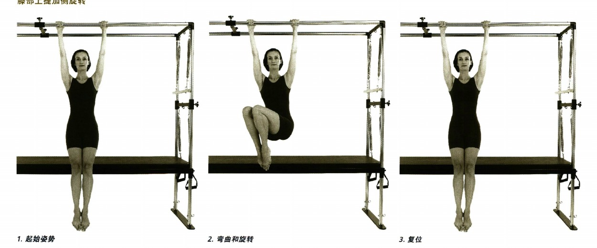

### 拍擊 (BEATS)

- 頁碼：p.100-101
- 難度：高階
- 摘要：拍擊：主要歸入核心與腰骨盆穩定、脊椎屈曲、伸展、旋轉與側屈、肩胛穩定與上背穩定肌、背闊肌、大圓肌與拉力鏈；OCR 目標肌肉段落見下方摘錄。
- 動作索引：[[../exercises/cadillac-intermediate-advanced-exercises#拍擊|檢視完整條目]]
- 代表截圖：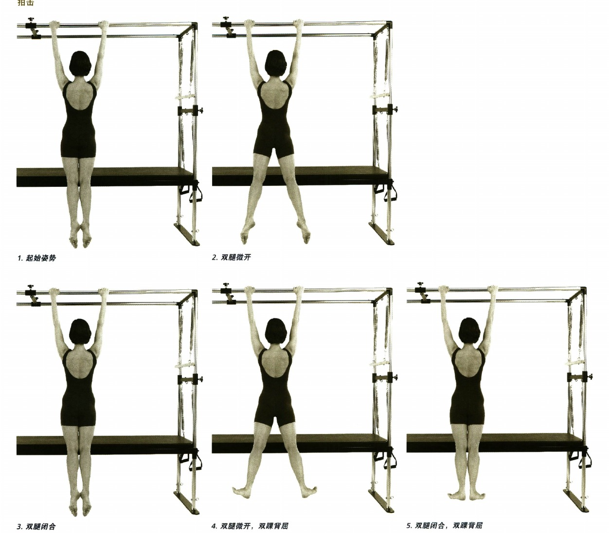

### 後劃 (BACK ROWING)

- 頁碼：p.114-117
- 難度：中級
- 摘要：後劃：主要歸入核心與腰骨盆穩定、脊椎屈曲、伸展、旋轉與側屈、肩胛穩定與上背穩定肌、背闊肌、大圓肌與拉力鏈；OCR 目標肌肉段落見下方摘錄。
- 動作索引：[[../exercises/cadillac-intermediate-advanced-exercises#後劃|檢視完整條目]]
- 代表截圖：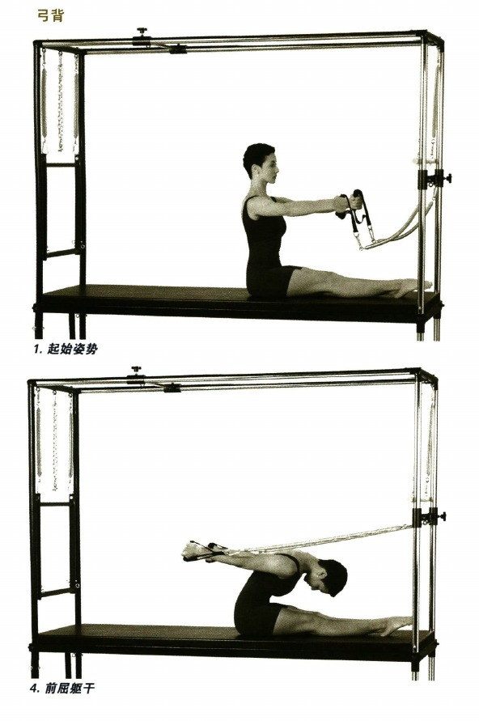

### 飛鷹姿（以腿用彈簧完成） (FLYING EAGLE WITH LEG SPRINGS)

- 頁碼：p.126-127
- 難度：高階
- 摘要：飛鷹姿（以腿用彈簧完成）：主要歸入核心與腰骨盆穩定、脊椎屈曲、伸展、旋轉與側屈、肩胛穩定與上背穩定肌、背闊肌、大圓肌與拉力鏈；OCR 目標肌肉段落見下方摘錄。
- 動作索引：[[../exercises/cadillac-intermediate-advanced-exercises#飛鷹姿（以腿用彈簧完成）|檢視完整條目]]
- 代表截圖：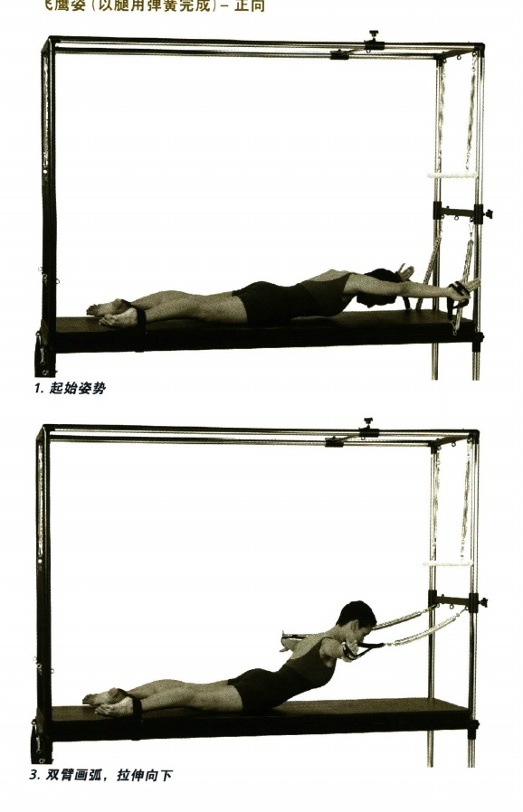

### 反向擴張 (REVERSE EXPANSION)

- 頁碼：p.130-135
- 難度：中級
- 摘要：反向擴張：主要歸入核心與腰骨盆穩定、脊椎屈曲、伸展、旋轉與側屈、肩胛穩定與上背穩定肌、背闊肌、大圓肌與拉力鏈；OCR 目標肌肉段落見下方摘錄。
- 動作索引：[[../exercises/cadillac-intermediate-advanced-exercises#反向擴張|檢視完整條目]]
- 代表截圖：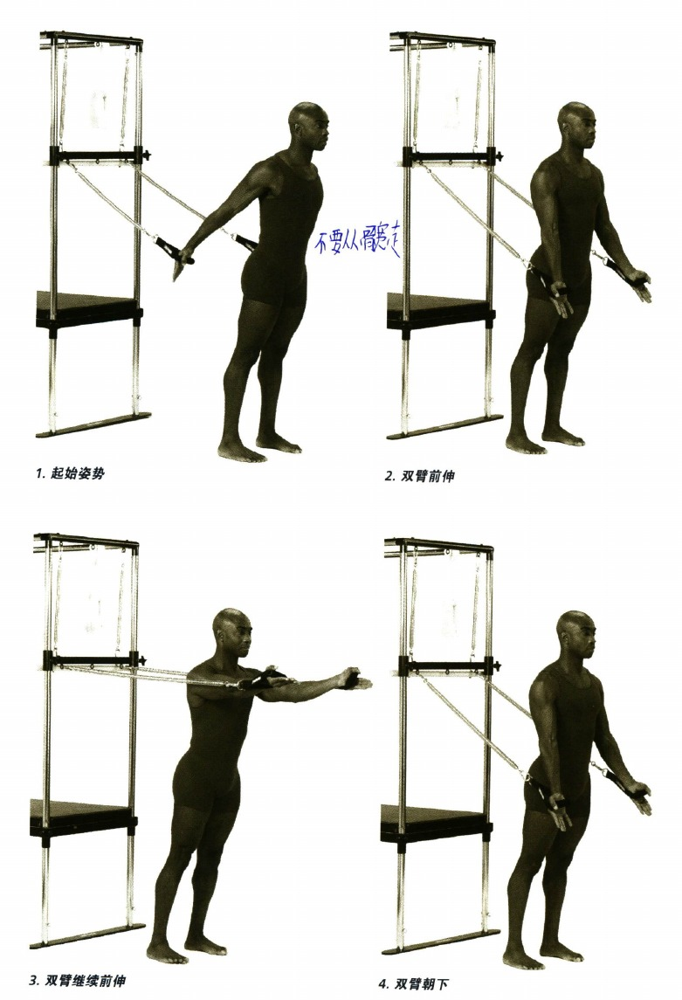

### 半懸掛 (HALF HANG)

- 頁碼：p.173
- 難度：中級
- 摘要：半懸掛：主要歸入核心與腰骨盆穩定、脊椎屈曲、伸展、旋轉與側屈、背闊肌、大圓肌與拉力鏈、髖與腿部控制；OCR 目標肌肉段落見下方摘錄。
- 動作索引：[[../exercises/cadillac-intermediate-advanced-exercises#半懸掛|檢視完整條目]]
- 代表截圖：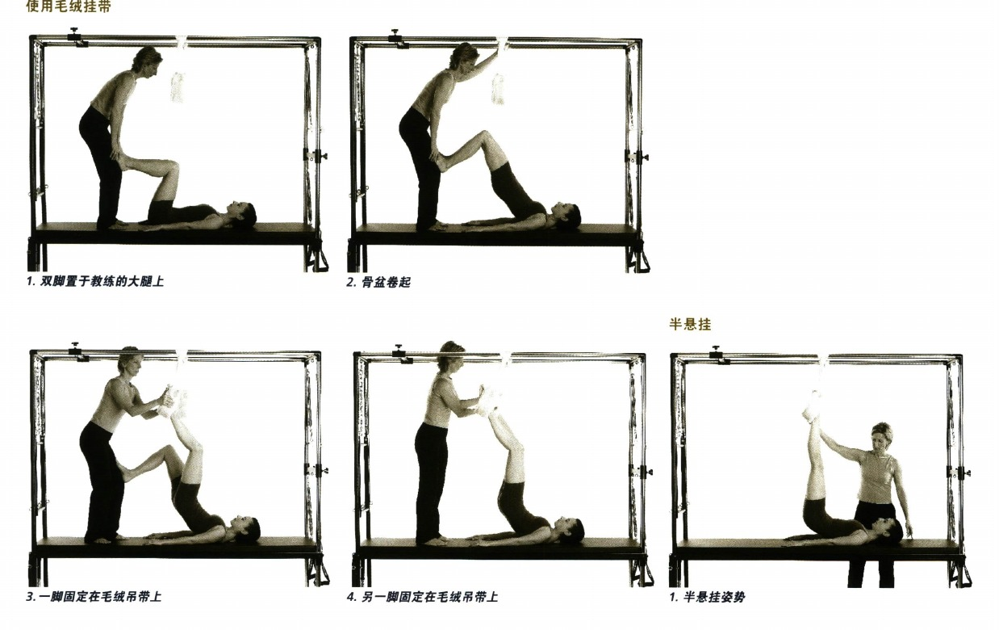

### 完全懸掛姿勢 (FULL HANG)

- 頁碼：p.174-175
- 難度：中級
- 摘要：完全懸掛姿勢：主要歸入核心與腰骨盆穩定、脊椎屈曲、伸展、旋轉與側屈、背闊肌、大圓肌與拉力鏈、髖與腿部控制；OCR 目標肌肉段落見下方摘錄。
- 動作索引：[[../exercises/cadillac-intermediate-advanced-exercises#完全懸掛姿勢|檢視完整條目]]
- 代表截圖：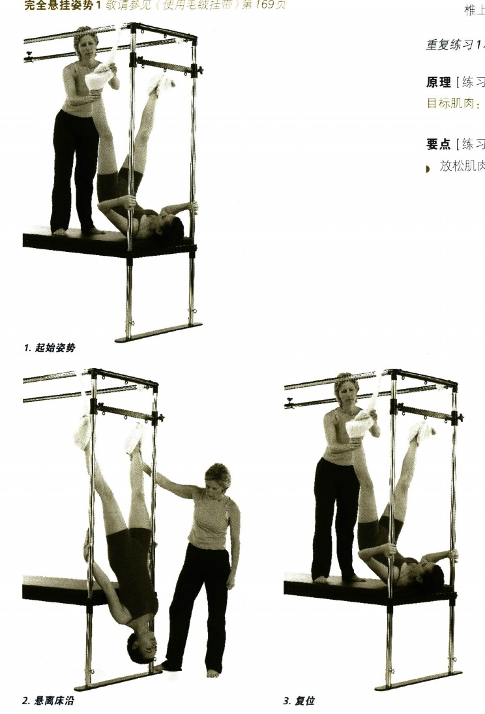