# 塑身機初級：手臂與胸肩

二頭肌、肱三頭肌、前三角肌、胸大肌、旋轉袖與手臂推拉系列。

## 整理原則

- 依 OCR 的原理/目標肌肉段落、動作標題與頁面動作圖共同分類。
- 若同一系列包含多個編號變化，保留為同一條目，避免拆散教學上下文。

## 相關動作

### 腳部練習 (FOOTWORK)

- 頁碼：p.28-33
- 器械/章節：腳踏桿、彈簧、頭墊
- 摘要：腳部練習：主要歸入核心與腰骨盆穩定、脊椎活動、肩胛與上背穩定、手臂與胸肩。
- 動作索引：[[../exercises/reformer-beginner-exercises#腳部練習|查看完整條目]]
- 代表圖：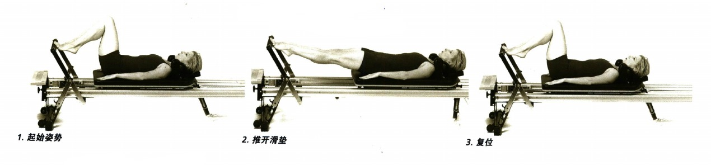

### 第二種姿勢 (SECOND POSITION)

- 頁碼：p.34-35
- 器械/章節：腳踏桿、彈簧、頭墊
- 摘要：第二種姿勢：主要歸入核心與腰骨盆穩定、脊椎活動、手臂與胸肩、髖與腿。
- 動作索引：[[../exercises/reformer-beginner-exercises#第二種姿勢|查看完整條目]]
- 代表圖：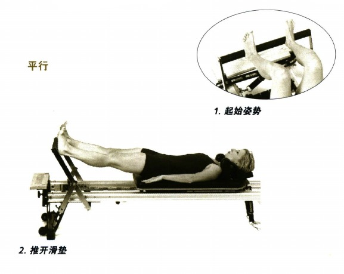

### 單腿練習 (SINGLE LEG)

- 頁碼：p.36-39
- 器械/章節：腳踏桿、彈簧、頭墊
- 摘要：單腿練習：主要歸入核心與腰骨盆穩定、脊椎活動、手臂與胸肩、髖與腿。
- 動作索引：[[../exercises/reformer-beginner-exercises#單腿練習|查看完整條目]]
- 代表圖：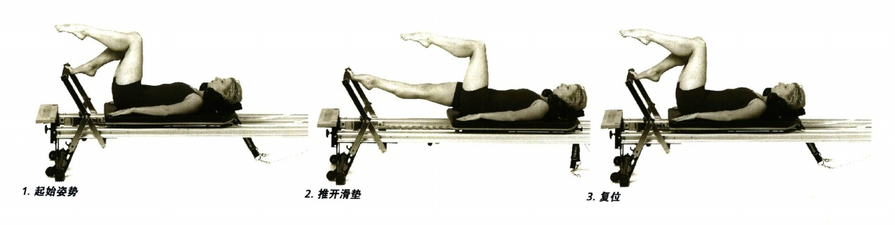

### 百次拍擊 (HUNDRED)

- 頁碼：p.40-41
- 器械/章節：腳踏桿、彈簧、頭墊、拉環與繩索
- 摘要：百次拍擊：主要歸入核心與腰骨盆穩定、脊椎活動、肩胛與上背穩定、背闊肌與拉力鏈。
- 動作索引：[[../exercises/reformer-beginner-exercises#百次拍擊|查看完整條目]]
- 代表圖：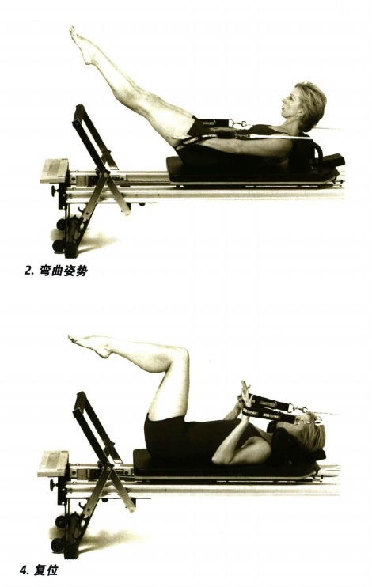

### 屈伸練習 (BEND & STRETCH)

- 頁碼：p.42-43
- 器械/章節：腳踏桿、彈簧、頭墊、拉環與繩索
- 摘要：屈伸練習：主要歸入核心與腰骨盆穩定、脊椎活動、手臂與胸肩、髖與腿。
- 動作索引：[[../exercises/reformer-beginner-exercises#屈伸練習|查看完整條目]]
- 代表圖：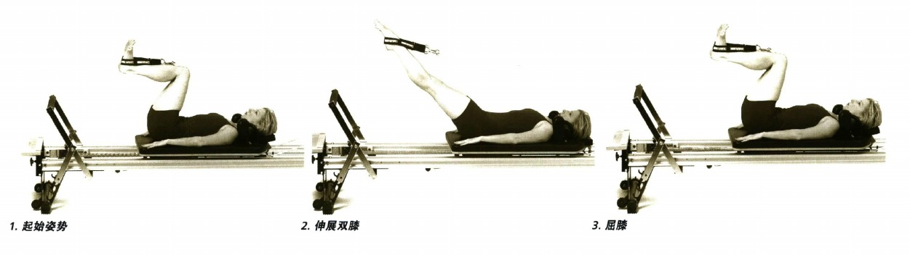

### 抬腿與放腿 (LFT & LOWER)

- 頁碼：p.44-45
- 器械/章節：腳踏桿、彈簧、頭墊、拉環與繩索
- 摘要：抬腿與放腿：主要歸入核心與腰骨盆穩定、脊椎活動、手臂與胸肩、髖與腿。
- 動作索引：[[../exercises/reformer-beginner-exercises#抬腿與放腿|查看完整條目]]
- 代表圖：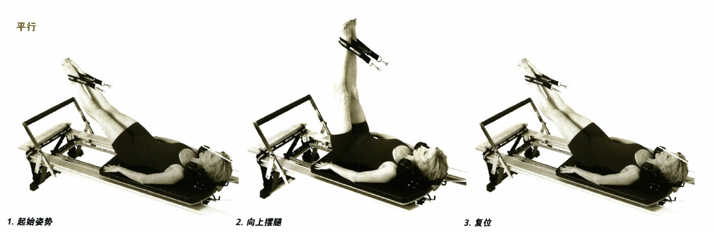

### 伸展內收肌 (ADDUCTOR STRETCH)

- 頁碼：p.46
- 器械/章節：腳踏桿、彈簧、頭墊、拉環與繩索
- 摘要：伸展內收肌：主要歸入核心與腰骨盆穩定、脊椎活動、手臂與胸肩、髖與腿。
- 動作索引：[[../exercises/reformer-beginner-exercises#伸展內收肌|查看完整條目]]
- 代表圖：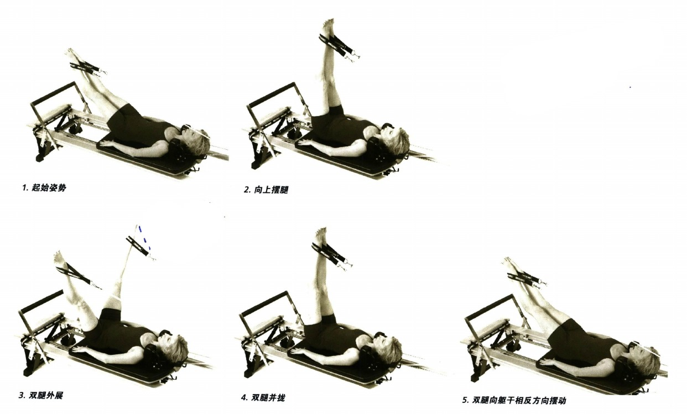

### 脊椎捲曲準備動作 (SHORT SPINE PREP)

- 頁碼：p.47-49
- 器械/章節：腳踏桿、彈簧、頭墊、拉環與繩索
- 摘要：脊椎捲曲準備動作：主要歸入核心與腰骨盆穩定、脊椎活動、手臂與胸肩、髖與腿。
- 動作索引：[[../exercises/reformer-beginner-exercises#脊椎捲曲準備動作|查看完整條目]]
- 代表圖：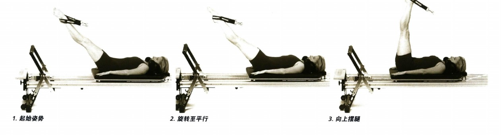

### 中背部系列動作 (MIDBACK SERIES)

- 頁碼：p.50-54
- 器械/章節：腳踏桿、彈簧、頭墊、拉環與繩索
- 摘要：中背部系列動作：主要歸入核心與腰骨盆穩定、脊椎活動、肩胛與上背穩定、手臂與胸肩。
- 動作索引：[[../exercises/reformer-beginner-exercises#中背部系列動作|查看完整條目]]
- 代表圖：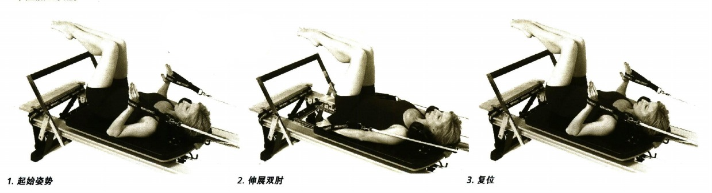

### 後劃準備動作 (BACK ROWING PREPS)

- 頁碼：p.55-63
- 器械/章節：腳踏桿、彈簧、頭墊、拉環與繩索
- 摘要：後劃準備動作：主要歸入核心與腰骨盆穩定、脊椎活動、肩胛與上背穩定、背闊肌與拉力鏈。
- 動作索引：[[../exercises/reformer-beginner-exercises#後劃準備動作|查看完整條目]]
- 代表圖：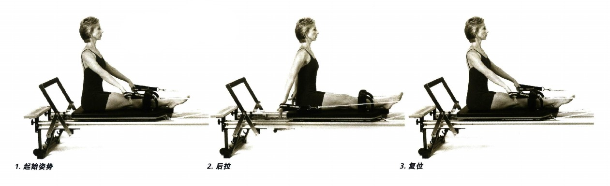

### 側坐手臂準備動作 (SIDE ARM PREPS SITTING)

- 頁碼：p.64-67
- 器械/章節：腳踏桿、彈簧、拉環與繩索
- 摘要：側坐手臂準備動作：主要歸入核心與腰骨盆穩定、脊椎活動、肩胛與上背穩定、手臂與胸肩。
- 動作索引：[[../exercises/reformer-beginner-exercises#側坐手臂準備動作|查看完整條目]]
- 代表圖：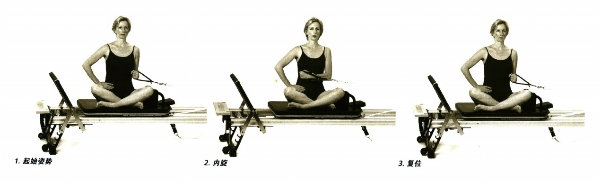

### 前劃準備動作 (FRONT ROWING PREPS)

- 頁碼：p.70-73
- 器械/章節：腳踏桿、彈簧、拉環與繩索
- 摘要：前劃準備動作：主要歸入核心與腰骨盆穩定、脊椎活動、肩胛與上背穩定、背闊肌與拉力鏈。
- 動作索引：[[../exercises/reformer-beginner-exercises#前劃準備動作|查看完整條目]]
- 代表圖：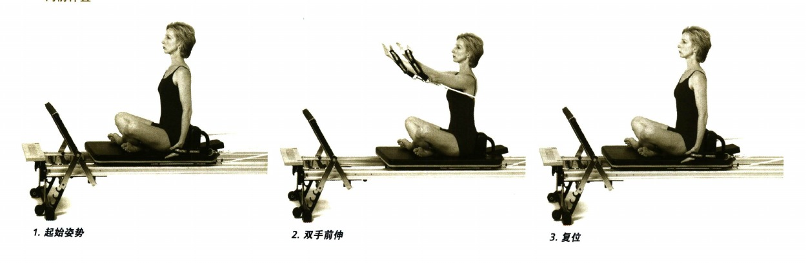

### 腹部按摩 (STOMACH MASSAGE)

- 頁碼：p.74-77
- 器械/章節：腳踏桿、彈簧
- 摘要：腹部按摩：主要歸入核心與腰骨盆穩定、脊椎活動、肩胛與上背穩定、手臂與胸肩。
- 動作索引：[[../exercises/reformer-beginner-exercises#腹部按摩|查看完整條目]]
- 代表圖：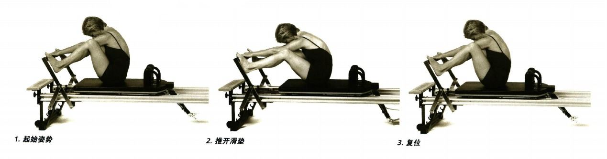

### 雙臂拉動拉環 盒子豎放 (ARMS PULLING STRAPS, LONG BOX)

- 頁碼：p.78-81
- 器械/章節：腳踏桿、彈簧、頭墊、拉環與繩索、塑身機盒子
- 摘要：雙臂拉動拉環 盒子豎放：主要歸入核心與腰骨盆穩定、脊椎活動、肩胛與上背穩定、背闊肌與拉力鏈。
- 動作索引：[[../exercises/reformer-beginner-exercises#雙臂拉動拉環-盒子豎放|查看完整條目]]
- 代表圖：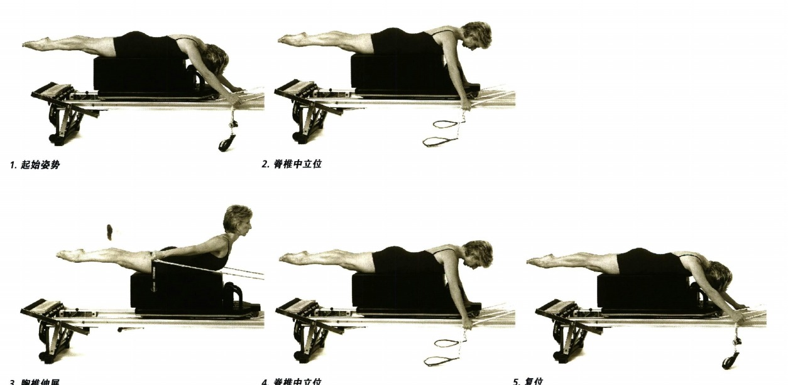

### 扭轉 盒子橫放 (TWIST, SHORT BOX)

- 頁碼：p.85
- 器械/章節：腳踏桿、彈簧、頭墊、塑身機盒子、腳帶
- 摘要：扭轉 盒子橫放：主要歸入核心與腰骨盆穩定、脊椎活動、肩胛與上背穩定、手臂與胸肩。
- 動作索引：[[../exercises/reformer-beginner-exercises#扭轉-盒子橫放|查看完整條目]]
- 代表圖：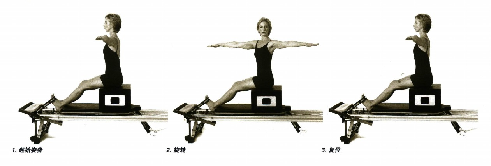

### 大象姿 (ELEPHANT)

- 頁碼：p.88-89
- 器械/章節：腳踏桿、彈簧
- 摘要：大象姿：主要歸入核心與腰骨盆穩定、脊椎活動、肩胛與上背穩定、手臂與胸肩。
- 動作索引：[[../exercises/reformer-beginner-exercises#大象姿|查看完整條目]]
- 代表圖：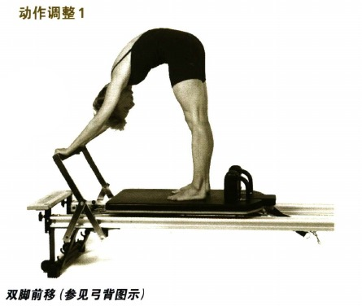

### 美人魚姿 (MERMAID)

- 頁碼：p.90-91
- 器械/章節：腳踏桿、彈簧
- 摘要：美人魚姿：主要歸入核心與腰骨盆穩定、脊椎活動、肩胛與上背穩定、手臂與胸肩。
- 動作索引：[[../exercises/reformer-beginner-exercises#美人魚姿|查看完整條目]]
- 代表圖：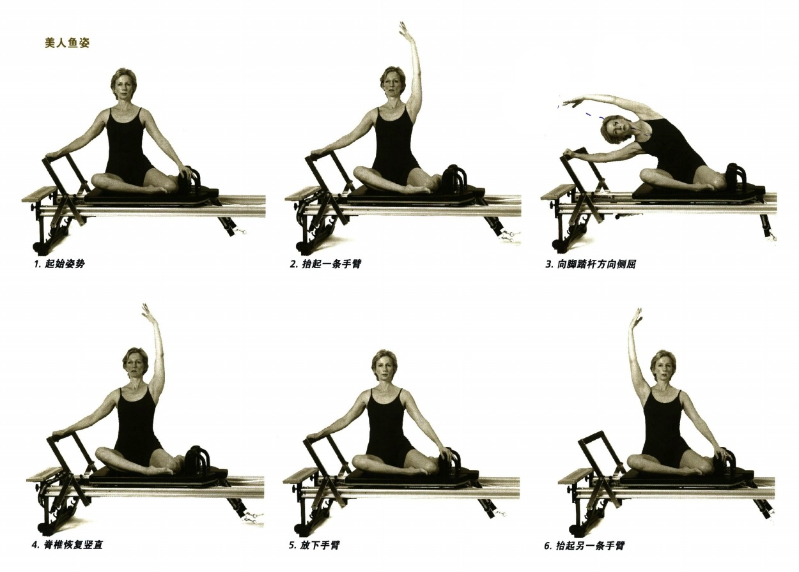

### 雙腿畫弧 (LEG CIRCLES)

- 頁碼：p.92-94
- 器械/章節：腳踏桿、彈簧、頭墊、拉環與繩索
- 摘要：雙腿畫弧：主要歸入核心與腰骨盆穩定、脊椎活動、手臂與胸肩、髖與腿。
- 動作索引：[[../exercises/reformer-beginner-exercises#雙腿畫弧|查看完整條目]]
- 代表圖：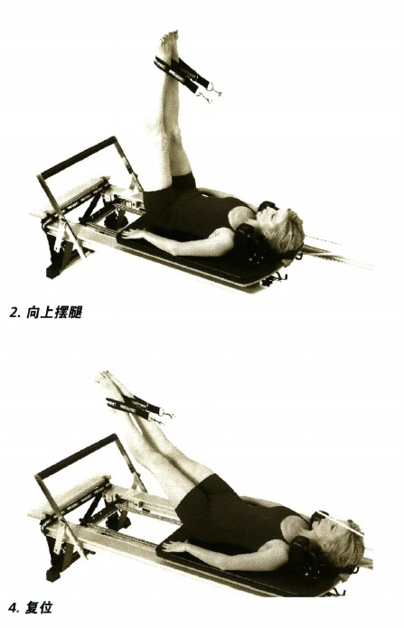

### 膝部伸展 (KNEE STRETCHES)

- 頁碼：p.95-97
- 器械/章節：腳踏桿、彈簧
- 摘要：膝部伸展：主要歸入核心與腰骨盆穩定、脊椎活動、肩胛與上背穩定、手臂與胸肩。
- 動作索引：[[../exercises/reformer-beginner-exercises#膝部伸展|查看完整條目]]
- 代表圖：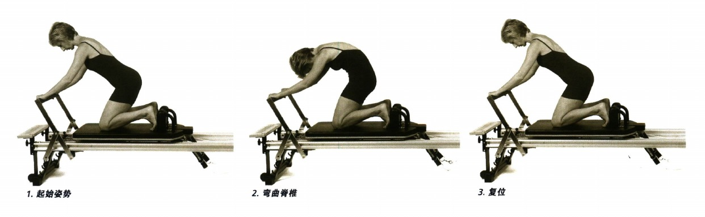

### 跑步運動 (RUNNING)

- 頁碼：p.98-100
- 器械/章節：腳踏桿、彈簧、頭墊
- 摘要：跑步運動：主要歸入核心與腰骨盆穩定、脊椎活動、手臂與胸肩、髖與腿。
- 動作索引：[[../exercises/reformer-beginner-exercises#跑步運動|查看完整條目]]
- 代表圖：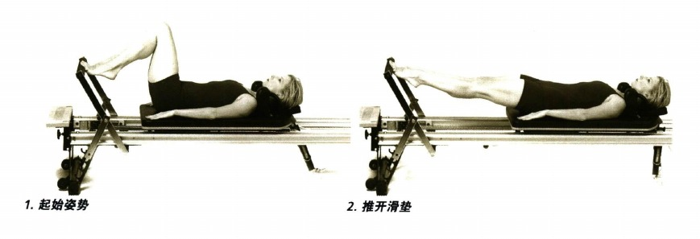

### 單側大腿伸展 (SINGLE THIGH STRETCH)

- 頁碼：p.104-105
- 器械/章節：腳踏桿、彈簧
- 摘要：單側大腿伸展：主要歸入核心與腰骨盆穩定、脊椎活動、手臂與胸肩、髖與腿。
- 動作索引：[[../exercises/reformer-beginner-exercises#單側大腿伸展|查看完整條目]]
- 代表圖：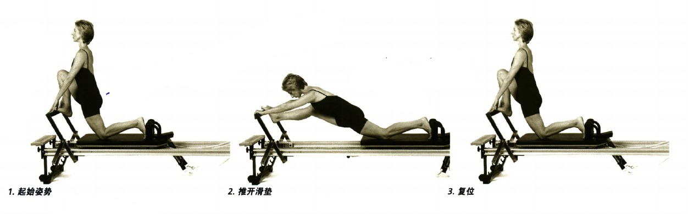

### 側劈叉 (SIDE SPLITS)

- 頁碼：p.106-108
- 器械/章節：腳踏桿、彈簧
- 摘要：側劈叉：主要歸入核心與腰骨盆穩定、脊椎活動、肩胛與上背穩定、手臂與胸肩。
- 動作索引：[[../exercises/reformer-beginner-exercises#側劈叉|查看完整條目]]
- 代表圖：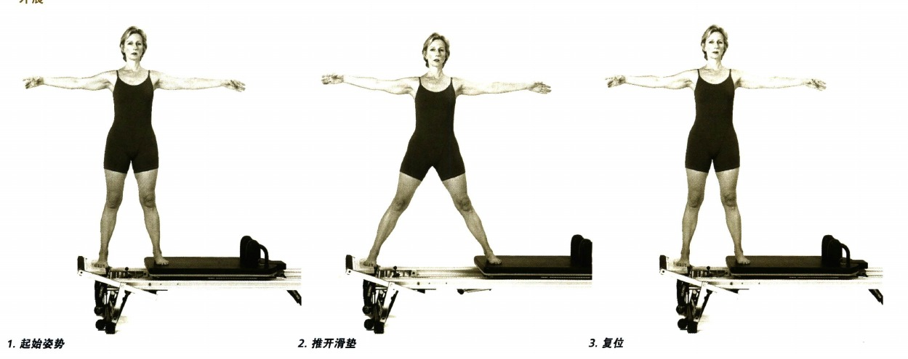
