# 塑身機中級：核心與腰骨盆穩定

腹橫肌、骨盆底、腹直肌、腹斜肌、多裂肌，以及滑墊移動時的腰骨盆控制。

## 整理原則

- 依 OCR 的原理/目標肌肉段落、動作標題與頁面動作圖共同分類。
- 若同一系列包含多個編號變化，保留為同一條目，避免拆散教學上下文。

## 相關動作

### 腳部練習 (FOOTWORK)

- 頁碼：p.28-33
- 器械/章節：腳踏桿、彈簧、頭墊
- 摘要：腳部練習：主要歸入核心與腰骨盆穩定、脊椎活動、肩胛與上背穩定、手臂與胸肩；依 OCR 原理/目標肌肉段落整理。
- 動作索引：[[../exercises/reformer-intermediate-exercises#腳部練習|查看完整條目]]
- 代表圖：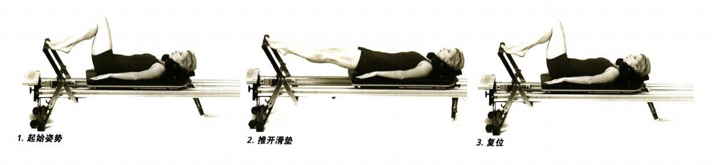

### 第二種姿勢 (SECOND POSITION)

- 頁碼：p.34-35
- 器械/章節：腳踏桿、彈簧、頭墊
- 摘要：第二種姿勢：主要歸入核心與腰骨盆穩定、脊椎活動、手臂與胸肩、髖與腿；依 OCR 原理/目標肌肉段落整理。
- 動作索引：[[../exercises/reformer-intermediate-exercises#第二種姿勢|查看完整條目]]
- 代表圖：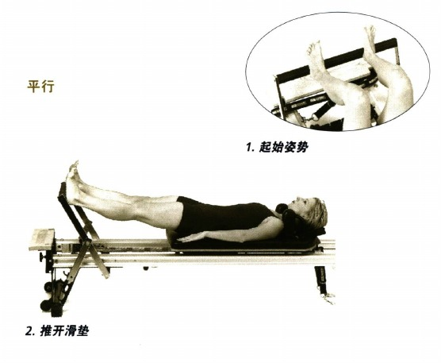

### 單腿練習 (SINGLE LEG)

- 頁碼：p.36-41
- 器械/章節：腳踏桿、彈簧、頭墊
- 摘要：單腿練習：主要歸入核心與腰骨盆穩定、脊椎活動、手臂與胸肩、髖與腿；依 OCR 原理/目標肌肉段落整理。
- 動作索引：[[../exercises/reformer-intermediate-exercises#單腿練習|查看完整條目]]
- 代表圖：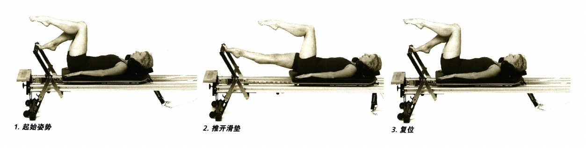

### 百次拍擊 (HUNDRED)

- 頁碼：p.42-43
- 器械/章節：腳踏桿、彈簧、頭墊、拉環與繩索
- 摘要：百次拍擊：主要歸入核心與腰骨盆穩定、脊椎活動、肩胛與上背穩定、背闊肌與拉力鏈；依 OCR 原理/目標肌肉段落整理。
- 動作索引：[[../exercises/reformer-intermediate-exercises#百次拍擊|查看完整條目]]
- 代表圖：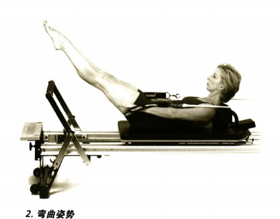

### 屈伸練習 (BEND & STRETCH)

- 頁碼：p.44-45
- 器械/章節：腳踏桿、彈簧、頭墊、拉環與繩索
- 摘要：屈伸練習：主要歸入核心與腰骨盆穩定、脊椎活動、手臂與胸肩、髖與腿；依 OCR 原理/目標肌肉段落整理。
- 動作索引：[[../exercises/reformer-intermediate-exercises#屈伸練習|查看完整條目]]
- 代表圖：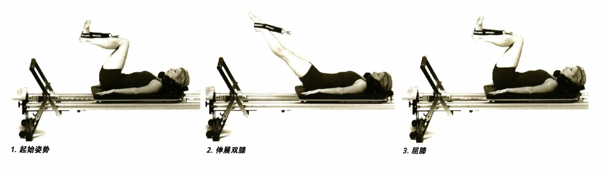

### 脊椎捲曲 (SHORT SPINE)

- 頁碼：p.46-48
- 器械/章節：腳踏桿、彈簧、頭墊、拉環與繩索
- 摘要：脊椎捲曲：主要歸入核心與腰骨盆穩定、脊椎活動、肩胛與上背穩定、手臂與胸肩；依 OCR 原理/目標肌肉段落整理。
- 動作索引：[[../exercises/reformer-intermediate-exercises#脊椎捲曲|查看完整條目]]
- 代表圖：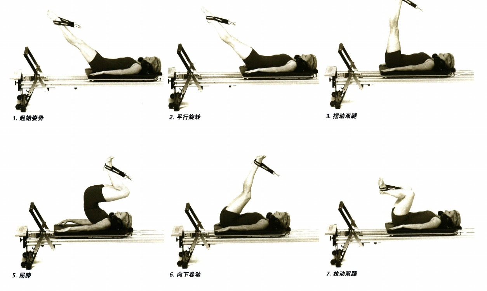

### 拍擊 (BEATS)

- 頁碼：p.49
- 器械/章節：腳踏桿、彈簧、頭墊、拉環與繩索
- 摘要：拍擊：主要歸入核心與腰骨盆穩定、脊椎活動、手臂與胸肩、髖與腿；依頁面標題、動作說明與動作圖整理。
- 動作索引：[[../exercises/reformer-intermediate-exercises#拍擊|查看完整條目]]
- 代表圖：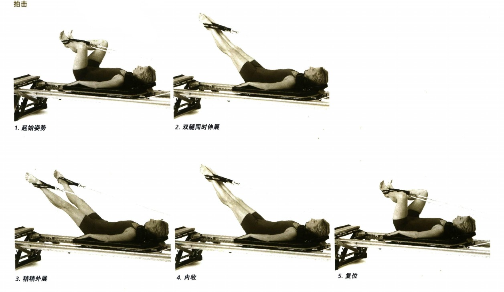

### 蛙跳姿 (FROG)

- 頁碼：p.50-52
- 器械/章節：腳踏桿、彈簧、頭墊、拉環與繩索
- 摘要：蛙跳姿：主要歸入核心與腰骨盆穩定、脊椎活動、肩胛與上背穩定、手臂與胸肩；依 OCR 原理/目標肌肉段落整理。
- 動作索引：[[../exercises/reformer-intermediate-exercises#蛙跳姿|查看完整條目]]
- 代表圖：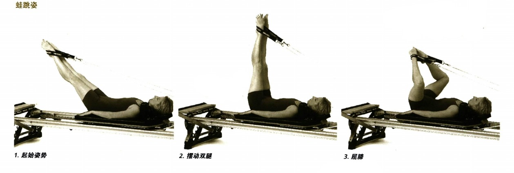

### 鹿跳姿 (STAG)

- 頁碼：p.53
- 器械/章節：腳踏桿、彈簧、頭墊、拉環與繩索
- 摘要：鹿跳姿：主要歸入核心與腰骨盆穩定、脊椎活動、手臂與胸肩、髖與腿；依 OCR 原理/目標肌肉段落整理。
- 動作索引：[[../exercises/reformer-intermediate-exercises#鹿跳姿|查看完整條目]]
- 代表圖：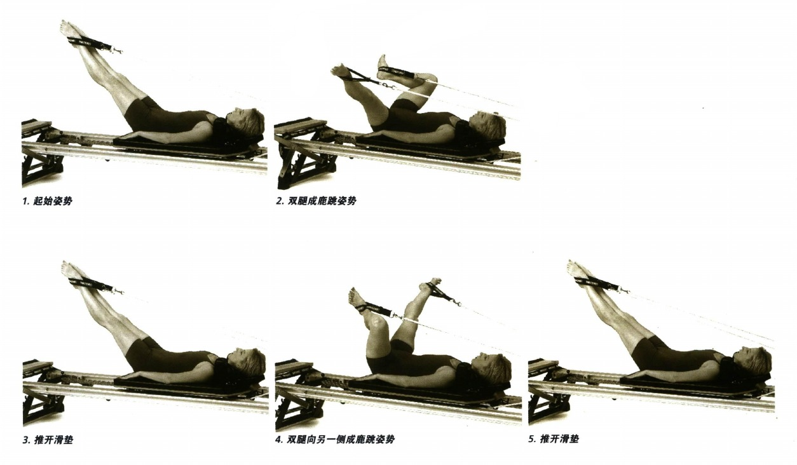

### 協調性 (COORDINATION)

- 頁碼：p.54-55
- 器械/章節：腳踏桿、彈簧、拉環與繩索
- 摘要：協調性：主要歸入核心與腰骨盆穩定、脊椎活動、肩胛與上背穩定、背闊肌與拉力鏈；依頁面標題、動作說明與動作圖整理。
- 動作索引：[[../exercises/reformer-intermediate-exercises#協調性|查看完整條目]]
- 代表圖：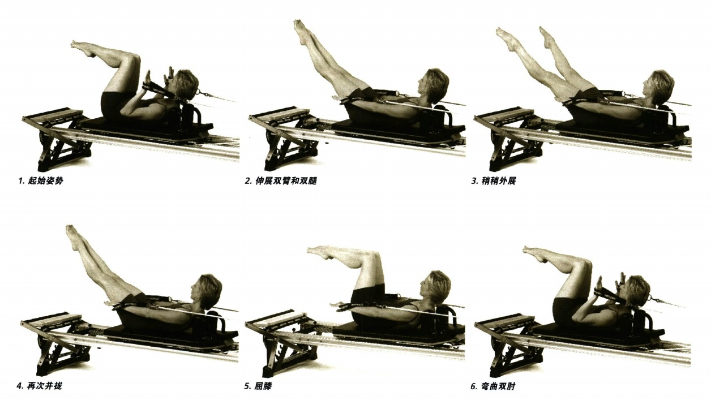

### 後劃 (BACK ROWING)

- 頁碼：p.56-60
- 器械/章節：腳踏桿、彈簧、頭墊、拉環與繩索
- 摘要：後劃：主要歸入核心與腰骨盆穩定、脊椎活動、肩胛與上背穩定、背闊肌與拉力鏈；依 OCR 原理/目標肌肉段落整理。
- 動作索引：[[../exercises/reformer-intermediate-exercises#後劃|查看完整條目]]
- 代表圖：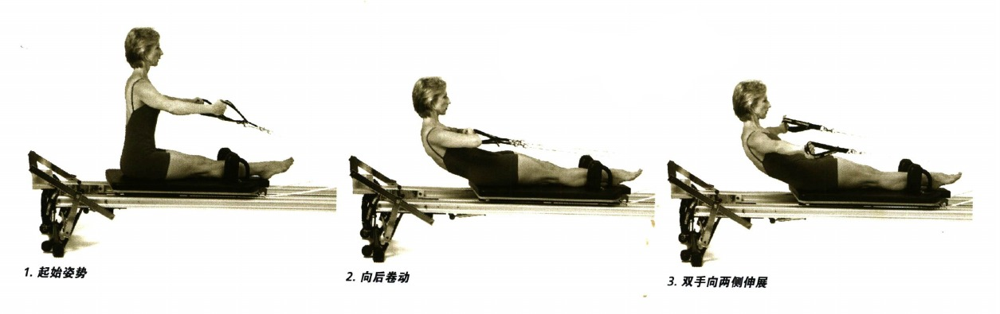

### 前劃 (FRONT ROWING)

- 頁碼：p.61-68
- 器械/章節：腳踏桿、彈簧、拉環與繩索
- 摘要：前劃：主要歸入核心與腰骨盆穩定、脊椎活動、肩胛與上背穩定、背闊肌與拉力鏈；依 OCR 原理/目標肌肉段落整理。
- 動作索引：[[../exercises/reformer-intermediate-exercises#前劃|查看完整條目]]
- 代表圖：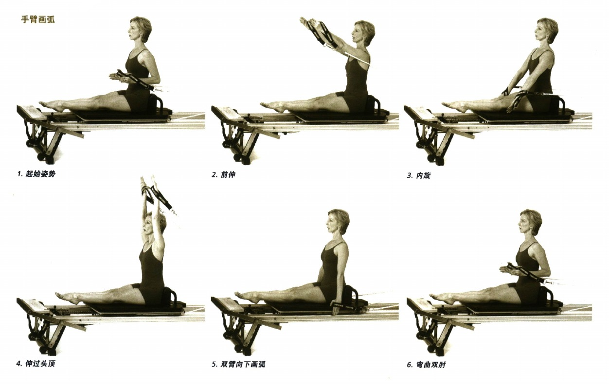

### 腹部按摩 (STOMACH MASSAGE)

- 頁碼：p.69-73
- 器械/章節：腳踏桿、彈簧
- 摘要：腹部按摩：主要歸入核心與腰骨盆穩定、脊椎活動、肩胛與上背穩定、手臂與胸肩；依 OCR 原理/目標肌肉段落整理。
- 動作索引：[[../exercises/reformer-intermediate-exercises#腹部按摩|查看完整條目]]
- 代表圖：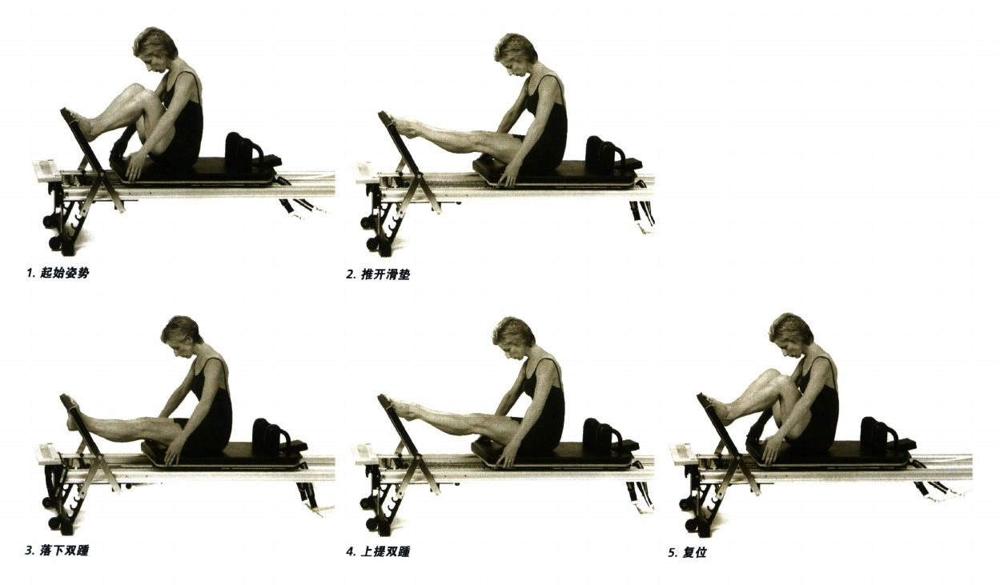

### 雙臂拉動拉環 盒子豎放 (ARMS PULLING STRAPS, LONG BOX)

- 頁碼：p.74-76
- 器械/章節：腳踏桿、彈簧、頭墊、拉環與繩索、塑身機盒子
- 摘要：雙臂拉動拉環 盒子豎放：主要歸入核心與腰骨盆穩定、脊椎活動、肩胛與上背穩定、背闊肌與拉力鏈；依 OCR 原理/目標肌肉段落整理。
- 動作索引：[[../exercises/reformer-intermediate-exercises#雙臂拉動拉環-盒子豎放|查看完整條目]]
- 代表圖：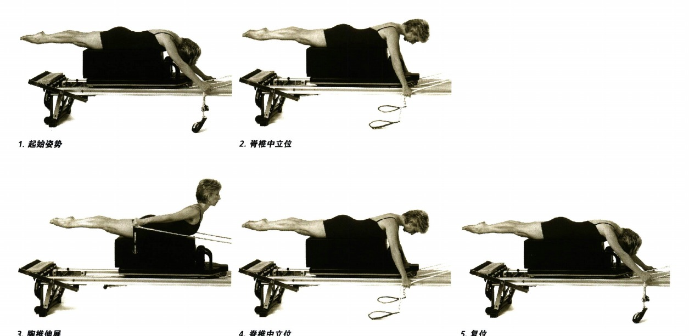

### 仰泳練習準備動作 盒子豎放 (BACKSTROKE PREP LONG BOX)

- 頁碼：p.77
- 器械/章節：腳踏桿、彈簧、拉環與繩索、塑身機盒子
- 摘要：仰泳練習準備動作 盒子豎放：主要歸入核心與腰骨盆穩定、脊椎活動、肩胛與上背穩定、背闊肌與拉力鏈；依 OCR 原理/目標肌肉段落整理。
- 動作索引：[[../exercises/reformer-intermediate-exercises#仰泳練習準備動作-盒子豎放|查看完整條目]]
- 代表圖：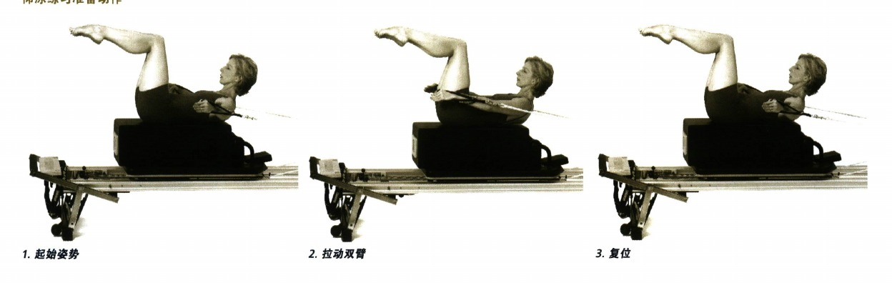

### 腳拉動拉環 盒子 (FEET PULLING STRAPS, BOX)

- 頁碼：p.78-83
- 器械/章節：腳踏桿、彈簧、拉環與繩索、塑身機盒子
- 摘要：腳拉動拉環 盒子：主要歸入核心與腰骨盆穩定、脊椎活動、肩胛與上背穩定、背闊肌與拉力鏈；依 OCR 原理/目標肌肉段落整理。
- 動作索引：[[../exercises/reformer-intermediate-exercises#腳拉動拉環-盒子|查看完整條目]]
- 代表圖：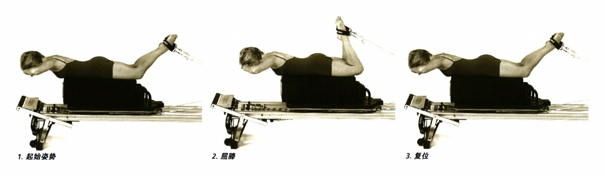

### 弓背

- 頁碼：p.84
- 器械/章節：腳踏桿、彈簧、頭墊、塑身機盒子、腳帶
- 摘要：弓背：主要歸入核心與腰骨盆穩定、脊椎活動、肩胛與上背穩定、髖與腿；依頁面標題、動作說明與動作圖整理。
- 動作索引：[[../exercises/reformer-intermediate-exercises#弓背|查看完整條目]]
- 代表圖：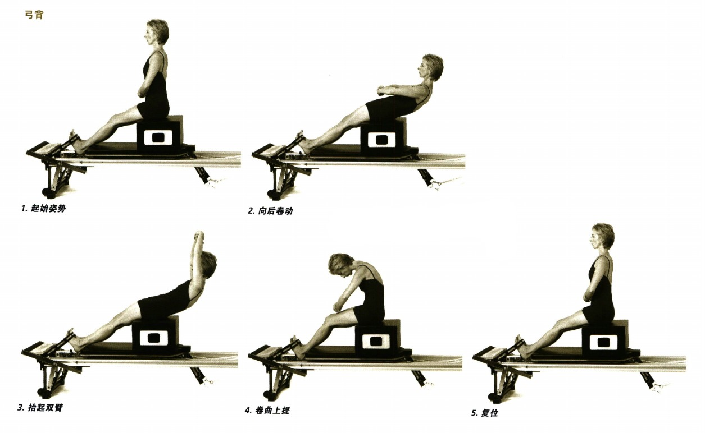

### 直背 盒子橫放 (STRAIGHT BACK, SHORT BOX)

- 頁碼：p.85
- 器械/章節：腳踏桿、彈簧、頭墊、塑身機盒子、腳帶
- 摘要：直背 盒子橫放：主要歸入核心與腰骨盆穩定、脊椎活動、肩胛與上背穩定、髖與腿；依 OCR 原理/目標肌肉段落整理。
- 動作索引：[[../exercises/reformer-intermediate-exercises#直背-盒子橫放|查看完整條目]]
- 代表圖：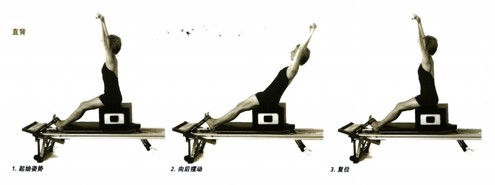

### 弓背扭轉 盒子橫放 (1 TWIST WITH ROUND BACK, SHORT BOX)

- 頁碼：p.86-87
- 器械/章節：腳踏桿、彈簧、塑身機盒子、腳帶
- 摘要：弓背扭轉 盒子橫放：主要歸入核心與腰骨盆穩定、脊椎活動、肩胛與上背穩定、髖與腿；依頁面標題、動作說明與動作圖整理。
- 動作索引：[[../exercises/reformer-intermediate-exercises#弓背扭轉-盒子橫放|查看完整條目]]
- 代表圖：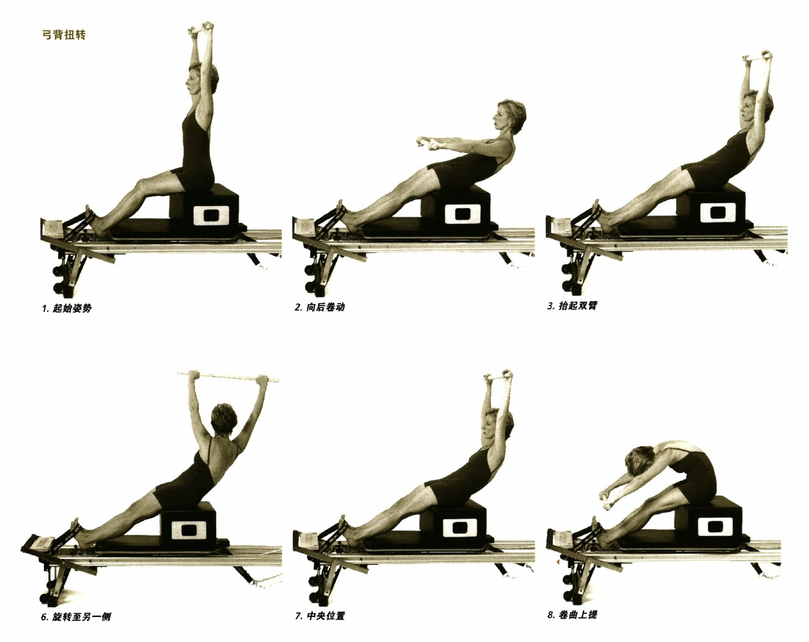

### 傾斜 盒子橫放 (LEAN, SHORT BOX)

- 頁碼：p.88-89
- 器械/章節：腳踏桿、彈簧、頭墊、塑身機盒子、腳帶
- 摘要：傾斜 盒子橫放：主要歸入核心與腰骨盆穩定、脊椎活動、肩胛與上背穩定、背闊肌與拉力鏈；依 OCR 原理/目標肌肉段落整理。
- 動作索引：[[../exercises/reformer-intermediate-exercises#傾斜-盒子橫放|查看完整條目]]
- 代表圖：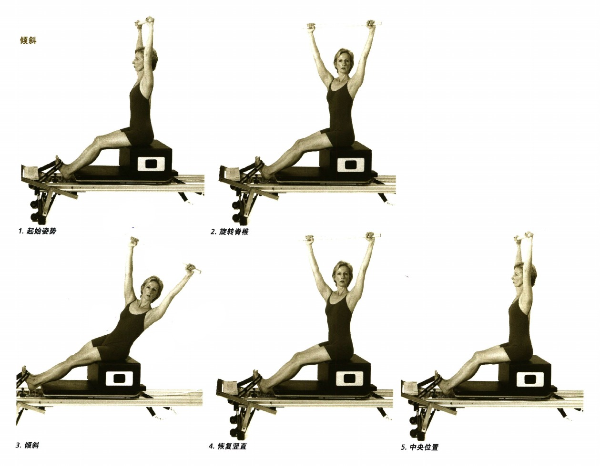

### 樹姿 盒子橫放 (TREE, SHORT BOX)

- 頁碼：p.90-91
- 器械/章節：腳踏桿、彈簧、頭墊、塑身機盒子、腳帶
- 摘要：樹姿 盒子橫放：主要歸入核心與腰骨盆穩定、脊椎活動、肩胛與上背穩定、髖與腿；依頁面標題、動作說明與動作圖整理。
- 動作索引：[[../exercises/reformer-intermediate-exercises#樹姿-盒子橫放|查看完整條目]]
- 代表圖：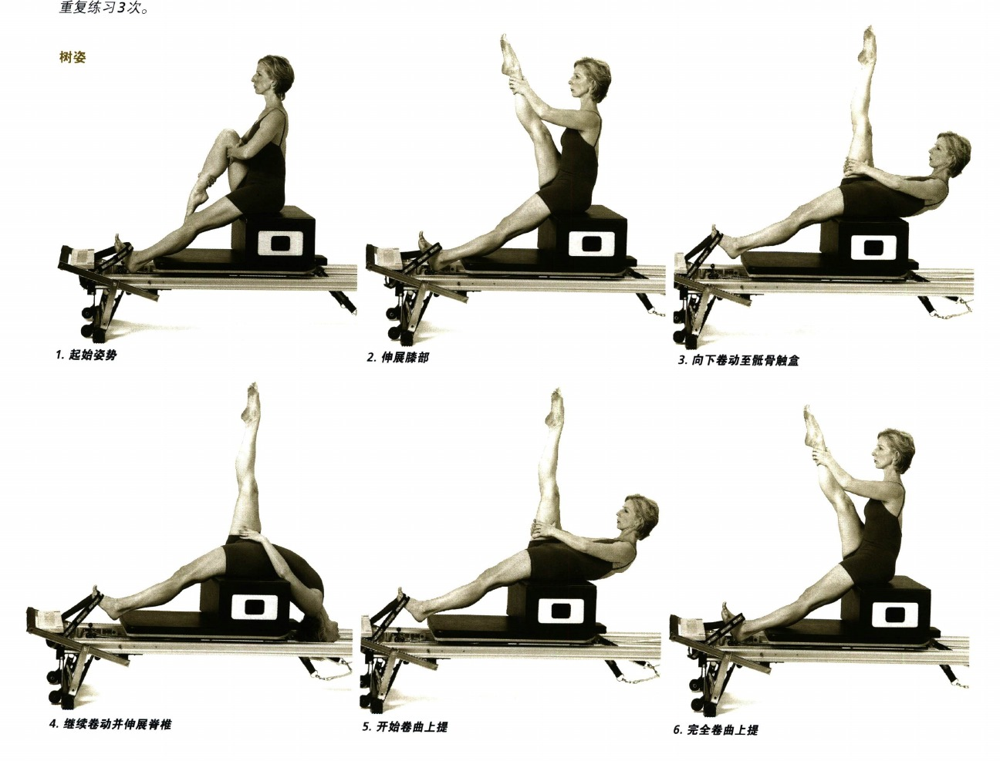

### 美人魚姿 盒子橫放 (MERMAID, SHORT BOX)

- 頁碼：p.92-97
- 器械/章節：腳踏桿、彈簧、頭墊、塑身機盒子、腳帶
- 摘要：美人魚姿 盒子橫放：主要歸入核心與腰骨盆穩定、脊椎活動、肩胛與上背穩定、手臂與胸肩；依 OCR 原理/目標肌肉段落整理。
- 動作索引：[[../exercises/reformer-intermediate-exercises#美人魚姿-盒子橫放|查看完整條目]]
- 代表圖：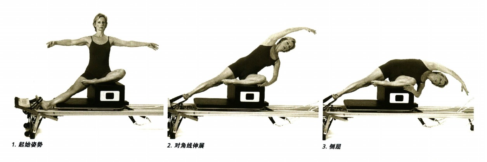

### 直線伸展 (LONG STRETCH)

- 頁碼：p.98-99
- 器械/章節：腳踏桿、彈簧、頭墊
- 摘要：直線伸展：主要歸入核心與腰骨盆穩定、脊椎活動、肩胛與上背穩定、背闊肌與拉力鏈；依頁面標題、動作說明與動作圖整理。
- 動作索引：[[../exercises/reformer-intermediate-exercises#直線伸展|查看完整條目]]
- 代表圖：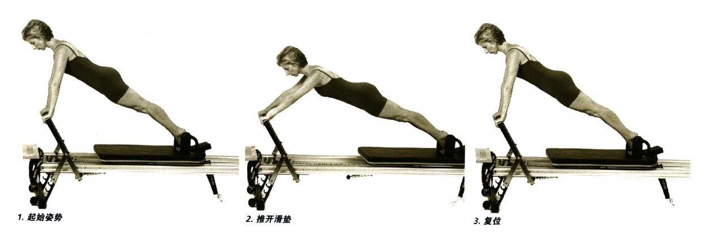

### 向下伸展 (DOWN STRETCH)

- 頁碼：p.100-101
- 器械/章節：腳踏桿、彈簧
- 摘要：向下伸展：主要歸入核心與腰骨盆穩定、脊椎活動、肩胛與上背穩定、背闊肌與拉力鏈；依頁面標題、動作說明與動作圖整理。
- 動作索引：[[../exercises/reformer-intermediate-exercises#向下伸展|查看完整條目]]
- 代表圖：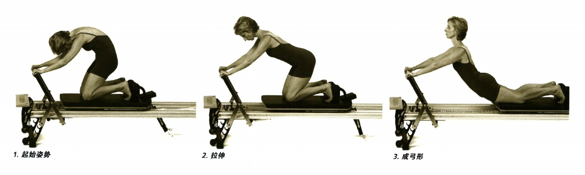

### 向上伸展 (UP STRETCH)

- 頁碼：p.102-103
- 器械/章節：腳踏桿、彈簧
- 摘要：向上伸展：主要歸入核心與腰骨盆穩定、脊椎活動、肩胛與上背穩定、背闊肌與拉力鏈；依 OCR 原理/目標肌肉段落整理。
- 動作索引：[[../exercises/reformer-intermediate-exercises#向上伸展|查看完整條目]]
- 代表圖：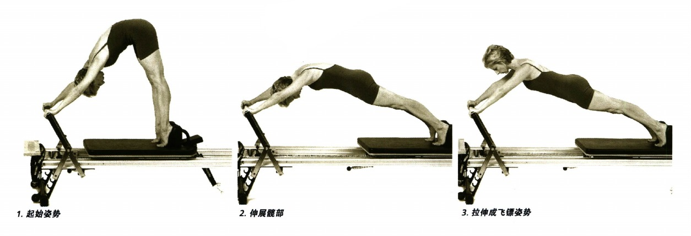

### 大象姿 (ELEPHANT)

- 頁碼：p.104-105
- 器械/章節：腳踏桿、彈簧
- 摘要：大象姿：主要歸入核心與腰骨盆穩定、脊椎活動、肩胛與上背穩定、手臂與胸肩；依 OCR 原理/目標肌肉段落整理。
- 動作索引：[[../exercises/reformer-intermediate-exercises#大象姿|查看完整條目]]
- 代表圖：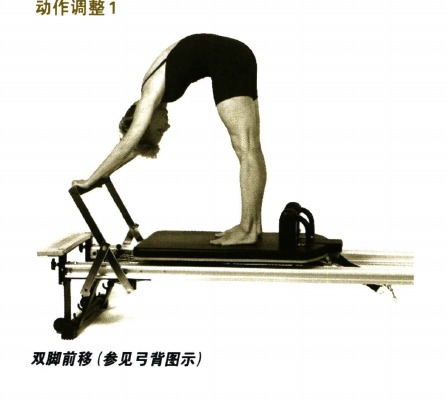

### 半弧 (SEMICIRCLE)

- 頁碼：p.106-108
- 器械/章節：腳踏桿、彈簧
- 摘要：半弧：主要歸入核心與腰骨盆穩定、脊椎活動、肩胛與上背穩定、手臂與胸肩；依 OCR 原理/目標肌肉段落整理。
- 動作索引：[[../exercises/reformer-intermediate-exercises#半弧|查看完整條目]]
- 代表圖：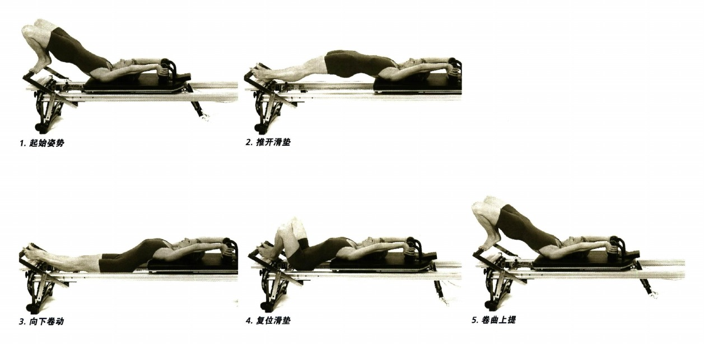

### 胸部擴張 (CHEST EXPANSION)

- 頁碼：p.109-111
- 器械/章節：腳踏桿、彈簧、拉環與繩索
- 摘要：胸部擴張：主要歸入核心與腰骨盆穩定、脊椎活動、肩胛與上背穩定、背闊肌與拉力鏈；依 OCR 原理/目標肌肉段落整理。
- 動作索引：[[../exercises/reformer-intermediate-exercises#胸部擴張|查看完整條目]]
- 代表圖：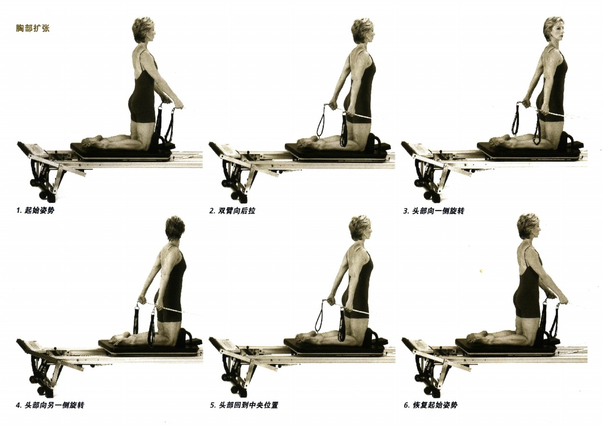

### 側跪手臂準備動作 (SIDE ARM PREPS KNEELING)

- 頁碼：p.112-119
- 器械/章節：腳踏桿、彈簧、拉環與繩索
- 摘要：側跪手臂準備動作：主要歸入核心與腰骨盆穩定、脊椎活動、肩胛與上背穩定、手臂與胸肩；依 OCR 原理/目標肌肉段落整理。
- 動作索引：[[../exercises/reformer-intermediate-exercises#側跪手臂準備動作|查看完整條目]]
- 代表圖：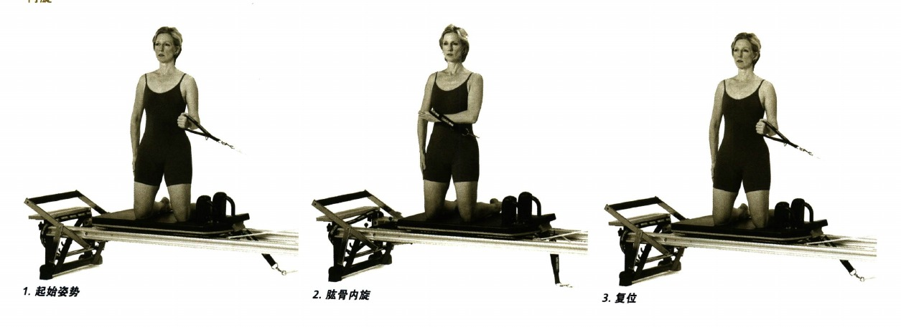

### 側跪扭轉

- 頁碼：p.120
- 器械/章節：腳踏桿、彈簧、拉環與繩索
- 摘要：側跪扭轉：主要歸入核心與腰骨盆穩定、脊椎活動、肩胛與上背穩定、手臂與胸肩；依 OCR 原理/目標肌肉段落整理。
- 動作索引：[[../exercises/reformer-intermediate-exercises#側跪扭轉|查看完整條目]]
- 代表圖：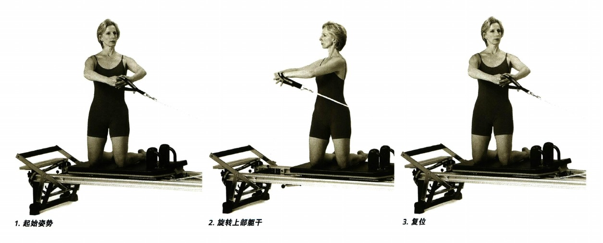

### 反向擴張 (REVERSE EXPANSION)

- 頁碼：p.121-125
- 器械/章節：腳踏桿、彈簧、拉環與繩索
- 摘要：反向擴張：主要歸入核心與腰骨盆穩定、脊椎活動、肩胛與上背穩定、手臂與胸肩；依 OCR 原理/目標肌肉段落整理。
- 動作索引：[[../exercises/reformer-intermediate-exercises#反向擴張|查看完整條目]]
- 代表圖：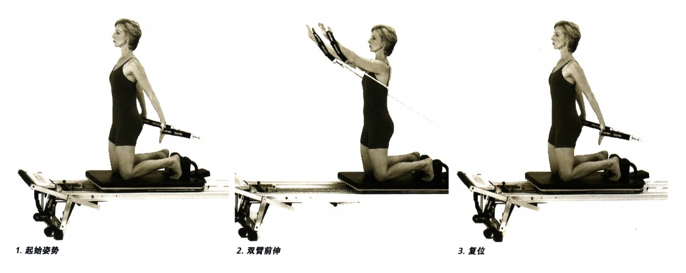

### 美人魚姿 (MERMAID)

- 頁碼：p.126-129
- 器械/章節：腳踏桿、彈簧
- 摘要：美人魚姿：主要歸入核心與腰骨盆穩定、脊椎活動、肩胛與上背穩定、手臂與胸肩；依 OCR 原理/目標肌肉段落整理。
- 動作索引：[[../exercises/reformer-intermediate-exercises#美人魚姿|查看完整條目]]
- 代表圖：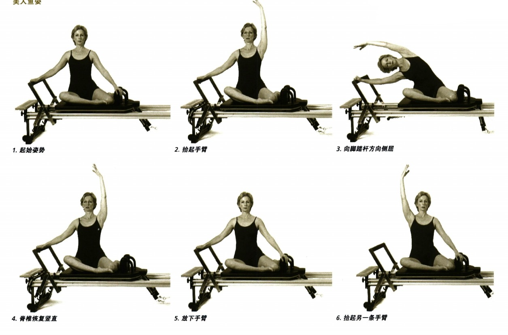

### 雙腿畫弧 (LEG CIRCLES)

- 頁碼：p.130-133
- 器械/章節：腳踏桿、彈簧、頭墊、拉環與繩索
- 摘要：雙腿畫弧：主要歸入核心與腰骨盆穩定、脊椎活動、手臂與胸肩、髖與腿；依 OCR 原理/目標肌肉段落整理。
- 動作索引：[[../exercises/reformer-intermediate-exercises#雙腿畫弧|查看完整條目]]
- 代表圖：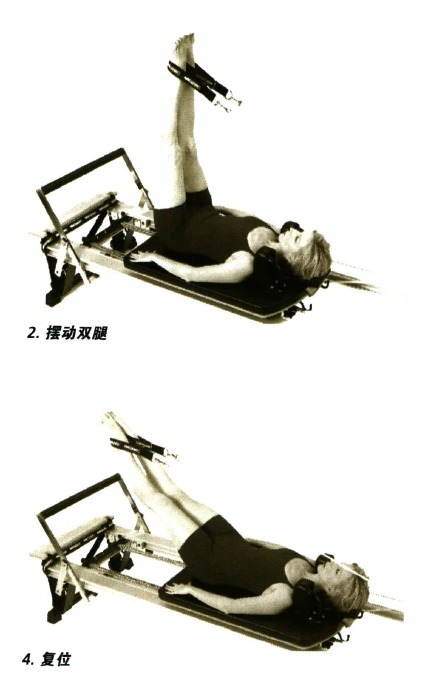

### 脊椎伸展 (LONG SPINE)

- 頁碼：p.134-135
- 器械/章節：腳踏桿、彈簧、拉環與繩索
- 摘要：脊椎伸展：主要歸入核心與腰骨盆穩定、脊椎活動、肩胛與上背穩定、手臂與胸肩；依頁面標題、動作說明與動作圖整理。
- 動作索引：[[../exercises/reformer-intermediate-exercises#脊椎伸展|查看完整條目]]
- 代表圖：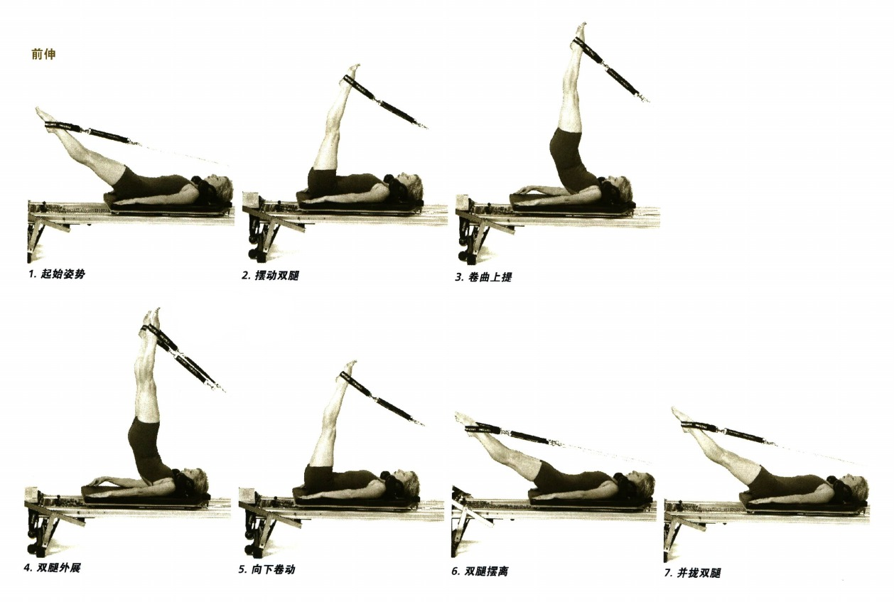

### 膝部伸展 (KNEE STRETCHES)

- 頁碼：p.136-139
- 器械/章節：腳踏桿、彈簧
- 摘要：膝部伸展：主要歸入核心與腰骨盆穩定、脊椎活動、肩胛與上背穩定、手臂與胸肩；依 OCR 原理/目標肌肉段落整理。
- 動作索引：[[../exercises/reformer-intermediate-exercises#膝部伸展|查看完整條目]]
- 代表圖：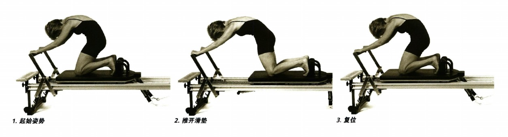

### 跑步運動 (RUNNING)

- 頁碼：p.140-142
- 器械/章節：腳踏桿、彈簧、頭墊
- 摘要：跑步運動：主要歸入核心與腰骨盆穩定、脊椎活動、手臂與胸肩、髖與腿；依頁面標題、動作說明與動作圖整理。
- 動作索引：[[../exercises/reformer-intermediate-exercises#跑步運動|查看完整條目]]
- 代表圖：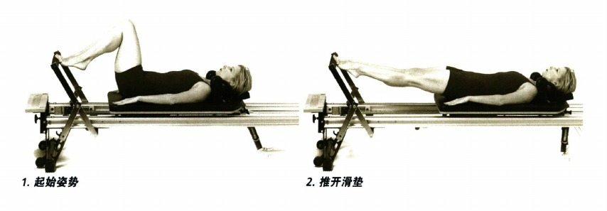

### 髖部上抬 (HIP LIFT)

- 頁碼：p.143
- 器械/章節：腳踏桿、彈簧、頭墊
- 摘要：髖部上抬：主要歸入核心與腰骨盆穩定、脊椎活動、肩胛與上背穩定、髖與腿；依頁面標題、動作說明與動作圖整理。
- 動作索引：[[../exercises/reformer-intermediate-exercises#髖部上抬|查看完整條目]]
- 代表圖：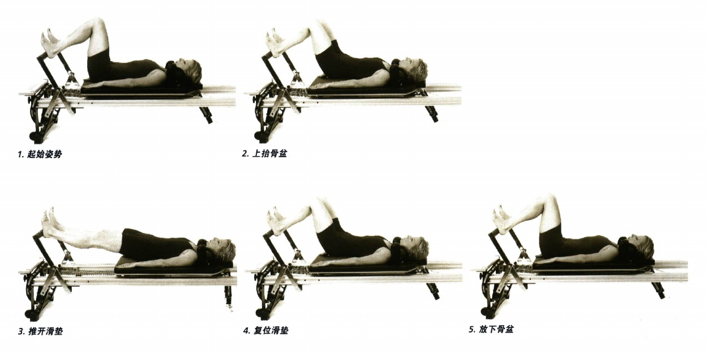

### 髖部起伏 (HIP ROLLS)

- 頁碼：p.144-145
- 器械/章節：腳踏桿、彈簧、頭墊
- 摘要：髖部起伏：主要歸入核心與腰骨盆穩定、脊椎活動、肩胛與上背穩定、髖與腿；依頁面標題、動作說明與動作圖整理。
- 動作索引：[[../exercises/reformer-intermediate-exercises#髖部起伏|查看完整條目]]
- 代表圖：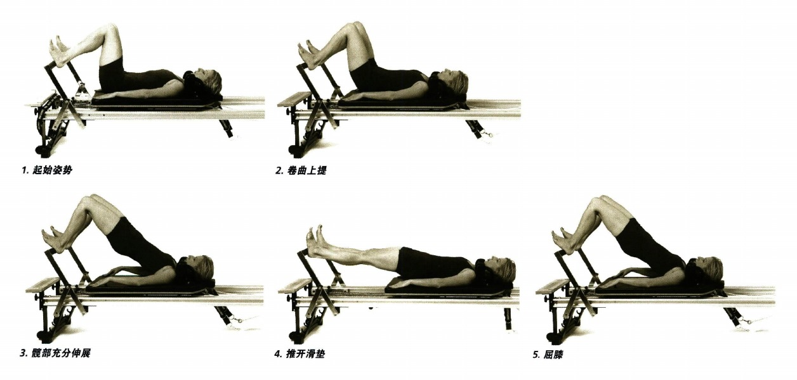

### 單側大腿伸展 (SINGLE THIGH STRETCH)

- 頁碼：p.146-147
- 器械/章節：腳踏桿、彈簧
- 摘要：單側大腿伸展：主要歸入核心與腰骨盆穩定、脊椎活動、肩胛與上背穩定、手臂與胸肩；依 OCR 原理/目標肌肉段落整理。
- 動作索引：[[../exercises/reformer-intermediate-exercises#單側大腿伸展|查看完整條目]]
- 代表圖：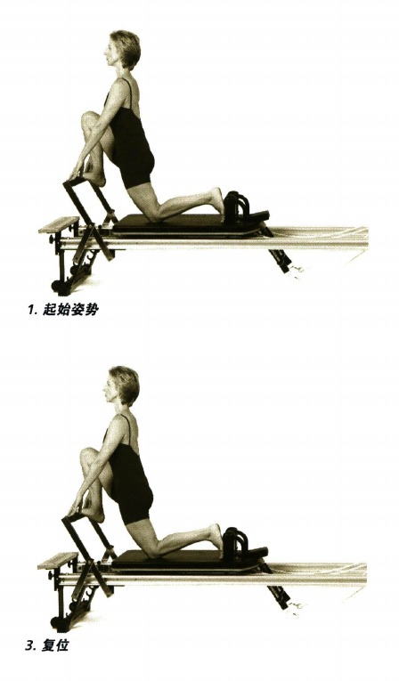

### 前劈叉 (FRONT SPLITS)

- 頁碼：p.148-149
- 器械/章節：腳踏桿、彈簧
- 摘要：前劈叉：主要歸入核心與腰骨盆穩定、脊椎活動、肩胛與上背穩定、髖與腿；依 OCR 原理/目標肌肉段落整理。
- 動作索引：[[../exercises/reformer-intermediate-exercises#前劈叉|查看完整條目]]
- 代表圖：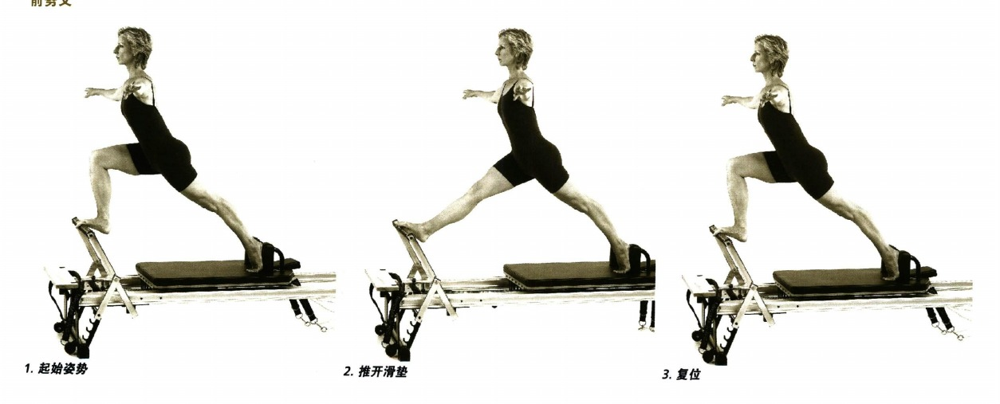

### 後劈叉 (BACK SPLITS)

- 頁碼：p.150-151
- 器械/章節：腳踏桿、彈簧、頭墊
- 摘要：後劈叉：主要歸入核心與腰骨盆穩定、脊椎活動、肩胛與上背穩定、手臂與胸肩；依 OCR 原理/目標肌肉段落整理。
- 動作索引：[[../exercises/reformer-intermediate-exercises#後劈叉|查看完整條目]]
- 代表圖：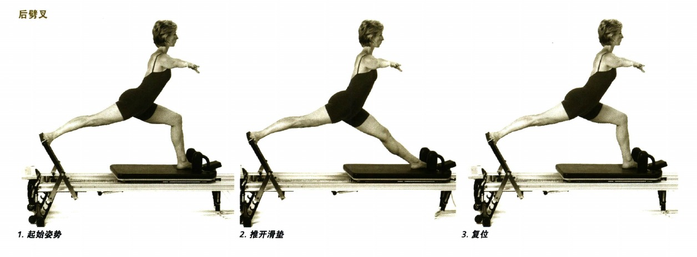

### 側劈叉 (SIDE SPLITS)

- 頁碼：p.152-160
- 器械/章節：腳踏桿、彈簧
- 摘要：側劈叉：主要歸入核心與腰骨盆穩定、脊椎活動、肩胛與上背穩定、手臂與胸肩；依 OCR 原理/目標肌肉段落整理。
- 動作索引：[[../exercises/reformer-intermediate-exercises#側劈叉|查看完整條目]]
- 代表圖：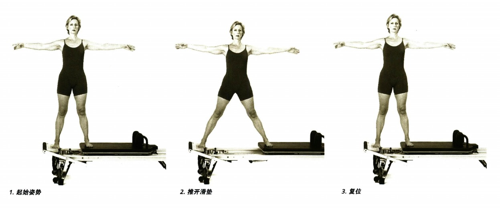

### 星形姿準備動作 (STAR PREP)

- 頁碼：p.161
- 器械/章節：腳踏桿、彈簧
- 摘要：星形姿準備動作：主要歸入核心與腰骨盆穩定、脊椎活動、肩胛與上背穩定、背闊肌與拉力鏈；依 OCR 原理/目標肌肉段落整理。
- 動作索引：[[../exercises/reformer-intermediate-exercises#星形姿準備動作|查看完整條目]]
- 代表圖：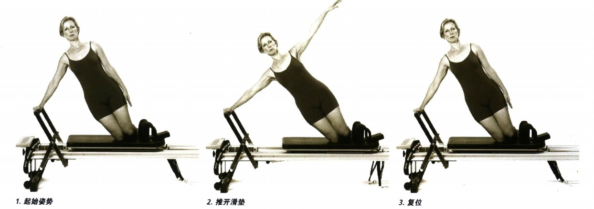
