# 脊椎屈曲、伸展與側屈

逐節活動、捲動、背伸展、側屈，以及豎脊肌和腰方肌等重點。

## 主要線索

- 屈曲類動作強調從頭部或尾椎骨開始逐節活動，不以髖屈替代脊椎捲動。
- 伸展類動作以豎脊肌為主動，同時要求腹斜肌限制腰椎過伸。

## 相關動作

### 五大基本原則 (Breathing / Pelvic / Rib Cage / Scapula / Head-Cervical Placement)

- 頁碼：p.8-17
- 摘要：呼吸、骨盆、肋骨架、肩胛、頭頸體位；後續練習的穩定性語言。
- 動作索引：[[../exercises/cadillac-beginner-exercises#五大基本原則|檢視完整條目]]
- 代表截圖：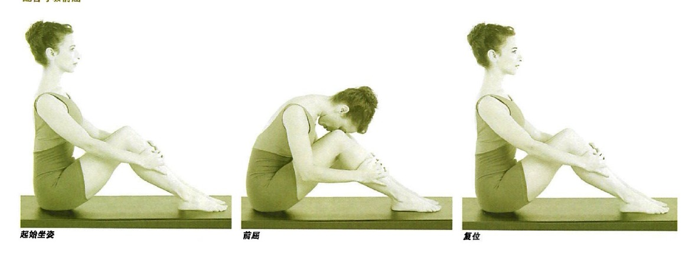

### 後卷 (Roll-Down)

- 頁碼：p.24-25
- 摘要：腹直肌/腹斜肌帶動脊柱屈曲，臀大肌和胭繩肌協助骨盆後部靠向股骨後部。
- 動作索引：[[../exercises/cadillac-beginner-exercises#後卷|檢視完整條目]]
- 代表截圖：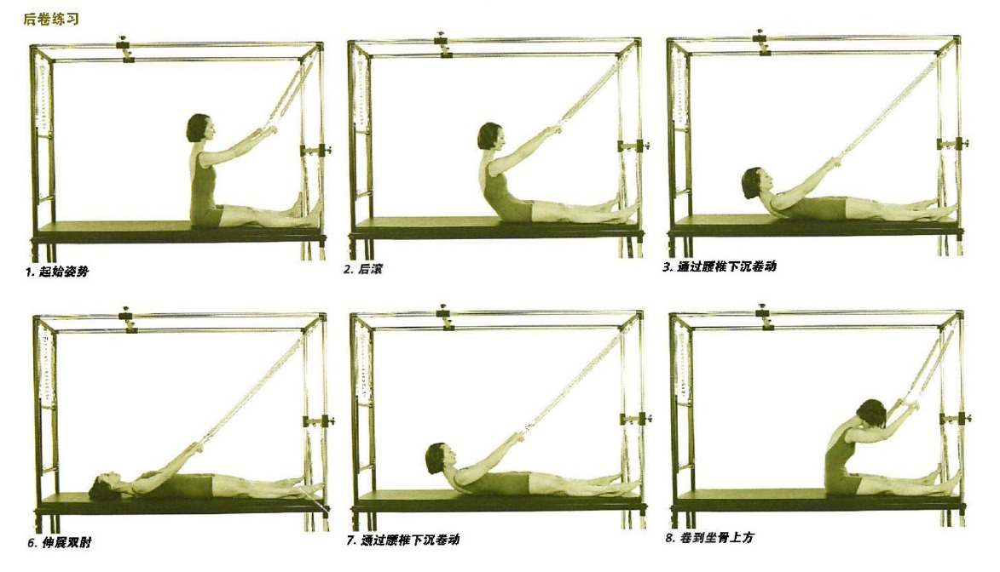

### 後卷加背部伸展準備動作 (Roll-Down with Back Extension Prep)

- 頁碼：p.26-27
- 摘要：在後卷基礎上加入豎脊肌伸展與腹斜肌防止腰椎過伸。
- 動作索引：[[../exercises/cadillac-beginner-exercises#後卷加背部伸展準備動作|檢視完整條目]]
- 代表截圖：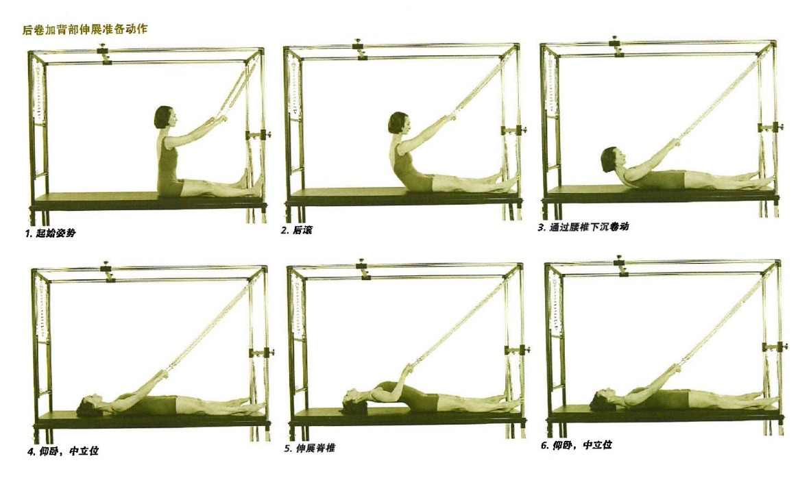

### 飛翔動作準備動作 (Airplane Prep)

- 頁碼：p.28-29
- 摘要：強調逐節捲動、骨盆回落與腿部控制。
- 動作索引：[[../exercises/cadillac-beginner-exercises#飛翔動作準備動作|檢視完整條目]]
- 代表截圖：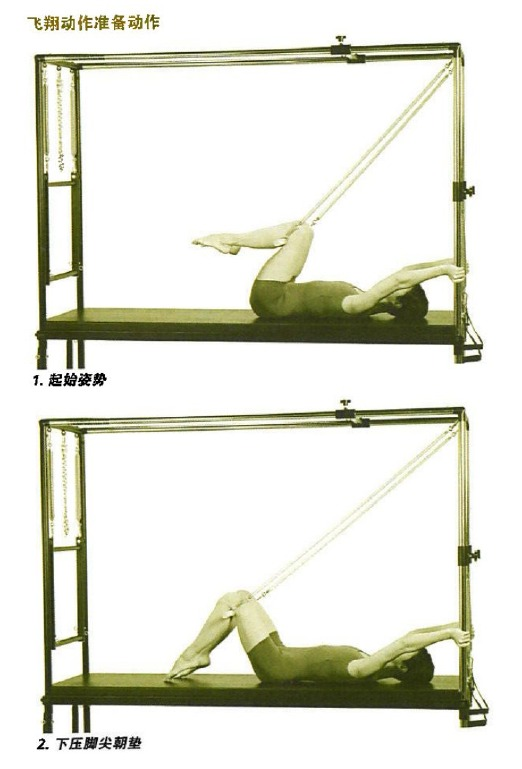

### 呼吸 (Breathing)

- 頁碼：p.36-37
- 摘要：捲起時腹肌和臀腿後側參與，杆下拉時背闊肌/大圓肌參與。
- 動作索引：[[../exercises/cadillac-beginner-exercises#呼吸|檢視完整條目]]
- 代表截圖：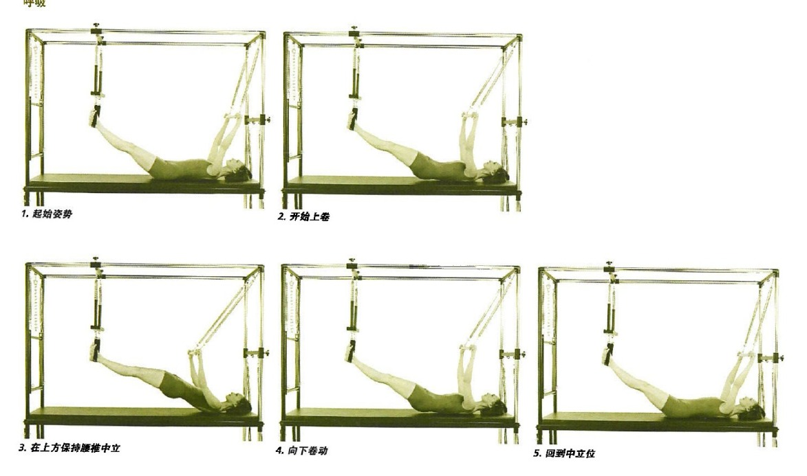

### 仰臥推拉加捲曲上提練習 (Push-Thru on Back with Roll Up)

- 頁碼：p.48-49
- 摘要：上肢推拉與腹直肌/腹斜肌捲起結合。
- 動作索引：[[../exercises/cadillac-beginner-exercises#仰臥推拉加捲曲上提練習|檢視完整條目]]
- 代表截圖：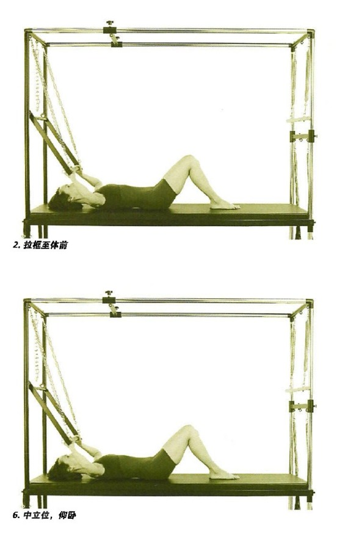

### 平行伸展準備動作 (Teaser Prep)

- 頁碼：p.50-51
- 摘要：以彈簧輔助脊椎屈曲，腹肌控制骨盆後傾和腿部抬放。
- 動作索引：[[../exercises/cadillac-beginner-exercises#平行伸展準備動作|檢視完整條目]]
- 代表截圖：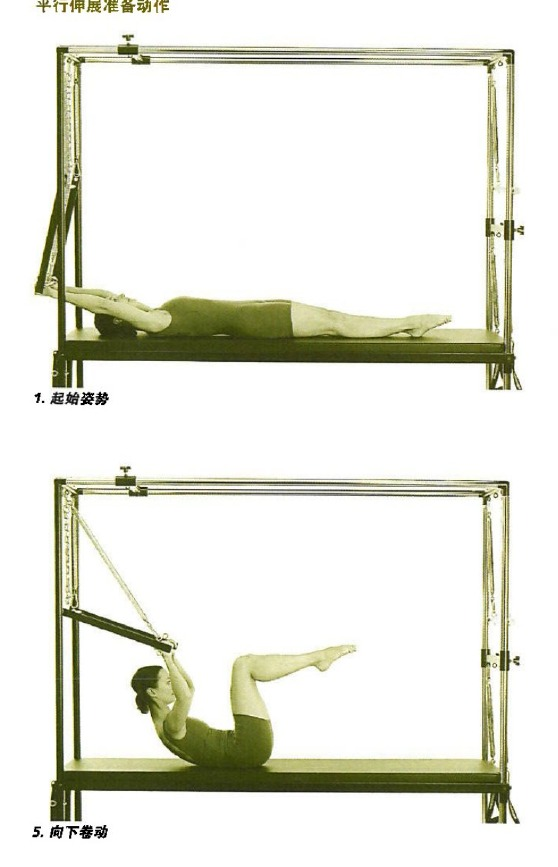

### 貓背準備動作 (Cat Prep)

- 頁碼：p.52-53
- 摘要：脊椎屈曲/伸展、背闊肌維持框壓力，臀大肌/胭繩肌協助骨盆控制。
- 動作索引：[[../exercises/cadillac-beginner-exercises#貓背準備動作|檢視完整條目]]
- 代表截圖：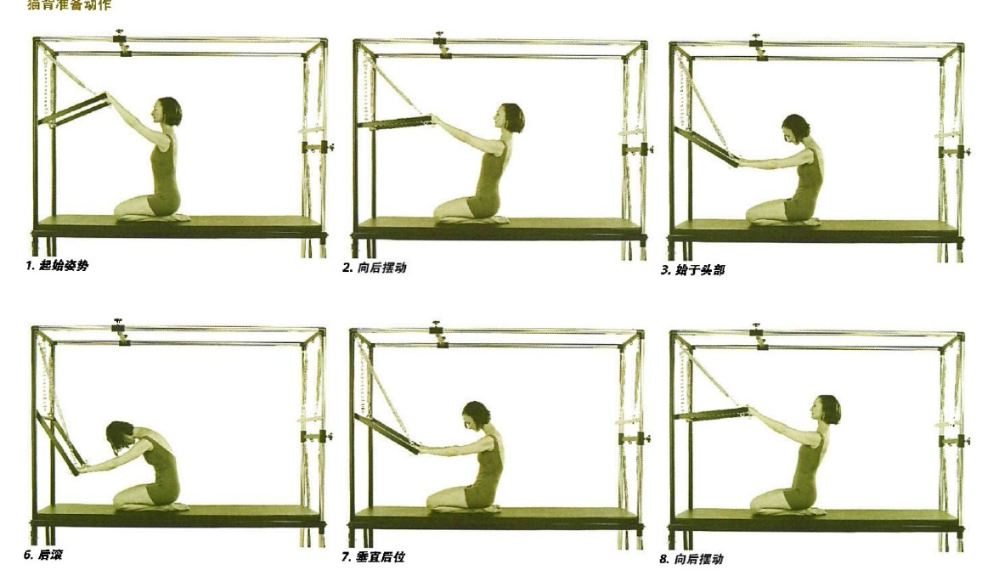

### 天鵝潛水 (Swan Dive)

- 頁碼：p.54-55
- 摘要：豎脊肌背伸展，腹斜肌限制腰椎過伸，臀大肌/胭繩肌維持骨盆。
- 動作索引：[[../exercises/cadillac-beginner-exercises#天鵝潛水|檢視完整條目]]
- 代表截圖：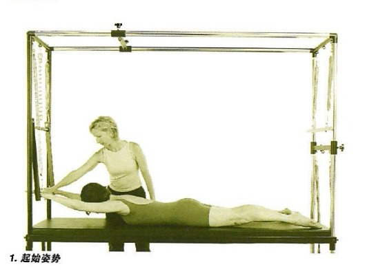

### 俯臥推拉加後背伸展 (Push-Thru on Stomach with Back Extension Prep)

- 頁碼：p.56-57
- 摘要：中上部豎脊肌伸展，背闊肌/大圓肌/二頭肌帶框至腦後。
- 動作索引：[[../exercises/cadillac-beginner-exercises#俯臥推拉加後背伸展|檢視完整條目]]
- 代表截圖：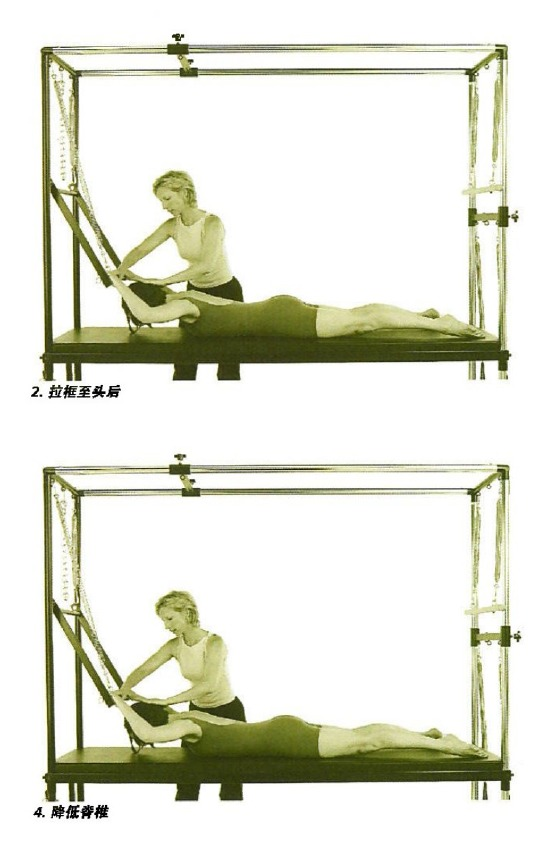

### 美人魚姿 (Mermaid)

- 頁碼：p.60-61
- 摘要：腹斜肌控制側屈，背闊肌/大圓肌控制手臂下拉，骨盆保持穩定。
- 動作索引：[[../exercises/cadillac-beginner-exercises#美人魚姿|檢視完整條目]]
- 代表截圖：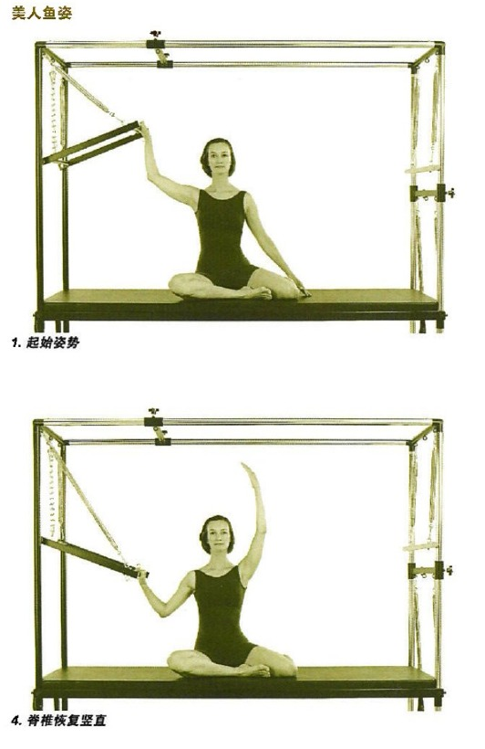

### 推拉向前 (Forward Push-Thru)

- 頁碼：p.62-63
- 摘要：腹直肌/腹斜肌使脊椎彎曲，背闊肌/大圓肌下壓框並穩定肩。
- 動作索引：[[../exercises/cadillac-beginner-exercises#推拉向前|檢視完整條目]]
- 代表截圖：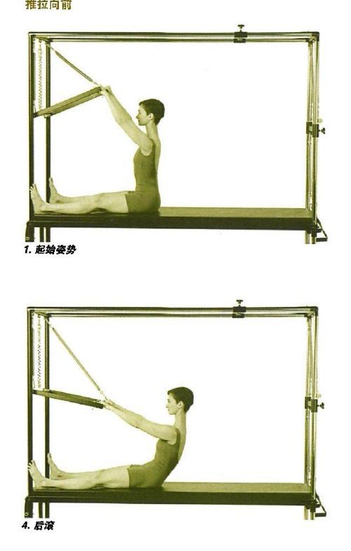

### 後劃準備動作 (Back Rowing Preps)

- 頁碼：p.78-87
- 摘要：後劃、開肘、飛翔、二頭肌、三頭肌和後卷變化；同時訓練後側肩帶與軀幹控制。
- 動作索引：[[../exercises/cadillac-beginner-exercises#後劃準備動作|檢視完整條目]]
- 代表截圖：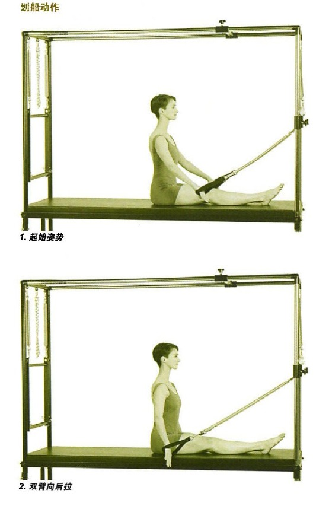

### 前劃準備動作 (Front Rowing Preps)

- 頁碼：p.88-91
- 摘要：向前伸直、第二種姿勢、雙手上託；前方肩帶動作配合中立坐姿。
- 動作索引：[[../exercises/cadillac-beginner-exercises#前劃準備動作|檢視完整條目]]
- 代表截圖：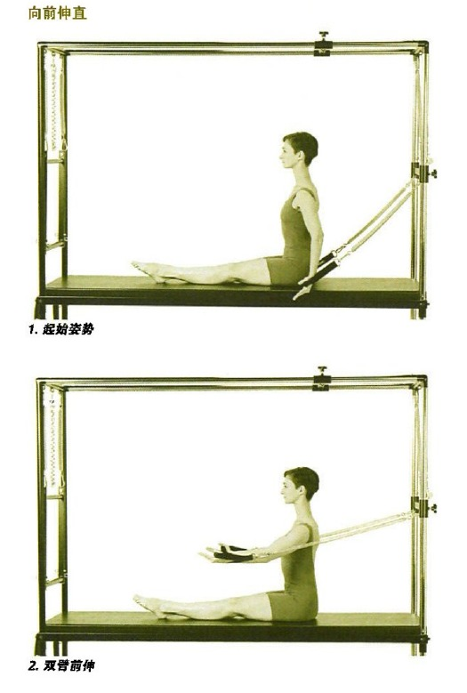

### 側伸展 (Side Stretch)

- 頁碼：p.126-127
- 摘要：側屈中拉伸背闊肌、腹斜肌、腰方肌，並維持軀幹正位。
- 動作索引：[[../exercises/cadillac-beginner-exercises#側伸展|檢視完整條目]]
- 代表截圖：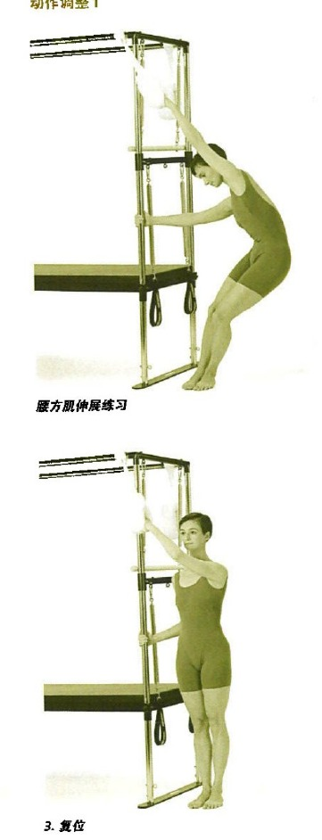

### 推拉框站姿：站立推拉 (Standing Push-Thru)

- 頁碼：p.130-131
- 摘要：腹直肌/腹斜肌捲起，臀大肌/胭繩肌控制骨盆，背闊肌/大圓肌下拉框。
- 動作索引：[[../exercises/cadillac-beginner-exercises#推拉框站姿：站立推拉|檢視完整條目]]
- 代表截圖：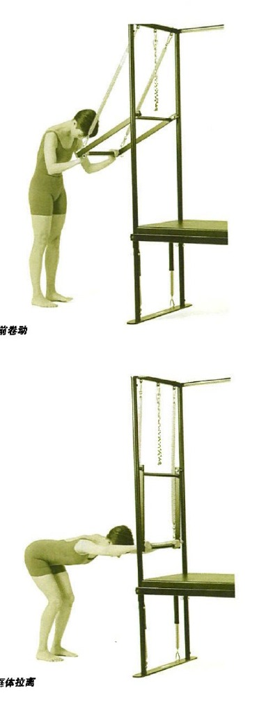